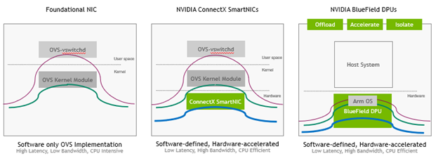
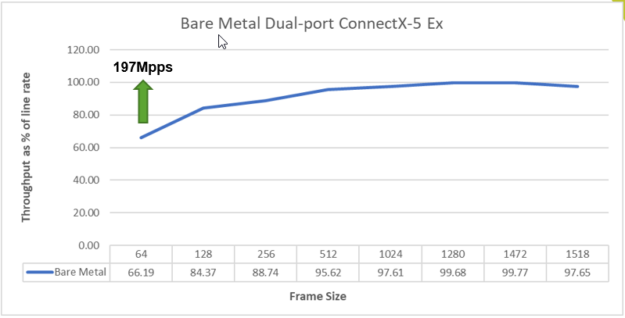
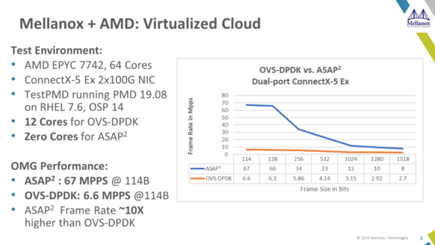
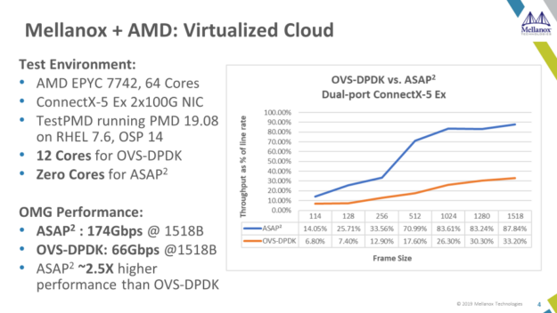
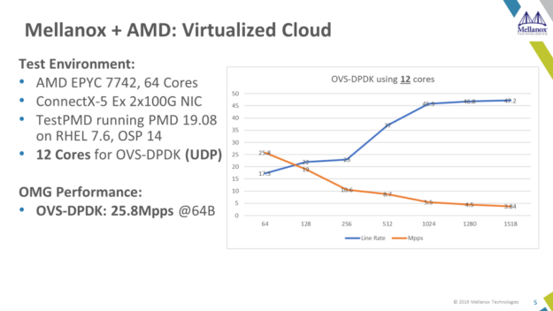

# ASAP²框架

​		《NVIDIA DOCA Emulated Devices User Guide》 ———— NVIDIA 中介设备在 BlueField 系统上允许创建无需 SR-IOV 的加速设备，提供了灵活性。这些中介设备支持网络接口卡(NIC)和 RDMA，并提供与 SR-IOV 虚拟功能(VFs)相同的 ASAP2 卸载级别。中介设备通过 mlx5 子功能加速技术得到支持。

## X 对比框架

**主要区别**：

| 特性         | **ASAP²**                                            | **DOCA**                                           |
| ------------ | ---------------------------------------------------- | -------------------------------------------------- |
| **目标功能** | 主要加速网络流量转发和处理，特别是虚拟化环境中的流量 | 提供全面的数据中心加速平台，包括网络、存储、安全等 |
| **硬件依赖** | 基于 Mellanox 的网卡（如 ConnectX 系列）             | 基于 NVIDIA BlueField DPUs                         |
| **使用场景** | 主要用于网络流量加速，尤其是 OVS 等虚拟化网络        | 更广泛的数据中心加速，支持虚拟化、存储、网络等     |
| **硬件卸载** | 卸载流量处理、流量转发、过滤等任务                   | 卸载更多类型的工作负载，包括网络、存储和安全任务   |
| **开发接口** | 通过 Mellanox 驱动、Flow Steering API 提供硬件加速   | 通过 DOCA SDK 和 API 控制硬件加速，包括 DPU 操作   |

**总结**：

- **ASAP²** 主要专注于网络加速，特别是虚拟化环境中流量的硬件卸载和加速，它通过 Mellanox 的网卡提供硬件加速。
- **DOCA** 是一个更广泛的平台，旨在提供全面的数据中心硬件加速，覆盖从网络、存储到安全等多个领域，尤其是通过 NVIDIA 的 DPUs 提供加速。

因此，虽然两者都属于硬件加速技术，但 **ASAP²** 更加专注于网络加速，特别是在虚拟化和数据中心流量管理方面，而 **DOCA** 则提供了一个更为广泛的数据中心加速平台，支持多种工作负载加速，包括网络、存储、虚拟化和安全等。

## K Mellanox ASAP²

参考：用户手册：https://enterprise-support.nvidia.com/s/article/getting-started-with-mellanox-asap-2
	

**博客**   使用 NVIDIA ASAP²技术保障和加速现代数据中心工作负载：https://developer.nvidia.com/blog/securing-and-accelerating-modern-data-center-workloads-with-nvidia-asap-technology/

ASAP²技术已集成到 Linux 内核和一系列领先的 SDN 框架中。以下图表展示了 NVIDIA SmartNIC 和 DPU 如何利用 ASAP²技术以硬件方式加速 OVS 堆栈：

**博客**   使用 AMD EPYC 7002 和 NVIDIA Mellanox SmartNIC 通过 OvS Over ASAP² 提高 5G 性能：https://developer.nvidia.com/blog/securing-and-accelerating-modern-data-center-workloads-with-nvidia-asap-technology/

**性能测试**

我们决定在虚拟化和裸机[OpenStack云环境中测试基于 AMD EPYC 7002 系列处理器](https://www.mellanox.com/solutions/cloud/reference_openstack)的服务器和 NVIDIA Mellanox ConnectX-5 PCIe Gen4 SmartNIC 。本文总结了我们的电信基准测试的惊人性能结果。

​    图 1.虚拟化电信云测试：针对基于 AMD EPYC 7002 系列处理器的服务器（配备 ConnectX-5 PCIe Gen4 100G 适配器（框架大小）)进行裸机服务器测试

在裸机服务器测试中，我们看到 64 字节帧每秒超过 1.97 亿个数据包 (Mpps)，超过 93 Gbps，或略高于 97% 的线速。在以 1518 字节帧运行并使用 ConnectX-5 的双端口（具有 PCIe Gen4 连接）连接到具有 16 个内核的 AMD EPYC 7002 系列处理器时，仍有充足的空间用于应用程序处理，其中四分之三的内核未使用且可用。

理论上，仅使用支持四个 PCIe Gen4 插槽的单插槽 AMD EPYC 7002 系列处理器 64 核系统，使用 ConnectX-5 SmartNIC，您就可以在单 CPU 服务器上实现 600 Mpps 数据包速率或 400 Gbps 聚合吞吐量。这才是真正的性能！

​	图    2. 基于 AMD EPYC 7002 系列处理器的服务器（配备 ConnectX-5 PCIe Gen4 100G 适配器和 ASAP 2）的帧速率（单位：Mpps)与 OvS-DPDK 的比较

​                 图 3. 基于 AMD EPYC 7002 系列处理器的服务器配备 ConnectX-5 PCIe Gen4 100G 适配器的吞吐量占线速率的百分比

在虚拟化服务器环境中，当将 ASAP 2 OvS 硬件卸载与具有多租户 UDP 流量的 OvS-DPDK 测试进行比较时，ASAP 2在 114 字节帧大小下实现了 67 Mpps，在 1518 字节帧大小下实现了 87.84% 的线路速率，所有这些都不需要网络负载（即 UDP VXLAN 数据包处理）所需的任何 CPU 核心。

使用 OvS-DPDK 处理多租户 UDP 流量时，我们仅实现了 114 字节帧的 6.6 Mpps，或 1518 字节帧的 33.2 Gb/s 和 33.2% 的线路速率，同时仍消耗 12 个 CPU 内核进行数据包处理。使用 ASAP²，与[OvS-DPDK](https://community.mellanox.com/s/article/howto-build-and-run-ovs-dpdk-with-mellanox-pmd)相比，我们在覆盖 UDP 流量方面实现了高达 10 倍或 1000% 的数据包速率和 2.5 倍或 250% 的吞吐量，且不消耗任何 CPU 内核。

如果没有 ASAP 2技术，AMD EPYC 7002 系列处理器的海量计算能力可能会因高速网络流量不足而无法得到利用。事实上，这证明了一个众所周知的格言：更快的计算需要更快的网络。NVIDIA Mellanox SmartNIC 借助 AMD EPYC 7002 系列处理器实现了出色的性能。

​										

​      图 4. 基于 AMD EPYC 7002 系列处理器的服务器（配备 ConnectX-5 PCIe Gen4 100G 适配器和 12 个内核)的线路速率和 Mpps）

​		在最后的测试案例中，我们测试了 OvS 仅 UDP 流量的性能，所有 12 个 CPU 核心都专用于通过 DPDK 运行的 OvS。图 4 显示了各种数据包大小的性能结果以及测试方法的线速流量百分比。在 64 字节帧大小下，OvS 能够达到 25.8 Mpps。这是一个惊人的性能
