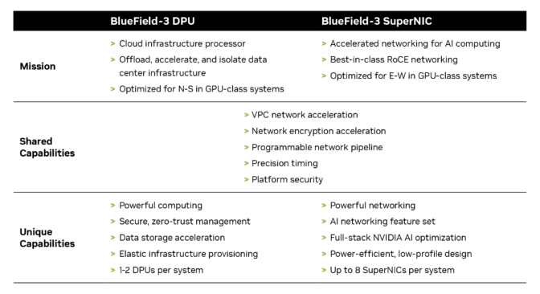

# NVIDIA DOCA框架

## X、拓展关系

在 **BlueField-3 200GbE SuperNIC** 中，**BlueField DPU**、**DOCA** 和 **ConnectX-7** 这三者相互配合，共同提供了强大的性能和灵活性。它们之间的关系可以通过以下几个方面来理解：

### 1. **BlueField DPU (Data Processing Unit)**：

- **DPU** 是 **BlueField-3 200GbE SuperNIC** 的核心部分，是一个硬件加速的处理单元，专门用于处理网络、存储、计算和安全任务。
- DPU 执行网络流量处理、数据包过滤、存储加速、网络虚拟化、安全加速等任务。它减轻了主机 CPU 的负担，提升了整体系统性能。
- 在 **BlueField-3** 中，DPU 是与 **ConnectX-7** 网卡集成的，它提供了网络加速、存储虚拟化、网络虚拟化和安全加速等功能。

### 2. **DOCA (Data Center Open Architecture)**：

- **DOCA** 是 NVIDIA 提供的一套开发框架和软件平台，旨在支持数据中心硬件加速，特别是 **BlueField DPU** 和其他加速硬件的使用。
- DOCA 提供了一整套开发工具、库和应用接口，帮助开发者利用 **DPU** 和 **ConnectX-7** 网卡的硬件加速能力。通过 DOCA，开发者能够构建高性能、低延迟的数据中心应用，如网络虚拟化、存储虚拟化、安全防护等。
- 它允许用户通过编程接口来控制和管理硬件资源，进行更高效的应用程序设计和部署。

### 3. **ConnectX-7**：

- **ConnectX-7** 是 NVIDIA 的网络适配器，支持高达 **200GbE** 的网络速度，并集成了 RDMA（远程直接内存访问）、iWARP 等协议，专门用于加速网络通信。
- 在 **BlueField-3 200GbE SuperNIC** 中，**ConnectX-7** 提供了高速的以太网连接能力，是网络数据传输的核心硬件之一。它与 **BlueField DPU** 一起工作，共同加速网络处理任务，优化数据传输。
- **ConnectX-7** 负责处理传统的网络任务，而 **BlueField DPU** 则承担更为复杂的数据处理、存储虚拟化、安全加速等任务。

**他们之间的关系**：

1. **硬件层面：**
    - **ConnectX-7** 是网络接口卡（NIC），负责提供高速的以太网连接（例如 200GbE）。
    - **BlueField DPU** 集成了 **ConnectX-7** 网卡功能，并提供了额外的加速能力，特别是在存储、计算和安全等领域。
    - **DOCA** 是为 **BlueField DPU** 和 **ConnectX-7** 网卡提供的软件开发平台，支持加速硬件的高效利用。
2. **功能协同：**
    - **ConnectX-7** 作为网卡负责网络数据的高速传输，而 **BlueField DPU** 通过硬件加速处理网络、存储和安全等任务。
    - **DOCA** 提供了操作系统和应用层的支持，使开发者能够访问和利用 **BlueField DPU** 和 **ConnectX-7** 的硬件功能。
3. **整体平台：**
    - **BlueField-3 200GbE SuperNIC** 是一个完整的硬件和软件集成解决方案，**ConnectX-7** 网卡与 **BlueField DPU** 紧密结合，提供了全面的网络、存储、计算和安全加速功能，而 **DOCA** 则提供了必要的软件支持，帮助开发人员利用硬件加速特性。

### 4. NVIDIA BlueField-3 Networking Platform User Guide

参考：https://docs.nvidia.com/networking/display/bf3dpu


## T、BlueField DPU的详细信息

### DPU设计

参考：https://blogs.nvidia.com/blog/dpu-hot-chips/

​	**广域布局：**


​	**软件布局：**

​	上层为用户实际的应用开发；DOCA作为DPU的连接硬件承接上层的开发软件库核心；下层为DPU硬件固件；


### DPU固件信息

BlueField DPU 2相关参考：https://docs.nvidia.com/networking/display/bluefield2firmwarev24351012


**BlueField DPU 2集成了 NVIDIA ConnectX®-6 Dx 的强大功能。**


### DPU安装

参考：https://docs.nvidia.com/networking/display/bluefieldbmcv2501/dpu+mode+installation


dpu就是默认跑的NIC网卡模式；


### DPU VS SuperNIC

SuperNIC说明参考：https://resources.nvidia.com/en-us-accelerated-networking-resource-library-ms/en-us-accelerated-networking-resource-library/what-is-a-supernic?pflpid=8026&lb-mode=overlay&lb-width=100&lb-height=100

AI加速参考：https://resources.nvidia.com/en-us-accelerated-networking-resource-library-ms/en-us-accelerated-networking-resource-library/bluefield-solution-overview?pflpid=8026&pflpid=8026&topic=networking-cloud&lb-mode=preview

超级 NIC 是一种用于 AI 云数据中心网络加速器，它为 GPU 服务器之间提供强大且无缝的连接。

数据处理单元（DPUs）提供丰富的先进功能，提供高吞吐量、低延迟的网络连接等。自 2020 年推出以来，DPUs 在云计算领域获得了普及，主要得益于它们卸载、加速和隔离数据中心基础设施处理的能力。

尽管 DPUs 和超级网络接口卡共享一系列功能和能力，但超级网络接口卡独特地优化了加速人工智能网络的性能。




## H、DOCA文档参解

**DOCA** 是 **NVIDIA BlueField DPU** 的 **软件开发平台**，专为数据中心硬件加速和数据处理而设计。DOCA 提供了一套全面的 **API** 和 **SDK**，使开发者可以利用 BlueField DPU 上的硬件加速功能。DOCA 允许开发者以更高效的方式处理数据流、加速 AI/ML 工作负载、提高网络和存储性能，并增强安全性。

### **DOCA 的功能**

- **网络加速**：支持智能网卡（SmartNIC）和网络功能虚拟化（NFV）。
- **存储加速**：硬件加速 NVMe over Fabrics（NVMe-oF）和分布式存储。
- **安全加速**：提供深度包检测（DPI）、入侵防护系统（IPS）等安全功能。
- **AI/ML 加速**：在 DPU 上加速机器学习和 AI 推理任务。
- **虚拟化支持**：支持容器化、虚拟网络和硬件加速的虚拟化网络接口。

DOCA 基本上是 **BlueField DPU** 的软件平台，提供加速功能的接口、API 和管理工具，使开发者能够高效地开发、调试和部署加速应用。


1. **Host-Server 和 BlueField**

这两个选项用于选择安装平台的类型：

- **Host-Server**：这是指将 **DOCA** 安装到 **传统的主机服务器** 上，即没有 DPU（数据处理单元）加速硬件的服务器。适用于不使用 **BlueField DPU** 的环境。
- **BlueField**：指将 **DOCA** 安装到 **BlueField DPU** 上，利用其硬件加速功能。选择这个选项后，DOCA 将针对 **BlueField DPU** 提供的加速资源进行优化，适合需要利用 **DPU** 提供网络、存储、AI/ML 或安全加速的环境。

2. **部署软件包（BF-Bundle 和 BF-FW-Bundle）**

这两个选项指定安装的软件包类型：

- **BF-Bundle**：这是一个针对 **BlueField DPU** 的软件包集合，通常包括网络、存储和其他硬件加速功能的相关组件。这是一个标准的软件包集合，适合大多数使用 **BlueField DPU** 的环境。
- **BF-FW-Bundle**：这是一个包含 **BlueField DPU** 上防火墙和安全相关功能的软件包集合。它可能包括用于加速深度包检查（DPI）、入侵防护系统（IPS）等安全应用程序的组件。如果你的应用场景主要关注网络安全和流量分析，可以选择这个软件包。

3. **安装程序类型（BFB 和 PLDM）**

这两个选项涉及安装的具体方式或类型：

- **BFB**：这个选项通常指 **BlueField Boot Firmware**，用于在 **BlueField DPU** 上安装启动固件。它通常包含了 DPU 启动所需要的固件文件，用于在硬件启动过程中初始化和配置。
- **PLDM**：即 **Platform Level Data Model**，用于开发 DOCA 应用。

**NOTE**

1. **Host-Server** 和 **BlueField** 用于选择安装的硬件平台类型，前者针对传统服务器，后者针对 **BlueField DPU**。
2. **BF-Bundle** 和 **BF-FW-Bundle** 是两个不同的安装包，前者用于常规功能，后者专注于安全功能（如防火墙、DPI）。
3. **BFB** 和 **PLDM** 是不同的安装程序类型，前者涉及固件安装，后者涉及平台级的应用开发平台。


### DOCA 概述

​	NVIDIA DOCA™ 框架能够快速创建和管理基于 BlueField 网络平台的应用和服务，利用行业标准 API。通过 DOCA，开发者可以利用 NVIDIA 的 BlueField 数据处理单元 (DPU) 和 SuperNIC 的强大功能，实现突破性的网络、安全和存储性能。在主机上安装 DOCA 提供了管理 NVIDIA® BlueField® 和 NVIDIA® ConnectX® 设备所需的所有驱动程序和工具。


DOCA 框架包括 DOCA-Host 包和用于 BlueField Arm 的 BlueField 软件包：

- BlueField 软件包 (BF-Bundle) 是安装在 BlueField Arm 内核上的软件包
- DOCA-Host 是安装在主机服务器上的软件包，其中包含不同的 DOCA 安装配置文件

BlueField 软件包包括：

- 安装在 BlueField 平台上的 DOCA 运行时驱动程序和库
- BlueField 平台上安装的操作系统
- BlueField 平台软件（即固件和 UEFI 引导加载程序）

DOCA 通过专用的 DOCA-Host 包安装为包含 NVIDIA 网络平台（即 BlueField 和 ConnectX）的主机提供所有必需的库和驱动程序。


#### **DOCA software consists of an SDK and a runtime environment. **

其中包括用于设备管理和可编程性的库和驱动程序、用于主机和作为 BlueField 平台软件的一部分。


**Telco（电信）**: 指电信行业及其相关技术。

**DOCA Firefly**：是一个基于PTP时间同步的DOCA服务，使用PTP来校准DPU(网卡本身)的时钟，然后同步到宿主机。依靠网卡的高精度时钟，客户可以重新设计实现自己的各种应用。参考：https://developer.nvidia.com/zh-cn/blog/doca-firefly-time-service/

**OVS-DOCA/P4 RT/HBN**: Open vSwitch（OVS）集成，P4 编程语言的实时（RT）和高速网络（HBN）功能。

**App Shield（应用防护）**: 用于保护应用程序免受安全威胁的功能。

**DOCA Rivermax (RMAX)** ：是 NVIDIA® Rivermax® 的 DOCA API，是针对媒体和数据流应用程序优化的网络 SDK。Rivermax 利用 NVIDIA® BlueField® DPU 硬件流加速技术，可实现与 GPU 之间的直接数据传输，为流工作负载提供一流的吞吐量和延迟，同时将 CPU 利用率降至最低。

**HPC/AI（高性能计算与人工智能）**: 高性能计算和人工智能相关的库。

**GPUNetIO**: 可能与GPU加速的网络输入输出相关。

**UCX**: 统一通信扩展（Unified Communication X），一种高效的通信框架。

**UCC**: （Unified Communication）用于集群通信或计算的库。


#### DOCA PCC下的负载对比

参考：https://developer.nvidia.com/zh-cn/blog/fast-track-data-center-workloads-and-ai-applications-with-nvidia-doca-2-2/

DOCA DPA 还提供了显著的开发优势，包括在创建自定义模拟和拥塞控制时具有更大的灵活性。定制的拥塞控制对于人工智能工作流至关重要，可以实现性能隔离、提高公平性，并防止有损网络上的数据包丢失。

DOCA 2.2 版本引入了以下 SDK：

​	**DOCA-FlexIO**：这是一个用于 DPA 编程的低级 SDK。具体来说，DOCA FlexIO 驱动程序提供了 API，用于通过 DPA 管理和运行代码。

​	**DOCA-PCC**：这是一个用于拥塞控制开发的 SDK，它使 CSP 和企业客户能够创建自己的拥塞控制算法，从而通过提高带宽和降低延迟来增强网络操作的稳定性和效率。

NVIDIA 还提供必要的工具链、示例和辅助资料，以加快和支持开发工作。请注意， **NVIDIA DOCA DPA 在 DPU 模式和 NIC 模式下都可用。**


从图片中可以看出，展示的是不同条件下进行 **AI 工作负载（NCCL）** 和 **ALL2ALL - Reduce 测试** 时的带宽（BW）和延迟（Latency）表现。以下是图片中的一些标识及其含义：

**上半部分（带宽 - large msgs）**：

- **BW - large msgs（带宽 - 大消息）**：指的是传输大数据包时的网络带宽表现。
- **CC Enabled（启用CC）**：表示启用 **CC（Congestion Control，拥塞控制）** 功能时的测试结果。
- **CC Disabled（禁用CC）**：表示禁用 **CC** 功能时的测试结果。
- **Line Rate (Idle)（线速率-空闲）**：指的是在空闲状态下网络接口卡的最大传输能力（理论最大带宽）。
- **3X higher BW with CC（带宽提高3倍，启用CC时）**：表示启用 CC 时，相比禁用 CC，带宽提升了 3 倍。

**下半部分（延迟 - small msgs）**：

- **Latency - small msgs（延迟 - 小消息）**：指的是传输小数据包时的网络延迟表现。
- **2X lower Latency with CC（启用CC时延迟降低2倍）**：表示启用 CC 后，相比禁用 CC，延迟降低了 2 倍。

轴标说明：

- **msg size (B)**：消息大小，单位为字节（B）。X 轴表示不同大小的数据包（从 2^10 到 2^21 字节）。
- **BW (Gbps)**：带宽，单位为吉比特每秒（Gbps）。Y 轴表示带宽的值。
- **Latency (μs)**：延迟，单位为微秒（μs）。Y 轴表示延迟的值。

颜色和线条：

- **绿色线（CC Enabled）**：表示启用拥塞控制（CC）时的测试结果，表现为较好的带宽和延迟表现。
- **红色线（CC Disabled）**：表示禁用拥塞控制（CC）时的测试结果，通常表现为较差的带宽和延迟表现。
- **蓝色线（Line Rate (Idle)）**：表示空闲状态下的理论最大带宽，通常是网卡硬件的极限性能。

总结：

- **带宽表现**：启用拥塞控制（CC）时，带宽表现比禁用时高 3 倍，特别是在传输大数据包时。
- **延迟表现**：启用拥塞控制（CC）时，延迟表现比禁用时低 2 倍，尤其是在传输小数据包时。

这些图表展示了 PCC 功能在网络性能优化中的重要性，特别是在带宽和延迟方面的影响。


#### DOCA 是 BlueField 主要硬件实体的软件基础设施


### DOCA 发行说明

默认情况下，使用标准 Linux 工具（yum、apt）安装 DOCA 配置文件会同时安装`doca-runtime`和`doca-devel`（以前为`doca-sdk`）。

- `doca-runtime`包括 DOCA 管理员在生产环境中使用的所有组件、库、驱动程序和工具
- `doca-devel`包括用于开发的所有组件、库、驱动程序和工具，包括参考应用程序、编译器等。

#### [Supported Device Speeds](https://docs.nvidia.com/doca/sdk/doca+release+notes/index.html#src-3355910088_id-.DOCAReleaseNotesv2.10.0-SupportedDevicesSpeeds)

**InfiniBand** 和 **Ethernet** 都是常见的网络通信协议，它们在不同的应用场景中有着各自的优势。上面提到的 **SDR, FDR, EDR, HDR**（对于 InfiniBand）和 **1GbE, 10GbE, 25GbE, 40GbE, 50GbE, 100GbE**（对于 Ethernet）都是关于这些协议不同速率的术语。

InfiniBand 网络技术以其低延迟和高带宽而闻名，尤其在高性能计算（HPC）和数据中心中广泛使用。其不同的速率标准如下：

```less
SDR (Single Data Rate)：速率最多 2.5 Gbps。
FDR (Four Data Rate)：速率最多 10 Gbps。
EDR (Enhanced Data Rate)：速率最多 25 Gbps。
HDR (High Data Rate)：速率最多 50 Gbps。
```


​		**标记1**：在强制模式和自动协商模式下支持 NRZ 和 PAM4 模式的速度。
​		**标记2**：仅支持PAM4模式的速度。
​		**标记3**：56GbE 是 NVIDIA 专有的链接速度，可以在将 NVIDIA 适配卡连接到 NVIDIA SX10XX 交换机系列时或将 NVIDIA 适配卡连接到另一个 NVIDIA 适配卡时实现。


#### [Declared Unsupported Features](https://docs.nvidia.com/doca/sdk/declared+unsupported+features/index.html#)

DOCA 2.10 版本不支持以下 DOCA Flow 功能。DOCA 3.0 版本（预计于 2025 年 4 月发布）将支持这些功能。

Note：如果需要这些功能中的任何一个，请使用 DOCA FLOW 2.9.1。

- ACL pipe
- LPM pipe
- CT pipe
- Ordered list pipe
- External send queue (SQ)
- Pipe resize


#### [General Support](https://docs.nvidia.com/doca/sdk/general+support/index.html#)

##### Supported Platforms and NIC Firmware Versions


##### [Supported Host OS per DOCA-Host Installation Profile](https://docs.nvidia.com/doca/sdk/general+support/index.html#src-3355910289_id-.GeneralSupportv2.10.0-SupportedHostOSperDOCA-HostInstallationProfile)

对于 BlueField 捆绑包（用于 DPU 和 SuperNIC）中包含的默认操作系统是 Ubuntu 22.04。

| **组件名称**        | **功能概述**                                                 | **包含的功能**                                               | **适用场景**                                                 |
| ------------------- | ------------------------------------------------------------ | ------------------------------------------------------------ | ------------------------------------------------------------ |
| **doca-all**        | 包含所有 DOCA 组件，提供全面的功能支持                       | 网络、存储、加密、安全等各个方面的库和服务                   | 需要全面功能支持的系统，或需要灵活定制的高级数据中心架构。   |
| **doca-networking** | 专门用于网络加速和协议栈处理的组件，提供网络相关的硬件加速支持 | RDMA、RoCE（RDMA over Converged Ethernet）、iWARP 加速 - 高效的网络数据包处理和流量管理 | 高性能、低延迟网络传输的应用，如 HPC、数据中心网络加速。     |
| **doca-ofed**       | 提供 InfiniBand 和其他高速网络通信协议的支持，专注于高性能计算和网络加速 | 支持 InfiniBand 协议 - 网络协议栈的加速                      | 高性能计算（HPC）、超算集群及需要高速网络连接的环境。        |
| **doca-roce**       | 专门用于支持 RDMA over Converged Ethernet（RoCE）的加速组件，提供 Ethernet 网络上的 RDMA 支持 | RoCE 协议加速 - 低延迟、高吞吐量的远程直接内存访问 (RDMA) 处理 | 需要在以太网上实现 RDMA 的应用场景，如高频交易、数据库加速等。 |

而 DOCA-Host 安装包在主机上支持的操作系统如下：


##### [Storage Supported DOCA-Host Operating Systems](https://docs.nvidia.com/doca/sdk/general+support/index.html#src-3355910289_id-.GeneralSupportv2.10.0-StorageSupportedDOCA-HostOperatingSystems)

​		是指支持 DOCA（Data Center Open Architecture）平台的操作系统，特别是在存储相关的环境中。DOCA 是一种由 NVIDIA 提供的用于数据中心加速的架构，旨在通过硬件加速（如 GPU 或 DPUs）来提高数据中心的效率和性能。这个平台可以在各种存储场景中发挥作用，包括数据存储、网络存储以及计算密集型任务。


### [DOCA 开发人员快速入门指南](https://docs.nvidia.com/doca/sdk/doca+developer+quick+start+guide/index.html#)

​		NVIDIA DOCA 汇集了各种强大的 API、库和框架，用于编程和加速现代数据中心基础设施。与 GPU 的 NVIDIA® CUDA® 一样，DOCA 是所有现有和未来几代 BlueField DPU 和 SuperNIC 产品的一致且必不可少的资源。

​		略.


### DOCA的参考运用

参考：https://docs.nvidia.com/doca/archive/doca-v1.2.1/ips/index.html


## F、DOCA的应用开发

安装DOCA：https://zhuanlan.zhihu.com/p/474009504

安装DOCA：https://zhuanlan.zhihu.com/p/474009504

https://github.com/NVIDIA/doca-platform

https://learn.nvidia.com/courses/course-detail?course_id=course-v1:DLI+S-NP-01+V1-CN


### DOCA 安装

https://developer.nvidia.cn/networking/doca/getting-started

争对不同的网卡(BlueField 、 ConnectX)，安装方案不同.

安装指南：https://docs.nvidia.com/doca/sdk/doca+installation+guide+for+linux/index.html#src-2571330368_NVIDIADOCAInstallationGuideforLinux-InstallingSoftwareonHost


安装操作：


### DOCA 开发环境

本指南详细介绍了设置 NVIDIA DOCA 开发环境的推荐步骤。

https://docs.nvidia.com/doca/sdk/doca+developer+guide/index.html

#### BlueField网络平台开发

本指南建议在 BlueField 平台或主机上的开发过程中使用 DOCA 的开发容器。

部署开发容器允许多个开发人员以独立的方式在同一设备（主机或 BlueField 平台）上同时工作，甚至可以跨多个不同的 DOCA SDK 版本工作。例如，这可以让多个开发人员在 BlueField 平台本身上工作，而无需每个开发人员都有一个专用的 BlueField。

这种基于容器的方法的另一个好处是，开发容器允许开发人员在用户友好的环境中创建和测试基于 DOCA 的软件，该环境预装了一套方便的开发工具。开发容器专注于改善开发体验，并为此目的而设计，而 BlueField 软件旨在成为 DOCA 产品的高效运行时环境。


#### 无需 BlueField 网络平台的开发


#### [测试](https://docs.nvidia.com/doca/sdk/doca+developer+guide/index.html#src-3453015802_id-.DOCADeveloperGuidev2.9.1-Testing.1)

虽然编译可以在容器上进行，但测试编译后的软件必须在 BlueField 平台上进行。这是因为 QEMU 环境模拟了 aarch64 架构，但它不模拟 BlueField 平台上的硬件设备。因此，被测试的程序将无法访问成功执行所需的设备，因此要求在物理 BlueField 上进行测试。

**NOTE：确保编译使用的 DOCA 版本与用于测试的 BlueField 上安装的版本相同。**


### DOCA 编程

#### 硬件架构

BlueField 的主要硬件实体，针对不同的工作负载进行了优化。


[Arm Cores](https://docs.nvidia.com/doca/sdk/hardware+architecture/index.html#src-2723468391_id-.HardwareArchitecturev2.7.0-ArmCores)

针对控制路径应用、通用计算和单流性能进行了优化。

- 16 个 Arm Cortex-A78 内核用于通用处理
- 一致的网状架构，实现高效互联-
- 末级缓存 (LLC)，用于优化内存性能
- DDR5 内存子系统，用于高速数据访问
- 用于管理系统资源的基本操作系统和微服务

[Accelerated Programmable Pipeline](https://docs.nvidia.com/doca/sdk/hardware+architecture/index.html#src-2723468391_id-.HardwareArchitecturev2.7.0-AcceleratedProgrammablePipeline)

针对高性能数据包处理和高级数据包处理进行了优化。

- 可编程的64-128数据包处理器，实现灵活的组网
- 用于吞吐量优化的多阶段、高度并行的架构
- 基于流的分类和操作引擎，实现高效的数据包处理
- 支持 RDMA、加密加速和基于时间的调度

[Data-Path Accelerator](https://docs.nvidia.com/doca/sdk/hardware+architecture/index.html#src-2723468391_id-.HardwareArchitecturev2.7.0-Data-PathAccelerator)

专为 I/O 密集型应用程序、高插入率任务、网络流处理、设备仿真和 DMA 操作而设计。

- 16 个超线程 I/O 和数据包处理核心，用于处理密集型工作负载
- 实现确定性和低延迟操作的实时操作系统


#### SDK架构

DOCA 提供利用 NVIDIA® BlueField® 网络平台（DPU 或 SuperNIC）和 NVIDIA® ConnectX® NIC 硬件加速器的网络和数据处理可编程库。

DOCA软件框架建立在DOCA Core之上，为DOCA库提供统一的软件框架，形成一个或多个DOCA库的处理管道或工作流程构建。

##### [DOCA Device Subsystem](https://docs.nvidia.com/doca/sdk/doca+sdk+architecture/index.html#src-2847239471_id-.DOCASDKArchitecturev2.8.0-DeviceSubsystem)

**设备子系统**

- **DOCA 设备子系统** 提供了硬件加速单元的抽象，这些硬件加速单元在 **DPU** 或 **SuperNIC** 中运行，专门用于执行高强度的任务（如加密、压缩、网络数据包获取、RDMA 发送等）。
- 该子系统允许应用程序将资源密集型任务卸载到硬件上，从而提高应用程序的性能。

**设备类型**

- **本地设备（Local Device）**：
    - 实际上是系统中可见的设备，能执行 DOCA 库处理任务。这些设备可以是 **PCIe 物理功能（PF）**、**虚拟功能（VF）** 或 **可扩展功能（SF）**。
- **代表设备（Representor Device）**：
    - 代表本地设备的设备，通常位于主机端（除 SF 功能外）。代表设备是本地设备的代理或副本，位于 **BlueField** 端，主要用于主机端设备的表示。


设备相关可以具体参考：https://docs.nvidia.com/doca/sdk/doca+core/index.html#src-3527228136_id-.DOCACorev2.10.0-DOCADevice

**DOCA 设备的操作**

- **设备识别**：DOCA SDK 可以发现系统中可用的硬件加速单元。
- **查询能力**：应用程序可以查询硬件加速单元的能力和属性，例如是否支持加密等功能。
- **设备打开**：应用程序可以打开设备，允许库分配和共享硬件加速所需的资源。

**设备拓扑**

- **本地设备与代表设备**：
    - 本地设备（如 PF、VF、SF）位于主机系统或 DPU 上，而其 **代表设备** 则位于 **BlueField** 侧，通常是一对一映射。
    - 例如，主机上的 **PF0** 设备有一个对应的代表设备 **hpf0** 在 **BlueField** 侧。


##### [内存管理子系统](https://docs.nvidia.com/doca/sdk/doca+sdk+architecture/index.html#src-2847239471_id-.DOCASDKArchitecturev2.8.0-MemoryManagementSubsystem)

​	略