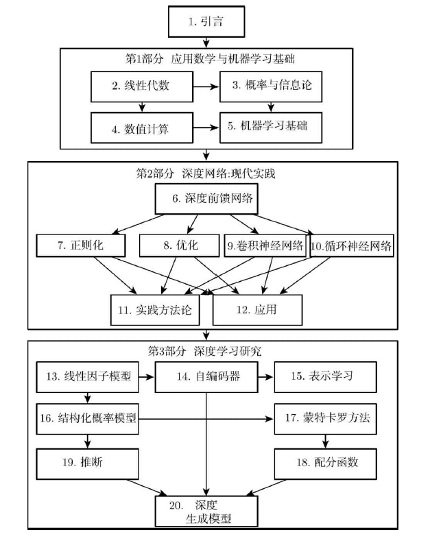
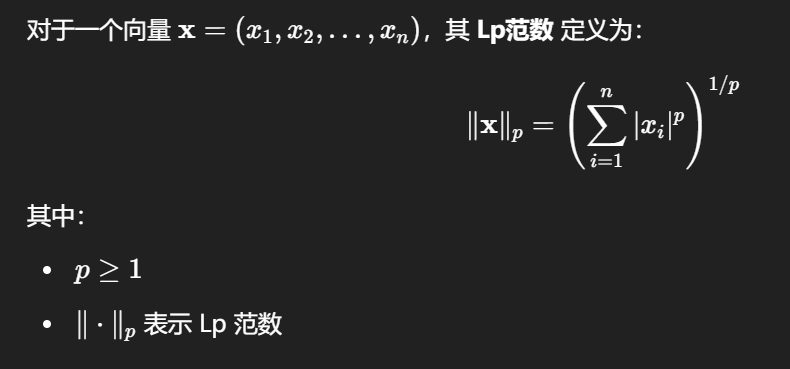
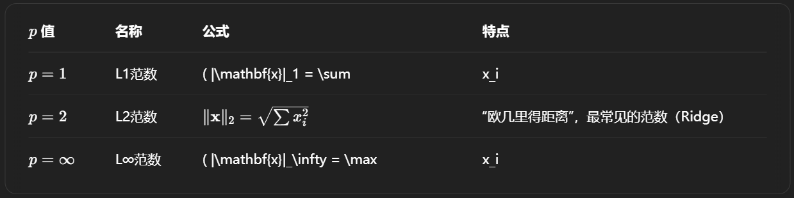
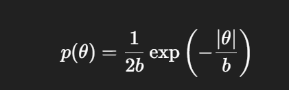
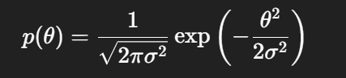

# DEEP LEARNING——lan Goodfellow, Yoshua Bengio,and Aaron Courville

## 引言

## 1. 范数

​	L1范数: 为x向量各个元素绝对值之和
​	L2范数: 为x向量各个元素平方和的1/2次方，L2范数又称Euclidean范数或者Frobenius范数
​	Lp范数: 为x向量各个元素绝对值p次方和的1/p次方.

### 定义

### 常见的几种 Lp 范数：

L1和L2正则先验分别服从什么分布，L1是[拉普拉斯](https://so.csdn.net/so/search?q=拉普拉斯&spm=1001.2101.3001.7020)分布，L2是高斯分布。

### Lp范数的几何意义

你可以把 Lp 范数理解为“从原点到向量点的距离”，但这个“距离”定义方式依赖于 p 的取值：

- L1 范数：像走城市街道那样走格子（走“横+竖”）
- L2 范数：标准斜线直线距离
- L∞ 范数：只看哪个坐标绝对值最大（就像一辆车每秒最多只能朝某方向走1步）

### L1 和 L2 正则化的先验分布

在机器学习中，L1 正则化和 L2 正则化分别对应不同的 **先验分布**。这些分布与拉普拉斯分布和高斯分布有关系。

#### 1. **L1 正则化与拉普拉斯分布**

- **L1 正则化**（或称 **Lasso 正则化**）通过对权重的 **绝对值** 进行惩罚，促使模型参数变得稀疏，即许多参数被压缩到零。
- 在贝叶斯框架下，L1 正则化对应的 **先验分布** 是 **拉普拉斯分布**，其数学表达式为：
  
  
  
- 拉普拉斯分布的特点是具有 **尖峰**，即它在零附近有较大的概率密度，这促使很多参数的值被压缩到零，从而实现 **稀疏性**。

- 拉普拉斯分布和 L1 正则化的关系通过 **最大后验估计**（MAP估计）得以体现，L1 正则化项与拉普拉斯分布的对数似然相对应。

#### 2. **L2 正则化与高斯分布**

- **L2 正则化**（或称 **Ridge 正则化**）通过对权重的 **平方** 进行惩罚，避免权重过大，使模型更加平滑。
- 在贝叶斯框架下，L2 正则化对应的 **先验分布** 是 **高斯分布**（或正态分布），其数学表达式为：

  
  
- 高斯分布的特点是它在零附近有一个 **高峰**，促使权重接近零，但不会完全将权重压缩到零，因此比 L1 正则化更加平滑。

- L2 正则化通过 **最大后验估计**，使得参数趋向于较小的值，而不完全为零。

#### 3. **总结**

- **L1 正则化**：对应的先验分布是 **拉普拉斯分布**，它通过绝对值惩罚促进稀疏性。
- **L2 正则化**：对应的先验分布是 **高斯分布**，它通过平方惩罚使得参数平滑，并避免参数过大。

这种正则化与先验分布之间的关系在贝叶斯推断中非常自然，通过选择合适的先验分布来反映我们对参数的不同假设，从而影响模型的学习过程。