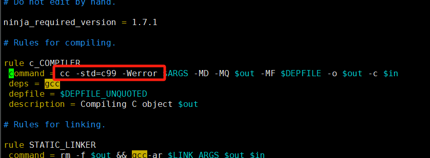

## dpdk_pktGen安装部署

### 1、安装过程

#### （1）先安装dpdk


```less
pip3 install pyelftools --upgrade

meson build
ninja -C build

# 我不使用 ninja install，即不把相关的librte库安装到usr下，其只存在对应的dpdk/build/lib目录下
# 所以需要后续的链接保证，pktGen可以找到libdpdk
# 但是后续发现很麻烦，处理lib库的指定外。rte.h相关的文件也需要修改路径
所以后续直接
cd build 
ninja install

```


#### （2）链接dpdk库

```less
# 标记安装的lib库位置
vim /etc/ld.so.conf.d/pktgen.conf
// 例如：/home/lik/dpdk_pktGen/dpdk-23.11/build/lib
ldconfig // 使配置生效

# 确认链接成功
ldconfig -p | grep librte | wc -l 

# 确认libdpdk.pc位置
后续如果用 meson 编译 DPDK 程序, 默认会使用 pkg-config 来寻找 DPDK 库, 而 DPDK 安装后会把对应的 libdpdk.pc 安装在某个目录, 如 /usr/local/lib/x86_64-linux-gnu/pkgconfig/libdpdk.pc, 我们需要确保这个路径 pkg-config 可以找到.
可以使用：
find / -name libdpdk.pc
对比：
pkg-config --variable pc_path pkg-config
```


```less
// 发现不一样，进行路径调整到自己的dpdk目录
export PKG_CONFIG_PATH=/home/lik/dpdk_pktGen/dpdk-23.11/build/meson-private/

pkg-config --modversion libdpdk
// 出现正确版本号即可
```


#### （3）安装pktGen


```less
yum install meson
```


```less
利用（1）中方法解决
```

```less
meson build
cd build
ninja // 报错
```


```less
vim ./build.ninja
: %s/\/home\/lik\/dpdk_pktGen\/dpdk-23.11\/config\/rte_config.h/rte_config.h/g

perl -pi -e 's|#include <rte_build_config.h>|#include "/home/lik/dpdk_pktGen/dpdk-23.11/build/rte_build_config.h"|g' `find ./src -type f`
```


```less
发现需要协调的.h文件有点多，最后还是安装了dpdk
```


```less
在编译参数里加入：gcc -std=c99
// 末尾参数添加 -Wno-error，下图这样位置加不起作用
```



```less
// 报错
undefined reference to `rte_eth_bond_8023ad_conf_get'
```


```less
vim ../app/pktgen-cmds.c
// 我直接注释了相关的if判断，这样就使得函数.h文件包含了进去
```


```less
ninja
ninja  install
// 安装通过
```


#### （4）运用

```less
// dpdk参数形式
./build/app/pktgen -l 1-3 -- -P -m 2.0 -m 4.1

// 工具配置运行 默认使用vim ./cfg/default.cfg // 记得修改其中的网卡对，以及对应网卡的core数，注意一个网卡的core号要在一个sock上，lscpu查看。 其中的开始2core是程序运行所用的核
./tools/run.py default
```


```less
# 如果修改了端口对，就需要根据port-id对cfg文件中的id号也需要配对修改， 如果sockid变化，也需要修改
// 例如
./build/app/pktgen -l 1-3 -- -P -m 3.2 -m 5.3

```

