# dpdk源码梳理

## X、概念解释

```apl
IOVA（IO Virtual Address，输入/输出虚拟地址）

IOMMU（I/O Memory Management Unit）：IOMMU是一种硬件单元，用于管理设备对内存的访问。它可以将IOVA地址转换为物理地址，从而保证设备访问的安全和正确性。没有开启IOMMU的情况下，CPU使用的是虚拟地址，设备访问内存使用的是物理地址。如果系统开启IOMMU，CPU使用基于MMU映射的VA，设备也可以使用基于IOMMU映射的IOVA。

SMMU（System MMU，系统内存管理单元），同上，别名。

DMA（Direct Memory Access）：DMA允许设备绕过CPU，直接与内存进行数据传输。这可以提高数据传输效率，但需要合理管理IOVA地址，以确保设备访问正确的内存区域。

iova有两种模式，一种是RTE_IOVA_VA，一种是RTE_IOVA_PA，RTE_IOVA_VA表示DMA操作可以使用虚拟地址表示目的地址，而RTE_IOVA_PA则表示DMA必须要用物理地址作为目的地址

PMD是Poll Mode Driver的缩写，即基于用户态的轮询机制的驱动.
IPC 进程间通信（英语：Inter-Process Communication，简称IPC)

hugetlb 是记录在TLB 中的条目并指向hugepages。 // getconf PAGE_SIZE 查看页大小
hugetlbfs 则是一个特殊文件系统（本质是内存文件系统）。主要的作用是使得应用程序可以根据需要灵活地选择虚拟存储器页面的大小，而不会全局性的强制使用某个大小的页面

FDIR（Intel Ethernet Flow Director）通过将数据包定向发送到对应应用所在Core 上，从而弥补了RSS 的不足，可用来加速数据包到目的应用处理的过程。
```


```less
DPDK通常是使用大页（hugepage）内存的，无论是2M的大页还是1G的大页，本质上都是为了：1、减少TLB miss；2、提高内存申请使用速率。通过更大的page size来提升TLB的命中率，而TLB就是用来缓存页表的高速缓存


# dpdk版本查看
$ pkg-config --modversion libdpdk
19.11.10
$ pkg-config --modversion libdpdk-libs
21.05.0

# dpdk的模式、参数含义，可以查看以下文件
dpdk\doc\guides\linux_gsg\eal_args.include.rst
dpdk\doc\guides\linux_gsg\linux_eal_parameters.rst

in-memory ：不要创建任何共享数据结构，并完全在内存中运行。暗示'——no-shconf ' '和(如果适用)' '——huge-unlink ' '。
no-shconf ：没有创建共享文件(意味着没有辅助进程支持，只有main进程)；
huge-unlink ：现有的巨页文件将被删除并重新创建，以确保内核清除内存并防止任何数据泄漏。
```

### X.1、dpdk工作模式

DPDK（Data Plane Development Kit）支持多种工作模式，每种模式都有其独特的特点和适用场景。以下是主要的 DPDK 工作模式及其区别：

| 模式名称                                    | 描述                                                         | 优点                             | 缺点                                   | 适用场景                                           |
| ------------------------------------------- | ------------------------------------------------------------ | -------------------------------- | -------------------------------------- | -------------------------------------------------- |
| 轮询模式 (Polling Mode)                     | CPU持续轮询网卡以检查是否有新数据包。                        | 提供最低延迟和最高吞吐量。       | 消耗大量CPU资源。                      | 高性能网络应用，如高频交易。                       |
| 中断模式 (Interrupt Mode)                   | 网卡通过中断通知CPU有新数据包需要处理。                      | 节省CPU资源。                    | 引入一定的延迟，适合延迟不敏感的场景。 | 资源受限或对延迟不敏感的应用。                     |
| 混合模式 (Hybrid Mode)                      | 结合轮询和中断的优点，根据流量情况切换模式。                 | 兼顾性能和资源利用。             | 实现复杂，可能需要额外的调优。         | 流量动态变化的应用。                               |
| 运行到完成模式 (Run-to-Completion Mode)     | 单个CPU核负责完成从数据包接收到处理再到发送的整个过程。      | 简化编程模型，单线程性能高。     | 无法充分利用多核处理器的优势。         | 单线程高性能应用。                                 |
| 管道模式 (Pipeline Mode)                    | 数据包处理分为多个阶段，每个阶段由不同的CPU核处理。          | 利用多核优势，提高整体吞吐量。   | 设计复杂，阶段间通信可能引入延迟。     | 多核系统，高吞吐量应用。                           |
| 多队列模式 (Multi-Queue Mode)               | 使用多个接收（RX）和发送（TX）队列，每个队列分配给不同的CPU核。 | 实现负载均衡，提高并行处理能力。 | 需要复杂的队列管理和调度策略。         | 高并发网络应用。                                   |
| 直接缓存访问模式 (Direct Cache Access Mode) | 数据包直接放置在CPU缓存中，而不是内存中。                    | 减少内存访问延迟，提高处理速度。 | 需要硬件支持，配置复杂。               | 低延迟、高性能应用。                               |
| 硬件卸载模式 (Hardware Offload Mode)        | 使用硬件加速特性，如接收端的散列（RSS）、传输端的分段（TSO）和加密/解密操作。 | 提高性能，减少CPU负载。          | 需要硬件支持，不同硬件实现差异较大。   | 高性能网络应用，需要硬件加速的场景。               |
| 基于流的模式 (Flow-based Mode)              | 基于数据流（flow）进行处理，适用于需要复杂流量管理和处理的场景。 | 提供复杂的数据包过滤和转发功能。 | 实现复杂，依赖硬件支持。               | 需要复杂流量管理和处理的应用，如防火墙和负载均衡。 |


### X.2、dpdk网卡驱动

以下是更新后的 DPDK 支持的网络设备驱动程序表格，包括了常见的网卡型号及其支持的速率信息：

| 驱动程序      | 网卡支持速率             | 市面常见网卡型号                    | 特点和优势                                                   |
| ------------- | ------------------------ | ----------------------------------- | ------------------------------------------------------------ |
| `bnxt`        | 10G, 25G, 40G, 100G      | Broadcom BCM57414, BCM57810         | 支持广泛的 Broadcom NetXtreme 系列以太网控制器。提供高性能和可靠性，适合数据中心和云环境。 |
| `mlx4`        | 10G                      | Mellanox ConnectX-3, ConnectX-3 Pro | 适用于 Mellanox ConnectX-3 和 ConnectX-3 Pro 系列网卡。高性能的 InfiniBand 和以太网互联解决方案。 |
| `mlx5`        | 10G, 25G, 40G, 50G, 100G | Mellanox ConnectX-4, ConnectX-5     | 支持 Mellanox ConnectX-4 和 ConnectX-5 系列网卡。提供极高的带宽和低延迟，适用于高性能计算和云环境。 |
| `i40e`        | 1G, 10G, 40G, 100G       | Intel XL710, X710                   | 适用于 Intel XL710 和 X710 系列100G以太网控制器。提供高性能的数据包处理和网络加速功能。 |
| `ixgbe`       | 1G, 10G, 40G             | Intel X550, X710, X722              | 适用于 Intel 10G 和 40G 以太网控制器。稳定可靠的性能，适合数据中心和企业网络环境。 |
| `igb`         | 1G, 10G                  | Intel 82575, 82576                  | 适用于 Intel 1G 和 10G 以太网控制器。简单易用的内核态驱动，适合普通网络应用和开发调试。 |
| `rte_vmxnet3` | 1G, 10G                  | VMware VMXNET3                      | VMware VMXNET3 虚拟网卡驱动，用于虚拟化环境中的高性能网络通信。提供优化的虚拟网络性能。 |
| `virtio`      | 可变                     | Virtio                              | Virtio 虚拟网卡驱动，用于与 KVM、QEMU 等虚拟化平台集成。提供高性能和灵活性的虚拟网络解决方案。 |
| `pcap`        | 可变                     | PCAP                                | PCAP 文件和实时抓包驱动，用于离线分析和开发调试。提供便捷的数据包捕获和分析功能。 |
| `null`        | 不适用                   | Null                                | 空设备驱动，用于测试和调试。提供简单的数据包发送和接收功能，用于开发和性能测试。 |
| `af_xdp`      | 可变                     | AF_XDP                              | AF_XDP（eXpress Data Path）高性能数据平面驱动。提供极低的数据包处理延迟和高吞吐量。 |
| `ena`         | 10G, 25G, 50G, 100G      | Amazon EC2 ENA                      | Amazon Elastic Network Adapter（ENA）驱动，用于 AWS EC2 实例。提供高性能的云计算网络连接。 |
| `dpaa2`       | 可变                     | NXP DPAA2                           | NXP DPAA2（Data Path Acceleration Architecture）网卡驱动。提供适合网络功能虚拟化和加速的解决方案。 |
| `qede`        | 10G, 25G, 40G, 100G      | QLogic QED                          | QLogic QED 系列网卡驱动，支持多种速率的以太网控制器。提供高性能和稳定的网络连接。 |
| `fm10k`       | 10G, 40G                 | Intel FM10000                       | Intel FM10000 系列40G以太网控制器驱动。提供高性能和可靠性的数据包处理能力。 |
| `hns`         | 可变                     | Hisilicon HiSilicon SoC 系列        | Hisilicon 网卡驱动，支持多种 Hisilicon 芯片组的以太网控制器。具有高性能和稳定的网络连接能力，适合数据中心和云环境。 |


### X.3、指令周期

#### 1.指令周期

指令周期：是指计算机从取指到指令执行完毕的时间

计算机执行指令的过程可以分为以下三个步骤：

1. Fetch（取指），也就是从 PC 寄存器里找到对应的指令地址，根据指令地址从内存里把具体的指令，加载到指令寄存器中，然后把 PC 寄存器自增，好在未来执行下一条指令。
2. Decode（译码），也就是根据指令寄存器里面的指令，解析成要进行什么样的操作，是 R、I、J 中的哪一种指令，具体要操作哪些寄存器、数据或者内存地址。
3. Execute（执行指令），也就是实际运行对应的 R、I、J 这些特定的指令，进行算术逻辑操作、数据传输或者直接的地址跳转。

在取指令的阶段，我们的指令是放在**存储器（也就是内存）**里的，实际上，通过 **PC 寄存器**和**指令寄存器**取出指令的过程，是由**控制器（Control Unit）**操作的。指令的解码过程，也是由**控制器**进行的。一旦到了执行指令阶段，无论是进行算术操作、逻辑操作的 R 型指令，还是进行数据传输、条件分支的 I 型指令，都是由**算术逻辑单元（ALU）**操作的，也就是由运算器处理的。不过，如果是一个简单的无条件地址跳转，那么我们可以直接在控制器里面完成，不需要用到运算器。

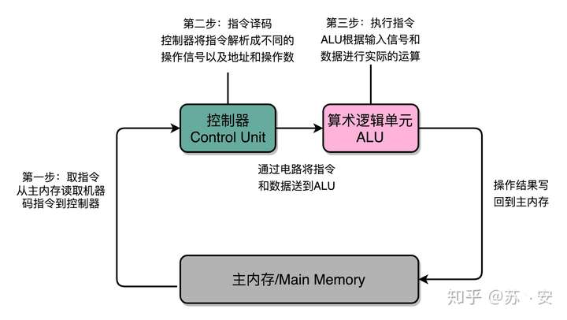

#### 2. CPＵ周期

**CPU周期亦称机器周期**，在计算机中，为了便于管理，常把一条指令的执行过程划分为若干个阶段，每一阶段完成一项工作。

例如，取指令、[存储器](https://link.zhihu.com/?target=https%3A//baike.baidu.com/item/%E5%AD%98%E5%82%A8%E5%99%A8/1583185)读、存储器写等，这每一项工作称为一个**基本操作**（**注意：每一个基本操作都是由若干CPU最基本的动作组成**）。完成一个**基本操作**所需要的时间称为机器周期。**通常用内存中读取一个[指令字](https://link.zhihu.com/?target=https%3A//baike.baidu.com/item/%E6%8C%87%E4%BB%A4%E5%AD%97/3220363)的最短时间来规定CPU周期。**

#### 3. 时钟周期

时钟周期也称为[振荡周期](https://link.zhihu.com/?target=https%3A//baike.baidu.com/item/%E6%8C%AF%E8%8D%A1%E5%91%A8%E6%9C%9F/10063375)，定义为[时钟频率](https://link.zhihu.com/?target=https%3A//baike.baidu.com/item/%E6%97%B6%E9%92%9F%E9%A2%91%E7%8E%87/103708)的[倒数](https://link.zhihu.com/?target=https%3A//baike.baidu.com/item/%E5%80%92%E6%95%B0/4793)。时钟周期是计算机中最基本的、最小的[时间单位](https://link.zhihu.com/?target=https%3A//baike.baidu.com/item/%E6%97%B6%E9%97%B4%E5%8D%95%E4%BD%8D/3078999)。在一个时钟周期内，CPU仅完成一个**最基本的动作**。

#### 4. 周期之间的关系

[指令周期](https://link.zhihu.com/?target=https%3A//baike.baidu.com/item/%E6%8C%87%E4%BB%A4%E5%91%A8%E6%9C%9F)（Instruction Cycle）：取出并执行一条指令的时间。

CPU周期：一条指令执行过程被划分为若干阶段，每一阶段完成所需时间。

[时钟周期](https://link.zhihu.com/?target=https%3A//baike.baidu.com/item/%E6%97%B6%E9%92%9F%E5%91%A8%E6%9C%9F)（Clock Cycle）：又称震荡周期，是处理操作的最基本单位。

对于一个指令周期来说，我们取出一条指令，然后执行它，至少需要两个 CPU 周期。取出指令至少需要一个 CPU 周期，执行至少也需要一个 CPU 周期，复杂的指令则需要更多的 CPU 周期。而一个CPU周期是若干时钟周期之和。

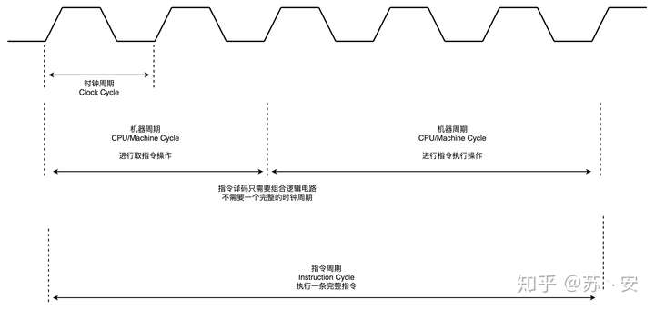

所以，我们说一个指令周期，包含多个 CPU 周期，而一个 CPU 周期包含多个时钟周期。

​		**cache分成多个组，每个组分成多个行，linesize是cache的基本单位，从主存向cache迁移数据都是按照linesize为单位替换的。比如linesize为32Byte，那么迁移必须一次迁移32Byte到cache。**


## H、本地安装

#### 1、安装前置：

```less
# install python3.12 for centos7.9
yum -y install zlib-devel bzip2-devel openssl-devel ncurses-devel sqlite-devel readline-devel tk-devel gcc make
yum -y install libmusdk-devel libfdt-devel libatomic libAArch64crypto libIPSec_MB libwd-devel libisal-devel cuda-devel

# install meson /* 安装meson需要注意，经量使用python安装，因为meson主要是为了适配ninja的编译 */
/* 如果你有多个python环境，则可以查看 vim ./build/build.ninja 文件中"python"的使用版本是哪一个，然后进行安装 */
	pip3.6 install meson
/* 否则你使用yum安装，则可能在 ninja -C build 时出现错误：
	Q1: ModuleNotFoundError: No module named 'mesonbuild.utils'
		1、yum remove原来的meson
		2、pip3.6 install meson
*/

```

#### 2、编译：

```shell
#新建一个build目录，如果你是拷贝倒新机器上，记得把build目录删除重新meson编译，不然机器之间的差异会导致后续ninja的错误
#或者就用windows本机上的源码打包上传linux进行编译(因为我当时出现很多编译错误，发现可能时因为当时机器scp过来的和Windows本机的代码版本不一致导致的)
mkdir build 
meson -Dexamples=all build #meson  build
ninja -C build
# 安装 ninja -C build install  ||  ninja install  
cd ./build/examples/ #就是执行程序

# 如果需要重新build，把目录build删除，重新meson即可
# 对于只是修改了example中的代码，或者dpdk源码，只需要重新执行ninja编译即可
ninja -C build

#其它相关命令
ninja -C build clean
meson setup build
ninja -C build

```

#### 3、l2fwd使用：

```less
cd ./build/examples/
# 示例
./dpdk-l2fwd -l 0-3 -n 4 -m 2048 --legacy-mem --huge-unlink  --no-telemetry -- -p 0x11
./dpdk-l2fwd -l 0-3 -n 4 -m 50g --legacy-mem --huge-unlink  --no-telemetry -- -p 0x11
```

##### 3.1 关闭telemetry

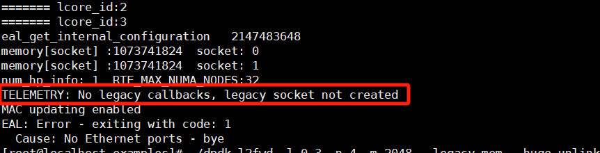

```elixir
rte_telemetry_legacy_register 主要用于保持旧版 DPDK 遥测系统命令的兼容性，帮助用户逐步过渡到新的 DPDK 遥测框架。
```

1. **在编译时禁用遥测功能**

在编译 DPDK 时，可以通过配置选项禁用遥测模块。你可以在使用 Meson/Ninja 构建 DPDK 时，禁用 `telemetry` 选项：

```bash
meson configure -Dtelemetry=false
ninja
```

这样 DPDK 就不会编译和链接遥测相关的代码模块，从而完全禁用遥测功能。

2. **在运行时禁用遥测**

如果你不想在编译时禁用遥测功能，而是希望在运行时不使用它，可以通过以下几种方式实现：

2.1 **设置环境变量**

你可以通过设置 `DPDK_NO_TELEMETRY` 环境变量来禁用遥测功能：

```bash
export DPDK_NO_TELEMETRY=1
```

这会阻止 DPDK 在运行时初始化遥测系统。

2.2 **命令行参数**

在启动 DPDK 应用程序时，添加 `--no-telemetry` 参数也可以禁用遥测功能。例如：

```bash
./dpdk-app -l 0-3 -n 4 --no-telemetry
```

这个参数会禁用 DPDK 中的所有遥测功能，确保不使用任何遥测命令。


##### 3.2 l2fwd端口选择

加入我们使用下面两个网卡，那么从上往下就是对应掩码：0x11 （00010001）

由此： -- -p 0x11 （--双短线是为了区分命令行参数范围，前面为dpdk的eal命令参数，后面-p为l2fwd的命令参数）

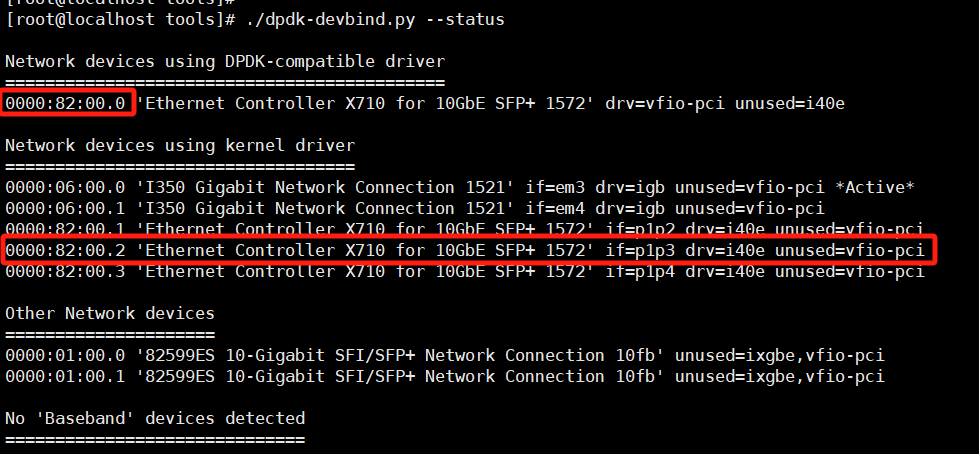

在实际使用中，**l2fwd至少需要两个端口(`dpdk-l2fwd` 不需要物理连接回环)**，用来做传输回环，所以我们将p1p3进行vfio-pci绑定后，portmask变成了0x3；

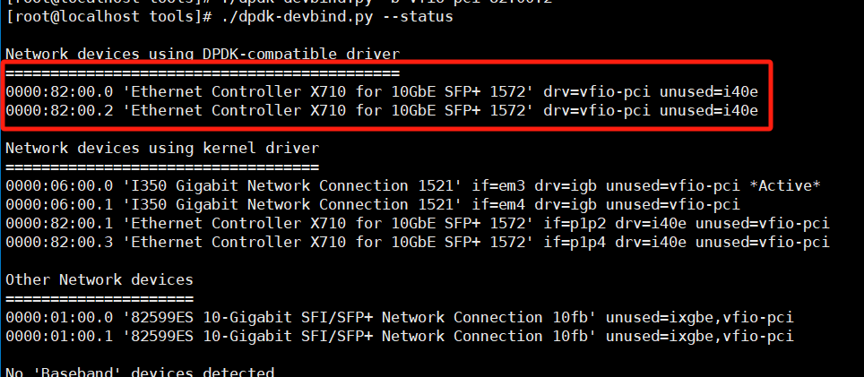

命令最终变成：

```bash
rm -rf ./build && meson -Dexamples=all build && ninja -C build

./build/examples/dpdk-l2fwd -l 0-3 -n 4 -m 50g --legacy-mem --huge-unlink  --no-telemetry -- -p 0x3

# acl测试
./acl_test -c 0x3 -n 4 --file-prefix acl

./dpdk-bbdev_app -l 0-3 -n 4 -m 5g --legacy-mem --huge-unlink -a 0000:f4:00.2 --file-prefix fdir

./dpdk-ipsec-secgw -l 0-3 -n 4 -m 5g --legacy-mem --huge-unlink -a 0000:f4:00.2 --file-prefix fdir -- -f ../../examples/ipsec-secgw/ep0.cfg --config 0000:f4:00.2,1,0 -p 1
```


##### 1.3 使用SIMD量收包rx函数

详细可以查看源码 i40e_set_rx_function：**目前我们要考虑，如何开启使用avx2矢量收包？**

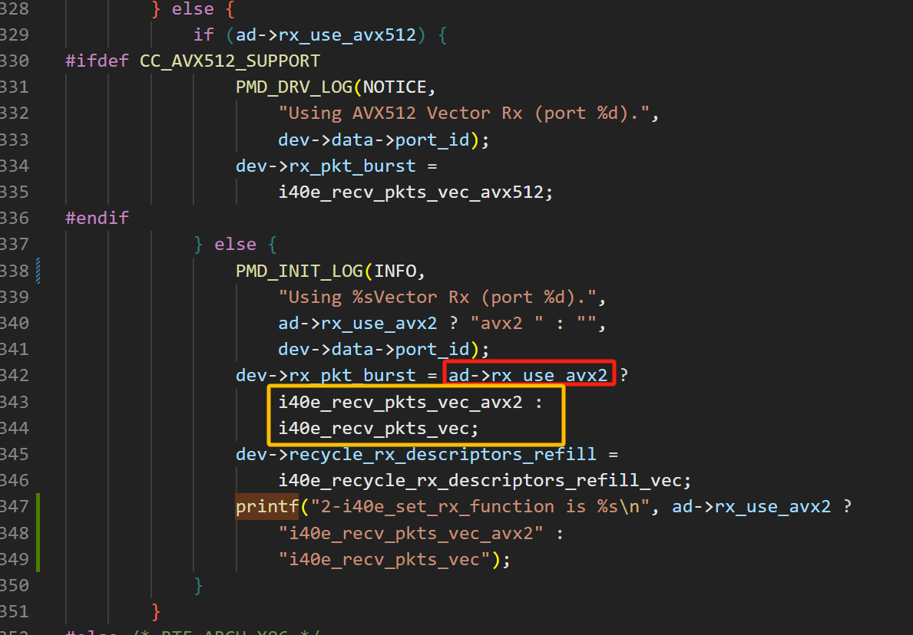

**目前dpdk会自己判断并设置网卡所支持的收包模式，例如在：33机器的cpu下（满足avx2），e800网卡ice收包时则会使用AVX2进行矢量收包**

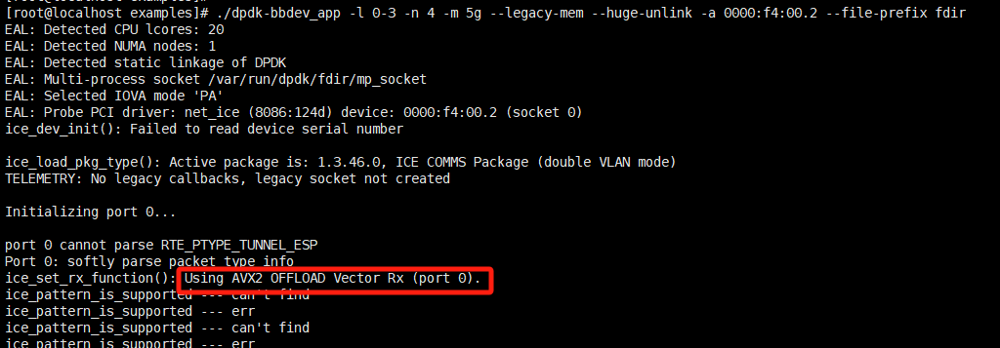

具体性能原理可以查看**《SIMD-AVX性能对比》**

```less
 --force-max-simd-bitwidth=256
```

在没有指定simd位宽时（且cpu不满足avx指令集要求）的 i40e网卡 默认rx回调函数：i40e_recv_pkts_vec

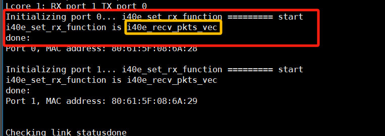

指定simd位宽为avx2即256位后，记住要加在eal命令行中：

```bash
./build/examples/dpdk-l2fwd -l 0-3 -n 4 -m 50g --legacy-mem --huge-unlink  --no-telemetry --force-max-simd-bitwidth=256 -- -p 0x3
```

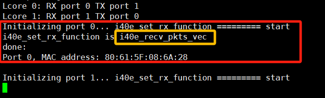

可以发现**rx收包回调函数并没有发生变化**，其主要原因**可以查看《2、AVX矢量收包种类》**

```apl
虽然cpu支持avx2，但是并没有支持avx512f指令集，所以没办法使用vec矢量收包。
```


## 一、线程篇

### 1、线程优先级与调度策略

#### 1.1 线程内核

```less
1、核心初始化和启动在 rte_eal_init() 中完成。它由对 pthread 库的调用组成。
# 函数文件：~dpdk\lib\eal\unix\rte_thread.c

pthread_attr_init(&attr) 
	//  初始化一个 pthread_attr_t attr 结构体;
pthread_attr_setinheritsched(attrp, PTHREAD_EXPLICIT_SCHED) // inherited：继承
	/* 设置调度器继承与否
    PTHREAD_INHERIT_SCHED : 新建的线程将继承创建者线程中定义的调度策略, 忽略在 pthread_create 调用中定义的所有调度属性
    PTHREAD_EXPLICIT_SCHED : 则将使用 pthread_create() 调用中的属性. */
pthread_attr_setschedpolicy(attrp, policy)
	/* 设置/获取 调度策略 SCHED_? */
pthread_attr_setschedparam(attrp, &param)
	/* 设置/获取 线程属性对象中的调度参数属性: 即调度优先级 */
pthread_create()
pthread_join()
	/* 以阻塞的方式等待thread指定的线程结束。当函数返回时，被等待线程的资源被收回。如果线程已经结束，那么该函数会立即返回。并且thread指定的线程必须是joinable的。如果多个线程同时尝试加入相同的线程，结果是未知的。如果线程调用pthread_join ()被取消，那么目标线程将保留可连接（即，它不会被分离） */
pthread_detach()
	/* 函数将thread标识的线程标记为已分离。当一个分离线程终止时，它的资源自动释放回系统，无需需要另一个线程加入已终止的线程。尝试分离已经分离的线程会导致未知的问题。 */
pthread_equal()
	/* 如果两个线程ID相等，返回一个非零值；否则，返回 0 */
pthread_getschedparam()
pthread_setschedparam()
	/* 设置/获取 调度策略和调度参数属性(调度优先级) */

pthread_key_create(&((*key)->thread_index), destructor)
	/* 函数将创建一个特定于线程的数据键 pthread_key_t thread_index，该键对进程中的所有线程都可见。pthread_key_create()提供的键值是不透明的对象，用于定位线程特定的数据。尽管不同的线程可以使用相同的键值，但pthread_setspecific()绑定到键的值是按每个线程维护的，并在调用线程的生命周期内持续存在。
	函数 pthread_key_create() 用来创建线程私有数据。该函数从 TSD 池中分配一项，将其地址值赋给 key 供以后访问使用。第 2 个参数是一个销毁函数，它是可选的，可以为 NULL，为 NULL 时，则系统调用默认的销毁函数进行相关的数据注销。如果不为空，则在线程退出时(调用 pthread_exit() 函数)时将以 key 锁关联的数据作为参数调用它，以释放分配的缓冲区，或是关闭文件流等。*/
	## 不论哪个线程调用了 pthread_key_create()，所创建的 key 都是所有线程可以访问的，但pthread_setspecific()绑定到键的值是按每个线程维护的，并在调用线程的生命周期内持续存在。各个线程可以根据自己的需要往 key 中填入不同的值，相当于提供了一个同名而不同值的全局变量(这个全局变量相对于拥有这个变量的线程来说)。
	
pthread_key_delete(key->thread_index)
	/* 注销一个 TSD 使用 pthread_key_delete() 函数。该函数并不检查当前是否有线程正在使用该 TSD，也不会调用清理函数(destructor function)，而只是将 TSD 释放以供下一次调用 pthread_key_create() 使用。在 LinuxThread 中，它还会将与之相关的线程数据项设置为 NULL。*/
pthread_setspecific(key->thread_index, void *value)
pthread_getspecific(key->thread_index)
	/* 根据key 设置/获取对应value值 */
pthread_setaffinity_np()
pthread_getaffinity_np()
	/*  设置/获取线程的CPU亲和力。
	对于Linux命令 taskset，可以设定单个进程运行的CPU */

## 所以dpdk的线程核心，依旧是以pthread为核心，封装的一系列函数。
## Linux线程的优先级是通过数字来表示的，数字越大表示优先级越高。 Linux中线程的优先级范围是0到99，其中0是最低优先级，99是最高优先级。 默认情况下，所有线程的优先级都是相同的，为中等优先级，即50。
// 通过下面的函数查看dpdk的设置逻辑
```

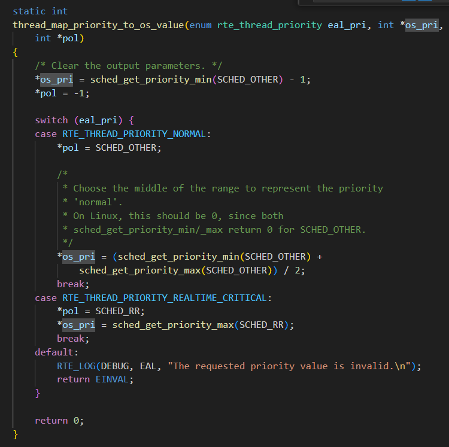

```less
## // 目前的dpdk就设置了两种线程优先级模式
enum rte_thread_priority {
	RTE_THREAD_PRIORITY_NORMAL            = 0,
	/**< normal thread priority, the default */
	RTE_THREAD_PRIORITY_REALTIME_CRITICAL = 1,
	/**< highest thread priority allowed */
};

// 根据函数逻辑可以看出
RTE_THREAD_PRIORITY_NORMAL // 线程优先级将设置为中等，即50
RTE_THREAD_PRIORITY_REALTIME_CRITICAL // 线程优先级将设置为最大值，即99
// https://github.com/Yuejiushi/pthread_single/blob/main/pthread.c 参考
rte的线程里面都创建有自己的 线程条件变量pthread_cond_t 和 互斥锁pthread_mutex_t;
```

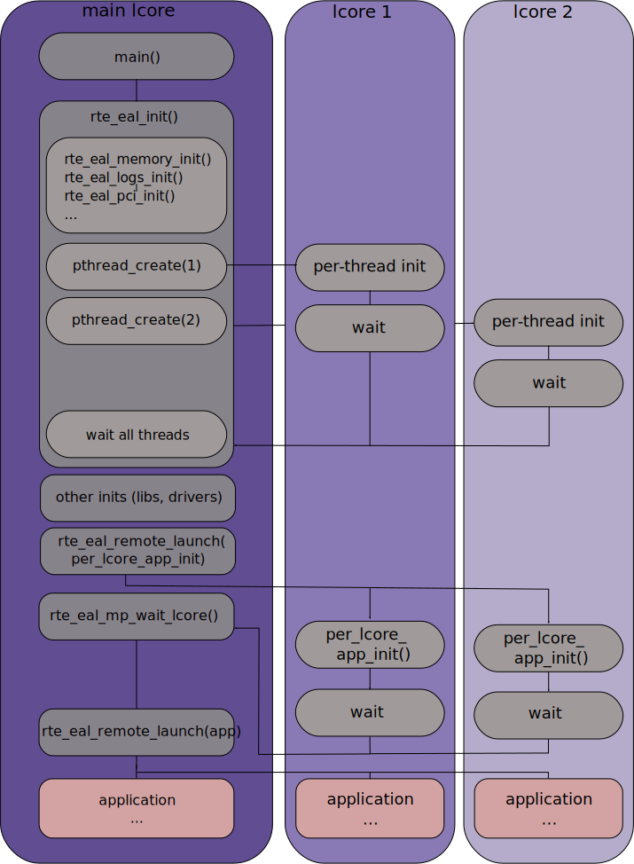

```less
在EAL资源（例如大页支持内存）初始化期间, 期间分配的内存rte_eal_init() 可以通过调用该函数来释放rte_eal_cleanup().

# 在线程创建初始化之后，还有几个关键函数
rte_eal_remote_launch(call_线程函数, (void*)线程参数， 线程ID) // 启动从线程
rte_eal_mp_wait_lcore 
/*  等待所有lcore从线程执行完毕, 自己才结束, 仅在 MAIN lcore 上执行。
	如果 worker_id 标识的 lcore 处于 RUNNING 状态，则等待该 lcore 完成其工作并转入 WAIT 状态。*/
```


#### 1.2 sched处理

```apl
# 分时策略
SCHED_OTHER 或 'SCHED_NORMAL: 默认策略
SCHED_BATCH ：与 SCHED_OTHER 类似，但会考虑吞吐量。
SCHED_IDLE: 比 SCHED_OTHER 更低的优先级策略。
# 实时策略   <实时线程对资源的优先级始终要高于>
SCHED_FIFO ：实时策略(先到先服务)
SCHED_RR   ：实时策略(时间片轮转服务)
SCHED_DEADLINE ：根据任务期限排列任务，哪个任务的deadline最邻近，就优先执行哪个任务。

# 特点
1、实时进程将得到优先调用，实时进程根据实时优先级决定调度权值。
	"1.SCHED_FIFO的高优先级线程会抢占低优先级线程.
	"2.SCHED_FIFO的高优先级线程一旦占用CPU并不主动放弃CPU的情况下将一直占用，此时低优先级线程得不到CPU时间；
2、分时进程则通过nice和counter值决定权值，nice越小，counter越大，被调度的概率越大，也就是曾经使用了cpu最少的进程将会得到优先调度。
```


### 2、多进程

```shell
--proc-type:用于将给定流程实例指定为主或辅助 DPDK 实例
--file-prefix:允许不想合作的进程拥有不同的内存区域
```


## 二、大页篇

### 1、内存映射与内存预留

```apl
# 参考 https://bbs.huaweicloud.com/blogs/291868

DPDK 内存子系统可以运行两种模式：动态模式和传统模式
rte_malloc 提供的 API 完成的内存预留也由大页支持，除非--no-huge给出选项。

# 动态内存模式
	在此模式下，DPDK 应用程序对大页的使用将根据应用程序的请求增加或减少。rte_malloc()通过或 其他方法进行的任何内存分配rte_memzone_reserve()都可能导致系统保留更多的大页。同样，任何内存释放都可能导致大页面被释放回系统。
	在此模式下分配的内存不保证是 IOVA 连续的。如果需要大块的 IOVA 连续（“大”定义为“多于一页”），建议对所有物理设备使用 VFIO 驱动程序（这样 IOVA 和 VA 地址可以相同，从而绕过完全物理地址），或使用传统内存模式。
	对于必须是 IOVA 连续的内存块，建议使用 指定标志的rte_memzone_reserve()函数RTE_MEMZONE_IOVA_CONTIG。这样，内存分配器将确保，无论使用何种内存模式，保留的内存都将满足要求，否则分配将失败。
	# 相关函数
		rte_mem_event_callback_register()函数注册内存事件回调。每当 DPDK 的内存映射发生更改时，这都会调用回调函数。
	    rte_mem_alloc_validator_callback_register() 收到有关高于指定阈值的内存分配的通知（并有机会拒绝它们）。


# 传统内存模式
	参数--legacy-mem指定EAL 的命令行开关来启用此模式。这个开关对 FreeBSD 没有影响，因为 FreeBSD 只支持传统模式。
	此模式模仿 EAL 的历史行为。也就是说，EAL 将在启动时保留所有内存，将所有内存排序为大的 IOVA 连续块，并且不允许在运行时从系统获取或释放大页
```

```less
不要将"预分配的虚拟内存"与"预分配的大页内存"混淆！所有 DPDK 进程在启动时都会预分配虚拟内存。大页稍后可以映射到预分配的 VA(Virtual Address) 空间（如果启用了动态内存模式），并且可以选择在启动时映射到其中.

// 预分配的大页内存是在linux在开机启动的时候根据配置分配的；
// 预分配的虚拟内存是在dpdk程序启动的时候操作；
```


#### 1、rte_malloc

```less
# rte_malloc 内存类函数查看
	查看对应逻辑，可以知道，rte_malloc内存的申请获取，'并不会优先从线程的当前配置socket'获取内存。
	默认情况下，它使用SOCKET_ID_ANY的配置，并更具socket的序号，从本身的NUMA node依次获取内存;
	如果本身NUMA node中没有足够的内存，它将会去主进程的socket中获取中获取。

void *rte_malloc(const char *type, size_t size, unsigned align)
	return rte_malloc_socket(type, size, align, SOCKET_ID_ANY); // SOCKET_ID_ANY
		 malloc_socket(type, size, align, socket_arg, true); // socket_arg = SOCKET_ID_ANY
			malloc_heap_alloc(type, size, socket_arg, 0, align == 0 ? 1 : align, 0, false);
			{
    			if (socket_arg == SOCKET_ID_ANY)
					socket = malloc_get_numa_socket(); // 见下面详细函数
				else
					socket = socket_arg;
                 heap_id = malloc_socket_to_heap_id(socket); // /* turn socket ID into heap ID */
			}

/* 当socket_arg == SOCKET_ID_ANY时 */
static unsigned int malloc_get_numa_socket(void)
{
	if (socket_id != (unsigned int)SOCKET_ID_ANY)
		return socket_id;

	/* for control threads, return first socket where memory is available */
    # 逐个查验每个socket插槽
	for (idx = 0; idx < rte_socket_count(); idx++) {
		socket_id = rte_socket_id_by_idx(idx);
		if (conf->socket_mem[socket_id] != 0) // 判断该sockt是否还留有内存
			return socket_id;
	}
	/* We couldn't quickly find a NUMA node where memory was available,
	 * so fall back to using main lcore socket ID.
	 */
	socket_id = rte_lcore_to_socket_id(rte_get_main_lcore());
	/* Main lcore socket ID may be SOCKET_ID_ANY
	 * when main lcore thread is affinitized to multiple NUMA nodes.
	 */
	if (socket_id != (unsigned int)SOCKET_ID_ANY)
		return socket_id;
	/* Failed to find meaningful socket ID, so use the first one available. */
	return rte_socket_id_by_idx(0);
}
```


#### 2、internal_config

```less
#1-TATL:总内存大小
#define MEMSIZE_IF_NO_HUGE_PAGE (64ULL * 1024ULL * 1024ULL)  // 64M
// 这个值的最大取值是多少，其实取决于 /usr/include/stdint.h 中的定义，如果其中没有定义，才会取下面的一个数值。
#define SIZE_MAX 0xffffffffui32 // 对于32位机器约等于4G  64位则是：17179869184G
static struct internal_config internal_config; // dpdk全局变量

// 对于默认的 internal_conf 内存分配
		if (internal_conf->no_hugetlbfs)
			internal_conf->memory = MEMSIZE_IF_NO_HUGE_PAGE; // 64MB
		else
			internal_conf->memory = eal_get_hugepage_mem_size(); // 获取系统预留的的全部大页大小
		|
		|
		|

// 函数实例
static inline size_t eal_get_hugepage_mem_size(void) {
    // 计算全部的huge大小
    // num_hugepage_sizes指明当前系统配置的大页大小
	for (i = 0; i < internal_conf->num_hugepage_sizes; i++) {
		struct hugepage_info *hpi = &internal_conf->hugepage_info[i];
		if (strnlen(hpi->hugedir, sizeof(hpi->hugedir)) != 0) {
			for (j = 0; j < RTE_MAX_NUMA_NODES; j++) {
				size += hpi->hugepage_sz * hpi->num_pages[j]; // 循环累加各个node的大页大小  单张大页的大小*大页数量
	return (size < SIZE_MAX) ? (size_t)(size) : SIZE_MAX;

```


### 2、hugePage

#### 1、大页的系统支持

```apl
	lscpu命令查看
	(1)pse存在，2M大页得到支持；
	(2)pdpe1gb 存在，则支持 1G 大页；
	(3)Huge pages 有两种格式大小： 2MB 和 1GB ， 2MB 页块大小适合用于 GB 大小的内存， 1GB 页块大小适合用于 TB 级别的内存
	
## 或者查看系统是否开启大页TLB配置选项
```

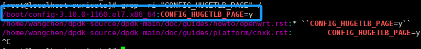

#### 2、大页的优势

```less
	(1) 减少转换后的TLB表索引个数。从而减少了将虚拟页地址转换为物理页地址所需的时间，降低TLB miss。标准 4k 页面大小会出现较高的 TLB 未命中率，从而降低性能。（减少TLB Miss； 减少页表查询的耗时； 减少内核管理内存消耗的资源）
	(2) 并非是越大的大页越好，大页越大，获取到物理内存时的查询操作时间也会增加，所以需要根据自己的系统进行调测；
```

#### 3、hugetlbfs挂载

```less
默认是：/proc/mounts 下的 hugetlbfs 选项。
# 一次性的配置方式：
	mkdir /dev/hugepages
	mount -t hugetlbfs pagesize=1GB /dev/hugepages 
# 通过将以下行添加到文件中，可以使安装点在重新启动后永久保存/etc/fstab：
	nodev /dev/hugepages hugetlbfs pagesize=1GB 0 0
	mount -t hugetlbfs nodev /dev/hugepages
```

##### 3.1 hugetlbfs的作用

```apl
/*
	在Linux系统中，hugetlbfs文件系统用于支持大页（Huge Pages）内存的分配和管理。当你在/dev/hugepages或类似的hugetlbfs挂载目录下创建内存映射文件时，使用的确实是大页内存。这些大页内存通常比普通的页面大很多，通常为2MB或1GB，具体取决于系统配置。
	而在其他目录下创建的内存映射文件则使用的是普通的页（Normal Pages），这些页面大小通常是4KB。
	大页内存的优势在于减少TLB（Translation Lookaside Buffer）的压力，提高内存访问效率，特别是在大内存系统中或需要处理大量数据时，可以显著提升性能。
*/
```

##### 3.2 其它使用大页的方法

```apl
即使没有挂载 hugetlbfs 文件系统，仍然可以使用其他方法来分配和使用大页内存，但这些方法可能会复杂一些，且不如 hugetlbfs 方便

1. 使用 mmap 和 MAP_HUGETLB
	void *addr = mmap(NULL, length, PROT_READ | PROT_WRITE, MAP_PRIVATE | MAP_ANONYMOUS | MAP_HUGETLB, -1, 0);

2. 使用 shmget 和 SHM_HUGETLB
	int shmid = shmget(IPC_PRIVATE, length, IPC_CREAT | SHM_HUGETLB | 0666);
```

```less
shmget 与 mmap 的区别
用途：
	shmget：主要用于进程间共享内存。
	mmap：  既可用于文件映射，又可用于匿名内存分配，灵活性更高。
实现机制：
	shmget：基于 System V IPC 机制，通过共享内存段进行进程间通信。
	mmap：  POSIX 标准，基于内存映射文件或匿名内存，可以将文件内容直接映射到内存地址空间。
使用场景：
	shmget：适用于需要多个进程共享特定内存段的场景，如进程间通信。
	mmap：  适用于需要将文件内容映射到内存或进行匿名内存分配的场景，灵活性更高。
权限控制：
	shmget：通过共享内存段的权限标志控制。
	mmap：  通过文件权限和内存映射标志控制。
```

##### 3.3 程序运行过程中删除映射文件

```less
// 传统内存模式（动态没试过）: 但是目前我没有在动态模式下看到物理地址转换的操作。
//我再dpdk(suricata)程序运行时(做完了大页内存的映射init)，删除了原本/dev/hugepages目录下的映射文件，发现程序已经保持正常运行。

	Linux的内存管理机制：一旦内存映射建立，Linux内核会维护这些映射，即使删除了映射文件，内核仍然会保持映射的有效性。只有当程序显式地解除了这些映射（使用munmap系统调用）或者程序退出时，内核才会释放这些映射。
	DPDK的内存管理：DPDK可能在其运行时有特定的内存管理策略，例如内存预分配或持久映射。即使删除了映射文件，DPDK可能会继续使用已映射的内存区域，直到程序显式地释放这些内存或者重新启动程序。
	操作系统和硬件的交互：大页内存通常与操作系统和硬件之间的交互密切相关。删除映射文件并不会立即影响到正在使用大页内存的程序，除非程序需要重新访问这些内存区域或者重新分配新的大页内存。

// 原因如下
```

##### 3.4 大页虚拟地址到物理的转换(dpdk)

```apl
		if (rte_eal_using_phys_addrs() &&
				rte_eal_iova_mode() != RTE_IOVA_VA) { ## 这里有dpdk参数设置，可以要求dpdk在存储内存地址时时VA/PA。
			/* find physical addresses for each hugepage */
			if (find_physaddrs(&tmp_hp[hp_offset], hpi) < 0) {
				RTE_LOG(DEBUG, EAL, "Failed to find phys addr "
					"for %u MB pages\n",
					(unsigned int)(hpi->hugepage_sz / 0x100000));
				goto fail;
			}
		}
## rte_eal_using_phys_addrs
	|
	|
	
## rte_eal_has_hugepages() != 0 && rte_mem_virt2phy(&tmp) != RTE_BAD_PHYS_ADDR
## 只有在linux机器存在大页文件系统(no_hugetlbfs = 0)时，并且dpdk设置参数为RTE_BAD_PHYS_ADDR，才会尝试虚拟地址到物理地址的映射，并记录转换是否失败：RTE_BAD_PHYS_ADDR；

## 错误：也正因为如此，当正常情况下，程序eal初始化启动后，你即使删除/dev/hugepages目录下的映射文件，也不会出现程序内存bug。
'即使dpdk的mls中寸的虚拟地址，也不会受影响。因为虚拟地址会通过系统映射找到其对应的物理地址位置。'


/proc/self/pagemap 文件在 Linux 系统中的作用是提供了进程虚拟地址与物理页框号（PFN）之间的映射关系。具体来说，它包含了系统中每个虚拟页框的详细信息，每一条记录对应于进程地址空间中的一个页面。

主要功能包括：
	获取物理地址： 通过读取 /proc/self/pagemap 文件，可以得知给定虚拟地址对应的物理页框号（PFN）。结合系统中的页框大小，可以计算出该虚拟地址对应的实际物理地址。
	映射信息： 提供了虚拟地址空间的映射信息，使得进程可以了解自身使用的虚拟地址如何映射到物理内存。
	调试和性能分析： 对于调试和性能分析工具来说，/proc/self/pagemap 文件是一种有用的资源，可以帮助分析进程内存使用情况、内存映射情况及页面错误等。
	权限和安全性： 访问 /proc/self/pagemap 需要适当的权限，通常要求进程具有足够的权限才能读取该文件。这确保了只有授权的程序可以查看和分析虚拟内存到物理内存的映射关系。
```

##### 3.5 与IOMMU的关系

```less
	Linux 的 hugetlbfs（Huge Pages 文件系统）本身并不直接使用 IOMMU。hugetlbfs 主要用于管理大页面（Huge Pages），这些页面用于提高内存管理的效率和性能。通常情况下，IOMMU 主要用于管理设备的直接内存访问（DMA）和虚拟化环境中的内存访问控制，以防止设备越界访问系统内存。

	然而，如果在使用 hugetlbfs 的系统中，某些特定的设备需要进行 DMA 操作，并且这些设备的驱动程序已经配置了合适的 IOMMU 映射，那么在这种情况下，IOMMU 可能会涉及到系统中的内存管理。但这并不是 hugetlbfs 直接使用 IOMMU，而是与系统的整体内存管理和设备访问相关联的一部分。

// 具体可以查看 《IOMMU与linux-kernel内存管理》
```


#### 4、区分<保留大页>与<预留大页>：只是方便理解

```less
	预留大页： 系统启动前，在系统启动配置文件中配置，并在系统启动过程中生效的大页配置；
	保留大页： dpdk-hugepages -r size进行，用于指定运行时分配的 Huge Pages 的数量。具体来说，这个参数控制了在 DPDK 运行时从系统中分配多少个 Huge Pages。通常情况下，使用 -r 参数可以在启动 DPDK 应用程序时设置所需的 Huge Pages 数量，以确保应用程序能够有效地管理和利用大页内存，提高性能和效率。
	# 大页的大小一般只允许在系统启动配置文件中，进行预配置。
```

#### 5、大页的配置(echo型)：（查看各个node的大页数量）

```less
	默认是：   /sys/kernel/mm/hugepages  --> 
	# 配置'全局的NUMA节点'大页数量：例如
	// 为了向后兼容，保留了原来的 /proc 接口，所以才会出现下面两种设置方式。
	# 注意，该命令配置的大页数量时总数，也就是所有numa节点的大页数量之和，一般情况下会平均为每个NUMA配置相同的数量。
		echo 1024 > /sys/kernel/mm/hugepages/hugepages-2048kB/nr_hugepages  // 方式1
	# 或者
    	echo 40 > /proc/sys/vm/nr_hugepages // 方式2

	# 也可以为'单个NUMA节点'配置自己的大页数量：
		echo 1024 > /sys/devices/system/node/node0/hugepages/hugepages-2048kB/nr_hugepages
		echo 1024 > /sys/devices/system/node/node1/hugepages/hugepages-2048kB/nr_hugepages
	### 注意：不是每个系统都支持系统启动后的<保留大页>操作；
	

# 下图主要展示 /sys/kernel/mm/ 配置的 "均分操作"，即使无法平均的话，也会尽量减少差距值
 '注意：只有在系统内存足够的情况下，才允许调大对于node的大页大小。'
 "下面的方法，我在59上测试使用就可以实现，同时也会自适应修改/proc/meminfo中信息， 但是38上就修改不了，内存也够，为什么？"

 当时忘了可以使用 dmesg 和 /var/log/messages 查看系统消息的记录和查看，但有一些区别：
	1、dmesg：
		dmesg 是一个命令行工具，用于查看系统在运行时产生的内核消息（kernel messages）。
		这些消息包括系统启动时的信息、硬件识别、驱动程序加载、内核异常等。
		dmesg 输出的是实时的、动态生成的内核消息，通常用于即时查看系统状态和故障排除。
	2、/var/log/messages：
		/var/log/messages 是一个系统日志文件，记录了系统运行时的各种消息、事件和错误。
		这些消息包括系统启动、服务启动、用户登录、应用程序日志等。
		日志文件通常由系统日志守护进程（如 syslogd 或 rsyslogd）维护和管理，可以长期存储历史日志。
		/var/log/messages 中的内容通常是静态的，不像 dmesg 那样实时更新。

```

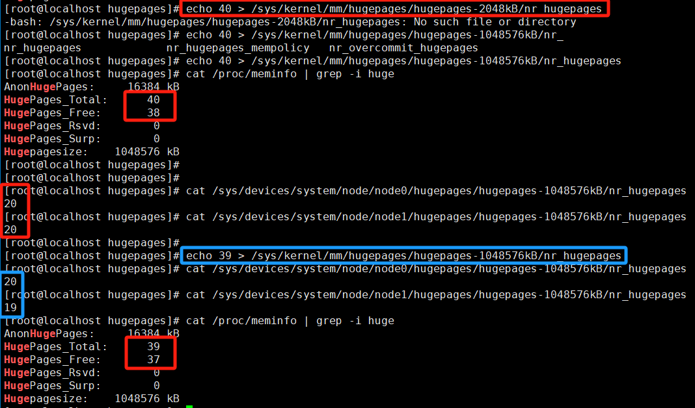

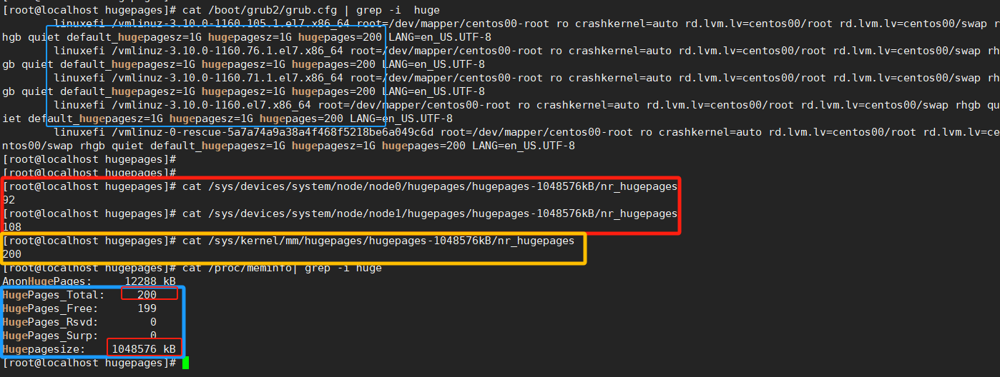

```apl
# 上图对应命令
cat /boot/grub2/grub.cfg | grep -i  huge
cat /sys/devices/system/node/node0/hugepages/hugepages-1048576kB/nr_hugepages 
cat /sys/devices/system/node/node1/hugepages/hugepages-1048576kB/nr_hugepages 
cat /sys/kernel/mm/hugepages/hugepages-1048576kB/nr_hugepages
cat /proc/meminfo| grep -i huge
numastat -cm | egrep 'Node|Huge' # 查看各个节点的大页内存大小，如下图
```

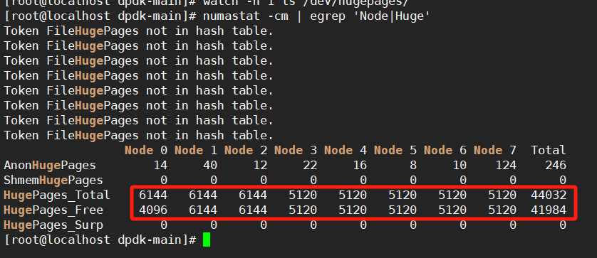

```ABAP
正常其实应该依次显示是：6g(因为一个大页1g大小)，而上面之所以显示是6144，其实单位是M，你可以单独执行 numastat -cm 命令，日志第一行其实就会显示：
	Per-node system memory usage (in MBs):
```

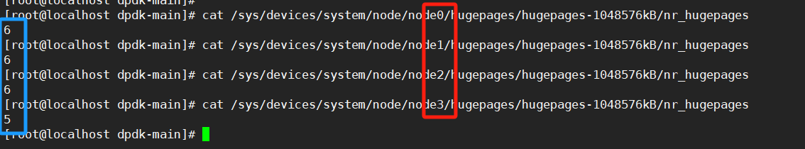


#### 6、大页的配置(grub型)

```shell
# /etc/default/grub
	default_hugepagesz=1G hugepagesz=1G hugepages=4 #详细操作可以查看对应文档的命令记录
```


#### 7、大页的配置(sysctl型)

```less
vim /etc/sysctl.conf
	vm.nr_hugepages = 40
	vm.nr_overcommit_hugepages = 10 // 该参数并非所有系统都支持

sysctl -p
```

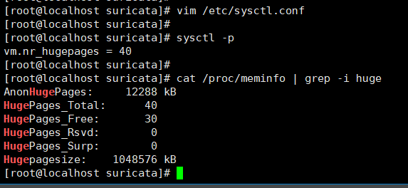


#### 8、设置大页方式的区别

```apl
	粒度不同：第一种方式通过文件系统路径直接指定大页的大小和数量，更具体和局部化；第二种方式是通过系统启动参数设置全局的默认大页参数，适用于整个系统。
	动态性：第一种方式可以在系统运行时动态调整(如果内存足够)，而第二种方式通常需要重启系统才能生效。
	适用范围：第一种方式更适合用于调试、测试或者临时性的大页配置调整(可能重启后被系统性的配置覆盖)；第二种方式更适合于长期和稳定的生产环境配置。
```


#### 9、大页的两个重要指标：Hugepagesize HugePages_Total

```elixir
	一般系统启动后不能修改Hugepagesize，除非你使用内核模块参数，但这也要看你的系统是否支持对应的huge模块加载：
		cat /proc/modules | grep -i huge
	或者
		find /lib/modules/<kernel_version> -name '*huge*'
	之后进行：（没试过）
		 modprobe hugepages
		 modprobe hugepages hugepagesz=4K
"正常我们都使用6中方法，重启进行size设置，但是HugePages_Total数量，我们却可以在启动后进行动态修改。"
```

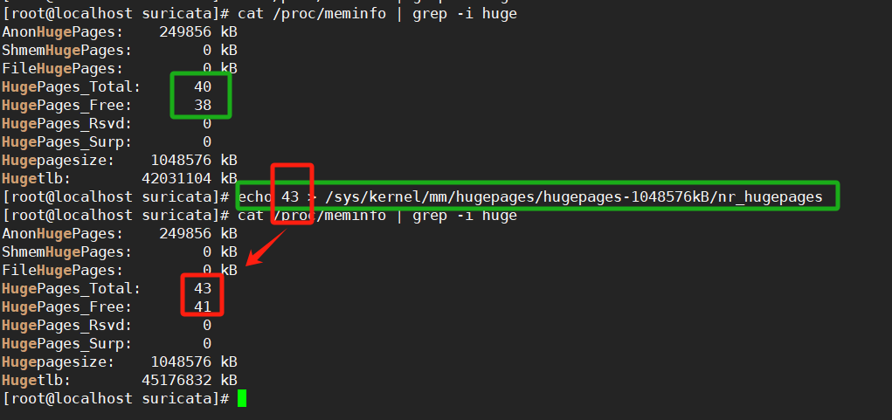


#### 10、Linux中对大页的技术描述

```dart
内核选项的更多详细信息
	参阅 Linux 源代码树中的 Documentation/admin-guide/kernel-parameters.txt 文件

// 以下为内容节选
	default_hugepagesz=
			[HW] The size of the default HugeTLB page. This is
			the size represented by the legacy /proc/ hugepages
			APIs.  In addition, this is the default hugetlb size
			used for shmget(), mmap() and mounting hugetlbfs
			filesystems.  If not specified, defaults to the
			architectures default huge page size.  Huge page
			sizes are architecture dependent.  See also
			Documentation/admin-guide/mm/hugetlbpage.rst.
			Format: size[KMG
 // 所以，其实对于hugetlbfs，其实也是采用了shmget(), mmap()之类的<共享内存>的操作管理形式；
   
```

#### 11、dpdk大页映射文件(大页文件系统)路径

```less
/*
要挂载大页（Huge Pages）内存系统，通常需要遵循以下步骤：
1、检查系统支持：
	首先，确保你的Linux内核已经配置支持大页内存。大部分Linux发行版默认支持大页内存，但你可以通过以下命令确认：
		grep Hugepagesize /proc/meminfo  //其实就是查看你所配置的大页文件大小
	这将显示系统支持的大页大小，例如 Hugepagesize: 2048 kB 表示支持的大页大小为2MB。

2、创建挂载点：
	在准备挂载大页文件系统之前，需要创建一个挂载点目录。通常情况下可以选择创建在 /dev/hugepages 目录下：
	sudo mkdir -p /dev/hugepages

3、挂载大页文件系统：
	大页文件系统通常是通过 hugetlbfs 类型来挂载的。使用 mount 命令挂载大页文件系统，语法如下：
		sudo mount -t hugetlbfs nodev /dev/hugepages
	这里的 -t hugetlbfs 指定了文件系统类型为大页文件系统，nodev 表示不需要设备文件。

4、确认挂载结果：
	执行 mount 命令确认大页文件系统是否已经成功挂载：
		mount | grep huge
	如果成功挂载，你应该会看到类似以下的输出：
		hugetlbfs on /dev/hugepages type hugetlbfs (rw,relatime)

*/

检查挂载情况：
首先，查看系统是否已经挂载了大页文件系统。可以使用 mount 命令查看挂载点：
	mount | grep huge	
	如果看到类似以下的输出，则表示大页文件系统已经挂载：
		hugetlbfs on /dev/hugepages type hugetlbfs (rw,relatime)

查看大页映射文件： 映射文件一般位于 /dev/hugepages 目录下。你可以直接查看该目录，确认其中是否有大页文件：
	ls /dev/hugepages

如果目录中有文件，这些文件就是程序运行时所使用的大页映射文件（文件的大小，取决于你所设置大页的大小。文件的数量，取决于你大页使用的数量）。
```

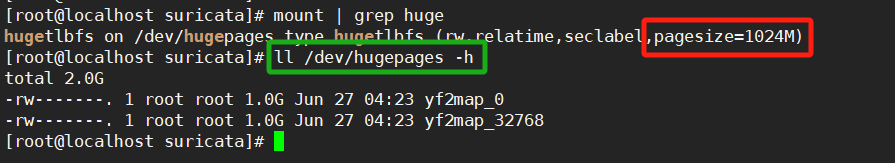


#### 12、dpdk是如何获取大页内存做映射的


```less

"NO.2部分"
# 然后我们开始梳理dpdk是如何获取大页内存做映射的

dpdk相关参数：#define OPT_HUGE_DIR   "huge-dir"   存储于=====>   <:internal_conf->hugepage_dir>

#1-TATL:大页内存相关配置获取   =======>   "<hugepage_info_init 大页初始化函数>"
// dpdk中相关大页的配置目录
static const char sys_dir_path[] = "/sys/kernel/mm/hugepages";
static const char sys_pages_numa_dir_path[] = "/sys/devices/system/node";
const char dirent_start_text[] = "hugepages-";
DIR *dir = opendir(sys_dir_path);
for (dirent = readdir(dir); dirent != NULL; dirent = readdir(dir)) { // 循环读取sys_dir_path目录中的大页配置
	// 循环读取 sys_dir_path 目录下的文件，因为系统可能支持多种大小的Huge；
	// 但最终要通过get_hugepage_dir来查看挂载的huge大小时哪一种
	// 系统大页文件大小函数：get_default_hp_size
		const char proc_meminfo[]  =  "/proc/meminfo";
		const char str_hugepagesz[] = "Hugepagesize:";  // 就是上面截图中的 Hugepagesize: 1048576 kB <单个大页大小>
		………………
	// 获取系统大页配置文件： get_hugepage_dir
	    # 文档内容实例： hugetlbfs /dev/hugepages hugetlbfs rw,seclabel,relatime 0 0
		const char proc_mounts[]  =  "/proc/mounts";
		const char hugetlbfs_str[] = "hugetlbfs";
		const char pagesize_opt[] =  "pagesize="; // 如果/proc/mounts的hugetlbfs里面没有该参数，则会使用上面的默认值。
		………………
		逻辑其实就是，从 /proc/mounts 配置目录中读取 hugetlbfs 配置目录
		strlcpy(hugedir, internal_conf->hugepage_dir != NULL ? internal_conf->hugepage_dir : found, len);
		
    	// 每存在一种可用的大页大小的配置，就累加一次。
    	num_sizes++;
}
internal_conf->num_hugepage_sizes = num_sizes; // num_hugepage_sizes存储的就是系统可配置的大页大小种类。


#2-TATL:大页内存大小的计算
（1）eal_legacy_hugepage_init // 传统预分配固定模式下的大页内存计算
   eal_get_hugepage_mem_size(void) {
	for (i = 0; i < internal_conf->num_hugepage_sizes; i++) { // 循环系统可用的huge大小种类
		struct hugepage_info *hpi = &internal_conf->hugepage_info[i];
		if (strnlen(hpi->hugedir, sizeof(hpi->hugedir)) != 0) { // 检索系统使用的huge种类
			for (j = 0; j < RTE_MAX_NUMA_NODES; j++) {  // 循环每个socket
				size += hpi->hugepage_sz * hpi->num_pages[j]; // 累加计算本次大页所使用的总内存为多少
                
                
（2）eal_dynmem_hugepage_init // 动态分批模式下的大页内存计算
   eal_dynmem_calc_num_pages_per_socket
	
```

#### 13、dpdk于内存相关的启动参数

```less
通过 -n 参数可以指定要使用的物理内存通道数目，这直接影响到大页内存的分配情况。
 
-m 2048 //默认单位为M
--socket-mem=1024,1024  // 这将为 socket 0 分配 1024 MB 内存，为 socket 1 分配 2048 MB 内存。
--socket-limit=2048,4096 // 设置分配上限
```

#### 14、resv_hugepages

```less
cat /sys/kernel/mm/hugepages/hugepages-1048576kB/resv_hugepages
// 设置保留多少大小的大页。如果没设置的话，就是0.

// yum install libhugetlbfs libhugetlbfs-utils 工具（目前我没试过，这里只是记录一下网上的方法）
hugeadm --pool-pages-min 1GB:10 
```

#### 15、nr_overcommit_hugepages

```less
/proc/sys/vm/nr_overcommit_hugepages 指定如果大页面数多于 /proc/sys/vm/nr_hugepages （配置的大页数量） 应用程序请求的页数，则大页池可以增长到多大。将任何非零值写入此文件表示，当持久的大页面池耗尽时，允许 hugetlb 子系统尝试从内核的正常页面池中获取该数量的“剩余”大页面。当这些多余的大页面变得闲置时，它们会被释放回内核的正常页面池中。
```

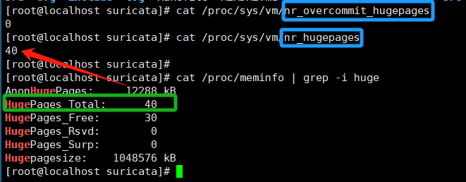

```less
增加大页内存池大小 (nr_hugepages):
	nr_hugepages 是一个内核参数，用于设置系统中大页（Huge Pages）的数量。大页是比普通页（通常是 4KB）更大的内存页（例如 2MB 或 1GB），用于减少页表开销，提高内存访问效率。

现有的多余页首先会被提升为持久大页:
	系统中可能存在一些额外的、未被使用的多余大页（Surplus Huge Pages），它们是超出当前 nr_hugepages 设置的部分。
	当你增加 nr_hugepages 的值时，这些多余的页会被首先提升（Promoted）为持久大页（Persistent Huge Pages）。持久大页是那些	通过 nr_hugepages 参数明确要求的、系统保留的页。

如果需要并且可能，会分配额外的大页来满足新的持久大页内存池大小:
		如果现有的多余大页不足以满足新的 nr_hugepages 设置，系统会尝试分配更多的大页。
		这意味着系统会从物理内存中划分出更多的大页，以确保总数达到新的 nr_hugepages 设置的要求。
		这个过程依赖于系统当前的内存状况和可用的物理内存。如果物理内存不足，可能无法分配所需的大页。

具体理解
  假设你当前的 nr_hugepages 设置为 100，而系统中实际上有 120 个大页（其中 20 个是多余的大页）。
  你决定将 nr_hugepages 增加到 150。
	系统会首先将这 20 个多余的大页提升为持久大页。此时，持久大页的数量增加到 120。
	系统还需要额外的 30 个大页（150 - 120）来满足新的设置。
	如果系统有足够的物理内存，可以分配出这额外的 30 个大页，则 nr_hugepages 将成功增加到 150。
	如果系统的物理内存不足，可能无法完全分配这 30 个大页，那么 nr_hugepages 的增加将受到限制。

/*  参看 7
 vim /etc/sysctl.conf  
  ## 添加参数
		vm.nr_hugepages = 40
		vm.nr_overcommit_hugepages = 10
 sysctl -p
```

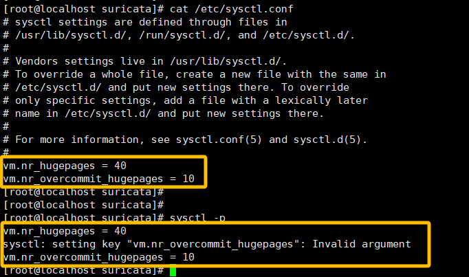

#### 16、nr_hugepages 和 nr_hugepages_mempolicy

原文：

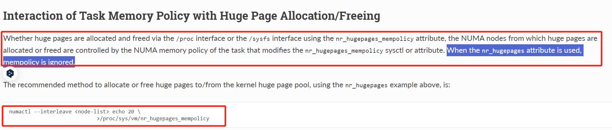

- **`nr_hugepages`**：设置全局大页数量，忽略当前任务的 NUMA 内存策略(nr_hugepages_mempolicy)。
- **`nr_hugepages_mempolicy`**：设置考虑 NUMA 内存策略的大页数量。

测试命令：

```less
yum install numactl

//为节点q配置10大页大小，lscpu显示有两个node，所以一共是20G
numactl -m 1 echo 10 > /proc/sys/vm/nr_hugepages_mempolicy 
cat /proc/sys/vm/nr_hugepages_mempolicy
cat /proc/sys/vm/nr_hugepages
echo 40 > /proc/sys/vm/nr_hugepages
cat /proc/sys/vm/nr_hugepages_mempolicy
cat /proc/sys/vm/nr_hugepages
// 结果如下，当配置了nr_hugepages，nr_hugepages_mempolicy就会被覆盖了。
```

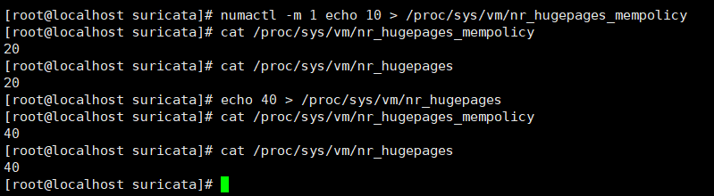


### 3、rte_eal_hugepage_init

**对于DPDK的动态内存模式，使用VFIO可以确保分配的内存是IOVA连续的。**

```c
int rte_eal_hugepage_init(void)
{
	const struct internal_config *internal_conf =
		eal_get_internal_configuration();

	return internal_conf->legacy_mem ?
			eal_legacy_hugepage_init() : // 传统模式
			eal_dynmem_hugepage_init(); // 动态模式
}

// 可以使用的相关参数
-m 2048：为应用程序分配 2048MB 的大页内存。
-n 4：指定 4 个内存通道。
--huge-dir /dev/hugepages：指定大页内存的挂载点目录为 /dev/hugepages。
--socket-mem 2048,2048：在 NUMA 节点 0 和 1 上各分配 2048MB 的大页内存。
--huge-unlink 参数在 DPDK 中的作用是在启动 DPDK 应用程序时删除已存在的所有大页文件。这对于清理系统中可能存在的旧大页文件非常有用，以确保应用程序能够正确地重新分配和管理大页内存。具体作用包括：
		1、清理旧文件：删除之前由 DPDK 创建的大页文件，避免可能的冲突或状态不一致性。
		2、重新分配内存：在启动时，系统将重新根据当前配置分配新的大页内存，确保内存的一致性和正确性。
	使用 --huge-unlink 参数时需要注意，它会删除指定目录（通常是 /dev/hugepages）下的所有大页文件。因此，在使用此参数时，请确保没有其他程序正在使用或依赖这些文件。
```


### 4、dynamic memory

#### 1、eal_dynmem_hugepage_init

```less
#path:dpdk\lib\eal\common\eal_common_dynmem.c
eal_dynmem_hugepage_init(void)

// 设置internal_conf每个socket的内存大小
for (hp_sz_idx = 0; hp_sz_idx < RTE_MAX_NUMA_NODES; hp_sz_idx++)
		memory[hp_sz_idx] = internal_conf->socket_mem[hp_sz_idx]; // 数组传递

// 计算获取每个socket上的所需分配的大页数量
eal_dynmem_calc_num_pages_per_socket(
// 传递memory数组<其实就是internal_conf->socket_mem> 在进行每个socket的内存分配
// 根据每个socket上的CPU内核数量，自动在检测到的socket之间分配请求的内存。
	total_size = internal_conf->memory; // 3.2中计算的总大页内存
	for (socket = 0; socket < RTE_MAX_NUMA_NODES && total_size != 0; socket++) {
         // （总内存 / 总的dpdk使用的cpu核数）* 该socket有几个cpu核
         // 注意，此处的 rte_lcore_count 返回系统中执行单元（lcores 逻辑核）的数量。
         // 			  cpu_per_socket 返回该socket下系统的	
		default_size = internal_conf->memory * cpu_per_socket[socket] / rte_lcore_count();

		// 还要与本socket下的实际内存相比较，取二者最小值 
		default_size = RTE_MIN(default_size, get_socket_mem_size(socket));

		// 设置该socket下的内存总量
		memory[socket] = default_size;
		total_size -= default_size;
	}
}
```

#### 2、dynmem大致映射过程

```less
略。
```


#### 3、eal_dynmem_calc_num_pages_per_socket

该函数，无论是**动态内存分配**还是**传统内存分配**都会使用，我们只在此处进行一些提及，具体可以查看代码逻辑。

```apl
它的主要作用，就是根据程序的（ lcore分配 + 内存参数指定），来以socket为隔，计算所需要的内存大小等信息存储与memory数组中，而hp_used数组用以存储，每个socket在实际分配计算时的真实内存使用状态。
```

下面两次执行，我预留分配2048M(默认为M)大小的大页内存，但是因为内核的使用不同，所以内存分配的大小、位置(socket)也不一样。

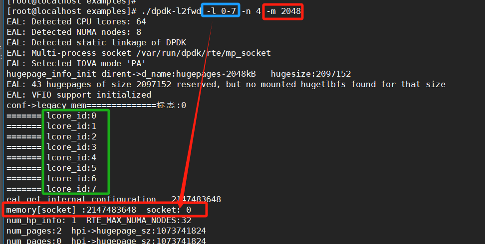

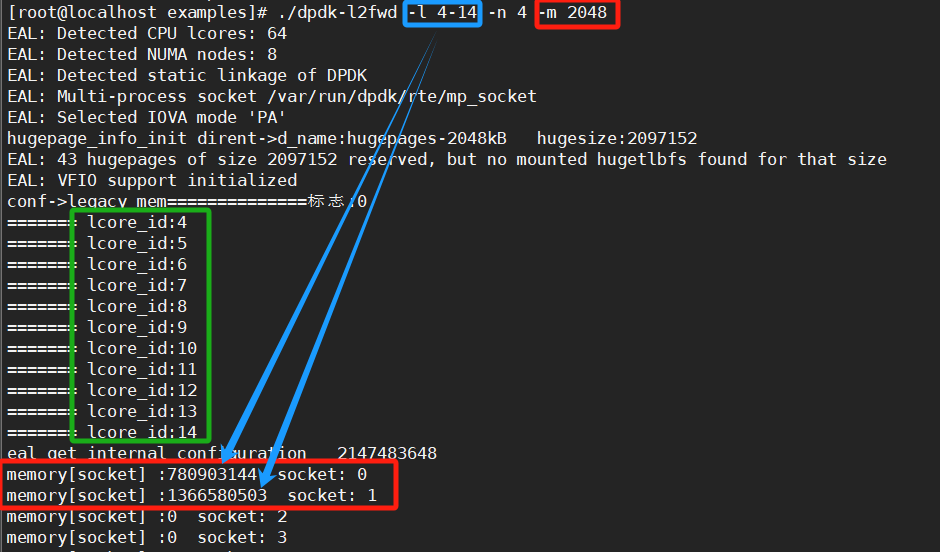

```less
NUMA:                    
  NUMA node(s):          8
  NUMA node0 CPU(s):     0-7
  NUMA node1 CPU(s):     8-15
  NUMA node2 CPU(s):     16-23
  NUMA node3 CPU(s):     24-31
  NUMA node4 CPU(s):     32-39
  NUMA node5 CPU(s):     40-47
  NUMA node6 CPU(s):     48-55
  NUMA node7 CPU(s):     56-63

运行1: 
	参数-l指定的0-7属于一个 socket0，所以内存全部从 socket0 分配；
运行2：
	参数-l指定的4-14来自两个socket，4-7(4个lcore)属于 socket0; 8-14(7个lcore)属于 socket1; 所以总的2048M内存，会按照4:7的比例分配到两个node中。 
	但是，如果我通过  --socket-limit 进行特殊指定，那么就会按照配置进行两个node的内存大小分配。
```

下面是源码梳理笔记：

```c

int
eal_dynmem_calc_num_pages_per_socket(
	uint64_t *memory, struct hugepage_info *hp_info,
	struct hugepage_info *hp_used, unsigned int num_hp_info)
{
	unsigned int socket, j, i = 0;
	unsigned int requested, available;
	int total_num_pages = 0;
	uint64_t remaining_mem, cur_mem;
	const struct internal_config *internal_conf =
		eal_get_internal_configuration();
	uint64_t total_mem = internal_conf->memory;

	if (num_hp_info == 0)
		return -1;

	/* if specific memory amounts per socket weren't requested */
	// 如果动态内存模式没有强制确定从那几个socket里获取内存。
	if (internal_conf->force_sockets == 0) {
		size_t total_size;
#ifdef RTE_ARCH_64
		int cpu_per_socket[RTE_MAX_NUMA_NODES];
		size_t default_size;
		unsigned int lcore_id;

		/* Compute number of cores per socket */
		memset(cpu_per_socket, 0, sizeof(cpu_per_socket));
		// 记录每个socket上面有几个逻辑核
		// 这里记录的lcore，只记录你程序运行所配置的那些逻辑核，相当于，归类你lcore属于那个socket，并且
		// 记录该socket包含几个需要使用的lcore。
		RTE_LCORE_FOREACH(lcore_id) {
			printf("======= lcore_id:%d\n", lcore_id);
			cpu_per_socket[rte_lcore_to_socket_id(lcore_id)]++;
		}

		/*
		 * Automatically spread requested memory amongst detected
		 * sockets according to number of cores from CPU mask present
		 * on each socket.
		 */
		total_size = internal_conf->memory;
		printf("eal_get_internal_configuration   %ld\n", total_size);
		for (socket = 0; socket < RTE_MAX_NUMA_NODES && total_size != 0;
				socket++) {

			/* Set memory amount per socket */
			// 根据这个socket的逻辑核占全部核的占比，来设置对应比例的内存。
			// 以下我们统称为“占比内存”
			default_size = internal_conf->memory *
				cpu_per_socket[socket] / rte_lcore_count();

			/* Limit to maximum available memory on socket */
			// 对比“占比内存”与“socket实际拥有内存”，取合适值。
			// 所以这里，可能sokcet上的内存，不满足于“占比内存”，导致最后 total_size 会有剩余。
			default_size = RTE_MIN(
				default_size, get_socket_mem_size(socket));

			/* Update sizes */
			memory[socket] = default_size;
			printf("memory[socket] :%ld  socket: %d\n", memory[socket], socket);
			total_size -= default_size;
		}

		/*
		 * If some memory is remaining, try to allocate it by getting
		 * all available memory from sockets, one after the other.
		 */
		// 当 total_size 出现剩余的时候。
		// 我们就会开始重新分配处理，为满足 剩余total_size 的要求，我们会从每个核的剩余内存中获取分配。
		// 直到 剩余total_size 为0，或者达到了RTE_MAX_NUMA_NODES。
		for (socket = 0; socket < RTE_MAX_NUMA_NODES && total_size != 0;
				socket++) {
			/* take whatever is available */
			default_size = RTE_MIN(
				get_socket_mem_size(socket) - memory[socket],
				total_size);

			/* Update sizes */
			memory[socket] += default_size;
			total_size -= default_size;
		}
#else 
		// 针对32位架构
		/* in 32-bit mode, allocate all of the memory only on main
		 * lcore socket
		 */
		total_size = internal_conf->memory;
		for (socket = 0; socket < RTE_MAX_NUMA_NODES && total_size != 0;
				socket++) {
			struct rte_config *cfg = rte_eal_get_configuration();
			unsigned int main_lcore_socket;

			main_lcore_socket =
				rte_lcore_to_socket_id(cfg->main_lcore);

			if (main_lcore_socket != socket)
				continue;

			/* Update sizes */
			memory[socket] = total_size;
			break;
		}
#endif
	}

	printf("num_hp_info: %d  RTE_MAX_NUMA_NODES:%d\n", num_hp_info, RTE_MAX_NUMA_NODES);
	for (socket = 0; socket < RTE_MAX_NUMA_NODES && total_mem != 0;
			socket++) {
		/* skips if the memory on specific socket wasn't requested */
		// num_hp_info为系统分配的大页种类个数
		// printf("	memory[socket]: %ld  socket:%d\n", memory[socket], socket);
		// memory[socket]为上面计算设置的，该socket下，需要分配多少内存。
		for (i = 0; i < num_hp_info && memory[socket] != 0; i++) {
			rte_strscpy(hp_used[i].hugedir, hp_info[i].hugedir,
				sizeof(hp_used[i].hugedir));
			
			// 计算该socket所被使用的大页数量
			hp_used[i].num_pages[socket] = RTE_MIN(
					// 而且要注意，这里是‘/’的关系，所以如果对于 3/2 = 1，其实是自动缩小了一个大页（将余数舍去了，所以可能导致memory[socket]有剩余）
					memory[socket] / hp_info[i].hugepage_sz, // 这里是根据配置的内存来计算，但是可能会超过该node所用拥有的内存。
					hp_info[i].num_pages[socket]); // 如果超过，就是要该node原本的大页数量

			// 计算总的内存大小。
			cur_mem = hp_used[i].num_pages[socket] *
					hp_used[i].hugepage_sz;

			// 所以，如果该socket所需内存不足与分配，那么memory[socket]就会有剩余。
			/*这分为两种情况
			* 	情况1：	可能该socket上发生了：*If some memory is remaining……*情形，即，一个socket需要分配自己的内存
			* 来补全其它socket。
			* 	情况2： 该socket上的内存不够分配memory[socket]所设置的内存大小。下面的if (memory[socket] > 0 将会给用户做告警提示。
			* */ 
			memory[socket] -= cur_mem;
			total_mem -= cur_mem;

			// 记录总的大页数量
			total_num_pages += hp_used[i].num_pages[socket];

			/* check if we have met all memory requests */
			// 如果memory[socket]为0，就意味着，该socket上的内存已经分配完成。
			if (memory[socket] == 0)
				break;

			// 但如果不等于0，先判断当前socket的大页是否已经被全部使用完。
			/* Check if we have any more pages left at this size,
			 * if so, move on to next size.
			 */
			// 如果是，就continue，留个下面的”RTE_LOG(ERR, EAL, "Not enough memory “告警
			if (hp_used[i].num_pages[socket] ==
					hp_info[i].num_pages[socket])
				continue;
			/* At this point we know that there are more pages
			 * available that are bigger than the memory we want,
			 * so lets see if we can get enough from other page
			 * sizes.
			 */
			remaining_mem = 0;
			// 计算该socket下总的剩余内存
			// num_hp_info指定的是系统所配置的大页种类数量（2K/4M/1G）
			// 		为什么这里 j = i+1，我们要知道，如果当前i类还有剩余，那么在hp_used[i].num_pages[socket] = RTE_MIN
			// 的时候就已经全部被分配出去了。
			for (j = i+1; j < num_hp_info; j++)
				remaining_mem += hp_info[j].hugepage_sz *
				hp_info[j].num_pages[socket];

			/* Is there enough other memory?
			 * If not, allocate another page and quit.
			 */
			/*
			* 这里有个细节：明明我们是计算的是j类，即其它num_hp_info上面有可用的内存，并且大小也满足，为什么会把相关计数存在hp_used[i]中？
			* 其实就把这类操作看似一个黑盒：
			* 	对于用户而言，它不在乎这里的内存是来自1G大页还是2M大页，它只要这个socket下的大页内存可以满足需要即可。而且，虽然我
			* 们累加到了i类大页里面，但是之后的内存映射分配还是会用j类大页，所以我们用统一的i类来进行计数管理也会更加方便。
			* */
			if (remaining_mem < memory[socket]) {
				// 因为上面的：memory[socket] / hp_info[i].hugepage_sz
				// 所以此处，我们只需要类似于将余数部分的内存memory[socket]加进来就行，但是因为余数必然是小于hp_info[i].hugepage_sz的；
				cur_mem = RTE_MIN(
					memory[socket], hp_info[i].hugepage_sz);
				memory[socket] -= cur_mem;
				total_mem -= cur_mem;
				hp_used[i].num_pages[socket]++;
				total_num_pages++;
				break; /* we are done with this socket*/
			}
		}

		/* if we didn't satisfy all memory requirements per socket */
		// 如果该socket下的大页内存不满足于配置要求，则需要给用户告警（socket粒度）。
		if (memory[socket] > 0 &&
				internal_conf->socket_mem[socket] != 0) {
			/* to prevent icc errors */
			requested = (unsigned int)(
				internal_conf->socket_mem[socket] / 0x100000);
			available = requested -
				((unsigned int)(memory[socket] / 0x100000));
			RTE_LOG(ERR, EAL, "Not enough memory available on "
				"socket %u! Requested: %uMB, available: %uMB\n",
				socket, requested, available);
			return -1;
		}
	}

	/* if we didn't satisfy total memory requirements */
	// 这里其实也是大页内存不足的告警，但这里是一个“总内存粒度”的提示告警。
	if (total_mem > 0) {
		requested = (unsigned int)(internal_conf->memory / 0x100000);
		available = requested - (unsigned int)(total_mem / 0x100000);
		RTE_LOG(ERR, EAL, "Not enough memory available! "
			"Requested: %uMB, available: %uMB\n",
			requested, available);
		return -1;
	}
	return total_num_pages;
}
```


### 5、legacy memory

```less
#path:dpdk\lib\eal\common\eal_memory.c
```

#### 1、eal_legacy_hugepage_init

```less
// 情形1： no-huge 针对no_hugetlbfs（为大页文件管理系统）的映射
if (internal_conf->no_hugetlbfs) {
	mcfg = rte_eal_get_configuration()->mem_config; // 获取mem_config，其用以存储内存相关配置
    msl = &mcfg->memsegs[0]; // 之后会不断累加
 	mem_sz = internal_conf->memory;
	page_sz = RTE_PGSIZE_4K; // 默认使用4k的大页大小
	n_segs = mem_sz / page_sz;  // 一共需要几个内存seg段
    eal_memseg_list_init_named(msl, "nohugemem", page_sz, n_segs, 0, true)
    // 创建共享内存文件fd
    memfd = memfd_create("nohuge", 0);
    ftruncate(memfd, internal_conf->memory) //将内存映射文件拓展大小至：配置中所需要的大页重量
    fd = memfd;
    // 开始对共享内存文件进行映射
    eal_memseg_list_alloc(msl, 0)；
    prealloc_addr = msl->base_va;
    // 将fd的共享内存映射至addr
	addr = mmap(prealloc_addr, mem_sz, PROT_READ | PROT_WRITE, flags | MAP_FIXED, fd, 0); // fd即是共享内存文件
    // 循环4k的大小，将addr逐步存储于msl->memseg_arr内存段数组中
    eal_memseg_list_populate(msl, addr, n_segs);
    return 0；
}

// 情形2：正常的legacy memory模式
	|
	| //具体可以查看代码逻辑。
大致步骤如下：
	1、对机器的全部huge进行映射文件创建；
	2、根据程序配置，只留下对应大小的huge映射文件；
	3、删除多余的huge映射文件；
	4、根据配置，进行va->pa的地址转换。
```


#### 2、legacy大致映射过程

<span style="color: rgb(200, 80, 400);">**传统模式下：dpdk进行大页申请时，函数 map_all_hugepages 调用是会对机器所设置的全部大页做一次内存映射，然后根据程序启动时eal参数所定的内存需求大小（如果-m/-sockt-mem没有进行设置，那么默认dpdk会使用全部的大页内存），最终再留下对于大小的内存映射文件；**</span>

```less
// 因为我当时配置了43g的大页内存（1g大页大小），所以一共是43个大页映射文件。
map_all_hugepages  hf->filepath========:/dev/hugepages/rtemap_0
map_all_hugepages  hf->filepath========:/dev/hugepages/rtemap_1
……………………
map_all_hugepages  hf->filepath========:/dev/hugepages/rtemap_41
map_all_hugepages  hf->filepath========:/dev/hugepages/rtemap_42

## 通过以下的瞬时截图，可以看到，大页内存在逐步做映射操作。
```

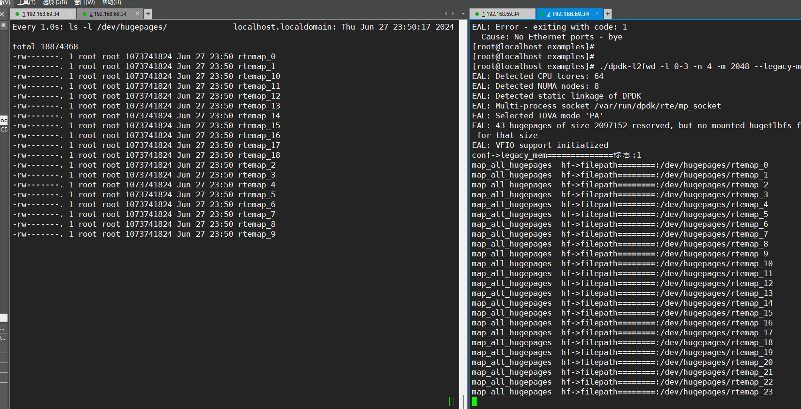

**但是最终，只会留下，我 -M 2048 参数所指定的2g内存大页映射文件：**

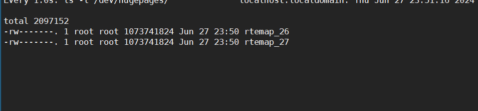

#### 3、多dpdk程序下的细节补充

​		**那假如，现在已经有一个dpdk1程序占据了部分大页内存（原43G大页，被其使用了4G），后启动的dpdk2程序会如何操**作呢：

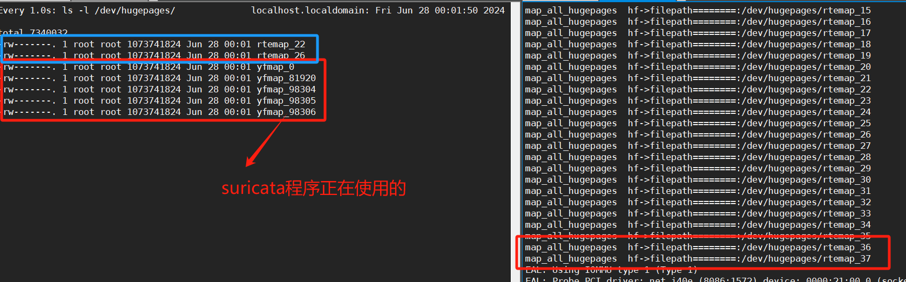

查看上面的截图，我们可以对比（右侧）文件按映射操作，发现：映射文件的数量，从先前截图的 42 ---> 37。因为其中的 5g 大页内存被我启动的suricata程序所使用，所以只剩下38g大页内存，也就只需要做38（0-37）个映射文件。

​	<span style="color: rgb(50, 200, 500);">总结：1、对于已经被使用了的大页，dpdk程序不会将其映射文件清除（即使你指定 --huge-unlink 参数也不行，只要那部分大页映射文件有程序在使用），它会从剩下的大页内存中获取自己需要的大小并做文件内存映射。 </span>

​	<span style="color: rgb(50, 200, 500);">		  2、假如 -m 50g 指定的大页内存超过了系统所剩余的大小，dpdk会为你报错：ETHDEV: failed to allocate private data，但不会停止程序。</span>


### 6 DMA内存使用

- **`lspci`**：列出所有PCI设备，您可以查找网卡、硬盘控制器等设备，这些设备通常支持DMA。

    ```shell
    lspci -vvv
    
    ## 列出了设备的不同能力，您可以查看是否有类似于 DMA 或者 BusMaster 的描述，这些通常与 DMA 相关。
    ## 例如下图中，我们根据网卡的pci地址21:00.3，查看其是否支持dma。
    [BusMaster+] 表示设备支持 Bus Mastering，即支持 DMA。
    [BusMaster-] 表示设备不支持 Bus Mastering，即不支持 DMA。
    #补充：
    I/O+：表示设备支持 I/O 空间访问。
    Mem+：表示设备支持内存空间访问。
    BusMaster+：表示设备支持 Bus Mastering，即支持 DMA（直接内存访问）。
    SpecCycle-：表示设备不支持 speculative access cycles。
    MemWINV-：表示设备不支持内存区域的写入无效化。
    VGASnoop-：表示设备不支持 VGA snooping。
    ParErr-：表示设备不支持 parity error response。
    Stepping-：表示设备不支持 system management mode stepping。
    SERR-：表示设备不支持 system error (SERR)。
    FastB2B-：表示设备不支持 fast back-to-back transactions。
    DisINTx+：表示设备支持禁用 INTx 中断传输。
    ```

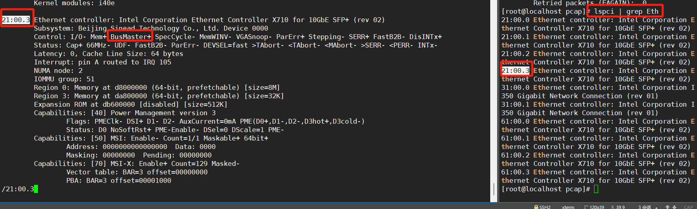


```less
// =======================
	如果我们的网卡是支持dma的，那么其实用户编写的 DPDK 应用程序中并没有显式地写明 DMA 的操作，但 DPDK 库本身在其内部实现中充分利用了 DMA 技术，以提升数据包处理的效率和性能。因此，用户在开发 DPDK 应用程序时主要关注如何使用 DPDK 提供的高层 API 来配置、管理网卡和处理数据包，而不需要直接编写和管理 DMA 相关的低层细节。
```


## 三、mbuf结构

### 1、rte_mbuf源码

```c
/**
 * 通用的 rte_mbuf 结构体，用于表示数据包的 mbuf。
 */
struct rte_mbuf {
    RTE_MARKER cacheline0;   /**< 标记，用于在缓存行边界上对齐字段。 */

    void *buf_addr;          /**< 段缓冲区的虚拟地址。 */
#if RTE_IOVA_IN_MBUF
    /**
     * 段缓冲区的物理地址。
     * 如果构建配置为仅使用虚拟地址作为 IOVA（即 RTE_IOVA_IN_MBUF 为 0），
     * 该字段是未定义的。
     * 强制对齐到 8 字节，以确保在 32 位和 64 位系统上的一致布局。
     */
    rte_iova_t buf_iova __rte_aligned(sizeof(rte_iova_t));
#else
    /**
     * 分段数据包的下一个段。
     * 当物理地址字段未定义时，此字段有效。
     * 否则，将使用第二个缓存行中的下一个指针。
     */
    struct rte_mbuf *next;
#endif

    /* 下一 8 字节在 RX 描述符重装时初始化 */
    RTE_MARKER64 rearm_data; /**< 用于 RX 描述符重装的数据。 */
    uint16_t data_off;       /**< 数据在段缓冲区中的偏移量。 */

    /**
     * 引用计数器。其大小应至少等于端口字段（16 位）的大小，
     * 以支持零拷贝广播。
     * 应仅通过以下函数访问：
     * rte_mbuf_refcnt_update()、rte_mbuf_refcnt_read() 和
     * rte_mbuf_refcnt_set()。这些函数的功能（原子性或非原子性）
     * 由 RTE_MBUF_REFCNT_ATOMIC 标志控制。
     */
    uint16_t refcnt;

    /**
     * 段的数量。仅对 mbuf 链的第一个段有效。
     */
    uint16_t nb_segs;

    /** 输入端口（16 位，以支持超过 256 个虚拟端口）。
     * 事件 eth Tx 适配器使用此字段来指定输出端口。
     */
    uint16_t port;

    uint64_t ol_flags;        /**< 卸载功能标志。 */

    /* 剩余字节在 RX 时从描述符中提取数据时设置 */
    RTE_MARKER rx_descriptor_fields1;

    /*
     * 数据包类型，表示外部/内部 L2、L3、L4 和隧道类型的组合。
     * packet_type 是关于 mbuf 中实际存在的数据的。
     * 例如：如果启用了 VLAN 去除，接收到的 VLAN 数据包将具有 RTE_PTYPE_L2_ETHER，
     * 而不是 RTE_PTYPE_L2_VLAN，因为 VLAN 已从数据中去除。
     */
    union {
        uint32_t packet_type; /**< L2/L3/L4 和隧道信息。 */
        __extension__
        struct {
            uint8_t l2_type:4;   /**< 外部 L2 类型。 */
            uint8_t l3_type:4;   /**< 外部 L3 类型。 */
            uint8_t l4_type:4;   /**< 外部 L4 类型。 */
            uint8_t tun_type:4;  /**< 隧道类型。 */
            union {
                uint8_t inner_esp_next_proto;
                /**< ESP 下一协议类型，在 RTE_PTYPE_TUNNEL_ESP 隧道类型
                 * 在 Tx 和 Rx 上都设置时有效。
                 */
                __extension__
                struct {
                    uint8_t inner_l2_type:4;
                    /**< 内部 L2 类型。 */
                    uint8_t inner_l3_type:4;
                    /**< 内部 L3 类型。 */
                };
            };
            uint8_t inner_l4_type:4; /**< 内部 L4 类型。 */
        };
    };

    uint32_t pkt_len;         /**< 数据包总长度：所有段的总和。 */
    uint16_t data_len;        /**< 段缓冲区中的数据量。 */
    /** VLAN TCI（CPU 顺序），在 RTE_MBUF_F_RX_VLAN 设置时有效。 */
    uint16_t vlan_tci;

    union {
        union {
            uint32_t rss;     /**< 如果启用了 RSS，RSS 哈希结果。 */
            struct {
                union {
                    struct {
                        uint16_t hash;
                        uint16_t id;
                    };
                    uint32_t lo;
                    /**< 第二 4 字节灵活字节。 */
                };
                uint32_t hi;
                /**< 第一 4 字节灵活字节或 FD ID，取决于 ol_flags 中的
                 * RTE_MBUF_F_RX_FDIR_* 标志。
                 */
            } fdir; /**< 如果启用 FDIR，则为过滤器标识符。 */
            struct rte_mbuf_sched sched;
            /**< 分层调度器：8 字节。 */
            struct {
                uint32_t reserved1;
                uint16_t reserved2;
                uint16_t txq;
                /**< 事件 eth Tx 适配器使用此字段存储 Tx 队列 ID。
                 * @see rte_event_eth_tx_adapter_txq_set()
                 */
            } txadapter; /**< Eventdev ethdev Tx 适配器。 */
            uint32_t usr;
            /**< 用户定义的标签。请参见 rte_distributor_process()。 */
        } hash;                   /**< 哈希信息。 */
    };

    /** 外部 VLAN TCI（CPU 顺序），在 RTE_MBUF_F_RX_QINQ 设置时有效。 */
    uint16_t vlan_tci_outer;

    uint16_t buf_len;         /**< 段缓冲区的长度。 */

    struct rte_mempool *pool; /**< 从中分配 mbuf 的内存池。 */

    /* 第二缓存行 - 仅在慢路径或 TX 中使用的字段 */
    RTE_MARKER cacheline1 __rte_cache_min_aligned;

#if RTE_IOVA_IN_MBUF
    /**
     * 分段数据包的下一个段。必须在最后一个段或非分段数据包中为 NULL。
     */
    struct rte_mbuf *next;
#else
    /**
     * 为动态字段保留的区域
     * 当下一个指针在第一个缓存行中时（即 RTE_IOVA_IN_MBUF 为 0）。
     */
    uint64_t dynfield2;
#endif

    /* 支持 TX 卸载功能的字段 */
    union {
        uint64_t tx_offload;       /**< 组合的卸载功能字段，方便提取。 */
        __extension__
        struct {
            uint64_t l2_len:RTE_MBUF_L2_LEN_BITS;
            /**< L2 (MAC) 头部长度，对于非隧道数据包。
             * 对于隧道数据包，Outer_L4_len + ... + Inner_L2_len。
             */
            uint64_t l3_len:RTE_MBUF_L3_LEN_BITS;
            /**< L3 (IP) 头部长度。 */
            uint64_t l4_len:RTE_MBUF_L4_LEN_BITS;
            /**< L4 (TCP/UDP) 头部长度。 */
            uint64_t tso_segsz:RTE_MBUF_TSO_SEGSZ_BITS;
            /**< TCP TSO 段大小。 */

            /*
             * 支持隧道 TX 卸载的字段。
             * 对于不请求任何隧道卸载的包（外部 IP 或 UDP 校验和，
             * 隧道 TSO），这些字段是未定义的。
             *
             * PMD 不应在计算偏移量时无条件使用这些字段。
             *
             * 应用程序应在填充这些字段时设置适当的隧道卸载标志。
             */
            uint64_t outer_l3_len:RTE_MBUF_OUTL3_LEN_BITS;
            /**< 外部 L3 (IP) 头部长度。 */
            uint64_t outer_l2_len:RTE_MBUF_OUTL2_LEN_BITS;
            /**< 外部 L2 (MAC) 头部长度。 */

            /* uint64_t unused:RTE_MBUF_TXOFLD_UNUSED_BITS; */
        };
    };

    /** 附加到 mbuf 的外部缓冲区的共享数据。请参见
     * rte_pktmbuf_attach_extbuf()。
     */
    struct rte_mbuf_ext_shared_info *shinfo;

    /** 应用程序私有数据的大小。如果是间接 mbuf，它存储
     * 直接 mbuf 的私有数据大小。
     */
    uint16_t priv_size;

    /** 与 IEEE1588 一起使用的时间同步标志。 */
    uint16_t timesync;

    uint32_t dynfield1[9]; /**< 为动态字段保留的区域。 */
} __rte_cache_aligned;
```


### 2、rte_mbuf 设计亮点

下面是添加了“解决问题”列的 `rte_mbuf` 设计亮点总结表格：

| **设计亮点**           | **描述**                                                     | **解决的问题**                               |
| ---------------------- | ------------------------------------------------------------ | -------------------------------------------- |
| **缓存对齐与性能优化** | 使用 `RTE_MARKER` 和 `__rte_cache_aligned` 确保字段在缓存行中对齐，提高访问效率。 | 提高内存访问速度，减少缓存未命中。           |
| **虚拟和物理地址支持** | 支持虚拟地址（`buf_addr`）和物理地址（`buf_iova`），通过 `RTE_IOVA_IN_MBUF` 控制使用虚拟或物理地址。 | 灵活地适配不同硬件和内存管理策略。           |
| **高效的引用计数**     | `refcnt` 字段用于引用计数，支持零拷贝广播，并通过函数（`rte_mbuf_refcnt_update()` 等）进行管理，支持原子或非原子操作。 | 高效管理 mbuf 的引用，支持零拷贝和并发处理。 |
| **丰富的元数据和标志** | `ol_flags` 用于存储卸载功能标志，`packet_type` 提供数据包的类型信息，包括 L2、L3、L4 和隧道类型。 | 支持多种数据包处理功能和高效的流量分析。     |
| **灵活的扩展性**       | `priv_size` 支持应用程序私有数据的大小，`shinfo` 用于共享外部缓冲区的信息。 | 允许应用程序扩展 mbuf 结构，适应不同需求。   |
| **支持多种功能**       | `data_off` 和 `pkt_len` 记录数据包的偏移和总长度，`tx_offload` 支持发送相关的卸载功能。 | 处理复杂的数据包结构和支持各种卸载功能。     |
| **分段与链式结构**     | `nb_segs` 和 `next` 支持数据包的分段和链式结构，允许处理大型数据包和复杂的数据流。 | 支持大数据包的拆分和处理，优化内存使用。     |
| **扩展字段**           | `dynfield1` 和 `dynfield2` 为动态字段保留空间，允许未来扩展而不影响现有功能。 | 适应未来功能扩展和变化，无需修改结构体定义。 |
| **时间同步支持**       | `timesync` 支持 IEEE 1588 时间同步标志，用于需要精确时间戳的应用场景。 | 实现网络时间同步，支持时间敏感的应用场景。   |

这个表格详细描述了 `rte_mbuf` 设计亮点、相关描述以及每个设计解决的问题，有助于理解其在网络数据处理中的重要性和优势。


## 四、SIMD(SSE)/AVX的矢量收包

```asciiarmor
可以参看
	《3、l2fwd使用》
	《SIMD-AVX性能对比》
的说明来加深理解。
```

### 1、rx收包函数种类

```less
// 默认常规收包函数为：i40e_recv_pkts_vec

i40e_rx_burst_infos[] = {
	{ i40e_recv_scattered_pkts,          "Scalar Scattered" },
	{ i40e_recv_pkts_bulk_alloc,         "Scalar Bulk Alloc" },
	{ i40e_recv_pkts,                    "Scalar" },
#ifdef RTE_ARCH_X86
#ifdef CC_AVX512_SUPPORT
	{ i40e_recv_scattered_pkts_vec_avx512, "Vector AVX512 Scattered" },
	{ i40e_recv_pkts_vec_avx512,           "Vector AVX512" },
#endif
	{ i40e_recv_scattered_pkts_vec_avx2, "Vector AVX2 Scattered" },
	{ i40e_recv_pkts_vec_avx2,           "Vector AVX2" },
	{ i40e_recv_scattered_pkts_vec,      "Vector SSE Scattered" }, // sse的收包函数
	{ i40e_recv_pkts_vec,                "Vector SSE" },
#elif defined(RTE_ARCH_ARM64)
	{ i40e_recv_scattered_pkts_vec,      "Vector Neon Scattered" },
	{ i40e_recv_pkts_vec,                "Vector Neon" },
#elif defined(RTE_ARCH_PPC_64)
	{ i40e_recv_scattered_pkts_vec,      "Vector AltiVec Scattered" },
	{ i40e_recv_pkts_vec,                "Vector AltiVec" },
#endif
};
```

**《SIMD-AVX性能对比》中可以看出，sse的指令一般以 \_mm_  开头；而avx的以 \_mm256_ 开头；**


### 2、SSE指令收包

dpdk中SSE的rx设置也会因为avx2指令的支持程度而产生变化，**而sse的使用主要是用来处理"大数据包"**：

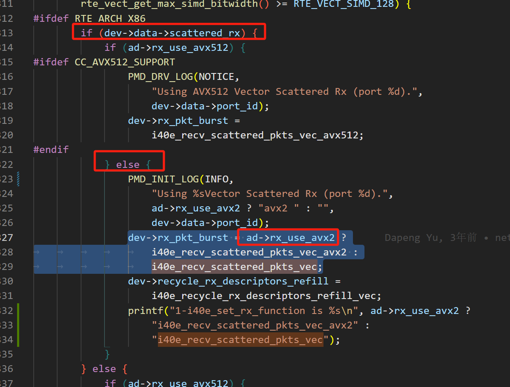

#### 2.1 离散收包scattered_rx

```less
	在 DPDK 中，scattered_rx（分散接收）是一种机制，用于处理接收到的数据包过大而无法放入单个内存缓冲区的情况。通常，数据包会存储在一个单一的 rte_mbuf 结构中，但对于大于缓存区（mbuf）的包，scattered_rx 会将数据包拆分并分散存储到多个 rte_mbuf 缓冲区中。

/*
举例：
	假设一个网络接口卡（NIC）正在接收 TCP 流量，并且某个 TCP 段的大小大于 rte_mbuf 缓冲区的最大容量（例如，标准 rte_mbuf 的大小可能是 2KB，而 TCP 段可能达到 9KB）。在这种情况下，单个 rte_mbuf 不能容纳整个数据包，需要将它拆分成多个缓冲区进行存储。如果在 DPDK 中没有开启 scattered_rx 功能，处理超出单个 rte_mbuf 限制的大数据包会变得复杂。可能就需要调大mbuf的存储空间，或者也会创造新的mbuf来进行存储，但是效率可能就远没有sse指令加入的rx回调快。
*/
```

```apl
	总结：'scattered_rx 是为了解决大包处理和提高系统吞吐量而设计的，在需要处理多段数据包时非常有用。'
```


### 2、AVX矢量收包开启逻辑

默认情况下，dpdk在编译时是开启AVX开关的：i40e_dev_rx_queue_setup_runtime 函数

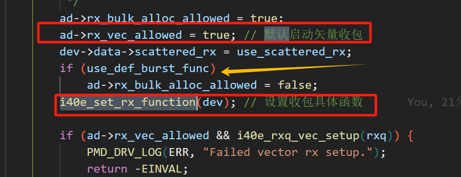

#### 1.1 i40e_set_rx_function函数

```less
if (rte_eal_process_type() == RTE_PROC_PRIMARY) {
#ifdef RTE_ARCH_X86
    	// 初始化不支持avx收包
		ad->rx_use_avx512 = false;
		ad->rx_use_avx2 = false;
#endif
		if (i40e_rx_vec_dev_conf_condition_check(dev) ||
		    !ad->rx_bulk_alloc_allowed) {
			PMD_INIT_LOG(DEBUG, "Port[%d] doesn't meet"
				     " Vector Rx preconditions",
				     dev->data->port_id);

			ad->rx_vec_allowed = false;
		}
    	// 如上面所述，默认我们是支持rx_vec_allowed矢量收包的
		if (ad->rx_vec_allowed) {
			for (i = 0; i < dev->data->nb_rx_queues; i++) {
				struct i40e_rx_queue *rxq =
					dev->data->rx_queues[i];

				if (rxq && i40e_rxq_vec_setup(rxq)) {
					ad->rx_vec_allowed = false;
					break;
				}
			}
#ifdef RTE_ARCH_X86
             // 具体的指令开关判断可以查看《2、AVX矢量收包种类》
			ad->rx_use_avx512 = get_avx_supported(1);
            // 如果不支持avx512，再判断是否支持avx2指令集
			if (!ad->rx_use_avx512)
				ad->rx_use_avx2 = get_avx_supported(0); // avx2判断
#endif
		}
	}
```


### 2、AVX矢量收包种类

```less
矢量收包函数开启的两个条件：
	1、cpu的simd位宽满足：force-max-simd-bitwidth
		// 位宽如果机器冗余甚至可以使用 force-max-simd-bitwidth 来定制；比如你的机器其实支持avx512，但你只想使用avx2的指令集，那么你可以通过位宽来做限制：rte_vect_get_max_simd_bitwidth() >= RTE_VECT_SIMD_256
		// 如果没有使用force-max-simd-bitwidth命令行来指定，那么默认就是最大的SIMD：RTE_VECT_SIMD_MAX = INT16_MAX + 1, 这样的话，dpdk编译将会使用最大限度的avx指令集。
	2、cpu的avx指令集满足；
		// 指令集可以查看你lscpu确定是否支持。
```

avx矢量收包有两种，一种是AVX512，一种即是AVX2：

```c
#ifdef RTE_ARCH_X86
static inline bool get_avx_supported(bool request_avx512)
{
	if (request_avx512) {
        // AVX512需要支持：simd位宽512以及(AVX512F 与 AVX512BW)指令集
		if (rte_vect_get_max_simd_bitwidth() >= RTE_VECT_SIMD_512 &&
		rte_cpu_get_flag_enabled(RTE_CPUFLAG_AVX512F) == 1 &&
		rte_cpu_get_flag_enabled(RTE_CPUFLAG_AVX512BW) == 1)
#ifdef CC_AVX512_SUPPORT
			return true;
#else
		PMD_DRV_LOG(NOTICE,
			"AVX512 is not supported in build env");
		return false;
#endif
	} else {
        // AVX512需要支持：simd位宽256以及(AVX512F 与 AVX2)指令集
		if (rte_vect_get_max_simd_bitwidth() >= RTE_VECT_SIMD_256 &&
				rte_cpu_get_flag_enabled(RTE_CPUFLAG_AVX2) == 1 &&
				rte_cpu_get_flag_enabled(RTE_CPUFLAG_AVX512F) == 1)
			return true;
	}

	return false;
}
#endif /* RTE_ARCH_X86 */
```

为什么明明检测avx2是否支持还需要校验 **avx512f** 指令集呢？

​			理解为什么在检查 AVX2 支持时，`RTE_CPUFLAG_AVX512F`（AVX-512 Foundation）的支持也被视为一个必要条件。这是因为虽然 AVX-512 和 AVX2 是两个独立的指令集扩展，但在某些硬件和软件实现中，**它们之间可能存在一些关联或依赖关系**。以下是一些可能的原因：

1. **硬件特性和兼容性**

- **硬件依赖性**：有些处理器在启用 AVX-512 的情况下，可能会影响或决定 AVX2 的支持。处理器制造商可能会设计某些硬件特性，使得 AVX2 的支持与 AVX-512 的启用相关联。这可能是出于设计上的统一性、性能优化或技术限制。
- **统一特性检测**：在某些情况下，检测 AVX-512 的支持可以作为判断 AVX2 支持的间接方法，尤其是在硬件特性方面。

2. **编译和运行时环境的考量**

- **编译器和库支持**：编译器和运行时库可能会根据硬件支持的 SIMD 指令集来选择最合适的优化路径。如果 AVX-512 被启用，编译器和库可能会假设 AVX2 也会被支持，并因此提供不同的优化策略。
- **统一检测逻辑**：在编译和运行时环境中，统一检测 AVX-512 可以简化代码逻辑，并确保在硬件或编译器支持方面的一致性。这也可以帮助避免潜在的兼容性问题。

3. **性能和优化**

- **性能回退**：某些优化可能依赖于 AVX-512 的支持，甚至在 AVX2 的上下文中也会考虑 AVX-512 的状态。确保 AVX-512 被支持可以确保软件能够充分利用高级特性，并在性能优化方面进行适当的回退。

4. **代码实现的设计选择**

- **设计选择**：有些实现可能选择了一个统一的检测机制来简化支持判断。例如，尽管主要目的是检测 AVX2，但通过同时检查 AVX-512，可以简化检测逻辑或确保更高的兼容性。
- **错误处理**：在某些实现中，检测 AVX-512 的支持有助于更准确地记录和处理错误或不支持的情况。例如，如果 AVX-512 不被支持，可能会影响 AVX2 的使用，因此需要记录并处理这种情况。

```properties
    尽管 AVX2 和 AVX-512 是独立的指令集扩展，但在一些硬件和软件实现中，它们可能有相互关联或依赖的情况。检查 `RTE_CPUFLAG_AVX512F` 的支持可能是为了确保全面的兼容性、优化性能以及简化检测逻辑。
    尽管你主要关心的是 AVX2 的支持，但在某些情况下，确认 AVX-512 的支持可以帮助保证系统能够充分利用所有可用的 SIMD 指令集特性。
```

```asciiarmor
	注意：通过上面就可以看出，我们应该避免在不同型号机器上的dpdk库编译混用，不然除去rx收包模块，许多其它模块，也会因为机器指令集的不同，而在混用的过程中产生一些无法预估的错误情况。
```


## 五、rte_flow模块

### 1、rte_flow_create 示例

```less
rte_eal_init(argc, argv);

	static const char *port_name = "0000:82:00.0";
	uint16_t port_id, rx_queue_id;
	uint16_t nb_rx;
int retval = rte_eth_dev_get_port_by_name(port_name, &port_id);

int ret = rte_eth_dev_configure(port_id, 1, 1, &port_conf);

ret = rte_flow_validate(port_id, &attr, pattern, action, &flow_error);
if (!ret) {
    struct rte_flow *flow = rte_flow_create(port_id, &attr, pattern, action, &flow_error);
    if (!flow)  {
        rte_exit(EXIT_FAILURE, "Error for port %s: errmsg: %s\n", port_name, flow_error.message);
    }
}
```


### 2、E810-ice网卡问题记录

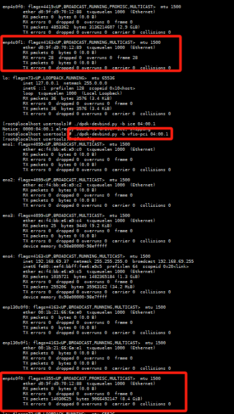

网卡 enp4s0f0 与 enp4s0f1 回环，当绑定 enp4s0f1 为vfio-pci时，enp4s0f0网卡就自动变成 “ 非 RUNNING ” 状态，导致下述进行tcpreplay发包时，suricata总是收不到数据包。

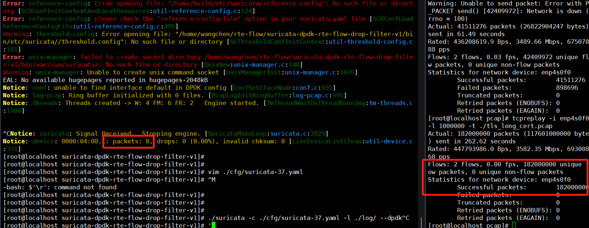

后面不知道为什么这个现象消失了，我只是下载安装并挂载了igb_uio而已就好了：

```less
modprobe uio // 我怀疑是我在绑定vfio的时候，没有执行加载uio导致的问题，可是 vfio-pci 驱动并不需要依赖 uio 驱动啊，不理解
insmod ./igb_uio.ko
```


### 3、rte_flow类型(ice版本)

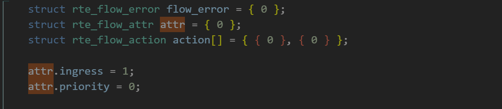

默认group类型即为"0":

```c
static struct ice_flow_parser *get_flow_parser(uint32_t group)
{
	switch (group) {
	case 0:
		return &ice_switch_parser;  // 默认情况下 “0”
	case 1:
		return &ice_acl_parser;
	case 2:
		return &ice_fdir_parser;
	default:
		return NULL;
	}
}
```

所以ice在创建规则时：

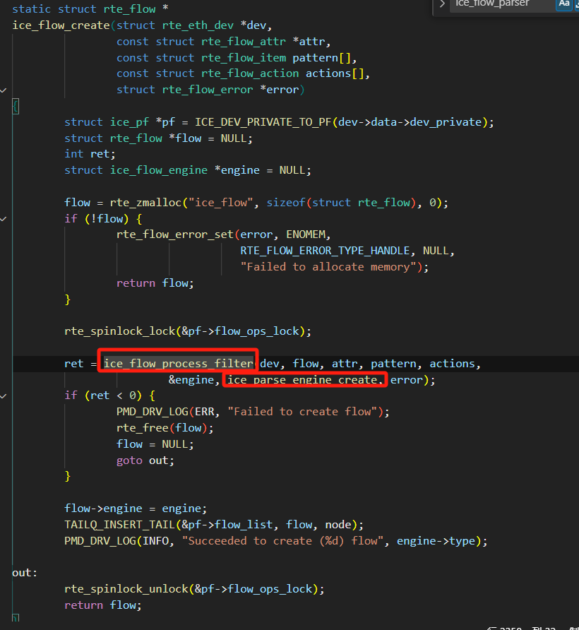

其回调钩子函数 ice_parse_engine_create 内部：
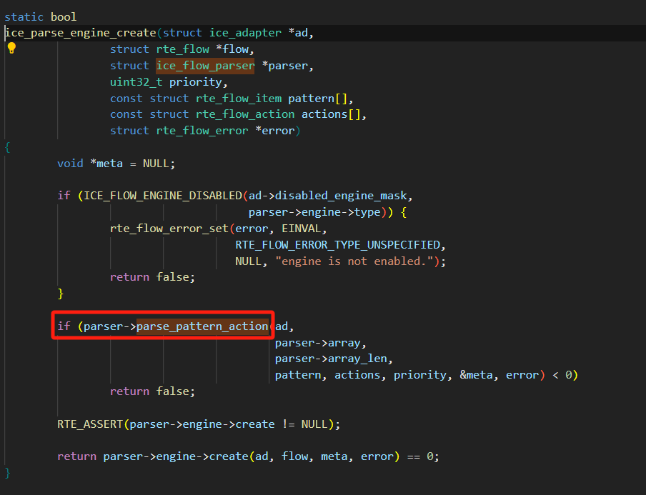

所使用的 parse_pattern_action 函数为group类型即为"0"时候的：ice_switch_parser

```c
struct
ice_flow_parser ice_switch_parser = {
	.engine = &ice_switch_engine,
	.array = ice_switch_supported_pattern,
	.array_len = RTE_DIM(ice_switch_supported_pattern),
	.parse_pattern_action = ice_switch_parse_pattern_action,  // 使用该函数处理action
	.stage = ICE_FLOW_STAGE_DISTRIBUTOR,
};
```

ice_switch_parse_pattern_action函数中会对我们所设置的action进行判断，如下：ice_switch_check_action

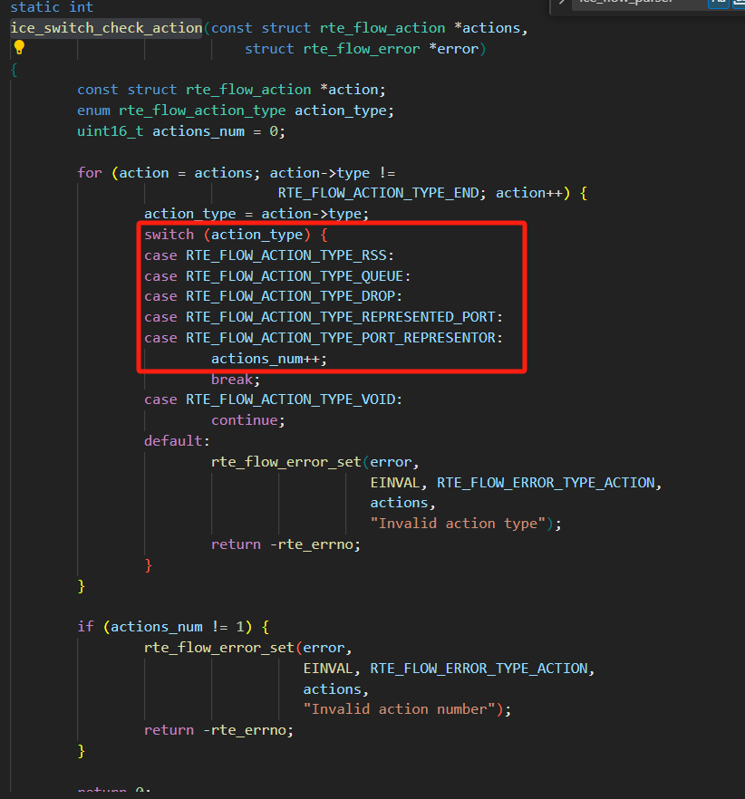

所以在我们设置ice网卡的 ” RTE_FLOW_ACTION_TYPE_AGE “ 动作的时候，就会出现报错，因为ice网卡不支持该动作：

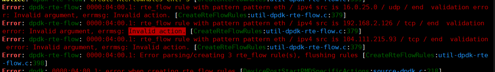


## FIX、项目实际问题

#### 1、bnx2x网卡报错

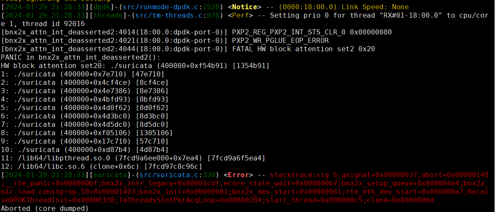

正常情况：

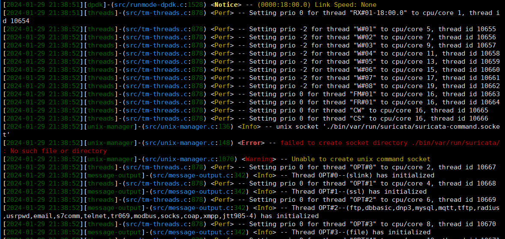

```less
后来发现是只要带上asan编译选项，启动后ctrl-c，似乎就会破坏dpdk原本网卡的相关内存、配置，导致之后的启动都会失败。
所以之后检测内存泄漏，最好实在suricata的pcap模式下，就不会出现上面的状况。
```


#### 2、kernelversion" failed 报错

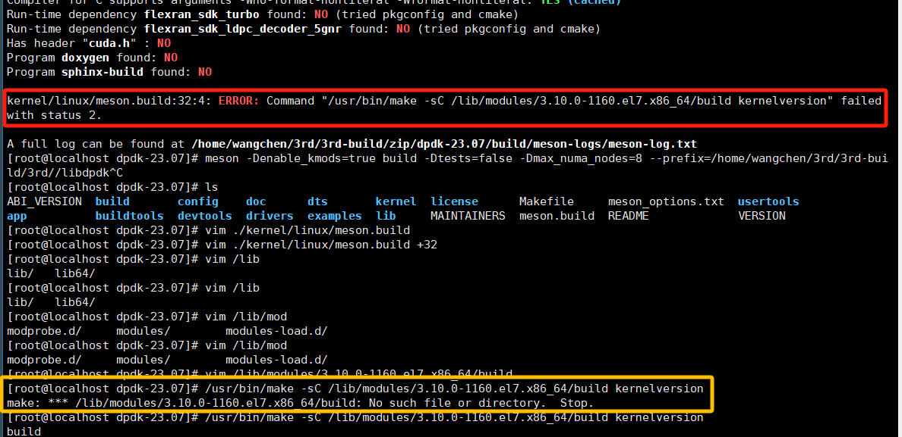

```less
查看对应目录：
	cd /lib/modules/3.10.0-1160.el7.x86_64/

发现对应的 build 连接文件"跳红"报错，说明连接的目标目录不存在，或被删除了。
```

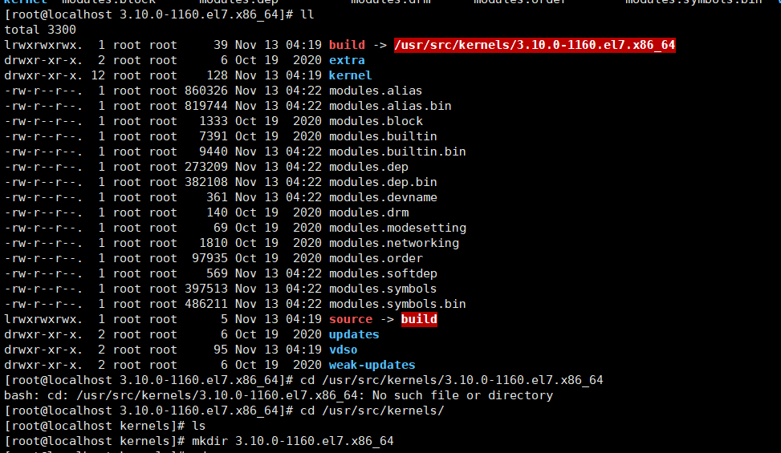

```less
之后我们需要进入软链接的目录下：
	cd /usr/src/kernels/
	mkdir 3.10.0-1160.el7.x86_64 // 创建该文件
```

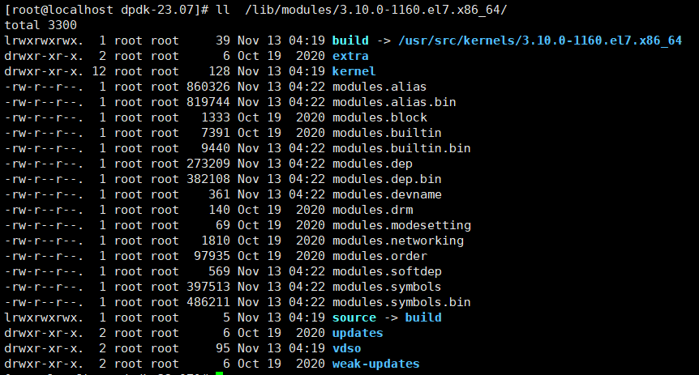

```less
#//最终还是不行
 于是我把参数 -Denable_kmods=true 去掉就行了


mv /usr/bin/gcc /usr/bin/gcc485
mv /usr/bin/g++ /usr/bin/g++485
mv /usr/bin/c++ /usr/bin/c++485
mv /usr/bin/cc /usr/bin/cc485
mv /usr/lib64/libstdc++.so.6 /usr/lib64/libstdc++.so.6.bak


ln -s /usr/local/bin/gcc /usr/bin/gcc
ln -s /usr/local/bin/g++ /usr/bin/g++
ln -s /usr/local/bin/c++ /usr/bin/c++
ln -s /usr/local/bin/gcc /usr/bin/cc
ln -s /usr/local/lib64/libstdc++.so.6.0.28 /usr/lib64/libstdc++.so.6
```


#### 3、MEMPOOL: Cannot allocate tailq entry!

```less
 retval = rte_eal_init(args.argc, eal_argv);
//dpdk都没有启动，怎么肯申请的了对应的mempool和ring。
```


#### 4、tx发包（使用二级指针）

```less
rte_eth_tx_burst的发包数据mub，需要使用void**二级指针。
# 尤其在发单包的时候，一级指针，虽然可以发包（返回数也是1），但是会缺少部分<头部>（没有细看）字节，所以会导致发包的数据字节缺少。导致收包网卡接受不到数据包。
```

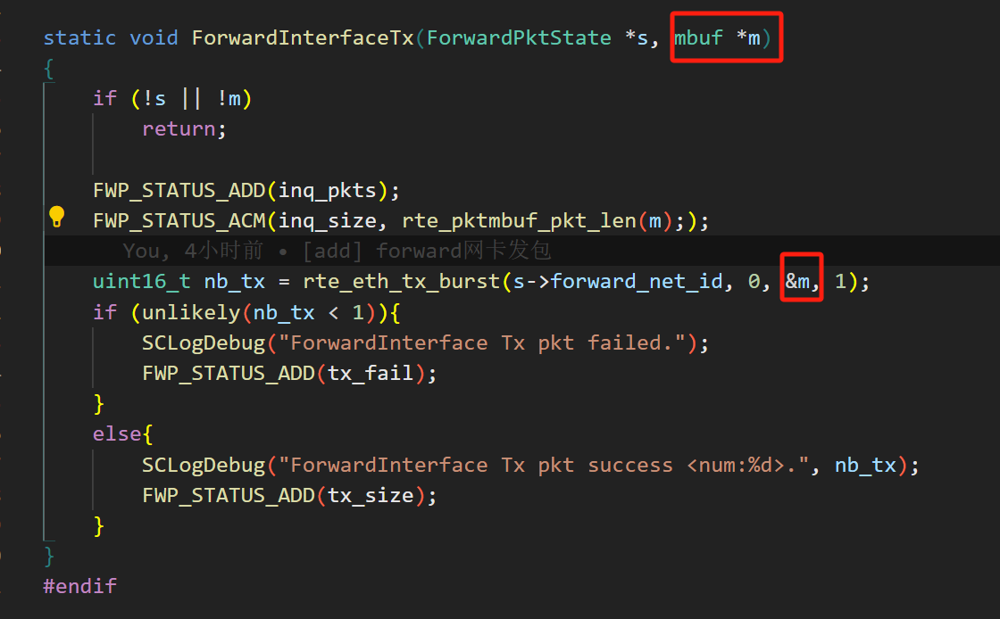


#### 5、dpdk配置多个白名单

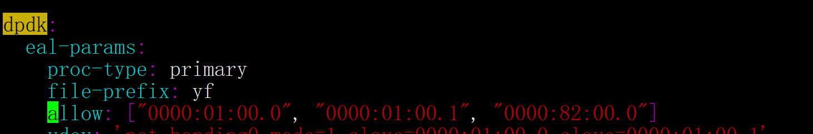


## Tag、dpdk队列生产者/消费者笔记


```c
/*------------------------- 32 bit atomic operations -------------------------*/
// 多消费者/生产者的处理
static inline int
rte_atomic32_cmpset(volatile uint32_t *dst, uint32_t exp, uint32_t src)
{
    uint8_t res;  // 用于存储比较和交换操作的结果（成功或失败）

    asm volatile(
            MPLOCKED               // 电位锁，确保指令在多处理器环境下能够正确同步，通常会加上“锁”前缀。
            "cmpxchgl %[src], %[dst];"  // 执行比较并交换（CMPXCHG）。如果目标值（*dst）等于预期值（exp），将目标值设置为src；否则，不做更改，并将目标值载入eax寄存器。
            "sete %[res];"         // 如果cmpxchgl指令成功（即目标值等于预期值），则将“res”设置为1，否则为0。
            : [res] "=a" (res),     /* 输出部分：返回值将存储到“res”中，寄存器eax保存比较结果 */
              [dst] "=m" (*dst)     /* 输出部分：目标地址dst的内存将被修改 */
            : [src] "r" (src),      /* 输入部分：src值将加载到一个通用寄存器中（可以是任意寄存器） */
              "a" (exp),            /* 输入部分：预期的目标值exp加载到寄存器eax中 */
              "m" (*dst)            /* 输入部分：目标地址dst的内存值 */
            : "memory");            /* 告诉编译器此函数会修改内存，所以需要做适当的内存屏障 */

    return res;  // 如果交换成功（即目标值等于预期值），返回1；否则返回0
}
```

**作用：**该函数在多线程或多核环境中提供一个原子操作，保证在执行过程中不会被其他线程或处理器打断，避免数据竞争问题。具体的功能是：如果目标值（`*dst`）等于预期值（`exp`），则将其更新为新值（`src`），否则保持不变，并返回操作是否成功的结果。
