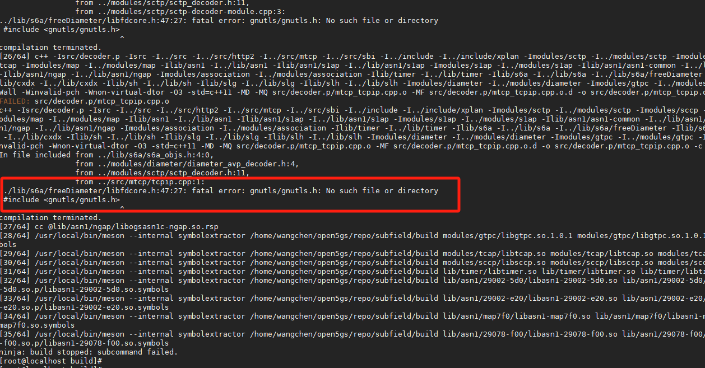
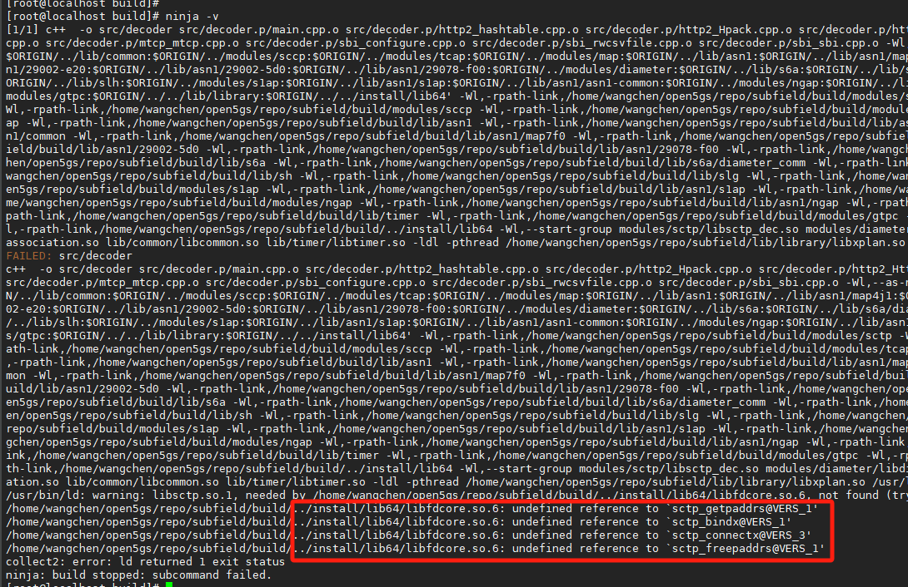
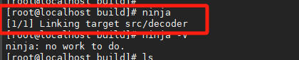
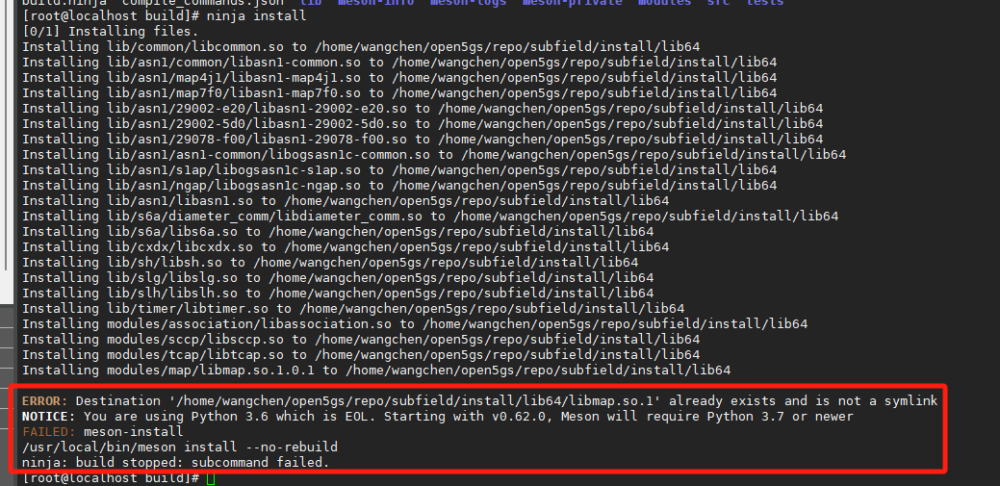
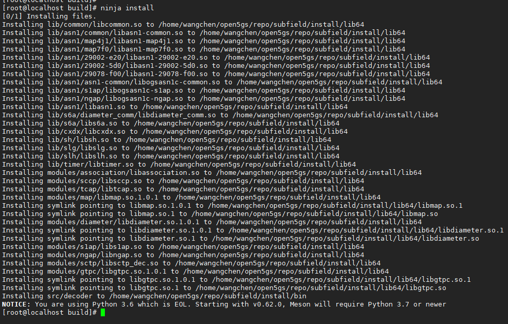
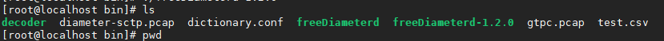
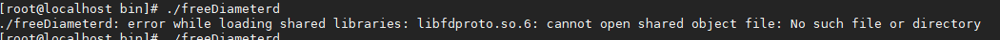

# Open5gs安装


## 1、安装

```bash
pip3.6 install meson ninja


yum groupinstall "Development Tools" -y
yum install gcc clang -y

yum install libxml* -y
yum install -y gnutls-devel
yum install -y libsctp*

```


## 2、meson指定编译目录

在 `meson` 中，你可以通过 `meson setup` 命令来指定构建路径。例如：

```bash
meson setup <build_dir> <source_dir>
```

**示例**

1. **在当前目录下创建 `build` 目录并进行构建：**

    ```bash
    meson setup build .
    ```


## 3、ninja编译错误查询、处理

**`-Wunused-but-set-variable` 警告被视为错误**

- 如果 `meson.build` 或 `CMakeLists.txt` 启用了 `-Werror` 选项，则任何警告都会被视为错误，从而导致编译失败。
- 解决方法：**禁用 `-Werror`** 或 **单独忽略 `-Wunused-but-set-variable`**。

**实际存在编译错误**

- 你的日志只显示了 `warning`，但 `ninja` 停止说明可能有更严重的 `error`，需要检查完整的日志。

- 解决方法：重新运行 

    ```bash
    ninja
    ```

     并检查最后几行的错误消息：

    ```bash
    ninja -v  # 运行 ninja 并输出详细日志  需要安装：sudo yum install -y gnutls-devel
    ```



安装完报错：需要安装：yum install -y libsctp*



编译完成：



进行install：



一共需要删除：

```less
rm -rf  /home/wangchen/open5gs/repo/subfield/install/lib64/libmap.so.1
rm -rf  /home/wangchen/open5gs/repo/subfield/install/lib64/libmap.so
rm -rf  /home/wangchen/open5gs/repo/subfield/install/lib64/libdiameter.so.1
rm -rf  /home/wangchen/open5gs/repo/subfield/install/lib64/libdiameter.so
rm -rf  /home/wangchen/open5gs/repo/subfield/install/lib64/libgtpc.so.1
rm -rf  /home/wangchen/open5gs/repo/subfield/install/lib64/libgtpc.so
```

安装完成：




## 4、运行

安装完成的bin文件路径：repo/subfield/install/bin
一共有三个执行文件：



其中decoder可以直接运行，但需要一些选项；

free的两个需要添加上 libfdproto.so.6 路径，才能正常运行。



添加库路径

```shell
# 查找路径
find / -name libfdproto.so.6
	#/home/wangchen/open5gs/repo/subfield/install/lib64/libfdproto.so.6
	#/home/wangchen/open5gs/repo/subfield/freeDiameter-extension2/build/libfdproto/libfdproto.so.6
# 路径添加
ldconfig /home/wangchen/open5gs/repo/subfield/install/lib64/
```

