# docwire项目源码解析

```apl
https://github.com/docwire/docwire
```


## 一、项目部署

### 1.1 vcpkg

vcpkg 是跨平台的 C/C++ 包管理器。 快速获取对数千个高质量开放源代码库的访问权限，从而为应用程序提供支持，并在内部共享专用组件的集合。

```less
https://learn.microsoft.com/zh-cn/vcpkg/get_started/overview

git clone https://github.com/microsoft/vcpkg.git
```


#### 1.1.1vcpkg的二进制缓存

`vcpkg` 的二进制缓存安装（binary caching）功能用于加速 C++ 库的安装过程，通过缓存已编译的库，避免每次安装时都需要重新编译。这个机制特别适用于大型项目或团队开发中，能够显著提高构建速度和效率。

要配置 `vcpkg` 使用二进制缓存，你可以在 `vcpkg` 的配置文件中设置缓存源。以下是一个简单的配置例子：

1. **设置 GitHub Packages 作为缓存源**:

    ```
    shCopy codeexport BINARY_CACHE_GITHUB_TOKEN="your-github-token"
    export VCPKG_BINARY_SOURCES="clear;nuget,github-packages,readwrite"
    ```

    在这个例子中，`BINARY_CACHE_GITHUB_TOKEN` 是你的 GitHub 访问令牌，`VCPKG_BINARY_SOURCES` 指定了缓存的来源，其中 `clear` 是为了清除默认的缓存，`nuget` 是指定使用 NuGet 缓存，`github-packages` 是指定使用 GitHub Packages 作为缓存源。

2. **使用远程缓存**:

    - 在 `vcpkg` 的配置文件中，可以配置远程缓存的详细信息，例如缓存的 URL 和认证信息。

    

#### 1.1.2 vcpkg的包源码安装

1. **查看 vcpkg 的 port 文件**

`vcpkg` 的每个包都有一个对应的 port 文件夹，其中包含了构建该包所需的所有信息，包括源码的下载地址。你可以在 `vcpkg` 的 `ports` 目录中找到这些文件。例如，对于 `docwire` 包，你可以查看 `vcpkg/ports/docwire/` 文件夹中的 `portfile.cmake` 文件，这里通常包含源码的下载链接和构建步骤。

2. **从 `vcpkg` 仓库获取源码**

如果你需要获取 `docwire` 包的源码，可以查看 `vcpkg` 的 GitHub 仓库中的 port 文件。访问 [vcpkg 的 GitHub 仓库](https://github.com/microsoft/vcpkg)，在 `ports` 目录下找到 `docwire` 文件夹，里面包含了相关的构建文件和源代码下载链接。

3. **使用 vcpkg 的 export 功能**

如果你已经安装了 `docwire` 包，可以使用 `vcpkg` 的 `export` 命令来获取包的源码以及其他相关文件。根据你提供的脚本，`vcpkg` 已经配置了 `export` 选项来生成源码包。你可以在安装完成后，通过运行类似下面的命令来导出包：

```less
./vcpkg/vcpkg --overlay-ports=./ports export docwire:$VCPKG_TRIPLET --raw --output=docwire-$version --output-dir=.
```

4. **直接下载源码**

如果你知道 `docwire` 的源码托管位置（例如 GitHub 仓库），你可以直接从源代码托管服务上下载源码。通常，`vcpkg` 的 `portfile.cmake` 文件会包含源码的下载链接。


### 1.2 build.sh文件

#### 1.2.1 安装vcpkg

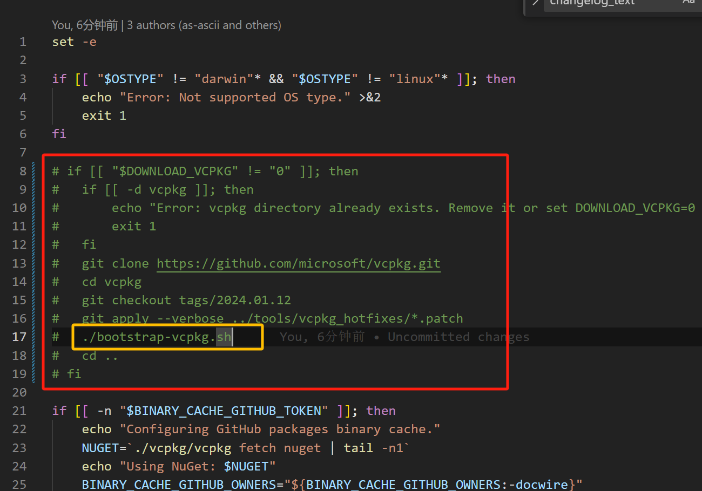

```less
这两行命令是用来在 Git 仓库中管理版本和应用补丁的。下面是它们的具体作用：
   切换到指定标签:
	git checkout tags/2024.01.12
这条命令会将当前工作目录切换到 2024.01.12 标签所指向的版本。这是一个只读的快照，代表了在创建标签时的代码状态。如果 2024.01.12 是一个标签名，它将会把你的工作目录切换到该标签所对应的提交。

   应用补丁文件:
	git apply --verbose ../tools/vcpkg_hotfixes/*.patch
这条命令会应用位于 ../tools/vcpkg_hotfixes/ 目录中的所有 .patch 补丁文件。--verbose 选项使 Git 在应用补丁时显示详细的输出，帮助你了解补丁的应用过程。这些补丁文件通常包含对代码的修改，可以用于修复错误、更新功能或进行其他更改。
```

```less
# vcpkg命令工具安装 
./bootstrap-vcpkg.sh
```

一旦 `vcpkg` 工具构建完成，可以使用它来执行各种操作，例如：

- **安装库**: 安装特定的 C++ 库和其依赖项。

    ```less
    ./vcpkg install <package-name>
    ```

- **管理包**: 更新、卸载或列出已安装的包。

    ```less
    ./vcpkg update
    ./vcpkg remove <package-name>
    ./vcpkg list
    ```

- **配置项目**: 配置 CMake 等构建系统，以使用 `vcpkg` 管理的库。


#### 1.2.2 vcpkg环境变量 

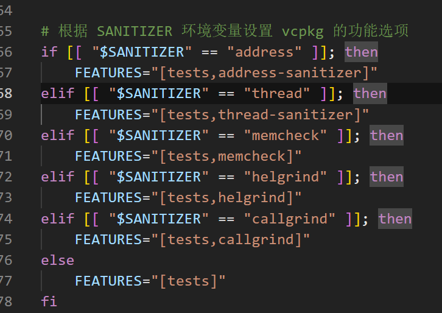

`SANITIZER` 的值来设置 `vcpkg` 的功能选项 `FEATURES`。具体来说，它为 `vcpkg` 的安装配置过程指定了不同的功能选项，以启用不同类型的代码检查或分析工具。

**具体作用**

1. **环境变量 `SANITIZER`**:
    - `SANITIZER` 环境变量用于指定希望启用的代码分析或检查工具。它的值决定了要启用的功能选项。
2. **功能选项 `FEATURES`**:
    - `FEATURES` 变量用来传递给 `vcpkg` 的安装或配置命令，指定所需的功能或工具集。

**各条件的作用**

- **`address-sanitizer`**:

    ```shell
    if [[ "$SANITIZER" == "address" ]]; then
        FEATURES="[tests,address-sanitizer]"
    ```

    启用 AddressSanitizer，用于检测内存错误（如缓冲区溢出、使用后释放等）。在这种配置下，`vcpkg` 会为相关的库启用 AddressSanitizer 支持，并启用测试功能。

- **`thread-sanitizer`**:

    ```shell
    elif [[ "$SANITIZER" == "thread" ]]; then
        FEATURES="[tests,thread-sanitizer]"
    ```

    启用 ThreadSanitizer，用于检测线程相关的错误（如数据竞争）。此配置将启用 ThreadSanitizer 支持并启用测试功能。

- **`memcheck`**:

    ```shell
    shCopy codeelif [[ "$SANITIZER" == "memcheck" ]]; then
        FEATURES="[tests,memcheck]"
    ```

    启用 Memcheck 工具（通常是 Valgrind 的一部分），用于检测内存泄漏和其他内存相关的问题。启用 Memcheck 支持和测试功能。

- **`helgrind`**:

    ```shell
    elif [[ "$SANITIZER" == "helgrind" ]]; then
        FEATURES="[tests,helgrind]"
    ```

    启用 Helgrind 工具（Valgrind 的一部分），用于检测线程问题（如数据竞争）。启用 Helgrind 支持和测试功能。

- **`callgrind`**:

    ```shell
    elif [[ "$SANITIZER" == "callgrind" ]]; then
        FEATURES="[tests,callgrind]"
    ```

    启用 Callgrind 工具（Valgrind 的一部分），用于性能分析和调用图分析。启用 Callgrind 支持和测试功能。

- **默认值**:

    ```shell
    else
        FEATURES="[tests]"
    ```

    如果 `SANITIZER` 环境变量的值不匹配任何指定的选项，则只启用测试功能，不启用其他代码检查或分析工具。


#### 1.2.3 cmake升级v3.29.2

```less
https://gitlab.kitware.com/cmake/cmake/-/tree/v3.29.2?ref_type=tags
cd cmake-3.29.2
./bootstrap
make
sudo make install
/* 编译安装make完如果cmake报错： 
	CMake Error: Could not find CMAKE_ROOT !!!
	CMake has most likely not been installed correctly.
	Modules directory not found in
	/usr/local/bin
	Segmentation fault
*/
// 这或许是因为编译的cmake与你原本系统存在的yum安装cmake冲突，将原本的yum-cmake卸载
	yum list installed | grep cmake
	yum remove cmake
// 然后将编译的源码目录bin/cmake拷贝到/usr/bin/下即可,然后校验一下。
	cmake --version
```

#### 1.2.4 git升级v2.7.4

```less
https://github.com/git/git/archive/refs/tags/v2.7.4.tar.gz
wget https://github.com/git/git/archive/refs/tags/v2.7.4.tar.gz
tar -xzvf v2.7.4.tar.gz
cd git-2.7.4
make prefix=/usr/local all
// 可能所缺库
	yum install openssl* curl-devel expat-devel perl-ExtUtils-MakeMaker -y
make prefix=/usr/local install
```

#### 1.2.5 boost库安装

```less
只需要将在./build.sh脚本执行时下载失败的相关boost库，自行下载后根据报错提示修改文件名字，再放到 vcpkg/downloads/ 路径即可。
```

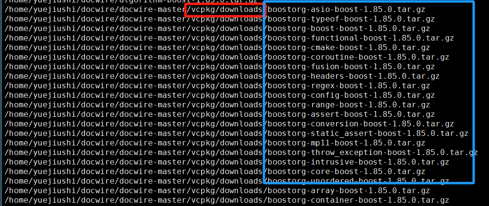

#### 1.2.6 python3.6调整

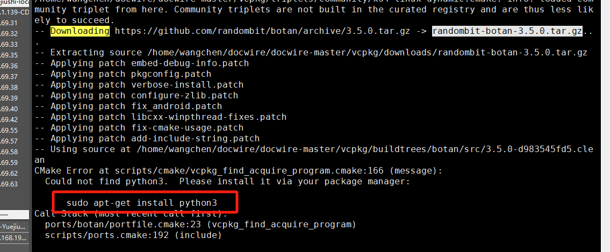

```less
32安装过python3.6 把/usr/bin下面的python3.6改成python3即可
```

#### 1.2.7 vcpkg_execute_build_process.cmake:134

CMake Error at scripts/cmake/vcpkg_execute_build_process.cmake:134 (message)：**gcc的版本问题**

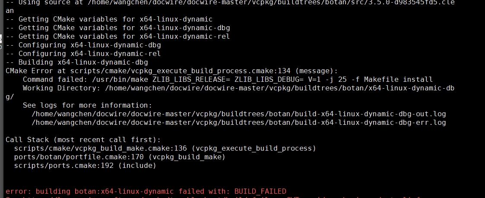

```less
// 出错栈：
Call Stack (most recent call first):
  scripts/cmake/vcpkg_build_make.cmake:136 (vcpkg_execute_build_process)
  ports/botan/portfile.cmake:170 (vcpkg_build_make)
  scripts/ports.cmake:192 (include)

其中的日志信息为：
	/home/wangchen/docwire/docwire-master/vcpkg/buildtrees/botan/build-x64-linux-dynamic-dbg-out.log // 编译日志
	vim /home/wangchen/docwire/docwire-master/vcpkg/buildtrees/botan/build-x64-linux-dynamic-dbg-err.log //报错日志
```

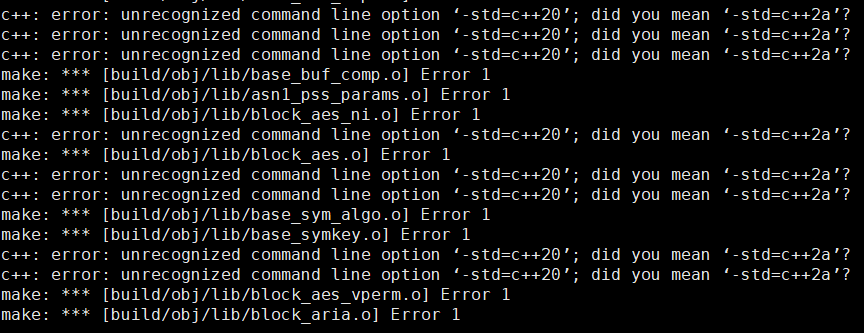

```less
编译器不识别 -std=c++20 选项。-std=c++20 是 C++20 标准的编译选项，而 -std=c++2a 是 C++20 的前一个提案名称（C++20 在某些编译器中早期称为 C++2a）。这个错误通常出现在以下几种情况下：

1. 编译器版本不支持 C++20
	你的编译器版本可能太旧，不支持 C++20 标准。如果你使用的是 GCC，可以升级到 GCC 10 或更高版本。如果你使用的是 Clang，可以升级到 Clang 12 或更高版本。
	使用较早的标准：如果无法升级编译器，你可以将编译选项改为 -std=c++2a（C++20 的早期名称），或者根据你的需求使用 C++17（-std=c++17）：
```

我们可以测试一下build-x64-linux-dynamic-dbg-out.log中的编译命令：

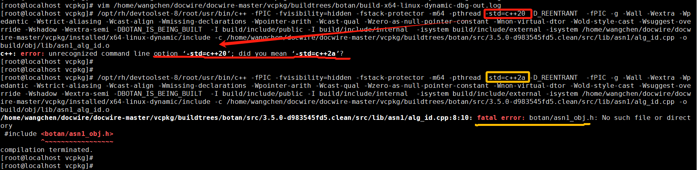

```less
可以看到之后的报错：#include <botan/asn1_obj.h> // 这主要是因为我们走的单条编译命令，至少测验了改成-std=c++2a就可以通过

// 在docwire目录下使用了替换命令，但是没用，
find ./ -type f -exec sed -i 's/-std=c++20^Cstd=c++2a/g' {} +
/* 因为一旦重新build.sh,就又变成c++20了，所以，我们需要从docwire中找原因
 我们根据：Working Directory: /home/wangchen/docwire/docwire-master/vcpkg/buildtrees/botan/x64-linux-dynamic-dbg/
知晓是botan库的安装编译出现的问题，查看对应目录下的MakeFile
```

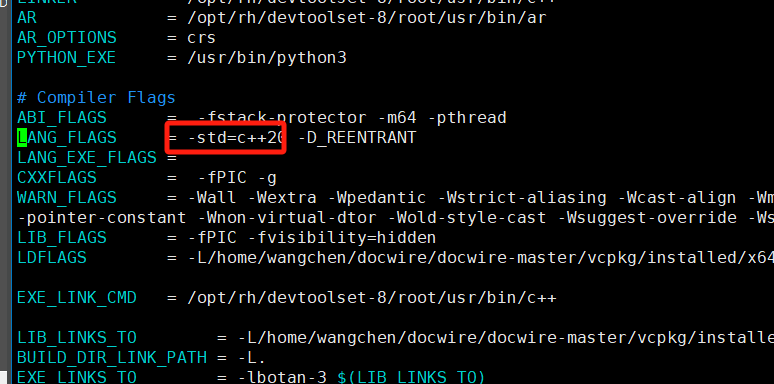

```apl
所以，我自己解压编译查看该库：
tar -zxvf ./botan-3.5.0.tar.gz ## 发现是因为该库版本本身对于gcc版本的要求，这也是为什么上面的编译器会报错。
```

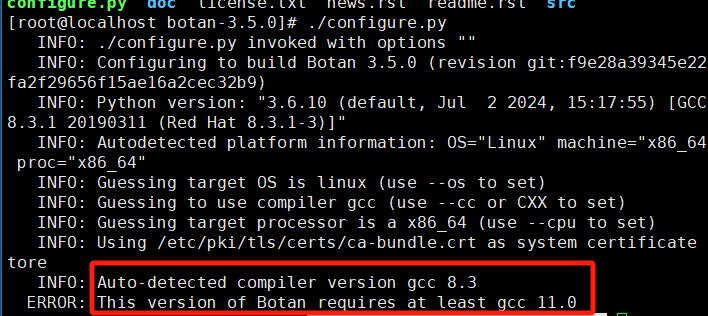

```less
最终我决定在自己的虚拟机中部署。因为32机器的cmake不方便修改
```


#### 1.2.8 gcc11安装

 CentOS 7 从源代码安装 GCC 11，可以按照以下步骤操作：

1. **安装必要的依赖包**：

    ```shell
    yum groupinstall 'Development Tools'
    yum install wget bzip2
    ```

2. **下载 GCC 11 源代码**：

    前往 GCC 的官方 FTP 站点 查找最新的 GCC 版本，并下载源码包。例如：

    ```shell
    wget https://ftp.gnu.org/gnu/gcc/gcc-11.3.0/gcc-11.3.0.tar.gz
    ```

3. **解压源代码包**：

    ```shell
    tar -xzf gcc-11.3.0.tar.gz
    cd gcc-11.3.0
    ```

4. **下载依赖库**：

    GCC 需要一些额外的库，比如 MPFR 和 GMP。你可以从源代码下载并安装它们：

    ```shell
    ./contrib/download_prerequisites
    
    # 或者提示的目录进行下载
    https://gcc.gnu.org/pub/gcc/infrastructure/
     ## Building GCC requires GMP 4.2+, MPFR 3.1.0+ and MPC 0.8.0+
     ## 然后各自解压 
     	./configure && make && make install
     	yum install mpfr-devel
    ```

5. **创建构建目录**：

    ```shell
    mkdir build
    cd build
    ```

6. **配置 GCC**：

    ```shell
    ../configure --prefix=/usr/local/gcc-11 --enable-languages=c,c++ --disable-multilib
    ```

    - `--prefix=/usr/local/gcc-11` 指定安装路径。
    - `--enable-languages=c,c++` 指定要编译的语言。
    - `--disable-multilib` 禁用多库支持，以简化构建。

7. **编译和安装**：

    ```shell
    make -j$(nproc)
    make install
    ```

    `-j$(nproc)` 参数可以加速编译过程，利用所有可用的处理器核心。

    如果出现安装了库但报错：libmpfr.so.6: cannot open shared object file: No such file or directory

    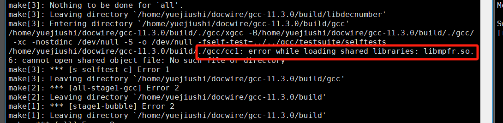

    ```less
    1、设置共享库路径
    如果库文件存在但不在系统的默认路径中，你需要将其路径添加到 LD_LIBRARY_PATH 环境变量中：
    export LD_LIBRARY_PATH=/path/to/library:$LD_LIBRARY_PATH
    
    2、将 /path/to/library 替换为实际包含 libmpfr.so.6 文件的路径。例如，如果 libmpfr.so.6 在 /usr/local/lib 中，则使用：
    export LD_LIBRARY_PATH=/usr/local/lib:$LD_LIBRARY_PATH
    
    3、要使这个设置在每次登录时生效，可以将它添加到 ~/.bashrc 或 ~/.bash_profile 文件中：
    echo 'export LD_LIBRARY_PATH=/usr/local/lib:$LD_LIBRARY_PATH' >> ~/.bashrc
    source ~/.bashrc
    ```

    安装make成功截图：

    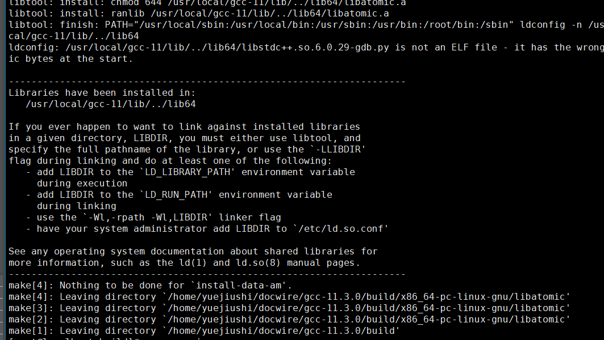

    之后。安装完的gcc，因为../configure --prefix=/usr/local/gcc-11的指定，所以是在其目录下，我们需要修改环境变量。

8. **配置环境变量**：

    添加 GCC 11 到 `PATH` 环境变量中：

    ```shell
    export PATH=/usr/local/gcc-11/bin:$PATH
    ```

    为了永久生效，可以将这行添加到 `~/.bashrc` 或 `~/.bash_profile` 文件中。

9. **验证安装**：

    ```shell
    gcc --version
    ```

    确保输出的是 GCC 11.x.x。

    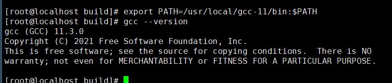

#### 1.2.9 gcc替换

查看：/home/yuejiushi/docwire/docwire-master/vcpkg/buildtrees/botan/build-x64-linux-dynamic-dbg-err.log

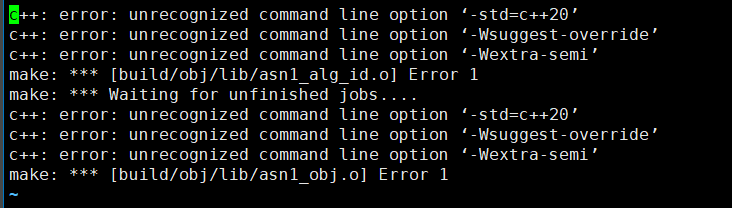

问题定位：所使用的c++版本不对

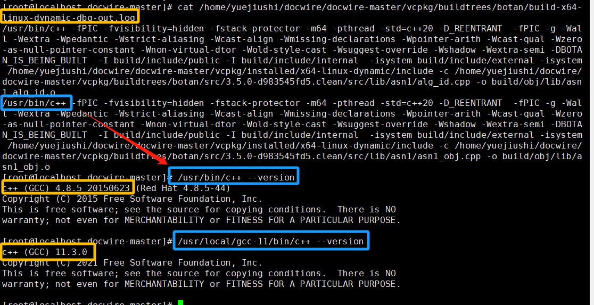

```shell
#直接覆盖原来的旧版本gcc相关bin
rpm -qa | grep gcc
#  显示：
	gcc-gfortran-4.8.5-44.el7.x86_64
	libgcc-4.8.5-44.el7.x86_64
	gcc-c++-4.8.5-44.el7.x86_64
	gcc-4.8.5-44.el7.x86_64
# 卸载旧版本
yum remove gcc gcc-c++
# 更新gcc位置
update-alternatives --install /usr/bin/gcc gcc /usr/local/gcc-11/bin/gcc 50
update-alternatives --install /usr/bin/g++ g++ /usr/local/gcc-11/bin/g++ 50
update-alternatives --config gcc
update-alternatives --config g++
gcc --version
g++ --version
```

#### 1.2.10 getentropy报错

```apl
/home/yuejiushi/docwire/docwire-master/vcpkg/buildtrees/botan/src/3.5.0-d983545fd5.clean/src/lib/entropy/getentropy/getentropy.cpp: In member function ‘virtual std::size_t Botan::Getentropy::poll(Botan::RandomNumberGenerator&)’:
/home/yuejiushi/docwire/docwire-master/vcpkg/buildtrees/botan/src/3.5.0-d983545fd5.clean/src/lib/entropy/getentropy/getentropy.cpp:26:9: error: ‘::getentropy’ has not been declared; did you mean ‘Getentropy’?
   26 |    if(::getentropy(buf.data(), buf.size()) == 0) {
      |         ^~~~~~~~~~
      |         Getentropy
make: *** [build/obj/lib/entropy_getentropy.o] Error 1
make: *** Waiting for unfinished jobs....
```

这主要是因为 getentropy 函数只有在linux3.17版本以上，才能使用，但目前我的linux版本只有3.10. 所以我我暂时注释掉了该函数的使用。但发现会很麻烦，所以在公司机器的调试步骤暂时停止于此。


## 二、项目兼容

暂无


## 三、源码梳理

暂无