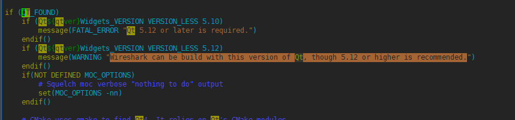
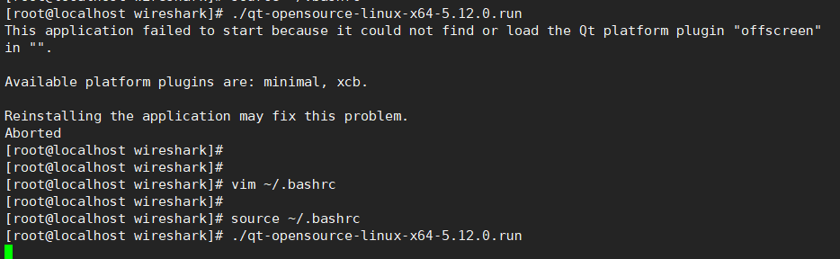

### wireshark源码安装

```less
wget http://saimei.ftp.acc.umu.se/pub/gnome/sources/glib/2.30/glib-2.30.3.tar.xz
tar -xvf ./glib-2.30.3.tar.xz
cd ./glib-2.30.3
./configure --prefix=/usr/local/glib


// 步骤1
/*
# 安装gilb 2.54以上版本
./configure
make
make install
*/
#建议yum安装
yum install glib2*

// 安装相关lib库 libffi（yum安装）  libmount
#如果之后还显示找不到就去配置一下
vim /root/.bash_profile
	export LIBFFI_CFLAGS=/usr/local/include
	export LIBFFI_LIBS=/usr/local/lib64/libffi.la
	export LIBMOUNT_CFLAGS=/usr/local/include
	export LIBMOUNT_LIBS=/usr/local/lib64/libmount.so
	PKG_CONFIG_PATH=/usr/local/lib/pkgconfig:$PKG_CONFIG_PATH
source ~/.bash_profile // 使配置生效


// yum install libgcrypt*
报错/*
 Could NOT find GCRYPT: Found unsuitable version "1.5.3", but required is at
  least "1.8.0" (found /lib64/libgcrypt.so) */
// # 更新下yum // 这个没有用，因为你的yum源可能就是固定版本的。
// yum install libgcrypt* // 之后需要删除
// yum list libgcrypt* --showduplicates | sort -r //查看可安装版本不满足1.8

// 安装libgcrypt
# 最好是自己下载他所指定的版本 libgcrypt1.10.3 源码
# 还需要安装 libgpg-error-1.47 之后重新安装libgcrypt
# 然后rm之前全部的 libgcrypt旧版本， 再把编译好的so/a拷贝到usr下
cp ./src/.libs/libgcrypt.so /usr/lib/
cp ./src/.libs/libgcrypt.so /usr/lib64/
cp ./src/.libs/libgcrypt.la /usr/lib64/
cp ./src/.libs/libgcrypt.la /usr/lib/

/*Could NOT find CARES (missing: CARES_LIBRARY CARES_INCLUDE_DIR) (Required
  is at least version "1.13.0")*/
// 安装c-ares  c-ares-1.24.0最新

/* Could NOT find LEX (missing: LEX_EXECUTABLE) */
// 安装LEX
yum install flex
```

```less
# 安装qt
```



```less
因为qt6源码安装时，需要的cmake版本太高了，所以查看了wireshark的cmake文件，我们用5.12就行
```


