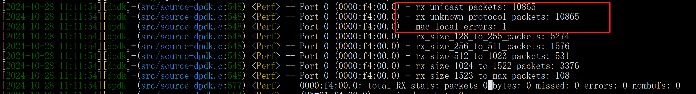
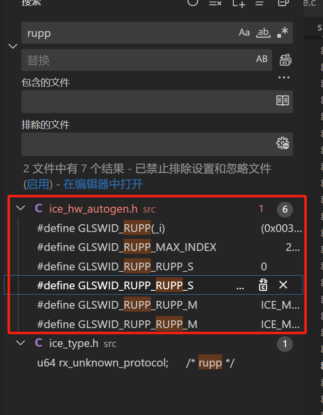
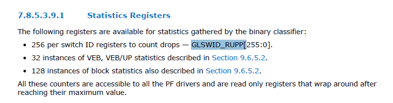
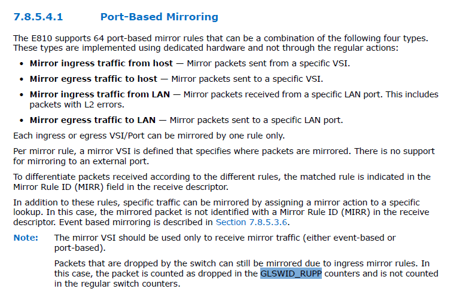
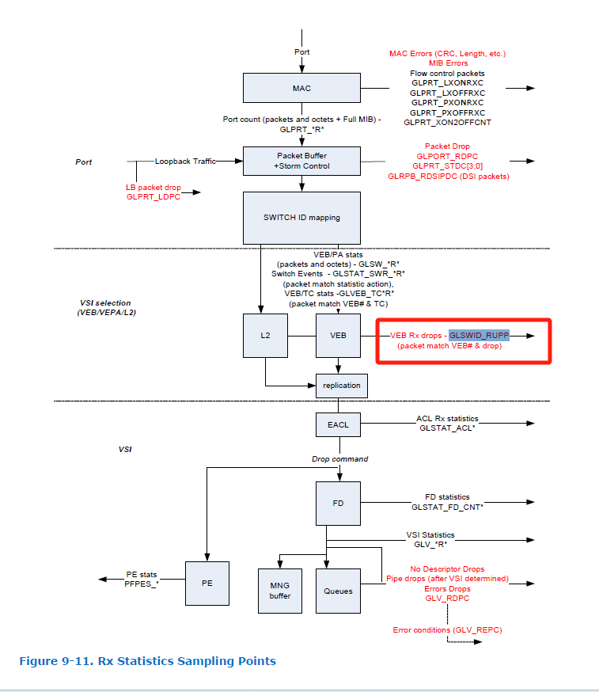
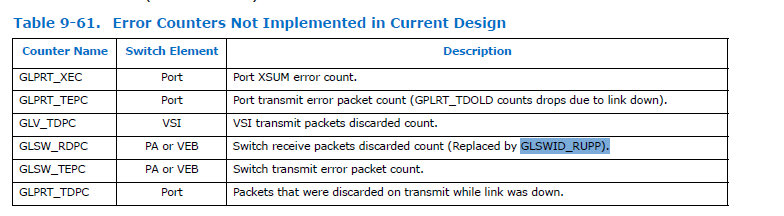

# E810网卡丢包问题回溯


## 1、问题缘由

3w1h特殊包传输过程中，从交换机到e810网卡出现丢包：




## 2、溯源

回溯上述的rx_unknown_protocol_packets参数，我们查看e810驱动源码(ice-1.0.4)，定位计数是 rupp：

```c
struct ice_eth_stats {
	u64 rx_bytes;			/* gorc */
	u64 rx_unicast;			/* uprc */
	u64 rx_multicast;		/* mprc */
	u64 rx_broadcast;		/* bprc */
	u64 rx_discards;		/* rdpc */
	u64 rx_unknown_protocol;	/* rupp */
	u64 tx_bytes;			/* gotc */
	u64 tx_unicast;			/* uptc */
	u64 tx_multicast;		/* mptc */
	u64 tx_broadcast;		/* bptc */
	u64 tx_discards;		/* tdpc */
	u64 tx_errors;			/* tepc */
};

```

全局检索驱动代码：



最终定位在GLSWID_RUPP的使用上：


## 3、官网文档检索

下载地址：

​	https://www.intel.cn/content/www/cn/zh/content-details/613875/intel-ethernet-controller-e810-datasheet.html

### `GLSWID_RUPP`位置1：



描述：

​	e810使用GLSWID_RUPP进行丢包统计；


### `GLSWID_RUPP`位置2：



描述：

​	E810 支持 64 个基于端口的镜像规则，这些规则可以是以下四种类型的组合：
​		镜像来自主机的入口流量 - 镜像从特定 VSI 发送的数据包。
​		镜像到主机的出口流量 - 镜像发送到特定 VSl 的数据包。
​		镜像来自 LAN 的入口流量 - 镜像从特定 LAN 端口接收的数据包。这包括
​		镜像到 LAN 的出口流量 - 镜像发送到特定 LAN 端口的数据包。每个入口或出口 VSI/Port 只能由一条规则镜像。不支持镜像到外部端口。
​	为了区分根据不同规则接收的数据包，接收描述符中的镜像规则 ID(MIRR) 字段会显示匹配的规则。
​	除了这些规则外，还可以通过为特定查询分配镜像操作来镜像特定流量。在这种情况下，镜像数据包在接收描述符中不标识镜像规则 ID (MIRR)，基于事件的镜像将在第 7.8.5.3.6 节中介绍。
​	根据入口镜像规则，交换机丢弃的数据包仍可被镜像。在这种情况下，数据包在 GLSWID_RUPP 计数器中被计为丢弃，而不计入常规交换机计数器。


### `GLSWID_RUPP`位置3：



上图描述了 e810 网卡收包处理的总体逻辑。

在 ICE（Intelligent Controller Ethernet）网卡中，VEB（Virtual Ethernet Bridge）和 PA（Packet Aggregator）是两个关键的网络虚拟化和数据处理功能。以下是对这两个概念的简要说明：

VEB（Virtual Ethernet Bridge）和 VEPA（Virtual Ethernet Port Aggregator）都是与虚拟化和网络流量管理相关的概念，但它们在功能和实现上有所不同。以下是对这两者的比较：

#### 1. VEB（Virtual Ethernet Bridge）

- **功能**：VEB 允许多个虚拟机（VM）在同一物理网络接口卡上进行直接通信，而无需将流量发送到主机 CPU。它在网卡内部实现了一种虚拟交换功能，从而提高了数据传输效率。
- **工作原理**：
    - VEB 在虚拟机之间提供直接的网络连接，允许它们以较低的延迟进行数据交换。
    - 通过内部数据转发，减少了主机的 CPU 负担。
- **适用场景**：适用于需要高效虚拟机间通信的环境，例如数据中心和云计算。

#### 2. VEPA（Virtual Ethernet Port Aggregator）

- **功能**：VEPA 是一种更复杂的网络架构，旨在提供虚拟机之间的流量汇聚和隔离。VEPA 可以将虚拟机流量发送到外部网络设备进行处理。
- **工作原理**：
    - 在 VEPA 模型中，虚拟机之间的流量可以被发送到外部网络交换机进行管理和监控，这样可以利用外部设备的高级网络功能。
    - VEPA 允许对流量进行更多的策略管理，例如安全性和流量控制。
- **适用场景**：适用于需要复杂流量管理、监控和安全策略的环境，尤其是在大型数据中心和多租户环境中。

#### 3、VSI 与 VEB 和 VEPA 的关系

- **VEB 中的 VSI**：
    - 在 VEB 模型中，VSI 是 VEB 内部转发的基本单元。VEB 使用 VSI 来识别和处理不同虚拟机之间的流量。
    - VEB 提供了低延迟的虚拟机间通信，通过直接在硬件层面进行数据转发。
- **VEPA 中的 VSI**：
    - 在 VEPA 模型中，VSI 允许流量被转发到外部设备，如网络交换机，进行更高级的流量管理和监控。
    - VEPA 通过 VSI 实现虚拟机之间的流量汇聚，并允许应用安全和流量控制策略。

**总结**：VSI 是虚拟化网络中一个重要的抽象概念，提供了虚拟机和虚拟网络设备的网络接口。通过与 VEB 和 VEPA 的结合，VSI 允许有效的流量管理和高效的网络通信。

**比较总结**

| 特性     | VSI                    | VEB              | VEPA                           |
| -------- | ---------------------- | ---------------- | ------------------------------ |
| 主要功能 | 虚拟网络接口           | 直接虚拟机间通信 | 虚拟机流量汇聚到外部设备       |
| 数据处理 | 作为虚拟机流量的标识   | 网卡内部转发     | 外部交换机处理                 |
| 适用场景 | 虚拟化环境中的网络交互 | 数据中心、云计算 | 大型数据中心、复杂流量管理需求 |


### `GLSWID_RUPP`位置4：



描述：

GLPRT_XEC			   端口 XSUM 错误计数。
GLPRT_TEPC 		    端口发送错误数据包计数（GPLRT_TDOLD 计数因链路中断而丢弃的数据包）。
GLV_TDPC VSI 		  丢弃的 VSI 发送数据包计数。
GLSW_RDPC              PA 或 VEB 交换机接收丢弃的数据包计数（由 GLSWID_RUPP 代替）。
GLSW_TEPC			   PA 或 VEB 交换机发送错误数据包计数。
GLPRT_TDPC 			在链路中断时传输时丢弃的数据包。