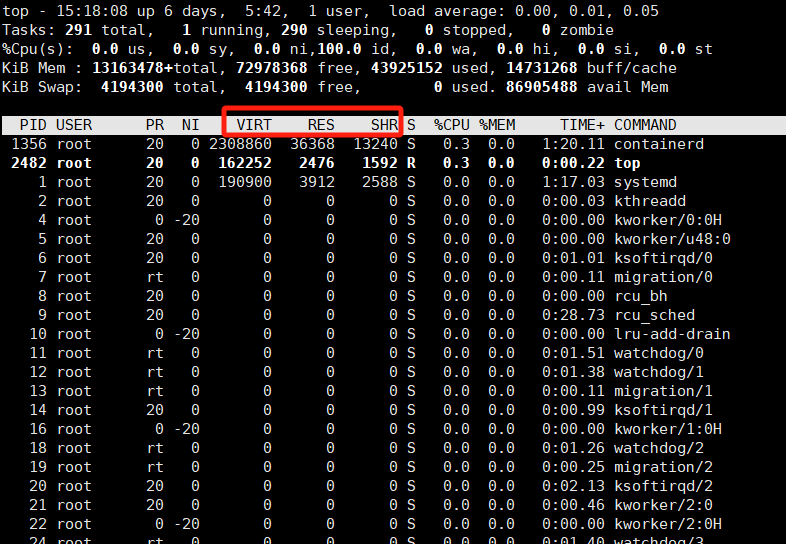

# Linux内核的内存管理


## 一、top命令中的内存信息



### 1.1`top` 中虚拟内存、常驻内存、共享内存的区别

虚拟内存、常驻内存和共享内存在内存管理中扮演着不同的角色。下面详细介绍它们的区别、创建和销毁过程，以及常用的操作函数。

```apl
具体的虚拟内存知识手札，可以查看：《IOMMU与linux-kernel内存管理》
```


#### 1. **虚拟内存（Virtual Memory）**

**定义**
虚拟内存是操作系统为每个进程提供的一个抽象的内存空间，给每个进程一个独立的地址空间。虚拟内存通过将程序的逻辑地址映射到物理地址的方式，允许程序使用比实际物理内存更多的内存。

**创建**
虚拟内存是通过操作系统的内存管理机制自动创建的，通常不需要程序员手动创建。操作系统使用页表（Page Table）来实现虚拟地址到物理地址的映射。

**销毁**
当进程终止时，操作系统会自动回收该进程的虚拟内存空间。具体步骤包括：

1. 操作系统将进程的虚拟地址空间标记为无效。
2. 回收进程所使用的页表项。
3. 释放相关的物理内存资源。

**操作函数**

- **`mmap()`**：用于映射文件到内存，或者申请匿名内存。
- **`munmap()`**：用于解除映射的虚拟内存区域。

虚拟内存可以使用超越物理内存大小的内存空间，是因为它利用了以下几个机制来扩展可用内存：

##### **虚拟内存的扩展机制**

1. **页面调度（Paging）**
    - **定义**：操作系统将虚拟内存划分为固定大小的页面（通常是 4KB）。当程序访问虚拟内存中的某个页面时，操作系统检查该页面是否在物理内存中。如果不在，操作系统会将其从磁盘加载到物理内存中。
    - **作用**：这种机制允许程序使用比实际物理内存更多的虚拟内存空间。只有在程序实际访问某些数据时，这些数据才会被加载到物理内存中。
2. **交换空间（Swap Space）**
    - **定义**：操作系统在硬盘上预留了一个区域作为交换空间（或页面文件）。当物理内存不足时，操作系统可以将不常用的数据从物理内存移动到交换空间，从而腾出物理内存给当前需要的数据。
    - **作用**：通过将不常用的数据交换到磁盘，操作系统可以支持更多的虚拟内存使用，虽然交换空间的访问速度比物理内存慢得多，但它为系统提供了额外的内存空间。
3. **内存映射（Memory Mapping）**
    - **定义**：操作系统可以将磁盘上的文件或设备映射到进程的虚拟内存空间中，使得进程可以像访问内存一样访问这些文件或设备。
    - **作用**：这允许程序访问大型文件或数据集，而不需要将整个文件加载到物理内存中。

##### **虚拟内存的工作流程**

1. **程序请求内存**：程序请求内存时，操作系统为其分配虚拟地址空间。这些虚拟地址并不直接映射到物理内存。
2. **懒惰分配（Lazy Allocation）**：操作系统不会立即将所有分配的虚拟内存映射到物理内存中。只有在程序访问这些内存区域时，操作系统才会实际分配物理内存。
3. **页面交换（Paging and Swapping）**：当物理内存不足时，操作系统将较少使用的页面交换到磁盘上的交换空间，同时将需要的页面从磁盘中加载到物理内存中。

**总结**

- **虚拟内存** 通过将内存需求分成更小的页面，并利用硬盘上的交换空间来扩展内存容量，从而使得程序可以使用超出物理内存大小的内存空间。
- **物理内存** 是有限的，而虚拟内存通过使用磁盘存储作为扩展，为程序提供了更大的内存地址空间。


#### 2. **常驻内存（Resident Memory）**

**定义**
常驻内存是指进程当前实际占用的物理内存部分。<span style="color: green;">**这包括进程实际驻留在 RAM 中的代码、数据和堆栈等部分**，不包括已经交换到磁盘上的部分。</span>

**创建**
常驻内存在进程创建时由操作系统分配，并且随着进程的运行和内存使用情况动态变化。操作系统根据进程的需求和系统的内存情况来分配和回收常驻内存。

**销毁**
当进程结束或释放内存时，常驻内存会被操作系统回收。具体步骤包括：

1. 操作系统将进程的物理内存标记为可回收。
2. 释放相关的物理内存块。
3. 更新系统内存管理结构。

**操作函数**

- **`malloc()`**、**`calloc()`**、**`realloc()`** 和 **`free()`**：用于动态分配和释放内存。
- **`brk()`** 和 **`sbrk()`**：用于调整进程的堆内存边界。


#### 3. **共享内存（Shared Memory）**

**定义**
共享内存是一种允许多个进程访问同一块物理内存区域的机制。它用于在进程间传递数据，减少数据复制和通信开销。

**创建**
共享内存通常通过系统调用创建。常见的创建共享内存的方法有：

- **`shmget()`**：用于创建共享内存段。
- **`mmap()`**：用于创建内存映射文件，进程可以通过映射同一个文件来共享内存。

**销毁**
共享内存的销毁通常由进程或操作系统负责，具体包括：

1. **`shmctl()`**：用于删除共享内存段。
2. **`munmap()`**：解除内存映射关系。

**操作函数**

- **`shmget()`**：创建或获取一个共享内存段。
- **`shmat()`**：将共享内存段映射到进程的地址空间。
- **`shmdt()`**：解除共享内存段的映射。
- **`shmctl()`**：控制共享内存的属性或删除共享内存段。

总结

| 类型         | 定义                                   | 创建方法                       | 销毁方法               | 常用操作函数                                  |
| ------------ | -------------------------------------- | ------------------------------ | ---------------------- | --------------------------------------------- |
| **虚拟内存** | 进程使用的虚拟地址空间，映射到物理内存 | 自动创建（系统内存管理机制）   | 进程终止时自动回收     | `mmap()`、`munmap()`                          |
| **常驻内存** | 进程实际占用的物理内存                 | 由操作系统根据进程需求动态分配 | 进程结束时回收         | `malloc()`、`calloc()`、`realloc()`、`free()` |
| **共享内存** | 多个进程共享的物理内存区域             | `shmget()`、`mmap()`           | `shmctl()`、`munmap()` | `shmget()`、`shmat()`、`shmdt()`、`shmctl()`  |

这些内存概念和操作函数帮助程序员有效地管理和优化进程的内存使用，以提高系统性能和资源利用率。


### 1.2 top的参数总结

下表总结了 Linux 系统中使用 `top` 命令查看的各个进程信息字段及其对应作用：

| 字段    | 含义           | 作用与判断                                              |
| ------- | -------------- | ------------------------------------------------------- |
| PID     | 进程 ID        | 唯一标识进程，用于进程管理（如结束或调整进程）。        |
| USER    | 用户名         | 判断进程由哪个用户发起，识别非正常进程来源。            |
| PR      | 优先级         | 判断进程的调度优先级，低值意味着高优先级。              |
| NI      | nice 值        | 影响进程优先级，负值优先级高，正值优先级低。            |
| VIRT    | 虚拟内存占用   | 虚拟内存总量，高值可能指示内存泄漏或处理大数据。        |
| RES     | 常驻内存占用   | 实际占用的物理内存，高值可能引发内存不足问题。          |
| SHR     | 共享内存       | 共享内存大小，高值表示进程与其他进程共享资源较多。      |
| S       | 进程状态       | 判断进程状态：`R`（运行）、`S`（睡眠）、`Z`（僵尸）等。 |
| %CPU    | CPU 占用百分比 | 判断进程的 CPU 占用情况，识别高 CPU 占用的进程。        |
| %MEM    | 内存占用百分比 | 监控进程的物理内存占用，发现高内存占用或泄漏进程。      |
| TIME+   | 累计 CPU 时间  | 判断进程的 CPU 使用总量，识别 CPU 密集型任务。          |
| COMMAND | 启动命令       | 识别运行进程的可执行文件，快速定位进程的来源和作用。    |
| PPID    | 父进程 ID      | 追踪进程的父子关系，定位父进程对子进程的影响。          |
| PRI     | 调度优先级     | 影响进程获取 CPU 的频率，优先级高的进程优先获得资源。   |


## 二、linux内存关键概念

梳理 Linux 内核的内存管理机制涉及以下关键概念和模块，以下是对这些主题的详细说明：

### **2.1. 虚拟内存与物理内存**

虚拟内存是一种抽象概念，提供给每个进程一个独立的地址空间，使得它们不会相互干扰。物理内存是实际存在的 RAM，由内核统一管理。

- **页表（Page Table）**：用于将进程的虚拟地址映射到物理地址。内核维护每个进程的页表，分页机制允许不连续的物理内存提供连续的虚拟地址空间。
- **分页机制**：通过分页（通常是 4KB 页）将虚拟地址分段映射到物理内存。这是通过多级页表完成的，具体架构可以从内核的 `mm/pgtable.c` 中找到。

**核心知识**

- **虚拟内存的大小**：在 64 位系统中，虚拟内存空间非常大，理论上可以达到 16EB，但实际取决于架构和配置。
- **物理内存的限制**：物理内存大小受实际硬件影响，但通过分页和交换空间可以“扩展”虚拟内存。

#### 1 虚拟内存 ≠ 无限内存

虽然虚拟内存给程序提供了一个**看似无限的地址空间**，但实际上它并不是可以无限使用的。虚拟内存和物理内存的关系是通过分页机制和交换空间（swap）来管理的，最终还是受到物理内存和硬盘（交换空间）容量的限制。我们来详细解释这个机制和物理内存不够时的情况。

- **虚拟内存空间**非常大（在 64 位系统中，理论上可以使用数以 TB 计的虚拟地址），但它并不意味着程序可以无限使用内存。虚拟内存实际上是通过映射物理内存来使用的，物理内存是有限的。
- 当程序请求内存时，虚拟地址会映射到物理内存中的页。如果物理内存用完，系统会通过交换（swap）将不活跃的物理内存页面写入硬盘。

#### 2 物理内存和交换空间的限制

- 虽然虚拟内存可以比物理内存大，但它**最终受限于物理内存和交换空间的总和**。一旦物理内存和交换空间都耗尽，系统就无法再为程序分配新的内存，进程可能会收到内存不足的错误（`ENOMEM`）。
- 也就是说，如果所有物理内存和交换空间都用光了，虚拟内存再大也无济于事，系统就会陷入内存压力，甚至可能导致程序崩溃或系统不响应（即常见的 **Out of Memory (OOM)** 错误）。

#### 3 物理内存不够时的处理

当程序需要分配更多内存，而物理内存不够时，Linux 内核会采取以下策略：

- **交换机制（Swap）**：将不常用的内存页面从物理内存中移出，存储到硬盘上的交换分区中。这样腾出的物理内存可以给新的内存需求使用。但这个过程依赖于硬盘，速度比直接使用 RAM 要慢很多。
- **内存回收（Memory Reclamation）**：内核会使用 LRU（最近最少使用）算法来找出不常用的物理页，释放这些页以供当前活跃进程使用。内存回收（Memory Reclamation）过程中的物理页释放，确实涉及将某些内存内容写回到硬盘中。

#### 4 内存耗尽时的结果

- **OOM Killer**：当物理内存和交换空间全部用尽，Linux 内核会启动 OOM Killer，它会终止占用大量内存的进程，以释放内存资源，确保系统的稳定运行。

#### 5 使用内存时的优化策略

虽然程序可以申请大量虚拟内存，但在实际开发中，过度使用内存会导致性能下降（如频繁使用 swap 造成的 I/O 瓶颈）以及可能导致 OOM 错误。因此，以下策略有助于优化内存使用：

- **内存分配优化**：合理地使用和释放内存，避免内存泄漏。
- **交换空间的配置**：在系统中配置足够的交换空间（通常是物理内存的 1-2 倍）来应对内存不足的情况。
- **监控内存使用**：使用工具（如 `top`、`free` 等）监控内存使用情况，确保程序不会占用过多的内存资源。

#### 6 虚拟内存的大小与 CPU 架构的位宽直接相关

- **32 位系统**：虚拟地址空间为 4 GB（2322^{32}232），所以在 32 位系统中，单个程序的虚拟内存最大值是 4 GB。操作系统通常会将一部分空间用于内核，所以实际程序可用的虚拟内存要少于 4 GB（如 3 GB 或 2 GB）。
- **64 位系统**：虚拟地址空间理论上为 16 EB（2642^{64}264），但大多数系统并不会允许使用全部 64 位地址空间。实际上，操作系统和硬件对虚拟地址空间有配置限制。例如在 Linux 系统中，典型的 64 位进程通常允许使用 128 TB 左右的虚拟内存，但这远远超过了物理内存和硬盘的实际容量。

#### 7 Linux 中的具体实现

在 Linux 系统中，你可以通过以下方式查看和配置每个进程的虚拟内存限制：

- **ulimit**：通过 `ulimit` 命令可以查看或修改当前会话的虚拟内存限制。比如，`ulimit -v` 显示进程的虚拟内存最大值。
- **/proc/self/maps**：可以查看当前进程的虚拟内存映射，包括堆、栈、共享库等不同段的虚拟内存使用情况。

#### 8 程序实际需要

大多数程序并不需要占用巨大的虚拟内存空间。即使是复杂的应用程序，通常分配的虚拟内存也远远小于虚拟地址空间的最大可能值。为每个程序设置合理的虚拟内存限制有助于提高系统的整体性能，减少内存碎片，并有效管理资源。


### **2.2. 内存区域与内存节点（NUMA）**

Linux 将物理内存划分为不同的内存区域（`ZONE_DMA`、`ZONE_NORMAL`、`ZONE_HIGHMEM`）来处理不同设备对内存的需求。

- **NUMA（Non-Uniform Memory Access）**：在多处理器系统中，每个处理器可能有自己的本地内存节点。NUMA 提供了一个机制来优化进程对本地内存的访问，从而提升性能。
- **内存节点管理**：可以通过内核的 `mm/numa.c` 文件查看 NUMA 相关的内存分配策略。

**核心知识**

- **`ZONE_DMA`**：用于 DMA 设备的内存区域，适合硬件直接访问。
- **`ZONE_NORMAL`**：标准的内存区域，供大多数用户进程使用。
- **`ZONE_HIGHMEM`**：超过 4GB 的内存区域，32 位系统上会用到。


### **2.3. 内存分配机制**

Linux 内核使用了多种分配器来管理内存：

- **伙伴系统（Buddy System）**：用于分配连续的物理页。它将内存划分为不同大小的块，并通过合并和拆分块来实现高效的分配和释放。源码在 `mm/page_alloc.c`。
- **slab、slub、slob 分配器**：这些分配器用于管理小块内存的分配。slab 分配器适合频繁分配和释放小内存对象的情况，比如内核对象。源码在 `mm/slab.c`、`mm/slub.c`、`mm/slob.c`。

**核心知识**

- **伙伴系统工作原理**：通过合并相邻的内存块形成更大的块，或将大块拆分为多个小块。
- **slab/slub/slob 分配器**：通过缓存机制减少频繁的内存分配和释放带来的开销。


### **2.4. 内存回收机制**

当系统内存不足时，Linux 内核通过回收不再使用的内存页来腾出空间。

- **`kswapd`**：负责后台回收内存，当内存低于一定阈值时，它会通过回收页表和调用文件系统的回收接口（如 `shrink_page_list()`）回收内存。
- **`OOM Killer`**：当内存不足以维持系统运行时，内核会通过 OOM Killer 选择并杀死一些占用大量内存的进程，释放内存以保证系统继续运行。

**核心知识**

- **内存压力监控**：当可用内存低于某个门限时，内核会触发内存回收机制。
- **页回收机制**：`shrink_page_list()` 函数用于遍历和释放不再需要的内存页。


### **2.5. 交换空间（Swap）**

交换空间是将不常用的内存页移到磁盘上的一种机制。通过交换空间，Linux 可以虚拟扩展物理内存。

- **`swap_out()` 和 `swap_in()`**：负责将内存页移到交换空间或从交换空间重新加载到物理内存。源码位于 `mm/swap.c` 和 `mm/swap_state.c`。

**核心知识**

- **交换机制**：当物理内存不足时，系统将不活跃的内存页面换出到磁盘，腾出物理内存给活跃的应用程序使用。

------

### 2.6 **总结表格**

| **概念**         | **描述**                                                     | **核心文件**             | **关键函数**                     |
| ---------------- | ------------------------------------------------------------ | ------------------------ | -------------------------------- |
| **虚拟内存**     | 进程的虚拟地址空间，通过页表映射到物理地址                   | `mm/memory.c`            | `pgd_alloc()`、`pte_alloc()`     |
| **物理内存**     | 实际的 RAM，用于存储进程数据                                 | `mm/page_alloc.c`        | `alloc_pages()`、`free_pages()`  |
| **NUMA**         | 多处理器系统中内存的优化访问，分为不同的内存节点             | `mm/numa.c`              | `alloc_pages_node()`             |
| **内存分配器**   | Slab、Slub、Slob 分配器管理小块内存，伙伴系统用于分配大块内存 | `mm/slab.c`、`mm/slub.c` | `kmalloc()`、`kfree()`           |
| **内存回收机制** | `kswapd` 和 `OOM Killer` 用于在内存不足时回收和释放内存      | `mm/vmscan.c`            | `kswapd()`、`shrink_page_list()` |
| **交换空间**     | 当内存不足时，将不活跃的页面换出到磁盘，腾出物理内存         | `mm/swap.c`、`mm/swap.c` | `swap_in()`、`swap_out()`        |

------

你可以从这几个方面深入分析，进一步阅读内核源码。希望这些建议和结构能帮助你更好地梳理和理解 Linux 内核的内存管理机制