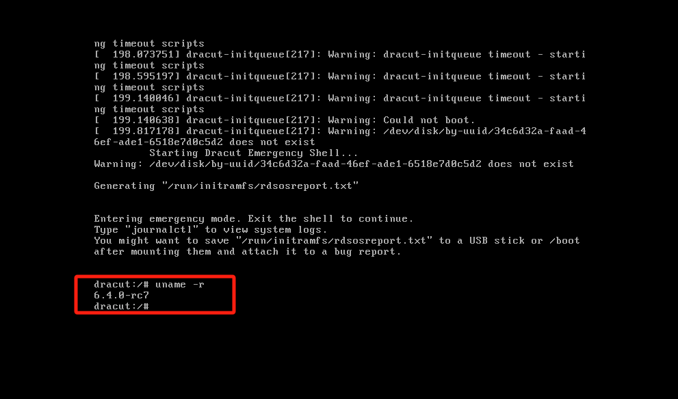
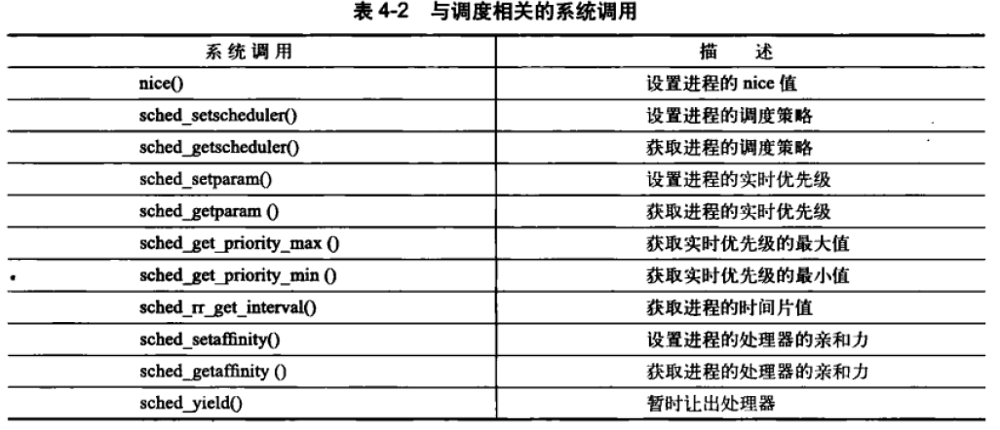

# Linux内核设计与实现---读志


## 一、从内核出发

### 1、config配置

```bash
# 用户逐个选择配置选项
make config

# 用户在可视化菜单中选择选项
make menuconfig
```


```bash
# 基于默认生成配置
make defconfig
```


### 2、编译安装

```bash
make 
```

#### 2.1 libelf问题


```bash
yum install elfutils-libelf-devel
```

关于 "make -j" 的命令意义：


报错：


在进行 `make -j` 编译时，出现 `gcc: fatal error: Killed signal terminated program cc1` 的错误提示，通常是由于系统资源不足（尤其是内存）导致的。我们可以**适当降低 make -j 时所指定的编译作业数量；**

​	make -j2

```less
示例：编译和安装内核的说明
下载内核源代码（如前所述）。
	1、配置内核：使用 make menuconfig 或 make xconfig 等命令进行配置。
	2、编译内核：运行 make 和 make modules。
	3、安装模块：使用 make modules_install。
	4、安装内核：使用 make install。
	5、选择内核版本：// 2.2种描述
	5、更新 GRUB 配置：运行 grub2-mkconfig -o /boot/grub2/grub.cfg。
	6、重启系统。
```


#### 2.2 内核安装

要查看和确认 GRUB 菜单项的变化，可以按照以下步骤进行操作：

1. **查看当前的 GRUB 配置**

你可以直接查看 `/boot/grub2/grub.cfg` 文件，以了解当前所有的内核菜单项。使用以下命令打开该文件：

```bash
cat /boot/grub2/grub.cfg
```

在该文件中，你可以找到 `menuentry` 条目，这些条目对应于 GRUB 启动菜单中的每个内核或操作系统。每个 `menuentry` 的名称就是你在 GRUB 启动菜单中看到的内容。

2. **使用命令行工具**

如果你希望通过命令行工具查看 GRUB 菜单项，可以使用 `grep` 命令过滤出相关信息：

```bash
grep menuentry /boot/grub2/grub.cfg
```

这将列出所有的菜单项。输出可能类似于以下内容：

```bash
menuentry 'CentOS Linux (6.4.0-rc7) 64-bit' ...
menuentry 'CentOS Linux (3.10.0-1160.119.1.el7.x86_64) 64-bit' ...
menuentry 'CentOS Linux (0-rescue-b05b41ba93eb4389bdc41d0399078df4)' ...
```

如图示例：


3. **识别菜单项编号**

在 GRUB 启动菜单中，菜单项是按顺序编号的，从 0 开始。例如，如果你的菜单项列表如下：

1. `CentOS Linux (6.4.0-rc7) 64-bit` — 编号 0
2. `CentOS Linux (3.10.0-1160.119.1.el7.x86_64) 64-bit` — 编号 1
3. `CentOS Linux (0-rescue-b05b41ba93eb4389bdc41d0399078df4)` — 编号 2

4. **设置默认内核**

如果你确定想要将默认内核设置为 `6.4.0-rc7`，你可以使用以下方式设置 `GRUB_DEFAULT` ：

- 通过菜单名称：

    ```bash
    GRUB_DEFAULT="CentOS Linux (6.4.0-rc7) 64-bit"
    ```

- 或通过菜单编号：

    ```bash
    GRUB_DEFAULT=0  # 如果它是列表中的第一个
    ```

5. **更新 GRUB 配置**

任何修改后，请确保更新 GRUB 配置以使更改生效：

```bash
sudo grub2-mkconfig -o /boot/grub2/grub.cfg
```

6. **重启并确认**

重启计算机后，使用 `uname -r` 命令确认当前运行的内核版本。

```bash
uname -r
```


#### 2.3 结果对比

编译前旧版本before


安装重启后after:




启动后，如果需要返回原来的linux

```less
方式1：修改2.2种的grub版本，重启；
方式2：如果在某些情况下你无法启动到新的内核版本，直接关机(poweroff)，然后GRUB 启动菜单也提供了手动选择内核的选项。在计算机启动时，调整选择所启动的内核；
```

选择：


## 二、进程管理

### 1、进程状态


图像梳理：


#### 1.1 `fork()` 系统调用和进程状态

当你调用 `fork()` 时，内核会执行以下步骤：

1. **创建新进程：**
    - 内核为新进程分配一个进程描述符（`task_struct`），并将新进程的状态设为 `TASK_INTERRUPTIBLE`（睡眠或阻塞） 或 `TASK_UNINTERRUPTIBLE`（不可阻断）（取决于具体情况）。
    - 新进程继承父进程的资源和状态，但并没有被立即调度执行。
2. **父进程继续运行：**
    - 调用 `fork()` 的**父进程不会被阻塞，它会继续执行下去。**
3. **新进程的初始状态：**
    - 新进程的状态通常是 `TASK_STOPPED` 或 `TASK_INTERRUPTIBLE`，但不会直接进入运行状态。它会被放入就绪队列中，等待 CPU 时间片。
4. **调度：**
    - 只有当调度器 (`scheduler`) 被触发时，才会根据某些算法（如 CFS、实时调度策略等）决定哪个进程可以获得 CPU 时间片，并将其状态更新为 `TASK_RUNNING`。
    - 调度器会选择新创建的进程或其他就绪进程，将其从就绪队列中选出并安排执行。
5. **父进程和子进程的执行顺序：**
    - 当 `fork()` 被调用时，父进程和子进程是并行存在的，它们都会进入就绪队列，调度器会决定哪个进程先运行。如果父进程优先获得 CPU 时间片，那么父进程将先执行；否则，子进程可能会先执行。具体哪个进程首先执行取决于调度器。

##### (1) 为什么新进程不会立即运行？

- **进程调度的控制：** 在 Linux 内核中，进程调度是由调度器（`schedule()` 函数）来决定的。即使你调用了 `fork()`，新进程的状态也只是“准备就绪”（即被放入了就绪队列），它并不会立刻运行。只有当调度器选择它，并将其状态更改为 `TASK_RUNNING` 时，进程才会开始执行。
- **多任务处理：** Linux 是一个多任务操作系统，它有多个进程需要运行。`fork()` 创建的子进程进入就绪队列后，调度器会根据一定的调度策略来选择下一个运行的进程。因此，子进程可能并不会立刻运行。
- **父子进程的并发执行：** 父进程在 `fork()` 返回后并不会等待子进程，除非父进程调用 `wait()` 或其他同步机制。因此，父进程和子进程是并发执行的，调度器决定哪个进程先运行。

**举个例子**:假设你有如下代码：

```c
pid_t pid = fork();
if (pid == 0) {
    // 子进程代码
    printf("This is the child process\n");
} else {
    // 父进程代码
    printf("This is the parent process\n");
}
```

- 调用 `fork()` 时，内核会创建一个新的子进程，并将其放入就绪队列，但子进程不会立刻执行。
- 父进程可能继续执行它的 `printf` 语句，然后调度器可能选择父进程先执行。
- 最终，调度器会决定哪个进程首先执行，不一定是父进程，也不一定是子进程。

**总结**

`fork()` 系统调用只是创建一个新进程并将其放入就绪队列，但新进程的状态并不会立刻变为 `TASK_RUNNING`。这是因为进程调度是由内核的调度器来控制的，`fork()` 仅创建新进程并初始化它的资源，而调度器决定进程何时运行。因此，只有在调度器决定让某个进程运行时，进程的状态才会从 `TASK_STOPPED` 或 `TASK_INTERRUPTIBLE` 变为 `TASK_RUNNING`，并开始执行

##### (2) ps -aux

当我们使用`ps -aux` 查看当前系统中正在运行的所有进程的命令。各个选项的含义如下：

- `a`: 显示所有用户的进程。
- `u`: 以用户格式显示进程（包括进程的所有者、CPU 和内存使用情况等）。
- `x`: 显示没有控制终端的进程（例如后台进程）。

执行 `ps -aux` 后，输出的内容会显示如下信息（示例）：

```sql
USER       PID %CPU %MEM    VSZ   RSS TTY      STAT START   TIME COMMAND
root         1  0.0  0.1 169320  7532 ?        Ss   Dec02   0:03 /sbin/init
root       535  0.0  0.2 205224 10852 ?        Ssl  Dec02   0:20 /usr/lib/systemd/systemd-journald
user      1234  1.2  3.5 368792 71052 ?        S    10:12   2:30 /usr/bin/firefox
```

其中，各列的意义如下：

- `USER`: 进程的所有者。
- `PID`: 进程ID。
- `%CPU`: 进程使用的 CPU 百分比。
- `%MEM`: 进程使用的内存百分比。
- `VSZ`: 进程占用的虚拟内存大小（KB）。
- `RSS`: 进程占用的物理内存大小（KB）。
- `TTY`: 进程所在的终端。
- `STAT`: 进程的状态（例如 S = 睡眠，R = 正在运行）。
- `START`: 进程启动的时间。
- `TIME`: 进程运行的累计时间。
- `COMMAND`: 启动进程的命令。


### 2、进程创建

​		Unix的进程创建很特别。许多其他的操作系统都提供了产生(spawn)进程的机制，首先在新的地址空间里创建进程，读入可执行文件，最后开始执行。

​		Unix采用了与众不同的实现方式，它把上述步骤分解到两个单独的函数中去执行:forkO和execO)日。

- 首先，fork()通过拷贝当前进程创建一个子进程。子进程与父进程的区别仅仅在于PID(每个进程唯一)、PPID(父进程的进程号，子进程将其设置为被拷贝进程的PID)和某些资源和统计量(例如，挂起的信号，它没有必要被继承)。
- excc0函数负责读取可执行文件并将其载入地址空间开始运行。把这两个函数组合起来使用的效果跟其他系统使用的单一函数的效果相似。


### 3、线程的高雅

​		线程机制是现代编程技术中常用的一种抽象概念。该机制提供了在同一程序内共享内存地址空间运行的一组线程。这些线程还可以共享打开的文件和其他资源。线程机制支持并发程序设计技术(concurrentprogramming)，在多处理器系统上，它也能保证真正的并行处理(parallelism)。

​		Linux 实现线程的机制非常独特。从内核的角度来说，它并没有线程这个概念。**Limux 把所有的线程都当做进程来实现**。内核并没有准备特别的调度算法或是定义特别的数据结构来表征线程。**相反，线程仅仅被视为一个与其他进程共享某些资源的进程**。每个线程都拥有唯一隶属于自己的 task struct，所以**在内核中，它看起来就像是一个普通的进程(只是线程和其他一些进程共享某些资源，如地址空间)**。

​		上述线程机制的实现与Microsof Windows或是Sun Solaris等操作系统的实现差异非常大。这些系统都在内核中提供了专门支持线程的机制(这些系统常常把线程称作轻量级进程(lightweight processes))。“轻量级进程”这种叫法本身就概括了Linux在此处与其他系统的差异。在其他的系统中，相较于重量级的进程，线程被抽象成一种耗费较少资源，运行迅速的执行单元。

​		而对于Linux来说，它只是一种进程间共享资源的手段(Limnux的进程本身就够轻量级了)日举个例子来说，假如我们有一个包含四个线程的进程，在提供专门线程支持的系统中，通常会有一个包含指向四个不同线程的指针的进程描述符。该描述符负责描述像地址空间、打开的文件这样的共享资源。线程本身再去描述它独占的资源。相反，Linux仅仅创建四个进程并分配四个普通的task sturct结构。建立这四个进程时指定他们共享某些资源，这是相当高雅的做法。

#### 3.1 内核线程

​		内核经常需要在后台执行一些操作。这种任务可以通过内核线程(kermelthread)完成一独立运行在内核空间的标准进程。

​		**内核线程和普通的进程间的区别在于内核线程没有独立的地址空间(实际上指向地址空间的 mm 指针被设置为NULL)。它们只在内核空间运行，从来不切换到用户空间去。**

​		内核进程和普通进程一样，可以被调度，也可以被抢占。Linux 确实会把一些任务交给内核线程去做，像 fush和 ksofrgd 这些任务就是明显的例子在装有 Limux系统的机子上运行ps-ef命令，你可以看到内核线程，有很多!这些线程在系统启动时由另外一些内核线程创建。实际上，内核线程也只能由其他内核线程创建。内核是通过从kthreadd 内核进程中衍生出所有新的内核线程来自动处理这一点的。在<linux/kthread.h>中申明有接口，于是，从现有内核线程中创建一个新的内核线程的方法如下:

```c
struct task struct *kthread_create(int(*threadfn) (void *data)void *data,const char namefmt[]
..)
```

新的任务是由kthread内核进程通过clone()系统调用而创建的。新的进程将运行tbreadf函数，给其传递的参数为data。进程会被命名为namefmt，namefmt接受可变参数列表类似于printf0的格式化参数。新创建的进程处于不可运行状态，如果不通过调用wake_up_process()明确地唤醒它，它不会主动运行。创建一个进程并让它运行起来，可以通过调用kthread runO)来达到:

```c
struct task struct *kthread_run(int(*threadfn)(void *data),void *data, const char namefmt[]
...)
```

这个例程是以宏实现的，只是简单地调用了kthread create()和wake_up_process():


### 4、进程的退出

注意：下面描述中的进程、线程源于原文翻译，使用过程可能出现混乱，你需要把线程直接理解成进程即可。

#### 4.1删除进程描述符

​		在调用了 do_exit0)之后，尽管线程已经僵死不能再运行了，但是**系统还保留了它的进程描述符**。前面说过，这样做可以让系统有办法在子进程终结后仍能获得它的信息。因此，**进程终结时所需的清理工作和进程描述符的删除被分开执行**。在父进程获得已终结的子进程的信息后，或者通知内核它并不关注那些信息后，子进程的taskstruct结构才被释放。

​		wait()这一族函数都是通过唯一(但是很复杂)的一个系统调用wait4()来实现的。它的标准动作是挂起调用它的进程，直到其中的一个子进程退出，此时函数会返回该子进程的PID。此外，调用该函数时提供的**指针会包含子函数退出时的退出代码**。当最终需要释放进程描述符时，releasetask()会被调用，用以完成以下工作:

```less
	1) 它调用 _exit_signal(),该函数调用 _unhash_process(),后者又调用 detach_pid()从 pidhash上删除该进程，同时也要从任务列表中删除该进程。
	2) exit_signal()释放目前僵死进程所使用的所有剩余资源，并进行最终统计和记录。
	3) 如果这个进程是线程组最后一个进程，并且领头进程已经死掉，那么releasetask()就要通知僵死的领头进程的父进程。
	4) release_task()调用 put_task_struct()释放进程内核栈和 thread_info 结构所占的页，并释放tast_struct 所占的 slab 高速缓存。
```

至此，进程描述符和所有进程独享的资源就全部释放掉了。


#### 4.2 孤儿进程

​		如果父进程在子进程之前退出，必须有机制来保证子进程能找到一个新的父亲，否则这些成为孤儿的进程就会在退出时永远处于僵死状态，白白地耗费内存。

​		前面的部分已经有所暗示，对于这个问题，解决方法是**给子进程在当前线程组内找一个线程作为父亲**，如果不行，就让 init 做它们的父进程。在 do_exit() 中会调用 exit notify()，该函数会调用 forget_origimal_parent()，而后者会调用 find_new_reaper() 来执行寻父过程.

​		该函数试图**找到进程所在的线程组内的其他进程**。**如果线程组内没有其他的进程，它就找到并返回的是 init进程**。现在，给子进程找到合适的养父进程了，只需要遍历所有子进程并为它们设置新的父进程:


## 三、进程调度

### 1、linux是抢占式系统

​		多任务系统可以划分为两类:非抢占式多任务(cooperativemultitasking)和抢占式多任务(preemptive multitasking)。

​		进程可以被分为 **IO 消耗型**和**处理器消耗型**。

```apl
（1）IO 消耗型：进程的大部分时间用来提交IO请求或是等待IO请求。因此，这样的进程经常处于可运行状态，但通常都是运行短短的一会儿，
（2）处理器消耗型：对于这类处理器消耗型的进程，调度策略往往是尽量降低它们的调度频率，而延长其运行时间。
（3）当然，这种划分方法并非是绝对的。进程可以同时展示这两种行为:比如，XWindow 服务器既是 IO消耗型，也是处理器消耗型。还有些进程可以是I0消耗型，但属于处理器消耗型活动的范围。其典型的例子就是字处理器，其通常坐以等待键盘输入，但在任一时刻可能又粘住处理器疯狂地进行拼写检查或者宏计算。
```

​		**调度策略通常要在两个矛盾的目标中间寻找平衡:进程响应迅速(响应时间短)和最大系统利用率(高吞吐景)**。为了满足上述需求，调度程序通常采用一套非常复杂的算法来决定最值得运行的进程投入运行，但是它往往并不保证低优先级进程会被公平对待。**Unix系统的调度程序更倾向于 IO消耗型程序，以提供更好的程序响应速度。Linux为了保证交互式应用和桌面系统的性能，所以对进程的响应做了优化(缩短响应时间)，更倾向于优先调度I0消耗型进程。**虽然如此，但在下面你会看到，调度程序也并未忽略处理器消耗型的进程。

**Linux采用了两种不同的优先级范围**

​		第一种是**用nice值**，它的范围是从-20到+19，默认值为0:**越大的 nice值意味着更低的优先级**--nice似乎意味着你对系统中的其他进程更“优待”。相比高nice值(低优先级)的进程，低nice值(高优先级)的进程可以获得更多的处理器时间。nice值是所有 Unix 系统中的标准化的概念--但不同的 Unix 系统由于调度算法不同，因此 nice 值的运用方式有所差异。比如一些基于 Unix的操作系统，如 Mac OS X，进程的 nice 值代表分配给进程的时间片的绝对值;而Linux系统中，nice值则代表时间片的比例。你可以通过ps-el命令查看系统中的进程列表，结果中标记N1的一列就是进程对应的nice值。

​		第二种范围是**实时优先级**，其值是可配置的，默认情况下它的变化范围是从0到99(包括0和 99)。**与nice 值意义相反，越高的实时优先级数值意味着进程优先级越高。**

```shell
# 任何实时进程的优先级都高于普通的进程，也就是说实时优先级和nice优先级处于互不相交的两个范畴。Linux实时优先级的实现参考了 Unix 相关标准--特别是POSIX.1b。大部分现代的 Unix 操作系统也都提供类似的机制。你可以通过命令:
ps -eo state,uid,pid,ppid,rtprio,time,comm
```

查看到你系统中的进程列表，以及它们对应的实时优先级(位于RTPRIO列下)，其中如果有进程对应列显示“_”，则说明它不是实时进程。


### 2、时间片

​			时间片是一个数值，它表明进程在被抢占前所能持续运行的时间。调度策略必须规定一个默认的时间片，但这并不是件简单的事。时间片过长会导致系统对交互的响应表现欠佳，让人觉得系统无法并发执行应用程序:时间片太短会明显增大进程切换带来的处理器耗时，因为肯定会有相当一部分系统时间用在进程切换上，而这些进程能够用来运行的时间片却很短。此外，I/0消耗型和处理器消耗型的进程之间的矛盾在这里也再次显露出来:I/0消耗型不需要长的时间片，而**处理器消耗型的进程则希望越长越好(比如这样可以让它们的高速缓存命中率更高)。**

​			从上面的争论中可以看出，任何长时间片都将导致系统交互表现欠佳。很多操作系统中都特别重视这一点，所以默认的时间片很短，如10ms。但是Linux的CFS调度器并没有直接分配时间片到进程，它是将处理器的使用比划分给了进程。这样一来，

```apl
	进程所获得的处理器时间其实是和系统负载密切相关的。这个比例进一步还会受进程nice值的影响，nice 值作为权重将调整进程所使用的处理器时间使用比。具有更高nice值(更低优先权)的进程将被赋予低权重，从而丧失一小部分的处理器使用比:而具有更小nice值(更高优先级)的进程则会被赋予高权重，从而抢得更多的处理器使用比。
```


### 3、调度算法

​	完全公平调度(CFS)是一个针对普通进程的调度类，在Linux中称为SCHED_NORMAI(在POSIX中称为SCHED_OTHER)，CFS算法实现定义在文件kernel/sched fair.c中。

---

#### 3.1`nice` 值与权重的映射
   - Linux 内核维护一个 `prio_to_weight` 表，将 `nice` 值映射到权重。例如：
     - `nice = 0` → 权重 ≈ 1024
     - `nice = 5` → 权重 ≈ 335
     - `nice = 10` → 权重 ≈ 110
     - `nice = 15` → 权重 ≈ 36

   - 权重比例公式：  
     比例 = 进程A的权重 / 进程B的权重

​	现在，让我们再来看看具有不同nice值的两个可运行进程的运行情况--比如一个具有默认 nice值(0)，另一个具有的nice值是5。这些不同的nice 值对应不同的权重，所以上述两个进程将获得不同的处理器使用比。在这个例子中，nice值是5的进程的权重将是默认nice 进程的1/3。如果我们的目标延迟是20ms，那么这两个进程将分别获得15ms和5ms的处理器时间。再比如我们的两个可运行进程的 nice值分别是10和15，它们分配的时间片将是多少呢?还是15和 5ms! 可见，绝对的 nice 值不再影响调度决策**:只有相对值才会影响处理器时间的分配比例。**


### 4、调度的实现

#### 4.1 时间记账

​	CFS不再有时间片的概念，但是它也必须维护每个进程运行的时间记账，因为它需要确保每个进程只在公平分配给它的处理器时间内运行。CFS使用调度器实体结构(定义在文件<linux/sched.h>的中)来追踪进程运行记账。

调度器实体结构作为一个名为se的成员变量，嵌入在进程描述符 struct task struct 内。我们已经在前面讨论过进程描述符。


​		vruntime 变量存放进程的虚拟运行时间，该运行时间(花在运行上的时间和)的计算是经过了所有可运行进程总数的标准化(或者说是被加权的)。**虚拟时间是以ns为单位的**，所以vruntime 和定时器节拍不再相关。


#### 4.2 进程选择

vruntime的进程。这其实就是 CFS调度算法的核心:选择具有最小vruntime 的任务。那么剩下的内容我们就来讨论到底是如何实现选择具有最小 vuntime 值的进程。
CFS使用红黑树来组织可运行进程队列，并利用其迅速找到最小vruntime值的进程。在Limnux中，红黑树称为rbtree，它是一个自平衡二叉搜索树。我们将在第6章讨论自平衡二叉树以及红黑树。现在如果你还不熟悉它们，不要紧，你只需要记住红黑树是一种以树节点形式存储的数据，这些数据都会对应一个键值。我们可以通过这些键值来快速检索节点上的数据(重要的是，通过键值检索到对应节点的速度与整个树的节点规模成指数比关系)。

**CFS调度算法的核心:选择具有最小vruntime 的任务**。那么剩下的内容我们就来讨论到底是如何实现选择具有最小 vuntime 值的进程。

**CFS使用红黑树来组织可运行进程队列**，并利用其迅速找到最小vruntime值的进程。在Linux中，红黑树称为rbtree，它是一个自平衡二叉搜索树。我们将在之后讨论自平衡二叉树以及红黑树。现在如果你还不熟悉它们，不要紧，你只需要记住红黑树是一种以树节点形式存储的数据，这些数据都会对应一个键值。我们可以通过这些键值来快速检索节点上的数据(重要的是，通过键值检索到对应节点的速度与整个树的节点规模成指数比关系)。

##### 1、挑选下一个任务

​	CFS的进程选择算法可简单总结为“运行btee 树中最左边叶子节点所代表的那个进程”。实现这一过程的函数是picknext entity0，它定义在文件kemne/sched fair.c中:

```less
	static struct sched_entity *__pick_next_entity(struct sched_entity *se)
	{
		struct rb_node *next = rb_next(&se->run_node);
		if (!next)
			return NULL;
		return __node_2_se(next);
	}
// 注意pick_next_entity()函数本身并不会遍历树找到最左叶子节点，因为该值已经缓存在rb leftmost 字段中。虽然红黑树让我们可以很有效地找到最左叶子节点(O(树的高度)等于树节点总数的O(1og n)，这是平衡树的优势)，但是更容易的做法是把最左叶子节点缓存起来。这个函数的返回值便是 CFS 调度选择的下一个运行进程。如果该函数返回值是NULI，那么表示没有最左叶子节点，也就是说树中没有任何节点了。这种情况下，表示没有可运行进程，CFS 调度器便选择 idle 任务运行。

```

##### 2、向树中加入进程

CFS如何将进程加入rbtree中，以及如何缓存最左叶子节点？

这一切发生在进程变为可运行状态(被唤醒)或者是通过fork()调用第一次创建进程时。enqueue_entity0函数实现了这一目的。

```less
红框处：通过调用 update_curr()，在更新min_vruntime 之前先更新规范化的vruntime
		se->vruntime +=cfs r>min vruntime;
update_cur：更新“当前任务”的运行时统计数据
```


上面函数更新运行时间和其他一些统计数据，然后调用 __enqueue_entity() 进行繁重的插入操作，把数据项真正插入到红黑树中:


while()循环中遍历树以寻找合适的匹配键值，该值就是被插入进程的 vruntime。

平衡二叉树的基本规则是，如果键值小于当前节点的键值，则需转向树的左分支;相反如果大于当前节点的键值，则转向右分支。

- 如果一旦走过右边分支，哪怕一次，也说明插入的进程不会是新的最左节点，因此可以设置1efmost为0。
- 如果一直都是向左移动，那么 lefmost 维持1，这说明我们有一个新的最左节点，并且可以更新缓存--设置rb_leftmost 指向被插入的进程。当我们沿着一个方向和一个没有子节的节点比较后:link 如果这时是NULL，循环随之终止。当退出循环后，接着在父节点上调用rb_linknode()，以使得新插入的进程成为其子节点。最后函数 rb_insert_color() 更新树的自平衡相关属性。关于着色问题，我们放在h后续章节讨论。


##### 3、从树中删除进程

最后我们看看CFS是如何从红黑树中删除进程的。删除动作发生在进程堵塞(为不可运行态)或者终止时(结束运行):

```c
static void dequeue_entity(struct cfs_rq *cfs_rg,struct sched_entity *se, int sleep)
```

从红黑树中删除进程要容易得多。因为rbtree实现了rb_erase()函数，它可完成所有工作。该函数的剩下工作是更新rb_lefmost缓存。如果要删除的进程是最左节点，那么该函数要调用 rbnext() 按顺序遍历，找到谁是下一个新的最左节点。


#### 4.3 调度器入口

​		进程调度的主要入口点是函数 schedule()，它定义在文件kemel/sched.c中。它正是内核其他部分用于调用进程调度器的入口:选择哪个进程可以运行，何时将其投入运行。

​		Schedule() 通常都需要和一个具体的调度类相关联，也就是说，它会找到一个最高优先级的调度类———调度类需要有自己的可运行队列，然后问调度类谁才是下一个该运行的进程。

在 Linux 调度器中，任务（进程）分属于不同的**调度类（scheduling class）**，每个类有不同的优先级。大致如下：

| 调度类 | 简介                | 优先级 |
| ------ | ------------------- | ------ |
| `stop` | 停止类（最高）      | 最高   |
| `rt`   | 实时类（real-time） | 高     |
| `dl`   | deadline 类         | 高     |
| `fair` | 普通类（CFS）       | 中     |
| `idle` | 空闲类              | 最低   |

​		**每一个调度类都实现了pick_next_task() 函数，它会返回指向下一个可运行进程的指针**，或者没有时返回NULL。我们会从第一个返回非NULL值的类中选择下一个可运行进程。CFS中 pick_next_task() 实现会调用 pick_next_entity())，而该函数会再来调用我们前面内容中讨论过的 pick_next_entity()函数。

公平调度类（CFS）的函数注册：


​		该函数中唯一重要的事情：它会调用 pick_next_task() (也定义在文件kernel/sched.c中)。 pick_next_task 会以优先级为序，从高到低，依次检查每一个调度类，并且从最高优先级的调度类中，选择最高优先级的进程。

```apl
	注意：该函数开始部分的优化。因为CFS是普通进程的调度类，而系统运行的绝大多数进程都是普通进程，因此这里有一个小技巧用来加速选择下一个CFS提供的进程，前提是所有可运行进程数量等于 CFS 类对应的可运行进程数(这样就说明所有的可运行进程都是 CFS 类的)。
```


#### 4.4 睡眠和唤醒

**休眠(被阻塞)的进程处于一个特殊的不可执行状态。这点非常重要**，如果没有这种特殊状态的话，调度程序就可能选出一个本不愿意被执行的进程，更糟糕的是，休眠就必须以轮询的方式实现了。

​		进程休眠有多种原因，但肯定都是为了等待一些事件。休眠的一个常见原因就是文件IO--如进程对一个文件执行了read()操作，而这需要从磁盘里读取。还有，进程在获取键盘输入的时候也需要等待。

​		**无论哪种情况，内核的休眠操作都相同:**

```LESS
1、进程把自己标记成休眠状态（'TASK_INTERRUPTIBLE 或 TASK_UNINTERRUPTIBLE'），从可执行红黑树中移出；
2、放入等待队列
3、然后调用 schedule() 选择和执行一个其他进程。
```

​		**唤醒的过程刚好相反:进程被设置为可执行状态，然后再从等待队列中移到可执行红黑树中。**

```apl
# INTERRUPTIBLE: 可中断
	休眠有两种相关的进程状态: TASK_INTERRUPTIBLE 和 TASK_UNINTERRUPTIBLE。它们的唯一区别是:
		1、处于TASK_UNINTERRUPTIBLE的进程会'忽略信号';
		2、而处于TASK_INTERRUPTIBLE状态的进程如果接收到一个信号，'会被提前唤醒并响应该信号'。
	两种状态的进程位于同一个等待队列上，等待某些事件，不能够运行。
```

✅ 原文：

> 关于休眠有一点需要注意，存在虚假的唤醒。有时候进程被唤醒并不是因为它所等待的条件达成了，所以编程时才需要用一个循环处理来保证它等待的条件真正达成。

------

🧠 1. 什么是“虚假唤醒”（Spurious Wakeup）？

进程或线程在调用 `wait()`、`pthread_cond_wait()` 等进入休眠时，**可能会被提前唤醒**，但其实并不是因为**它等待的条件成立了**，而是：

- 被系统误唤醒了（操作系统调度行为）
- 被另一个线程错误地调用了 `signal()` 或 `broadcast()`
- 硬件或内核 bug，或是调度的 race condition

💡 这就叫 **虚假唤醒（Spurious Wakeup）**，是多线程编程中必须考虑的问题。

------

🔁 2. 为什么要“用循环处理等待条件”？

因为你被唤醒 **不等于** 你想要的条件满足了。所以经典写法是这样的：

```c
pthread_mutex_lock(&lock);
while (!条件成立) {
    // 条件不成立，持续wait
    pthread_cond_wait(&cond, &lock);
}
// 条件真的成立了，执行关键代码
pthread_mutex_unlock(&lock);
```

🔁 `while (!条件)` 的作用是：**每次被唤醒都重新检查条件是否真的成立**，防止被虚假唤醒后继续错误地执行下去。


### 5、抢占和上下文切换

#### 5.1 上下文切换

上下文切换，也就是从一个可执行进程切换到另一个可执行进程，由定义在kennel/ sched.c中的 context switch()函数负责处理。每当一个新的进程被选出来准备投入运行的时候，schedule() 就会调用该函数。它完成了两项基本的工作:

- **虚拟内存**：调用声明在<asm/mmu_context.h>中的 switch_mm()，该函数负责**把虚拟内存从上一个进程映射切换到新进程中。**
- **处理器信息**：调用声明在<asm/system.h>中的 switch_to()，该函数负责**从上一个进程的处理器状态切换到新进程的处理器状态**。这包括保存、恢复栈信息和寄存器信息，还有其他任何与体系结构相关的状态信息，都必须以每个进程为对象进行管理和保存。


​	内核必须知道在什么时候调用schedule0)。如果仅靠用户程序代码显式地调用scheduleO)，它们可能就会永远地执行下去。相反，内核提供了一个 **need_resched 标志来表明是否需要重新执行一次调度(**见表4-1)。【resched：重新安排】

​		当某个进程应该被抢占时，scheduler_tick() 就会设置这个标志，当一个优先级高的进程进入可执行状态的时候，try_to_wake_up() 也会设置这个标志，内核检查该标志，确认其被设置，调用 schedule() 来切换到一个新的进程。**该标志对于内核来讲是一个信息，它表示有其他进程应当被运行了，要尽快调用调度程序。**


​		在2.2以前的内核版本中，该标志曾经是一个全局变量。2.2到2.4版内核中它在taskstruct中。而在2.6版中，它被移到thread info 结构体里，用一个特别的标志变量中的一位来表示。		

​		**在返回用户空间以及从中断返回的时候**，内核也会检查 need_resched 标志。如果已被设置，内核会在继续执行之前调用调度程序。
每个进程都包含一个 need_resched 标志，这是因为访问进程描述符内的数值要比访问一个全局变量快(因为current宏速度很快并且描述符通常都在高速缓存中)。

这句话中的两个场景你要知道是在**CPU上下文切换的关键时刻**：

1. **从内核态返回用户态（再返回用户空间）：**

举个例子：

- 用户程序调用了一个系统调用，比如 `read()`。
- 系统进入内核态执行 read 的实际操作；
- 操作完成后，要返回用户态继续执行用户代码；
- 这时内核检查 `need_resched`：
    - 如果为 1，说明有更高优先级任务要执行；
    - 调度器就会运行，切换到别的任务，而不是回用户态。

这就叫“再返回用户空间的时候，检查 need_resched”。

------

2. **从中断返回（例如定时器中断、硬件中断）：**

举个例子：

- 某个进程正在运行中；
- 突然一个定时器中断触发，系统进入内核处理中断；
- 中断处理结束，原本是要回到刚刚的进程继续运行；
- 但内核会检查 `need_resched`：
    - 如果为 1，表示当前进程“该下课”了，调度器出场；
    - 否则，继续恢复上下文，回到原进程。


#### 5.2 用户抢占

- 指的是：**当前运行的进程在返回用户空间之前，被内核中断调度，换成了另一个进程**。

------

**什么时候会发生用户抢占？**

- 有两种情况：

    1. **从系统调用返回用户空间**时

    2. **从中断处理程序返回用户空间**时

        

        这两个场景都发生在**内核即将“交还控制权”给用户态程序**的时候。

------

**抢占的判断依据是什么？**

- 内核在返回用户空间前会检查一个**标志位 `need_resched`**。
- 如果这个标志被设置了，表示：有**更优先的进程**需要执行。
- 内核就会调用 `schedule()` 来切换进程（而不是继续执行当前进程）。

------

**`need_resched` 是怎么设置的？**

- 内核的调度器在发现当前进程**不再是最合适的运行者**时会设置这个标志。
- 比如其他高优先级进程被唤醒，当前进程时间片耗尽等情况。

------

**具体实现在哪里？**

- 这一切是在**体系结构相关的代码**中处理的（比如 x86 的 `entry.S`），
- 返回路径用汇编实现，负责检查 `need_resched` 并决定是否要调用调度器。

> 总计：当内核准备将控制权交回用户空间时（系统调用或中断返回），它会检查是否有更高优先级的任务要执行，如果是，就触发调度，这就是**用户抢占**的实现机制。


#### 5.3 内核抢占

​	与其他大部分的 Unix 变体和其他大部分的操作系统不同，Linux完整地支持内核抢占。在不支持内核抢占的内核中，内核代码可以一直执行，到它完成为止。

​	在2.6版的内核中，内核引入了抢占内力；现在，只要重新调度是安全的，内核就可以在任何时间抢占正在执行的任务。

​	那么，什么时候重新调度才是安全的呢？**只要没有持有锁，内核就可以进行抢占**。锁是非抢占区域的标志。由于内核是支持SMP的，所以，如果没有持有锁，正在执行的代码就是可重新导入的，也就是可以抢占的。

**原子锁 preempt_count 的加入**：

​	为了支持内核抢占所做的第一处变动，就是为每个进程的thread_info引入preempt_count计数器。该计数器初始值为0，每当使用锁的时候数值加1，释放锁的时候数值减1。当数值为0的时候，内核就可执行抢占。

**内核抢占会发生在：**

- 中断处理程序正在执行，且返回内核空间之前。
- 内核代码再一次具有可抢占性的时候。
- 如果内核中的任务显式地调用 schedule()。
- 如果内核中的任务阻塞(这同样也会导致调用schedule0)


### 6、实时调度策略

#### 6.1 Linux 调度策略对比表

| 特性 / 策略              | `SCHED_NORMAL`（普通）           | `SCHED_FIFO`（实时）                     | `SCHED_RR`（实时轮转）                   |
| ------------------------ | -------------------------------- | ---------------------------------------- | ---------------------------------------- |
| **是否实时调度**         | 否                               | 是                                       | 是                                       |
| **优先级控制**           | 动态优先级（由调度器动态调整）   | 静态优先级（固定优先级）                 | 静态优先级                               |
| **时间片**               | 有                               | 无                                       | 有（用于轮转）                           |
| **调度算法**             | 完全公平调度（CFS）              | 先进先出（FIFO）                         | 带时间片的轮转调度                       |
| **是否可被普通进程抢占** | 是（由高优先级实时进程）         | 否（只能被更高优先级的实时进程抢占）     | 否（只能被更高优先级的实时进程抢占）     |
| **是否会自动让出 CPU**   | 会（时间片耗尽）                 | 否（需阻塞或主动让出）                   | 是（时间片耗尽时）                       |
| **调度器管理模块**       | 完全公平调度器（CFS）            | 实时调度器（定义在 `kernel/sched/rt.c`） | 实时调度器（定义在 `kernel/sched/rt.c`） |
| **调度粒度控制**         | 有（调度周期、延迟、睡眠时间等） | 无                                       | 有（根据时间片轮换）                     |
| **针对同优先级任务调度** | 公平分配 CPU 时间                | 顺序执行，直到阻塞或主动让出             | 使用时间片轮流调度                       |
| **典型应用场景**         | 普通任务、后台进程、交互程序     | 严格实时性要求的控制任务                 | 实时音视频、软实时任务                   |

------

**🔎 补充说明：**

- **SCHED_FIFO：** 只要有更高优先级的任务出现，当前低优先级任务就会被抢占；否则它可以一直霸占 CPU。
- **SCHED_RR：** 和 FIFO 类似，但加了时间片机制，用来保证**同一优先级的多个任务轮转**运行。
- **SCHED_NORMAL：** 适用于绝大多数用户空间程序，由 CFS（Completely Fair Scheduler）管理。

Linux 的实时调度算法是一种软实时工作方式。软实时意味着内核调度进程时，会尽量使进程在限定时间内运行，**但无法保证总能做到**。硬实时系统则有明确保证，确保在特定条件下，所有调度的任务都会按时执行。

在 Linux 中，实时进程的优先级范围从 0 到 `MAXRTPRIO-1`，默认情况下 `MAXRTPRIO` 为 100，**因此实时优先级范围是 0 到 99**。普通进程（`SCHEDNORMAL`）的优先级与实时优先级共享空间，它的 nice 值范围从 -20 到 +19，映射到 100 到 139 的优先级范围。


#### 6.2 与调度相关的系统调用




## 四、系统调用

### 1、API、POSIX和C库


关于 Unix的接口设计有一句格言**“提供机制而不是策略**”。换句话说，Unix的系统调用抽象出了用于完成某种确定的目的的函数。至于这些函数怎么用完全不需要内核去关心@
