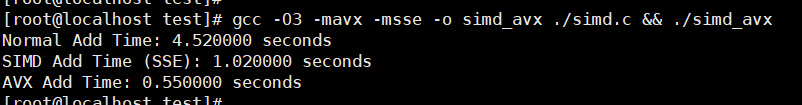

# SIMD-AVX性能对比

## 1、性能示例程序

用于累计a、b数组中数据，存储于c数组中: c[i] = a[i] + b[i];

```c
#include <stdio.h>
#include <immintrin.h>
#include <time.h>
#include <stdlib.h>

#define SIZE 100000000 /* 增加数组大小 */
#define REPEAT 100     /* 计算重复次数 */

/* 普通程序 */
void normal_add(float *a, float *b, float *c, int size) {
    for (int i = 0; i < size; i++) {
        c[i] = a[i] + b[i];
    }
}

/* 使用 SIMD 指令进行处理 (SSE) */
void simd_add(float *a, float *b, float *c, int size) {
    int i;
    for (i = 0; i <= size - 4; i += 4) {
        __m128 va = _mm_loadu_ps(&a[i]); /* 加载 a[i] 到 SSE 寄存器 */
        __m128 vb = _mm_loadu_ps(&b[i]); /* 加载 b[i] 到 SSE 寄存器 */
        __m128 vc = _mm_add_ps(va, vb);  /* 使用 SSE 执行加法 */
        _mm_storeu_ps(&c[i], vc);        /* 将结果存储到 c[i] */
    }
    /* 剩余元素处理 */
    for (; i < size; i++) {
        c[i] = a[i] + b[i];
    }
}

/* 使用 AVX 指令进行处理 */
void avx_add(float *a, float *b, float *c, int size) {
    int i;
    for (i = 0; i <= size - 8; i += 8) {
        __m256 va = _mm256_loadu_ps(&a[i]); /* 加载 a[i] 到 AVX 寄存器 */
        __m256 vb = _mm256_loadu_ps(&b[i]); /* 加载 b[i] 到 AVX 寄存器 */
        __m256 vc = _mm256_add_ps(va, vb);  /* 使用 AVX 执行加法 */
        _mm256_storeu_ps(&c[i], vc);        /* 将结果存储到 c[i] */
    }
    /* 剩余元素处理 */
    for (; i < size; i++) {
        c[i] = a[i] + b[i];
    }
}

int main() {
    /* 使用 malloc 动态分配内存，确保数据是 32 字节对齐 */
    float *a = (float*)aligned_alloc(32, SIZE * sizeof(float));
    float *b = (float*)aligned_alloc(32, SIZE * sizeof(float));
    /* 存储累计结果 */
    float *c = (float*)aligned_alloc(32, SIZE * sizeof(float));

    if (!a || !b || !c) {
        printf("Memory allocation failed\n");
        return -1;
    }

    for (int i = 0; i < SIZE; i++) {
        a[i] = i * 1.0f;
        b[i] = (SIZE - i) * 1.0f;
    }

    clock_t start, end;
    double cpu_time_used;

    /* 测试普通程序的性能 */
    start = clock();
    for (int i = 0; i < REPEAT; i++) {
        normal_add(a, b, c, SIZE);
    }
    end = clock();
    cpu_time_used = ((double)(end - start)) / CLOCKS_PER_SEC;
    printf("Normal Add Time: %f seconds\n", cpu_time_used);

    /* 测试 SIMD 程序的性能 */
    start = clock();
    for (int i = 0; i < REPEAT; i++) {
        simd_add(a, b, c, SIZE);
    }
    end = clock();
    cpu_time_used = ((double)(end - start)) / CLOCKS_PER_SEC;
    printf("SIMD Add Time (SSE): %f seconds\n", cpu_time_used);

    /* 测试 AVX 程序的性能 */
    start = clock();
    for (int i = 0; i < REPEAT; i++) {
        avx_add(a, b, c, SIZE);
    }
    end = clock();
    cpu_time_used = ((double)(end - start)) / CLOCKS_PER_SEC;
    printf("AVX Add Time: %f seconds\n", cpu_time_used);

    /* 释放内存 */
    free(a);
    free(b);
    free(c);

    return 0;
}
```

性能对比:



```less
# 编译命令：
	gcc -O3 -mavx -msse -o simd_avx ./simd.c && ./simd_avx

# 输出结果	
// #define SIZE 100000000 /* 增加数组大小 */
// #define REPEAT 100     /* 计算重复次数100次 */
Normal Add Time: 4.520000 seconds
SIMD Add Time (SSE): 1.020000 seconds
AVX Add Time: 0.550000 seconds

// #define SIZE 100000000 /* 增加数组大小 */
// #define REPEAT 10000     /* 计算重复次数1w次 */
Normal Add Time: 305.540000 seconds
SIMD Add Time (SSE): 76.200000 seconds
AVX Add Time: 40.560000 seconds

```

**总结：通过执行时间的比较，看出性能关系: AVX > SIMD > Normal**


## 2、不同数据长度/指令集的处理区别

当然，这里是一个关于不同数据类型在 SIMD 指令集中如何处理的表格，涵盖了 

​			`float`、`double`、`uint8_t`、`uint16_t`、`uint32_t` 和 `uint64_t`：

| 数据类型   | SSE 支持                   | AVX 支持 | 对应的寄存器类型                 | 每个寄存器能存储的元素数量 | 示例指令                                        |
| ---------- | -------------------------- | -------- | -------------------------------- | -------------------------- | ----------------------------------------------- |
| `float`    | 是                         | 是       | `__m128` (SSE), `__m256` (AVX)   | 4（SSE）, 8（AVX）         | `_mm_add_ps` (SSE),  `_mm256_add_ps` (AVX)      |
| `double`   | 是                         | 是       | `__m128d` (SSE), `__m256d` (AVX) | 2（SSE）, 4（AVX）         | `_mm_add_pd` (SSE),  `_mm256_add_pd` (AVX)      |
| `uint8_t`  | 部分支持（通过 `__m128i`） | 是       | `__m128i` (SSE), `__m256i` (AVX) | 16（SSE）, 32（AVX）       | `_mm_add_epi8` (SSE), `_mm256_add_epi8` (AVX)   |
| `uint16_t` | 是                         | 是       | `__m128i` (SSE), `__m256i` (AVX) | 8（SSE）, 16（AVX）        | `_mm_add_epi16` (SSE), `_mm256_add_epi16` (AVX) |
| `uint32_t` | 是                         | 是       | `__m128i` (SSE), `__m256i` (AVX) | 4（SSE）, 8（AVX）         | `_mm_add_epi32` (SSE), `_mm256_add_epi32` (AVX) |
| `uint64_t` | 是                         | 是       | `__m128i` (SSE), `__m256i` (AVX) | 2（SSE）, 4（AVX）         | `_mm_add_epi64` (SSE), `_mm256_add_epi64` (AVX) |

**说明**

- **SSE（Streaming SIMD Extensions）**：SSE 提供了对 128 位寄存器的支持，可以同时处理多个数据元素。SSE 指令集包含对 `float` 和 `double` 的直接支持，并通过 `__m128i` 类型支持整数类型（`uint8_t`、`uint16_t`、`uint32_t` 和 `uint64_t`）。
- **AVX（Advanced Vector Extensions）**：AVX 提供了对 256 位寄存器的支持，能够处理更多的数据元素。AVX 扩展了 SSE 支持的所有数据类型，包括 `float`、`double` 和整数类型。使用 `__m256` 和 `__m256d` 处理 `float` 和 `double`，以及使用 `__m256i` 处理整数类型。
- **寄存器类型**：
    - `__m128` 和 `__m128d`：SSE 使用的 128 位寄存器，分别用于 `float` 和 `double` 数据类型。
    - `__m256` 和 `__m256d`：AVX 使用的 256 位寄存器，分别用于 `float` 和 `double` 数据类型。
    - `__m128i` 和 `__m256i`：SSE 和 AVX 支持的 128 位和 256 位整数寄存器，分别处理整数数据类型。
- **示例指令**：展示了不同数据类型的加法操作。SSE 和 AVX 指令集分别提供了不同的加法指令来处理各自的寄存器和数据类型。


## 3、cpu的指令集的支持

以下是包含不同 CPU 指令集、编译选项、`lscpu` 标志以及特征作用的表格：

| **指令集**      | **编译选项**   | **lscpu 标志** | **特征作用**                                          |
| --------------- | -------------- | -------------- | ----------------------------------------------------- |
| **SSE**         | `-msse`        | `sse`          | 提供对 128 位 SIMD 浮点运算的支持                     |
| **SSE2**        | `-msse2`       | `sse2`         | 增加对 128 位 SIMD 整数运算和更高精度的浮点运算支持   |
| **SSE3**        | `-msse3`       | `sse3`         | 提供额外的 128 位 SIMD 浮点运算和线程同步指令         |
| **SSSE3**       | `-mssse3`      | `ssse3`        | 扩展 SSE3，支持更多的 128 位 SIMD 整数运算指令        |
| **SSE4.1**      | `-msse4.1`     | `sse4_1`       | 增加对 128 位 SIMD 浮点和整数运算的额外支持           |
| **SSE4.2**      | `-msse4.2`     | `sse4_2`       | 提供更多的 128 位 SIMD 指令，主要用于加密和字符串处理 |
| **AVX**         | `-mavx`        | `avx`          | 提供对 256 位 SIMD 浮点运算的支持                     |
| **AVX2**        | `-mavx2`       | `avx2`         | 扩展 AVX，提供对 256 位 SIMD 整数运算的支持           |
| **AVX-512**     | `-mavx512f`    | `avx512f`      | 提供对 512 位 SIMD 浮点运算的支持                     |
| **AVX-512DQ**   | `-mavx512dq`   | `avx512dq`     | 增加对 512 位 SIMD 双精度浮点运算的支持               |
| **AVX-512IFMA** | `-mavx512ifma` | `avx512ifma`   | 提供对 512 位 SIMD 整数乘法加法的支持                 |
| **AVX-512PF**   | `-mavx512pf`   | `avx512pf`     | 支持 512 位 SIMD 的预取指令                           |
| **AVX-512ER**   | `-mavx512er`   | `avx512er`     | 提供对 512 位 SIMD 额外精度浮点运算的支持             |
| **AVX-512CD**   | `-mavx512cd`   | `avx512cd`     | 支持 512 位 SIMD 的冲突检测和压缩指令                 |
| **AVX-512BW**   | `-mavx512bw`   | `avx512bw`     | 提供对 512 位 SIMD 的字节和字支持                     |
| **AVX-512VL**   | `-mavx512vl`   | `avx512vl`     | 支持 AVX-512 的 128 位和 256 位宽度                   |

```less
SIMD/SSE：通常是 128位
AVX（Advanced Vector Extensions）：通常是 256 位。
AVX2：也是 256 位，增强了 AVX。
AVX-512：支持 512 位的 SIMD 指令集。
```

