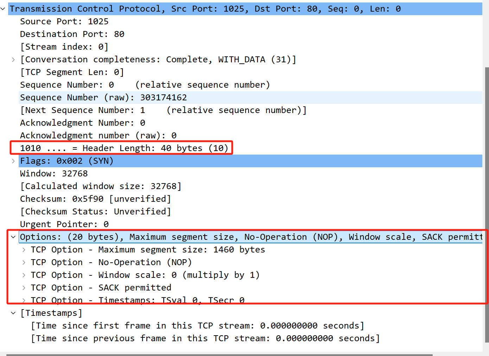

# TCP的选项

TCP 选项用于增强 TCP 协议的功能或提供额外的信息。根据 RFC 793 和其他相关 RFC 文件，TCP 选项的种类很多，下面是一些主要的 TCP 选项分类和它们的功能：

## 一、TCP 选项分类和主要选项

| 选项名                                     | 描述                                                         | RFC/文档 |
| ------------------------------------------ | ------------------------------------------------------------ | -------- |
| **Maximum Segment Size (MSS)**             | 指定最大报文段长度，用于控制 TCP 连接中的最大数据段大小。    | RFC 793  |
| **Window Scale**                           | 用于扩大窗口大小范围，以支持更大的窗口大小。                 | RFC 1323 |
| **Selective Acknowledgment (SACK)**        | 允许接收方告知发送方哪些数据已经成功接收，哪些还未接收，从而提高网络效率。 | RFC 2018 |
| **Timestamp**                              | 用于测量往返时间（RTT）和提高数据包顺序控制的准确性。        | RFC 1323 |
| **No-Operation (NOP)**                     | 占位符选项，用于对齐选项或填充数据包。                       | RFC 793  |
| **Padding**                                | 填充数据包，以确保选项字段的正确对齐。                       | RFC 793  |
| **ECN (Explicit Congestion Notification)** | 用于指示网络拥塞状态，从而减少丢包率和提高传输效率。         | RFC 3168 |
| **MD5 Signature**                          | 用于验证数据包的完整性。需要共享密钥，防止数据包被篡改。     | RFC 2385 |
| **TCP Authentication Option (TCP AO)**     | 提供类似于 MD5 的认证功能，但使用更灵活的算法和选项。        | RFC 5925 |

### 主要 TCP 选项的详细说明

1. **Maximum Segment Size (MSS)**:
    - **作用**: 指定发送方可以接受的最大数据段长度（不包括 TCP 头部），以帮助防止数据包分片。
    - **格式**: `[Option Kind] [Option Length] [MSS Value]`
    - **值范围**: 0-65535 字节（通常是 1460 字节）。
2. **Window Scale**:
    - **作用**: 通过扩展窗口大小的位数来支持大于 65,535 字节的窗口。
    - **格式**: `[Option Kind] [Option Length] [Shift Count]`
    - **值范围**: Shift Count 为 0-14，表示窗口大小的扩展倍数。
3. **Selective Acknowledgment (SACK)**:
    - **作用**: 允许接收方告知发送方哪些数据包已经成功接收，这样发送方可以重新发送缺失的数据包。
    - **格式**: `[Option Kind] [Option Length] [SACK Blocks]`
    - **SACK Block**: 包含接收到的数据包的起始和结束序列号。
4. **Timestamp**:
    - **作用**: 通过在数据包中包含时间戳，提供更精确的 RTT 测量，并帮助避免旧数据包的影响。
    - **格式**: `[Option Kind] [Option Length] [TSval] [TSecr]`
    - **TSval**: 发送方的时间戳，**TSecr**: 接收方的时间戳回显。
5. **No-Operation (NOP)**:
    - **作用**: 用作填充或对齐选项字段。
    - **格式**: `[Option Kind]`
    - **值**: 0x01。
6. **Padding**:
    - **作用**: 用于对齐 TCP 选项字段，以确保 TCP 选项字段的长度为 4 字节的倍数。
    - **格式**: `[Option Kind] [Option Length] [Padding]`
    - **值**: 通常为 0x00。
7. **ECN (Explicit Congestion Notification)**:
    - **作用**: 允许网络设备在发生拥塞时通知发送方和接收方，而不丢弃数据包。
    - **格式**: 与 TCP 数据包头部的标志位相关。
8. **MD5 Signature**:
    - **作用**: 通过在 TCP 数据包中添加 MD5 签名来验证数据包的完整性。
    - **格式**: `[Option Kind] [Option Length] [MD5 Hash]`
    - **值**: 需要共享密钥。
9. **TCP Authentication Option (TCP AO)**:
    - **作用**: 提供 TCP 数据包的认证功能，使用可配置的算法。
    - **格式**: `[Option Kind] [Option Length] [Authentication Data]`
    - **值**: 包含认证数据和算法。

以上这些选项用于增强 TCP 协议的功能、提高数据传输的可靠性和安全性。不同的 TCP 选项具有不同的格式和功能，具体的使用和支持情况可能因操作系统和网络设备而异。

示例：

