# linux工具perf手册

## 一、perf.data分析

命令示例：

```less
perf record -e cycles,instructions,cache-references,cache-misses,bus-cycles ./build/examples/dpdk-l2fwd -l 0-3 -n 4 -m 2048 --legacy-mem --huge-unlink  --no-telemetry -- -p 0x3
```

**常用的性能统计信息如下：**

**cycles (182K cycles)**:

- **含义**: 这是指处理器的时钟周期数。它衡量的是程序执行时在 CPU 上消耗的总时钟周期数。
- **作用**: 这个指标可以帮助你了解程序执行的时间长短。时钟周期越多，说明程序执行的时间越长。

**instructions (181K instructions)**:

- **含义**: 这是指程序执行的机器指令数。
- **作用**: 该指标显示了程序运行时实际执行了多少指令。结合周期数，可以用来计算每个指令的平均周期数 (CPI)，这有助于评估程序的效率。

**cache-references (80K cache-references)**:

- **含义**: 这是指程序对 CPU 缓存（通常是 L1、L2 或 L3 缓存）的访问次数。
- **作用**: 这个指标可以用来衡量程序对缓存的依赖程度。较高的缓存引用数可能表明程序性能较好，因为数据能够有效地从缓存中获取。

**cache-misses (70K cache-misses)**:

- **含义**: 这是指程序从缓存中查找数据失败的次数（即缓存未命中），导致必须从内存中获取数据。
- **作用**: 缓存未命中会导致性能下降，因为从内存中获取数据比从缓存中获取要慢得多。较高的缓存未命中数通常是性能瓶颈的信号。

**bus-cycles (183K bus-cycles)**:

- **含义**: 这是指 CPU 与其他设备（如内存、I/O 设备等）通信时所消耗的总总线周期数。
- **作用**: 该指标显示了 CPU 在等待外部设备的时间。如果这个值较高，可能表明程序在与内存或其他设备的交互过程中存在瓶颈。

除了上面常用的几个：


### 1.1 可统计的事件种类

`perf record` 是 Linux `perf` 工具的一部分，它主要用于统计和记录各种硬件和软件性能事件。根据内核和硬件支持的不同，`perf` 可以记录的事件种类也有所不同。以下是常见的统计事件类别，梳理为表格，包括硬件事件、软件事件、硬件缓存事件等。

**`perf record` 可统计事件种类表**

| **类别**           | **事件名称**              | **描述**                                                    |
| ------------------ | ------------------------- | ----------------------------------------------------------- |
| **硬件事件**       | `cpu-cycles`              | CPU 周期数。                                                |
|                    | `instructions`            | 已执行的指令数。                                            |
|                    | `cache-references`        | 缓存访问次数（引用次数）。                                  |
|                    | `cache-misses`            | 缓存未命中次数。                                            |
|                    | `branch-instructions`     | 分支指令数。                                                |
|                    | `branch-misses`           | 分支预测失败次数。                                          |
|                    | `bus-cycles`              | 总线周期数。                                                |
|                    | `stalled-cycles-frontend` | 前端卡住的 CPU 周期数。                                     |
|                    | `stalled-cycles-backend`  | 后端卡住的 CPU 周期数。                                     |
|                    | `ref-cycles`              | 引用周期数，通常与实际 CPU 频率无关，用于统计更准确的时间。 |
| **软件事件**       | `cpu-clock`               | 以 CPU 时钟为单位的任务运行时间。                           |
|                    | `task-clock`              | 以任务时钟为单位的任务运行时间。                            |
|                    | `page-faults`             | 页面错误次数。                                              |
|                    | `context-switches`        | 上下文切换次数。                                            |
|                    | `cpu-migrations`          | CPU 迁移次数（任务从一个 CPU 迁移到另一个 CPU）。           |
|                    | `minor-faults`            | 次要页面错误，指页表中找到页面但未映射。                    |
|                    | `major-faults`            | 重大页面错误，指缺页导致从磁盘读取页面。                    |
|                    | `alignment-faults`        | 对齐错误次数。                                              |
|                    | `emulation-faults`        | 仿真错误次数。                                              |
| **硬件缓存事件**   | `L1-dcache-loads`         | L1 数据缓存加载次数。                                       |
|                    | `L1-dcache-load-misses`   | L1 数据缓存加载未命中次数。                                 |
|                    | `L1-dcache-stores`        | L1 数据缓存存储次数。                                       |
|                    | `L1-dcache-store-misses`  | L1 数据缓存存储未命中次数。                                 |
|                    | `L1-icache-loads`         | L1 指令缓存加载次数。                                       |
|                    | `L1-icache-load-misses`   | L1 指令缓存加载未命中次数。                                 |
|                    | `LLC-loads`               | 最后一级缓存加载次数（通常是 L3 缓存）。                    |
|                    | `LLC-load-misses`         | 最后一级缓存加载未命中次数。                                |
|                    | `LLC-stores`              | 最后一级缓存存储次数。                                      |
|                    | `LLC-store-misses`        | 最后一级缓存存储未命中次数。                                |
|                    | `dTLB-loads`              | 数据 TLB（Translation Lookaside Buffer）加载次数。          |
|                    | `dTLB-load-misses`        | 数据 TLB 加载未命中次数。                                   |
|                    | `iTLB-loads`              | 指令 TLB 加载次数。                                         |
|                    | `iTLB-load-misses`        | 指令 TLB 加载未命中次数。                                   |
|                    | `branch-loads`            | 分支预测加载次数。                                          |
|                    | `branch-load-misses`      | 分支预测加载未命中次数。                                    |
| **其他事件**       | `migrations`              | 任务在不同 CPU 核之间迁移的次数。                           |
|                    | `cgroup-switches`         | 任务在 cgroup 之间切换的次数。                              |
|                    | `dummy`                   | 不执行任何统计，只用于测试。                                |
| **用户自定义事件** | `rNNN`                    | 使用 `raw` 模式监控自定义硬件事件，`NNN` 是硬件事件的编号。 |
| **内核调度事件**   | `sched:sched_switch`      | 任务切换的调度事件。                                        |
|                    | `sched:sched_wakeup`      | 任务唤醒的调度事件。                                        |
|                    | `sched:sched_stat_wait`   | 任务进入等待状态的调度事件。                                |
|                    | `sched:sched_stat_sleep`  | 任务进入睡眠状态的调度事件。                                |

### 1.2 如何使用 `perf list` 查看详细事件列表

使用 `perf list` 可以查看系统当前支持的所有事件，具体命令如下：

```less
perf list
```

输出的结果会显示当前系统上支持的硬件、软件、缓存、以及内核事件等详细信息


## 二、perf-report的查看

使用perf report查看我们所配置的相关性能统计信息：

```pascal
perf report ./perf.data  // perf report也可以，默认即是当前路径perf.data
```

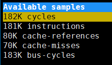

### 2.1 统计信息的具体函数

以cache-misses选项（运行测试 l2fwd 程序）为例，当我们点进去具体的统计信息时：

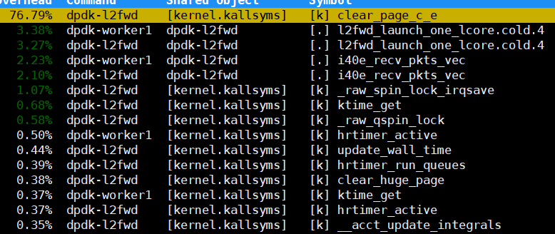

在 `perf` 工具中，当你选择查看 `cache-misses` 事件时，输出列的信息有助于分析程序在执行期间的缓存未命中情况。下面是你提到的输出列及其含义：

1. **`Samples`**：
    - 显示的样本数量，例如 `232K` 表示有 232,000 个样本被记录用于统计 `cache-misses` 事件。
2. **`Event count (approx.)`**：
    - 事件的总计数近似值，例如 `28637716` 表示在记录的样本中，发生了约 28,637,716 次缓存未命中事件。
3. **`Overhead`**：
    - 这一列显示了每个符号（函数或代码位置）占所有缓存未命中事件的百分比。例如，`76.79%` 表示 `clear_page_c_e` 函数的缓存未命中事件占总未命中事件的 76.79%。
4. **`Command`**：
    - 表示产生这些事件的进程或线程的名称。例如，`dpdk-l2fwd` 和 `dpdk-worker1` 是进程的名称。
5. **`Shared Object`**：
    - 表示符号所在的共享对象或库。对于内核符号，这里通常是 `[kernel.kallsyms]`，表示内核符号表；对于用户空间符号，它会是共享库或可执行文件名。
6. **`Symbol`**：
    - 表示代码符号的名称，即具体的函数或代码位置。例如，`clear_page_c_e`、`l2fwd_launch_one_lcore.cold.4` 和 `i40e_recv_pkts_vec` 是具体的函数名称。

**示例解释**

- **`76.79% dpdk-l2fwd [kernel.kallsyms] [k] clear_page_c_e`**：
    - **Overhead**: 76.79% 的缓存未命中事件发生在 `clear_page_c_e` 函数中。
    - **Command**: 这些事件发生在 `dpdk-l2fwd` 进程中。
    - **Shared Object**: `clear_page_c_e` 是一个内核函数，位于内核符号表 `[kernel.kallsyms]` 中。
- **`3.38% dpdk-worker1 dpdk-l2fwd [.] l2fwd_launch_one_lcore.cold.4`**：
    - **Overhead**: 3.38% 的缓存未命中事件发生在 `l2fwd_launch_one_lcore.cold.4` 函数中。
    - **Command**: 这些事件发生在 `dpdk-worker1` 进程中。
    - **Shared Object**: `l2fwd_launch_one_lcore.cold.4` 是 `dpdk-l2fwd` 可执行文件中的函数。
- **`1.07% dpdk-l2fwd [kernel.kallsyms] [k] _raw_spin_lock_irqsave`**：
    - **Overhead**: 1.07% 的缓存未命中事件发生在内核的 `_raw_spin_lock_irqsave` 函数中。
    - **Command**: 这些事件发生在 `dpdk-l2fwd` 进程中。
    - **Shared Object**: `_raw_spin_lock_irqsave` 是一个内核函数，位于内核符号表 `[kernel.kallsyms]` 中。

这些信息帮助你理解哪些函数或代码区域是性能瓶颈，从而可以针对性地进行优化。


### 2.2 函数下的统计选项

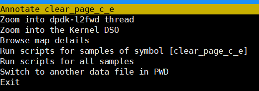

选择我们具体需要查看的函数时，会出现以下的相关选项：

| 选项                                               | 翻译                                   | 作用                                                         |
| -------------------------------------------------- | -------------------------------------- | ------------------------------------------------------------ |
| Annotate clear_page_c_e                            | 注解 `clear_page_c_e`                  | 显示 `clear_page_c_e` 函数的源代码注解信息，分析该函数的性能数据。 |
| Zoom into dpdk-l2fwd thread                        | 聚焦到 `dpdk-l2fwd` 线程               | 聚焦到 `dpdk-l2fwd` 线程，查看该线程的性能数据，以分析其性能表现。 |
| Zoom into the Kernel DSO                           | 聚焦到 `Kernel ` 动态库                | 聚焦到 `Kernel ` 的动态共享对象（DSO），查看与 `Kernel ` 相关的动态库的性能数据。 |
| Browse map details                                 | 浏览映射详细信息                       | 查看性能数据映射的详细信息，例如函数、模块或对象的内存映射。 |
| Run scripts for samples of symbol [clear_page_c_e] | 对 `clear_page_c_e` 符号的样本运行脚本 | 对与 `clear_page_c_e` 符号相关的数据样本应用脚本，以分析该符号的性能数据。 |
| Run scripts for all samples                        | 对所有样本运行脚本                     | 对所有性能数据样本应用脚本，进行整体分析，而不仅限于特定符号的样本。 |
| Switch to another data file in PWD                 | 切换到当前工作目录中的其他数据文件     | 切换到当前工作目录中的其他性能数据文件，以分析不同的数据集。 |
| Exit                                               | 退出                                   | 退出当前的性能分析界面或工具。                               |


### 2.2 Annotate clear_page_c_e

接下来我们会看到函数具体的汇编指令使用，接下来我们举两个例子：

```apl
	第一列显示的是每条指令对缓存未命中的总体百分比贡献。它表明了该指令在缓存未命中(cache-miss)事件中的占比。例如，6.13% 表示该指令引发了总缓存未命中的 6.13% 的事件。# 具体是什么占比，看你选择的统计选项是什么
	另一列则是具体的执行指令。
```

clear_page_c_e 函数具体如下：

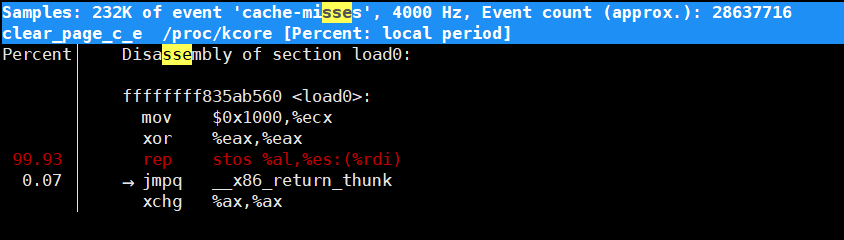

l2fwd_launch_one_lcore.cold.4 函数具体如下：

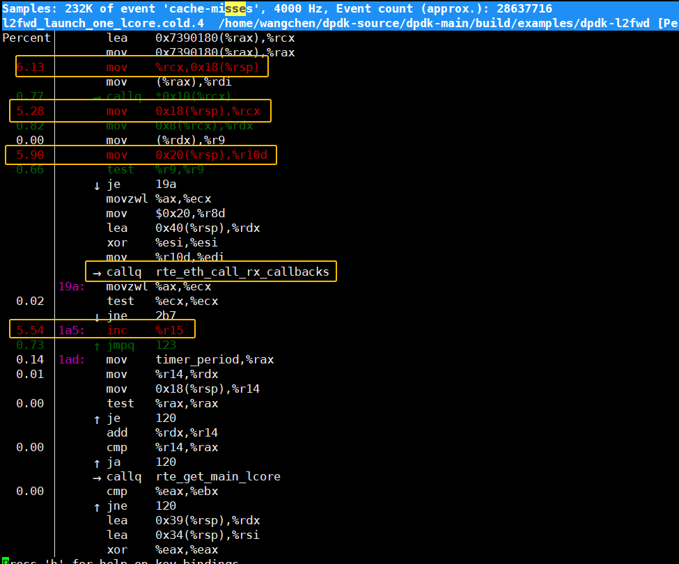

可以看到，不同函数的指令执行效果不同，并且其中的箭头代表意义也不一样:

```apl
→：表示函数调用。
↑：表示向上跳转，通常是循环的返回点。
↓：表示向下跳转，通常是条件跳转，跳过某些指令
```

下面是一些常见汇编指令的梳理表格：


#### 2.2.1 汇编指令的优化策略

| 指令    | 含义                                                    | 性能问题                                                     | 优化建议                                                     | 相关 C 函数                            |
| ------- | ------------------------------------------------------- | ------------------------------------------------------------ | ------------------------------------------------------------ | -------------------------------------- |
| `mov`   | 将数据从一个位置移动到另一个位置                        | 频繁的内存访问可能导致缓存不命中（cache miss），影响性能     | - 优化数据布局，减少内存访问 - 使用缓存优化技术（如数据预取） | `memcpy`、`memmove`、`memset`          |
| `lea`   | 计算内存地址并将结果存储到寄存器中                      | 大量的地址计算可能导致寄存器和内存访问的竞争                 | - 减少不必要的地址计算 - 使用寄存器优化技术                  | `array indexing`、`pointer arithmetic` |
| `rep`   | 用于重复执行某个操作，后缀指令会根据 `ECX` 的值重复执行 | 大规模的数据重复操作可能导致缓存压力和内存带宽瓶颈           | - 减少重复操作，优化数据处理算法 - 优化内存带宽，改善数据访问模式 | `memset`、`memcpy`                     |
| `jmp`   | 无条件跳转到指定的地址，可能是相对或绝对跳转            | 跳转指令可能导致指令流水线冲刷和性能损失，影响指令缓存的有效性 | - 减少频繁跳转，优化代码路径 - 使用分支预测功能，提高预测准确性 | `switch-case`、`goto`                  |
| `jmpq`  | 无条件跳转到指定的地址（64位模式）                      | 跳转指令可能影响指令缓存的有效性，增加跳转延迟               | - 减少跳转次数 - 优化控制流和分支预测                        | `switch-case`、`goto`                  |
| `callq` | 调用子程序并将返回地址压入堆栈                          | 调用和返回可能会影响指令流水线和堆栈性能                     | - 减少函数调用深度 - 使用内联函数优化                        | `function calls`                       |
| `test`  | 进行按位与操作并设置标志寄存器                          | 影响条件跳转的性能，可能导致分支预测不准确                   | - 优化条件判断逻辑 - 使用有效的分支预测技术                  | `if` 语句、`while` 循环、`for` 循环    |

**说明**

- **`mov` 指令**:
    - **相关 C 函数**: `memcpy`（复制内存块）、`memmove`（移动内存块）、`memset`（设置内存块）。这些函数经常进行内存复制或设置操作，涉及大量的 `mov` 指令。
- **`lea` 指令**:
    - **相关 C 函数**: `array indexing`（数组索引）、`pointer arithmetic`（指针运算）。数组索引和指针运算经常涉及地址计算，通常使用 `lea` 指令。
- **`rep` 指令**:
    - **相关 C 函数**: `memset`（设置内存块）、`memcpy`（复制内存块）。这些函数可能使用 `rep` 指令来进行高效的数据处理。
- **`jmp` 和 `jmpq` 指令**:
    - **相关 C 函数**: `switch-case`、`goto`。这些控制流结构可能涉及到大量的跳转指令。
- **`callq` 指令**:
    - **相关 C 函数**: `function calls`（函数调用）。每当程序进行函数调用时，都会使用 `callq` 指令来将返回地址压入堆栈。
- **`test` 指令**:
    - **相关 C 函数**: `if` 语句、`while` 循环、`for` 循环。这些条件判断和循环结构可能会使用 `test` 指令来设置标志寄存器。


**优化步骤**

1. **识别瓶颈**: 使用 `perf` 等工具识别主要的性能瓶颈，关注那些高开销的指令。
2. **代码优化**: 针对高开销的指令进行优化，减少函数调用次数，优化回调函数，减少数据移动和测试指令。
3. **数据结构优化**: 改善数据结构布局，增加缓存友好性，减少缓存未命中。
4. **多线程和并行化**: 如果适用，将计算任务并行化以利用多核处理器，减少单个线程的负载。
5. **使用编译器优化选项**: 利用编译器的优化选项，如 `-O2` 或 `-O3`，以提升生成代码的性能。


### 2.3 Zoom into dpdk-l2fwd thread

该模式其实就是聚焦到对应的线程函数中，以线程为主体，用以显示该线程函数中各个函数的“cache-miss”所占百分比。

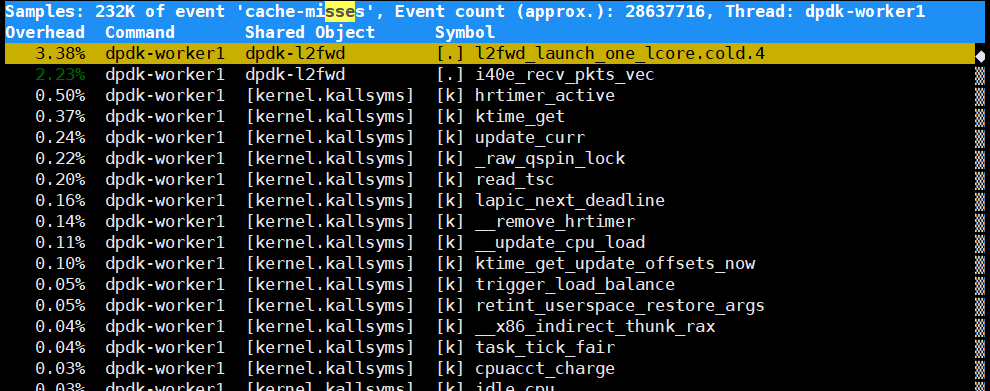

### 2.x 两者Zoom区别

**`Zoom into dpdk-l2fwd DSO` 和 `Zoom into dpdk-l2fwd thread`** 是在 `perf` 工具中进行性能分析时的两个不同的聚焦选项。它们的区别主要体现在分析的粒度和对象上：

1. **Zoom into dpdk-l2fwd DSO**

- **DSO (Dynamic Shared Object)** 指的是动态链接库或可执行文件。
- 当选择 **Zoom into dpdk-l2fwd DSO** 时，`perf` 将聚焦到整个 `dpdk-l2fwd` 可执行文件，分析其所有函数在整个应用中的性能表现。
- 你会看到与 `dpdk-l2fwd` 相关的各个函数的调用情况、开销、缓存未命中率等信息，无论它们是在哪个线程中执行的。
- 适用于想要了解应用程序中某个模块（如 `dpdk-l2fwd`）在所有线程中的整体性能表现，分析和优化整个 DSO 级别的代码。

2. **Zoom into dpdk-l2fwd thread**

- 这里的 **thread** 指的是特定的线程，通常是应用程序中执行的一个工作线程。
- 当选择 **Zoom into dpdk-l2fwd thread** 时，`perf` 只会聚焦于某个特定的线程（例如 `dpdk-worker1`）。你可以看到该线程中的具体函数执行情况，分析其性能瓶颈。
- 这适合当你想要针对某个线程进行优化，了解该线程在多线程环境中的表现如何，尤其在多核系统上并行处理任务时可能会发现某个线程的负载更重或效率更低。

**区别总结**

- **Zoom into dpdk-l2fwd DSO**: 侧重于整个 `dpdk-l2fwd` 模块或程序的所有代码部分，适合整体分析和优化。
- **Zoom into dpdk-l2fwd thread**: 侧重于 `dpdk-l2fwd` 中的某个特定线程，适合单线程或多线程环境中逐步优化。

两者互为补充，前者用于广泛分析，后者用于深入某一线程的细致优化。


### 2.4 Zoom into dpdk-l2fwd DSO

在选择“Zoom into dpdk-l2fwd DSO”后，聚焦到 ` dpdk-l2fwd ` 所使用的动态库。

**统计信息解释**

| Overhead | Command      | Symbol                              | 作用                                                         |
| -------- | ------------ | ----------------------------------- | ------------------------------------------------------------ |
| 3.38%    | dpdk-worker1 | l2fwd_launch_one_lcore.cold.4       | **高开销函数**：`l2fwd_launch_one_lcore.cold.4` 函数占用了 3.38% 的缓存未命中事件。这说明该函数在处理过程中可能存在性能瓶颈，尤其是缓存未命中的问题。需要进一步分析该函数中的具体代码，找出潜在的性能问题并优化。 |
| 2.23%    | dpdk-worker1 | i40e_recv_pkts_vec                  | **次高开销函数**：`i40e_recv_pkts_vec` 函数占用了 2.23% 的缓存未命中事件。该函数可能涉及数据包接收和处理，优化它可能会显著提升整体性能。 |
| 0.00%    | dpdk-worker1 | rte_eth_tx_buffer_flush.constprop.2 | **缓存未命中较低**：`rte_eth_tx_buffer_flush.constprop.2` 函数占用的缓存未命中事件非常低，通常这表示该函数对性能的影响不大。 |
| 0.00%    | dpdk-worker1 | rte_get_main_lcore                  | **缓存未命中较低**：`rte_get_main_lcore` 函数也占用的缓存未命中事件很少，这表示其对性能的影响也不显著。 |
| 0.00%    | dpdk-worker1 | eal_cpu_socket_id                   | **缓存未命中较低**：`eal_cpu_socket_id` 函数的缓存未命中事件几乎可以忽略，这表明该函数对性能的影响不大。 |
| 0.00%    | dpdk-worker1 | rte_eal_get_configuration           | **缓存未命中较低**：`rte_eal_get_configuration` 函数对缓存未命中的影响也很小，通常不需要特别关注。 |

**优化建议**

1. **重点优化高开销函数**:

    - l2fwd_launch_one_lcore.cold.4  和  i40e_recv_pkts_vec

         函数占用的缓存未命中事件较高。重点优化这两个函数的代码：

        - **缓存友好性**: 确保数据结构布局是缓存友好的，尽量减少缓存未命中的可能性。
        - **减少数据移动**: 减少不必要的数据移动操作，尽量使数据访问更加连续和局部。
        - **优化循环和条件判断**: 优化循环和条件判断，减少分支预测失败的可能性。

2. **检查并优化低开销函数**:

    - 虽然 

        rte_eth_tx_buffer_flush.constprop.2、rte_get_main_lcore、eal_cpu_socket_id 和 rte_eal_get_configuration

         函数的缓存未命中事件较少，但如果这些函数在性能关键路径中，仍然可以考虑进一步优化。

        - **Profiling**: 进一步使用 `perf` 工具分析这些函数，确保它们在性能关键路径上的开销确实不高。

3. **使用分析工具**:

    - **`perf`**: 继续使用 `perf` 工具进行详细的性能分析，找出可能的性能瓶颈。
    - **其他工具**: 考虑使用其他性能分析工具（如 Intel VTune、Valgrind）来补充分析。

通过这些步骤，可以深入了解 DPDK 应用程序 l2fwd 中可能存在的性能瓶颈，进行针对性的优化，从而提高整体系统的性能。


### 2.5 Run scripts 

Run scripts 其实就是展示在本次的perf采样过程中使用了那些脚本，你可以选择其中的部分或者全部脚本，再运行一次

#### 2.5.1 脚本类别

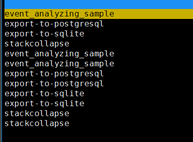

以下是各个选项(存在重复)及其作用的表格：

| **选项**                   | **作用**                                                     |
| -------------------------- | ------------------------------------------------------------ |
| **event_analyzing_sample** | 用于分析采样事件，对特定事件或函数进行详细分析。             |
| **export-to-postgresql**   | 将采样数据导出到 PostgreSQL 数据库，以便进行进一步的查询和分析。 |
| **export-to-sqlite**       | 将采样数据导出到 SQLite 数据库，适合本地存储和分析，尤其是在资源受限的环境中。 |
| **stackcollapse**          | 将采样数据中的调用栈压缩为堆栈折叠格式（stack collapse format），以便生成火焰图（Flame Graph）用于性能瓶颈分析。 |


#### 2.5.2 测试 event_analyzing_sample

针对特定事件或函数进行详细分析

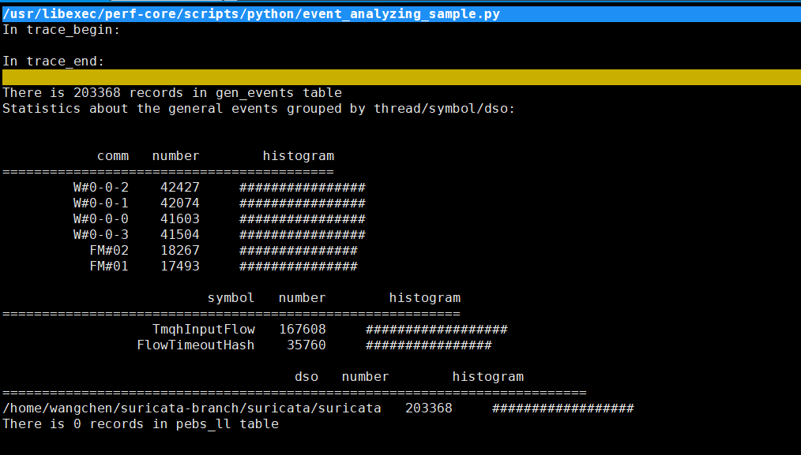

这个输出是使用 `perf` 工具执行的 `Run scripts` 结果，提供了有关程序执行过程中不同线程、符号（函数或方法）和动态共享对象（DSO）的统计信息。以下是对各个部分的分析：

1. **Trace Begin and Trace End**

- **In trace_begin** 和 **In trace_end** 标识了跟踪的开始和结束，通常用于记录程序执行的某个时间段的数据。

2. **Records in `gen_events` Table**

- **203368 records in gen_events table**：表示在 `gen_events` 表中记录了 203368 条事件。这些事件捕获了在跟踪期间不同的线程、符号和 DSO 的执行情况。

3. **Statistics Grouped by Thread/Symbol/DSO**

- 统计信息按照线程 (`comm`)、符号 (`symbol`)、和 DSO (`dso`) 进行了分组，并以直方图的形式显示了各自的执行次数。

**Threads (`comm`)**

- 列出了不同线程的名称和对应的执行次数。
- `W#0-0-2`, `W#0-0-1`, `W#0-0-0`, `W#0-0-3` 是不同的线程，每个线程的执行次数在 41603 到 42427 之间。
- `FM#02` 和 `FM#01` 线程的执行次数较低，分别是 18267 和 17493。
- 直方图（`################`）表示这些线程执行次数的相对比例。

**Symbols (`symbol`)**

- 列出了不同符号（函数或方法）的名称和对应的执行次数。
- `TmqhInputFlow` 是最常执行的符号，执行次数为 167608。
- `FlowTimeoutHash` 执行次数为 35760，执行次数较少，但仍然占据了一定的比例。

**DSOs (`dso`)**

- 列出了不同 DSO 的名称和对应的执行次数。
- `/home/wangchen/suricata-branch/suricata/suricata` 是唯一的 DSO，执行次数为 203368，与 `gen_events` 表中的记录数一致。

**分析总结**

- **线程分析**：不同线程的执行次数显示了它们的工作量分布。`W#0-0-2`, `W#0-0-1`, `W#0-0-0`, `W#0-0-3` 是主要的工作线程，执行次数最多，而 `FM#02` 和 `FM#01` 的工作量相对较少。
- **符号分析**：`TmqhInputFlow` 是最频繁调用的函数，可能是关键路径中的核心逻辑。`FlowTimeoutHash` 也相对重要，但调用频率较低。
- **DSO分析**：所有的执行都集中在一个 DSO 上，即 Suricata 的主二进制，这表明整个性能分析聚焦于这一个文件。

**下一步建议**

- 如果 `FlowTimeoutHash` 或 `TmqhInputFlow` 显示出较高的执行开销，可以进一步分析这些函数，以确定是否存在性能优化的空间。
- 对于线程，考虑是否可以通过调度或任务分配的调整来优化不同线程的工作量分布


#### 2.5.3 测试 stackcollapse 

将采样数据中的调用栈压缩为堆栈折叠格式（stack collapse format），以便生成火焰图（Flame Graph）用于性能瓶颈分析。计数显示了各个执行线程/函数的采样次数。

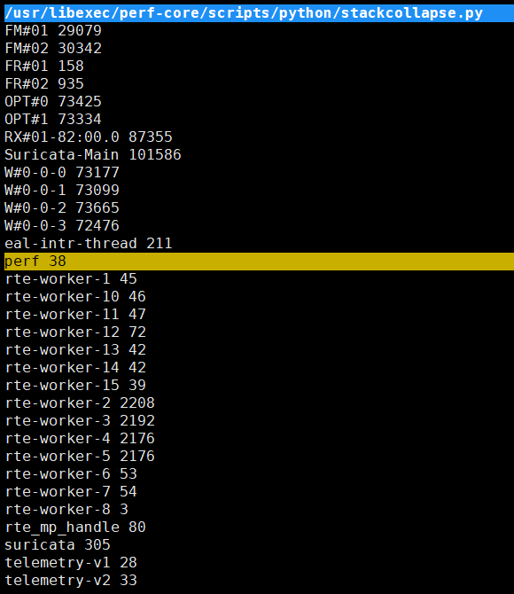


### 2.6 火焰图的使用

1、在使用 `perf record` 时，你必须启用 `-g` 选项来记录调用栈信息。如果没有启用此选项，就无法在后续步骤中生成调用栈数据。

2、记录系统级调用栈时可能需要特权权限。如果没有适当的权限，`perf` 可能无法正确捕捉到调用栈

#### 1. 安装生成火焰图

1. **安装 FlameGraph 工具**

首先需要下载 `FlameGraph` 工具，它由 Brendan Gregg 开发，托管在 GitHub 上：

```bash
git clone https://github.com/brendangregg/FlameGraph.git
cd FlameGraph
```

`FlameGraph` 的工具包里包含了生成火焰图的关键脚本，如 `stackcollapse-perf.pl` 和 `flamegraph.pl`。

**2. 使用 `perf` 采样数据**

首先，使用 `perf record` 采集程序运行的性能数据：

```bash
perf record -F 99 -a -g  -e cycles,instructions,cache-references,cache-misses,bus-cycles -- ./build/examples/dpdk-l2fwd -l 0-3 -n 4 -m 2048 --legacy-mem --huge-unlink  --no-telemetry -- -p 0x3
```

- `-F 99`：设定每秒的采样频率为 99 次。
- `-a`：在所有 CPU 核心上运行采样。
- `-g`：收集调用栈信息。
- 实际的程序。

这会生成一个 `perf.data` 文件。

**3. 使用 `perf script` 格式化数据**

接着，将 `perf.data` 格式化为人类可读的文本文件：

```bash
perf script > out.perf
```

这会生成一个包含完整栈信息的 `out.perf` 文件。

**4. 使用 `stackcollapse-perf.pl` 转换堆栈信息**

使用 `FlameGraph` 中的 `stackcollapse-perf.pl` 将采样数据压缩为火焰图可以理解的堆叠格式：

```bash
 ../FlameGraph/stackcollapse-perf.pl out.perf > out.folded
```

**5. 生成火焰图**

最后，使用 `flamegraph.pl` 生成火焰图：

```bash
 ../FlameGraph/flamegraph.pl out.folded > flamegraph.svg
```

生成的 `flamegraph.svg` 文件就是火焰图，可以在浏览器中打开查看。


#### 2. 火焰图示例

火焰图是一种可视化工具，展示了程序的 CPU 使用情况。每个矩形代表一个函数调用，宽度表示在性能采样中占用的时间。越宽的矩形代表该函数的执行时间越长，是优化的潜在目标。

**常见选项**

- `--hash`: 给火焰图上色，使每个函数有不同的颜色，颜色是由函数名哈希来决定的。
- `--cp`: 选择使用冷色或暖色系生成火焰图。

例子：

../FlameGraph/flamegraph.pl --cp out.folded > flamegraph.svg

../FlameGraph/flamegraph.pl out.folded > flamegraph.svg

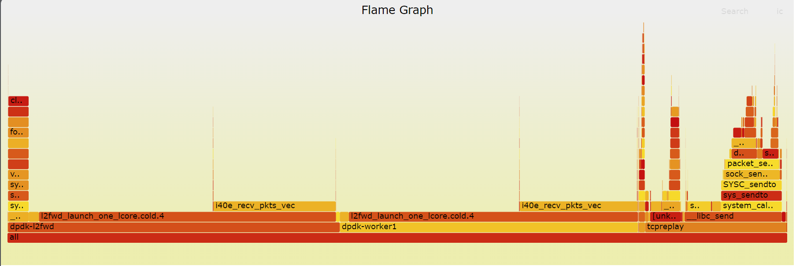

../FlameGraph/flamegraph.pl --colors green out.folded > flamegraph.svg

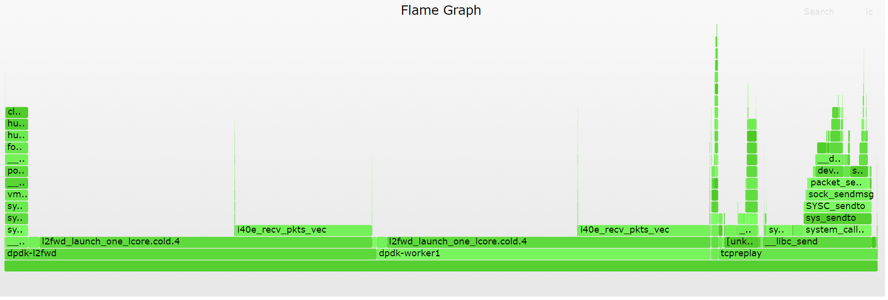

../FlameGraph/flamegraph.pl --hash out.folded > flamegraph.svg

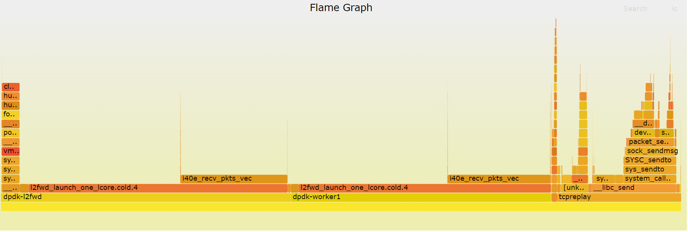


#### 3. 火焰图信息、优化

火焰图 (Flame Graph) 是一种直观的可视化工具，用于分析程序的性能瓶颈，尤其适用于理解 CPU 的使用情况。它展示了程序中各个函数的执行时间和调用关系，帮助你确定哪些函数占用了较多的 CPU 资源，从而优化程序性能。

##### 3.1 火焰图的主要意义

1. **函数调用的层级结构**:
    - 火焰图中的每个矩形框代表一个函数，矩形的宽度代表该函数消耗的 CPU 时间。越宽的矩形表示该函数占用的时间越多。
    - 火焰图的纵向表示函数的调用栈。越靠上的框表示被调用的函数，越靠下的框表示调用其他函数的函数。通过查看函数的层级结构，可以直观地理解函数的调用关系。
2. **CPU 时间的分布**:
    - 火焰图的横向宽度表示所有采样数据中的 CPU 时间分布。宽度大的函数占用了更多的 CPU 资源，应该成为优化的重点。
    - 你可以通过观察火焰图来识别哪些函数是 CPU 消耗的主要来源，以及哪些函数只是短暂地被调用。
3. **热点分析**:
    - **底层的函数**表示程序的主循环或核心函数，通常是高频被调用的函数。如果某些底层函数特别宽，表示这些函数占用了大量的 CPU 时间，可能成为性能瓶颈。
    - **上层的函数**通常是函数的调用者，可以通过查看这些函数来分析调用链。如果某些调用链上的函数过多，可能需要简化调用逻辑或优化调用路径。
4. **颜色意义**:
    - 火焰图中的颜色通常没有特殊意义，除非你使用了 `--hash` 选项。颜色的变化主要是为了视觉区分不同的函数或模块。你可以根据颜色快速定位和识别函数，理解不同区域的代码。

点击对应的函数片段，里面会显示函数的cpu时间占比。

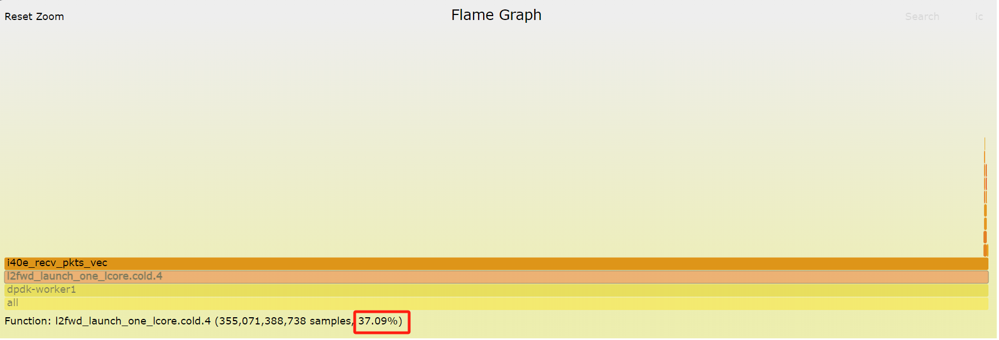

##### 3.2 如何使用火焰图分析性能

1. **查找最宽的函数**:

    - 火焰图的横向宽度代表 CPU 时间，最宽的函数消耗了最多的 CPU 时间，是分析和优化的重点。重点分析这些函数是否可以通过优化算法、减少调用频率或者并行化来提升性能。

2. **分析调用栈的深度**:

    - 如果一个函数的调用栈非常深，可能表示它在层层调用其他函数时有一定的开销。通过简化调用路径，减少深层调用，可以提高性能。

3. **排查非预期的高消耗函数**:

    - 火焰图中可能会出现一些你不期望的函数占用了较多的 CPU 时间。这类函数可以是由于错误使用资源（如内存或 I/O 操作）或某些不合理的操作导致的。在火焰图中识别这些不应占用大量时间的函数，并检查它们的实现，可以帮助优化性能。

4. **优化计算密集型函数**:

    - 如果某个函数频繁被调用且占用较多的 CPU 时间，可以分析它的实现逻辑，尝试通过提高算法效率、减少不必要的计算或使用更高效的数据结构来优化。

    

    总结：

    | **火焰图元素**             | **说明**                                                     | **优化策略**                                                 |
    | -------------------------- | ------------------------------------------------------------ | ------------------------------------------------------------ |
    | **函数的横向宽度**         | 代表 CPU 时间占用。宽度越大，表示函数消耗的 CPU 时间越多。   | 优化宽度最大的函数，例如通过优化算法、减少不必要的操作或并行化处理来减少 CPU 时间消耗。 |
    | **函数的纵向位置**         | 表示函数的调用栈位置。底部函数是主循环或核心函数，顶部函数是调用其他函数的函数。 | 优化深层调用链，减少函数的嵌套层级，简化调用路径，降低深度函数带来的开销。 |
    | **颜色**                   | 通常仅用于视觉区分，没有特别意义（除非使用 `--hash` 选项）。 | 颜色变化帮助视觉区分不同模块或函数。可根据颜色快速识别性能瓶颈函数，但通常不作为优化依据。 |
    | **宽度最大的函数**         | 消耗最多 CPU 时间的函数，通常是优化的重点。                  | 优先检查和优化宽度最大的函数：改进算法、减少不必要的调用、检查内存分配、并行化处理等。 |
    | **调用栈深度**             | 调用栈深度表示函数调用的层次。如果函数的调用栈很深，可能会导致较大的开销。 | 简化调用路径，减少不必要的调用层次。考虑内联（inline）关键函数以减少调用开销。 |
    | **热点函数**               | 占据大量 CPU 时间的函数，可能是计算密集型操作或资源管理（如内存或 I/O）导致的瓶颈。 | 针对热点函数进行优化：减少计算次数、使用高效的数据结构或算法，减少内存访问次数或优化 I/O 操作。 |
    | **不应占用大量时间的函数** | 火焰图中意外看到某些非核心函数占用大量时间，可能是程序实现中存在问题，如资源使用不当或频繁的锁操作。 | 分析这些函数的具体实现，减少不必要的锁操作、资源竞争，优化内存或 I/O 的使用，改善这些非预期函数的性能表现。 |
    | **多线程并行处理**         | 如果函数出现在多个线程中，可能说明是瓶颈函数。               | 使用多线程或并行化处理减少单个线程的压力，并确保线程安全。   |
    | **内存密集型函数**         | 如果火焰图中某些函数涉及大量的内存操作，可能会导致性能问题。 | 检查内存使用模式，优化数据结构布局，减少缓存未命中（cache-miss）或内存分配的次数。 |

假设火焰图中某个函数 `process_packets()` 占据了很大一部分横向宽度，意味着该函数消耗了大量的 CPU 资源。如果它出现在调用栈的底部，表示它是整个程序的主函数，频繁处理网络数据包。你可以分析：

- 减少数据包处理中的不必要操作
- 通过多线程分发数据包，减少单个线程的负担
- 优化其中的循环或内存操作


##### 3.3 内存密集型函数

要判断火焰图中的哪些函数是 内存密集型函数，通常可以结合以下几个步骤来分析：

```less

1. 观察火焰图宽度
	内存密集型函数往往在火焰图中占据较大的宽度，因为它们可能涉及大量的内存分配、复制、或数据移动操作。宽度越大，意味着该函数消耗的 CPU 时间越多，可能与频繁的内存操作有关。
2. 函数名称提示
	如果火焰图中的函数名称提示它涉及内存操作，比如 malloc、free、memcpy、memset，这些常见的内存管理或数据处理函数，可能暗示该函数有较大的内存开销。
3. 缓存未命中率
	使用性能分析工具（如 perf）捕捉的 cache-miss（缓存未命中） 事件。如果某个函数的缓存未命中率较高，说明它可能频繁访问不在缓存中的内存，从而拖慢了性能。在火焰图中，这种函数通常宽度较大，且占用的 CPU 时间较多。
4. 结合性能分析工具的结果
	可以结合 perf stat 或 perf record 等工具的内存统计指标（如 cache-misses, L1-dcache-load-misses, LLC-load-misses 等）来进一步确认某个函数是否因为内存操作而造成了性能瓶颈。
5. 频繁的内存分配/释放
	函数中频繁调用内存分配（如 malloc、calloc）和释放（如 free）可能导致性能下降。如果在火焰图中看到这些函数占据显著比例，说明程序的内存管理存在瓶颈，可以通过减少分配次数、使用内存池（memory pool）等方式进行优化。
6. 识别相关的数据结构
	如果火焰图中的函数操作某些复杂数据结构（如链表、哈希表），并且这些数据结构无法有效利用 CPU 缓存，导致频繁访问主内存，这也会显著增加内存开销。优化数据结构布局，增加缓存友好性可以改善性能。

优化措施：
	缓存优化：重新组织数据结构，使内存访问更加局部化，减少缓存未命中。
	内存池：对于频繁的分配和释放操作，使用内存池技术来减少动态分配的开销。
	减少内存拷贝：通过使用指针或引用来减少不必要的内存拷贝操作。
	使用更高效的数据结构：对于特定的算法和操作，选择适合的、更高效的数据结构。
```

