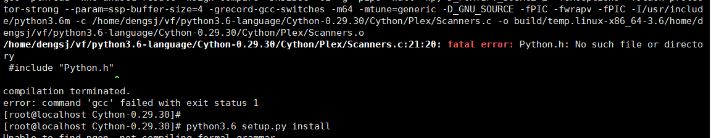
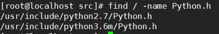
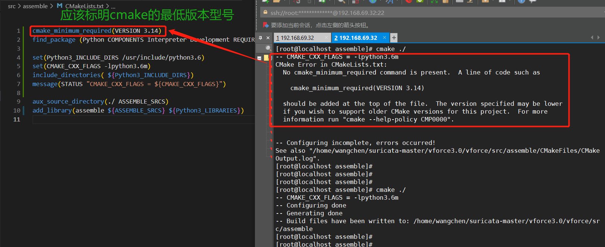
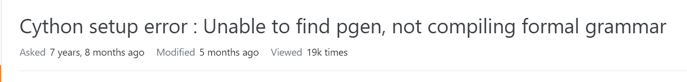
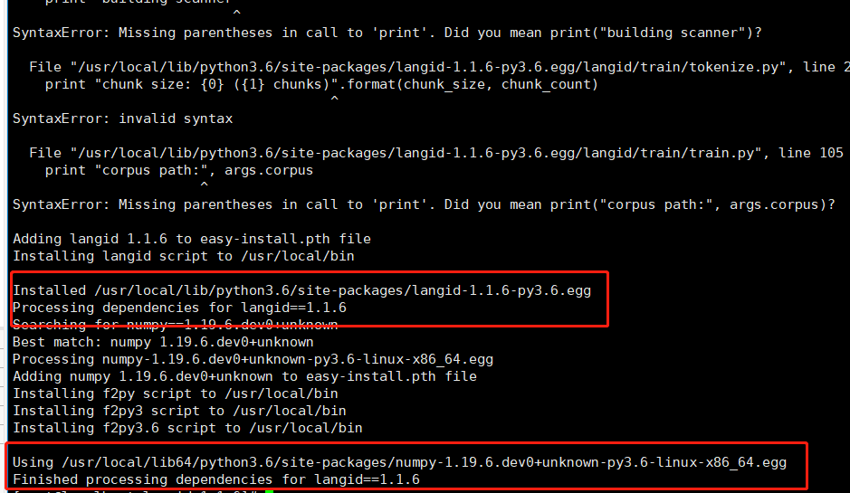
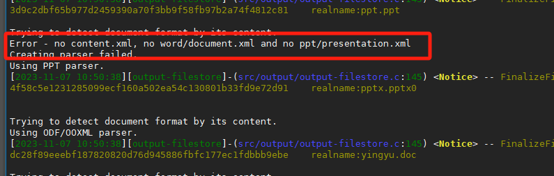

### linux文本提取文种识别环境布置

#### 一、redeme

```less
/* python install langid */
step1:  install python3.6
step2:  python3 setup.py install #Cython库 Cython-0.29.30.tar.gz
        python3 setup.py install #numpy库  numpy-maintenance-1.19.x .zip
        python3 setup.py install #langid库 langid-1.1.6.tar.gz
        python3 setup.py install #hanzidentifier库 hanzidentifier-1.1.0.tar.gz
        (安装 hanzidentifier库报错时，可能时因为缺乏其关联库zhon导致。重新安装 python3 setup.py install #zhon库  zhon-1.1.5.tar.gz  即可)
step3:  cp /cfg/conversionText/libcharsetdetect.so /usr/lib   // 如果还报错的话，可以再拷贝一份到/usr/lib64
        cp /cfg/conversionText/libdoctotext.so /usr/lib
        cp /cfg/conversionText/libmimetic.so.so /usr/lib
        cp /cfg/conversionText/libwv2.so.1 /usr/lib
    注：目录下新增resource目录项，为文种转换所需编码MAP。路径受库程序限制。


/* redis install */
step1: 下载redis源码安装包
step2: make && make install
step3: cp /usr/local/lib/libhiredis.* /usr/lib64/
```


#### 二、error

##### 1、Cvthon安装Cython出错时：



安装相应的python-dev

```less
yum install python3-devel
```



检验相关的python版本是否存在该Python.h文件




##### 2、Cthon安装Cython出错时：



```less
将Cthon目录删除，重新解压后make并用python3.6进行build
```


##### 3、langid安装报错



可以无视上面的invalid报错，只要下面显示安装成功即可。


#### 三、运行报错

Error - no content.xml, no word/document.xml and no ppt/presentation.xml

不影响结果输出，只是如果doc等不存在文件名后缀，文本转换时会走一次xml文件校验。

