## linux网卡收包源码流程——(i40e版)

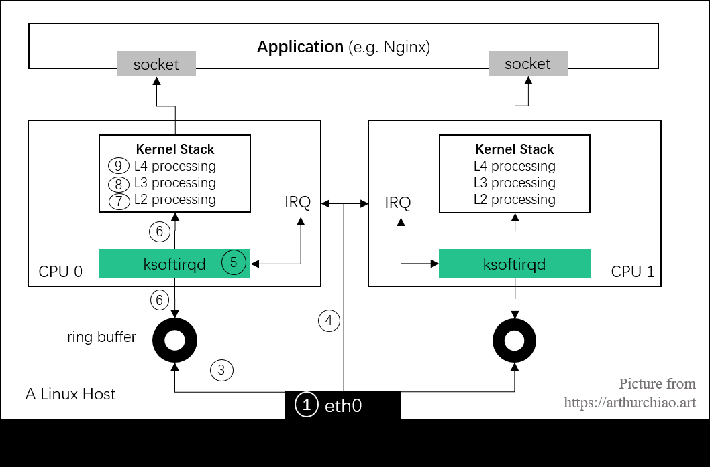

```less
数据复制的地方。
	第1次是将包从网卡通过 DMA 复制到 ring buffer；对应图中第 3 步；
	第2次是从 ring buffer 复制到 skb 结构体；对应图中第 6 步; // dpdk 少的第一步
	第3次是从 skb 复制到 用户空间；对应图中第 9 之后指向app层的一步步 // dpdk 少的第二步
```


### 一、网卡初始化

```less
# 对于网卡的收包，最主要的两个操作
	 (1) 如何处理收包时硬中断消息
     (2) 网卡收包处理时的软中断函数
```

#### 1、硬中断

##### （1）硬中断注册

```less
// 文件目录 linux-master\drivers\net\ethernet\intel\i40e\i40e_main.c
## 通用硬中断调用接口
static inline int __must_check request_irq(unsigned int irq, irq_handler_t handler, unsigned long flags,
	    const char *name, void *dev)
{
	return request_threaded_irq(irq, handler, NULL, flags, name, dev);
}


## request_threaded_irq函数
根据 request_irq 的注册流程-------- 
	{
    	action->handler = handler; //硬中断回调函数：i40e_intr
	}
			

而对应的硬中断回调处理函数i40e_intr()
	{
    	napi_schedule_irqoff() // 软中断poll-napi调度启动
	}	
```

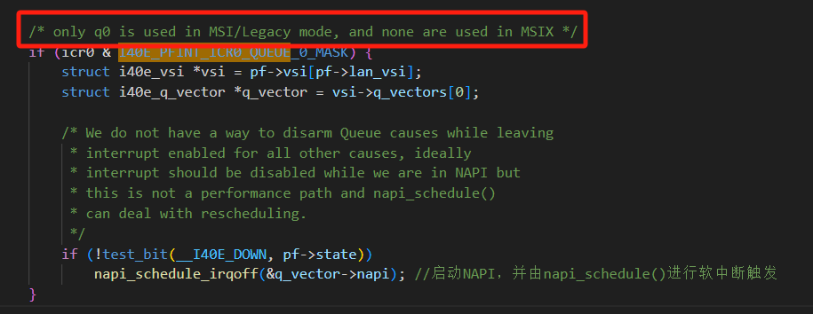

```less
对于140e网卡，MSI/Legacy模式下只使用q0, MSIX模式下不使用q0， 
所以依据此条件判断目前网卡的中断模式，如果属于MIS-X，则我们可以使用NAPI技术接口。并由此处启动NAPI的轮询。
```


##### （2）硬中断触发

```less
// 根据 irq 值来确定<注册----调用>的一致性

# 可以查看对应的handler调用位置，进行逆回溯：<i40e_intr>
	res = action->handler(irq, action->dev_id) ---
			__handle_irq_event_percpu() ---
				handle_irq_event_percpu() ---
					handle_irq_event ---
						{
                            	handle_level_irq()
							  handle_edge_irq()
							  handle_fasteoi_irq()
							  handle_simple_irq()
							  handle_percpu_irq()
							  handle_edge_eoi_irq()
							  handle_bad_irq()
                                #再上层的<硬件级别开发>我们不再深究
						}
 对于几个中断类型的触发：
	（1）edge边沿触发分上升沿触发和下降沿触发，简单说就是电平变化那一瞬间进行触发。// 即只有从"无包"-->"收到包"这状态改变时会触发
	（2）fasteoi电平触发也有高电平触发、低电平触发，一般都是低电平触发。如果是低电平触发，那么在低电平时间内中断一直有效。
    如果在电平没有恢复之前就退出中断程序，那么会在退出后又再次进入中断。只要不退出是不会重复触发的 // 即：只要有包就一直触发
	（3）level等级中断，则是根据中断设置的优先级进行处理

```


#### 2、软中断

##### （1）系统软中断注册

```less
subsys_initcall(net_dev_init)  --->  net_dev_init()  -->  open_softirq(NET_TX_SOFTIRQ, net_tx_action) ---> softirq_vec[nr].action = action;
```


##### （2）系统软中断调用

###### 	A、软中断线程创建

```less
spawn_ksoftirqd() // 系统启动时即开启创建中断线程
```

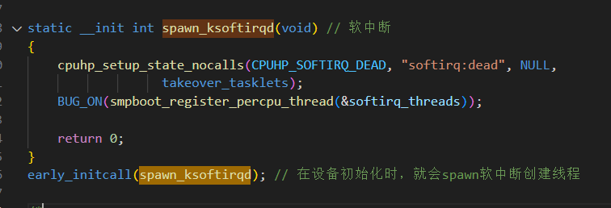

```less
softirq_threads结构体如下：

static struct smp_hotplug_thread softirq_threads = {
	.store			= &ksoftirqd,
	.thread_should_run	= ksoftirqd_should_run, // 判断能否执行
	.thread_fn		= run_ksoftirqd, // 软中断执行函数
	.thread_comm		= "ksoftirqd/%u",
};
```

```less
// 线程创建 
smpboot_register_percpu_thread() // 软中断线程的创建，是为每一个CPU创建一个
```

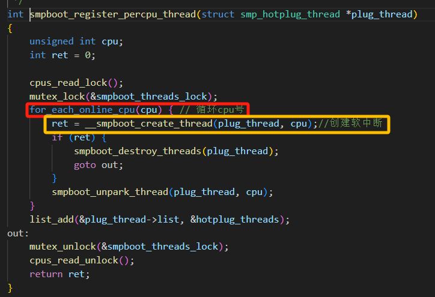

```less
__smpboot_create_thread()如下
```

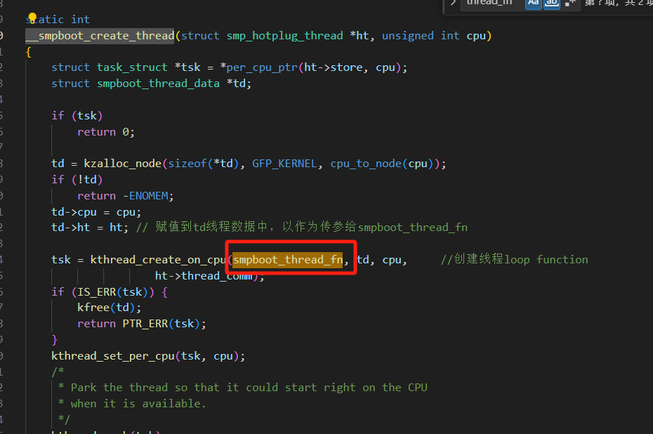

其中所创建的函数smpboot_thread_fn即有对应系统软中断的使用

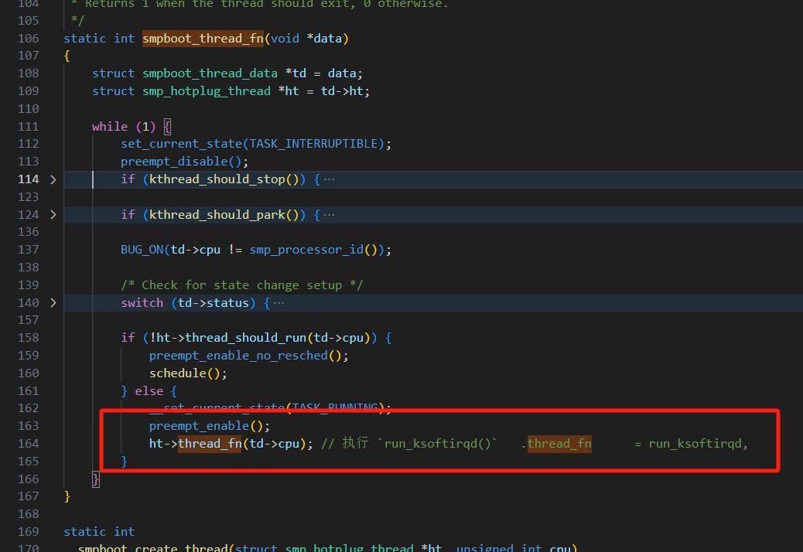


###### 	B、软中断线程运行

```less
static void run_ksoftirqd(unsigned int cpu)
{
	local_irq_disable(); // 关闭所在cpu的所有硬中断IRQ
	if (local_softirq_pending()) { // 存在软中断等待，进入软中断poll处理
		/*
		 * We can safely run softirq on inline stack, as we are not deep
		 * in the task stack here.
		 */
		__do_softirq(); // 处理软中断 
		local_irq_enable(); //  重新开启硬中断IRQ
		cond_resched();
		return;
	}
	// 否则直接返回
	local_irq_enable(); //  重新开启硬中断IRQ
}

__do_softirq 部分如下：
```

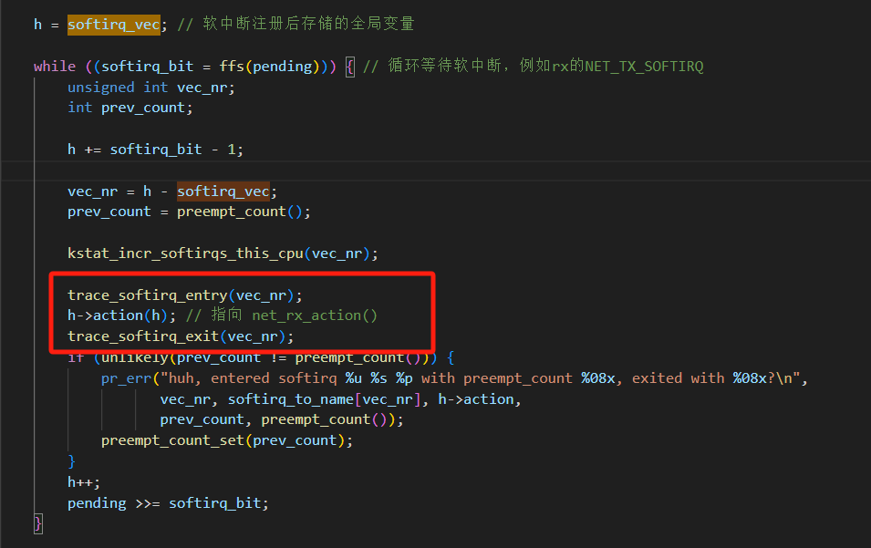

##### （3）内外软中断链接

```less
第一步：网卡的软中断回调注册如下：
	netif_napi_add(vsi->netdev, &q_vector->napi, i40e_napi_poll); // 注册napi的软中断所调用的回调函数

第二步：网卡软中断NAPI开启，也就是位于硬中断中：
	napi_schedule_irqoff启动；

第三步：调用：由<系统软中断>触发后(包含)调用<网卡软中断>  // 具体可以参看(5)
	net_rx_action  --->  napi_poll ---> n->poll<i40e_napi_poll>
	napi_threaded_poll ---> n->poll<i40e_napi_poll>
```


##### （4）回调函数-i40e_napi_poll

​	i40e_napi_poll 主要看一下部分：

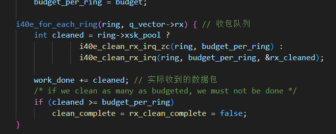

```less
注意此处：
	if (cleaned >= budget_per_ring)
当所受到的包大于所预设的包数时，则代表网卡还有后续包。
	则：clean_complete = rx_clean_complete = false;
此时我们会返回所预设的最大收包数：
	return budget;
```


##### （5）网卡软中断poll调用位置

```less
net_rx_action下：i40e_napi_poll 调用
```

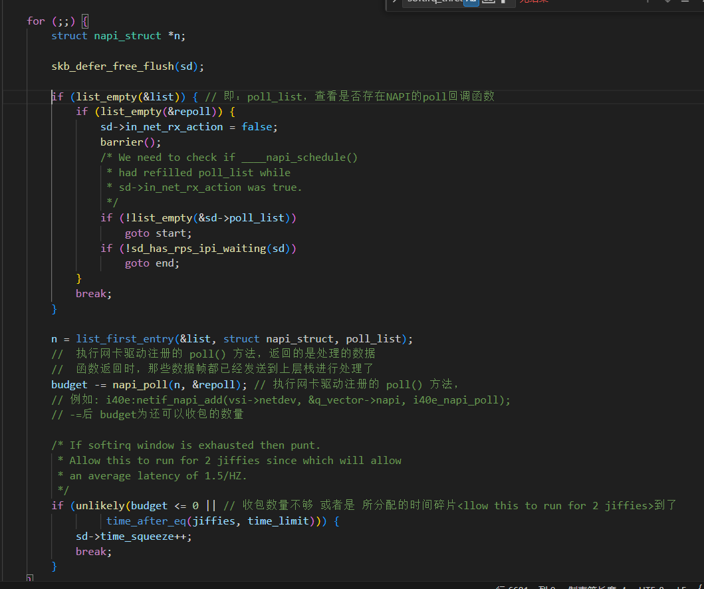

```less
对应的napi_poll：
napi_poll(struct napi_struct *n, struct list_head *repoll)
{
    …………
  	__napi_poll
	{
    		if (test_bit(NAPI_STATE_SCHED, &n->state)) {
			work = n->poll(n, weight);  // 对i40e_napi_poll软中断的调用。
			trace_napi_poll(n, work, weight);
		}
		…………
		*repoll = true;
		…………
    }
    
    if (do_repoll)
		list_add_tail(&n->poll_list, repoll); //将本次需要repoll的处理加入[repoll]链表
    …………
}

后续操作如下：
```

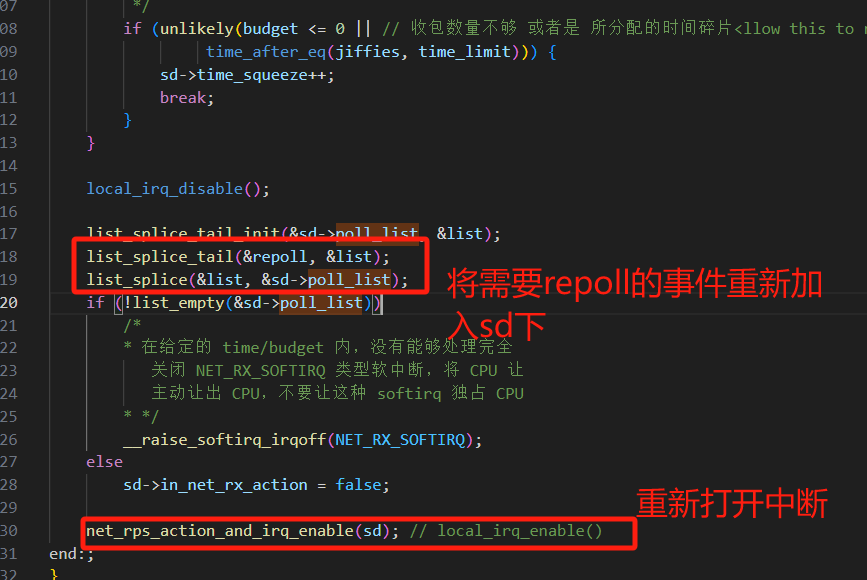

```less
	经过上述逻辑处理，所存在poll没有收包完整 或者 隶属于此次软中断占用的时间超时的情况，则会重新在下一个时间片段进行收包，以及处理本次list列表没有处理的poll事件。强制终止此次软中断处理并不是不处理了，这是为了与其他任务公平运行，net_rx_action会主动释放CPU，当然softnet_data中很可能还有没轮询到的napi设备，所以，net_rx_action()重新调度NET_RX_SOFTIRQ软中断，让内核后面有时间再进行处理。	


#细节：上面的结果是，当下次时间片段来临时。会先处理上次遗留的list事件，再处理需要repoll的事件；
```

##### （6）软中断i40e_napi_poll内部拷贝逻辑

```less
// 下面描述的就是linux内核协议栈第一次拷贝的逻辑

i40e_napi_poll 对于我们理解而言，她主要干两件事情：
	（1）清空napi中数据包，以及其对应FD。
	（2）将napi->ring中的数据包拷贝走，给指定cpu(这里的cpu取决于网卡收包线程(软中断线程)绑定的cpu);

// 以i40e_napi_poll中rx为例子
i40e_for_each_ring(ring, q_vector->rx) { // 循环处理收包队列
		int cleaned = ring->xsk_pool ? // 网卡是否启用了XDP技术
			      i40e_clean_rx_irq_zc(ring, budget_per_ring) : // 则通过xdp+xsk进行处理数据包 https://rexrock.github.io/post/af_xdp1/
			      i40e_clean_rx_irq(ring, budget_per_ring, &rx_cleaned); // 正常处理数据包 ---> skb

		work_done += cleaned; // 实际收到的数据包
		/* if we clean as many as budgeted, we must not be done */
		if (cleaned >= budget_per_ring)
			clean_complete = rx_clean_complete = false;
	}

// i40e_clean_rx_irq 与 i40e_clean_rx_irq_zc 差距不大
```

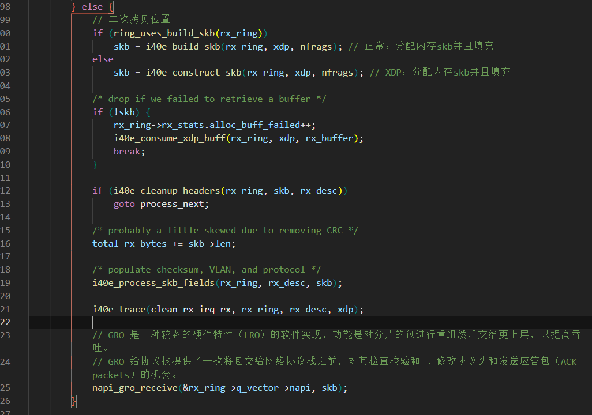

```less
// 以上面 i40e_build_skb 为例子
// 内存拷贝至skb
skb = napi_build_skb(xdp->data_hard_start, xdp->frame_sz);
	struct sk_buff *skb = __napi_build_skb(data, frag_size);
		{
             struct sk_buff *skb;
			skb = napi_skb_cache_get();
	             {
                     // 具体看下面的描述
                     struct napi_alloc_cache *nc = this_cpu_ptr(&napi_alloc_cache); //从指定cpu的cache缓存里面获取
				}
			if (unlikely(!skb))
				return NULL;
			memset(skb, 0, offsetof(struct sk_buff, tail));
			// 内存拷贝 data-->skb
			__build_skb_around(skb, data, frag_size);
			return skb;
		}
```

```apl
# linux-master\Documentation\translations\zh_CN\mm\page_frags.rst
网络堆栈在每个CPU使用两个独立的缓存来处理碎片分配。
	netdev_alloc_cache被使用netdev_alloc_frag和__netdev_alloc_skb调用的调用者使用。
	napi_alloc_cache被调用__napi_alloc_frag和__napi_alloc_skb的调用者使用。

这两个调用的主要区别是：
		它们可能被调用的环境。“netdev” 前缀的函数可以在任何上下文中使用，因为这些函数将禁用中断，而 ”napi“ 前缀的函数只可以在softirq上下文中使用。
```


#### 3、系统硬中断与软中断链接

##### (1) 两处线程创建的区别

```less
在硬中断调用到 netif_napi_add 的时候，
	---> netif_napi_add_weight()
```

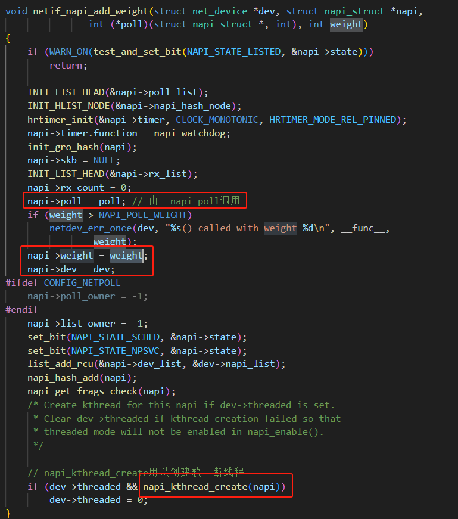

```less
如果设置了threaded标志，则其中的 napi_kthread_create 则会进行软中断线程创建：
static int napi_kthread_create(struct napi_struct *n)
{
	int err = 0;

	/* Create and wake up the kthread once to put it in
	 * TASK_INTERRUPTIBLE mode to avoid the blocked task
	 * warning and work with loadavg.
	 */
	n->thread = kthread_run(napi_threaded_poll, n, "napi/%s-%d", // 线程创建运行
				n->dev->name, n->napi_id);
	if (IS_ERR(n->thread)) {
		err = PTR_ERR(n->thread);
		pr_err("kthread_run failed with err %d\n", err);
		n->thread = NULL;
	}

	return err;
}


// 差别
前者：是系统开局创建的();
后者：由设备自行dev_set_threaded设置创建();
```

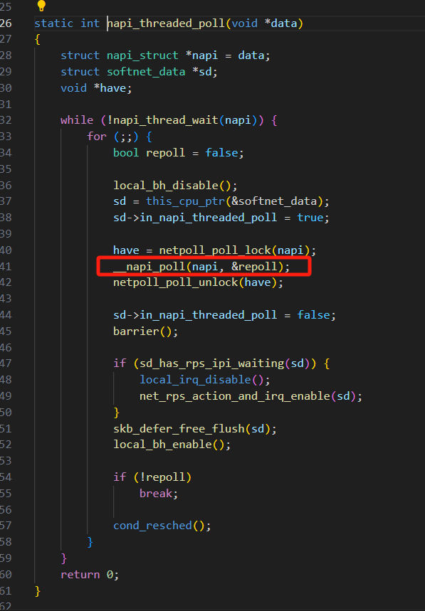


##### (2)  net_rx_action是如何获得网卡注册的软中断回调

```less
由硬中断的注册回调函数中的：napi_schedule_irqoff  ---->   ____napi_schedule
	进行了poll_list的追加合并

//那么其中的sd是否就是同一个呢？？
```

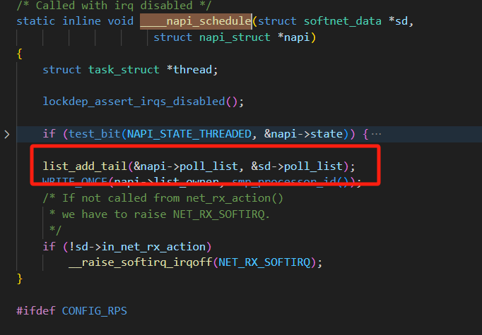

```less
我们可以查看到linux内核用这个函数进行了sd的统一：
	this_cpu_ptr(&softnet_data) //用来获取该cpu上的软中断数据
```

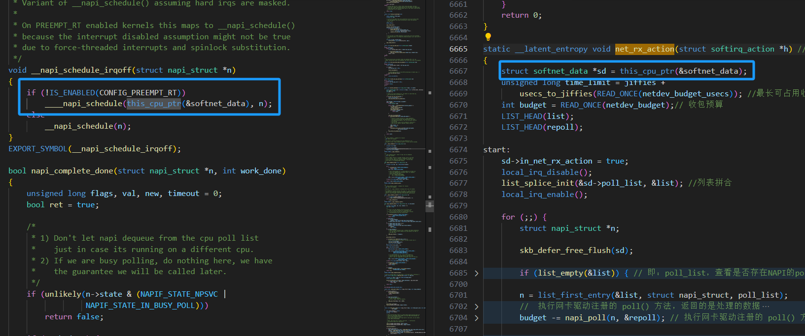

```less
至此，软硬中断的注册、联系就梳理完毕了
```


#### 4、图像总结

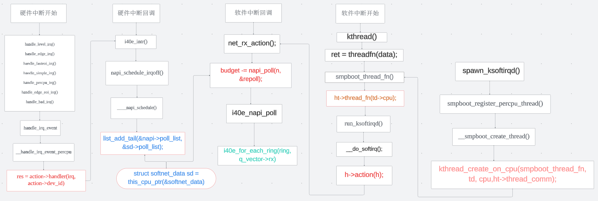

注意：

```apl
(1) 根据NAPI_poll--i40e_napi_poll的回调函数，里面的 i40e_for_each_ring(ring, q_vector->rx) 与 work_done += cleaned;我们可以知道，
	对于多队列网卡，budget的返回值是多队列共用累计的。
	对于进行限制的的 netdev_budget 则也是多个NAPI实例所累计比较的：
```

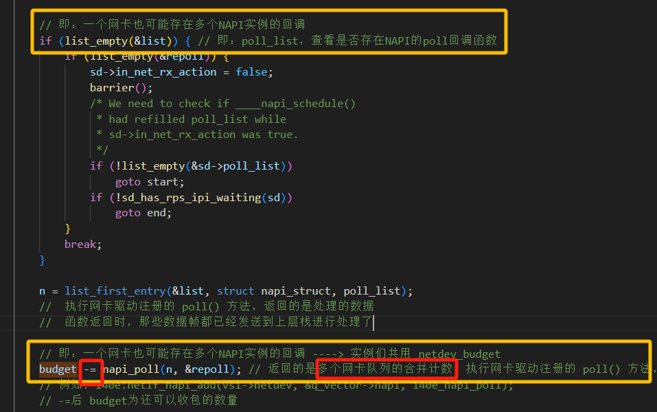

```apl
(2) 内核的软中断系统是一种在硬中断处理上下文（驱动中）之外执行代码的机制。可以把软中断系统想象成一系列内核线程（每个 CPU 一个)。

(3) 给每个CPU一个特定的硬中断非常重要：这个CPU不仅处理这个硬中断，而且通过NAPI处理接下来的软中断来收包。

(4) 驱动的硬中断处理函数做的事情很少，但软中断将会在和硬中断相同的 CPU 上执行。

(5) NAPI 存在的意义是无需硬件中断通知就可以接收网络数据，它回自行轮询检验硬中断的产生。

(6) NAPI 的轮询循环（poll loop）是受硬件中断触发而跑起来的。换句话说，NAPI 功能启用了 ，但是默认是没有工作的，直到第一个包到达的时候，网卡触发的一个硬件将它唤醒

(7) 当一段时间收包结束、本次的NAPI使用时间/收包数量达到限制，就会交还CPU关闭NAPI，直到下次轮到cpu时间片段、有新的数据包触发硬中断来进行新一轮的NAPI触发使用。

(8) 硬中断期间是不能再进行另外的硬中断的，也就是说不能嵌套。 所以硬中断处理函数（handler）执行时，会屏蔽部分或全部（新的）硬中断。
	这就要求硬中断要尽快处理，然后关闭这次硬中断，这样下次硬中断才能再进来；
	但是另一方面，中断被屏蔽的时间越长，丢失事件的可能性也就越大； 可以想象，如果一次硬中断时间过长，ring buffer 会被塞满导致丢包。
	所以，所有耗时的操作都应该从硬中断处理逻辑中剥离出来， 硬中断因此能尽可能快地执行，然后再重新打开。软中断就是针对这一目的提出的。
	
(9) 硬中断的方式并非一无是处：
```

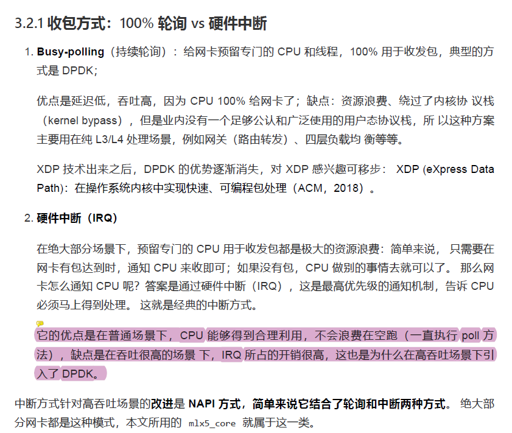

```apl
(10) 今天的大部分网卡都使用 DMA 将数据直接写到内存，接下来操作系统可以直接从里 面读取。实现这一目的所使用的数据结构就是
ring buffer 环形缓冲区）。 要实现这一功能，设备驱动必须和操作系统合作，预留（reserve）出一段内存来给网卡使用。 预留成功后，网卡知道了这块内存的地址，接下来收到的包就会放到这里，进而被操作系统取走。
```


#### 5、描述总结

##### 5.1 linux网卡的硬中断和软中断工作逻辑

```less
在Linux操作系统中，网卡（网络接口卡，NIC）处理数据包的机制涉及硬中断（hardware interrupts）和软中断（software interrupts）。以下是这两种中断的工作逻辑及其相互关系：

### 硬中断（Hardware Interrupts）
硬中断是由硬件设备（如网卡）触发的信号，通知CPU有事件需要处理。对于网卡，硬中断通常在以下情况下触发：
1. 接收到数据包：当网卡接收到一个数据包并将其放入接收队列时，会向CPU发出硬中断信号。
2. 数据包发送完成：当网卡完成一个数据包的发送时，也可能触发硬中断，通知CPU可以进行下一步操作。

#### 硬中断处理流程：
1. 硬件触发中断：网卡触发硬中断信号。
2. 中断控制器捕获中断：中断控制器（如APIC）捕获到中断信号，并根据中断向量表将中断信号传递给对应的中断服务例程（ISR）。
3. ISR执行：CPU暂停当前正在执行的任务，保存上下文，并执行ISR。ISR是特定于设备驱动程序的代码，用于处理硬件中断。
4. ISR处理：ISR通常会读取网卡的状态寄存器，确认中断原因，并执行基本的中断处理，如将接收到的数据包从网卡的硬件缓冲区复制到系统内存中的一个缓冲区。
5. 触发软中断：ISR通常会触发软中断或调度一个下半部处理（如tasklet或workqueue），以处理更高层次的操作，这样可以缩短ISR的执行时间，提高系统响应速度。

### 软中断（Software Interrupts）
软中断是由软件触发的中断，用于处理需要在硬中断上下文之外完成的任务。软中断通常用于处理耗时较长或需要执行较复杂的操作。

### 软中断处理流程：
1. 触发软中断：硬中断处理程序（ISR）在完成基本的硬件处理后，触发软中断或调度tasklet。
2. 软中断执行：软中断处理程序（SoftIRQ）在稍后执行，通常在内核中断上下文中，处理更高层次的网络协议栈处理。
3. 处理数据包：软中断处理程序将数据包提交到网络协议栈进行进一步处理，如协议解封装、检查、路由等。

### 硬中断和软中断的配合
1. 硬中断处理：网卡接收到数据包后，硬中断处理程序会迅速读取数据包，将其放入一个内核缓冲区中，然后触发软中断。硬中断处理程序的目标是尽可能快地完成，以便尽快响应新的中断。
2. 软中断处理：软中断处理程序负责处理网络协议栈的其余部分，如协议解封装和数据传递到上层应用程序。这种分离确保了硬中断处理尽可能短，从而减少系统的中断延迟，提高整体系统性能。


### 关键点
1. 硬中断处理程序（ISR）：快速处理基本的中断事件，如读取网卡状态寄存器和复制数据包。
2. 软中断处理程序（NAPI Poll）：处理复杂的网络协议栈操作，并且可以限制一次处理的包数量，以防止软中断处理时间过长。
3. NAPI：一种高效的中断处理机制，结合硬中断和软中断，通过限制一次处理的包数量来提高系统性能。

### 总结
Linux内核中的硬中断和软中断机制为高性能网络数据包处理提供了有效的手段。硬中断用于快速响应网卡事件，而软中断用于处理复杂的网络协议栈操作。通过这种分工，可以提高系统的中断处理效率，减少中断延迟。
```

###### 5.1.1 简化的示例代码

展示了硬中断和软中断在网卡驱动中的配合工作：

```less
#include <linux/interrupt.h>
#include <linux/netdevice.h>
#include <linux/skbuff.h>
#include <linux/etherdevice.h>

/* 硬中断处理程序 */
irqreturn_t my_net_interrupt(int irq, void *dev_id) {
    struct net_device *dev = (struct net_device *)dev_id;
    struct my_net_priv *priv = netdev_priv(dev);

    /* 读取网卡状态寄存器并处理中断 */
    /* ... */

    /* 触发软中断 */
    napi_schedule(&priv->napi);

    return IRQ_HANDLED;
}

/* 软中断处理程序 */
static int my_net_poll(struct napi_struct *napi, int budget) {
    struct my_net_priv *priv = container_of(napi, struct my_net_priv, napi);
    struct net_device *dev = priv->dev;
    int processed = 0;

    /* 处理接收到的数据包 */
    while (processed < budget || 时间片到期) {
        struct sk_buff *skb = netdev_alloc_skb(dev, PKT_SIZE);
        if (!skb)
            break;

        /* 从硬件接收队列中获取数据包并复制到skb */
        /* ... */

        skb->protocol = eth_type_trans(skb, dev);
        netif_receive_skb(skb);
        processed++;
    }

    /* 如果处理完所有数据包，停止软中断 */
    if (processed < budget) {
        napi_complete(napi);
        /* 重新启用硬件中断 */
        /* ... */
    }

    return processed;
}

/* 初始化网卡设备 */
static int my_net_open(struct net_device *dev) {
    struct my_net_priv *priv = netdev_priv(dev);

    /* 申请注册中断 */
    if (request_irq(dev->irq, my_net_interrupt, IRQF_SHARED, dev->name, dev)) {
        return -EIO;
    }

    /* 初始化NAPI */
    netif_napi_add(dev, &priv->napi, my_net_poll, 64);
    napi_enable(&priv->napi);

    /* 启动网卡设备 */
    /* ... */

    return 0;
}

/* 关闭网卡设备 */
static int my_net_stop(struct net_device *dev) {
    struct my_net_priv *priv = netdev_priv(dev);

    napi_disable(&priv->napi);
    free_irq(dev->irq, dev);

    /* 停止网卡设备 */
    /* ... */

    return 0;
}
```


##### 5.2 linux内核网卡硬中断和软中断的注册、调用时机

在Linux内核中，网卡驱动程序通过注册硬中断和软中断来处理网络数据包的接收和发送。以下是硬中断和软中断的注册及其调用时机的详细说明：

###### 5.2.1 硬中断的注册与调用时机

​	**注册**：硬中断是在设备初始化期间注册的，通常是在网卡驱动程序的`open`函数中。注册硬中断的典型方式是使用`request_irq`函数。

```less
#include <linux/interrupt.h>
#include <linux/netdevice.h>

/* 硬中断处理程序 --- 对应注册的 i40e_intr */ 
irqreturn_t my_net_interrupt(int irq, void *dev_id) {
    struct net_device *dev = (struct net_device *)dev_id;
    struct my_net_priv *priv = netdev_priv(dev);

    /* 读取网卡状态寄存器并处理中断 */
    /* ... */

    /* 触发软中断 -- 对应： i40e_intr --> napi_schedule_irqoff  */
    napi_schedule(&priv->napi); // 3.(2)中相对应

    return IRQ_HANDLED;
}

/* 初始化网卡设备 */
static int my_net_open(struct net_device *dev) {
    struct my_net_priv *priv = netdev_priv(dev);

    /* 申请中断 */
    if (request_irq(dev->irq, my_net_interrupt, IRQF_SHARED, dev->name, dev)) {
        return -EIO;
    }

    /* 初始化NAPI */
    netif_napi_add(dev, &priv->napi, my_net_poll, 64);  // 2.(3)中对应
    napi_enable(&priv->napi);

    /* 启动网卡设备 */
    /* ... */

    return 0;
}

/* 关闭网卡设备 */
static int my_net_stop(struct net_device *dev) {
    struct my_net_priv *priv = netdev_priv(dev);

    napi_disable(&priv->napi);
    free_irq(dev->irq, dev);

    /* 停止网卡设备 */
    /* ... */

    return 0;
}
```

**调用**：硬中断处理程序在以下情况下被调用：

1. 接收数据包：当网卡接收到数据包并将其放入接收队列时，会触发硬中断。
2. 发送数据包完成：当网卡完成数据包的发送时，也可能触发硬中断，通知CPU可以进行下一步操作。

硬中断处理程序会快速执行基本的中断处理逻辑，如读取网卡的状态寄存器，确认中断原因，并执行一些基本的处理（如将数据包从网卡的硬件缓冲区复制到系统内存的缓冲区中）。为了缩短硬中断的处理时间，硬中断处理程序通常会触发软中断或NAPI来处理剩余的工作。

###### 5.2.2 软中断的注册与调用时机

**注册软中断（NAPI）**： 软中断（尤其是NAPI）通常在设备初始化期间注册。在上面的示例中，NAPI在网卡驱动的`open`函数中通过`netif_napi_add`进行注册，并通过`napi_enable`启用。

```less
/* 初始化NAPI */
netif_napi_add(dev, &priv->napi, my_net_poll, 64);
napi_enable(&priv->napi);
```

**调用**：软中断处理程序（NAPI poll函数）在以下情况下被调用：

1. 硬中断触发软中断：硬中断处理程序中调用`napi_schedule`函数，触发NAPI poll函数的执行。
2. 软中断处理数据包：NAPI poll函数在软中断上下文中执行，处理复杂的网络协议栈操作。

```less
/* 软中断处理程序 */
static int my_net_poll(struct napi_struct *napi, int budget) {
    struct my_net_priv *priv = container_of(napi, struct my_net_priv, napi);
    struct net_device *dev = priv->dev;
    int processed = 0;

    /* 处理接收到的数据包 */
    while (processed < budget) {
        struct sk_buff *skb = netdev_alloc_skb(dev, PKT_SIZE);
        if (!skb)
            break;

        /* 从硬件接收队列中获取数据包并复制到skb */
        /* ... */

        skb->protocol = eth_type_trans(skb, dev);
        netif_receive_skb(skb);
        processed++;
    }

    /* 如果处理完所有数据包，停止软中断 */
    if (processed < budget) {
        napi_complete(napi);
        /* 重新启用硬件中断 */
        /* ... */
    }

    return processed;
}
```

NAPI poll函数的调用时机和执行逻辑如下：

1. 触发软中断：硬中断处理程序通过`napi_schedule`触发软中断。
2. 执行NAPI poll函数：在适当的时机（例如退出中断处理或定时器到期），内核会调用NAPI poll函数来处理接收到的数据包。
3. 处理数据包：NAPI poll函数从接收队列中获取数据包，处理这些数据包，并将其提交给网络协议栈进行进一步处理。
4. 完成NAPI处理：如果处理完了所有数据包，调用`napi_complete`函数，重新启用硬件中断，以便继续接收新的数据包。

##### 5.3 关键点总结

```less
1. 硬中断注册：通过`request_irq`在网卡驱动的`open`函数中注册。
2. 硬中断调用时机：当网卡接收到数据包或发送数据包完成时触发。
3. 软中断注册：通过`netif_napi_add`和`napi_enable`在网卡驱动的`open`函数中注册。
4. 软中断调用时机：硬中断处理程序调用`napi_schedule`触发，内核适时调用NAPI poll函数处理接收的数据包。

通过这种机制，Linux内核实现了高效的网络数据包处理，确保硬中断处理时间尽可能短，避免系统性能受限于中断处理开销。
```

