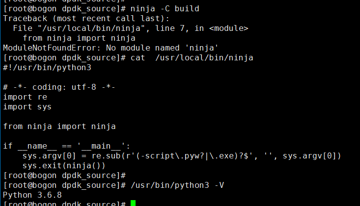

## Liunx常见lib库安装

```less
#报错err: command ‘gcc’ failed with exit status 1
yum install gcc gcc-c++ python3-devel pycrypto wget gcc make readline-devel

#解决missing python module: elftools
pip3 install pyelftools --upgrade

# 解决 import bz2 报错
yum install bzip2-libs bzip2-devel

# 解决 import curses 报错
yum install  ncurses-devel

# 解决 import sqlite3 报错
yum install sqlite-devel

# 解决 _dbm _gdbm 缺失提醒
yum install gdbm-devel

# 解决 _lzma 缺失提醒
yum install xz-devel

# 解决 _tkinter 缺失提醒
yum install tkinter tk-devel
yum install python3-tk* -y
yum install *tkinter*
python -m tkinter // 用于校验库是否安装
"根据Python介绍发现 在Python2 和Python3 中该包名称是不一样的，在 python2中叫Tkinter； 在python3中叫tkinter"
pip install tk
curl https://bootstrap.pypa.io/pip/2.7/get-pip.py -o get-pip.py
python get-pip.py
// 最后也不知道为什么，就没用make -j2 用 make就编译好了。。。
ln -s /home/yuejiushi/Python-3.12.1/python /usr/bin/python3.12

python3.12 -m pip install --upgrade pip setuptools wheel -i https://mirrors.aliyun.com/pypi/simple/


# 解决 _ssl 缺失提醒
yum install Openssl*
#安装openssl指定版本
./config --prefix=/usr/local/openssl
./config -t
make & make install
# 如果还不行
wget https://www.openssl.org/source/openssl-1.1.1n.tar.gz --no-check-certificate 下载openssl1.1.1
tar zxf openssl-1.1.1n.tar.gz 解压
cd openssl-1.1.1n
./Configure --prefix=/usr/local/openssl 设置安装目录 可以自定义 但是要记住，后面会用到
make -j && make install 编译并安装
将 /usr/local/openssl/lib 路径添加到系统动态库查找路径中，在 home 目录下的 .bashrc 文件最后面添加下面这一行
export LD_LIBRARY_PATH=/usr/local/openssl/lib:$LD_LIBRARY_PATH
souce .bashrc 立即生效


# 解决 readline 缺失提醒及方向键行为非预期的问题
yum install readline-devel zlib-devel

# 解决ImportError: No module named '_ctypes' 错误
yum install libffi-devel

# 安装meson
yum install python3-pip
pip3 install meson
meson --version
// 或者（但有时候因为epel库不同，倒是yum安装不了）
yum install epel-release
yum install meson

# 安装ninja
pip3 install ninja

// Could not detect Ninja v1.8.2 or newer ：ninja版本过低
# 安装过 ninja，但是依旧报错ModuleNotFoundError: No module named 'ninja' 
```



```less
# 注意自己ninja使用的python环境版本是不是自己pip3所指定的，如果不是修改bin下ninja的python路径指定就好了
// 然后需要重新 meson build


#解决pip install Please make sure the libxml2 and libxslt development packages are installed
yum install libxml2-devel libxslt-devel

# 安装pcap解析工具
yum install libxml2-devel libxslt-devel -y
pip3 install pyshark
pip3 install scapy

#<pcap.h>
// 对于suricata，一定先安装这个，不然会一直报错缺少pcap.h
yum install -y libnet* 
yum install -y libpcap*

#libnet
yum install libnet*

#pcre2 pcre2.h: No such file or directory
yum install -y pcre2 pcre2-devel

#libbsd
yum install libbsd libbsd-devel

# zconf.h not found.
yum install zlib-devel

# bsd/string.h: No such file or director
libbsd-0.12.1  libbsd-0.12.1.tar.xz  libmd-1.1.0  libmd-1.1.0.tar.xz
官网下载之后安装就行，先md后bsd：https://libbsd.freedesktop.org/releases/

# event2/event.h: No such file or directory
yum install -y libevent*

# #include <cap-ng.h>
yum install libcap-ng*

# libnet.h: No such file or directory
下载：libnet-1.1.6-15.el8.x86_64.rpm  libnet-devel-1.1.6-15.el8.x86_64.rpm
安装：
	rpm -ivh ./libnet-devel-1.1.6-15.el8.x86_64.rpm
	rpm -ivh ./libnet-devel-1.1.6-15.el8.x86_64.rpm  --nodeps --force

# numa.h: No such file or directory
yum -y install numactl-devel

# pcre.h: No such file or directory
yum install pcre-devel

# 问题：/usr/bin/ld: cannot find -libverbs
yum install libibverbs* // 此处特写，是因为需要安装的库名称有变化
ln -sv ./libibverbs.so.1 ./libibverbs.so

# cannot find -lstdc++
# cannot find -lnet
# cannot find -llzma // yum install -y xz-devel
# cannot find -lbz2
# cannot find -libverbs
// 在安装 libibverbs 库前，需要先安装一些相关的依赖项，使得 libibverbs 能够正常运行。
在终端中输入以下命令：
yum install -y libstdc* liblzma* libnl3 libnl3-devel rdma-core rdma-core-devel
yum install -y bzip2-devel

# cannot find -lmlx5
# cannot find -lmlx4
如果安装了还是报错，那就是缺少了so软连接文件，例如：
ln -s /usr/lib64/libstdc++.so.6 /usr/lib64/libstdc++.so

# libmimetic.so.0 与 libwv2.so.1的报错 // 文本还原相关的报错
cp ./3rd/x86_64/libconver/lib* /usr/lib64/ 即可

# makeinfo not found.
yum install texinfo

# aclocal-1.15: command not found

# 文本转换库拷贝
// 先保证安装了g++/gcc 8.3.1
yum install gcc-c++ 
scp -r /usr/lib64/libdoctotext.so root@10.100.0.184:/usr/lib64/
scp -r /usr/lib64/libmimetic.* root@10.100.0.184:/usr/lib64/
scp -r /usr/lib64/libwv2* root@10.100.0.184:/usr/lib64/
// 把:/usr/lib64/加入库环境
echo "/usr/lib64" | sudo tee /etc/ld.so.conf.d/lib64.conf
sudo ldconfig

# atal error: infiniband/mlx5dv.h: No such file or directory 解决
yum install -y rdma-core-devel

# curl.h安装
yum install curl-devel
yum install libcurl-devel // centos8+

# fatal error: expat.h
yum install expat-devel
yum install libexpat-devel // centos8+

## usr/bin/perl Makefile.PL PREFIX='/usr/local' INSTALL_BASE='' --localedir='/usr/local/share/locale'
Can't locate ExtUtils/MakeMaker.pm in @INC (@INC contains: /opt/rh/devtoolset-8/root//usr/lib64/perl5/vendor_perl /opt/rh/devtoolset-8/root/usr/lib/perl5 /opt/rh/devtoolset-8/root//usr/share/perl5/vendor_perl /usr/local/lib64/perl5 /usr/local/share/perl5 /usr/lib64/perl5/vendor_perl /usr/share/perl5/vendor_perl /usr/lib64/perl5 /usr/share/perl5 .) at Makefile.PL line 3.
BEGIN failed--compilation aborted at Makefile.PL line 3.
make[1]: *** [perl.mak] Error 2
make: *** [perl/perl.mak] Error 2
// 错误信息提示缺少 ExtUtils::MakeMaker 模块，这是 Perl 的一个模块，用于创建和管理 Perl 模块的 Makefile。
yum install perl-ExtUtils-MakeMaker


#/usr/bin/ld: cannot find -lcrypto
#/usr/bin/ld: cannot find -lssl
#/usr/bin/ld: cannot find -lelf
yum install -y openssl-devel elfutils-libelf-devel

# CentOS/RHEL: yum install file-devel
如果yum失败，源码安装即可，参考<suricata7.0.9部署>

# CentOS/RHEL: yum install epel-release yum install lz4-devel
yum install lz4*
```

