# 																		Linux 高效指令

## 一、库/文件相关命令

### 1、文件目录下前十大小的文件：

```less
du -a ./* | sort -n -r | head -n 10

//长度
du -lh --max-depth=1

//查看文件时间升序排序
ls -lrt
```


### 2、文件传输、计数、最新查看、内容/替换搜索：

```less
#文件
scp root@192.168.69.34:/home/config_unify/packet/index_lix/MLZC_20211224105847.xml  /home/config_unify/packet/index_lix/MLZC_20211224105847.xml
#文件夹
scp -r root@192.168.69.32:/home/wangchen/suricata-master/new-vf/vforce  ./vforce

grep <搜索内容> -r -i ./

# 对于 Binary file xxx.log matches 报错，则需要二进制文件 -a 处理
cat ./* | grep -a 32345706　　　　　　　　　　　　　　				----*/
# 非二进制文件
cat ./* | grep -n 32345706　　　　　　　　　　　　　　				----*/

--递归查找目录下含有该字符串的所有文件
grep -rn "data_chushou_pay_info"  /home/hadoop/nisj/automationDemand/
 
--查找当前目录下后缀名过滤的文件
grep -Rn "data_chushou_pay_info" *.py
 
--当前目录及设定子目录下的符合条件的文件
grep -Rn "data_chushou_pay_info" /home/hadoop/nisj/automationDemand/ *.py

grep -5 'parttern' inputfile //打印匹配行的前后5行
 
grep -C 5 'parttern' inputfile //打印匹配行的前后5行
 
grep -A 5 'parttern' inputfile //打印匹配行的后5行
 
grep -B 5 'parttern' inputfile //打印匹配行的前5行
 
--结合find命令过滤目录及文件名后缀
find /home/hadoop/nisj/automationDemand/ -type f -name '*.py'|xargs grep -n 'data_chushou_pay_info'


统计当前目录下文件的个数（不包括目录）
$ ls -l | grep "^-" | wc -l
统计当前目录下文件的个数（包括子目录）
$ ls -lR| grep "^-" | wc -l
查看某目录下文件夹(目录)的个数（包括子目录）
$ ls -lR | grep "^d" | wc -l


sed -i "s/home/dpstest/g" `grep zhaoyan -rl ./`


// 查看当前目录最新文件内容
ls -t |head -n1|awk '{print $0}'| xargs cat
// tail -n 1
find ./ -name "10.0.0.5*SystemFreq*" | tail -n 1 | awk '{print $0}'| xargs cat | grep -i "元数据数量"

cat ./testsss
// 对比差距
grep  'aaa*llll' -ri  ./testsss 
grep  'aa*sssllll' -ri  ./testsss 
grep  'aa.sssllll' -ri  ./testsss 
grep  'aaa.*llll' -ri  ./testsss 
```

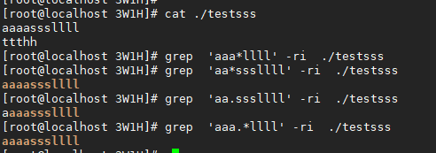

### 3、压缩文件

```less
tar –czf <压缩后名称>.tar.gz  <压缩文件>
-C

解压tar.gz命令是
tar -zxvf xx.tar.gz

解压tar.bz2的命令是
yum -y install bzip2
tar -jxvf xx.tar.bz2

zip -r mydata.zip mydata
//解压至指定目录

unzip mydata.zip -d mydatabak
```


### 4、文件的软/硬链接<suricata安装>

```less
ln -s <src源文件> <dst目标文件>  //硬链接去除 -s 软可以跨磁盘，硬不行。  硬删了个文件不影响
rm dst

ls -l | grep ^l
```

```less
// 软连接库问题
   通常在软件编译时出现的usr/bin/ld: cannot find -lxxx的错误，主要的原因是库文件并没有导入的ld检索目录中。
   解决方式：
  1。确认库文件是否存在，比如-l123, 在/usr/lib, /usr/local/lib,或者其他自定义的lib下有无lib123.so, 如果只是存在lib123.so.1,
      那么可以通过ln -sv lib123.so.1   lib123.so，建立一个连接重建lib123.so.
   2。检查/etc/ld.so.conf中的库文件路径是否正确，如果库文件不是使用系统路径，/usr/lib, /usr/local/lib, 那么必须在文件中加入。
   3。ldconfig 重建ld.so.cache文件，ld的库文件检索目录存放文件。尤其刚刚编译安装的软件，必须运行ldconfig，才能将新安装的
库文件导入ld.so.cache.
   4。测试，gcc -l123 --verbose.

// 例如：/usr/bin/ld: cannot find -libbz2
ln -sv ./libbz2.so.1 ./libbz2.so

// 问题：/usr/bin/ld: cannot find -libverbs
yum install libibverbs* // 此处特写，是因为需要安装的库名称有变化
ln -sv ./libibverbs.so.1 ./libibverbs.so

// 予以后吾谨记
// yum install libmlx5*
// yum install libboost*
// yum install libbsd-devel libbsd
// yum install  lz4  lz4-devel
// yum install xz-libs xz-devel //liblzma问题
// libz2的缺失，需要重新进行/usr/lib64的软连接
// x86目录中没有libunwind这个目录，需要在makefile中删除，然后yum安装，makefile中加入-lunwind
// 需改vim ./libdpdk-libs.pc中的路径
// 然后执行pkg-config --static --libs libdpdk是否正确执行，检验libdpdk所需的库是否有欠缺
// 重新make编译
```

### 5、动态库so编译链接

- 多个.so（动态库）无法合并为一个.so。
- 多个.a（静态库）可以合并为一个.so。命令是：

```bash
gcc -shared -o c.so -Wl,--whole-archive a.a b.a -Wl,--no-whole-archive
```

### 6、ldd库链接


```less
ldd example
# 即可查看相关so库的not found情况， 然后将对应的so库拷贝至/usr/lib文件夹下，再执行ldconfig即可。

cd vforce/cfg/conversionText
cp -r ./lib* /usr/lib/
ldconfig


// 实用举例
```

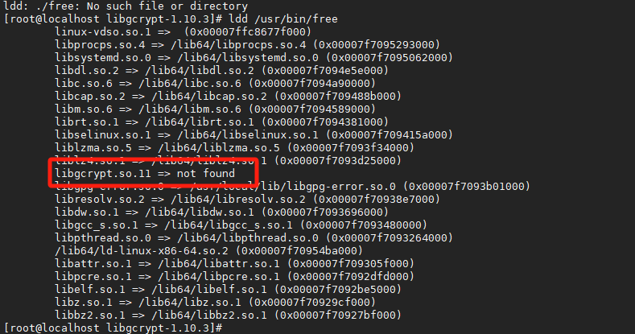

```less
最后我去37上拷贝了一个过来，当然也可以安装对应版本的库来解决
```

### 7、rm: argument list too long

```less
ls ./ | xargs -n 9 rm -rf
```


## 二、程序性信息相关命令

### 1、进程查线程

```less
//查看对应进程下启动的线程
ps -T -p 115067

top -H -p <pid>
top -Hp 48091

//显示所有运行中的进程：
ps aux | less
//任务：查看用户vivek运行的进程
ps -u vivek
//任务：使用ps列印进程树
ps -ejH
ps axjf
//任务：获得线程信息
ps -eLf
ps axms

//命令 ps，查看进程内存用量：
ps -eo uid,pid,rss,trs,pmem,stat,cmd


// gdb
1.查看进程: info inferiors
2.查看线程: info threads
3.查看线程栈结构: bt
4.切换线程: thread n (n代表第几个线程)
```


### 2、程序/命令计时器

```less
crontab -l 显示你的crontab文件

crontab -e // 编辑你的crontab文件,如果不存在,则创建一个新的crontab文件


crontab 定时任务
通过crontab 命令，我们可以在固定的间隔时间执行指定的系统指令或 shell script脚本。时间间隔的单位可以是分钟、小时、日、月、周及以上的任意组合。这个命令非常适合周期性的日志分析或数据备份等工作。

19.1. 命令格式
crontab [-u user] file crontab [-u user] [ -e | -l | -r ]
19.2. 命令参数
-u user：用来设定某个用户的crontab服务；
file：file是命令文件的名字,表示将file做为crontab的任务列表文件并载入crontab。如果在命令行中没有指定这个文件，crontab命令将接受标准输入（键盘）上键入的命令，并将它们载入crontab。
-e：编辑某个用户的crontab文件内容。如果不指定用户，则表示编辑当前用户的crontab文件。
-l：显示某个用户的crontab文件内容，如果不指定用户，则表示显示当前用户的crontab文件内容。
-r：从/var/spool/cron目录中删除某个用户的crontab文件，如果不指定用户，则默认删除当前用户的crontab文件。
-i：在删除用户的crontab文件时给确认提示。
19.3. crontab的文件格式
分 时 日 月 星期 要运行的命令

第1列分钟0～59
第2列小时0～23（0表示子夜）
第3列日1～31
第4列月1～12
第5列星期0～7（0和7表示星期天）
第6列要运行的命令
19.4. 常用方法
创建一个新的crontab文件
向cron进程提交一个crontab文件之前，首先要设置环境变量EDITOR。cron进程根据它来确定使用哪个编辑器编辑crontab文件。9 9 %的UNIX和LINUX用户都使用vi，如果你也是这样，那么你就编辑$HOME目录下的. profile文件，在其中加入这样一行:

EDITOR=vi; export EDITOR
然后保存并退出。不妨创建一个名为<user> cron的文件，其中<user>是用户名，例如， davecron。在该文件中加入如下的内容。

# (put your own initials here)echo the date to the console every
# 15minutes between 6pm and 6am
0,15,30,45 18-06 * * * /bin/echo 'date' > /dev/console
保存并退出。注意前面5个域用空格分隔。

在上面的例子中，系统将每隔1 5分钟向控制台输出一次当前时间。如果系统崩溃或挂起，从最后所显示的时间就可以一眼看出系统是什么时间停止工作的。在有些系统中，用tty1来表示控制台，可以根据实际情况对上面的例子进行相应的修改。为了提交你刚刚创建的crontab文件，可以把这个新创建的文件作为cron命令的参数:

$ crontab davecron
现在该文件已经提交给cron进程，它将每隔1 5分钟运行一次。同时，新创建文件的一个副本已经被放在/var/spool/cron目录中，文件名就是用户名(即dave)。

列出crontab文件
使用-l参数列出crontab文件:

$ crontab -l
0,15,30,45 18-06 * * * /bin/echo `date` > dev/tty1
可以使用这种方法在$HOME目录中对crontab文件做一备份:

$ crontab -l > $HOME/mycron
这样，一旦不小心误删了crontab文件，可以用上一节所讲述的方法迅速恢复。

编辑crontab文件
如果希望添加、删除或编辑crontab文件中的条目，而EDITOR环境变量又设置为vi，那么就可以用vi来编辑crontab文件:

$ crontab -e
可以像使用vi编辑其他任何文件那样修改crontab文件并退出。如果修改了某些条目或添加了新的条目，那么在保存该文件时， cron会对其进行必要的完整性检查。如果其中的某个域出现了超出允许范围的值，它会提示你。 我们在编辑crontab文件时，没准会加入新的条目。例如，加入下面的一条：

# DT:delete core files,at 3.30am on 1,7,14,21,26,26 days of each month
30 3 1,7,14,21,26 * * /bin/find -name 'core' -exec rm {} \;
保存并退出。

注解

最好在crontab文件的每一个条目之上加入一条注释，这样就可以知道它的功能、运行时间，更为重要的是，知道这是哪位用户的定时作业。

删除crontab文件
$crontab -r

19.5. 使用实例
实例1：每1分钟执行一次myCommand
* * * * * myCommand
实例2：每小时的第3和第15分钟执行
3,15 * * * * myCommand
实例3：在上午8点到11点的第3和第15分钟执行
3,15 8-11 * * * myCommand
实例4：每隔两天的上午8点到11点的第3和第15分钟执行
3,15 8-11 */2  *  * myCommand
实例5：每周一上午8点到11点的第3和第15分钟执行
3,15 8-11 * * 1 myCommand
实例6：每晚的21:30重启smb
30 21 * * * /etc/init.d/smb restart
实例7：每月1、10、22日的4 : 45重启smb
45 4 1,10,22 * * /etc/init.d/smb restart
实例8：每周六、周日的1 : 10重启smb
10 1 * * 6,0 /etc/init.d/smb restart
实例9：每天18 : 00至23 : 00之间每隔30分钟重启smb
0,30 18-23 * * * /etc/init.d/smb restart
实例10：每星期六的晚上11 : 00 pm重启smb
0 23 * * 6 /etc/init.d/smb restart
实例11：每一小时重启smb
* */1 * * * /etc/init.d/smb restart
实例12：晚上11点到早上7点之间，每隔一小时重启smb
0 23-7 * * * /etc/init.d/smb restart
```


### 3、查看程序运行配置文件

```less
psen    <ps -en>
```

### 4、查看c编译执行程序汇编代码

```less
# 编译时加入 -O2 选项
objdump -S  可执行文件名称
```

### 5、查/删共享内存段

```less
ipcs -m | grep 0x020202020 | awk {printf$2}

ipcrm -s <shmid>
```

### 6、进程开启FD查询

```less
ll /proc/96595/fd | wc -l
```

### 7、查看线程fd

```less
ll /proc/1118/fd | wc -l
```

### 8、查看进程占用的句柄数

```less
lsof -n | awk '{print $2}' | sort | uniq -c | sort -nr | more // 前面为使用的句柄数目、后面为进程号
```

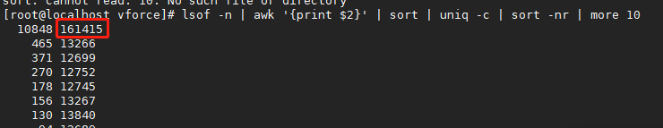

### 9、gdb-debuinfo关闭

```less
# 关闭每次调试的Downloading separate debug info for
set debuginfod enabled off  // 没用

// gdb时禁止下载调试信息
set auto-solib-add off
```


## 三、Linux系统信息相关命令

### 1、linux运行服务查询

```less
//全部服务
systemctl list-unit-files

//正在运行的服务
systemctl | grep running
```

### 2、ps/kill

```less
ps -a | grep -i redis | xargs kill -9
ps -a | grep Suricata-Main | awk '{print $1}' | sudo xargs kill -9
ps aux | grep -i "Vforce" | awk '{print $2}' | xargs kill -9
//查看守护指令
ps -e
//进程查看
ps -aux | grep <进程名/进程ID>

// kill无法杀死的进程
问题描述
在ubuntu下 kill -9 杀死进程时候发现杀不死，或者是杀死了立刻又重启。
原因是该进程的父进程还在，所以会杀死进程后又自动启动了，看起来是我们没kill掉一样。

解决方法
ps -aux   #查看所有进程，找到需要kill的PID号。 假设该进程的PID号是18478
cd /proc/18478    #cd /proc/PID号
cat status   #查看该PID号对应的父进程，即找到PPID这个进程号，假设是1000
kill -9 1000    #先杀死父进程
kill -9 18478   #再杀死该进程，即可
```

### 3、审查shell

```less
maintain upinfo
last -x reboot
last -n 5 -a -i

//对比文件夹
diff
//shell类型
echo $0
```

### 4、lspci/lscpu信息(网卡NUMA)

```less
// 查看pci版本
dmidecode | grep "PCI"
// 查看pci通道数
lspci -vv | grep -i 'LnkCap'

for nic in $(ls /sys/class/net/); do
    pci_address=$(ethtool -i $nic 2>/dev/null | grep 'bus-info' | awk '{print $2}')
    echo "IF-Name: $nic, PCI: $pci_address"
done


lscpu

// 网卡pci查看numa节点
cat /sys/bus/pci/devices/0000\:21\:00.0/numa_node

cat /proc/cpuinfo | grep <cpu参数>

//内存大小
cat /proc/meminfo | grep MemTotal
//逻辑核：针对超线程 siblings
//cpu核数：processor cores（每个cpu的物理核数目）
//sockets：插槽，物理CPU数；
```


```less
//查看当前linux内核的启动参数
cat /proc/cmdline
//修改启动参数  目录不固定
vim /boot/grub2/grub.cfg文件（一般在99行）

/* 找到Linux16 /vmlinuz-3.10.0-327.el7.x86_64 root=UUID=e542e506-5ae4-45a4-b6c2-b31eecec23e3 ro crashkernel=auto rd.lvm.lv=centos/swap rhgb quiet LANG=en_US.UTF-8这行
   在后面加上isolcpus的参数，如果在启动的时候配置启动参数 isolcpus=2,3。那么系统启动后将不使用CPU3和CPU4。
   配置后进行重启机器
   启动以后通过cat /proc/cmdline命令进行验证*/


// 具体可看下图
# 总核数 = 物理CPU个数 X 每颗物理CPU的核数 
# 总逻辑CPU数 = 物理CPU个数 X 每颗物理CPU的核数 X 超线程数

# 查看<物理CPU>个数
cat /proc/cpuinfo| grep "physical id"| sort| uniq| wc -l

# 查看每个物理<CPU中core>的个数(即核数)
cat /proc/cpuinfo| grep "cpu cores"| uniq

# 查看逻辑CPU的个数
cat /proc/cpuinfo| grep "processor"| wc -l
```

另可查看：


```less
一个socket插槽<numa节点>上是一个cpu芯片<物理cpu>
一个cpu物理芯片上可以有多个cpu(例如手机芯片：一般有一个主核心和七个处理器)
一个cpu可以有多个core
一个core上面可以搭载多个thread
```


```apl
lscpu

Architecture: #架构
CPU op-mode(s): #支持的模式
Byte Order: #字节排序的模式，常用小端模式
CPU(s): #逻辑cpu颗数(超线程包含)
On-line CPU(s) list: #在线的cpu数量 有故障或者过热时，某些CPU会停止运行而掉线
Thread(s) per core: #每个核心的线程
Core(s) per socket: #每个cpu插槽核数/每颗物理cpu核数
CPU socket(s): #cpu插槽数，即：物理cpu的数量
NUMA node(s): #有几个NUMA节点
Vendor ID: #cpu厂商ID
CPU family: #厂商设定的CPU家族编号
Model: #型号
Model name: #型号名称
Stepping: #步进,可以理解为同一型号cpu的版本号
CPU MHz: #cpu主频
BogoMIPS: #估算MIPS, MIPS是每秒百万条指令
Hypervisor vendor: #虚拟化技术的提供商
Virtualization type: #cpu支持的虚拟化技术的类型
L1d cache: #一级高速缓存 dcache 用来存储数据 data
L1i cache: #一级高速缓存 icache 用来存储指令 instruction
L2 cache: #二级缓存
L3 cache: #三级缓存
NUMA node0 CPU(s): 0-3 //四个cpu在同一个numa节点node0上
Flags: cpu支持的技术特征


cat /cpuinfo
# 查看网卡的详细信息  -A 指定查找对象后继续显示几行
lspci -vvv | grep -i ether -A 10
lspci -nn | grep Eth    (lspci | grep -i ether)

$内存大页信息
numastat -m


#查看网卡的numa套接字 依据网卡的pci地址
lspci | grep Eth
cat /sys/bus/pci/devices/0000\:00\:03.2//numa_node
```

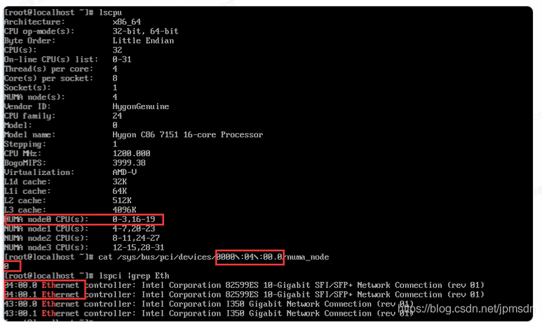


```less
#网卡速率等性能查看
lspci -s 82:00.1 -vv

/* lspci以下方法检查 PCI 插槽的速度 */
lspci -s 82:00.1 -vv | grep LnkSta
```

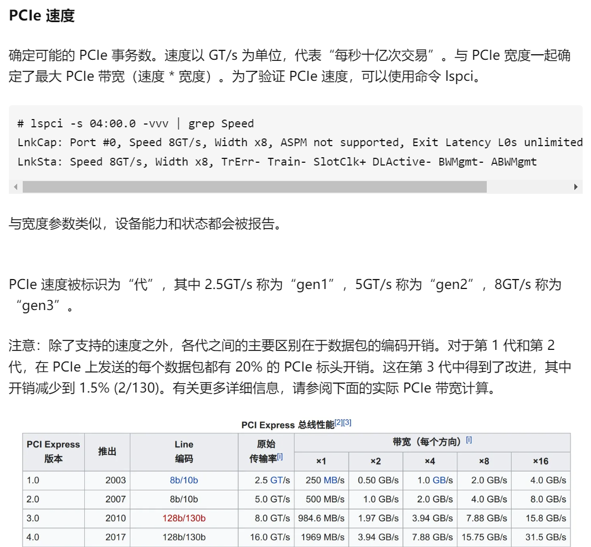


### 5、linux的cache信息

```less
/sys/devices/system/cpu/cpu0/cache
cat ./index0/level

例如：
cat /sys/devices/system/cpu/cpu0/cache/index0/coherency_line_size 
64 //即为对应cpu cacheline大小
```


### 6、用户创建 赋权

```less
useradd wangchen /* 不加-r */
passwd wangchen


visudo
写入文件：wangchen ALL=(ALL)       NOPASSWD: NOPASSWD: ALL#这个是新增的用户

#出现切换用户是bash的状况
cp -a /etc/skel/. /home/wangchen

#目录赋权
chown -R wangchen:wangchen /home/wangchen/
```

### 7、CPU主频

```less
cat /sys/devices/system/cpu/cpu*/cpufreq/cpuinfo_cur_freq

1、查看CPU型号：cpu型号是E7-4820
[root@node1 ~]# cat /proc/cpuinfo | grep name | cut -f2 -d: | uniq -c
    32  Intel(R) Xeon(R) CPU E7- 4820  @ 2.00GHz

2、查看物理cpu个数：物理核心数是2核
[root@node1 ~]# cat /proc/cpuinfo | grep "physical id" | sort | uniq|wc -l
2

3、查看逻辑cpu的个数：逻辑cpu个数是32个
[root@node1 ~]# cat /proc/cpuinfo | grep "processor" |wc -l
32

4、查看cpu是几核：cpu是8核
[root@node1 ~]# cat /proc/cpuinfo | grep "cores"|uniq
cpu cores       : 8
```

### 8、who登录信息

```less
// 两个命令
w / who
```


### 9、检测cpu是否支持虚拟化

```less
本文所用服务器宿主机为CentOS 8.5 Minimal 64位，检查宿主机CPU是否支持虚拟化：
cat /proc/cpuinfo | egrep '(vmx|svm)' | wc -l;
24
结果大于0表示支持虚拟化，可以放心做KVM虚拟化安装了。

注意：检索结果有 vmx 或者 svm 就说明支持 VT ；如果没有任何的输出，说明你的 cpu 不支持，将无法成功安装 KVM 虚拟机。
```

### 10、硬中断

```less
硬中断期间是不能再进行另外的硬中断的
，也就是说不能嵌套。 所以硬中断处理函数（handler）执行时，会屏蔽部分或全部（新的）硬中断。
这就要求硬中断要尽快处理，然后关闭这次硬中断，这样下次硬中断才能再进来；
但是另一方面，中断被屏蔽的时间越长，丢失事件的可能性也就越大； 可以想象，如果一次硬中断时间过长，ring buffer 会被塞满导致丢包。
所以，
所有耗时的操作都应该从硬中断处理逻辑中剥离出来
， 硬中断因此能尽可能快地执行，然后再重新打开。软中断就是针对这一目的提出的。


mpstat -P ALL 1 // 里面的 %irq一列即说明了CPU忙于处理中断的时间占比

cat /proc/interrupts // 各个cpu的中断
第一列：中断号；
中间各列：在每个 CPU 上的中断次数；
最后一列：负责处理这种中断的函数，也叫 中断服务例程 （Interrupt Service Routines –ISR）。

cat /proc/interrupts | awk -F' ' '{print $NF}'   // 查看系统硬中断函数回调 倒数第二行表示为$(NF-1)
```

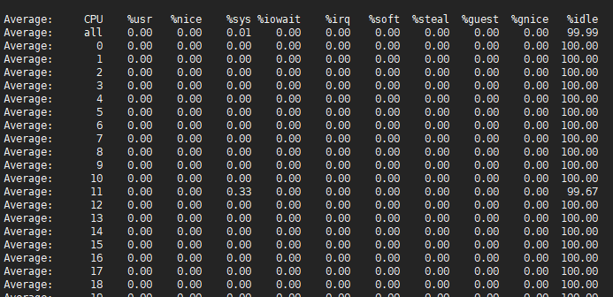

```less
# 如果我们查看pcu中断的倒数第二行：就会发现其不同的cpu中断类型
				    倒数第一列：则是中断函数

在cpu源码中，争对不同的cpu中断类型，存在不同的调用中断回调的函数： LSI 是级别触发的， MSI 是边缘触发的
		handle_level_irq  // 级别触发
		handle_fasteoi_irq  // 电平中断
		handle_edge_irq  //边缘触发
```

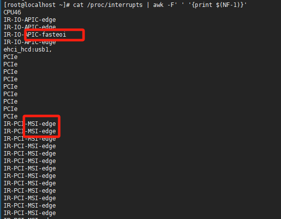

```less
对于常用的：edge与fasteoi区别
	edge边沿触发分上升沿触发和下降沿触发，简单说就是电平变化那一瞬间进行触发。// 即只有从"无包"-->"收到包"这状态改变时会触发
    fasteoi电平触发也有高电平触发、低电平触发，一般都是低电平触发。如果是低电平触发，那么在低电平时间内中断一直有效。
    如果在电平没有恢复之前就退出中断程序，那么会在退出后又再次进入中断。只要不退出是不会重复触发的 // 即：只要有包就一直触发
```

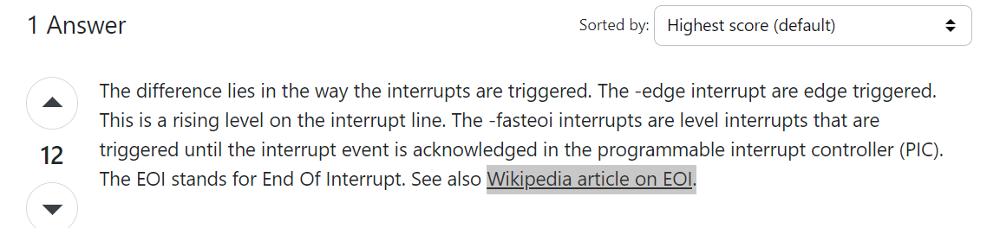

### 11、系统内存命令

```less
numastat -cm 
numastat -cm | egrep 'Node|Huge' 

 free -b // 单位为 B
 free -k // 单位为 KB
 free -m // 单位为 M
 free -g // 单位为 G
 free -h // 自适应单位
```

### 12、系统版本

```less
cat /etc/redhat-release
```

### 13、内核core相关参数

```less
sysctl net.core
// 标红的一个是系统网课ring一次性可以收包的数量，另一个即是网卡的rss-key值

cat /proc/net/ptype
// 收包类型 ： ip arp ipv6
```

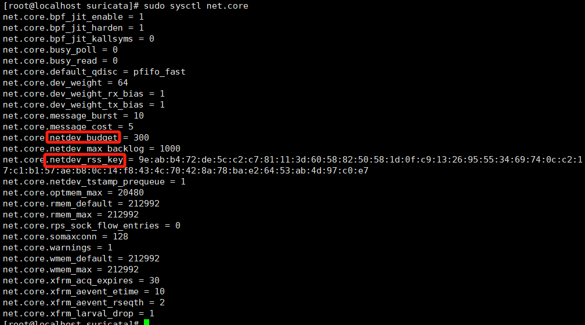


### 14、core文件

```less
// 默认路径
/var/lib/systemd/coredump

ulimit -c unlimited
cd /proc/sys/kernel/
echo "./core-%e-%p-%t.core" > core_pattern
```


### 15、linux时间函数

```less
1、time函数
头文件：time.h
函数定义：time_t time (time_t *t)
说明：
 返回从1970年1月1日的UTC时间从0时0分0妙算起到现在所经过的秒数。
举例如下：

#include<stdio.h>
#include<time.h>
int main(){
 time_t timep;
 
 long seconds = time(&timep);
 printf("%ld\n",seconds);
 printf("%ld\n",timep);
 return 0;
}
输出：


有兴趣的同学可以计算下，从1970年1月1日0时0分0秒到现在经历了多少秒。

附：time_t 一路追踪发现就是从long类型经过不断的typedef ,#define定义过来的。

2、ctime函数
定义：char *ctime(const time_t *timep);
说明：将参数所指的time_t结构中的信息转换成真实世界的时间日期表示方法，然后将结果以字符串形式返回。
注意这个是本地时间。
举例如下：

#include <stdio.h>
#include<time.h>
int main(void) {
 time_t timep;
 
 time(&timep);
 printf("%s\n",ctime(&timep));
 return 0;
}
输出：


3、gmtime函数
定义：struct tm *gmtime(const time_t *timep);
说明：将参数timep所指的time_t结构中的信息转换成真实世界所使用的时间日期表示方法，然后将结果由结构tm返回。此函数返回的时间日期未经时区转换，而是UTC时间。
举例如下：

#include <stdio.h>
#include<time.h>
 
int main(void) {
 char *wday[] = {"Sun","Mon","Tue","Wed","Thu","Fri","Sat"};
 
 time_t timep;
 struct tm *p;
 
 time(&timep);
 p = gmtime(&timep);
 printf("%d/%d/%d ",(1900+p->tm_year),(1+p->tm_mon),p->tm_mday);
 printf("%s %d:%d:%d\n",wday[p->tm_wday],p->tm_hour,p->tm_min,p->tm_sec);
 return 0;
}
输出：


4、 strftime函数
#include <time.h> 
定义：  
size_t strftime(char *s, size_t max, const char *format,const struct tm *tm);
说明：
类似于snprintf函数，我们可以根据format指向的格式字符串，将struct tm结构体中信息输出到s指针指向的字符串中，最多为max个字节。当然s指针指向的地址需提前分配空间，比如字符数组或者malloc开辟的堆空间。
其中，格式化字符串各种日期和时间的详细的确切表示方法有如下多种，我们可以根据需要来格式化各种各样的含时间字符串。
    %a 星期几的简写
    %A 星期几的全称
    %b 月分的简写
    %B 月份的全称
    %c 标准的日期的时间串
    %C 年份的前两位数字
    %d 十进制表示的每月的第几天
    %D 月/天/年
    %e 在两字符域中，十进制表示的每月的第几天
    %F 年-月-日
    %g 年份的后两位数字，使用基于周的年
    %G 年分，使用基于周的年
    %h 简写的月份名
    %H 24小时制的小时
    %I 12小时制的小时
    %j 十进制表示的每年的第几天
    %m 十进制表示的月份
    %M 十时制表示的分钟数
    %n 新行符
    %p 本地的AM或PM的等价显示
    %r 12小时的时间
    %R 显示小时和分钟：hh:mm
    %S 十进制的秒数
    %t 水平制表符
    %T 显示时分秒：hh:mm:ss
    %u 每周的第几天，星期一为第一天 （值从0到6，星期一为0）
    %U 第年的第几周，把星期日做为第一天（值从0到53）
    %V 每年的第几周，使用基于周的年
    %w 十进制表示的星期几（值从0到6，星期天为0）
    %W 每年的第几周，把星期一做为第一天（值从0到53）
    %x 标准的日期串
    %X 标准的时间串
    %y 不带世纪的十进制年份（值从0到99）
    %Y 带世纪部分的十制年份
    %z，%Z 时区名称，如果不能得到时区名称则返回空字符。
    %% 百分号
返回值：
成功的话返回格式化之后s字符串的字节数，不包括null终止字符，但是返回的字符串包括null字节终止字符。否则返回0，s字符串的内容是未定义的。值得注意的是，这是libc4.4.4以后版本开始的。对于一些的老的libc库，比如4.4.1，如果给定的max较小的话，则返回max值。即返回字符串所能容纳的最大字节数。
举例如下：

  1 #include <stdio.h>
  2 #include <time.h>
  3 
  4 #define BUFLEN 255
  5 int main(int argc, char **argv)
  6 {
  7     time_t t = time( 0 );   
  8     char tmpBuf[BUFLEN];   
  9                                                                             
 10     strftime(tmpBuf, BUFLEN, "%Y%m%d%H%M%S", localtime(&t)); //format date a
 11     printf("%s\n",tmpBuf);
 12     return 0;
 13 }
执行结果如下：


输出结果表示YYYYmmDDHHMMSS

5、 asctime函数
定义：
char *asctime(const struct tm *timeptr);
说明：
 将参数timeptr所指的struct tm结构中的信息转换成真实时间所使用的时间日期表示方法，结果以字符串形态返回。与ctime()函数不同之处在于传入的参数是不同的结构。
返回值：
 返回的也是UTC时间。
举例如下：

#include <stdio.h>
#include <stdlib.h>
#include<time.h>
int main(void) {
 time_t timep;
 
 time(&timep);
 printf("%s\n",asctime(gmtime(&timep)));
 return EXIT_SUCCESS;
}
输出：


6、 localhost函数
struct tm *localhost(const time_t *timep);
取得当地目前的时间和日期
举例如下：

#include <stdio.h>
#include <stdlib.h>
#include<time.h>
 
int main(void) {
 char *wday[] = {"Sun","Mon","Tue","Wed","Thu","Fri","Sat"};
 time_t timep;
 struct tm *p;
 
 time(&timep);
 p = localtime(&timep);
 printf("%d/%d/%d ",(1900+p->tm_year),(1+p->tm_mon),p->tm_mday);
 printf("%s %d:%d:%d\n",wday[p->tm_wday],p->tm_hour,p->tm_min,p->tm_sec);
 return EXIT_SUCCESS;
}
输出：


7、mktime函数
定义：time_t mktime(struct tm *timeptr);
说明：
 用来将参数timeptr所指的tm结构数据转换成从1970年1月1日的UTC时间从0时0分0妙算起到现在所经过的秒数。
举例如下：

#include <stdio.h>
#include <stdlib.h>
#include<time.h>
 
int main(void) {
 time_t timep;
 struct tm *p;
 
 time(&timep);
 printf("time():%ld\n",timep);
 p = localtime(&timep);
 timep = mktime(p);
 printf("time()->localtime()->mktime():%ld\n",timep);
 return EXIT_SUCCESS;
}
输出：


8、 gettimeofday函数
结构体timeval 定义如下：

struct timeval{
 long tv_sec; /*秒*/
 long tv_usec; /*微秒*/
};
结构体timezone定义如下：

struct timezone{
 int tz_minuteswest; /*和greenwich时间差了多少分钟*/
 int tz_dsttime; /*日光节约时间的状态*/
}
举例如下：

#include <stdio.h>
#include <stdlib.h>
#include<time.h>
#include<sys/time.h>
 
int main(void) {
struct timeval tv;
struct timezone tz;
gettimeofday(&tv,&tz);
printf("tv_sec :%d\n",tv.tv_sec);
printf("tv_usec: %d\n",tv.tv_usec);
printf("tz_minuteswest:%d\n",tz.tz_minuteswest);
printf("tz_dsttime:%d\n",tz.tz_dsttime);
return EXIT_SUCCESS;
}
```


### 16、内存、网卡型号

```less
dmidecode -t memory | grep 'Part Number:' | awk -F': ' '{printf "%s ", $2}' | sed 's/ *$//' | xargs echo
dmidecode -t memory | grep '^[[:space:]]*Type:' | awk -F': ' '{if ($2 != "Unknown") printf "%s ", $2}' | sed 's/ *$//' | xargs echo

lspci | grep Ether | awk  '{if($6 ~ /[1-9]\d*/){printf "%-10s%-10s\n",$1,$6}else if($7 ~ /[1-9]\d*/){printf "%-10s%-10s\n",$1,$7}else if($8 ~ /[1-9]\d*/){printf "%-10s%-10s\n",$1,$8}}' 
```


### 17、网关ip、mac查看

```less
route -n
```

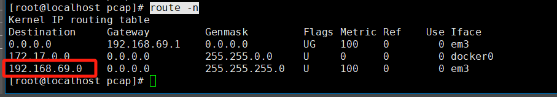

```less
arp -n
```

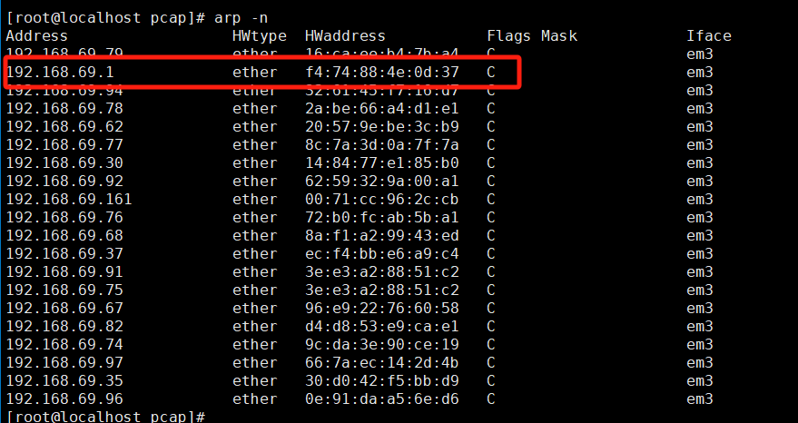


### 18、字符串-Hex转换

```c

unsigned char line[16];
for (int i = 0; i < 16; ++i) {
        line[i] = hexCharToByte(pLine[2 * i], pLine[2 * i + 1]);
    }


static uint8_t hexCharToByte(char high, char low) {
    uint8_t highNibble = (high >= '0' && high <= '9') ? (high - '0') : (high - 'A' + 10);
    uint8_t lowNibble = (low >= '0' && low <= '9') ? (low - '0') : (low - 'A' + 10);
    return (highNibble << 4) | lowNibble;
}
```


### 19、jq排序查询

```less
cat ./isakmp/20241213/isakmp_2024121316090200000.txt|jq .exchange_type|sort|uniq

 find ./ -type f -name "*.txt" -exec sh -c 'jq -r ".fileSavePath" "{}"' \; | sort | uniq
```


### 20、yum源

```less
# 直接测试 repodata 文件：判断源是否可用 返回 200 OK 说明该源可用，返回 timeout 或 404 说明该源无法使用。
curl -I http://mirrors.aliyun.com/centos/7/os/x86_64/repodata/repomd.xml
curl -I http://mirrors.tuna.tsinghua.edu.cn/centos/7/os/x86_64/repodata/repomd.xml
curl -I http://mirrors.163.com/centos/7/os/x86_64/repodata/repomd.xml
curl -I http://mirror.centos.org/centos/7/os/x86_64/repodata/repomd.xml


# 阿里源
sudo cp /etc/yum.repos.d/CentOS-Base.repo /etc/yum.repos.d/CentOS-Base.repo.bak
wget -O /etc/yum.repos.d/CentOS-Base.repo http://mirrors.aliyun.com/repo/Centos-7.repo
yum clean all
yum makecache
yum update

#启用 EPEL（Extra Packages for Enterprise Linux）仓库
yum install -y epel-release
# 如果导致了yum出问题，就删除，然后clean重新makecache
yum remove -y centos-release-scl
```


### 21、网卡配置

配置网卡ip地址时候，要看网卡是否是running状态，才表示该网卡连接网线被使用，才可以用以配置网卡；

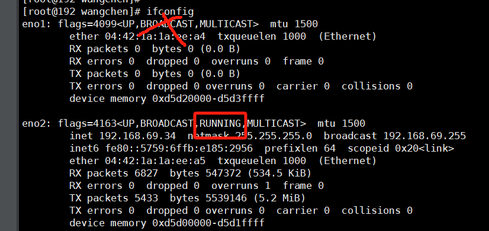

```bash
vim /etc/sysconfig/network-scripts/ifcfg-eno2 
```

如果网络接口 `eno2` 上有两个 IPv4 地址，分别是：

1. **192.168.69.92/24**：主地址，属于该网络接口的主 IP 地址，动态分配的 IP 地址。
2. **192.168.69.34/24**：辅助地址（secondary address），可能是手动配置或者是某些特定配置（例如多重 IP 地址绑定或虚拟化环境中的网卡共享）造成的。

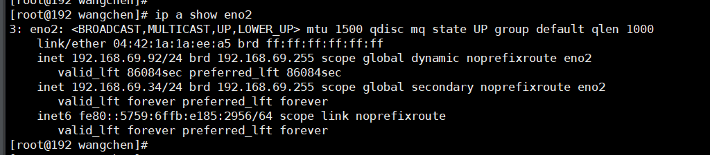

原因解析：

1. **多个 IP 地址绑定（多重地址）**：
    - 在同一网络接口上，可以配置多个 IP 地址。这种做法通常用于实现主机多网段通信或者是负载均衡/高可用性设置。
    - 你看到的 `192.168.69.34` 是一个 **辅助地址**，这个地址并没有直接与 `eno2` 接口的默认路由关联，它只是作为一个额外的 IP 地址配置。可能是系统管理员手动配置的，或者是某些服务或虚拟机分配的地址。
2. **动态 IP 和静态 IP 配置**：
    - `192.168.69.92` 可能是通过 DHCP 或其他动态方式获得的，而 `192.168.69.34` 可能是手动配置或其他应用程序为服务所分配的静态 IP 地址。

打开配置文件修改

```bash
#  vi /etc/sysconfig/network-scripts/ifcfg-eno2

TYPE=Ethernet
#BOOTPROTO=dncp 修改不通过 DHCP 动态分配 IP 地址。
BOOTPROTO=none
NAME=eno2
DEVICE=eno2
ONBOOT=yes
IPADDR=192.168.69.34
PREFIX=24
GATEWAY=192.168.69.1   # 设置适当的网关地址
NETMASK=255.255.255.0
```

**1. 使用 `nmcli` 命令（NetworkManager命令行工具）**

CentOS 8 默认使用 `NetworkManager` 来管理网络接口，因此你可以通过 `nmcli` 工具进行配置。

**步骤：**

1. **列出所有连接**： 通过以下命令查看当前系统中所有的网络连接：

    ```bash
    nmcli connection show
    ```

    你会看到一个连接列表，其中包含 `eno2` 网络接口。通常，连接名称会是 `eno2`，也可能是其他名称（如 `System eno2` 或 `Wired connection 1` 等）。

2. **删除不需要的 IP 地址**： 使用 `nmcli connection` 命令删除不需要的 IP 地址（例如 `192.168.69.92`）。

    ```bash
    nmcli connection modify eno2 ipv4.addresses 192.168.69.34/24
    ```
    
    这将设置 `eno2` 接口的 IP 地址为 `192.168.69.34/24`**，并移除之前设置的其他地址。**
    

```bash
# 重新启动网络连接： 使更改生效
nmcli connection down eno2 && nmcli connection up eno2

# centos7/8d都可以：重启网卡服务，重新查看配置如何
systemctl restart NetworkManager
ip a show eno2
nmcli connection show
```

成功：

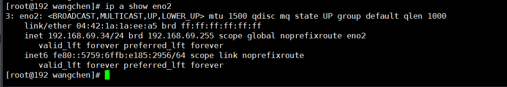


### 22、centos8安装out of range报错

​		出现这个错误提示就是**因为rpm包的版本太低导致的**，问题是使用yum或者dnf安装的时候是要用到原始的rpm的，所以这里升级rpm自己也是报相同的错误

**解决方法**：不要使用yum/dnf升级rpm，先下载相关包再手动升级；

```less
C:\z-company\bfhy-work\vpp-master\centos8-rpm

// 需要先安装zlib
yum install -y zlib-devel
// 再执行安装命令：
	rpm -Uvh --noverify --noplugins --nodigest --nosignature rpm-4.14.3-19.el8.x86_64.rpm rpm-libs-4.14.3-19.el8.x86_64.rpm rpm-build-libs-4.14.3-19.el8.x86_64.rpm python3-rpm-4.14.3-19.el8.x86_64.rpm rpm-plugin-selinux-4.14.3-19.el8.x86_64.rpm rpm-plugin-systemd-inhibit-4.14.3-19.el8.x86_64.rpm ima-evm-utils-1.3.2-12.el8.x86_64.rpm elfutils-libs-0.185-1.el8.x86_64.rpm elfutils-libelf-0.185-1.el8.x86_64.rpm elfutils-libelf-devel-0.185-1.el8.x86_64.rpm tpm2-tss-2.3.2-4.el8.x86_64.rpm

## centos8不要update，否则会极大概率引起glibc的更新，导致系统崩溃（3次） ：https://blog.csdn.net/eggxo/article/details/136465370
// 之后就可以重新install/update
// dnf update --nogpgcheck
```


### 23、centos8的软件网址配置

网站：https://vault.centos.org/8.5.2111/BaseOS/x86_64/os/

解决该问题的办法主要通过网络在线的方式下载。

```less
	1、首先选择 “Network & Host Name”，进入配置网络，是的主机可以访问互联网。
	2、上一步保存退出后，现在进入 "Installation Source"，选中 "On the network:" 一栏，"注意是：https"并在其中编辑写入 URL： vault.centos.org/8.5.2111/BaseOS/x86_64/os/，并将前缀选择为 https://，选择 URL type： 为 repository URL。
```

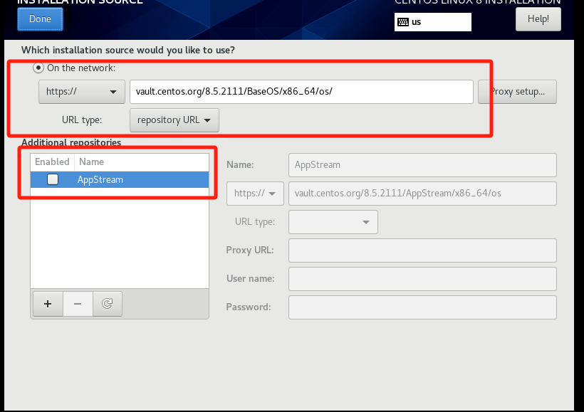

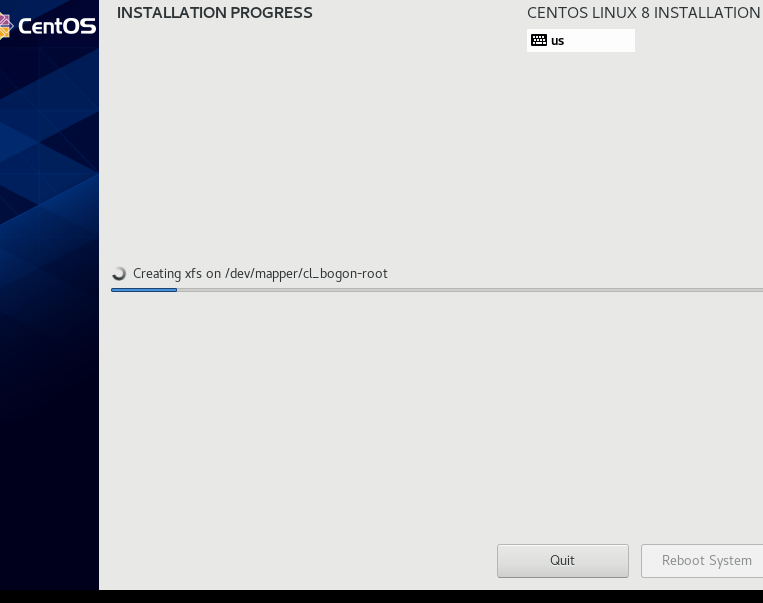


### 24、centos8禁用 `systemd-resolved` 并使用传统的 `resolv.conf`

1. **禁用 `systemd-resolved` 服务**： 你可以禁用 `systemd-resolved` 服务，这样它就不会再覆盖 `/etc/resolv.conf` 文件。

    ```bash
    sudo systemctl stop systemd-resolved
    sudo systemctl disable systemd-resolved
    ```

2. **删除符号链接**： `systemd-resolved` 使用符号链接将 `/etc/resolv.conf` 指向 `/run/systemd/resolve/stub-resolv.conf`。你需要删除这个符号链接，并恢复到传统的配置方式。

    ```bash
    sudo rm /etc/resolv.conf
    ```

3. **手动创建新的 `resolv.conf` 文件**： 然后，你可以手动创建 `/etc/resolv.conf` 文件并添加你想要的 DNS 服务器。

    ```bash
    sudo vim /etc/resolv.conf
    ```

    然后添加以下内容（例如，使用 Google 的 DNS）：

    ```bash
    nameserver 8.8.8.8
    nameserver 8.8.4.4
    ```

4. **重启网络服务**： 重新启动网络服务，以确保新的 DNS 配置生效：

    ```bash
    systemctl restart NetworkManager
    ```

**验证：dig google.com**

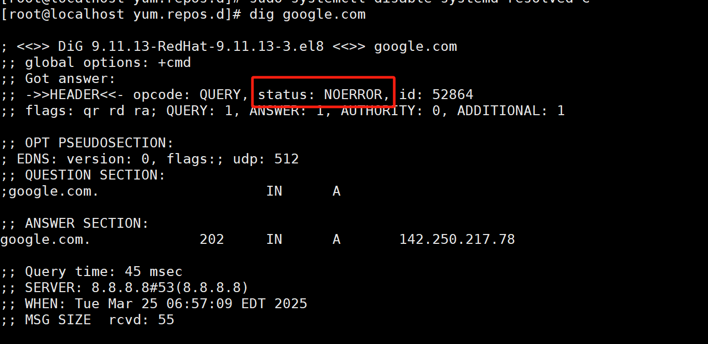


### 25、centos9启动远程root登录

在 CentOS 9 中，默认情况下，远程登录的 root 用户是禁用的。要允许远程登录 root 用户，你需要修改 SSH 配置文件和系统设置。以下是开启远程 root 登录的步骤：

1. **编辑 SSH 配置文件**： 打开 SSH 配置文件 `/etc/ssh/sshd_config`。

    ```bash
    sudo vi /etc/ssh/sshd_config
    ```

2. **修改 `PermitRootLogin` 配置项**： 找到配置项 `PermitRootLogin`，将它的值修改为 `yes`，如果没有该行则添加。

    ```bash
    PermitRootLogin yes
    ```

3. **保存并关闭文件**： 修改完配置文件后，保存并退出编辑器（在 `vi` 中按 `Esc` 键，然后输入 `:wq` 保存并退出）。

4. **重启 SSH 服务**： 配置修改完成后，需要重启 SSH 服务以使更改生效。

    ```bash
    sudo systemctl restart sshd
    ```


### 26、Linux内核版本移除

```less
rpm -q kernel
//它会列出所有已安装的内核，例如：
//kernel-3.10.0-1127.el7.x86_64
//kernel-3.10.0-1160.el7.x86_64
//kernel-3.10.0-1160.42.2.el7.x86_64

//删除旧内核
yum remove kernel-3.10.0-1127.el7.x86_64
```


### 27、网口光口启动

```less
连接好光纤

ifconfig p1p1 promisc
ifconfig p1p2 promisc
ifconfig p1p1 up
ifconfig p1p2 up
ip link set p1p1 up
ip link set p1p2 up

光口启亮
```


### 28、iperf

```less
ifconfig p1p1 192.168.1.22 netmask 255.255.255.0 up
ifconfig ens33 192.168.1.23 netmask 255.255.255.0 up

// iperf 59
iperf3 -s -B 192.168.1.1 -p 5201
iperf3 -c 192.168.1.1  -p 5201 -t 30

iperf3 -c 192.168.1.100 -B 192.168.1.2 -p 5201 -t 30
```


### 29、ssh连接密钥调整

```less
ssh-keygen -R 192.168.69.38
ssh-keyscan -H 192.168.69.38 >> ~/.ssh/known_hosts
ssh 192.168.69.38
```


### 2x、top命令

```less
行车过桥
　　一只单核的处理器可以形象得比喻成一条单车道。设想下，你现在需要收取这条道路的过桥 费 — 忙于处理那些将要过桥的车辆。你首先当然需要了解些信息，例如车辆的载重、以及 还有多少车辆正在等待过桥。如果前面没有车辆在等待，那么你可以告诉后面的司机通过。 如果车辆众多，那么需要告知他们可能需要稍等一会。
　　因此，需要些特定的代号表示目前的车流情况，例如：
　　0.00 表示目前桥面上没有任何的车流。 实际上这种情况与 0.00 和 1.00 之间是相同的，总而言之很通畅，过往的车辆可以丝毫不用等待的通过。
　　1.00 表示刚好是在这座桥的承受范围内。 这种情况不算糟糕，只是车流会有些堵，不过这种情况可能会造成交通越来越慢。
　　超过 1.00，那么说明这座桥已经超出负荷，交通严重的拥堵。 那么情况有多糟糕？ 例如 2.00 的情况说明车流已经超出了桥所能承受的一倍，那么将有多余过桥一倍的车辆正在焦急的等待。3.00 的话情况就更不妙了，说明这座桥基本上已经快承受不了，还有超出桥负载两倍多的车辆正在等待。
　　上面的情况和处理器的负载情况非常相似。一辆汽车的过桥时间就好比是处理器处理某线程 的实际时间。Unix 系统定义的进程运行时长为所有处理器内核的处理时间加上线程 在队列中等待的时间。
　　和收过桥费的管理员一样，你当然希望你的汽车（操作）不会被焦急的等待。所以，理想状态 下，都希望负载平均值小于 1.00 。当然不排除部分峰值会超过 1.00，但长此以往保持这 个状态，就说明会有问题，这时候你应该会很焦急。
　　“所以你说的理想负荷为 1.00 ？”
　　嗯，这种情况其实并不完全正确。负荷 1.00 说明系统已经没有剩余的资源了。在实际情况中 ，有经验的系统管理员都会将这条线划在 0.70：
　　“需要进行调查法则”： 如果长期你的系统负载在 0.70 上下，那么你需要在事情变得更糟糕之前，花些时间了解其原因。
　　“现在就要修复法则”：1.00 。 如果你的服务器系统负载长期徘徊于 1.00，那么就应该马上解决这个问题。否则，你将半夜接到你上司的电话，这可不是件令人愉快的事情。
　　“凌晨三点半锻炼身体法则”：5.00。 如果你的服务器负载超过了 5.00 这个数字，那么你将失去你的睡眠，还得在会议中说明这情况发生的原因，总之千万不要让它发生。

// 查看某些或者某个进程
top -p pid
```

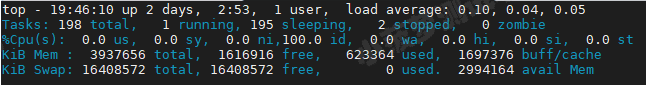

```less
// 前五行，即列表上方的五行

第一行：输出系统任务队列信息
18:46:38：系统当前时间  // date命令查看
up 2days 1:54：系统开机后到现在的总运行时间 // 
1 user：当前登录用户数  // 可以通过 who 命令查看
load average: 0, 0.01, 0.05：系统负载，系统运行队列的平均利用率，可认为是可运行进程的平均数；三个数值分别为 1分钟、5分钟、15分钟前到现在的平均值；单核CPU中load average的值=1时表示满负荷状态，多核CPU中满负载的load average值为1*CPU核数

第二行：任务进程信息
total：系统全部进程的数量
running：运行状态的进程数量
sleeping：睡眠状态的进程数量
stoped：停止状态的进程数量
zombie：僵尸进程数量

第三行：CPU信息
us：用户空间占用CPU百分比
sy：内核空间占用CPU百分比
ni：已调整优先级的用户进程的CPU百分比
id：空闲CPU百分比，越低说明CPU使用率越高
wa：等待IO完成的CPU百分比
hi：处理硬件中断的占用CPU百分比
si：处理软中断占用CPU百分比
st：虚拟机占用CPU百分比

第四行：物理内存信息 <以下内存单位均为MB>
total：物理内存总量
free：空闲内存总量
used：使用中内存总量
buff/cacge：用于内核缓存的内存量

第五行：交互区内存信息
total：交换区总量
free：空闲交换区总量
used：使用的交换区总量
avail Mem：可用交换区总量
注：如果used不断在变化， 说明内核在不断进行内存和swap的数据交换，说明内存真的不够用了

// 问题：内存空间还剩多少空闲呢？
// ### 答案：空闲内存 = 空闲内存总量(free) + 缓冲内存量(buff/cacge) + 可用交换区总量(avail Mem)

```

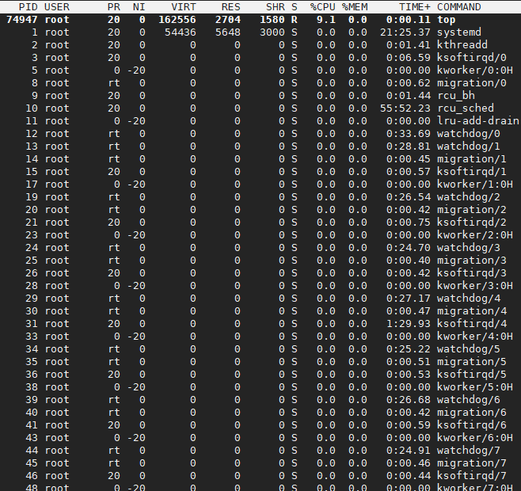

```less
// 进程信息区（进程列表）
PID：进程号
USER：运行进程的用户
PR：优先级
NI：nice值。负值表示高优先级，正值表示低优先级
// 详细可看下面解释
VIRT：占用虚拟内存，单位kb。VIRT=SWAP+RES 
RES：占用真实内存，单位kb
SHR：共享内存大小，单位kb
S：进程状态(state缩写  起分割作用)
%CPU：占用CPU百分比
%MEM：占用内存百分比
TIME+：上次启动后至今的总运行时间
COMMAND：命令名or命令行
进程状态
R=运行状态
S=睡眠状态
D=不可中断的睡眠状态
T=跟踪/停止
Z=僵尸进程
```

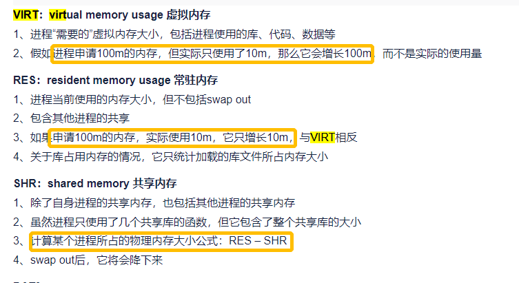

```less
// 各类按键作用
## 查看所有进程的资源占用情况
top

## 监控每个逻辑CPU的状况
top  ，按 1

## 高亮显示当前运行进程
top ，按 b

## 显示 完整命令
top ，按 c

## 切换显示CPU
top，按t

## 按CPU使用率从大到小排序
top，按P

## 切换显示Memory
top，按m

## 按Memory占用率从大到小排序
top，按M

## 按累计运行时间Time从大到小排序
top，按T

## 高亮CPU列
top，按x

## 彩色高亮显示
top，按ztop，按shift+z 可以调配色方案

## 通过”shift + >”或”shift + <”可以向右或左改变排序列**
top shift + >或shift + <

## 忽略闲置和僵死进程，这是一个开关式命令
top，按i

## 杀掉进程
top，按k，输入PID

## 改变内存的显示单位，默认为KB
top，按e （针对列表）top，按E （针对头部统计信息）

## 退出top程序
按q

```


## 四、数据流量相关命令

### 1、tcprepaly抓取/重播数据包\MTU修改

```less
//修改网卡的mtu
 ifconfig eth3 mtu 9216

//网卡混杂模式开启才能查看流量拓扑
ifconfig ens32 promisc #开启
ifconfig ens32 -promisc #关闭混杂


# 先校验网卡是否up
ip link
```

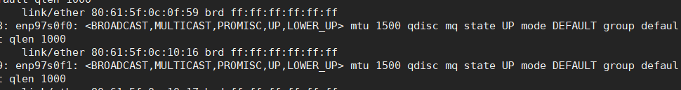

```less
# 或者用ifconfig 查看对应网卡的状态是否为 running；

# 然后对相应网卡发包，校验是否为回环
yum install lrzsz // rz命令
yum install sysstat //安装sar
yum install -y pciutils // lspci命令
sar -n DEV 1 100 // 一秒一次，100次

//安装tcpreplay:
yum -y install epel-release 
yum -y install tcpreplay

tcpreplay -i enp1s0f1 -l 10 syn.pcap
tcpdump -i enp1s0f1  port 65534 -w /test1.pcap

// 如果使用一根光纤，将网卡的rx与tx相连接，就可以一边tcpreplay一边tcpdump，虽然你用sar查看时是只有tx方向的流。
// 但是，这并不能用来验证网卡就可以正常发包（比如3w1h头）成功，因为你tcpdump收的包，tcpreplay会同一网卡给你发一份。

// pcapnp转换pcap
tcpdump -r P6-TNS.pcap -w P6-TNS-re.pcap

//保证流关系不改变的情况下，递增ip地址
tcpreplay -i em1 -l 100 -t --unique-ip ./RADIUS.pcap

// -M 可以指定速率发包， 例如下方表示按照pcap原速率的100倍来发包
tcpreplay -i enp94s0f0 -M 100 traffic.pcap 

再增加 --unique-ip-loops=3 参数，可以增加策略复杂性，效果就是，第2次loop和第3次loop的包，与第一次loop重复

//网关
arp

#安装

Install tcpreplay on CentOS/RHEL 6 and higher
You need to build tcpreplay from the source and install it manually as follows.
$ sudo yum groupinstall "Development Tools"
$ sudo yum install libpcap-devel
$ wget http://downloads.sourceforge.net/project/tcpreplay/tcpreplay/3.4.4/tcpreplay-3.4.4.tar.gz
$ tar xvfvz tcpreplay-3.4.4.tar.gz
$ cd tcpreplay-3.4.4
$ ./configure --enable-dynamic-link
$ make
$ sudo make install


tcpdump -i enp33s0f2 -c 100 -w ./3w1h_trex.pcap
-a：尝试将网络和广播地址转换成名称；
-c<数据包数目>：收到指定的数据包数目后，就停止进行倾倒操作；
-d：把编译过的数据包编码转换成可阅读的格式，并倾倒到标准输出；
-dd：把编译过的数据包编码转换成C语言的格式，并倾倒到标准输出；
-ddd：把编译过的数据包编码转换成十进制数字的格式，并倾倒到标准输出；
-e：在每列倾倒资料上显示连接层级的文件头；
-f：用数字显示网际网络地址；
-F<表达文件>：指定内含表达方式的文件；
-i<网络界面>：使用指定的网络截面送出数据包；
-l：使用标准输出列的缓冲区；
-n：不把主机的网络地址转换成名字；
-N：不列出域名；
-O：不将数据包编码最佳化；
-p：不让网络界面进入混杂模式；
-q ：快速输出，仅列出少数的传输协议信息；
-r<数据包文件>：从指定的文件读取数据包数据；
-s<数据包大小>：设置每个数据包的大小；
-S：用绝对而非相对数值列出TCP关联数；
-t：在每列倾倒资料上不显示时间戳记；
-tt： 在每列倾倒资料上显示未经格式化的时间戳记；
-T<数据包类型>：强制将表达方式所指定的数据包转译成设置的数据包类型；
-v：详细显示指令执行过程；
-vv：更详细显示指令执行过程；
-x：用十六进制字码列出数据包资料；
-w<数据包文件>：把数据包数据写入指定的文件。
```


### 2、端口使用情况、端口查看

```less
netstat命令各个参数说明如下：
　　-t : 指明显示TCP端口
　　-u : 指明显示UDP端口
　　-l : 仅显示监听套接字(所谓套接字就是使应用程序能够读写与收发通讯协议(protocol)与资料的程序)
　　-p : 显示进程标识符和程序名称，每一个套接字/端口都属于一个程序。
　　-n : 不进行DNS轮询，显示IP(可以加速操作)
netstat -ntlp   //查看当前所有tcp端口·
netstat -ntulp | grep 80   //查看所有80端口使用情况·
netstat -ntulp | grep 3306   //查看所有3306端口使用情况·

netstat   -anp   |   grep  <端口号>


lsof -i #tcp\udp

netstat -tunlp 用于显示 tcp，udp 的端口和进程等相关情况。

netstat -tunlp | grep 端口号
-t (tcp) 仅显示tcp相关选项
-u (udp)仅显示udp相关选项
-n 拒绝显示别名，能显示数字的全部转化为数字
-l 仅列出在Listen(监听)的服务状态
-p 显示建立相关链接的程序名
```

### 3、网卡丢发包统计

```less
#udp的收发包情况
netstat -s -u
nstat -r
nstat -r | grep tcp/udp/icmp...

#指定网卡闪烁
ethtool -p 网卡名
ethtool -i eth1 // 查看网卡驱动
ethtool -S eth1
ethtool -g eth0 //可以查看某个网卡的 ring buffe

包丢可以使用 dropwatch 工具，它监听系统丢包信息，并打印出丢包发生的函数地址：
# dropwatch -l kas

#网卡消息
cat /etc/.eth.conf 
```


### 4、网卡相关协议栈功能关闭

```less
不能用tcpdump，tcpdump会把自己发的包抓下来

帧校验序列（Frame Check Sequence，FCS）是数据通信中用于错误检测和纠正的一种技术，它可以帮助接收方检测到数据帧传输过程中出现的错误，并对错误进行纠正。 FCS通常是由一种叫做循环冗余校验（Cyclic Redundancy Check，CRC）算法来生成的

ethtool -c eno3 // 查看网卡相关分片数、中断数等
ethtool -S eno3 // 查看网卡计数统计 （大写s）各个queue的收包、rx_size各级分配数量等等有关rx/tx的详细信息。

// 可以防止在传输自造数据包时被系统修改
ethtool -K eno4 rx-fcs off // 关闭帧校验序列（Frame Check Sequence，FCS）是数据通信中用于错误检测和纠正的一种技术，它可以帮助接收方检测到数据帧传输过程中出现的错误，并对错误进行纠正。 FCS通常是由一种叫做循环冗余校验（Cyclic Redundancy Check，CRC）算法来生成的

ethtool -K eth1 tso off
ethtool -K eth1 gro off
ethtool -K eth1 lro off
ethtool -k eth1 | grep offload

// 记住是大写的K
ethtool -K eth0 rx-checksum on|off // 关闭后就可以使网卡接受特定的数据包（例如3w1h头）

ethtool -K enp9s0f0 rx-vlan-filter off
ethtool -K enp9s0f0 rxvlan off
ethtool -K enp9s0f0 rx off

# https://man7.org/linux/man-pages/man8/ethtool.8.html 命令手册
rmmod i40e && modprobe i40e
ifconfig eth1 down
/usr/local/sbin/ethtool -L eth1 combined 16 // 收包队列
/usr/local/sbin/ethtool -K eth1 rxhash on
/usr/local/sbin/ethtool -K eth1 ntuple on // 指定 Rx ntuple 过滤器和操作是否应该被启用
ifconfig eth1 up
/usr/local/sbin/ethtool -x eth1 // 查看rss特性
/usr/local/sbin/ethtool -X eth1 hkey 6D:5A:6D:5A:6D:5A:6D:5A:6D:5A:6D:5A:6D:5A:6D:5A:6D:5A:6D:5A:6D:5A:6D:5A:6D:5A:6D:5A:6D:5A:6D:5A:6D:5A:6D:5A:6D:5A:6D:5A:6D:5A:6D:5A:6D:5A:6D:5A:6D:5A:6D:5A equal 16
// 可以通过 vim /sys/class/net/ens3f0/queues/rx- 查看多少个队列
// 此时可以使用RPS将16个rx队列（默认）再分配到(equal的含义)16个核上。

/usr/local/sbin/ethtool -A eth1 rx off
/usr/local/sbin/ethtool -C eth1 adaptive-rx off adaptive-tx off rx-usecs 125
/usr/local/sbin/ethtool -G eth1 rx 1024

ethtool ethx       //查询ethx网口基本设置，其中 x 是对应网卡的编号，如eth0、eth1等等
ethtool –h         //显示ethtool的命令帮助(help)
ethtool –i ethX    //查询ethX网口的相关信息 
ethtool –d ethX    //查询ethX网口注册性信息
ethtool –r ethX    //重置ethX网口到自适应模式
ethtool –S ethX    //查询ethX网口收发包统计

ethtool -c eno3 // 查看网卡的队列数等信息

// 查看具体网卡信息
[root@localhost ~]# ethtool  -i ens3f1
driver: bnx2x // 驱动
version: 1.713.36-0 storm 7.13.1.0
firmware-version: mbi 7.15.42 bc 7.15.23
expansion-rom-version: 
bus-info: 0000:19:00.1
supports-statistics: yes
supports-test: yes
supports-eeprom-access: yes
supports-register-dump: yes
supports-priv-flags: yes

ethtool -x ens3f0  //查看网卡的rx与RSS配置，其中信息可以通过-X来设置，如果出现以下信息表示网卡不支持RSS。
// 网上有一种说法是通过以下命令查看，但我觉得不适用
ls -1 /sys/devices/*/*/0000:18:00.0/msi_irqs
// 下面第二个截图可以看出，网卡是支持网卡队列多中断的，但是并不支持设定RSS
```

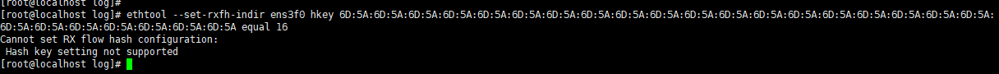

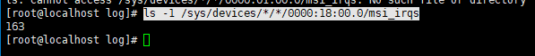


### 5、网卡光模块不兼容


参考：

https://blog.csdn.net/weixin_31061573/article/details/116597810

```less
dmesg | grep "网卡pci号"

sudo rmmod ixgbe
sudo modprobe ixgbe allow_unsupported_sfp=1,1

modprobe uio 
insmod igb_uio.ko 
insmod rte_kni.ko

./dpdk-devbind.py --bind=igb_uio em1

或者：
//卸载光模块驱动
modprobe -r ixgbe 
//允许系统支持网卡不支持的模块
modprobe ixgbe allow_unsupported_sfp=1 
modprobe uio
# 网卡混杂：
ifconfig em2 promisc

```

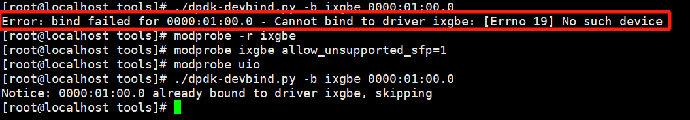


### 6、tshark数据帧查询

```less
tshark -r ipsec_isakmp_esp.pcap -Y "isakmp.nextpayload == 46"

d:\Wireshark\tshark.exe -r 输入的文件 -Y “ip.addr==127.0.0.1” -w 输出的文件
（注：这条命令只能针对一个数据包）
例如：
	d:\Wireshark\tshark.exe -r "F:\WeChat\WeChat Files\wxid_e6uywqzmc3hs22\FileStorage\File\2023-01\baidu.tls.pcap"  -Y "x509af.extension.id == 2.5.29.15"
	注：目录名种存在空格则需要“ ”。
```

### 7、snmp查看网卡流量

```less
登录方法：
在主控上 su admin
enable
输入密码：JSC@3pass0k
configure terminal
operator 1
interface
查看端口状态和流量：show brief-stat slot 1
清除端口流量：clear stat slot 1


snmpbulkwalk -v 2c 192.168.69.42 -c zjlt-dcn .1.3.6.1.4.1.200.1.2.1.1.11
.1.3.6.1.4.1.200.1.2.1.1.4 丝印端口号获取端口对应关系
.1.3.6.1.4.1.200.1.2.1.1.11.+索引   获取端口速率（千兆/万兆）
1.3.6.1.4.1.200.1.2.1.1.12.+索引  比特率
.1.3.6.1.4.1.200.1.2.1.1.13.+索引 转发率
丝印端口号部分  索引前36个端口对应的是10G口的丝印部分 ，后面1到24对应的面板上的100G口的丝印部分

.1.3.6.1.4.1.200.1.2.1.1.18 输出比特率
.1.3.6.1.4.1.200.1.2.1.1.19 输出包率
.1.3.6.1.4.1.200.1.2.1.1.12.+索引  输入比特率
.1.3.6.1.4.1.200.1.2.1.1.13.+索引 输入转发率
端口输入字节数  端口输入包数
端口输出字节数  端口输出包数
```

### 8、收包限制

```less
sysctl -a| grep netdev_budget // linux呢内核源码一次收包数量限制
```

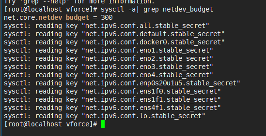


## 五、工具型命令

### 1、watch循环执行命令

```less
watch -n 1 curl www.baidu.com
```

### 2、curl-kibana语句

```less
curl -XGET 'http://localhost:9200/sessions2-210219/_search?pretty'  -d '{"query": {"term": {"firstPacket" : 1613704112792}}}' -H 'Content-Type: application/json'

"sort": [{"avg_time": {"order": "desc"}}],"size": 10

curl -XGET 'http://localhost:9200/sessions2-210409/_search?pretty'  -d '{"size": 1,"_source": {"includes":["timestamp","lastPacket"]},"sort": [{"timestamp": {"order": "desc"}}]}' -H 'Content-Type: application/json'

curl -XDELETE 'http://localhost:9200/hw_rej_v1-210317'


curl -XPOST http://localhost:9200/roles_v1/role/admin?pretty -d '{"roleId" : "admin","roleName" : "管理员","enabled" : true,"auditEnabled" : true,"systemEnabled" : true,"emailSearch" : true,"createEnabled" : true,"webEnabled" : true,"headerAuthEnabled" : true,"removeEnabled" : false,"packetSearch" : true}'  -H 'Content-Type: application/json'

curl -XPOST http://localhost:9200/roles_v1/role/audit?pretty -d '{"roleId" : "audit","roleName" : "审计管理员","auditEnabled" : true,"systemEnabled" : false,"webEnabled" : true,"headerAuthEnabled" : false,"emailSearch" : false,"createEnabled" : true,"removeEnabled" : false,"packetSearch" : false,"enabled" : true}'  -H 'Content-Type: application/json'

curl -XPOST http://localhost:9200/roles_v1/role/system?pretty -d '{"roleId" : "system","roleName" : "系统管理员","auditEnabled" : false,"systemEnabled" : true,"webEnabled" : false,"headerAuthEnabled" : false,"emailSearch" : false,"createEnabled" : false,"removeEnabled" : false,"packetSearch" : false,"enabled" : true}'  -H 'Content-Type: application/json'

curl -XPUT 'http://localhost:9200/roles_v1/' -H 'Content-Type: application/json'


curl -XGET 'http://localhost:9200/sessions2-*/_search?pretty&size=10000' -H 'Content-Type: application/json' -d '{"_source": {"include": ["http.uri"]},"query": {"bool": {"must": [{"exists": {"field": "http.uri"}}]}}}'


curl -XPOST 'http://localhost:9200/hw_rej_v1-210326/rej/_mapping?include_type_name=true&pretty' -H 'Content-Type: application/json' -d '"rej":{"properties": {"payloadLen": {"type": "long" },"rej_hit_ip": {"type": "text","fields": {"keyword": {"type": "keyword","ignore_above": 256}},"fielddata": true},"rej_another_ip": {"type": "text","fields": {"keyword": {"type": "keyword","ignore_above": 256}},"fielddata": true},"reject_ipdst": {"type": "text","fields": {"keyword": {"type": "keyword","ignore_above": 256}},"fielddata": true},"reject_ipsrc": {"type": "text","fields": {"keyword": {"type": "keyword","ignore_above": 256}},"fielddata": true},"reject_time": {"type": "long"},"success_yn": {"type": "long"}}}'

```

### 3、linux环境配置iso提取源

```less
 [step 1]
 mkdir /mnt/iso
 mount -o loop ubuntu-16.10-server-amd64.iso /mnt/iso  //mount: /dev/loop0 is write-protected, mounting read-only
```

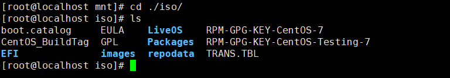

```less
 [step 2]
# 可以直接使用本地iso源
cd /etc/yum.repos.d
mkdir bak // 备份原来的源
mv ./* ./bak     // */

// 建立新的<源>文件
touch CentOS-Local.repo
写入
<
[Local]
name=Local
baseurl=file:///mnt/iso
enable=1
gpgcheck=0
>

// 更新yum源
yum update
```

### 4、命令巧取(pci获取)

```less
# cat /proc/meminfo |grep -w "MemTotal"
MemTotal:      32781228 kB

使用tr命令截取字符串
# cat /proc/meminfo |grep -w "MemTotal" | tr -cd "[0-9]"
32781228

搜索大小写任意的 vivek(即不区分大小写的搜索)
grep -i -w vivek /etc/passwd
搜索大小写任意的 vivek 或 raj
grep -E -i -w 'vivek|raj' /etc/passwd

-A<显示行数> 或 --after-context=<显示行数> : 除了显示符合范本样式的那一列之外，并显示该行之后的内容。

# 依照' '空格为分割，查看最后一列数据
cat /proc/interrupts | awk -F' ' '{print $NF}'   // 查看系统硬中断函数回调

// 查看指定目录下文件夹大小
du -sh *

使用awk命令截取指定列
df -hl
Filesystem               Size  Used Avail Use% Mounted on
/dev/mapper/centos-root  312G   12G  301G   4% /
devtmpfs                  18G  8.0K   18G   1% /dev
tmpfs                     63G  9.2M   63G   1% /dev/shm
tmpfs                     63G   59M   63G   1% /run
tmpfs                     63G     0   63G   0% /sys/fs/cgroup
/dev/sda1               1014M  146M  869M  15% /boot
/dev/mapper/centos-home  801G  733G   69G  92% /home
tmpfs                     13G     0   13G   0% /run/user/0
[root@localhost vforce3.0]# df -hl | awk '{print $4}'
Avail
301G
18G
63G
63G
63G
869M
69G
13G
#使数据显示在一行
df -hl | awk 'NR!=1{print $4}' |sed ':a;N;s/\n/ /g;ta'
301G 18G 63G 63G 63G 869M 69G 13G
#去掉第一行 显示第二列
lsof -i:80 | awk 'NR!=1{print $2}'
#默认空格隔开
lspci | grep Ether | awk  '{print $1,$6,$7,$8}'
#输出时以\t隔开
lspci | grep Ether | awk  -v OFS='\t' '{print $1,$6,$7,$8}'
#awk过滤含数字的字符串
lspci | grep Ether | awk  '$6 ~ /[0,9]/{printf "%-10s%-10s%-15s%-10s\n",$1,$6,$7,$8}'
```

### 5、ssh-keys

```less
ssh-keygen -t rsa -C "2531589523@qq.com"
cat ~/.ssh/id_rsa.pub
```

### 6、rm/cp/mv巧用

```less
mv $(ls --ignore=file1 --ignore==folder1 --ignore==regular-expression1 ...) destination/

 perl -pi -e 's|#include "detect-http-method.h"|#include "detect/http/detect-http-method.h"|g' `find ./src -type f`

## 移动排除某些文件假
shopt -s extglob
mv !(TestPcap) ./TestPcap/
```

### 7、windows文本转化

```less
vim打开文件，输入set ff=unix，然后保存文件即可将windows格式脚本替换为unix，可以直接执行了。
```

### 8、yum常用命令

```less
yum list libgcrypt* --showduplicates | sort -r // 查看可安装版本
yum remove libgcrypt* //卸载
yum deplist tomcat // 列出软件包依赖
```

### 9、snprintf函数越界

```less
snprintf函数即使是默认会在size大小之后写'\0'进行字符串末尾截断，但超出部分的输入还是会产生越界输出，有可能致使堆/栈上的空间数据出现错误。
```

### 10、cp直接覆盖crontab

```less
\cp -f ./root /var/spool/cron/root
```

### 11、gcc\yum\cmake

```less
cc -Q -v
```

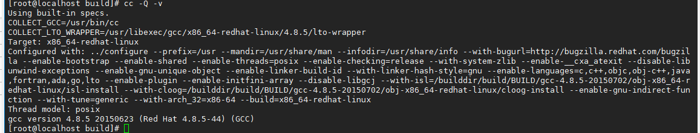

```less
yum list "devtoolset-8*" --showduplicates | sort -r // 查找可安装的版本包
```

```less
# cmake更新
# 卸载已有版本的cmake
yum remove cmake -y

# cmake目录下
./configure --prefix=/usr/local/cmake

make && make install

ln -s /usr/local/cmake/bin/cmake /usr/bin/cmake

export CMAKE_HOME=/usr/local/cmake
export PATH=$PATH:$CMAKE_HOME/bin

cmake --version

yum install gcc-c++ libstdc++-devel
```


### 12、wireshark检索payload

```less
tcp matches "\xfd\x3b"
```


### 13、命令自动补全

```less
1. 安装 bash-completion
使用包管理工具（如 yum 或 dnf）安装 bash-completion 包：
sudo yum install -y bash-completion

2. 启用 bash-completion
安装完成后，需要启用 bash-completion。通常，你只需要重新启动终端或手动加载 bash-completion。
手动加载 bash-completion：
source /etc/profile.d/bash_completion.sh

3. 验证 bash-completion
现在，你可以尝试使用 Tab 键来补全命令和参数。你可以测试一下：
yum inst<Tab>
这应该会自动补全为 yum install。
```


### 14、sh脚本windows->liunx

```less

1、使用 dos2unix 工具（推荐方法）:
dos2unix build.sh
这个工具可以将文件中的 CRLF 换行符转换为 LF。

2、使用 sed 命令:
sed -i 's/\r$//' build.sh
这个命令会在原地 (-i 选项) 移除文件中的 CR 字符。
```


## 六、服务工具搭建

### 1、telnet查看服务列表

```less
systemctl list-unit-files | grep telnet

yum -y install telnet
yum -y install telnet-server
yum -y install xinetd

如果安装失败，错误类型是/var/run/yum.pid被锁定，则将它删除即可：
rm -f /var/run/yum/pid

service xinetd restart
systemctl restart xinetd.service
ps -ef | grep xinetd
Systemctl status telnet.socket
Systemctl start telnet.socket

# 连接即可，默认就是23端口， 然后等待输出用户名密码就行
telnet 192.168.69.38 // telnet服务在38，之后在37上测试链接
```

### 2、ftp搭建

```less
1.运行以下命令安装 vsftpd。
yum install -y vsftpd

2.运行以下命令打开及查看etc/vsftpd
cd /etc/vsftpd
ls
说明：
/etc/vsftpd/vsftpd.conf 是核心配置文件。
/etc/vsftpd/ftpusers 是黑名单文件，此文件里的用户不允许访问 FTP 服务器。
/etc/vsftpd/user_list  是白名单文件，是允许访问 FTP 服务器的用户列表。
/etc/vsftpd/vsftpd_conf_migrate.sh  是vsftpd操作的一些变量和设置
备注：使用命令 rpm -ql vsftpd  可列出vsftpd中包含的文件
 rpm -ivh ~

3.运行以下命令设置开机自启动。
systemctl enable vsftpd

4.运行以下命令启动 FTP 服务。
systemctl start vsftpd

5.运行以下命令查看 FTP 服务端口。
netstat -antup | grep ftp

6.配置本地用户登录
本地用户登录就是指用户使用 Linux 操作系统中的用户账号和密码登录 FTP 服务器。
vsftpd 安装后默只支持匿名 FTP 登录，用户如果试图使用 Linux 操作系统中的账号登录服务器，将会被 vsftpd 拒绝，但可以在 vsftpd 里配置用户账号和密码登录。具体步骤如下：

a.运行以下命令创建 ftptest 用户。
useradd ftptest   
(删除用户命令：sudo userdel -r newuser)
b.运行以下命令修改 ftptest 用户密码。
passwd ftptest

7.修改/etc/vsftpd/vsftpd.conf

修改/etc/vsftpd/ftpusers和user_list文件，将root用户注释掉。

a.运行vim /etc/vsftpd/vsftpd.conf。
b.按键 “i” 进入编辑模式。
c.将是否允许匿名登录 FTP 的参数修改为anonymous enable=NO。
d.将是否允许本地用户登录 FTP 的参数修改为local_enable=YES。
e.按键 “Esc” 退出编辑模式，然后按键“：wq” 保存并退出文件。
f.运行命令 cat /etc/vsftpd/vsftpd.conf 查看配置文件内容。


# 显示ftp命令不存在则
yum install ftp

```


###  3、nfs挂载命令

```less
mount -t nfs 192.168.69.37:/data/nfs /data/
```


### 4、sll链路转Eth

```less
// 脚本转换
python3.6 ./sll-to-eth.py ./cx-mms_upload.pcap  ./cx-mms_upload_eth.pcap

// 校验，输出1则为Eth，25则为sll
tshark -r cx-mms_upload_eth.pcap -T fields -e frame.encap_type
```


## 七、dpdk相关命令

### 1、dpdk模块加载


```less
// 对于dpdk的库：一定要按照dpdk编译出来的顺序，有依赖关系的，dpdk库的顺序不能随意变换

modprobe uio
ismod igb.uio kni.uio

sudo modprobe -r ixgbe //卸载光模块驱动
sudo modprobe ixgbe allow_unsupported_sfp=1,1 //允许系统支持网卡不支持的模块，其中”1,1“代表port_1和port_2
sudo modprobe uio
```

### 2、大页查看配置

```less
cat /proc/filesystems // 查看是否打卡大页文件系统

// 查看包含大页在内的系统内存使用情况
numastat -m
watch -n 1 numastat -m

# 查看内核支持的大页情况 pse表示支持2M大页内存 pdpe1gb表示支持1GB
cat /proc/cpuinfo | grep -E "(pse| pdpe1gb )"


/* 指定节点 node0*/
cat /sys/devices/system/node/node0/hugepages/hugepages-2048kB/nr_hugepages

cat /proc/meminfo| grep -i huge

numastat -cm | egrep 'Node|Huge'

// trex中配置
3、电脑大页配置保持2M即可，大小1G， 所使用的的2.98版本会出现大页获取失败的错误：
（1）修改/etc/default/grub文件，在GRUB_CMDLINE_LINUX中加上：
default_hugepagesz=1G hugepagesz=1G hugepages=40 (最终的cat查看总数会是该2048的整数倍，这取决于你numa的节点数量)
（2）然后运行下面命令，更新启动参数配置文件。
	grub2-mkconfig -o /boot/grub2/grub.cfg
（3）之后重新启动，cat /proc/meminfo | grep -i huge 就能看到系统中显示大页数量和剩余的数量

// 或者直接去改grub.cfg文件
#当然也可以直接修改 /boot/grub2/grub.cfg 中的开机选项
```

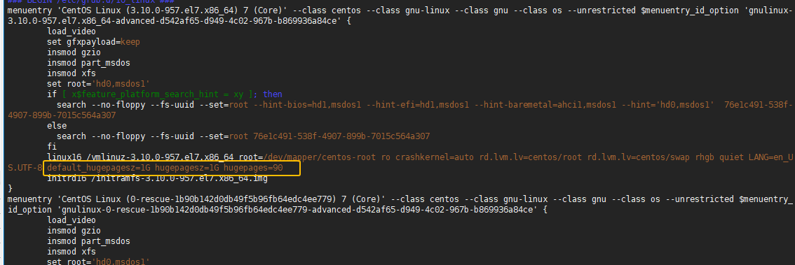

### 3、FDIR

```less
// https://arthurchiao.art/blog/linux-net-stack-tuning-rx-zh/
// 校验网卡FDIR配置
ethtool --show-features ens3f0 | grep ntuple  // 如果ntuple-filters旁边显示的[fixed]
ethtool -K eth0 ntuple on // 打开 FDIR
ethtool -u eth0 // 查看FDIR的规则
ethtool -S <DEVICE> 的输出统计里，<Intel 的网卡>有 fdir_match 和 fdir_miss 两项， 是和 ntuple filtering 相关的。关于具体、详细的统计计数，需要查看相应网卡的设备驱 动和 data sheet。
```

### 4、RSS

```less
ifconfig eth1 up
ethtool -x eth1 // 查看rss特性
// 设置rss属性
ethtool -X eth1 hkey 6D:5A:6D:5A:6D:5A:6D:5A:6D:5A:6D:5A:6D:5A:6D:5A:6D:5A:6D:5A:6D:5A:6D:5A:6D:5A:6D:5A:6D:5A:6D:5A:6D:5A:6D:5A:6D:5A:6D:5A:6D:5A:6D:5A:6D:5A:6D:5A:6D:5A:6D:5A equal 16
// 可以通过 vim /sys/class/net/ens3f0/queues/rx- 查看多少个队列
// 此时可以使用RPS将16个rx队列（默认）再分配到(equal的含义)16个核上。

ethtool -A eth1 rx off // 关闭网卡收包队列

# 在设置rss时，出现了两种“问题网卡”
（1）华为 TM280 灵活IO
（2）BCM57810
#这两个网卡的设置区别是：以下依次截图为华为、博通
```

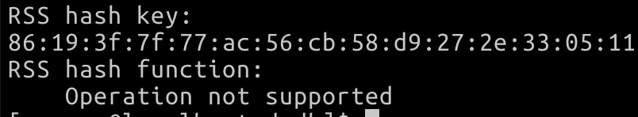

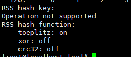

```less
# 上面的华为网卡，支持rss-key的设置，只是不支持rss-func，所以他们可以通过，自设置rss_func来解决问题；
# 但是博通的网卡，连rss_key都不支持，所以都无法通过
	retval = rte_eth_dev_rss_hash_conf_get(portid, &rss_conf);
来获取对应的rss配置，也就无法设置其对应的rss_func
```


### 5、VFIO

```less
如果系统上没有可用的 IOMMU，仍然可以使用 VFIO，但必须加载一个额外的模块参数(noiommu)：
	modprobe vfio enable_unsafe_noiommu_mode=1
	echo 1 > /sys/module/vfio/parameters/enable_unsafe_noiommu_mode
// 上面两个操作尽量都做，20240711
// 如果只是 modprobe 操作了，只能表明vfio驱动开启了noiommu_mode，但是系统本身没有加载noiommu_mode选项。
```

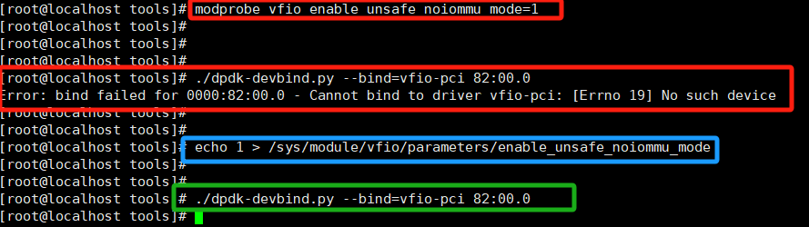

```less
// 然后搭载vfio
modprobe uio
modprobe vfio-pci

// 查看系统是否支持noiommu
cat /boot/config-$(uname -r) | grep NOIOMMU
```

### 6、allow白名单

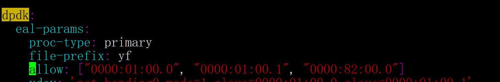


### 7、kmod安装编译

```less
// vfio 不需要编译，是linux自带的
sudo yum install kernel-devel-$(uname -r)
sudo modprobe vfio-pci


// https://git.dpdk.org/dpdk-kmods/commit/?id=e68a705cc5dc3d1333bbcd722fe4e9a6ba3ee648
// igb 需要我们下载dpdk的编译包然后进入对应目录：dpdk-kmods-e68a705cc5dc3d1333bbcd722fe4e9a6ba3ee648/linux/igb_uio
yum install kernel-devel-$(uname -r)
// /home/wangchen/rte-flow/dpdk-kmods-e68a705cc5dc3d1333bbcd722fe4e9a6ba3ee648/linux/igb_uio
make // 目录内容看下面截图
modprobe uio
insmod ./igb_uio.ko
```

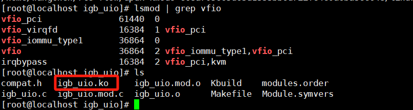


## 八、性能相关命令

### 1、内存性能DMI/DMMI查看

```less
dmidecode -t memory
dmidecode -t memory | grep Locator // 每个内存通道的插入内存 DIMM 状况
dmidecode -t memory | grep speed // 内存频率
```

### 2、内核隔离、内核进程关系

```less
isolcpus=2,3,4,5,6,7,8 // dpdk中可以使用此命令用以隔离所需使用的cpu

/* 找到Linux16 /vmlinuz-3.10.0-327.el7.x86_64 root=UUID=e542e506-5ae4-45a4-b6c2-b31eecec23e3 ro crashkernel=auto rd.lvm.lv=centos/swap rhgb quiet LANG=en_US.UTF-8这行
   在后面加上isolcpus的参数，如果在启动的时候配置启动参数 isolcpus=2,3。那么系统启动后将不使用CPU3和CPU4。
   配置后进行重启机器
   启动以后通过cat /proc/cmdline命令进行验证*/

# 查看每个cpu的任务调度情况
cat /proc/sched_debug
ps -T -eo %cpu,stat,pid,tid,args:50,psr | awk -F" " '{if($(NF) == 1) print $0}'

# 查看进程绑定的核心
ps -eo pid,args:50,psr 
```

### 3、perf使用

```less
# ubuntu安装 perf，包名和内核版本相关，可以直接输入perf命令会给出安装提示 
	sudo apt install linux-tools-5.4.0-74-generic linux-cloud-tools-5.4.0-74-generic 
# cpu的上下文切换、cpu迁移、IPC、分支预测 
	sudo perf stat -a sleep 5 
# cpu的IPC与缓存命中率 
	sudo perf stat -e cycles,instructions,cache-references,cache-misses,bus-cycles -a sleep 10 
# cpu的1级数据缓存命中率 
	sudo perf stat -e L1-dcache-loads,L1-dcache-load-misses,L1-dcache-stores -a sleep 10 
# 页表缓存TLB命中率 
	sudo perf stat -e dTLB-loads,dTLB-load-misses,dTLB-prefetch-misses -a sleep 10 
# cpu的最后一级缓存命中率 
	sudo perf stat -e LLC-loads,LLC-load-misses,LLC-stores,LLC-prefetches -a sleep 10 
# 对指定PID的系统调用按类型计数，直到按Ctrl-C: 
	sudo perf stat -e 'syscalls:sys_enter_*' -p PID -I1000 2>&1 | awk '$2 != 0' 
# 对整个系统按类型计数系统调用，持续5秒: 
	sudo perf stat -e 'syscalls:sys_enter_*' -a sleep 5 2>&1| awk '$1 != 0' 
# 计数每秒系统范围内的系统调用: 
	sudo perf stat -e raw_syscalls:sys_enter -I 1000 -a
```

### 4、扩展

```less
# 性能调试工具.md
```


