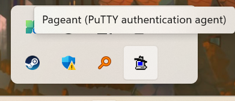

####                                                            GIT命令

#### 1、列表解析

```less
git init                                                  # 初始化本地git仓库（创建新仓库）
git config --global user.name "xxx"                       # 配置用户名
git config --global user.email "xxx@xxx.com"              # 配置邮件
git config --global color.ui true                         # git status等命令自动着色
git config --global color.status auto
git config --global color.diff auto
git config --global color.branch auto
git config --global color.interactive auto
git config --global --unset http.proxy                    # remove  proxy configuration on git
git clone git+ssh://git@192.168.53.168/VT.git             # clone远程仓库
git status                                                # 查看当前版本状态（是否修改）
git add xyz                                               # 添加xyz文件至index
git add .                                                 # 增加当前子目录下所有更改过的文件至index
git commit -m 'xxx'                                       # 提交
git commit --amend -m 'xxx'                               # 合并上一次提交（用于反复修改）
git commit -am 'xxx'                                      # 将add和commit合为一步
git rm xxx                                                # 删除index中的文件
git rm -r *                                               # 递归删除
git log                                                   # 显示提交日志
git log -1                                                # 显示1行日志 -n为n行
git log -5
git log --stat                                            # 显示提交日志及相关变动文件
git log -p -m
git show dfb02e6e4f2f7b573337763e5c0013802e392818         # 显示某个提交的详细内容
git show dfb02                                            # 可只用commitid的前几位
git show HEAD                                             # 显示HEAD提交日志
git show HEAD^                                            # 显示HEAD的父（上一个版本）的提交日志 ^^为上两个版本 ^5为上5个版本
git tag                                                   # 显示已存在的tag
git tag -a v2.0 -m 'xxx'                                  # 增加v2.0的tag
git show v2.0                                             # 显示v2.0的日志及详细内容
git log v2.0                                              # 显示v2.0的日志
git diff                                                  # 显示所有未添加至index的变更
git diff --cached                                         # 显示所有已添加index但还未commit的变更
git diff HEAD^                                            # 比较与上一个版本的差异
git diff HEAD -- ./lib                                    # 比较与HEAD版本lib目录的差异
git diff origin/master..master                            # 比较远程分支master上有本地分支master上没有的
git diff origin/master..master --stat                     # 只显示差异的文件，不显示具体内容
git remote add origin git+ssh://git@192.168.53.168/VT.git # 增加远程定义（用于push/pull/fetch）
git branch                                                # 显示本地分支
git branch --contains 50089                               # 显示包含提交50089的分支
git branch -a                                             # 显示所有分支
git branch -r                                             # 显示所有原创分支
git branch --merged                                       # 显示所有已合并到当前分支的分支
git branch --no-merged                                    # 显示所有未合并到当前分支的分支
git branch -m master master_copy                          # 本地分支改名
git checkout -b master_copy                               # 从当前分支创建新分支master_copy并检出
git checkout -b master master_copy                        # 上面的完整版
git checkout features/performance                         # 检出已存在的features/performance分支
git checkout --track hotfixes/BJVEP933                    # 检出远程分支hotfixes/BJVEP933并创建本地跟踪分支
git checkout v2.0                                         # 检出版本v2.0
git checkout -b devel origin/develop                      # 从远程分支develop创建新本地分支devel并检出
git checkout -- README                                    # 检出head版本的README文件（可用于修改错误回退）
git merge origin/master                                   # 合并远程master分支至当前分支
git cherry-pick ff44785404a8e                             # 合并提交ff44785404a8e的修改
git push origin master                                    # 将当前分支push到远程master分支
git push origin :hotfixes/BJVEP933                        # 删除远程仓库的hotfixes/BJVEP933分支
git push --tags                                           # 把所有tag推送到远程仓库
git fetch                                                 # 获取所有远程分支（不更新本地分支，另需merge）
git fetch --prune                                         # 获取所有原创分支并清除服务器上已删掉的分支
git pull origin master                                    # 获取远程分支master并merge到当前分支
git mv README README2                                     # 重命名文件README为README2
git reset --hard HEAD                                     # 将当前版本重置为HEAD（通常用于merge失败回退）
git rebase
git branch -d hotfixes/BJVEP933                           # 删除分支hotfixes/BJVEP933（本分支修改已合并到其他分支）
git branch -D hotfixes/BJVEP933                           # 强制删除分支hotfixes/BJVEP933
git ls-files                                              # 列出git index包含的文件
git show-branch                                           # 图示当前分支历史
git show-branch --all                                     # 图示所有分支历史
git whatchanged                                           # 显示提交历史对应的文件修改
git revert dfb02e6e4f2f7b573337763e5c0013802e392818       # 撤销提交dfb02e6e4f2f7b573337763e5c0013802e392818
git ls-tree HEAD                                          # 内部命令：显示某个git对象
git rev-parse v2.0                                        # 内部命令：显示某个ref对于的SHA1 HASH
git reflog                                                # 显示所有提交，包括孤立节点
git show HEAD@{5}
git show master@{yesterday}                               # 显示master分支昨天的状态
git log --pretty=format:'%h %s' --graph                   # 图示提交日志
git show HEAD~3
git show -s --pretty=raw 2be7fcb476
git stash                                                 # 暂存当前修改，将所有至为HEAD状态
git stash list                                            # 查看所有暂存
git stash show -p stash@{0}                               # 参考第一次暂存
git stash apply stash@{0}                                 # 应用第一次暂存
git grep "delete from"                                    # 文件中搜索文本“delete from”
git grep -e '#define' --and -e SORT_DIRENT
git gc
git fsck
```


#### 2、PUSH操作

```less
git clone
git clone http://git.ruifosang.com/wangchen/dps3.0.git
ls
cd dps3.0/
pwd
ls
git add .
ls
git commit -m "push-test"
git push
history

#获取指定分支代码
git clnoe -b <分支名称>  <git路径>


#不保存本地修改(注意保护本地分支)，强行同步远端代码
 git fetch --all
 git reset --hard origin/vforce3.0  
 git pull
 git branch -vv

# 查询代码作者
git blame D:\code\test.py -L 100,101

#查看commit的修改文件
git whatchanged
git whatchanged –stat (显示文件行数)

#git ssh-key值设置
先查看当前权限是否存在账户
git config user.name
git config user.email
不存在即重新开始设置
cd ~/.ssh
ls
ssh-keygen -t rsa -C "2531589523@qq.com"
cat ./id_rsa.pub   (复制在远端git的ssh-likey上)
git config --global user.name "wangchen"
git config --global user.email "2531589523@qq.com"
git clone git@192.168.69.35:root/suricata.git

#git分支合并
git checkout dev//自己分支
git stash//git add . //缓存本地代码
git checkout master
git pull
git checkout dev吃的-
git merge master // 查看冲突并解决冲突
// 如果自动合并出现错误：则需要对出现冲突的文件进行修改
git status // 查看冲突文件
vim file进行冲突修改后保存
重新 git add --- commit ---- push 操作

#更新代码
git pull
git stash pop #合并解决冲突

#剔除未add的文件
git clean -f


#查看冲突
git add . // 缓存本地代码
git checkout master
git pull // 出现分支冲突文件

#忽略更改，强制切换分支
git checkout -f test

#commit提交错分支
git reset 8edee5accdaa87681f3d324a5f5480ac3c2ba038 // 返回comit前的id
git stash // 暂存修改的代码
git checkout xmpp_coap_process
git stash pop // 取出所存代码
git add .  // 将新的文件增加到该分支 或者删除   之后正常提交即可


#git使用git log命令，查看分支提交历史，确认需要回退的版本
使用git reset --hard commit_id命令，进行版本回退
使用git push -f origin meta_data_add<分支名称> 命令，推送至远程分支


#git 指定节点代码
方法：先拷贝代码，再切换
1、先拉取
git clone https://github.com/tianqixin/runoob-git-test
2、切换分支,直接就切换到之前提交过的代码
(dev 是分支名 ， 2342dsfsdfs2 是提交过的 commit 的id)
(-b dev 本地新分支的命名)
git checkout -b dev 2342dsfsdfs2 //  git checkout 2342dsfsdfs2
#查看分支由来
git reflog --date=local | grep dev
    
** 查看commit 的 id
git log //查看全部提交记录
git log -p -2 //查看最近两次提交记录

#更新代码
git stash #暂存本地代码
git pull
git stash pop #合并解决冲突

# git日志视野
 git log --graph --format=format:'%C(bold blue)%h%C(reset) - %C(bold green)(%ar)%C(reset) %C(white)%an%C(reset)%C(bold yellow)%d%C(reset) %C(dim white)- %s%C(reset)' --all


    

#git本地回退
    git reset --hard 70438034dc4c4551910fe9c39ab65752e3dd7bd9

#git远程回退
git pull
git reset --hard 3db634d414959514f58aa185be4a2f0bf33f132e
git push origin sprt-lyq --force
    
    
```

##### 2.1 远程分支的创建者

如果你仍然想获取**远程分支的创建者**，可以结合 `git log`：

```bash
git for-each-ref --format='%(refname:short) %(authorname)' refs/remotes/origin/
```

⚠️ **注意**：

1. 这个命令依赖于本地 Git 的远程信息，如果你的本地仓库未同步最新的远程分支，可能会有**本地未删除的旧分支**。

2. 建议先运行：

    ```bash
    git remote prune origin
    ```

    以清理本地已删除的远程分支，然后再执行下面命令以确定分支详细：

    ```bash
    git for-each-ref
    ```

  3、排序：

```bash
git for-each-ref --format='%(authorname) %(refname:short)' refs/remotes/origin/ | sort
```


##### 2.2 git的commit撤销

```less
1. 撤销最近一次的 commit，保留更改
    如果你想撤销最近一次的 commit，但保留已经做的更改（即保留工作目录中的修改），可以使用：
    git reset --soft HEAD~1
    HEAD~1 表示当前分支的上一个 commit。
    --soft 会将 HEAD 移动到上一个 commit，但不会修改工作目录和暂存区（staging area）的内容。

2. 撤销最近一次的 commit，并丢弃更改
    如果你不仅想撤销 commit，而且还想丢弃本次 commit 的所有更改，可以使用：
    git reset --hard HEAD~1
    --hard 会将工作目录和暂存区的内容都恢复到上一个 commit 的状态，所有的修改都将丢失。

3. 撤销 commit，但保留更改在暂存区
    如果你希望撤销 commit，并且将文件恢复到暂存区（即 staged 状态），可以使用：
    git reset --mixed HEAD~1
    --mixed 会将 commit 从历史中移除，并将更改放回暂存区，准备进行重新 commit。

4. 如果只是想修改 commit 信息
    如果你只是希望修改上次 commit 的提交信息，而不想更改实际的代码，可以使用：
    git commit --amend
    这会打开一个编辑器，允许你修改 commit 信息。


```


#### 3、tortoise使用

```less
# setp：可以先配置好git bash的连接

1、设置好用户名和emaill
```

```less
2、配置密钥（私钥保存）
保存好私钥路径、并且将页面生成的密钥拷贝至远程服务器的ssh-key设定中。
参考https://blog.csdn.net/u013925378/article/details/105437189

3、启动pageant，把私钥文件加入进去就行。
```




#### 4、vforce调试

```less
echo "show flow_statis"|nc 127.0.0.1 9521
echo "show port_statis"|nc 127.0.0.1 9521
echo "show pkt_statis"|nc 127.0.0.1 9521
echo "show rxtx_ring_statis"|nc 127.0.0.1 9521
```

