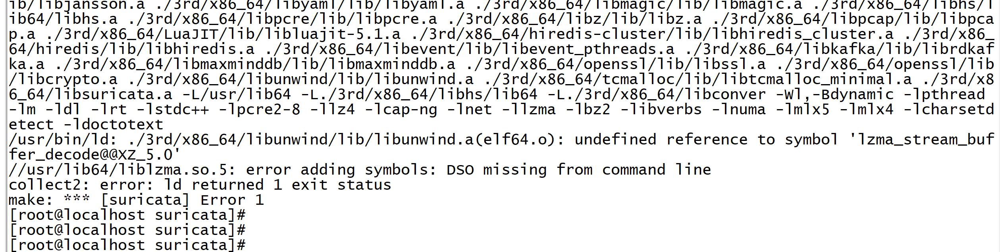

## suricata的工作原理

#### 一、环境配置

**步骤1、2、3并不需要**

##### 1、python3安装

```shell
yum -y groupinstall development zlib zlib-devel

wget https://www.python.org/ftp/python/3.6.0/Python-3.6.0.tar.xz
tar xJf Python-3.6.0.tar.xz
cd Python-3.6.0

sudo yum install openssl-devel
./configure--enable-optimizations

make
make install

which python3
python3 -V

cd /usr/bin
mv python python.backup
ln -s /usr/local/bin/python3 /usr/bin/python
```

##### 2、cmake安装

```shell
1、准备编译环境
yum -y install gcc gcc-c++

2、获取源码，并解压
wget https://github.com/Kitware/CMake/releases/download/v3.15.5/cmake-3.15.5.tar.gz
tar -zxf cmake-3.15.5.tar.gz
cd cmake-3.15.5
备用下载地址：https://down.24kplus.com/linux/cmake/cmake-3.15.5.tar.gz

3、编译安装
./bootstrap --prefix=/usr --datadir=share/cmake --docdir=doc/cmake && make
sudo make install

4、检查是否正确安装
cmake --version
```

##### 3、pip安装

```shell
yum -y install epel-release

yum install python-pip

pip install --upgrade pip
```

##### 4、boost_1_62_0安装

```shell
wget https://gigenet.dl.sourceforge.net/project/boost/boost/1.62.0/boost_1_62_0.tar.gz

tar -zxvf boost_1_62_0.tar.gz
cd boost_1_62_0

./bootstrap.sh 
#或者./b2 --with-iostreams --with-random install
./b2 install
```

##### 5、ragel-6.10安装

```shell
 tar zxvf ragel-6.10.tar.gz
 
 cd ragel-6.10
 ##configure也可以自己加入相关的安装路径--prefix=$HOME/local/prior
 ./configure 
 
 ##期间出现相关的make[]信息，但是因为没有warring，所以我忽略了
 make && make install
```

##### 6、LuaJIT 2.0.5安装

```shell
cd LuaJIT-2.0.5/

make && make install
```


##### 7、hyperscan-5.3.0安装

```shell
cd hyperscan-5.3.0/

##安装时因为忘了intsallboost，所以在cmake时出现了找不到指定的boost；
cmake BUILD_STATIC_AND_SHARED=on ./

make && make install
```


##### 8、suricata安装

```shell
yum -y install gcc libpcap-devel pcre-devel libyaml-devel file-devel   zlib-devel jansson-devel nss-devel libcap-ng-devel libnet-devel tar make   libnetfilter_queue-devel lua-devel libmaxminddb-devel hiredis-devel lz4-devel 

yum install rustc cargo

tar -xvf suricata-5.0.3.tar.gz

cd suricata-5.0.3/

##安装三部曲
./configure --prefix=/usr/ --sysconfdir=/etc/ --localstatedir=/var/ --enable-geoip --enable-luajit --with-libluajit-includes=/usr/local/include/luajit-2.0/ --with-libluajit-libraries=/usr/local/lib/ --with-libhs-includes=/usr/local/include/hs/ --with-libhs-libraries=/usr/local/lib/ --enable-hiredis --with-libhiredis-includes=/usr/include/ --with-libhiredis-libraries=/usr/lib64 

make && make install

##出现了相关的错误，根据系统类别提示（我的为centos）来安装对应包
yum install epel-release lz4-devel

##太慢可以自行下载sh文件进行安装配置
yum install rustc cargo
###如下操作
wget https://sh.rustup.rs/
sh rustup-init.sh   ##之后选择1选项进行安装
source $HOME/.cargo/env
cargo ##执行以下确认是否安装成功
```

```less
编译Suricata你需要安装以下开发库和头文件:
libpcap, libpcre, libmagic, zlib, libyaml

下面这几个工具也是必须的:
make gcc (or clang) pkg-config

若要编译的程序具有所有功能特性, 需要添加这些:
libjansson, libnss, libgeoip, liblua5.1, libhiredis, libevent

Rust支持 (试验性):
rustc, cargo

```

中途有出现过三次configure错误：分别对应没有安装：
1、LuaJIT（make）；
2、libmaxminddb-devel（yum）；
3、hiredis-devel（yum）；

之后进行响应的configure


相关命令：

```less
/usr/bin/suricata -c /etc/suricata/suricata.yaml -i ens33
/usr/bin/suricata  --build-info

suricata-update list-sources

vi /etc/suricata/suricata.yaml

##其它
make install-conf
make install-rules
```

######  error 解决: liblzma

###### 

```less
yum install xz-libs xz-devel // 安装这个解决
```


###### error 解决: libhtp.so.2


```shell
##在对应目录下新建suricata.conf
cat /etc/ld.so.conf.d/suricata.conf

##在文件中写入以下的内容
/usr/local/lib
  
##执行命令
ldconfig
```

或者：


再次运行相关命令即可：


###### suricata运行语句：

```less
##更新
suricata -update

##查看更新源
suricata-update list-sources

suricata --list-runmodes

##其他运行语句
/usr/bin/suricata -c /etc/suricata/suricata.yaml -r /suricata/sfile/pcap/

/usr/bin/suricata -c /etc/suricata/suricata.yaml -i ens33

##我的本机电脑上 -r 与 -i 的日志输出位置不同，不过可以在运行时通过 -l 参数来进行实时修改log位置
/usr/bin/suricata -c /suricata/sfile/suricata-5.0.3/suricata.yaml -r /suricata/sfile/pcap/
 
vi /var/log/suricata/suricata.log


/usr/bin/suricata -c /suricata/sfile/suricata-5.0.3/suricata.yaml -i ens33

vi /suricata/sfile/suricata-5.0.3/suricata.log

##指定日志目录
/usr/bin/suricata -c /suricata/sfile/suricata-5.0.3/suricata.yaml -r /suricata/sfile/pcap/ -l /suricata/sfile/log

/usr/bin/suricata -c /suricata/sfile/suricata-5.0.3/suricata.yaml -r /suricata/sfile/pcap/test_\(2\).pcap -l /suricata/sfile/log

/usr/bin/suricata --list-runmodes
```

###### 插曲1：mtu


​		出现错误的原因是因为我所使用的pcap文件，它是之前我所使用的环路pcap文件，所以会出现mtu问题（最大传输单元），虽然也处理了包，但是大包出错了；

###### 插曲2：rules-path

找不到对应目录下的rules，于是我修改了rules目录：

```shell
cd /suricata/sfile/suricata-5.0.3/rules
```


###### 插曲3：threshould.config

suiicata-update时出现文件搜索不到，于是我test修改yaml配置文件中的相关指定目录：（❌ 会出现错误，导致后期suricata无法运行！！！！！！）


###### 插曲4：finish

完整运行

```less
/usr/bin/suricata -c /suricata/sfile/suricata-5.0.3/suricata.yaml -r /suricata/sfile/pcap/test_\(2\).pcap -l /suricata/sfile/log
```


以下依次对应stats.log suricata.log eve.json三个文件内容：


#### 二、suricata-5.0.3

##### 1、定义

**suircata是一款支持IDS、IPS和NSM的入侵检测系统**

​       **IDS**：英文“Intrusion Detection Systems”的缩写，中文意思是“**入侵检测系统**”。依照一定的安全策略，通过软、硬件，对网络、系统的运行状况进行监视，尽可能发现各种攻击企图、攻击行为或者攻击结果，以保证网络系统资源的机密性、完整性和可用性。
　　**IPS：**是英文“Intrusion Prevention System”的缩写，中文意思是"**入侵防御系统"**。随着网络攻击技术的不断提高和网络安全漏洞的不断发现，传统防火墙技术加传统IDS的技术，已经无法应对一些安全威胁。在这种情况下，IPS技术应运而生，IPS技术可以深度感知并检测流经的数据流量，对恶意报文进行丢弃以阻断攻击，对滥用报文进行限流以保护网络带宽资源。
　　**NSM**：英文“network security monitoring”的缩写，中文意思是“网络安全监控”。

##### 2、运行模式

　suricata的基本组成。**Suricata**是由所谓的**线程**（threads）、**线程模块** （thread-modules）和**队列**（queues）组成。Suricata是一个多线程的程序，因此在同一时刻会有多个线程在工作。线程模块是依据 功能来划分的，比如一个模块用于解析数据包，另一个模块用于检测数据包等。每个数据包可能会有多个不同的线程进行处理，队列就是用于将数据包从一个线程传 递到另一个线程。与此同时，一个线程可以拥有多个线程模块，但是在某一时刻只有一个模块在运行。

​	Suricata支持多种运行模式。运行模式决定了不同的线程如何用于IDS：**single, workers, autofp**；

​       图中的RunMode Type并不是配置文件中的runmodes选项，而是后面的Custom Mode也就是自定义模式才可以在此处设置

**注：数据包处理线程（packet processing thread1）的工作模式可以参照【 线程Threading】**

###### 2.1 workers

​        通常，`workers`**运行模式执行最佳**。在这种模式下，NIC /驱动程序可确保在Suricata的处理线程上适当地平衡数据包。然后，每个数据包处理线程都包含完整的数据包管道。


###### 2.2 autofp （flow worker）

1）autofp （单一抓包线程）


**流平衡**同时发生在suricate中

2）autofp （复合抓包线程）

​        用于**处理PCAP文件**，或在某些IPS设置（如NFQ）的情况下， 使用该模式。这里有一个或多个捕获线程，它们捕获数据包并进行数据包解码，然后将其传递给线程。


**流平衡**同时发生在suricate和硬件/驱动程序中

###### 2.3 single

​        运行模式`single`与`workers`模式**相同**，但是只有一个数据包处理线程。这在开发过程中很有用。


##### 3、日志类型

对于分析日志的输出，一般会有四个日志文件;


```less
eve.json //这是警报和事件的JSON输出。
fast.log  //该日志包含由警报组成的行输出。
stats.log //启用stats.log时，您可以设置将输出数据写入日志文件的时间（秒）
suricata.log

##其他日志输出
http.log //此日志跟踪所有HTTP流量事件。它包含HTTP请求，主机名，URI和用户代理。此信息将存储在http.log（默认名称，在suricata日志目录中）中。
pcap-log //使用pcap-log选项，您可以将Suricata注册的所有数据包保存在名为_log.pcap_的日志文件中。这样，您可以随时查看所有数据包。在正常模式下，将在default-log-dir中创建一个pcap文件。如果在yaml文件中设置了绝对路径，也可以在其他位置创建它。
alert-debug.log //提供有关警报的补充信息
```

**suricata.log**文件内容实例：


##### 4、动作类型

```less
action-order:
 - pass //如果签名匹配且包含通过，则Suricata停止扫描数据包并跳至所有规则的末尾（仅适用于当前数据包）。
 - drop //这仅涉及IPS /串联模式。如果程序找到匹配的签名（包含丢弃），它将立即停止。数据包将不再发送。
 - reject //这是对数据包的主动拒绝。接收方和发送方都接收拒绝数据包。有两种类型的拒绝数据包将被自动选择。一种为涉及TCP的问题数据包，它将是一个Reset-packet。另一种为所有其他协议的ICMP-error数据包
 - alert //如果签名匹配并包含alert，则包将被视为与任何其他非威胁包一样，除此之外，Suricata将生成一个alert。只有系统管理员才能注意到此警告alert。
```

##### 5、线程Threading

Suricata是多线程的。Suricata使用多个CPU的CPU核心，因此它可以同时处理许多网络数据包。（在单核引擎中，将一次处理一个数据包。）

###### 线程模块：

​        数据包获取；解码和流应用程序层；检测；输出。

```less
##报文获取模块从网络中读取报文。

##解码模块对数据包进行解码，流应用程序(stream application layer)应用层具有三个任务：
      第一：它执行流跟踪，这意味着它将确保采取所有步骤来建立正确的网络连接。
      第二：TCP网络流量以数据包的形式传入。流组装引擎重建原始流。
      最后：检查应用层。分析HTTP和DCERPC。

##检测线程将比较签名(Compares signatures)。可以有多个检测线程，因此它们可以同时运行。

##在输出中，将处理所有警报和事件。
```


| Packet acquisition | 从网络读取数据包   |
| ------------------ | ------------------ |
| Decode             | 解码数据包         |
| Stream app. Layer  | 执行流跟踪和重组   |
| Detect             | 比较签名           |
| Outputs            | 处理所有事件和警报 |

 	大多数计算机具有多个CPU’s/CPU cores 。默认情况下，操作系统确定哪个内核在哪个线程上工作。当一个内核已被占用时，将指定另一个"空闲"内核在该线程上工作。因此，哪个内核在哪个线程上工作可能会不时发生变化。


###### 线程选项：

```less
##(1)
set-cpu-affinity: no
##(2)
detect-thread-ratio: 1.5
##(3)
cpu-affinity:
  - management-cpu-set:
      cpu: [ 0 ]  # include only these cpus in affinity settings
  - receive-cpu-set:
      cpu: [ 0 ]  # include only these cpus in affinity settings
  - worker-cpu-set:
      cpu: [ "all" ]
      mode: "exclusive"
      # Use explicitely 3 threads and don't compute number by using
      # detect-thread-ratio variable:
      # threads: 3
      prio:
        low: [ 0 ]
        medium: [ "1-2" ]
        high: [ 3 ]
        default: "medium"
  - verdict-cpu-set:
      cpu: [ 0 ]
      prio:
        default: "high"
```

解释：

   （1）使用“set-cpu-affinity”此选项，您可以使Suricata为每个线程设置固定核心。在这种情况下，1、2和4位于核心0（零）。每个内核都有自己的检测线程。在核心0上运行的检测线程的优先级比在核心0上运行的其他线程的优先级低。
	    如果要占用这些其他内核，则核心0上的检测线程没有太多要处理的数据包。在其他内核上运行的检测线程将处理更多数据包。仅在将选项设置为“yes”后才是这种情况。（This is only the case after setting the option to ‘yes’.）**但是应该是设置为“no”才能有效**。


​       （2）“detect-thread-ratio”选项：检测线程比率将确定检测线程的数量。默认情况下，它将是您计算机上存在的 CPU’s/CPU cores  数量的1.5倍。这将导致具有比CPU / CPU核心更多的检测线程。意味着您超额订购了核心数量。这可能会很方便当必须等待检测线程的时候。其余的检测线程可以变为活动状态。

​       （3） 在选项“ cpufinity”中，您可以设置哪个CPU /内核在哪个线程上工作。此选项中存在线程的相关设置选项：management-, receive-, worker- 和verdict-set。这些都是固定名称，不能更改。
​		对于每个设置选项也都有几个设置选项：cpu，mode和prio。在选项“ cpu”中，您可以设置将运行该集中的线程的 CPU’s/cores。您可以将此选项设置为“all”，也可以使用范围（0-3）或逗号分隔的列表（0,1）来指定相应内核。
​		选项“mode”可以设置为“balanced”或“exclusive”。设置为“balanced”时，可以通过在选项“ cpu”中设置的所有内核来处理各个线程。如果选项“mode”设置为“exclusive”，则每个线程都有固定的核心。
​		如前所述，线程可以具有不同的优先级。在选项“ prio”中，可以为每个线程设置优先级。此优先级可以为 low, medium, high，也可以将优先级设置为“default”。如果未为CPU设置优先级，则将使用“default”设置。默认情况下，Suricata为每个可用的CPU / CPU内核创建一个“detect”（工作线程）线程。

```makefile
##原文参照
		In the option ‘cpu affinity’ you can set which CPU’s/cores work on which thread. In this option there are several sets of threads. 
​		The management-, receive-, worker- and verdict-set. These are fixed names and can not be changed. For each set there are several options: cpu, mode, and prio. 
​		In the option ‘cpu’ you can set the numbers of the CPU’s/cores which will run the threads from that set. You can set this option to ‘all’, use a range (0-3) or a comma separated list (0,1). 
​		The option ‘mode’ can be set to ‘balanced’ or ‘exclusive’. When set to ‘balanced’, the individual threads can be processed by all cores set in the option ‘cpu’. If the option ‘mode’ is set to ‘exclusive’, there will be fixed cores for each thread. 
​		As mentioned before, threads can have different priority’s. In the option ‘prio’ you can set a priority for each thread. This priority can be low, medium, high or you can set the priority to ‘default’. If you do not set a priority for a CPU, than the settings in ‘default’ will count. By default Suricata creates one ‘detect’ (worker) thread per available CPU/CPU core.
```

###### 对于IDS/IPS模式的"cpu-affinity"相关设置

相关的设置可以参看  "线程选项"->(3)  部分；


##### 6、IP Defrag

​		有时，网络数据包看起来是零散的。在某些网络上，它发生的频率比在其他网络上更高。碎片数据包存在许多部分。在Suricata能够准确检查此类数据包之前，必须重新构造这些数据包。这将由Suricata的一个组件完成；碎片整理引擎。碎片整理引擎重构了碎片后的数据包后，该引擎会将重组后的数据包发送到Suricata的其余部分。

​		碎片整理中包含三个选项：max-frags，prealloc和timeout。当Suricata收到数据包的片段时，它将保留在内存中，该数据包的其他片段将很快出现以完成该数据包。但是，有可能碎片没有出现。为了防止Suricata一直等待该数据包（从而使用内存），在一定时间间隔后Suricata会丢弃这些碎片。默认情况下，在60秒后发生。

```less
defrag:
  max-frags: 65535
  prealloc: yes
  timeout: 60
```


##### 7、Flow and Stream handling

###### 7.1 Flow 设置

​		在Suricata中，Flow 非常重要。它们在Suricata内部组织数据的方式中起着重要作用。Flow 有点类似于连接（connection），只是Flow 更为通用。具有相同元组（tuple）（协议，源IP，目标IP，源端口，目标端口）的所有数据包（packet）都属于同一Flow 。属于Flow 的数据包在内部连接到它。**下图也标识了flow与stream的区别**


​		跟踪这些flow会占用内存。flow越多，将花费越多的内存。为了控制内存使用量，有几种选择：

```less
flow:
  memcap: 33554432    #用于设置流引擎将使用的最大字节数
  hash_size: 65536    #用于设置哈希表的大小（flow将会组织于hash表内）
  Prealloc: 10000     #用于指示suricate所需要为flow所准备的内存大小。（对于尚未属于流的数据包，Suricata将创建一个新流。这是一个相对昂贵的动作。随之而来的风险是，攻击者/黑客可以在此部分攻击引擎系统。当他们确保计算机收到大量具有不同元组的数据包时，引擎必须进行大量新的处理。这样，攻击者可能会淹没系统。为了减轻引擎的过载，此选项指示Suricata将大量流保留在内存中。这样，Suricata不太容易受到此类攻击。）
```

​		尽管预先分配了内存，但仍然会达到memcap的位置，流程引擎将进入紧急模式。在这种模式下，引擎将利用较短的超时时间。它使流以更积极的方式过期，因此将有更多空间容纳新的流。

​		有两个选项：Emergency_recovery和prune_flows。紧急恢复设置为30。这是预分配流的百分比，在此百分比之后，流引擎将恢复正常（当10000个流中的30％完成时）。

> 如果在紧急模式下，主动超时未达到期望的结果，则此选项是最后的选择。即使它们尚未达到超时，它也会结束一些流量。prune_flows 选项显示每次设置新流时将终止多少流。

```less
emergency_recovery: 30      #Percentage of 1000 prealloc'd flows.
prune_flows: 5              #显示每次设置新流时将终止多少流。
```

###### 7.2 flow 超时

Suricata在内存中保持流的时间由流超时确定。

​		流可以处于不同的状态。Suricata区分TCP的三种流状态和UDP的两种流状态。对于TCP，这些是：new，Established 和Closed；

​		对于UDP，仅new和Established 。对于这些状态中的每一个，Suricata都可以使用不同的超时时间。

​		TCP流程中的：new状态表示三向握手期间的时间段。Established 的状态是三向握手完成时的状态。TCP流程中的Closed状态：有几种方式都可以结束flow，通过复位或“四次挥手”的方式。

​		UDP流中的 new 状态：单向发送数据包的状态。

​		UDP流中的 Established 状态：数据包可以双向发送的状态。

​		在示例配置中，是每个协议的设置。TCP，UDP，ICMP和default （所有其他协议）。

```less
flow-timeouts:

  default:
    new: 30                     ## Time-out in seconds after the last activity in this flow in a New state.
    established: 300            ## Time-out in seconds after the last activity in this flow in a Established state.
    emergency_new: 10           ## Time-out in seconds after the last activity in this flow in a New state during the emergency mode.
    emergency_established: 100  ## Time-out in seconds after the last activity in this flow in a Established state in the emergency mode.
  tcp:
    new: 60
    established: 3600
    closed: 120
    emergency_new: 10
    emergency_established: 300
    emergency_closed: 20
  udp:
    new: 30
    established: 300
    emergency_new: 10
    emergency_established: 100
  icmp:
    new: 30
    established: 300
    emergency_new: 10
    emergency_established: 100
```


###### 7.3 Stream-engine（流引擎）

​		流引擎跟踪TCP连接。该引擎分为两部分：**流跟踪引擎**和**重组引擎**。

​		流跟踪引擎监视连接状态。重组引擎将按原样重建flow ，因此Suricata会识别它。

​		流引擎有两个可以设置的memcap。一台用于流跟踪引擎，一台用于重组引擎。

​		流跟踪引擎将流的信息保留在内存中。有关状态，TCP序列号和TCP窗口的信息。为了保留此信息，它可以利用memcap允许的容量。

​		TCP数据包具有所谓的校验和。这是一个内部代码，可以查看数据包是否已到达良好状态。流引擎将不会处理校验和错误的数据包。可以通过输入“ no”代替“ yes”来取消此选项。

```less
stream:
  memcap: 64mb                # TCP会话跟踪的最大内存使用量（字节）
  checksum_validation: yes    #验证数据包校验和，拒绝无效校验和的数据包。

```

……………………（该部分其它信息可见官网文档10.1.12.3）…………………………


#### 三 、DPDK合并（历程）

##### 3.1 --list-runmodes下添加dpdk模式

函数调用逻辑：

```less
StartInternalRunMode(&suricata, argc, argv);
case RUNMODE_LIST_RUNMODES: RunModeListRunmodes();
RunModeTranslateModeToName(runmode->runmode);
```

文件修改位置：（所需要的模式代码，为netmap运行模式的四个文件copy）

```less
1.runmode-dpdkintel.c
2.runmode-dpdkintel.h
3.source-dpdkintel.c
4.source-dpdkintel.h
5.Makefile.am
6.Makefile.in
7.runmodes.c
8.runmodes.h
```

1、修改runmodes.c文件


2、runmodes.h文件


3、Makefile.in （8处.略）/  Makefile.am（4处）


4、对应的四个模式文件修改略（主要是include与函数名称的修改）

5、错误调试记录


修改：


6、结果显示


##### 3.2 --Mdpdk / -P 添加

函数处理：
```less
ParseCommandLine(argc, argv, &suricata)
```

1、-P


2、--Mdpdk


结果如下：


##### 3.3 dpdk库的引用（版本1）

1、src/Makefile下

```less
LDFLAGS =   -L/usr/local/lib/  -L/usr/lib64 -L/suricata/dpdk/lib

LIBS = -Wl,--whole-archive -lrte_pmd_bond -lrte_pmd_vmxnet3_uio -lrte_pmd_virtio -lrte_pmd_enic -lrte_pmd_i40e -lrte_pmd_fm10k -lrte_pmd_ixgbe -lrte_net -lrte_pmd_e1000 -lrte_pmd_ring -lrte_pmd_af_packet -lrte_ethdev -lrte_eal -lrte_mbuf -lrte_mempool -lrte_ring -lrte_kvargs -lrte_hash -lrte_cmdline  -lrte_pci -lrte_bus_pci -lrte_bus_vdev -lrte_mempool_ring -Wl,--no-whole-archive -lnuma -lrt -llz4 -lhiredis -lmaxminddb -lluajit-5.1 -lmagic -lcap-ng -lpcap -lnet -ljansson -lyaml -lpcre  -lz -lplds4 -lplc4 -lnspr4 -lssl3 -lsmime3 -lnss3 -lnssutil3 -lplds4 -lplc4 -lnspr4 -lpthread -ldl
```


2、suricata.c / runmode-dpdkintel.c

依赖库、函数新建：


3、config.h

进行config.h的  #define HAVE_DPDK 1  宏定义；该文件只有在  --configure  之后才会出现，里面标识了宏定义的相关变量；


之后重新make一次，就可以看到输出效果，虽然dpdk还存在问题：


4、lib库缺乏的问题


```less
#进入相应的dpdk库下
cd /suricata/dpdk/lib

#搜索对应的函数
grep rte_kvargs_parse_delim -r -i ./
```


```less
#修改对应的链接库（保证库的顺序、位置合适）库的名字会缩略去lib中的ib;
vim Makefile
```


##### 3.4 suricata-LK的安装部署

（192.168.8.215 root/Ruifosang）

###### 3.4.1 libevent

Q1: event2/thread.h: No such file or directory

A1:安装libevent后重新 ./configure

```less
1.先用：ls -al /usr/lib | grep libevent 查看是否已安装；如果已安装且版本低于1.3，则先通过：rpm -e libevent —nodeps进行卸载。

2.下载libevent安装包：libevent-2.0.18-stable.tar.gz。
wget https://github.com/downloads/libevent/libevent/libevent-2.0.18-stable.tar.gz

然后解压，解压命令：sudo tar -xvf libevent-2.0.18-stable.tar.gz

3.切换到解压后的 libevent 主目录：cd libevent-2.0.18-stable

4.依次执行：
sudo ./configure -prefix=/usr （或 ./configure --program-prefix=/usr）
sudo make
sudo make install
```

```less
./configure --prefix=/usr/ --sysconfdir=/etc/ --localstatedir=/var/ --enable-geoip --enable-luajit --with-libluajit-includes=/usr/local/include/luajit-2.0/ --with-libluajit-libraries=/usr/local/lib/ --with-libhs-includes=/suricata/sfile/hyperscan-5.3.0/src/ --with-libhs-libraries=/suricata/sfile/hyperscan-5.3.0/lib/ --enable-hiredis --with-libhiredis-includes=/usr/include/ --with-libhiredis-libraries=/usr/lib64 

```

###### 3.4.2 ioc

Q2：出现make时的函数文件查找不到：例如：ioc-file.c没有编译等等；

A2：Makefile.in与Makefile.am中各个make文件的添加；


###### 3.4.3 linux下文本查询命令

```less
--递归查找目录下含有该字符串的所有文件
grep -rn "data_chushou_pay_info"  /home/hadoop/nisj/automationDemand/
 
--查找当前目录下后缀名过滤的文件
grep -Rn "data_chushou_pay_info" *.py
 
--当前目录及设定子目录下的符合条件的文件
grep -Rn "data_chushou_pay_info" /home/hadoop/nisj/automationDemand/ *.py
 
--结合find命令过滤目录及文件名后缀
find /home/hadoop/nisj/automationDemand/ -type f -name '*.py'|xargs grep -n 'data_chushou_pay_info'
```

```less
统计当前目录下文件的个数（不包括目录）
$ ls -l | grep "^-" | wc -l
统计当前目录下文件的个数（包括子目录）
$ ls -lR| grep "^-" | wc -l
查看某目录下文件夹(目录)的个数（包括子目录）
$ ls -lR | grep "^d" | wc -l
```


###### 3.4.4 hyperscan模式开启

当我在本机中执行LK的suricata时，会出现suricata.yaml中mpm-algo：hs的 'hs' 参数无法识别问题，所以我需要重新在本机中加载配置hyperscan，处理hs时常用到的命令

```less
cd /suricata/sfile/hyperscan-5.3.0/src
cd /suricata/sfile/hyperscan-5.3.0/lib

//查询Hyperscan support:
suricata --build-info|grep Hyperscan

//修改一下hs的目录 但是还是不行（0-0）
./configure --prefix=/usr/ --sysconfdir=/etc/ --localstatedir=/var/ --enable-geoip --enable-luajit --with-libluajit-includes=/usr/local/include/luajit-2.0/ --with-libluajit-libraries=/usr/local/lib/ --with-libhs-includes=/usr/local/include/hs/ --with-libhs-libraries=/suricata/sfile/hyperscan-5.3.0/lib/ --enable-hiredis --with-libhiredis-includes=/usr/include/ --with-libhiredis-libraries=/usr/lib64 (❌)
```

为了可以打开hyperscan模式，我尝试重新打开suricata的该模式：

```less
cd hyperscan-5.3.0
cmake -DBUILD_STATIC_AND_SHARED=1 ./
make
make install

//用以添加lib路径
echo "/usr/local/lib" | sudo tee --append /etc/ld.so.conf.d/usrlocal.conf(❌)
//但是因为linux为64为系统，所以需要换成下方的echo语句
//否则会出现错误/usr/bin/suricata: error while loading shared libraries: libhs.so.5: cannot open shared object file: No such file or directory
echo "/usr/lib64" | sudo tee --append /etc/ld.so.conf.d/usrlocal.conf
ldconfig

cd /suricata/sfile/lk-suricata/

//在find相关的libhs包时，我为了保持lib的一致，我把/usr/local/lib64/下的libhs包全都cp了一份放在/usr/local/lib/下：

//2021-10-13补记录;
//当我进行上述的libhs复刻操作后，我在执行suricata时会出现一个类似上面<lib路径>的错误提示：libhs.so.5: cannot open shared object file: No such file or directory。所以我重新进行了echo操作，但是当我使用ldconfig而不是sudo ldconfig命令时，就出现了两个新的错误：（1）/usr/local/lib/libhs.so.5 is not a symbolic link；（2）/usr/local/lib/libhs_runtime.so.5 is not a symbolic link；。根据网上的解释是因为这两个文件（正常情况下应该是一个符号链接,而不是实体文集件,修改其为符号链接），又想到可能是因为自己之前把/usr/local/lib64/拷贝了到/usr/local/lib/下的缘故，所以我删除了这两个文件：
  cd /usr/local/lib/
  rm -rf libhs.so.5
  rm -rf libhs_runtime.so.5
//重新ldconfig之后，suricata就可以重新启动了；

./configure --prefix=/usr/ --sysconfdir=/etc/ --localstatedir=/var/ --enable-geoip --enable-luajit --with-libluajit-includes=/usr/local/include/luajit-2.0/ --with-libluajit-libraries=/usr/local/lib/ --with-libhs-includes=/usr/local/include/hs/ --with-libhs-libraries=/usr/local/lib/ --enable-hiredis --with-libhiredis-includes=/usr/include/ --with-libhiredis-libraries=/usr/lib64 

/usr/bin/suricata -c /suricata/sfile/lk-suricata/suricata.yaml -r /suricata/sfile/pcap/ -l /suricata/sfile/log

```

在Makefile中LDFLAGS标识了加载相关库的位置：（第一行）


源码中mpm/spm注册hs模式的入口位置：


所以要想把对应的hs模式运行起来，还需要在suricata下的配置文件进行定义：< #define BUILD_HYPERSCAN  1 >

修改相关的suricata.yaml选项（rules、include）后，也就可以完整运行:q了：


filestore目录：


于spm/mpm中所包含的算法表：

```less
# The supported algorithms are:
# "ac"      - Aho-Corasick, default implementation
# "ac-bs"   - Aho-Corasick, reduced memory implementation
# "ac-ks"   - Aho-Corasick, "Ken Steele" variant
# "hs"      - Hyperscan, available when built with Hyperscan support
```

###### 3.4.5  suricata-config 、suricata-interfaces-config.yaml、suricata.ini文件关系

suricata.ini（LL）--------->（经过  suricata-config脚本处理）------------> suricata-interfaces-config.yaml

​    于此之后 suricata-interfaces-config.yaml便可以由suricata.yaml文件读取加载，再通过suricata分析处理传递相关的mq数据给LL；（当然之后有增加了ids/ioc的开关标志）

 

###### 3.4.6 fast.log的输出

监听：./suricata -c /etc/suricata/suricata.yaml -l /var/log/suricata/ -i enp2s0f0

curl相关url：curl www.baidu.com

就会出现相关的日志保存信息；


###### 3.4.7 filestore查看

我们根据检测的端口来查看访问www.baidu.com时所保存的文件路径：


可以看到相关文件保存的对应json文件如下：


##### 3.5 packet的协议解析

###### 3.5.1 常见的以太网类型

| 以太类型编号 |                           代表协议                           |
| :----------: | :----------------------------------------------------------: |
|   `0x0800`   | [Internet Protocol version 4](https://zh.wikipedia.org/wiki/Internet_Protocol_version_4) (IPv4) |
|   `0x0806`   | [Address Resolution Protocol](https://zh.wikipedia.org/wiki/Address_Resolution_Protocol) (ARP) |
|   `0x0842`   | [Wake-on-LAN](https://zh.wikipedia.org/wiki/Wake-on-LAN)[[3\]](https://zh.wikipedia.org/wiki/以太类型#cite_note-3) |
|   `0x22F0`   | Audio Video Transport Protocol as defined in IEEE Std 1722-2011 |
|   `0x22F3`   | [IETF TRILL Protocol](https://zh.wikipedia.org/w/index.php?title=TRILL_(computing)&action=edit&redlink=1) |
|   `0x6003`   | [DECnet](https://zh.wikipedia.org/w/index.php?title=DECnet&action=edit&redlink=1) Phase IV |
|   `0x8035`   | [Reverse Address Resolution Protocol](https://zh.wikipedia.org/w/index.php?title=Reverse_Address_Resolution_Protocol&action=edit&redlink=1) |
|   `0x809B`   | [AppleTalk](https://zh.wikipedia.org/wiki/AppleTalk) (Ethertalk) |
|   `0x80F3`   | [AppleTalk](https://zh.wikipedia.org/wiki/AppleTalk) Address Resolution Protocol (AARP) |
|   `0x8100`   | VLAN-tagged frame ([IEEE 802.1Q](https://zh.wikipedia.org/wiki/IEEE_802.1Q)) & Shortest Path Bridging [IEEE 802.1aq](https://zh.wikipedia.org/wiki/IEEE_802.1aq)[[4\]](https://zh.wikipedia.org/wiki/以太类型#cite_note-4) |
|   `0x8137`   |           [IPX](https://zh.wikipedia.org/wiki/IPX)           |
|   `0x8138`   |           [IPX](https://zh.wikipedia.org/wiki/IPX)           |
|   `0x8204`   | [QNX Qnet](https://zh.wikipedia.org/wiki/QNX#Transparent_Distributed_Processing) |
|   `0x86DD`   | [Internet Protocol Version 6](https://zh.wikipedia.org/wiki/IPv6) (IPv6) |
|   `0x8808`   | [Ethernet flow control](https://zh.wikipedia.org/wiki/IEEE_802.3x) |
|   `0x8809`   | Slow Protocols ([IEEE 802.3](https://zh.wikipedia.org/wiki/IEEE_802.3)) |
|   `0x8819`   | [CobraNet](https://zh.wikipedia.org/w/index.php?title=CobraNet&action=edit&redlink=1) |
|   `0x8847`   | [MPLS](https://zh.wikipedia.org/w/index.php?title=Multiprotocol_Label_Switching&action=edit&redlink=1) unicast |
|   `0x8848`   | [MPLS](https://zh.wikipedia.org/w/index.php?title=Multiprotocol_Label_Switching&action=edit&redlink=1) multicast |
|   `0x8863`   | [PPPoE](https://zh.wikipedia.org/wiki/Point-to-Point_Protocol_over_Ethernet) Discovery Stage |
|   `0x8864`   | [PPPoE](https://zh.wikipedia.org/wiki/Point-to-Point_Protocol_over_Ethernet) Session Stage |
|   `0x8870`   | [Jumbo Frames](https://zh.wikipedia.org/w/index.php?title=Jumbo_frame&action=edit&redlink=1)[[2\]](https://zh.wikipedia.org/wiki/以太类型#cite_note-jumbo-2) |
|   `0x887B`   |  [HomePlug 1.0 MME](https://zh.wikipedia.org/wiki/HomePlug)  |
|   `0x888E`   | EAP over LAN ([IEEE 802.1X](https://zh.wikipedia.org/wiki/IEEE_802.1X)) |
|   `0x8892`   | [PROFINET](https://zh.wikipedia.org/wiki/PROFINET) Protocol  |
|   `0x889A`   | [HyperSCSI](https://zh.wikipedia.org/w/index.php?title=HyperSCSI&action=edit&redlink=1) (SCSI over Ethernet) |
|   `0x88A2`   | [ATA over Ethernet](https://zh.wikipedia.org/wiki/ATA_over_Ethernet) |
|   `0x88A4`   | [EtherCAT](https://zh.wikipedia.org/wiki/EtherCAT) Protocol  |
|   `0x88A8`   |    IEEE Std 802.1Q - Service VLAN tag identifier (S-Tag)     |
|   `0x88AB`   | [Ethernet Powerlink](https://zh.wikipedia.org/wiki/Ethernet_Powerlink)[[来源请求\]](https://zh.wikipedia.org/wiki/Wikipedia:列明来源) |
|   `0x88CC`   | [链路层发现协议](https://zh.wikipedia.org/wiki/链路层发现协议) (LLDP) |
|   `0x88CD`   | [SERCOS III](https://zh.wikipedia.org/w/index.php?title=SERCOS_III&action=edit&redlink=1) |
|   `0x88E1`   | [HomePlug AV MME](https://zh.wikipedia.org/wiki/HomePlug)[[来源请求\]](https://zh.wikipedia.org/wiki/Wikipedia:列明来源) |
|   `0x88E3`   | [Media Redundancy Protocol (IEC62439-2)](https://zh.wikipedia.org/w/index.php?title=Media_Redundancy_Protocol&action=edit&redlink=1) |
|   `0x88E5`   | MAC security ([IEEE 802.1AE](https://zh.wikipedia.org/w/index.php?title=IEEE_802.1AE&action=edit&redlink=1)) |
|   `0x88E7`   | Provider Backbone Bridges (PBB) ([IEEE 802.1ah](https://zh.wikipedia.org/w/index.php?title=IEEE_802.1ah&action=edit&redlink=1)) |
|   `0x88F7`   | [Precision Time Protocol](https://zh.wikipedia.org/w/index.php?title=Precision_Time_Protocol&action=edit&redlink=1) (PTP) over Ethernet (IEEE 1588) |
|   `0x8902`   | [IEEE 802.1ag](https://zh.wikipedia.org/w/index.php?title=IEEE_802.1ag&action=edit&redlink=1) [Connectivity Fault Management](https://zh.wikipedia.org/w/index.php?title=Connectivity_Fault_Management&action=edit&redlink=1) (CFM) Protocol / [ITU-T Recommendation Y.1731](https://zh.wikipedia.org/w/index.php?title=ITU-T_Recommendation_Y.1731&action=edit&redlink=1) ([OAM](https://zh.wikipedia.org/w/index.php?title=OA%26M&action=edit&redlink=1)) |
|   `0x8906`   | [Fibre Channel over Ethernet](https://zh.wikipedia.org/wiki/Fibre_Channel_over_Ethernet) (FCoE) |
|   `0x8914`   | [FCoE](https://zh.wikipedia.org/wiki/Fibre_Channel_over_Ethernet) Initialization Protocol |
|   `0x8915`   | [RDMA over Converged Ethernet](https://zh.wikipedia.org/w/index.php?title=RDMA_over_Converged_Ethernet&action=edit&redlink=1) (RoCE) |
|   `0x892F`   | [High-availability Seamless Redundancy](https://zh.wikipedia.org/w/index.php?title=High-availability_Seamless_Redundancy&action=edit&redlink=1) (HSR) |
|   `0x9000`   | [Ethernet Configuration Testing Protocol](https://zh.wikipedia.org/w/index.php?title=Ethernet_Configuration_Testing_Protocol&action=edit&redlink=1)[[5\]](https://zh.wikipedia.org/wiki/以太类型#cite_note-5) |
|   `0x9100`   | VLAN-tagged (IEEE 802.1Q) frame with [double tagging](https://zh.wikipedia.org/w/index.php?title=Double_tagging&action=edit&redlink=1)[[6\]](https://zh.wikipedia.org/wiki/以太类型#cite_note-6) |

suricata中一共列举了以下几种类型：

```less
/* Ethernet types -- taken from Snort and Libdnet */
#define ETHERNET_TYPE_PUP             0x0200 /* PUP protocol */
#define ETHERNET_TYPE_IP              0x0800
#define ETHERNET_TYPE_ARP             0x0806
#define ETHERNET_TYPE_BRIDGE          0x6558 /* transparant ethernet bridge (GRE) */
#define ETHERNET_TYPE_REVARP          0x8035
#define ETHERNET_TYPE_EAPOL           0x888e
#define ETHERNET_TYPE_IPV6            0x86dd
#define ETHERNET_TYPE_IPX             0x8137
#define ETHERNET_TYPE_PPPOE_DISC      0x8863 /* discovery stage */
#define ETHERNET_TYPE_PPPOE_SESS      0x8864 /* session stage */
#define ETHERNET_TYPE_8021AD          0x88a8
#define ETHERNET_TYPE_8021AH          0x88e7
#define ETHERNET_TYPE_8021Q           0x8100
#define ETHERNET_TYPE_LOOP            0x9000
#define ETHERNET_TYPE_8021QINQ        0x9100
#define ETHERNET_TYPE_ERSPAN          0x88BE
#define ETHERNET_TYPE_DCE             0x8903 
```

关于以太网的数据头，存储在struct packet的以下结构中：（ EthernetHdr *ethh; ）

```less
typedef struct EthernetHdr_ {
    uint8_t eth_dst[6];//下第一张图
    uint8_t eth_src[6];//下第二张图
    uint16_t eth_type; //下第三、四张图
} __attribute__((__packed__)) EthernetHdr;
```


验证以太类型:


##### 3.6 lk(runmode-dpdk.c) 配置

###### 3.6.1 安装、修改dpdk

```less
//自己的原始安装方法。。。。
cd dpdk-stable-19.11.3/usertools
./dpdk-setup.sh(38-45-49-51-50)
export RTE_TARGET=x86_64-native-linuxapp-gcc
export RTE_SDK='/suricata/dpdk-stable-19.11.3'
//进行helloword测试
//在尝试理解dpdk的操作时，我作死一般的绑定了虚拟机的主端口ens33，之后xshell链接失败，只能在本机VM上操作，并且增加了一个新网卡;
./dpdk.sh  -p 512 -n ens33（危险）
./dpdk-devbind.py --status //查看状态，唯一的网卡被加入到了
##下面的展示了绑定网卡途中网卡在dpdk中所示状态：
```


ens33网卡原本在内核中，但是经过一次脚本操作（也可以自己down掉，应该说只有down掉之后的网卡才可以绑定dpdk）变成了dpdk中的其它网卡类型（Other Network devices），此种状态下就可以绑定在dpdk中：


在虚拟机的设置中新增一个网卡（ens37），毕竟还是要连接xshell的嘛。。。所以状态为Network devices using DPDK-compatible driver


为dpdk绑定网卡：./dpdk-setup.py的51选项操作


之后需要修改dpdk的common_base文件中的对应配置：CONFIG_RTE_BUILD_SHARED_LIB=y

​			

默认情况下都编译出静态库，如果想编译出动态库，把config/common_base文件中的CONFIG_RTE_BUILD_SHARED_LIB改成y即可。


然后重新进行之前的dpdk安装配置：

```less
网卡配置查看：./dpdk-devbind.py -s

大页配置查看： cat /proc/meminfo| grep -i huge
```


###### 3.6.2 修改suricata

```less
vim src/Makefile +524

//静态库如下 没有dpdk的静态库
-llz4 -levent_pthreads -levent -lhiredis -lmaxminddb -lluajit-5.1 -lmagic -lcap-ng -lpcap -lnet -ljansson -lpthread -lyaml -lhs -lpcre  -lz -lplds4 -lplc4 -lnspr4 -lpthread -ldl   -lssl3 -lsmime3 -lnss3 -lnssutil3 -lplds4 -lplc4 -lnspr4 -lpthread -ldl


//dpdk-src的备份
-Wl,--whole-archive -lrte_pmd_bond -lrte_pmd_vmxnet3_uio -lrte_pmd_virtio -lrte_pmd_enic -lrte_pmd_i40e -lrte_pmd_fm10k -lrte_pmd_ixgbe -lrte_net -lrte_pmd_e1000 -lrte_pmd_ring -lrte_pmd_af_packet -lrte_ethdev -lrte_eal -lrte_mbuf -lrte_mempool -lrte_ring -lrte_kvargs -lrte_hash -lrte_cmdline  -lrte_pci -lrte_bus_pci -lrte_bus_vdev -lrte_mempool_ring -Wl,--no-whole-archive -llz4 -lmaxminddb -lluajit-5.1 -lmagic -lcap-ng -lpcap -lnet -ljansson -lpthread -lyaml -lhs -lpcre  -lz -lplds4 -lplc4 -lnspr4 -lpthread -ldl -lssl3 -lsmime3 -lnss3 -lnssutil3 -lplds4 -lplc4 -lnspr4 -lpthread -ldl -lnuma
```


之后便可以重新make。

插曲1：redis错误


没有加库：-levent_pthreads -levent -lhiredis


插曲1：出现一个lib问题（静态库的顺序问题）


修改： -lrte_mbuf  具体库的顺序需要查看make时出现的错误来调整，有些函数找不到不是因为lib加载的问题，而是因为静态库的性质和顺序问题：

```less
##修改后顺序：（✔）
LIBS = -Wl,--whole-archive -lrte_mbuf -lrte_pmd_bond -lrte_pmd_vmxnet3_uio -lrte_pmd_virtio -lrte_pmd_enic -lrte_pmd_i40e -lrte_pmd_fm10k -lrte_pmd_ixgbe -lrte_net -lrte_pmd_e1000 -lrte_pmd_ring -lrte_pmd_af_packet -lrte_meter -lrte_ethdev -lrte_eal  -lrte_mempool -lrte_ring -lrte_kvargs -lrte_hash -lrte_cmdline  -lrte_pci -lrte_bus_pci -lrte_bus_vdev -lrte_mempool_ring -Wl,--no-whole-archive -llz4 -lmaxminddb -levent_pthreads -levent -lhiredis -lluajit-5.1 -lmagic -lcap-ng -lpcap -lnet -ljansson -lpthread -lyaml -lhs -lpcre  -lz -lplds4 -lplc4 -lnspr4 -lpthread -ldl -lssl3 -lsmime3 -lnss3 -lnssutil3 -lplds4 -lplc4 -lnspr4 -lpthread -ldl -lnuma

##修改前：（❌）
LIBS = -Wl,--whole-archive  -lrte_pmd_bond -lrte_pmd_vmxnet3_uio -lrte_pmd_virtio -lrte_pmd_enic -lrte_pmd_i40e -lrte_pmd_fm10k -lrte_pmd_ixgbe -lrte_net -lrte_pmd_e1000 -lrte_pmd_ring -lrte_pmd_af_packet -lrte_meter -lrte_ethdev -lrte_eal  -lrte_mempool -lrte_ring -lrte_kvargs -lrte_hash -lrte_cmdline  -lrte_pci -lrte_bus_pci -lrte_bus_vdev -lrte_mempool_ring -Wl,--no-whole-archive -llz4 -lmaxminddb -levent_pthreads -levent -lhiredis -lluajit-5.1 -lmagic -lcap-ng -lpcap -lnet -ljansson -lpthread -lyaml -lhs -lpcre  -lz -lplds4 -lplc4 -lnspr4 -lpthread -ldl -lssl3 -lsmime3 -lnss3 -lnssutil3 -lplds4 -lplc4 -lnspr4 -lpthread -ldl -lnuma

```

###### 3.6.3 dpdk模式报错（参数含义）

命令：**./suricata -c ../suricata.yaml  --dpdk**


```less
………………
eal-args: ["suricata", "-c", "0x0f", "-n", "2", "--master-lcore", "0"]
dpdk:
 - interface: ens37
   threads: 1
   checksum-checks: auto
   promisc: yes
   bpf-filter: port 80
   rx-ring: "MProc_Client_%u_RX"
 - interface: default
 ………………
```

先确认相关参数意义：

dpdk的 int rte_eal_init(int argc, char **argv);初始化函数：

函数参数argv可选：

```less
eal_short_options[] =
	"b:" /* pci-blacklist */
	"c:" /* coremask */
	"s:" /* service coremask */
	"d:" /* driver */
	"h"  /* help */
	"l:" /* corelist */
	"S:" /* service corelist */
	"m:" /* memory size */
	"n:" /* memory channels */
	"r:" /* memory ranks */
	"v"  /* version */
	"w:" /* pci-whitelist */

# -c <core mask>   
16进制掩码设置应用程序使用哪些cpu核，eg：-c 3，  3代表的是十六进制0x03，它的二进制是11，假如服务器有8个cpu核，二进制11写成00000011，从右到左依次代表核0-7，11设置使用0和1号核。
备注：注意core编号在不同的平台不一样，需要事先确定好)
    
# --master-lcore <core ID>
指定master 线程运行在<core ID>上。dpdk线程分为 master, slave 两种类型，一般 master 做管理相关的，slave 是真正处理业务的线程。

# -n <number of channels>：设置每个 Socket 的内存通道数。

# 查看文件下大小前10的文件
du -a ./* | sort -n -r | head -n 10
```


##### 3.7 filestore模块（文件create）

​		其实针对“文件保存而言”，其关键的文件创建和写入操作在output-filestore.c文件的OutputFilestoreLogger函数下，虽然此部分说进行的是相关的tmp文件，但是可以根据之后的rname（）函数来将其保存在对应的sha256头文件下；

文件创建位置：


```c
static int OutputFilestoreLogger(ThreadVars *tv, void *thread_data,
        const Packet *p, File *ff, const uint8_t *data, uint32_t data_len,
        uint8_t flags, uint8_t dir)
{
    SCEnter();
    OutputFilestoreLogThread *aft = (OutputFilestoreLogThread *)thread_data;
    OutputFilestoreCtx *ctx = aft->ctx;
    char filename[PATH_MAX] = "";
    int file_fd = -1;

    //printf("%s............\n", __func__);
    /* no flow, no files */
    if (p->flow == NULL) {
        SCReturnInt(TM_ECODE_OK);
    }

    if (!(PKT_IS_IPV4(p) || PKT_IS_IPV6(p))) {
        return 0;
    }

    SCLogDebug("ff %p, data %p, data_len %u", ff, data, data_len);

    char base_filename[PATH_MAX] = "";
    snprintf(base_filename, sizeof(base_filename), "%s/file.%u",
            ctx->tmpdir, ff->file_store_id);
    snprintf(filename, sizeof(filename), "%s", base_filename);
    printf("%s 临时tmp文件：filename:%s prefix:%s tmpdir:%s\n",__func__, filename,ctx->prefix,ctx->tmpdir);
    if (flags & OUTPUT_FILEDATA_FLAG_OPEN) {
        //打开或创建（刷新）文件
        file_fd = open(filename, O_CREAT | O_TRUNC | O_NOFOLLOW | O_WRONLY,
                0644);
        if (file_fd == -1) {
            StatsIncr(tv, aft->fs_error_counter);
            SCLogWarning(SC_ERR_OPENING_FILE,
                    "Filestore (v2) failed to create %s: %s", filename,
                    strerror(errno));
            return -1;
        }

        if (SC_ATOMIC_GET(filestore_open_file_cnt) < FileGetMaxOpenFiles()) {
            SC_ATOMIC_ADD(filestore_open_file_cnt, 1);
            ff->fd = file_fd;
        } else {
            if (FileGetMaxOpenFiles() > 0) {
                StatsIncr(tv, aft->counter_max_hits);
            }
            ff->fd = -1;
        }
    /* we can get called with a NULL ffd when we need to close */
    } else if (data != NULL) {
        if (ff->fd == -1) {
            file_fd = open(filename, O_APPEND | O_NOFOLLOW | O_WRONLY);
            if (file_fd == -1) {
                StatsIncr(tv, aft->fs_error_counter);
                WARN_ONCE(SC_ERR_OPENING_FILE,
                        "Filestore (v2) failed to open file %s: %s",
                        filename, strerror(errno));
                return -1;
            }
        } else {
            file_fd = ff->fd;
        }
    }

    if (file_fd != -1) {
        //文件内容写入
        ssize_t r = write(file_fd, (const void *)data, (size_t)data_len);
        SCLogInfo(data);
        if (r == -1) {
            StatsIncr(tv, aft->fs_error_counter);
            WARN_ONCE(SC_ERR_FWRITE,
                    "Filestore (v2) failed to write to %s: %s",
                    filename, strerror(errno));
            if (ff->fd != -1) {
                SC_ATOMIC_SUB(filestore_open_file_cnt, 1);
            }
            ff->fd = -1;
        }
        if (ff->fd == -1) {
            close(file_fd);
        }
    }

    if (flags & OUTPUT_FILEDATA_FLAG_CLOSE) {
        if (ff->fd != -1) {
            close(ff->fd);
            ff->fd = -1;
            SC_ATOMIC_SUB(filestore_open_file_cnt, 1);
        }
        OutputFilestoreFinalizeFiles(tv, aft, ctx, p, ff, dir);
    }

    return 0;
}
```

我们甚至可以通过对应的scloginfo来对文件路劲和文件的写入数据进行输出查看：


我们可以sz一下对应的文件打开查看（内容是符合的）：


附：文件存储的json格式内容

```json
{"timestamp": "2020-10-15T14:19:46.363120+0800", "flow_id": 2017925589296011, "pcap_cnt": 206, "event_type": "fileinfo", "src_ip": "192.168.8.52", "src_port": 80, "dest_ip": "172.16.0.146", "dest_port": 55244, "proto": "TCP", "http": {"hostname": "192.168.8.52", "url": "/dvwa/vulnerabilities/exec/", "http_user_agent": "Mozilla/5.0 (Windows NT 10.0; WOW64) AppleWebKit/537.36 (KHTML, like Gecko) Chrome/86.0.4240.75 Safari/537.36", "http_content_type": "text/html", "http_refer": "http://192.168.8.52/dvwa/vulnerabilities/exec/", "http_method": "POST", "protocol": "HTTP/1.1", "status": 200, "length": 4245}, "app_proto": "http", "fileinfo": {"filename": "/dvwa/vulnerabilities/exec/", "sid": [1], "magic": "HTML document, ASCII text, with very long lines, with CRLF, LF line terminators", "gaps": false, "state": "CLOSED", "sha256": "af8e8f14ef53537b9e1b55bf41c4f339302c250a3548fe61e7fb251212557827", "stored": true, "size": 4245, "tx_id": 3}}
```


##### 3.8 ids/ioc选择性输出

```less
ps -ef|grep suricata

vim /etc/suricata/suricata-interfaces-config.yaml 
vim /etc/suricata/suricata.ini
/usr/bin/suricata.config1

```

主要通过审查ConfNode节点来进行相关的配置读取；以此判断是否传输数据；


##### 3.9 LL核实记录


file的存储标志取决于：SC_ATOMIC_ADD

```c
 /* if file_store_id == 0, this is the first store of this file */
            if (ff->file_store_id == 0) {
                /* new file */
                SCLogInfo("nininininin:%u",ff->file_store_id);//0
                ff->file_store_id = SC_ATOMIC_ADD(g_file_store_id, 1);
                SCLogInfo("nininininin:%u",ff->file_store_id);//68
                file_flags |= OUTPUT_FILEDATA_FLAG_OPEN;
            } else {
                /* existing file */
            }

```


##### 3.10 bpf的使用

bpf的使用：<span style='color:GreenYellow;font-size:12;font-family:字体;'>./suricata -c /etc/suricata/suricata.yaml  -l /suricata/sfile/log/ -r /suricata/sfile/pcap/attack/ -F /suricata/sfile/bpf/capture-filter.bpf </span>


##### 3.11 suricata的core dumped

 2020年11月19日，我于往常运行suricata，但是出现了对应的Segmentation fault (core dumped)问题。隶属于内存超支属性，经过查证：

```less
gdb ./test core.45050
```


经过查看，发现是针对于suricata.yaml文件的提示，我查看之后，发现在其中的include YAML文件中，对于ids-filter/ioc-filter选项不存在，所以当我使用下属代码的判断语句时就会出现**strcmp内存超支**问题：（由于考虑到ids/ioc过滤器为必须选项，所以我并没有对其进行相关的修改）


之后的查看中，dump的位置通常在flags判断之后：


##### 3.12 Ubuntu中常用命令

```less
/usr/bin/suricata -c /etc/suricata/suricata.yaml -r /home/ubuntu/suricata-all/pcap/ll恶意/ll2.pcap  -l /home/ubuntu/suricata-all/log/

/usr/bin/suricata -c /etc/suricata/suricata.yaml -i eno1  -l /home/ubuntu/suricata-all/log/
```

具体可看Ubuntu安装手册

