# 性能优化归结


参考：https://arthurchiao.art/blog/linux-net-stack-tuning-rx-zh/


## 一、启动参数设置

### 1. 启动参数：核心隔离/IDLE等

内核隔离参考：https://www.suse.com/c/cpu-isolation-introduction-part-1/

| 参数名                  | 作用                                                         | 评价与补充                     |
| ----------------------- | ------------------------------------------------------------ | ------------------------------ |
| intel_idle.max_cstate=0 | 禁用 intel_idle 驱动的 C-state，更细粒度控制 CPU 睡眠状态    | ✅有助于保持核心活跃、降低延迟  |
| processor.max_cstate=1  | 限制 Linux C-state 到 C1，禁止更深的省电状态（如 C3/C6）     | ✅ 减少唤醒开销，适合低延迟场景 |
| idle=poll               | 强制 CPU 不休眠，始终处于 poll 状态轮询                      | ✅ 用于极端低延迟场景，如 DPDK  |
| isolcpus=1-127          | 隔离这些核心不参与内核调度，保留给用户空间线程（如 DPDK lcore） | ✅                              |
| nohz_full=1-127         | 关闭周期性调度 tick，减少 jitter（调度干扰）                 | ✅ 但要配合 CPU 绑定和中断调整  |
| rcu_nocbs=1-127         | 把 RCU 的回调任务从这些 core 上转移出去，减少抖动            | ✅                              |

> ✅ 这组参数是 **在使用 DPDK 或高性能网络服务时非常常见且有效的配置组合**。

------

```apl
对于 intel_idle.max_cstate=0 和 processor.max_cstate=1 两个参数设置。
等同于我们后续使用命令调整C状态时候的：cpupower idle-set -D 0
```

#### （1）计时器 nohz_full 参数

​		计时器和中断 需要在非常短的时间内（通常是微秒级）执行，而许多内核线程，包括工作队列，也不应该过分占用，尤其是它们的 CPU 时间会被调度器平衡。这些内核异步片段传统上被称为“清理工作”。其中一些可以绑定到特定的 CPU，而另一些则可以解绑，因此可以在任何 CPU 上执行。

​		通常情况下。常规的用户工作负载不会因为内核维护而负担过重，但，一些更专业的任务需求可能会明显地在其task路径上遇到噪声。这种情况适用于需要整个 CPU 时间的处理，并且不能忍受任何周期窃取。

**而所谓的“噪声”，就包括了定时器滴答**。以下是对定时器滴答（Tick）作用的梳理，整理成表格形式：

| **功能**                             | **描述**                                                     |
| ------------------------------------ | ------------------------------------------------------------ |
| **维护内部时钟（Jiffies）**          | 通过定时器滴答更新全局变量 `jiffies`，用于跟踪时间流逝，内核依赖 `jiffies` 来管理任务调度和其他时间相关的操作。 |
| **维护外部时钟（`gettimeofday()`）** | 更新系统的当前时间，使得系统调用（如 `gettimeofday()` 和 `clock_gettime()`）返回的时间值准确，基于定时器滴答的增量。 |
| **任务调度与抢占**                   | 定时器滴答触发调度器检查当前任务的优先级、时间片和任务状态，决定是否进行任务抢占或调度新的任务。 |
| **处理过期的计时器回调**             | 定期检查 POSIX 定时器（如 `timer_create()` 创建的定时器）是否已到期，若到期则执行回调函数。 |
| **维护全局平均负载**                 | 更新系统的平均负载（如 `loadavg`），反映系统在不同时间段内的工作负载，帮助用户或管理员了解系统的当前繁忙状态。 |
| **性能事件和监控**                   | 收集系统性能数据（如 CPU 使用率、内存占用等），帮助性能监控工具和分析器获取有关系统状态的信息，用于检测潜在的性能瓶颈。 |
| **内存管理和页面扫描**               | 定期触发内存回收机制和页面交换操作，确保系统内存的高效利用，防止内存不足或资源浪费。 |
| **电源管理**                         | 通过控制定时器中断的频率（例如 `nohz` 或 `tickless` 模式），帮助系统降低空闲时的功耗，延长电池续航，尤其在笔记本和移动设备中至关重要。 |

​		DPDK 就是这样一种例子，其中高带宽网络数据包直接从用户空间轮询，**任何来自内核的微小干扰（定时器滴答）都可能导致数据包丢失**。这种随机噪声通常被称为“抖动”，而其他类型的工作负载可能旨在接近无抖动的 CPU 以实现其目标：例如，希望最大化 CPU 资源以供虚拟机使用的虚拟化主机、需要稳定结果的 CPU 密集型基准测试、特定的实时需求等。

​		对于需要不受干扰、无抖动 的CPU 极端工作负载来说，每秒执行 100 到 1000 次的中断可能会造成问题。尽管速度很快，但这些中断仍然会占用一些 CPU 周期，并可能破坏 CPU 缓存，导致用户任务在中断后恢复时出现缓存未命中。因此，我们希望在此类工作负载下节省时钟周期。这个问题很难解决，因为 CPU 的定时器时钟周期不能像许多其他硬件中断一样与其他 CPU 关联。它也不能线程化。而且，从根本上讲，鉴于其工作性质，这个问题必须在 CPU 范围内本地解决。

##### a. 时钟计时器发展历程

事实上，直到 2.6.21（2007 年）版本，还没有任何机制可以打破时钟周期。它的行为如下图所示：

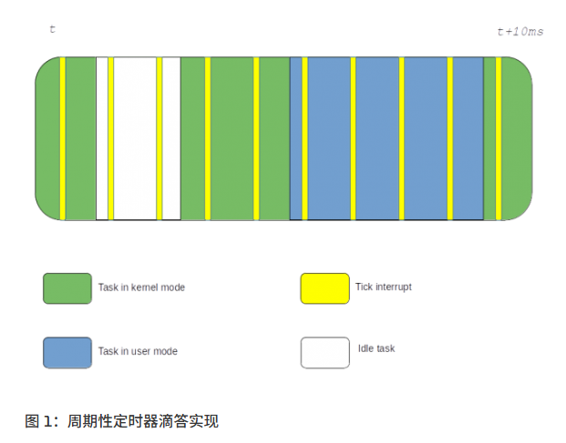

​		早在 2007 年，针对此实现必须解决的首要问题是优化功耗。事实上，当 CPU 空闲时，tick 应该不需要，因为没有实际工作要做，CPU 可以从周期性中断中获益，从而进入低功耗模式。这就是[CONFIG_NO_HZ_IDLE](https://lwn.net/Articles/223185/)（以前称为 CONFIG_NO_HZ）的由来，它在进入空闲状态时停止周期性 tick，并在退出空闲状态时重新启用它。从那时起，我们在通用工作负载下的情况就一直是这样的：

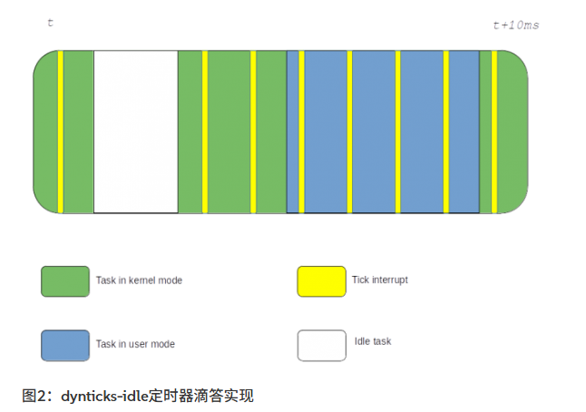


##### b. 如何修改为无时钟滴答的状态

在 Linux 内核中，启用“无滴答”（Dynticks）模式时，必须确保以下两个机制能够在没有周期性定时器中断（tick）的情况下正常工作：

1. **CPU 时间统计（Cputime Accounting）**：用于跟踪每个进程在用户空间和内核空间中消耗的 CPU 时间。
2. **RCU 静止状态报告（RCU Quiescent State Reporting）**：用于确保 RCU（Read-Copy Update）机制能够正确地回收内存和同步更新。

​		在 Linux 内核中，**静止状态（Quiescent State）** 是指线程在执行过程中**不再持有对共享内存的引用的时刻**。**RCU（Read-Copy-Update）机制依赖于静止状态来安全地回收内存。**

​	

###### **b.1 CPU 时间统计**

- **传统方式**：

    - 在 `/proc/$PID/stat` 文件中，记录每个进程在不同上下文（如用户空间、内核空间、客座虚拟机等）中所花费的时间。
    - 每个滴答（tick）触发时，内核检查当前被中断的上下文，并根据不同上下文（用户空间或内核空间）分别增加时间统计。

- **Tick 方式的计算**：

    - 每次滴答中断时，会记录一个“jiffy”时间（即两个滴答之间的时间），并根据当前上下文分别计入用户时间或内核时间。
    - 例如，1000 Hz 的时钟周期下，1 毫秒等于一个 jiffy。
    - 然而，空闲状态没有滴答，因此无法直接统计空闲时间。

- **无滴答（Tickless）方式的计算**：

    - 对于非空闲任务，当滴答停止时，内核需要通过时间戳差值来计算用户和内核的时间。
    - **改进方式**：通过用户进入和退出时间戳、空闲状态进入和退出时间戳的差值，准确计算用户和内核时间。
    - **问题**：每次跨越用户/内核边界时，需要访问硬件时钟，可能会带来性能开销。尤其是对于频繁的上下文切换的工作负载，这种硬件时钟的读取会导致性能损失。

    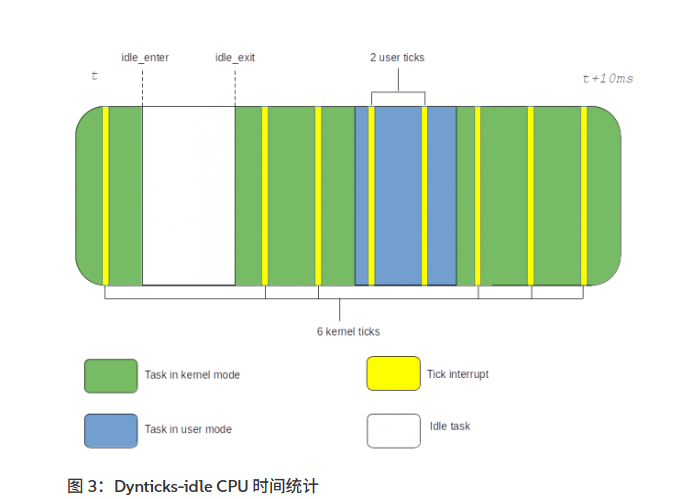

    **修改后：**

    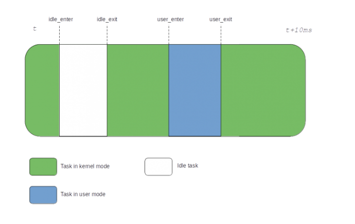

- **结论**：

    - 无滴答时间统计适用于那些较少向内核写入数据的工作负载，避免频繁的硬件时钟访问带来的性能损耗。

------


###### **b.2 RCU 静止状态报告**

​	**静止状态**：当前我们讨论主要包含：

```apl
1、上下文切换："CPU 在不同任务（task）之间切换执行权"
2、空闲状态或：下图的白色时间区间
3、用户空间执行期间：下图的蓝色时间区间
```

​		为了追逐静默状态，**RCU 依赖于 tick 并检查它中断了哪个上下文**。如果 tick 中断了不在 rcu_read_lock()/rcu_read_unlock()对保护段内的代码，它报告一个静默状态。如果 tick 中断了用户空间，它也被认为是静默状态，因为用户空间无法使用内核 RCU 子系统。

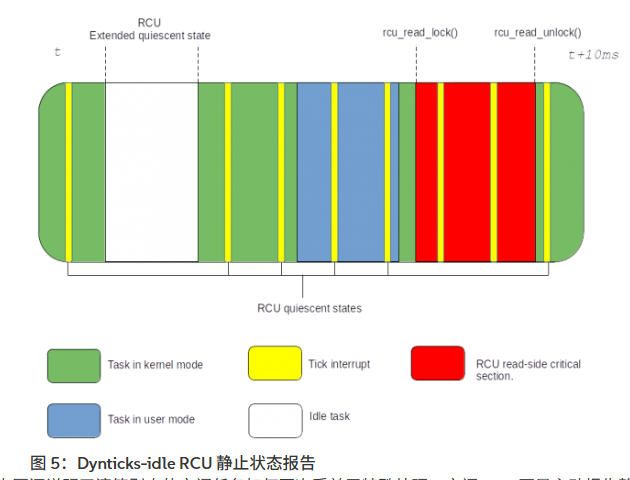

​	在上图中：空闲任务争对内核的寂寞状态报告存在特殊处理。它不会主动报告静默状态，而是通过使用 “RCU 扩展静默状态” ：在空闲进入和退出时增加一个原子变量，并使用**完整的内存屏障**。然后 RCU 在等待所有 CPU 报告自身的静默状态时，最终会发现，处于空闲状态的cpu没有响应，于是会主动扫描查找未响应的 CPU 的扩展静默状态，以此来**被动报告自身**的静默状态。

​	这种 "被动报告自身静默状态" 的模型之所以有效，是因为我们知道空闲上下文不使用 内核RCU。现在，同样的方案，由于我们知道用户空间具有相同的属性，他不会使用系统的RCU，因此这种被动报告方案可以扩展到我们的用户空间中。

```less
总结：
	1、可以使用"被动报告自身静默状态"，从而取消用户空间、空闲空间下的 tick 调用;
	2、因为"被动报告自身静默状态"：会在（空闲状态/用户空间）进入和退出时增加一个原子变量，使用完整的内存屏障。而且依赖于RCU的被动检查进行静默状态判断，所以会带来性能上的消耗;
	3、被动报告静默状态的责任最终会落到其他 CPU 上;
```

**修改后：**


- **问题**：即使在滴答运行时，如果采用这种模型，仍然需要频繁进行原子操作并设置完整的内存屏障。这会影响每次用户/内核上下文切换的性能，换句话讲，上下文切换(task)越多的场景，就不适合使用该模型。。


**总结**：

- **无滴答模式**的优势在于能**减少频繁的硬件时钟访问和轮询开销**，适用于那些较少需要频繁进入内核的工作负载。

- 对于 **CPU 时间统计** 和 **RCU 静止状态报告**，在无滴答模式下通过上下文变化和时间戳推算来替代传统的滴答统计，提供更精确的时间数据和状态报告。

- 然而，使用无滴答模式也会带来一些性能代价，尤其是需要频繁进行上下文切换或原子操作时，这种方案的成本较高。

**注意：**

```less
	有些情况没有周期性事件或至少频繁的事件是无法解决的。例如，调度器任务抢占就是这样。为了保持局部公平性，调度器必须能够在多个任务之间共享 CPU，并定期检查是否需要抢占。
	"因此，在 CPU 上运行单个任务是我们停止使用 tick 的要求。否则性能可能因为多个任务之前的抢占，导致频繁的"
	其他子系统也可能在某些情况下请求周期性 tick 继续运行：posix cpu timers，perf events 等……
```


#### （2）rcu_nocbs 参数

参考：https://www.suse.com/c/cpu-isolation-nohz_full-part-3/

​		设置为 nohz_full 的 CPU 运行在 NOCB 模式下，这意味着在这些 CPU 上排队的 RCU 回调将由运行在非隔离 CPU 上的未绑定 kthread 执行。所以如果使用了nohz_full 参数就无需传递“rcu_nocbs=”内核参数，因为当传递“nohz_full=”参数时，这会自动处理。但多数情况下，我们会配对使用。


#### （3）从perf角度看时钟定时器问题

当我们运行程序“yf”后，使用对应的perf查看发包情况下的misss状况：

```less
perf record -e LLC-load-misses -p 1350888 -g -- sleep 60
perf report
```

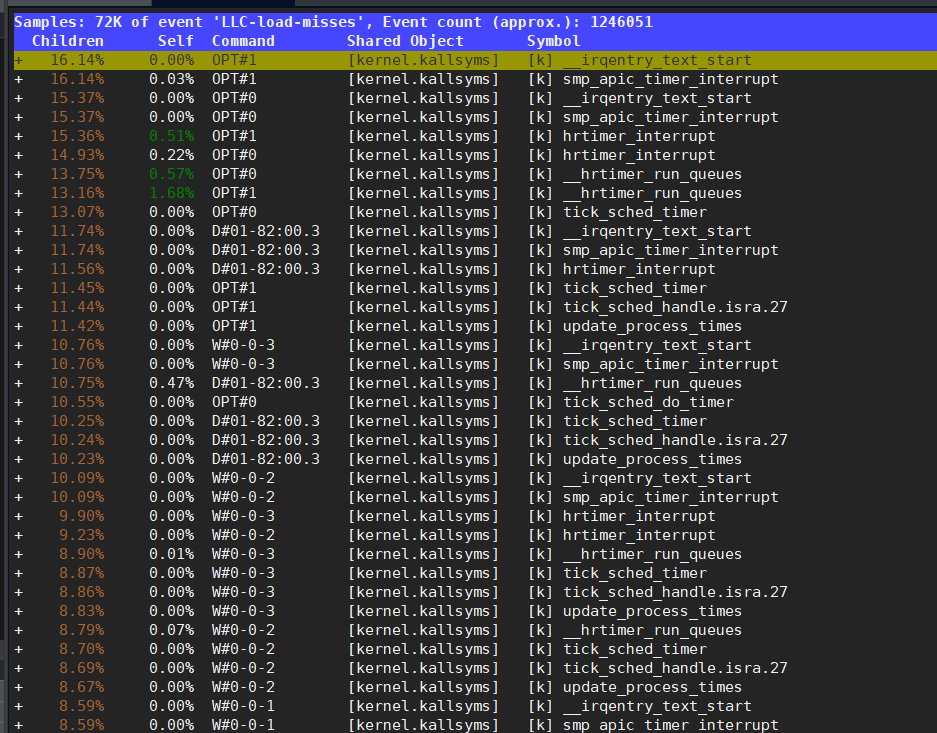

可以发现，当我们在不关闭时钟计时器的情况时，对应的 hrtimer 的miss十分严重，几乎占据了全部的miss，这还只是在我们tcpreplay速率下的发包。

```less
// 我们可以以此查看时钟周期数
grep CONFIG_HZ /boot/config-$(uname -r)
```


### 2. 关于 hugepage配置

这些参数用于内存大页配置，DPDK 等应用通常会预分配 hugepage：

| 参数名                       | 作用                                             | 说明                                                         |
| ---------------------------- | ------------------------------------------------ | ------------------------------------------------------------ |
| `transparent_hugepage=never` | 关闭内核自动分配透明大页机制                     | ✅ 避免内核自动触发，影响性能预测性                           |
| `default_hugepagesz=1G`      | 默认的大页大小设置为 1GB                         | ✅ 配合 DPDK、NUMA 做页框规划                                 |
| `hugepagesz=1G`              | 支持的 hugepage 尺寸为 1GB（有时与上面重复指定） |                                                              |
| `intel_iommu=off`            | 关闭 IOMMU（可能是为直通硬件 DMA）               | ✅ 如果使用 vfio passthrough，就不应关闭；否则关闭可以减少开销 |
|                              |                                                  |                                                              |

它的作用是**避免内核在运行时自动将普通页（4KB）合并成大页（2MB 或 1GB）**，从而带来的**内存抖动**、**延迟不确定性**，特别适用于对性能**极其敏感**的场景，比如：

- DPDK
- 高频交易（HFT）
- 实时音视频
- 数据包处理（NIDS/NIPS）

------

#### 透明大页（THP）

- Linux 为了优化性能，会尝试自动把很多连续的 4KB 页合并成一个 2MB 的大页（或更大）
- 这样做是为了：
    - 减少 TLB miss（Translation Lookaside Buffer 失效）
    - 提高内存访问效率

但是这个合并过程叫 **khugepaged（透明大页守护进程）**，它会在内核中**不定期**运行，占用 CPU，并可能引发 **page migration（页迁移）** 和内存整理，从而：

​			⚠️ **对实时性/低延迟任务造成性能抖动**

**为啥要关掉？**对如下情况特别重要：

| 场景                  | 为什么关闭 THP                                               |
| --------------------- | ------------------------------------------------------------ |
| **DPDK**              | DPDK 会使用 `hugetlbfs` 自己显式管理大页，不需要也不希望内核干预 |
| **实时程序**          | 要求确定性延迟，THP 可能会导致不定时 CPU 使用或内存搬移      |
| **多 NUMA 节点机器**  | THP 有时会跨 NUMA 迁移页，引起性能下降                       |
| **大内存/高并发场景** | THP 机制可能与内存压缩、page compaction 冲突                 |

------


### 3. 超线程HT（Hyper-Threading）

```bash
$ lscpu | grep "Thread(s) per core"
Thread(s) per core: 2
```

从此输出中，**我们知道 HTT 已启用，因为每个核心有多个线程**（在本例中是两个）。如果每个核心只有一个线程，我们就知道 HTT 已禁用。

我们还可以检查包含 SMT 激活模式标志的文件：

```bash
$ cat /sys/devices/system/cpu/smt/active
1
```

值为**1 表示我们已启用 HTT，**而**值为 0 表示我们已禁用**它。如下：

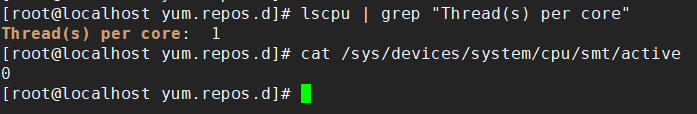

但如果你的HTT是打开的，例如所给的 `lscpu` 输出：

```scss
NUMA node0 CPU(s):     0-19,40-59
```

说明每个物理 core 有两个逻辑线程（HT 开启状态），也就是说：

- CPU 0 和 40 是 **同一个物理 core** 的两个线程
- 超线程（HT）共享资源（如 L1/L2 Cache、执行单元）
- 在极端性能敏感应用中（如 DPDK、HPC、RT），禁用 HT 可减少资源竞争，提高稳定性

> **关闭超线程有利于线程独占资源的使用。**

```bash
# 编辑 GRUB 配置文件： 打开 /etc/default/grub 文件：
vi /etc/default/grub

# 在 GRUB_CMDLINE_LINUX 中添加参数： 在该文件中，找到 GRUB_CMDLINE_LINUX 这一行，并添加以下参数来禁用超线程：
GRUB_CMDLINE_LINUX="nosmt"
# nosmt 是一个内核参数，用来禁用超线程。

# 更新 GRUB 配置并重启： 更新 GRUB 配置并使更改生效：
grub2-mkconfig -o /boot/grub2/grub.cfg 

# 或者在某些系统上：
update-grub

# 然后重启计算机：
reboot
```

补充建议：

​	如果你不想物理关闭 HT（例如 BIOS 中关掉），你也可以**只绑定到一个线程组（比如 0-19）使用，忽略 40-59**，效果类似。


### 4. 禁用 ASPM（PCIe 设备的主动状态电源管理）和 QPI（QuickPath Interconnect）电源管理

参考：https://docs.redhat.com/en/documentation/red_hat_enterprise_linux/6/html/power_management_guide/aspm#ASPM

启用 ASPM 后，由于链路在不同电源状态之间转换需要时间，设备延迟会增加。ASPM 有三种确定电源状态的策略：

- default

    根据系统固件（例如 BIOS）指定的默认值设置 PCIe 链路电源状态。这是 ASPM 的默认状态。

- powersave

    设置 ASPM 尽可能节省电量，而不考虑性能成本。

- performance

    禁用 ASPM 以允许 PCIe 链路以最佳性能运行。

可以通过内核参数启用或禁用 ASPM 支持*`pcie_aspm`*，其中`pcie_aspm=off`禁用 ASPM 和`pcie_aspm=force`启用 ASPM，即使在不支持 ASPM 的设备上也是如此。

ASPM 策略在中设置`/sys/module/pcie_aspm/parameters/policy`，但也可以在启动时使用*`pcie_aspm.policy`*内核参数指定，例如，`pcie_aspm.policy=performance`将设置 ASPM 的 performance 策略


### 5. 禁用 IOMMU（输入-输出内存管理单元）

参考：https://docs.dolphinics.com/latest/guides/iommu.html

**启用和禁用 IOMMU / VT-d**

IOMMU 启用状态由 BIOS 设置和 OS/内核设置决定。

|                     | BIOS 中**启用**IOMMU | BIOS 中**禁用**IOMMU |
| ------------------- | -------------------- | -------------------- |
| 内核中**启用**IOMMU | **已启用**           | 已禁用               |
| 内核中**禁用**IOMMU | 已禁用               | 已禁用               |

**检查 IOMMU 当前是否已启用**

要检查 Linux 中 IOMMU 是否已启用，请运行：

```less
# ls /sys/class/iommu/
dmar0  dmar1
```

如果目录为空，则 IOMMU 处于**禁用状态**。如果目录中有条目，则 IOMMU 处于**启用状态**。

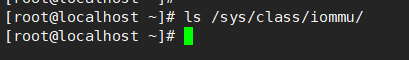

**在 Linux 内核中启用 IOMMU**

要使用的内核参数取决于处理器类型：

| CPU 类型   | 内核参数                              |
| ---------- | ------------------------------------- |
| 英特尔 CPU | `intel_iommu=on`或者`intel_iommu=off` |
| AMD CPU    | `amd_iommu=off`（默认开启）           |

```less
// 更新配置启动参数
grub2-mkconfig -o /boot/grub2/grub.cfg
```

有关选项的完整列表，请参阅[kernel.org 上的内核命令行参数文档](https://www.kernel.org/doc/html/latest/admin-guide/kernel-parameters.html)。


### 6. 禁用 VT-x、VT-d 和 SR-IOV

略。【和IOMMU差别不大】


### 7. 禁用 Node Interleaving

保持 Channel Interleaving 启用， 您希望您的本地分配的内存保持本地，不要同时在两个 NUMA 节点上分配。

参考：https://frankdenneman.nl/2010/12/28/node-interleaving-enable-or-disable/

关于这个 BIOS 设置似乎有很多疑惑，我收到很多关于是否启用或禁用节点交错的问题。我猜“*启用*”这个词会让人们误以为它是一种性能增强功能。不幸的是，事实并非如此，强烈建议保留默认设置并禁用节点交错。

**节点交错选项仅适用于 NUMA 架构。**
	节点交错选项存在于采用非均匀内存访问 (NUMA) 系统架构的服务器上。Intel Nehalem 和 AMD Opteron 均属于 NUMA 架构。NUMA 架构中存在多个节点。每个节点包含一个 CPU 和内存，并通过 NUMA 互连连接。pCPU 将使用其板载内存控制器访问其自身的“本地”内存，并通过互连连接到剩余的“远程”内存。由于内存可能位于不同的位置，该系统会经历“非均匀”的内存访问时间。

```less
禁用 Node Interleaving 节点交错相当于 NUMA
	使用默认的节点交错设置（禁用），系统将构建*系统资源分配表*(SRAT)。ESX 使用 SRAT 来了解哪个内存组是 pCPU 的本地内存，并尝试*将本地内存分配给虚拟机的每个 vCPU。通过使用本地内存，CPU 可以使用自己的内存控制器，无需竞争访问共享互连（带宽），并减少访问内存的跳数（延迟）。 * 如果本地内存已满，ESX 将转而将内存存储在远程内存中，因为这始终比将内存交换到磁盘更快。

启用 Node Interleaving 节点交错等于 UMA
	如果启用节点交错，系统将不会构建 SRAT，ESX 将无法感知底层物理架构。ESX 会将服务器视为统一内存访问 (UMA) 系统，并将可用内存视为一个连续的区域。引入将内存页面存储在远程内存中的可能性，强制 pCPU 在虚拟机每次访问内存时通过 NUMA 互连传输数据。
```

​	通过将“节点交叉”设置保留为禁用，ESX 可以使用系统资源分配表 (STA) 为虚拟机选择最佳的内存页面位置。因此，即使听起来会妨碍系统以更优的方式运行，**也建议将此设置保留为：禁用Node Interleaving**。

参考：https://support.hpe.com/hpesc/public/docDisplay?docId=sd00003788en_us&page=GUID-D7147C7F-2016-0901-0A72-000000000AAE.html&docLocale=en_US

1. 从系统实用程序界面： System Configuration > BIOS/Platform Configuration (RBSU) > Memory Options > Node Interleaving.
2. 选择一个设置。
    - 启用——内存地址交错在每个处理器安装的内存中。所有节点必须具有相等的内存大小。系统性能可能会受到影响。
    - 禁用——禁用节点交错，在大多数环境中提供最佳性能。
3. 保存您的设置。


### 8. 启用 IOAT（Intel I/O 加速技术）

Intel I/O Acceleration Technology（简称 I/OAT）是一种由英特尔开发的硬件加速技术，旨在通过将数据传输任务从 CPU 转移到专用硬件上，从而提高数据处理效率，降低 CPU 的负载，特别是在高吞吐量的网络应用中。

 **I/OAT 的工作流程**

1. **数据传输请求**：应用程序或操作系统发起数据传输请求。
2. **DMA 引擎处理**：I/OAT 的 DMA 引擎接管数据传输任务，直接在内存之间传输数据。[Better Tomorrow with Computer Science+5维基百科，自由的百科全书+5Wikipedia+5](https://zh.wikipedia.org/wiki/I/O加速技术?utm_source=chatgpt.com)
3. **CPU 释放**：由于数据传输由 DMA 引擎处理，CPU 可以释放出来，处理其他任务。
4. **完成通知**：数据传输完成后，DMA 引擎通过中断或轮询机制通知系统。


参考：https://docs.oracle.com/en/servers/x86/x8-8/exadata-storage-service-manual/bios-io-menu-ioat-configuration-options.html

**BIOS IO Menu IOAT Configuration Options**

下表描述了 BIOS IO 菜单 IOAT 配置选项。

| Setup Options | Options          | Defaults | Description                                          |
| ------------- | ---------------- | -------- | ---------------------------------------------------- |
| Intel IOAT    | Disabled/Enabled | Enabled  | Enable or disable Intel IOAT.                        |
| DCA Support   | Disabled/Enabled | Enabled  | Enable or disable direct cache access (DCA) support. |

从技术角度讲，DDIO 是 IOAT“功能包”的一部分。它包括两个部分：

​	① 通过专用 DMA 引擎加速复制（想想硬件加速的 memcpy()） - 由于延迟巨大，它不会被网络栈使用。

​	① DDIO - 使您的网卡直接将数据包发送到 L3 缓存。这正是我们想要的。

关于dpkd的IOAT使用：自 DPDK 21.11 起，IOAT 驱动程序的 rawdev 实现已弃用。**请改用 dmadev 库**。

参考：https://doc.dpdk.org/guides-22.03/rawdevs/ioat.html?utm_source=chatgpt.com#hardware-requirements


### 9. 禁用不必要的预取（Prefetching）机制

预取机制（如硬件预取器、相邻扇区预取、DCU 流预取器）通常用于加速数据访问，它们通过提前加载内存中的数据到缓存中，来提高处理器的性能。然而，这些预取机制在一些场景下可能会产生负面效果，特别是当系统需要处理大量网络数据包或高频繁的内存访问时。

- **过度预取**：大多数预取机制采用“散弹枪式”的策略，会预取尽可能多的数据，尽管这些数据未必是实际需要的。这不仅浪费了带宽，而且可能导致缓存被无效的数据填满，从而影响后续有用数据的缓存命中率。
- **缓存冲突**：过多的数据预取会导致缓存被清空或被错误的预取数据填充，造成缓存抖动（Cache Thrashing）。如果缓存不够用于存储真正需要的数据，处理器频繁地从内存中加载数据，反而导致性能下降。

#### **禁用的预取机制**

- **HW prefetcher**：硬件预取器是最常见的预取机制，它会基于历史访问模式预取可能需要的数据。这在某些应用中非常有用，但在高负载或网络密集型应用中，可能导致无效数据的预取。
- **Adjacent sector prefetch**：相邻扇区预取器会假设相邻的内存块（或磁盘块）会被访问，并提前加载。这在顺序访问模式下很有效，但对于随机访问模式可能导致不必要的预取。
- **DCU stream prefetcher**：流预取器主要用于数据流的预取，类似于相邻扇区预取器，但它是基于流的方式进行预测，可能会导致缓存冲突。


### 10. 启用 C-states 和 P-states

C参考：https://www.intel.com/content/www/us/en/docs/socwatch/user-guide/2020/c-state.html

P参考：https://www.intel.com/content/www/us/en/docs/socwatch/user-guide/2020/p-state.html

启用/关闭：https://www.thomas-krenn.com/en/wiki/Disable_CPU_Power_Saving_Management_in_BIOS

#### 禁用 CPU 电源管理(暂时不使用)

1. 在启动过程中，按**Delete**或**Entf**按钮（取决于您的键盘布局）进入 BIOS

2. 切换到 -> 高级 CPU 配置 -> 高级电源管理配置

    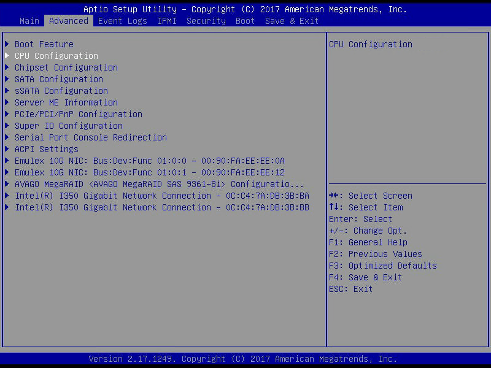

3. 将**Power Technology**更改为**Custom**，并将**Energy Efficient Turbo** 改为 **Disable**.

    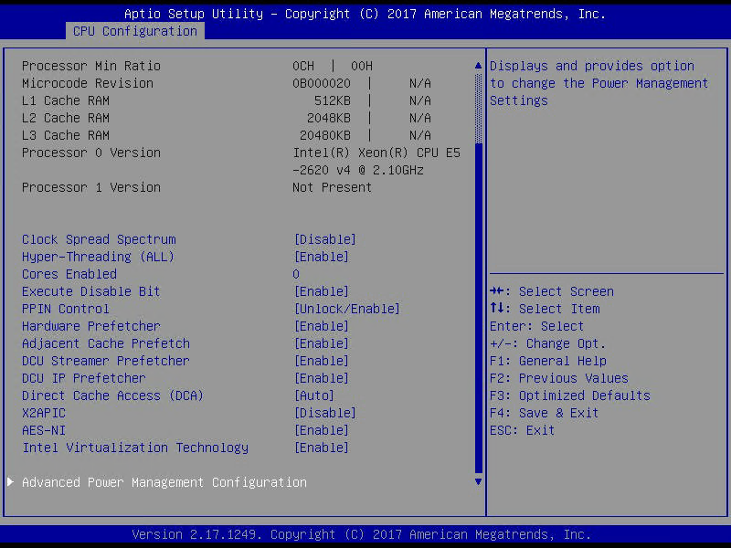

4. 切换到**CPU P 状态控制**，停用**EIST（P 状态）和 Turbo 模式**。

    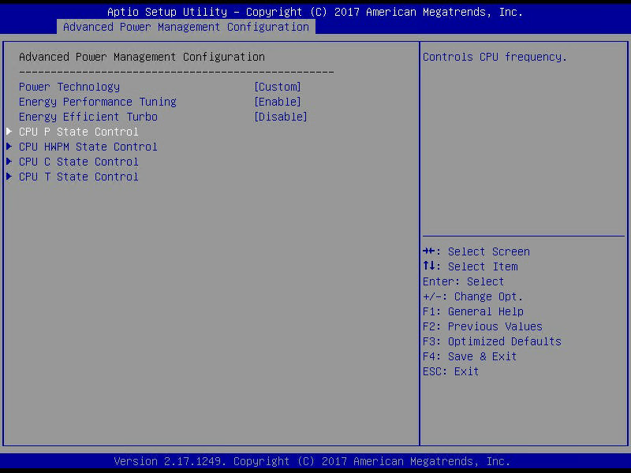

5. 然后切换到**CPU C 状态控制(CPU C State Control)**，将**包 C 状态限制**更改为**C0/C1 state**并停用 **CPU C3 Report**, **CPU C6 Report** 和 **Enhanced Halt State (C1E)**.

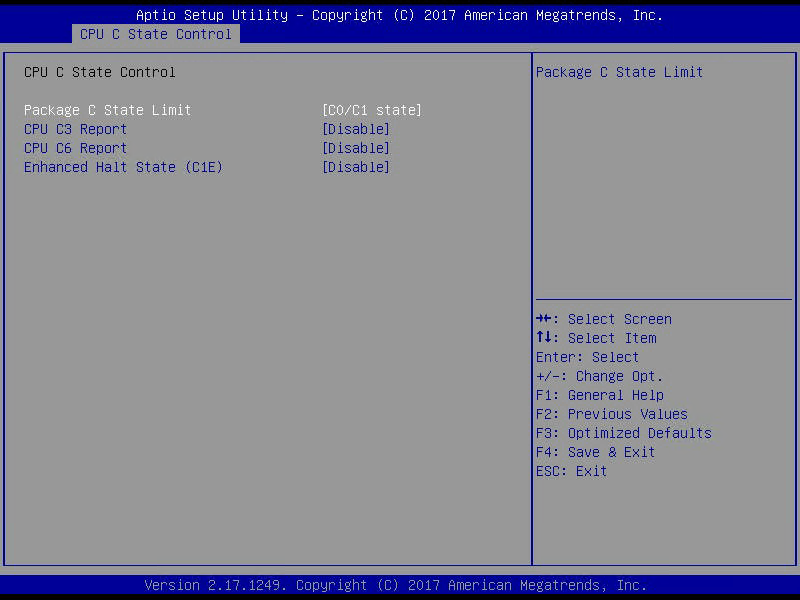

#### **C 状态的作用与优势**

- **节能**：C 状态的主要目的是节省能源。在空闲时，CPU 进入更深的 C 状态时，它消耗的电力大幅减少，这对于移动设备（如笔记本电脑）和大规模服务器系统来说，能够有效降低整体能耗。
- **延长电池寿命**：在笔记本电脑等移动设备中，使用 C 状态可以有效减少 CPU 的功耗，从而延长电池的使用时间。
- **提高系统效能**：对于负载较轻的任务，C 状态允许 CPU 节省不必要的功耗。这样，系统能够更高效地运行，避免过度消耗资源。
- **平衡性能与功耗**：现代处理器会根据当前的任务需求动态调整 C 状态。当负载较轻时，CPU 可以进入深度 C 状态节省功耗；当负载较重时，CPU 会恢复到 C0 状态，全速处理任务。

#### **C 状态的管理**

- **自动管理**：大多数操作系统和处理器会根据当前 CPU 的负载自动管理 C 状态。当 CPU 长时间空闲时，操作系统会指示处理器进入更深的 C 状态。

- **手动控制**：高级用户或管理员也可以通过操作系统的调度工具或 BIOS 设置来控制 C 状态。例如，在 Linux 中，你可以使用 `cpupower` 命令来管理 C 状态。

    ```less
     // 这些命令用于设置 CPU 的工作频率调节策略（Governor）
    # 使用节能模式
    cpupower frequency-set --governor powersave 
    # 使用性能模式
    cpupower frequency-set --governor performance  
    
    ​ // 这些命令用于控制 CPU 的空闲状态（C-States）。
    # 禁用 CPU 的深度睡眠状态，减少唤醒延迟 // 等同于启动参数：intel_idle.max_cstate=0
    cpupower idle-set -D 0
    # 启用 CPU 的深度睡眠状态 // 等同于启动参数：processor.max_cstate=1
    cpupower idle-set -D 100
    
    
    ​ // 用以校验
    # 验证模式
    cat /sys/devices/system/cpu/cpu*/cpufreq/scaling_governor
    # 检查每个 CPU 核心的当前频率
    cat /sys/devices/system/cpu/cpu*/cpufreq/scaling_cur_freq
    # 查看支持的频率范围
    # lscpu时也可以看到：CPU max MHz/CPU min MHz
    cat /sys/devices/system/cpu/cpu*/cpufreq/scaling_max_freq
    cat /sys/devices/system/cpu/cpu*/cpufreq/scaling_min_freq
    // CPU MHz的高频率：表示 CPU 在单位时间内可以执行更多的指令。CPU 频率越高，单位时间内完成的计算任务就越多，性能就越强，特别是在处理密集型计算、视频渲染、加密解密等需要大量计算资源的任务时
    ```

**C-state状态查询及设置：**参考：https://www.ctyun.cn/developer/article/454907728842821

我们可以对比设置前后的cpu工作频率如何：

节能模式下：

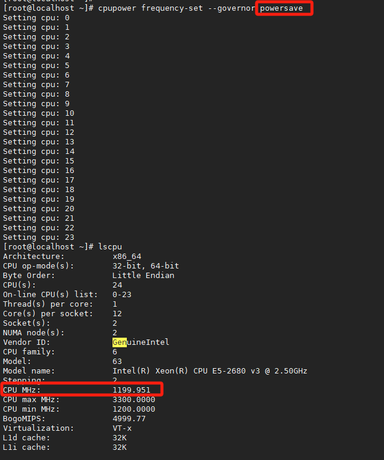

性能模式下：达到了3281.097

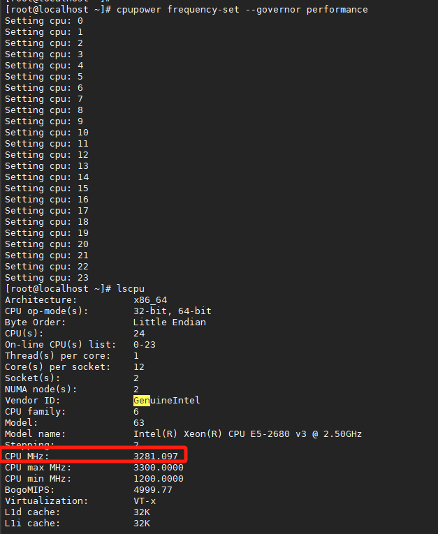


## 二、内核处理设置

### 1.  中断均衡服务处理

如果我们需要自己配置硬中断相关数值：需要先确保关闭 `irqbalance` 进程，否则它会定期自动平衡 IRQ 和 CPU 映射关系，覆盖我们的手动配置。

进行高性能优化时，请确保`irqbalance`已关闭并且未运行：

```bash
# 查看中断状态
systemctl status irqbalance
# 关闭中断平衡机制
service irqbalance stop
```


### 2. 非对称hash处理

对称哈希：如果你反转方向（A → B 与 B → A），哈希结果是一致的。

某些网卡（通常为低端 1Gbps）不支持对称哈希（**非对称哈希**正反方向哈希不同，可能跨队列，导致数据包flow处理时不准确）。在这些系统上，考虑到乱序数据包，建议使用 af-packet 进行以下设置（以下示例使用`eth1`）：

```bash
# 这是将 eth1 网卡的收包队列数降为 1 个（combined queue = 1），
# 意思是：即使你没有对称哈希，也强制所有包都进一个队列，以确保上下行流量都在同一个线程中处理，避免乱序。
ethtool -L eth1 combined 1
```


以下是整理后的表格，列出了可能使用的命令：

| **命令**                                                     | **作用**                                                     |
| ------------------------------------------------------------ | ------------------------------------------------------------ |
| `rmmod i40e && modprobe i40e`                                | 卸载并重新加载 `i40e` 驱动，用于配置 Intel 10Gbps 网卡。     |
| `ifconfig eth1 down`                                         | 禁用网卡接口 `eth1`，准备进行配置修改。                      |
| `/usr/local/sbin/ethtool -L eth1 combined 16`                | 设置网卡 `eth1` 的 RSS 队列数为 16，提高多核处理能力。       |
| `/usr/local/sbin/ethtool -K eth1 rxhash on`                  | 启用接收数据包的哈希计算，用于将数据包分配到多个接收队列。   |
| `/usr/local/sbin/ethtool -K eth1 ntuple on`                  | 启用 N-tuple 哈希，基于更多字段（如 IP 地址和端口）进行哈希计算，进一步优化负载均衡。 |
| `ifconfig eth1 up`                                           | 重新启用网卡接口 `eth1`，使其恢复工作状态。                  |
| `/usr/local/sbin/ethtool -X eth1 hkey 6D:5A:6D:5A:6D:5A:6D:5A...` | 设置网卡的 Toeplitz 哈希密钥，用于接收数据包的哈希处理，优化数据包的分配。 |
| `/usr/local/sbin/ethtool -A eth1 rx off`                     | 禁用接收卸载功能，减少硬件处理，降低延迟。                   |
| `/usr/local/sbin/ethtool -C eth1 adaptive-rx off adaptive-tx off rx-usecs 125` | 禁用自适应接收和传输控制，固定接收延迟为 125 微秒，减少不稳定性和延迟。 |
| `/usr/local/sbin/ethtool -G eth1 rx 1024`                    | 设置网卡 `eth1` 的接收环描述符数量为 1024，优化高流量情况下的性能。 |
| `/usr/local/sbin/ethtool -X eth1 hfunc toeplitz`             | 设置网卡使用 Toeplitz 哈希函数，优化数据包的哈希分配。       |
| `for proto in tcp4 udp4 tcp6 udp6; do /usr/local/sbin/ethtool -N eth1 rx-flow-hash $proto sdfn; done` | 为每个协议配置流量哈希规则，使用 `sdfn` 算法基于源 IP、目标 IP、源端口、目标端口等进行哈希计算。 |
| `/usr/local/sbin/ethtool -N eth1 rx-flow-hash $proto sd`     | 配置简化流量哈希规则，仅基于源 IP 和目标 IP 进行哈希计算。   |
| `af-packet: - interface: eth1 threads: 16 cluster-id: 99 cluster-type: cluster_qm` | 在 Suricata 配置中启用 `af-packet` 模式，指定使用 `eth1` 网卡，配置 16 个线程，并设定流量处理模式为 `cluster_qm`。 |


### 3. NUMA配置

```scss
yum install hwloc*

lstopo --logical --output-format txt > ./lstop.md
// 我们可以用notepid打开查看lstop.md（32机器）
```

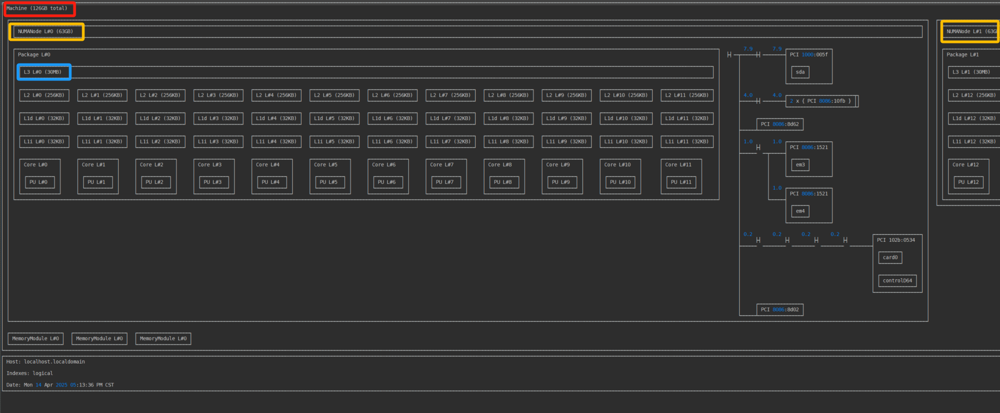

```less
// 或者输出为图片
lstopo --logical --output-format png > ./hostname.png
```

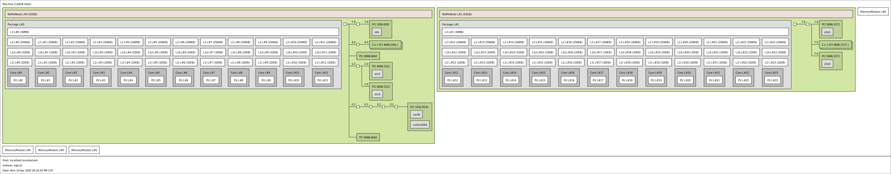

```less
// 除此之外，也可以直接查看你所想知道的pci的numa节点
cat /sys/class/net/p1p3/device/numa_node

// 对于numa的cpu有那些
cat /sys/devices/system/node/node0/cpulist
```


## 三、网卡设置

### 1.  网卡队列

```less
// 列出与特定 PCI 设备（在本例中为 0000:82:00.0）相关的 MSI 中断（Message Signaled Interrupts）信息。
ls -1 /sys/devices/*/*/0000:82:00.0/msi_irqs
```

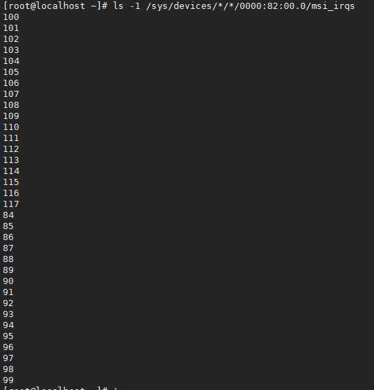

```less
// 查看网卡的rx/tx队列数目
ll /sys/class/net/p1p3/queues/
```

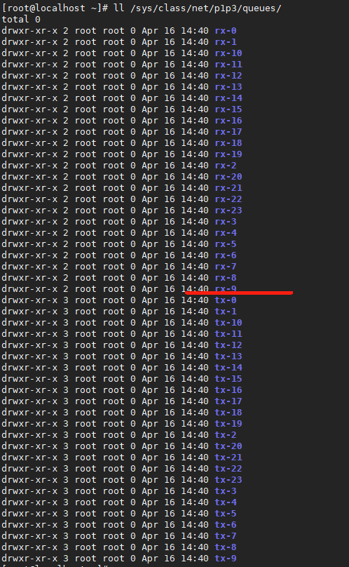

#### （1）调整 RX 队列权重（`ethtool -x/-X`）

一些网卡支持给不同的 queue 设置不同的权重（weight），权重越大， 每次网卡 `poll()` 能处理的包越多。如果网卡支持以下功能，就可以设置权重：

1. 支持 flow indirection；
2. 驱动实现了 `get_rxfh_indir_size()` 和 `get_rxfh_indir()` 方法；

检查 flow indirection 设置：

```apl
$ sudo ethtool -x eth0
RX flow hash indirection table for eth0 with 40 RX ring(s):
    0:      0     1     2     3     4     5     6     7
    8:      8     9    10    11    12    13    14    15
   16:     16    17    18    19    20    21    22    23
   24:     24    25    26    27    28    29    30    31
   32:     32    33    34    35    36    37    38    39
   40:      0     1     2     3     4     5     6     7
   48:      8     9    10    11    12    13    14    15
   ...
RSS hash key:
9a:b0:e3:53:ed:d4:14:7a:a0:...:e5:57:e8:6a:ec
RSS hash function:
    toeplitz: off
    xor: on
    crc32: off
```

第一列是改行的第一个哈希值，冒号后面的每个哈希值对应的 RX queue。例如，

- 第一行的哈希值是 0~7，分别对应 RX queue 0~7；
- 第六行的哈希值是 40~47，分别对应的也是 RX queue 0~7。

```less
# 在前两个 RX queue 之间均匀的分发接收到的包
ethtool -X eth0 equal 2

# 设置自定义权重：给 rx queue 0 和 1 不同的权重：6 和 2
ethtool -X eth0 weight 6 2
```

注意 queue 一般是和 CPU 绑定的，因此这也意味着相应的 CPU 也会花更多的时间片在收包上。 一些网卡还支持修改计算 hash 时使用哪些字段。


#### （2）网卡RSS

略


#### （3）Flow 绑定到 CPU：ntuple filtering

一些网卡支持 “ntuple filtering” 特性。该特性允许用户（通过 ethtool ）指定一些参数来 在硬件上过滤收到的包，然后将其直接放到特定的 RX queue。例如，用户可以指定到特定目 端口的 TCP 包放到 RX queue 1。

Intel 的网卡上这个特性叫 Intel Ethernet Flow Director，其他厂商可能也有他们的名字 ，这些都是出于市场宣传原因，底层原理是类似的。

ntuple filtering 其实是 Accelerated Receive Flow Steering (aRFS) 功能的核心部分之一， 这个功能在原理篇中已经介绍过了。aRFS 使得 ntuple filtering 的使用更加方便。

适用场景：最大化数据局部性（data locality），提高 CPU 处理网络数据时的 缓存命中率。例如，考虑运行在 80 口的 web 服务器：

1. webserver 进程运行在 80 口，并绑定到 CPU 2
2. 和某个 RX queue 关联的硬中断绑定到 CPU 2
3. 目的端口是 80 的 TCP 流量通过 ntuple filtering 绑定到 CPU 2
4. 接下来所有到 80 口的流量，从数据包进来到数据到达用户程序的整个过程，都由 CPU 2 处理
5. 监控系统的缓存命中率、网络栈的延迟等信息，以验证以上配置是否生效

检查 ntuple filtering 特性是否打开：

```bash
ethtool -k p1p1
```

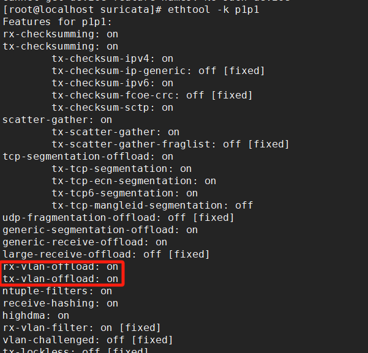

可以看到，上面的 ntuple 是开启的的。但如果关闭的话，可以使用下面命令打开：

```less
$ sudo ethtool -K eth0 ntuple on
```

打开 ntuple filtering 功能，并确认打开之后，可以用 `ethtool -u` 查看当前的 ntuple rules：

```less
ethtool -u p1p1
```

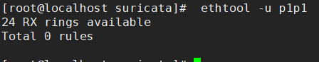

可以看到当前没有 rules。

我们来加一条：目的端口是 80 的放到 RX queue 2：

```less
ethtool -U p1p1 flow-type tcp4 dst-port 80 action 2
```

也可以用 ntuple filtering **在硬件层面直接 drop 某些 flow 的包**。 当特定 IP 过来的流量太大时，这种功能可能会派上用场。更多关于 ntuple 的信息，参考 ethtool man page。

如果你需要删除规则：

```less
// ethtool -U <interface> delete <rule_id>
ethtool -U p1p1 delete 42

// 如果您想删除所有 ntuple 规则，可以禁用 ntuple 功能，这将清除所有规则：
ethtool -K p1p1 ntuple off
```

`ethtool -S <DEVICE>` 的输出统计里，Intel 的网卡有 `fdir_match` 和 `fdir_miss` 两项， 是和 ntuple filtering 相关的。关于具体、详细的统计计数，需要查看相应网卡的设备驱 动和 data sheet。


### 2. 网卡的硬中断设置

#### （1）调整中断发起间隔rx-usecs

要查看网卡 `p1p1` 的中断合并设置（`adaptive-rx`），可以使用以下命令：

```bash
ethtool -c p1p1
```

该命令将显示网卡的中断合并参数，包括：

- **rx-usecs**：每次接收中断之间的最小时间间隔，单位为微秒。
- **rx-frames**：每次接收中断时处理的最大数据包数。

如果您希望查看当前的设置，执行上述命令后，系统将输出类似以下内容：

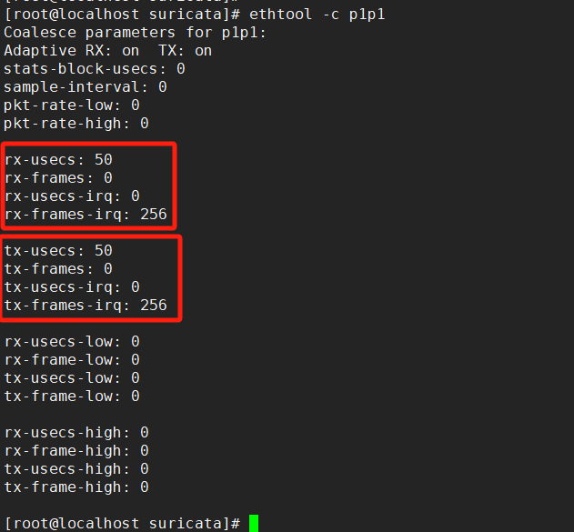

在这个例子中，`rx-usecs` 设置为 50 微秒，`rx-frames` 设置为 0(没有上限)。

可以使用`ethtool -C` 命令用于设置网卡的中断调度参数，常见的参数包括：

- **adaptive-rx**：启用或禁用自适应接收中断调度。
- **rx-usecs**：设置接收中断的最小间隔时间，以微秒为单位。

下述命令配置网卡 `p1p1` 和 `p3p1` 启用自适应接收中断调度，并将接收中断的最小间隔时间设置为 100 微秒。

```less
ethtool -C p1p1 adaptive-rx on rx-usecs 100 // 并非所有机器都支持该选项
```

**优化原理**

在高吞吐量的网络环境中，网卡可能会频繁触发中断，导致 CPU 资源被大量占用。通过设置 `rx-usecs`，可以限制两次中断之间的最小时间间隔，从而减少中断的频率，降低 CPU 的负载，提升系统的整体性能。


#### （2）调整硬中断亲和性

这种方式能手动配置哪个 CPU 负责处理哪个 IRQ。 

- 但在配置之前，需要先**确保关闭 `irqbalance` 进程**（或者设置 `--banirq` 指定不要对那些 CPU 做 balance） 否则它会定期自动平衡 IRQ 和 CPU 映射关系，覆盖我们的手动配置。

然后，通过 `cat /proc/interrupts` 查看网卡的每个 RX 队列对应的 IRQ 编号。

```less
// 要确定您的网络接口卡是否支持 RSS，请检查 中是否有多个中断请求队列与该接口关联/proc/interrupts
egrep 'CPU|p1p1' /proc/interrupts
```

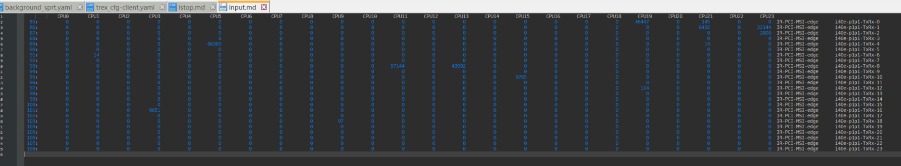

其中24个rx/tx队列的中断处理序号如下：

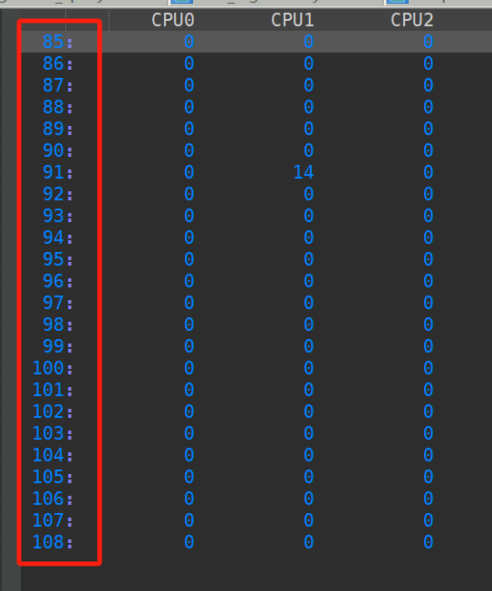

我们可以查看中断序号85的可接受cpu配置：

```less
// 系统的中断处理cpu建议
cat /proc/irq/85/affinity_hint

// cpu处理中断的掩码
cat /proc/irq/85/smp_affinity
080000

// 具体的cpu序号
cat /proc/irq/85/smp_affinity_list 
19
```

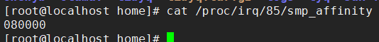

具体对照如下：

```less
0000 1000 0000 0000 0000 0000

允许处理 IRQ 85 中断的 CPU 核心是：
	CPU 19
```

这意味着，**允许 CPU 核心 19 来处理 IRQ 8 中断**。

但如果你查看 "egrep 'CPU|p1p1' /proc/interrupts" 中会发现，85的中断，除了cpu19，还有cpu21也会处理，如下：

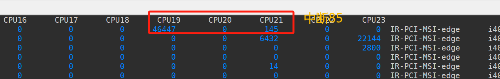

这主要是因为：systemctl status irqbalance 系统的中断均衡服务启动着，

- irqbalance` 是一个守护进程，负责动态调整中断分配，以平衡不同 CPU 核心的负载。如果你希望完全禁止中断的负载均衡，可以关闭 `irqbalance` 服务。

<span style="color: yellow;">		所以，如果我们需要某个网卡队列的rx/tx中断，就只能由某一个cpu进行处理，则必须施行 (二.1) 中的操作，关闭中断均衡服务。</span>  


<span style="color: yellow;">		注意：当我们调整一个网卡rx中断信号的cpu时，为保证性能，应该要注意查看网卡pci的numa节点，然后保证其中断处理的cpu也处在这个cpu上，防止跨numa的信号处理带来的性能下降。</span>  

最后，通过设置 `/proc/irq/<IRQ_NUMBER>/smp_affinity` 来**指定哪个 CPU 来处理这个 IRQ**。 注意这里的格式是 16 进制的 bitmask。

例子：指定 CPU 0 来处理 IRQ 8：

```less
// 注意选择和网卡在一个numa上的cpu进行指定
cat /sys/bus/pci/devices/0000\:82\:00.0/numa_node

bash -c 'echo 1 > /proc/irq/8/smp_affinity'
```


### 3. 网卡的软中断

#### （1）关于 NAPI pool 机制

- 这是 Linux 内核中的一种通用抽象，任何等待**不可抢占状态**发生（wait for a preemptible state to occur）的模块，都可以使用这种注册回调函数的方式。
- 驱动注册的这个 poll 是一个**主动式 poll**（active poll），一旦执行就会持续处理 ，直到没有数据可供处理，然后进入 idle 状态。
- 在这里，执行 poll 方法的是运行在某个或者所有 CPU 上的**内核线程**（kernel thread）。 虽然这个线程没有数据可处理时会进入 idle 状态，但如前面讨论的，在当前大部分分布 式系统中，这个线程大部分时间内都是在运行的，不断从驱动的 DMA 区域内接收数据包。
- poll 会告诉网卡不要再触发硬件中断，使用**软件中断**（softirq）就行了。此后这些 内核线程会轮询网卡的 DMA 区域来收包。之所以会有这种机制，是因为硬件中断代价太 高了，因为它们比系统上几乎所有东西的优先级都要高。

#### （2）设置 NAPI 间隔和 netdev_budget

```less
sysctl -a | grep netdev
```

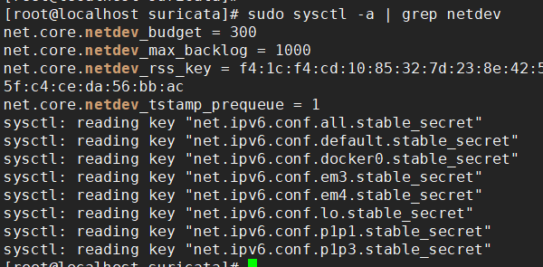

我们主要关注：

```less
netdev_budget：一个 CPU 单次轮询所允许的最大收包数量。 单次 poll 收包时，所有注册到这个 CPU 的 NAPI 变量收包数量之和不能大于这个阈值。
netdev_budget_usecs：每次 NAPI poll cycle 的最长允许时间，单位是 us。
```

触发二者中任何一个条件后，都会导致一次轮询结束。

修改配置：

```less
sysctl -w net.core.netdev_budget=3000
sysctl -w net.core.netdev_budget_usecs = 10000 // 并非所有机器都支持该选项
```

要保证重启不丢失，需要将这个配置写到 `/etc/sysctl.conf`。


### 3. perf调整

```less
// 查看最后一级缓存加载次数（通常是 L3 缓存）。
perf stat -e LLC-loads,LLC-load-misses,LLC-stores,LLC-prefetches -C 1

// 命令进行内存访问的采样分析。
perf mem 
```

