## 性能调试工具

### 0、定律

```less
Cache有效性得益于空间局部性（附近的数据也会被用到）和时间局部性（今后一段时间内会被多次访问）原理，通过合理的使用cache，能够使得应用程序性能得到大幅提升
```

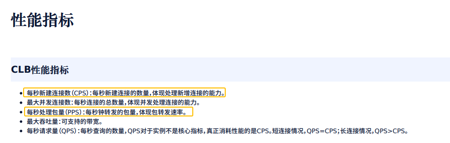


### 1、valgrind 

```shell
wget https://sourceware.org/pub/valgrind/valgrind-3.16.1.tar.bz2(本机下载加xshell的rz)
tar -xjvf valgrind-3.16.1.tar.bz2 (或许需要用到yum install bzip2)
cd valgrind-3.16.1/
yum -y install automake
{
http://ftp.gnu.org/gnu/autoconf
tar -zxvf autoconf-2.69.tar.gz 
cd autoconf-2.69
./configure
make;make install
autoconf --version
}
./autogen.sh
./configure
make
sudo make install
```

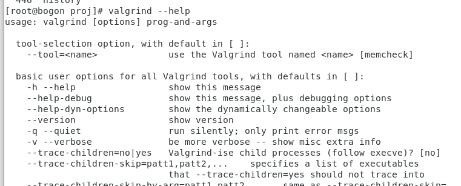

命令指示：valgrind --tool=memcheck --leak-check=full --trace-children=yes --track-fds=yes --show-reachable=yes   ./xxxx

测试：valgrind --tool=memcheck --leak-check=full --trace-children=yes --track-fds=yes --show-reachable=yes  --log-file=./valgrind_report.log  ./bin/mysql-sniffer -i lo -p 1433

```less
https://www.cnblogs.com/gmpy/p/14778243.html

valgrind 将内存泄漏分为 4 类。

明确泄漏（definitely lost）：内存还没释放，但已经没有指针指向内存，内存已经不可访问
间接泄漏（indirectly lost）：泄漏的内存指针保存在明确泄漏的内存中，随着明确泄漏的内存不可访问，导致间接泄漏的内存也不可访问
可能泄漏（possibly lost）：指针并不指向内存头地址，而是指向内存内部的位置
仍可访达（still reachable）：指针一直存在且指向内存头部，直至程序退出时内存还没释放。
```


### 2、ASAN

（1）ASAN

```less
# 参考 https://ost.51cto.com/posts/16209
# 工具源码 https://github.com/dengking/sanitizers/blob/main/asan/examples/asan-default-options/detect_leaks.cc
# 安装： yum install libasan

ASAN，全称 AddressSanitizer，可以用来检测内存问题，例如缓冲区溢出或对悬空指针的非法访问等。
根据谷歌的工程师介绍 ASAN 已经在 chromium 项目上检测出了300多个潜在的未知bug，而且在使用 ASAN 作为内存错误检测工具对程序性能损耗也是及其可观的。

根据检测结果显示可能导致性能降低2倍左右，比Valgrind（官方给的数据大概是降低10-50倍）快了一个数量级。

而且相比于Valgrind只能检查到堆内存的越界访问和悬空指针的访问，ASAN 不仅可以检测到堆内存的越界和悬空指针的访问，还能检测到栈和全局对象的越界访问。

这也是 ASAN 在众多内存检测工具的比较上出类拔萃的重要原因，基本上现在 C/C++ 项目都会使用ASAN来保证产品质量，尤其是大项目中更为需要。

#如何使用 ASAN
从LLVM3.1、GCC4.8、XCode7.0、MSVC16.9开始ASAN就已经成为众多主流编译器的内置工具了，因此，要在项目中使用ASAN也是十分方便。
现在只需要在<编译命令>中加上
	# -fsanitize=address：开启内存越界检测
	# -fno-omit-frame-pointer     打印函数调用路径
	# -fsanitize-recover=address：一般后台程序为保证稳定性，不能遇到错误就简单退出，而是继续运行，采用该选项支持内存出错之后程序继续运行，需要叠加设置ASAN_OPTIONS=halt_on_error=0才会生效；若未设置此选项，则内存出错即报错退出
	ASAN_CFLAGS += -fsanitize=address -fsanitize-recover=address

例如：gcc noleak.c -o noleak -fsanitize=address -g
但对于cmake，需要两点：编译参数 + 链接库
```

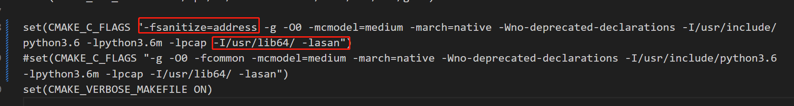

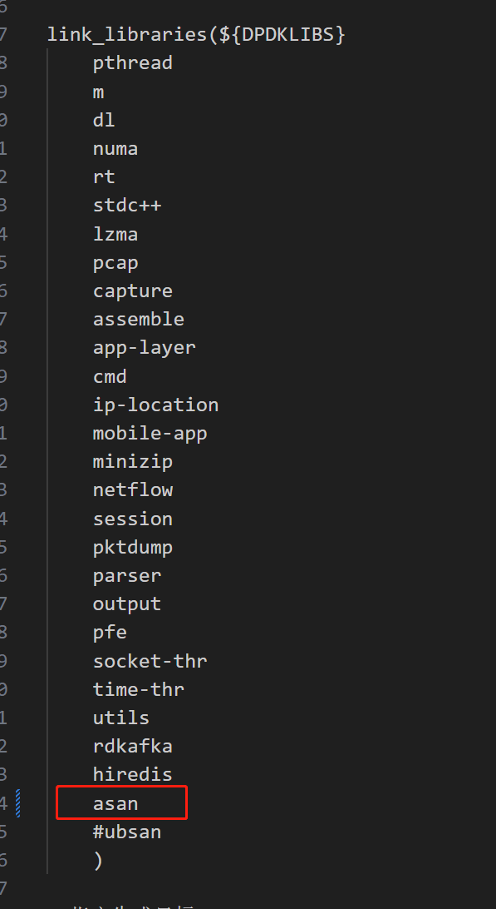

内存错误类型

```less
Use after free：访问堆上已经被释放的内存
Heap buffer overflow：堆上缓冲区访问溢出
Stack buffer overflow：栈上缓冲区访问溢出
Global buffer overflow：全局缓冲区访问溢出
Use after return：访问栈上已被释放的内存
Use after scope：栈对象使用超过定义范围
Initialization order bugs：初始化命令错误
Memory leaks：内存泄漏
```

使用实例：

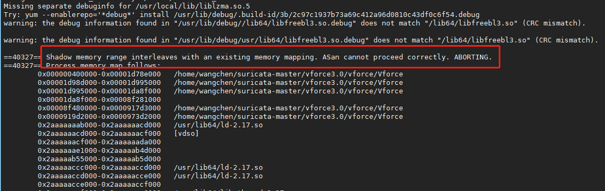

```less
# 是因为ASAN的影子内存空间被占用或超值，导致的内存映射出现问题

# 所以根据现象，我们或许可以尝试使用 -no-pie 参数来规避全局变量过多导致的asan启动失败
 https://juejin.cn/post/6844903825589927943
```

1、安装centos-release-scl

```less
sudo yum install centos-release-scl
```

2、安装devtoolset

```less
sudo yum install devtoolset-8-gcc*
```

3、激活对应的devtoolset，所以你可以一次安装多个版本的devtoolset，需要的时候用下面这条命令切换到对应的版本

```less
scl enable devtoolset-8 bash

// 如果发生报错可以 warning: /opt/rh/devtoolset-8//enable scriptlet does not exist!
echo "source /opt/rh/devtoolset-8/enable" >>/etc/profile  // 如果之后不使用最新的gcc，则需要将/etc/profile文件中的配置删除
yum reinstall devtoolset-8-runtime //重新安装启动脚本

gcc -v 
// 此时显示的可能还会是你原来的版本
// 此时可以去/opt/rh/目录下，将不需要的版本删除，比如之前还误安装了10、9的版本
// 删除多余版本后，就可以了

# 当然，我们也可以指定自己安装的gcc路径来编译程序
```

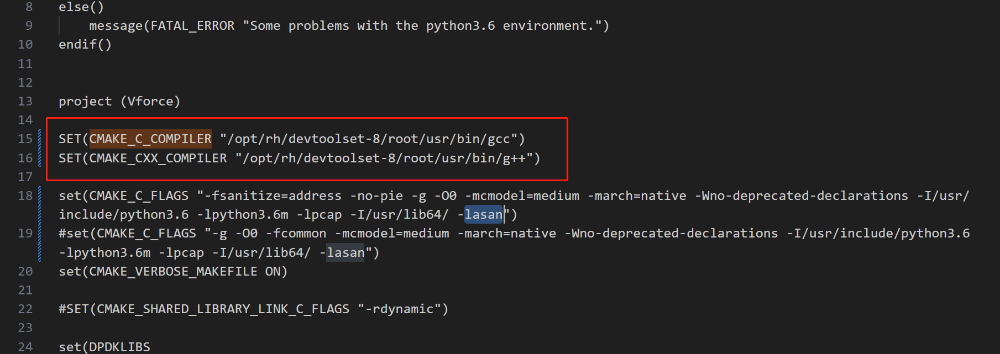

之后，出现了报错：

```less
# <找不到 libasan 以及 libstdc++_nonshared>

cp /usr/lib/gcc/x86_64-redhat-linux/4.8.2/32/lib*so /usr/lib64 // yum install libasan 之后，拷贝库到系统默认路径下

yum install devtoolset-8-libstdc++*


# 但还是没有解决
```

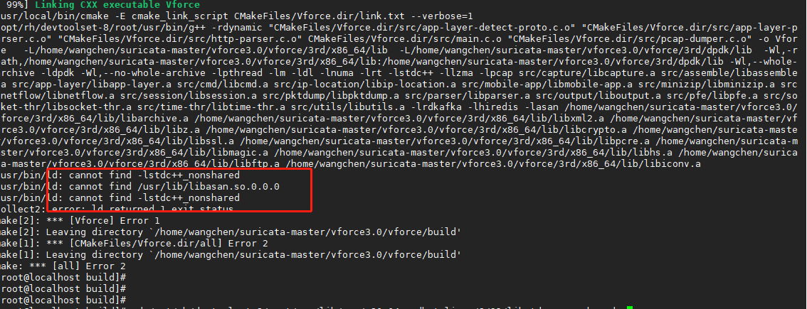

```less
# 但我们可以确定的是，该库是因为实际上 devtoolset 中的新 GCC 并没有真的附带一个 libstdc++.so，而是将那些相较于旧版 GCC（也就是系统中自带的 /lib64/libstdc++.so）更新多出来的内容，全部放在了附带的 libstdc++_nonshared.a 中，也就是说，C++ 标准库中旧的原有的部分，依然链接 /lib64/libstdc++.so，而更新的部分，最终静态链接到程序中。libgcc_s.so 也是同理。

# 所以，可以用centos原来的g++来进行编译，我们修改一下g++的编译目录
```

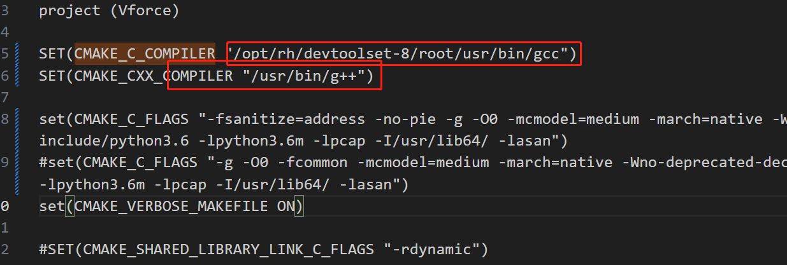

```less
# 重新编译后
# 又出现应用asan库问题  暂未解决

# 后续猜测是59机器的gcc版本导致。
```

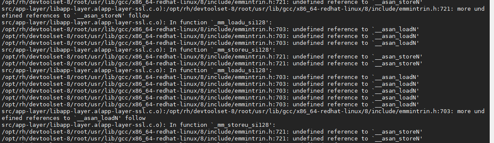


（2）LSAN

● LSAN: 内存泄漏检测工具，已经集成到 ASAN 中，可以通过设置环境变量ASAN_OPTIONS=detect_leaks=0来关闭ASAN上的LSAN，也可以使用-fsanitize=leak编译选项代替-fsanitize=address来关闭ASAN的内存错误检测，只开启内存泄漏检查。

（3）MSAN

● MSAN: 对程序中未初始化内存读取的检测工具，可以在编译命令中添加-fsanitize=memory -fPIE -pie启用，还可以添加-fsanitize-memory-track-origins选项来追溯到创建内存的位置

（4）TSAN

● TSAN: 对线程间数据竞争的检测工具，在编译命令中添加-fsanitize=thread启用 其中ASAN就是我们今天要介绍的重头戏。


### 3、perf

```less
# ubuntu安装 perf，包名和内核版本相关，可以直接输入perf命令会给出安装提示 
	sudo apt install linux-tools-5.4.0-74-generic linux-cloud-tools-5.4.0-74-generic 
# centos安装	
	yum install perf
# 列出所有能够触发perf采样的事件：
	perf list


task-clock-msecs：CPU利用率，此值越高说明程序的多数时间花费在CPU计算上而非IO；
context-switches：进程切换次数，记录程序运行过程中发生了多少次进程切换，频繁的进程切换是应该避免的；
cache-misses：程序运行过程中总体的cache利用情况，如果该值过高，说明程序的cache利用不好；
CPU-migrations：表示进程t1运行过程中发生了多少次CPU迁移，即被调度器从一个CPU转移到另外一个CPU上运行；
cycles：处理器时钟，一条指令可能需要多个cycles；
instructions:机器指令数目；
IPC：instructions/cycles的比值，该值越大越好，说明程序充分利用了处理器的特性；
cache-references：cache命中的次数；
cache-misses：cache失效的次数；


# cpu的上下文切换、cpu迁移、IPC、分支预测 
	perf stat -a sleep 5 
	perf stat -p 161415 -a sleep 10 // 记录指定线程
# cpu的IPC与缓存命中率 
	perf stat -e cycles,instructions,cache-references,cache-misses,bus-cycles -a sleep 10 
# cpu的1级数据缓存命中率 
	perf stat -e L1-dcache-loads,L1-dcache-load-misses,L1-dcache-stores -a sleep 10 
# 页表缓存TLB命中率 
	perf stat -e dTLB-loads,dTLB-load-misses,dTLB-prefetch-misses -a sleep 10 
# cpu的最后一级缓存命中率 
	perf stat -e LLC-loads,LLC-load-misses,LLC-stores,LLC-prefetches -a sleep 10 
# 对指定PID的系统调用按类型计数，直到按Ctrl-C: 
	perf stat -e 'syscalls:sys_enter_*' -p PID -I1000 2>&1 | awk '$2 != 0' 
# 对整个系统按类型计数系统调用，持续5秒: 
	perf stat -e 'syscalls:sys_enter_*' -a sleep 5 2>&1| awk '$1 != 0' 
# 计数每秒系统范围内的系统调用: 
	perf stat -e raw_syscalls:sys_enter -I 1000 -a
 #统计CPU 0的信息
 	perf stat -C 0  // 在线程绑定core的情况下，通过查询core相关信息，可以很好披露线程状态


参考：https://blog.csdn.net/bandaoyu/article/details/108765693
# 统计
perf  stat -e stalled-cycles-frontend -e instructions -e cache-references -e cache-misses -e L1-dcache-loads -e L1-dcache-misses -e L1-dcache-stores -e L1-dcache-store-misses -e LLC-loads -e LLC-load-misses -e LLC-prefetches -e cycles -e cs -p 12567 sleep 60
# 收集记录
perf  c2c record --call-graph dwarf,8192 -F 20000 -a --all-user sleep 5
{
    dwarf：表示回溯方式，perf 同时支持 3 种栈回溯方式：fp, dwarf, lbr，推荐dwarf    
}
```

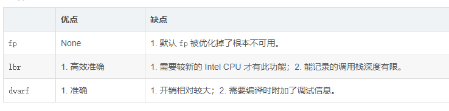

```less
#查看报告  #### 其中按d在指定行可以查看指定的函数命中相关信息####
perf c2c report -NN -g --call-graph -c pid,iaddr
# 其中rmt hitm是远端cache命中 <代价最大> 
# 为多核命中 lcl hitm <代价其次大>
```

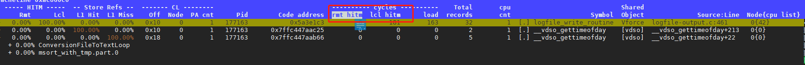

```less


26.1. perf c2c 的目的
perf 工具的 c2c 子命令启用 Shared Data Cache-to-Cache (C2C) 分析。您可以使用 perf c2c 命令检查 cache-line contention 来检测 true 和 false 共享。

当 Symmetric Multi Processing (SMP) 系统中的处理器内核修改由其他处理器使用的同一缓存行上的数据项时，缓存行争用会出现这种情况。使用这个缓存行的所有其他处理器都必须使其副本无效，并请求更新过。这会导致性能下降。

perf c2c 命令提供以下信息：
	缓存被检测到竞争的行
	读取和写入数据的进程
	导致竞争的说明
	涉及内容的 Non-Uniform Memory Access (NUMA) 节点
#命令：
 perf c2c record -a sleep seconds
 perf c2c report --stdio

26.2. perf mem
	perf 工具的 mem 子命令启用内存访问抽样（加载和存储）。perf mem 命令提供有关内存延迟、内存访问类型、导致缓存命中和丢失的功能，并通过记录数据符号（这些点和丢失的内存位置）。


参考：
https://wudaijun.com/2019/04/linux-perf/
brendangregg.com/perf.html
https://access.redhat.com/documentation/en-us/red_hat_enterprise_linux/8/html/monitoring_and_managing_system_status_and_performance/detecting-false-sharing_monitoring-and-managing-system-status-and-performance


Tip： 
（1）有时候为啥死循环没有导致系统卡死，或许时因为没有指定CPU上运行，系统很有可能为了均衡，进行了调度，所以可以绑核测试。 
	taskset -c 1 ./a.out 
（2） 然后利用 perf stat -C 0  来查看该core的相关信息
 (3) https://www.cnblogs.com/loveyan1314/articles/7757675.html  //提高cache命中率的常规手段
```

例如使用：perf  stat   ./Vforce

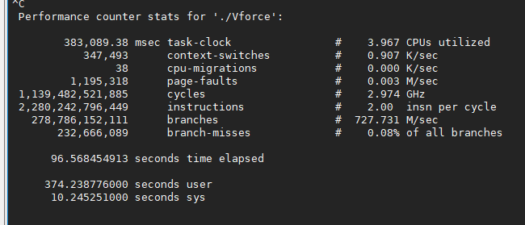

```less
task-clock:任务占用的CPU时间
context-switches:上下文切换次数
cpu-migrations:CPU迁移次数
page-faults:缺页异常的次数
cycles:消耗CPU周期数
instructions:执行指令数
branches:遇到的分支指令数量
branches-misses:预测错误的分支指令数  // 即程序对于if/else的预测
```

可以参考：https://blog.csdn.net/WANGYONGZIXUE/article/details/123907232

```less
perf record 精确到函数
perf record -a -g ./Vforce
选项
-a 获取所有CPU事件
-p 获取指定PID进程事件
-o 指定获取保存数据的文件名称
-g 函数调用功能图

# 转换生成的perf.data
sudo perf report -i perf.data > perf.txt   // 可以查看每个函数工作的cpu占比
```

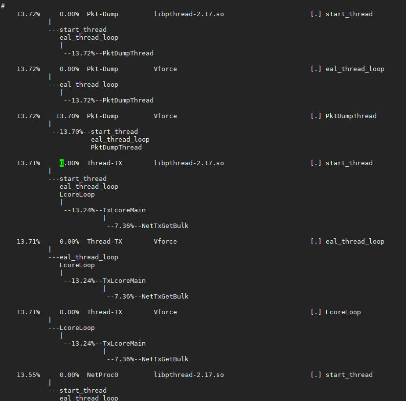

```less
#火焰图安装
git clone https://github.com/brendangregg/FlameGraph.git  

#生成折叠后的调用栈
perf script -i perf.data &> perf.unfold
 
#生成火焰图
/home/wangchen/flame/FlameGraph/stackcollapse-perf.pl perf.unfold &> perf.folded
 
#生成SVG图
/home/wangchen/flame/FlameGraph/flamegraph.pl  perf.folded >perf.svg

注意：纵向表示调用栈的深度，横向表示消耗的时间. 一个格子的越大越说明其可能是瓶颈，颜色则没有含义
```

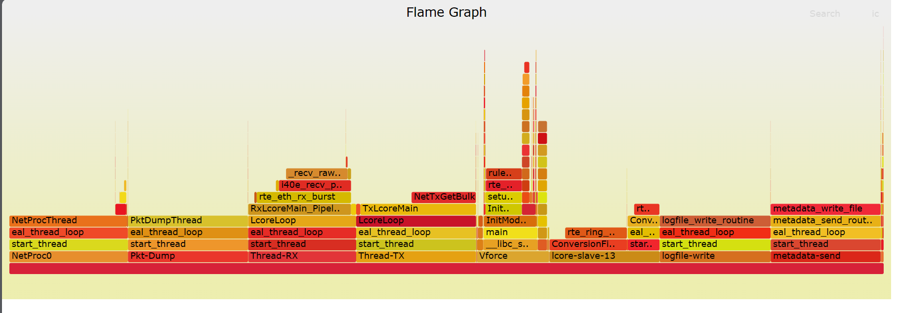

我们可以查看一下chche的响应时间图

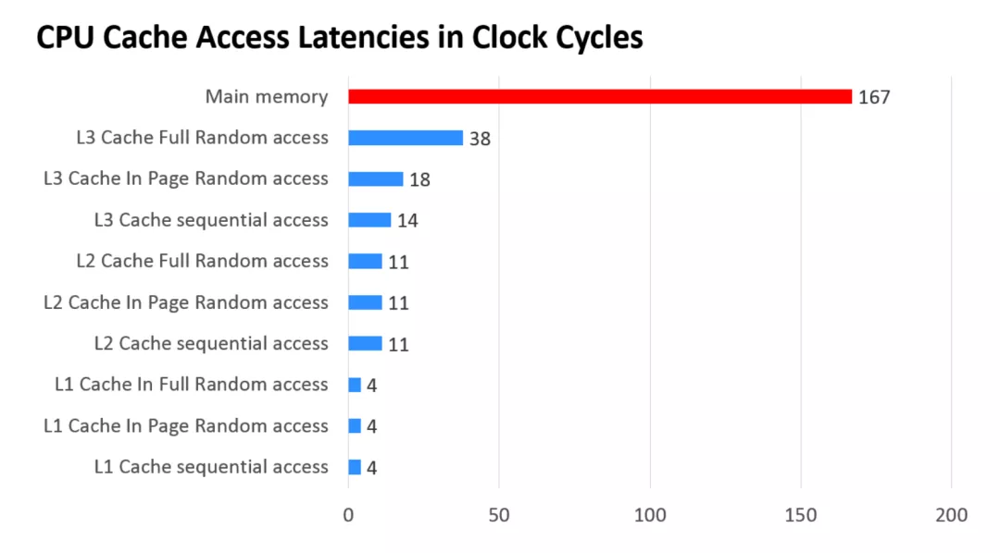

所以，如果程序的cache miss过高，那么程序的性能也就越差。


### 4、jstack/jmap

```less
# 只适用于java-jvm 

yum list --showduplicate | grep java-1.8 | grep devel 查看 有哪些可安装的jdk1.8 开发工具包

yum install java-1.8.0-openjdk-devel.x86_64 -y
```


### 5、pstack

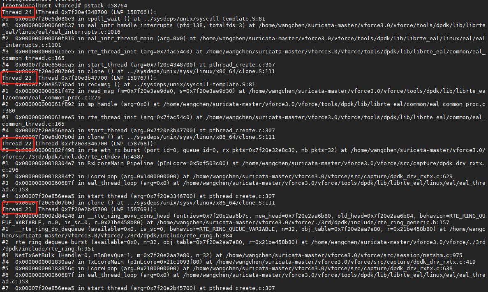

```less
ps -eLo pid,lwp,pcpu |grep 158764 // 我们可以查看那个线程的执行时间过长，并通过pstack对应的函数栈来检查问题
```

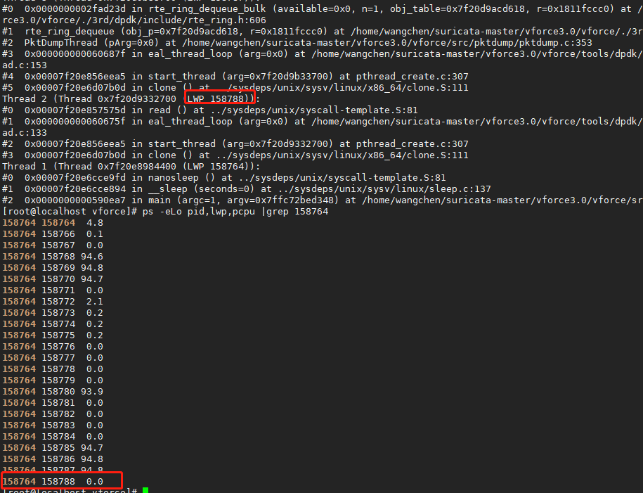

```less
# 查看对应的线程信息
pstack 158764 | grep "158770" -A 20
```

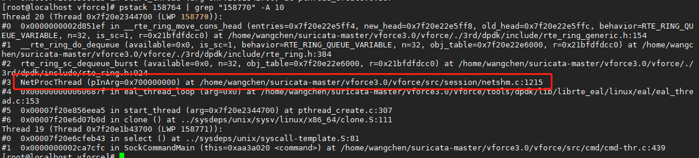


### 6、gcore

```less
# 优势在于，当调试一个程序的时候，理想状态是不重启应用程序就获取core文件。

# 出现coredump时就可以使用正常bt进行调试
```


### 7、strace

```less
# 优势在于，可以检测系统调用，当用于检查线程死锁、线程信号异常、进程信号交互等系统调用相关功能时更方便
# strace不光能追踪系统调用，通过使用参数-c，它还能将进程所有的系统调用做一个统计分析给你
```


### 8、vmstat

https://blog.csdn.net/javajxz008/article/details/88862875

```less
# 主要用以查看系统级别的相关参数

#$ vmstat
cs-每秒上下文切换次数
in-每秒中断数
r-就绪队列长度（正在运行或正在等待CPU的进程数） 
b-不可中断睡眠进程数
us-用户态CPU使用率
sy-系统CPU使用率，一般为内核占用

#$ pidstat -w 5
```


### 9、查看TCP连接的各状态的数量

```less
netstat -n | awk '/^tcp/ {++S[$NF]} END {for(a in S) print a, S[a]}'

output:
TIME_WAIT 9822
CLOSE_WAIT 129
SYN_SENT 25
FIN_WAIT1 2468
FIN_WAIT2 748
ESTABLISHED 19344
SYN_RECV 942
CLOSING 204
LAST_ACK 4552
```


### 10、查看进程占用的句柄数

```less
lsof -n | awk '{print $2}' | sort | uniq -c | sort -nr | more // 前面为使用的句柄数目、后面为进程号
```


### 11、宽哥分享的配置

```less
## grub.cfg	
linux16 /vmlinuz-3.10.0-1160.92.1.el7.x86_64 root=/dev/mapper/centos-root ro crashkernel=auto rd.lvm.lv=centos/root rd.lvm.lv=centos/swap rhgb quiet LANG=zh_CN.UTF-8 default_hugepagesz=1G hugepagesz=1G hugepages=180 amd_iommu=on iommu=pt nosoftlockup nmi_watchdog=0 selinux=0 intel_pstate=disable intel_idle.max_cstate=0 processor.max_cstate=1 idle=poll isolcpus=1-127 nohz_full=1-127 rcu_nocbs=1-127

## 10.100.0.28
transparent_hugepage=never default_hugepagesz=1G hugepagesz=1G intel_iommu=off isolcpus=1-9,11-19 nohz_full=1-9,11-19 rcu_nocbs=1-9,11-19 console=ttyS1,115200n8 console=tty1

# 关闭超线程：因为lscpu查看的时候：NUMA node0 CPU(s):     0-19,40-59 
	其中的0-19 40-59 两组对应的其实是一个core，即0线程与40线程其实是一个core，但是通过超线程来实现一个core可以有两个线程。所以关闭超线程有利于线程独占资源的使用。
```

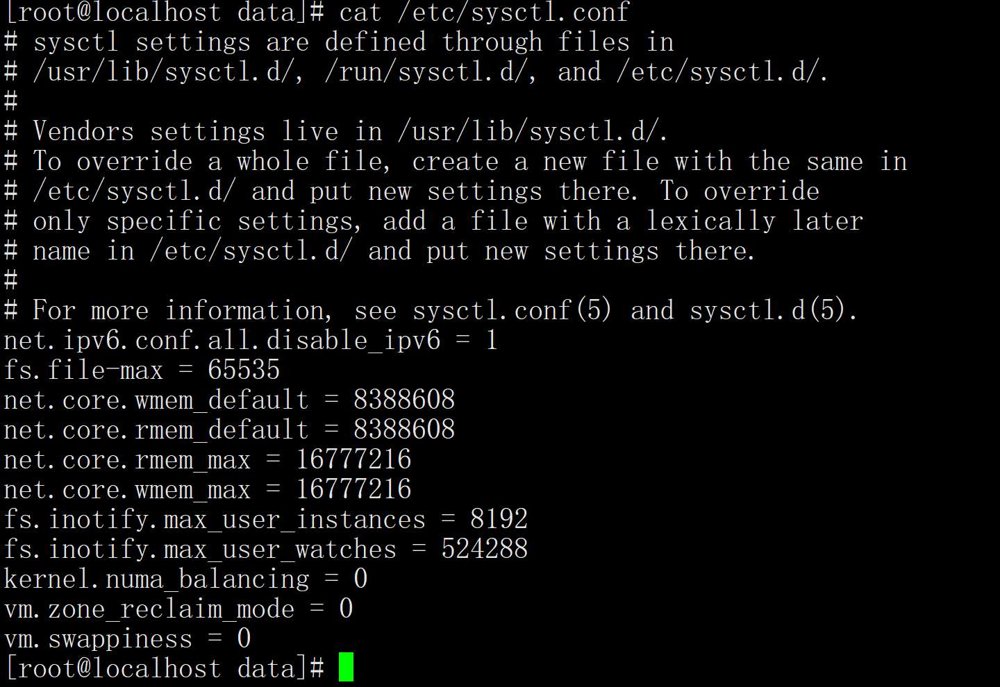

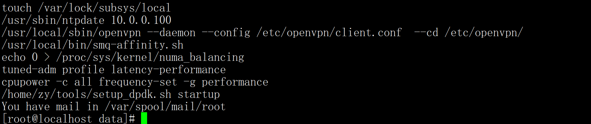

```less
tuned-adm profile latency-performance

cpupower frequency-set -g performance
```


### 12、gprof使用

gprof（GNU Profile）是一个C/C++程序性能分析工具，它能够`计算程序运行中各个函数消耗的时间`， 可以帮助程序员找出众多函数中耗时最多的函数。 产生程序运行时候的`函数调用关系图(call graph)`，包括调用次数，可以帮助程序员分析程序的运行流程。时间计算准确度很高，对函数执行次数的统计是100%正确的，但是对函数执行时间的统计是通过采样平率估算的，存在一定的偏差

2.编译参数 -pg

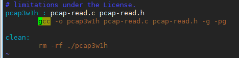

3.查看gprof

```less
./pcap3w1h -f ./32-packet.pcap //正常运行程序即可

gprof ./pcap3w1h  gmon.out // 完整查看
gprof ./pcap3w1h  gmon.out -i // 简要信息
gprof ./pcap3w1h  gmon.out -qb // 函数调用关系  例如：[2]序号上方为父函数
gprof ./pcap3w1h  gmon.out -pparseMAC -b // -p查看指定函数
```

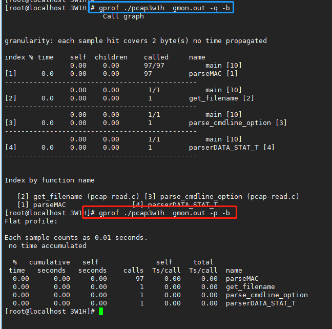
