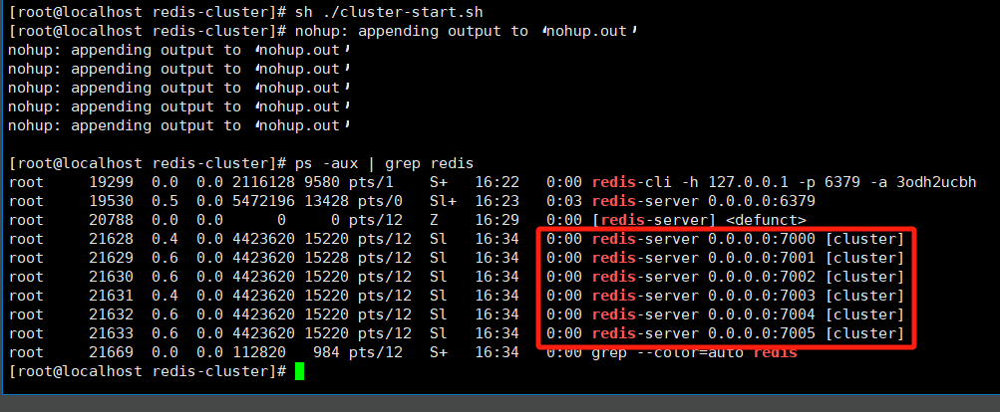
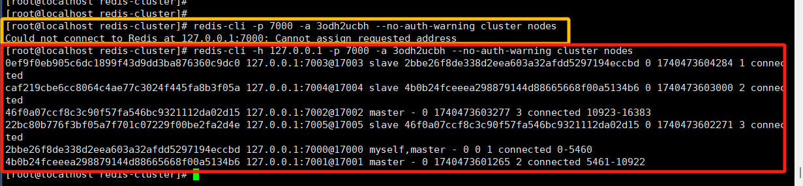
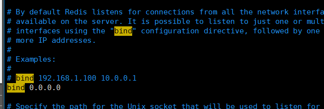
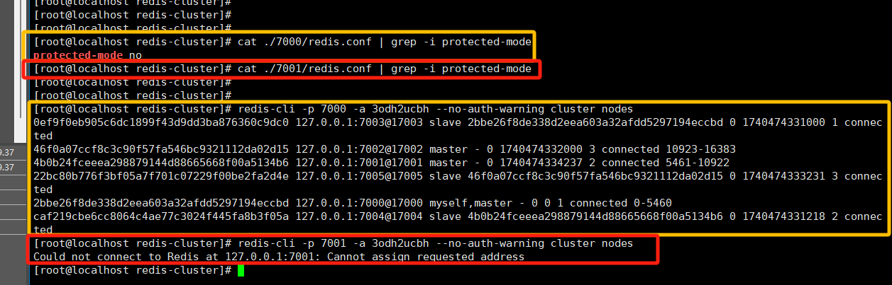

# redis安装使用


## 一、jemolloc安装（可选）

```less

// 不建议这样安装
1. 首先从官网下载jemalloc的代码
下载链接： https://github.com/jemalloc/jemalloc/archive/5.2.1.tar.gz

tar xzvf 5.2.1.tar.gz
cd jemalloc-5.2.1/wget https://github.com/jemalloc/jemalloc/archive/5.2.1.tar.gz
2. 解压
tar xzvf 5.2.1.tar.gz
cd jemalloc-5.2.1/
3. 编译安装 
./autogen.sh 
./configure --with-version="5.2.1-0-g0" #需要设置版本号，不然jemalloc.h中的版本号为0，会影响使用
make dist 
make 
make install 
sudo ldconfig /* 因为安装了新的动态库 */


// 尽量使用redis的自带jemolloc安装
redis的jemolloc安装如下
cd deps/
find ./ -name "*.sh" | xargs chmod +777 /* 因为make中回调用大量sh脚本 */
chmod +777 ./configure
sh ./autogen.sh
./configure
make
make install
```


## 二、release处理

```less
release的报错主要是因为releas.h文件没有生成的缘故，该文件由src/mkreleasehdr.sh脚本执行生成
```


## 三、make问题

```less
unzip ./redis-unstable.zip

make (首次make将报错，需要进行以下修改)

/src/Makefile
（1）尽量使用deps中的jemalloc进行安装使用.a静态包，否则make报错；
（2）修改Makefile文件中-I参数如下（增加../deps/jemalloc/src 避免报错相关jemalloc方法undefined）
ifeq ($(MALLOC),jemalloc)
        DEPENDENCY_TARGETS+= jemalloc
        FINAL_CFLAGS+= -DUSE_JEMALLOC -I../deps/jemalloc/include ../deps/jemalloc/src
        FINAL_LIBS := ../deps/jemalloc/lib/libjemalloc.a $(FINAL_LIBS)
endif
（3）make结束

// 如果make版本高，好像还会有个报错 redisBuildId，这个自己给改一下就好了
#ifndef REDIS_BUILD_ID
 #define REDIS_BUILD_ID "5.9"
#endif
uint64_t redisBuildId(void) {
    char buildid[1024] = {0};
    int len = snprintf(buildid, 1024, "%s%s%s%s", REDIS_VERSION, REDIS_BUILD_ID, REDIS_GIT_DIRTY, REDIS_GIT_SHA1);
    //  char *buildid = (REDIS_VERSION REDIS_BUILD_ID REDIS_GIT_DIRTY REDIS_GIT_SHA1);
    return crc64(0,(unsigned char*)buildid,len);
}


##### 建议：make test有利于提早排除redis相关接口的错误 #####

如果需要make test，则需要安装tcl测试用例：
1.直接安装新的tcl,命令如下:
yum install -y tcl-devel
2.清空之前的make的缓存命令:
make distclean
3.重新make编译命令:
make && make install
4.结束后重新测试命令:
make test
5、Vforce需要拷贝一次so a文件，vforce默认读取lib64下库文件，所以不考过去找不到相关库文件
cp /usr/local/lib/libhiredis.* /usr/lib64/

（注意：以下yum操作不需要）
执行发现报错lzma相关库，yum安装时发现yum出错，于是卸载重装：
rpm -qa yum

wget http://mirrors.163.com/centos/7/os/x86_64/Packages/yum-3.4.3-168.el7.centos.noarch.rpm
wget http://mirrors.163.com/centos/7/os/x86_64/Packages/yum-utils-1.1.31-54.el7_8.noarch.rpm
wget http://mirrors.163.com/centos/7/os/x86_64/Packages/yum-plugin-fastestmirror-1.1.31-54.el7_8.noarch.rpm
wget http://mirrors.163.com/centos/7/os/x86_64/Packages/yum-metadata-parser-1.1.4-10.el7.x86_64.rpm

rpm -qa | grep yum | xargs rpm -e --nodeps

rpm -ivh yum-* --nodeps

```


```less
属于/usr/lib 与 /usr/local/lib64下lzma的版本冲突(出现0.2、0.0两个版本)，删除其中一个0.0版本的相关库即可，之后不执行make test 避免又重新安装上新版本冲突。可以直接启动redis
```


## 四、redis的c接口

```less
#连接命令
redis-cli -h 192.168.69.152 -p 6379 -a 3huoSOJTGVOGeFlH

gcc ./redis-client.c -o redisrun -I /usr/local/include/hiredis/  -L/usr/local/lib/ -lhiredis

vi /etc/ld.so.conf 加入新的libredis动态库路径/usr/local/lib/        
ldconfig #重新更新动态库的加载

# redis测试命令
SUBSCRIBE sdx:send:ReFtpRuleInfo
publish sdx:send:ReFtpRuleInfo "good morning2"

SADD  sdx:web:unWorkRule  0 1 2 3 4 5 6 7
SDIFF  sdx:web:unWorkRule
```


redis库的调用必须在根目录的cmake中指定才能找到


```less
#前段界面
http://192.168.69.42:8000/#/trafficstats  
admin admin123、admin123456

redis-cli -h 192.168.69.152 -p 6379 -a 3huoSOJTGVOGeFlH // 之后变成过192.168.69.42
/* 	或着：
	redis-cli -h 192.168.69.152
	192.168.69.152> auth "3huoSOJTGVOGeFlH" 
*/
redis-server //端口查看 

ftp密码: JSC@3passok

#开机、检测命令：
hget  sdx:0x6012 192.168.69.42
hget  sdx:0x6013 192.168.69.42
#失效规则
SDIFF  sdx:web:unWorkRule
#规则文件ftp信息
SUBSCRIBE sdx:send:ReFtpRuleInfo
```

#### 问题思路: 句柄冲突

1、之前redis的频道监视服务句柄和规则xml上传句柄是同一个，然后就发现程序启动后规则上传的redis函数接口一直没有返回数据，卡死了。最后分析源码和redis源码才发现是因为两个部分句柄冲突导致的；

2、之前redis的频道监视服务句柄和规则xml上传句柄是同一个，然后就发现程序启动后规则上传的redis函数接口一直没有返回数据，卡死了。最后分析源码和redis源码才发现是因为两个部分句柄冲突导致的


## 五、FTP启动连接下载文件

```less
systemctl start  vsftpd


ftp配置文件
vim /etc/vsftpd.conf
vim  /etc/ftpusers


 1、启动完毕我们想通过root来访问，这个时候是访问不了的，因为ftp做了限制，从哪里限制的呢，通过两个配置文件（/etc/vsftpd/）注释root用户。
	/etc/vsftpd/ftpusers
	/etc/vsftpd/user_list
	
 2、chroot_local_user 的作用
	如果设置为 YES，则所有本地用户在登录后将被限制在他们的主目录中。
	如果设置为 NO，则所有本地用户在登录后不会被限制在他们的主目录中。
 所以，如果你使用root用户登录，但是再wangchen用户目录下put文件是不允许的，除非修改为no。

ftp
>open 127.0.0.1
>user root
>pass !@#$Vfore2021
>ls
………………
```

put上传文件保证在需要上传文件的目录，使用绝对路径时出现了问题：


所以完整的put命令格式为： put 本地路径文件+文件名  远端的ftp服务器路径文件+文件名

```less
但如果各方面配置、权限都没问题，还是put出现553问题话，
// 比如你的root可以登录，conf文件的write开关也正常打开，文件权限(root就不需要担心)满足。但就是无法put文件(必须使用相对路径)
很可能就需要关闭 selinux，并重启电脑（因为修改完并不会立即生效）
1、/usr/sbin/sestatus -v	##如果SELinux status参数为enabled即为开启状态SELinux status:enabled
2、getenforce		   ##也可以用这个命令检查

// 关闭 临时关闭
setenforce 0  // 显示 Current mode:                   permissive 即可
// 或者 永久关闭
vi /etc/selinux/config // SELINUX=disabled

## 之后重启电脑
```


## 六、34的redis设置

```less
// 开设永久密码
vim /etc/redis/redis.conf
requirepass 3odh2ucbh

// 设置临时密码（server重启后就无效了）
./redis-cli # 进入连接
config get requirepass #查看现在的需要密码
1) “requirepass”
2) “”
可以看出来现在还不需要密码
config set requirepass 123456 #设置临时密码
config get requirepass 再查看密码

// redis-server启动，不指明conf就会走默认的/etc/redis/redis.conf
redis-server ./redis.conf 

// 客户端连接
redis-cli -h 127.0.0.1 -p 6379 -a 3odh2ucbh

// 开放外部连接
1>注释掉bind
bind 127.0.0.1 -::1
2>关闭保护模式
protected-mode no
3>重启服务

// 理由ip连接
redis-cli -h 192.168.69.34 -p 6379 -a 3odh2ucbh


## // https://blog.csdn.net/liitdar/article/details/80314623
上面的redisAppendCommand函数与redisCommand函数的区别在于，redisAppendCommand函数不返回redis服务器的响应消息（实际上它只将命令放入到output buffer中），而redisCommand函数实际上包括了“redisAppendCommand函数”和“redisGetReply函数”两个步骤，所以redisCommand函数是阻塞的（使用了阻塞的redisContext对象），每次调用redisCommand函数时，都要等待redis服务端的返回结果，然后才能继续执行程序后面的逻辑。

## 异步机制种不需要释放 reply 对象，hiredis的异步机制会自动释放.
```


## 七、mysql库安装

```less
 wget http://repo.mysql.com/mysql-community-release-el7-5.noarch.rpm
 rpm -ivh mysql-community-release-el7-5.noarch.rpm
 yum install mysql-server
 
 mysql -u root -p
// 直接enter就行，初始没有密码。
// 然后修改密码
SET PASSWORD FOR 'root'@'localhost' = PASSWORD('123456');
// 重新登录
 mysql -u root -p
  123456 即可

// centos安装mysql连接库
yum install mysql-devel
#include <mysql/mysql.h>
```

```mysql
SHOW TABLES LIKE '%t_rule%';
SHOW DATABASES;

TRUNCATE TABLE t_rule_hit;
SHOW VARIABLES LIKE 'max_allowed_packet';
SET GLOBAL max_allowed_packet = 33554432;
```

#### 引擎差距

| 特性/引擎      | InnoDB                                 | MyISAM                          | MEMORY                             | CSV                                 | ARCHIVE                          |
| -------------- | -------------------------------------- | ------------------------------- | ---------------------------------- | ----------------------------------- | -------------------------------- |
| **事务支持**   | 支持（ACID 事务）                      | 不支持                          | 不支持                             | 不支持                              | 不支持                           |
| **行级锁**     | 支持                                   | 不支持                          | 不支持                             | 不支持                              | 不支持                           |
| **表级锁**     | 不支持                                 | 支持                            | 支持                               | 支持                                | 支持                             |
| **外键支持**   | 支持                                   | 不支持                          | 不支持                             | 不支持                              | 不支持                           |
| **崩溃恢复**   | 支持                                   | 不支持                          | 不支持                             | 不支持                              | 不支持                           |
| **性能**       | 在高并发写入和复杂事务中表现较好       | 在读操作较多的情况下性能较好    | 数据完全驻留在内存中，适合快速查询 | 适用于需要与其他程序交换数据的场景  | 适用于需要存储大量压缩数据的场景 |
| **数据压缩**   | 不支持                                 | 支持（需要额外配置）            | 不支持                             | 数据以 CSV 格式存储，压缩需另行处理 | 默认支持压缩                     |
| **数据恢复**   | 支持（通过 redo log 和 undo log）      | 不支持                          | 不支持                             | 需要手动处理                        | 只支持删除操作，恢复较困难       |
| **数据完整性** | 支持（通过约束）                       | 不支持                          | 不支持                             | 不支持                              | 不支持                           |
| **存储格式**   | 支持多种格式，通常为表空间文件         | 存储为文件（.MYD 和 .MYI 文件） | 存储在内存中                       | 存储为 CSV 文件                     | 存储为压缩文件                   |
| **适用场景**   | 高并发、复杂事务、需要数据完整性的应用 | 主要用于读多写少的应用场景      | 临时数据存储、高速缓存             | 数据交换、备份                      | 压缩数据存储、归档               |

**详细说明**

1. **InnoDB**
    - **事务支持**：支持事务处理，遵循 ACID 原则。
    - **锁机制**：支持行级锁，减少了锁争用。
    - **外键支持**：支持外键约束，保证数据完整性。
    - **崩溃恢复**：提供崩溃恢复机制，通过 redo log 和 undo log 实现数据的恢复。
    - **性能**：在高并发写入和复杂事务中表现较好。
2. **MyISAM**
    - **事务支持**：不支持事务。
    - **锁机制**：表级锁，可能导致在高并发写入时性能下降。
    - **外键支持**：不支持外键约束。
    - **崩溃恢复**：不支持自动恢复，需要手动修复。
    - **性能**：在读操作较多的情况下性能较好，适合读密集型应用。
3. **MEMORY**
    - **事务支持**：不支持事务。
    - **锁机制**：表级锁。
    - **外键支持**：不支持外键约束。
    - **崩溃恢复**：数据存储在内存中，服务器重启时数据会丢失。
    - **性能**：数据完全驻留在内存中，适合快速查询，但数据不能持久化。
4. **CSV**
    - **事务支持**：不支持事务。
    - **锁机制**：表级锁。
    - **外键支持**：不支持外键约束。
    - **崩溃恢复**：数据存储为 CSV 文件，恢复需手动处理。
    - **性能**：适用于需要与其他程序交换数据的场景，但不适合高频率的读写操作。
5. **ARCHIVE**
    - **事务支持**：不支持事务。
    - **锁机制**：表级锁。
    - **外键支持**：不支持外键约束。
    - **崩溃恢复**：数据存储为压缩格式，恢复较困难。
    - **性能**：适用于存储大量历史数据，数据被压缩以节省空间，但更新性能较差。


## 八、页面交互相关配置-20240723

```elixir
页面访问地址：192.168.69.32:10001
	用户名：admin  密码：admin123
redis连接信息：192.168.69.32:6379
	/home/chenyb/sdx/docker-compose.yml # 查看连接信息
	#	redis-cli -h 192.168.69.32 -p 6379 -a 3huoSOJTGVOGeFlH
mysql连接信息：192.168.69.32:3326/sdx
                          root
                          3huoSOJTGVOGeFlH
    #    mysql -u root -p -h 192.168.69.32 -P 3326
    #	 3huoSOJTGVOGeFlH
                          
#页面的常用命令
/home/chenyb/sdx/readme.txt 

#你要是修改ftp地址的话，就改这个文件下面的配置：
/root/web/docker/sdx-admin/resources/application-local.yml

# 59时区调测
timedatectl set-timezone Asia/Shanghai

判断设备是否开启的逻辑就是，用最近的upTime（运行上报时间）与当前时间做差值，超过两倍间隔就认为是关闭了(30*2)
```


## 九、redis集群部署

请先检测自己的redis-cli命令是否支持 “--**cluster**” 命令选项。否则将影响后续的集群创建。

当我们调整 redis 的各个节点配置时：redis.cnf，应该把对应的历史node设置清除：rm -rf ./redis-log/*


### 1、安装部署

#### 步骤 1：安装 Redis

```bash
# 下载并解压 Redis 源码
curl -O http://download.redis.io/redis-stable.tar.gz
tar xzvf redis-stable.tar.gz
cd redis-stable
# 编译 Redis
make
# 安装 Redis
make install

# redis-server启动，不指明conf就会走默认的/etc/redis/redis.conf
redis-server ./redis.conf 
# 客户端连接
redis-cli -h 127.0.0.1 -p 6379 -a 3odh2ucbh
# 集群模式链接
redis-cli -c -h 127.0.0.1 -p 7000 -a 3odh2ucbh

```

redis 集群需要**至少 3 个主节点和 3 个从节点**。为了模拟这种配置，我们可以在同一台机器上启动多个 Redis 实例。假设你已经安装了 Redis 并且能够启动一个单独的 Redis 实例，接下来我们将设置多个实例。

#### 步骤 2：创建多个 Redis 配置文件

1. 进入 Redis 安装目录，创建一个文件夹来存放多个 Redis 实例：

```bash
mkdir -p ./redis-cluster/{7000,7001,7002,7003,7004,7005}
```

1. 在每个实例的文件夹中创建一个配置文件。你可以从 Redis 默认的 `redis.conf` 配置文件中复制并修改。每个 Redis 实例需要一个单独的配置文件。

```bash
cp /path/to/redis-stable/redis.conf ./redis-cluster/7000/redis.conf
```

然后编辑每个配置文件（例如 `~/redis-cluster/7000/redis.conf`）：

```bash
# 设置为独立的实例
port 7000
cluster-enabled yes
cluster-config-file nodes-7000.conf
cluster-node-timeout 5000
appendonly yes

# 设置日志文件路径
logfile "/var/log/redis/redis-server.log"
```

对其他 Redis 实例重复此操作，修改端口号即可。例如，`7001`、`7002` 等。

```less
// appendonly yes 
	==> 是 Redis 配置文件中的一个选项，用于启用 AOF（Append Only File） 持久化方式。启用这个选项后，Redis 会将每个写命令追加到一个日志文件中，从而保证数据持久化。这个文件通常被称为 AOF 文件。

// AOF 持久化机制简介
	AOF（Append Only File）是 Redis 提供的一种持久化方式，旨在保证 Redis 中的数据不会因系统崩溃而丢失。每次写操作（如 SET、DEL 等）都会被记录到 AOF 文件中，Redis 会通过不断将写操作追加到这个文件来持久化数据。
```


#### 步骤 3：启动 Redis 实例

接下来，启动 Redis 实例：

```bash
# 启动第一个 Redis 实例
nohup redis-server ./redis-cluster/7000/redis.conf &

# 启动其他 Redis 实例
nohup redis-server ./redis-cluster/7001/redis.conf &
nohup redis-server ./redis-cluster/7002/redis.conf &
nohup redis-server ./redis-cluster/7003/redis.conf &
nohup redis-server ./redis-cluster/7004/redis.conf &
nohup redis-server ./redis-cluster/7005/redis.conf &
```

示例：



##### tips：在保护模式下，在集群模式中的主动连接与间接连接差异

client连接测试节点属性：

```bash
redis-cli -p 7000 -a 3odh2ucbh --no-auth-warning cluster nodes
redis-cli -p 7001 -a 3odh2ucbh --no-auth-warning cluster nodes
redis-cli -p 7002 -a 3odh2ucbh --no-auth-warning cluster nodes
redis-cli -p 7003 -a 3odh2ucbh --no-auth-warning cluster nodes
redis-cli -p 7004 -a 3odh2ucbh --no-auth-warning cluster nodes
redis-cli -p 7005 -a 3odh2ucbh --no-auth-warning cluster nodes
```

当我们创建集群之后，访问对应得700-7002主节点时（从节点可以不使用 -h ），就要求必须指定 -h 主机ip地址，否则将连接不上，现象如下：



对应得redis.conf文件中没有绑定固定的ip地址：


这主要是因为没有关闭 `protected-mode`，Redis 在默认情况下只允许本地（即 `127.0.0.1`）的客户端进行连接。在集群模式下，如果没有正确的设置，可能会导致外部客户端无法与主节点进行交互。

`protected-mode` 的作用是为了防止 Redis 在没有认证的情况下被外部恶意访问。**在集群模式下，尽管 `bind` 设置为 `0.0.0.0`，如果 `protected-mode` 仍然启用，Redis 可能会限制你对某些节点的访问。**

```ini
protected-mode no
```

测试也确实如此：**我们在关闭7000的保护模式，打开(默认)7001的情况下，7001不能使用间接连接(不指明-h)；但是7000可以。**




#### 步骤 4：创建 Redis 集群

Redis 集群的创建可以通过 `redis-cli` 工具完成。你需要连接到至少 3 个 Redis 节点，并将它们组成一个集群。

使用以下命令来创建集群：

```bash
# 使用 redis-cli 创建集群
redis-cli --cluster create 127.0.0.1:7000 127.0.0.1:7001 127.0.0.1:7002 127.0.0.1:7003 127.0.0.1:7004 127.0.0.1:7005  -a 3odh2ucbh --cluster-replicas 1
```

- `--cluster-replicas 1` 选项表示每个主节点都有一个从节点。
- `127.0.0.1:7000` 等是你配置的每个 Redis 实例的地址。

执行此命令后，Redis 会根据指定的实例自动分配槽并创建集群。


#### 步骤 5：验证集群是否成功

创建集群后，可以使用 `redis-cli` 连接到任意一个 Redis 实例，检查集群状态：

```bash
# 连接到一个 Redis 实例（如 7000）
redis-cli -c -p 7000
```

在 `redis-cli` 提示符下，可以使用 `cluster info` 查看集群信息：

```bash
127.0.0.1:7000> cluster info
```

如果集群设置正确，你应该能看到类似以下的输出：

```bash
cluster_state:ok
cluster_slots_assigned:16384
cluster_slots_ok:16384
cluster_slots_pfail:0
cluster_slots_fail:0
cluster_known_nodes:6
cluster_size:3
cluster_current_epoch:6
cluster_my_epoch:2
cluster_stats_messages_ping_sent:0
cluster_stats_messages_pong_received:0
cluster_stats_messages_meet_received:0
```

#### 步骤 6：测试集群功能

你可以测试集群的功能，使用 `redis-cli` 来存取数据，并验证数据是否可以在集群中的节点之间分布。

1. 向一个键写入数据：

```bash
127.0.0.1:7000> set mykey "Hello, Redis Cluster!"
OK
```

1. 读取数据：

```bash
127.0.0.1:7001> get mykey
"Hello, Redis Cluster!"
```

集群会将数据存储到适当的节点，确保它们之间能够正确地通信和分布数据。


### 2、主节点和从节点的分配

假设你已经创建了 6 个 Redis 实例，分别运行在端口 7000 到 7005：

- 端口 7000 到 7005

    ：这六个实例的角色（主节点或从节点）在集群创建时由 Redis 自动分配，通常遵循以下规则：

    - **3 个主节点**：这些节点会负责数据的存储和处理请求。
    - **3 个从节点**：这些节点会复制主节点的数据，并在主节点故障时接管其角色。

#### 2.1 如何分配主节点和从节点

假设你通过以下命令创建了集群：

```bash
redis-cli --cluster create 127.0.0.1:7000 127.0.0.1:7001 127.0.0.1:7002 127.0.0.1:7003 127.0.0.1:7004 127.0.0.1:7005 --cluster-replicas 1
```

- **`--cluster-replicas 1`** 表示每个主节点会有一个从节点。Redis 会自动选择哪些节点作为主节点，哪些作为从节点。

通常，集群会按以下方式进行分配：

- Redis 会选择前三个节点作为主节点。
    - 例如，`127.0.0.1:7000`、`127.0.0.1:7001` 和 `127.0.0.1:7002` 会被选为主节点。
- 剩余的节点会作为从节点，复制对应主节点的数据。
    - 例如，`127.0.0.1:7003`、`127.0.0.1:7004` 和 `127.0.0.1:7005` 会被选为从节点，分别复制主节点 `7000`、`7001` 和 `7002`。

#### 2.2 查看节点的角色

你可以通过连接到集群中的一个节点（比如 `127.0.0.1:7000`）并使用 `CLUSTER NODES` 命令查看每个节点的角色：

```bash
redis-cli -p 7000 cluster nodes
```

该命令会显示集群中所有节点的信息，其中每个节点的角色（`master` 或 `slave`）会明确标出。例如：

```bash
0ef9f0eb905c6dc1899f43d9dd3ba876360c9dc0 127.0.0.1:7003@17003 slave 2bbe26f8de338d2eea603a32afdd5297194eccbd 0 1740474331000 1 connected
46f0a07ccf8c3c90f57fa546bc9321112da02d15 127.0.0.1:7002@17002 master - 0 1740474332000 3 connected 10923-16383
4b0b24fceeea298879144d88665668f00a5134b6 127.0.0.1:7001@17001 master - 0 1740474334237 2 connected 5461-10922
22bc80b776f3bf05a7f701c07229f00be2fa2d4e 127.0.0.1:7005@17005 slave 46f0a07ccf8c3c90f57fa546bc9321112da02d15 0 1740474333231 3 connected
2bbe26f8de338d2eea603a32afdd5297194eccbd 127.0.0.1:7000@17000 myself,master - 0 0 1 connected 0-5460
caf219cbe6cc8064c4ae77c3024f445fa8b3f05a 127.0.0.1:7004@17004 slave 4b0b24fceeea298879144d88665668f00a5134b6 0 1740474331218 2 connected
```

在上面的输出中：

- **`myself` 标记的含义**：在 `redis-cli cluster nodes` 命令的输出中，`myself` 用来标记当前连接的节点。在集群中，如果你查询一个节点的状态，Redis 会在该节点的信息中加上 `myself`，表示这是你正在连接的节点，而不仅仅是集群中的一个节点。

- `127.0.0.1:7000` 和 `127.0.0.1:7002` 和 `127.0.0.1:7004` 是 **主节点** (`master`)。
- `127.0.0.1:7001`、`127.0.0.1:7003` 和 `127.0.0.1:7005` 是 **从节点** (`slave`)，并且每个从节点都标明它复制的是哪个主节点。


### 3、脚本编写

ModuleNotFoundError: No module named 'redis._compat'

```ini
pip3.6 install redis-py-cluster
```

ImportError: cannot import name 'b' (重新安装了redis-py-cluster之后，虽然还是报错，但是已经可以正常运行脚本)

```ini
git clone https://github.com/Grokzen/redis-py-cluster.git
cd redis-py-cluster
python3 setup.py install
```

脚本：

```python
# -*- coding: utf-8 -*-
import redis
import json
import sys

# 检查是否有-c参数
is_cluster_mode = '-c' in sys.argv

# 如果是集群模式，使用Redis集群
if is_cluster_mode:
    from rediscluster import RedisCluster
    
    # 集群配置，假设集群节点是127.0.0.1:7001
    startup_nodes = [{"host": "127.0.0.1", "port": "7001"}]
    r = RedisCluster(startup_nodes=startup_nodes, password="3odh2ucbh", decode_responses=True)
else:
    # 单机模式
    r = redis.Redis(host='127.0.0.1', port=6379, db=0, password='3odh2ucbh')

# JSON 数据
data = {
    "begTime": "1739944284008480",
    "endTime": "1739944284008904",
    "commipVer": "4",
    "commsrcAddr": "102.0.0.1",
    "commdstAddr": "195.0.0.1",
    "commsrcPort": "61333",
    "commdstPort": "80",
    "commprotNum": "6",
    "commsrcAddrV6": "",
    "commdstAddrV6": "",
    "commprotType": "1",
    "commprotName": "http",
    "md5": "01ed67890a360ed22580e60ef5a301a0",
    "sha1": "01ed67890a360ed22580e60ef5a301a0",
    "sha256": "01ed67890a360ed22580e60ef5a301a0",
    "size": 12288,
    "filename": "/home/wangchen/clamav/1.txt",
    "filepath": "/home/wangchen/clamav/1.txt"
}

# 将 JSON 数据转为字符串
json_data = json.dumps(data)

# 重复推送 100 次
for _ in range(100):
    r.lpush('clamav', json_data)

```

