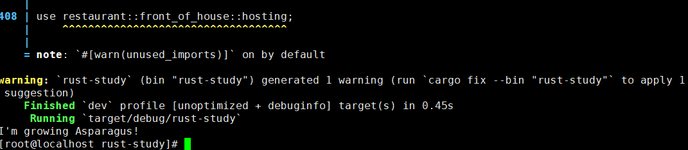

# Rust构建


## 一、rust处理

### 1、Rust 程序设计语言（2021 edition）简体中文版

```bash
# rust中文版：https://github.com/KaiserY/trpl-zh-cn?tab=readme-ov-file

# 全局安装 mdbook
cargo install mdbook

# 下载
git clone git@github.com:KaiserY/trpl-zh-cn.git

#cd 到项目目录，然后开始构建。构建好的静态文档会出现在 "./book/html" 中
mdbook build

#之后随意点击"./book/html" 中的html页面即可开始阅读
```


## 二、rust项目构建

```bash
cargo new rust-study
cd rust-study


cargo check 
cargo build 
cargo run # 也可以一步直接run
```

### 2.1 关键字

```less
registry 注册表
crate 箱
trait 特征
```


### 2.2 crate的版本问题

#### [*Cargo.lock* 文件确保构建是可重现的](#cargolock-文件确保构建是可重现的)

Cargo 有一个机制，确保无论是你还是其他人在任何时候重新构建代码，都会生成相同的构建产物：Cargo 只会使用你指定的依赖版本，除非你明确指定其他版本。例如，如果下周 `rand` crate 的 `0.8.6` 版本出来了，该版本包含了一个重要的 bug 修复，但同时也引入了一个会破坏你代码的回归问题。为了解决这个问题，Rust 在你第一次运行 `cargo build` 时创建了 *Cargo.lock* 文件，我们现在可以在 *guessing_game* 目录找到它。

当第一次构建项目时，Cargo 计算出所有符合要求的依赖版本并写入 *Cargo.lock* 文件。当将来构建项目时，Cargo 会发现 *Cargo.lock* 已存在并使用其中指定的版本，而不是再次计算所有的版本。这使得你拥有了一个自动化的可重现的构建。换句话说，项目会持续使用 `0.8.5` 直到你显式升级，多亏有了 *Cargo.lock* 文件。由于 *Cargo.lock* 文件对于“可重复构建”非常重要，因此它通常会和项目中的其余代码一样纳入到版本控制系统中

#### [更新 crate 到一个新版本](#更新-crate-到一个新版本)

当你 **确实** 需要升级 crate 时，Cargo 提供了这样一个命令，`update`，它会忽略 *Cargo.lock* 文件，并计算出所有符合 *Cargo.toml* 声明的最新版本。Cargo 接下来会把这些版本写入 *Cargo.lock* 文件。不过，Cargo 默认只会寻找大于 `0.8.5` 而小于 `0.9.0` 的版本。如果 `rand` crate 发布了两个新版本，`0.8.6` 和 `0.9.0`，在运行 `cargo update` 时会出现如下内容：

```console
$ cargo update
    Updating crates.io index
    Updating rand v0.8.5 -> v0.8.6
```

Cargo 忽略了 `0.9.0` 版本。这时，你也会注意到的 *Cargo.lock* 文件中的变化无外乎现在使用的 `rand` crate 版本是`0.8.6` 。如果想要使用 `0.9.0` 版本的 `rand` 或是任何 `0.9.x` 系列的版本，必须像这样更新 *Cargo.toml* 文件：

```toml
[dependencies]
rand = "0.9.0"
```

下一次运行 `cargo build` 时，Cargo 会更新可用 crate 的 registry，并根据你指定的新版本重新评估 `rand` 的要求。


### 2.3 crate的组件说明

注意：你不可能凭空就知道应该 use 哪个 trait 以及该从 crate 中调用哪个方法，因此每个 crate 有使用说明文档。Cargo 有一个很棒的功能是：运行 `cargo doc --open` 命令来构建所有本地依赖提供的文档，并在浏览器中打开。例如，假设你对 `rand` crate 中的其他功能感兴趣，你可以运行 `cargo doc --open` 并点击左侧导航栏中的 `rand`。

```bash
cargo doc --open
```

在windows的cmd中执行，然后cargo会自动打开页面提供详细查看：


或者vscode的终端下执行：


页面如下：


### 2.4 隐藏（Shadowing）与 mut


### 2.5 数字类型

Rust 的默认类型通常是个不错的起点，数字类型默认是 `i32`


Rust 也有两个原生的 **浮点数**（*floating-point numbers*）类型，它们是带小数点的数字。Rust 的浮点数类型是 `f32` 和 `f64`，分别占 32 位和 64 位。默认类型是 `f64`

```rust
fn main() {
    let x = 2.0; // f64

    let y: f32 = 3.0; // f32
}
```


### 2.6 [字符类型](#字符类型)

Rust 的 `char` 类型是语言中最原生的字母类型。Rust 的 `char` 类型的大小为**四个字节** (four bytes)， 下面是一些声明 `char` 值的例子：

文件名：src/main.rs

```rust
fn main() {
    let c = 'z';
    let z: char = 'ℤ'; // 显示类型标注
    let heart_eyed_cat = '😻';
}
```

​	注意：

```less
我们用单引号声明 `char` 字面量，而与之相反的是，使用双引号声明字符串字面量。
Rust 的 `char` 类型的大小为四个字节 (four bytes)，并代表了一个 Unicode 标量值（Unicode Scalar Value），这意味着它可以比 ASCII 表示更多内容。
在 Rust 中，带变音符号的字母（Accented letters），中文、日文、韩文等字符，emoji（绘文字）以及零长度的空白字符都是有效的 `char` 值。Unicode 标量值包含从 `U+0000` 到 `U+D7FF` 和 `U+E000` 到 `U+10FFFF` 在内的值。不过，“字符” 并不是一个 Unicode 中的概念，所以人直觉上的 “字符” 可能与 Rust 中的 `char` 并不符合。第八章的 [“使用字符串储存 UTF-8 编码的文本”](ch08-02-strings.html#使用字符串储存-utf-8-编码的文本) 中将详细讨论这个主题。
```


### 2.7 复合类型:元组/数组

**复合类型**（*Compound types*）可以将多个值组合成一个类型。Rust 有两个原生的复合类型：

​		元组（tuple）和数组（array）


注意：不能直接使用 `println!("{arg3[0]}");呢`？

在 `println!` 中，格式化占位符 `{}` 只能接受标识符（即变量名）或通过命名参数传递的变量，而不能包含像 `arg3[0]` 这样直接的表达式操作。Rust 的宏系统在处理 `println!` 时，会将格式字符串解析为特定的模式，而不解析复杂的表达式

Rust 允许你使用“命名参数”来避免显式索引的问题，但你需要提前解构或指定表达式的值。例如：

```rust
fn main() {
    let arg3 = vec![10, 20, 30];
    	
    // 报错！！！
    println!("{arg3[0]}");
    // 使用命名参数方式
    println!("{first_element}", first_element = arg3[0]);
}
```


### 2.8 函数func

文件名：src/main.rs

```rust
fn main() {
    println!("Hello, world!");

    another_function();
}

fn another_function() {
    println!("Another function.");
}
```

我们在 Rust 中通过输入 `fn` 后面跟着函数名和一对圆括号来定义函数。大括号告诉编译器哪里是函数体的开始和结尾。

可以使用函数名后跟圆括号来调用我们定义过的任意函数。因为程序中已定义 `another_function` 函数，所以可以在 `main` 函数中调用它。注意，源码中 `another_function` 定义在 `main` 函数 **之后**；也可以定义在之前。

1、**Rust 不关心函数定义所在的位置，只要函数被调用时出现在调用之处可见的作用域内就行。**

2、**在函数签名中，必须 声明每个参数的类型**。这是 Rust 设计中一个经过慎重考虑的决定：要求在函数定义中提供类型注解，意味着编译器再也不需要你在代码的其他地方注明类型来指出你的意图。而且，在知道函数需要什么类型后，编译器就能够给出更有用的错误消息。


### 2.9 语句与表达式

例如 C 和 Ruby，它们的赋值语句会返回所赋的值。在这些语言中，可以这么写 `x = y = 6`，这样 `x` 和 `y` 的值都是 `6`；Rust 中不能这样写，以下赋值时禁止的，语句不返回值。因此，不能把 `let` 语句赋值给另一个变量：

```rust
fn main() {
    let x = (let y = 6);
}
```

宏调用是一个表达式。用大括号创建的一个新的块作用域也是一个表达式，例如：


## 三、所有权

### 3.1 [所有权规则](#所有权规则)

首先，让我们看一下所有权的规则。当我们通过举例说明时，请谨记这些规则：

> 1. Rust 中的每一个值都有一个 **所有者**（*owner*）。
> 2. 值在任一时刻有且只有一个所有者。
> 3. 当所有者（变量）离开作用域，这个值将被丢弃。

### 3.2 [变量作用域](#变量作用域)

既然我们已经掌握了基本语法，将不会在之后的例子中包含 `fn main() {` 代码，所以如果你是一路跟过来的，必须手动将之后例子的代码放入一个 `main` 函数中。这样，例子将显得更加简明，使我们可以关注实际细节而不是样板代码。

在所有权的第一个例子中，我们看看一些变量的 **作用域**（*scope*）。作用域是一个项（item）在程序中有效的范围。假设有这样一个变量：

```rust
let s = "hello";
```

变量 `s` 绑定到了一个字符串字面值，这个字符串值是硬编码进程序代码中的。这个变量从声明的点开始直到当前 **作用域** 结束时都是有效的。示例 4-1 中的注释标明了变量 `s` 在何处是有效的。

```rust
    {                      // s 在这里无效，它尚未声明
        let s = "hello";   // 从此处起，s 是有效的

        // 使用 s
    }                      // 此作用域已结束，s 不再有效
```

示例 4-1：一个变量和其有效的作用域

换句话说，这里有两个重要的时间点：

- 当 `s` **进入作用域** 时，它就是有效的。
- 这一直持续到它 **离开作用域** 为止。

目前为止，变量是否有效与作用域的关系跟其他编程语言是类似的。现在我们在此基础上介绍 `String` 类型。


### 3.3 String类型

```rust
// 1.字符串字面值
let str = "helll0";

// 2.可以使用 from 函数基于字符串字面值来创建 String
let s = String::from("hello");
// 这两个冒号 :: 是运算符，允许将特定的 from 函数置于 String 类型的命名空间（namespace）下，而不需要使用类似 string_from 这样的名字。
```

Rust 采取了一个不同的策略：内存在拥有它的变量离开作用域后就被自动释放。下面是示例 4-1 中作用域例子的一个使用 `String` 而不是字符串字面值的版本：

```rust
    {
        let s = String::from("hello"); // 从此处起，s 是有效的

        // 使用 s
    }                                  // 此作用域已结束，
                                       // s 不再有效
```

这是一个将 `String` 需要的内存返回给分配器的很自然的位置：当 `s` 离开作用域的时候。当变量离开作用域，Rust 为我们调用一个特殊的函数。这个函数叫做 [`drop`](https://doc.rust-lang.org/std/ops/trait.Drop.html#tymethod.drop)，在这里 `String` 的作者可以放置释放内存的代码。Rust 在结尾的 `}` 处自动调用 `drop`。

> 注意：在 C++ 中，这种 item 在生命周期结束时释放资源的模式有时被称作 **资源获取即初始化**（*Resource Acquisition Is Initialization (RAII)*）。如果你使用过 RAII 模式的话应该对 Rust 的 `drop` 函数并不陌生。

#### [变量与数据交互的方式（一）：移动](#变量与数据交互的方式一移动)

如果你在其他语言中听说过术语 **浅拷贝**（*shallow copy*）和 **深拷贝**（*deep copy*），那么拷贝指针、长度和容量而不拷贝数据可能听起来像浅拷贝。不过因为 Rust 同时使第一个变量无效了，这个操作被称为 **移动**（*move*），而不是叫做浅拷贝。上面的例子可以解读为 `s1` 被 **移动** 到了 `s2` 中。那么具体发生了什么，如图 4-4 所示。


图 4-4：`s1` 无效之后的内存表现

这样就解决了我们的问题！因为只有 `s2` 是有效的，当其离开作用域，它就释放自己的内存，完毕。

另外，这里还隐含了一个设计选择：Rust 永远也不会自动创建数据的 “深拷贝”。因此，任何 **自动** 的复制都可以被认为是对运行时性能影响较小的。

测试：

```rust
//  以下代码是错误的
	let s1 = String::from("hello");
    let s2 = s1;

    println!("{s1}, world!");
```


#### [变量与数据交互的方式（二）：克隆](#变量与数据交互的方式二克隆)

如果我们 **确实** 需要深度复制 `String` 中堆上的数据，而不仅仅是栈上的数据，可以使用一个叫做 `clone` 的通用函数。第五章会讨论方法语法，不过因为方法在很多语言中是一个常见功能，所以之前你可能已经见过了。

这是一个实际使用 `clone` 方法的例子：

```rust
    let s1 = String::from("hello");
    let s2 = s1.clone();

    println!("s1 = {s1}, s2 = {s2}");
```

这段代码能正常运行，并且明确产生图 4-3 中行为，这里堆上的数据 **确实** 被复制了。

当出现 `clone` 调用时，你知道一些特定的代码被执行而且这些代码可能相当消耗资源。你很容易察觉到一些不寻常的事情正在发生。

#### [只在栈上的数据：拷贝](#只在栈上的数据拷贝)

这里还有一个没有提到的小窍门。这些代码使用了整型并且是有效的，它们是示例 4-2 中的一部分：

```rust
    let x = 5;
    let y = x;

    println!("x = {x}, y = {y}");
```

但这段代码似乎与我们刚刚学到的内容相矛盾：没有调用 `clone`，不过 `x` 依然有效且没有被移动到 `y` 中。

原因是像整型这样的在编译时已知大小的类型被整个存储在栈上，所以拷贝其实际的值是快速的。这意味着没有理由在创建变量 `y` 后使 `x` 无效。换句话说，这里没有深浅拷贝的区别，所以这里调用 `clone` 并不会与通常的浅拷贝有什么不同，我们可以不用管它。

Rust 有一个叫做 `Copy` trait 的特殊注解，可以用在类似整型这样的存储在栈上的类型上（[第十章](ch10-00-generics.html)将会详细讲解 trait）。如果一个类型实现了 `Copy` trait，那么一个旧的变量在将其赋值给其他变量后仍然可用。

Rust 不允许自身或其任何部分实现了 `Drop` trait 的类型使用 `Copy` trait。如果我们对其值离开作用域时需要特殊处理的类型使用 `Copy` 注解，将会出现一个编译时错误。要学习如何为你的类型添加 `Copy` 注解以实现该 trait，请阅读附录 C 中的 [“可派生的 trait”](appendix-03-derivable-traits.html)。

那么哪些类型实现了 `Copy` trait 呢？你可以查看给定类型的文档来确认，不过作为一个通用的规则，任何一组简单标量值的组合都可以实现 `Copy`，任何不需要分配内存或某种形式资源的类型都可以实现 `Copy` 。如下是一些 `Copy` 的类型：

- 所有整数类型，比如 `u32`。
- 布尔类型，`bool`，它的值是 `true` 和 `false`。
- 所有浮点数类型，比如 `f64`。
- 字符类型，`char`。
- 元组，当且仅当其包含的类型也都实现 `Copy` 的时候。比如，`(i32, i32)` 实现了 `Copy`，但 `(i32, String)` 就没有。


#### [所有权与函数](#所有权与函数)

将值传递给函数与给变量赋值的原理相似。向函数传递值**可能会移动或者复制**（依据类型判断），就像赋值语句一样。示例 4-3 使用注释展示变量何时进入和离开作用域：

文件名：src/main.rs

```rust
fn main() {
    let s = String::from("hello");  // s 进入作用域

    takes_ownership(s);             // s 的值移动到函数里 ...
                                    // ... 所以到这里不再有效

    let x = 5;                      // x 进入作用域

    makes_copy(x);                  // x 应该移动函数里，
                                    // 但 i32 是 Copy 的，
                                    // 所以在后面可继续使用 x

} // 这里，x 先移出了作用域，然后是 s。但因为 s 的值已被移走，
  // 没有特殊之处

fn takes_ownership(some_string: String) { // some_string 进入作用域
    println!("{some_string}");
} // 这里，some_string 移出作用域并调用 `drop` 方法。
  // 占用的内存被释放

fn makes_copy(some_integer: i32) { // some_integer 进入作用域
    println!("{some_integer}");
} // 这里，some_integer 移出作用域。没有特殊之处
```

示例 4-3：带有所有权和作用域注释的函数

当尝试在调用 `takes_ownership` 后使用 `s` 时，Rust 会抛出一个编译时错误。这些静态检查使我们免于犯错。试试在 `main` 函数中添加使用 `s` 和 `x` 的代码来看看哪里能使用它们，以及所有权规则会在哪里阻止我们这么做。

#### [返回值与作用域](#返回值与作用域)

返回值也可以转移所有权。示例 4-4 展示了一个返回了某些值的示例，与示例 4-3 一样带有类似的注释。

文件名：src/main.rs

```rust
fn main() {
    let s1 = gives_ownership();         // gives_ownership 将返回值
                                        // 转移给 s1

    let s2 = String::from("hello");     // s2 进入作用域

    let s3 = takes_and_gives_back(s2);  // s2 被移动到
                                        // takes_and_gives_back 中，
                                        // 它也将返回值移给 s3
} // 这里，s3 移出作用域并被丢弃。s2 也移出作用域，但已被移走，
  // 所以什么也不会发生。s1 离开作用域并被丢弃

fn gives_ownership() -> String {             // gives_ownership 会将
                                             // 返回值移动给
                                             // 调用它的函数

    let some_string = String::from("yours"); // some_string 进入作用域。

    some_string                              // 返回 some_string 
                                             // 并移出给调用的函数
                                             // 
}

// takes_and_gives_back 将传入字符串并返回该值
fn takes_and_gives_back(a_string: String) -> String { // a_string 进入作用域
                                                      // 

    a_string  // 返回 a_string 并移出给调用的函数
}
```

示例 4-4: 转移返回值的所有权

变量的所有权总是遵循相同的模式：<span style="color: orange;">将值赋给另一个变量时移动它。当持有堆中数据值的变量离开作用域时，其值将通过 `drop` 被清理掉，除非数据被移动为另一个变量所有。</span>  

虽然这样是可以的，但是在每一个函数中都获取所有权并接着返回所有权有些啰嗦。如果我们想要函数使用一个值但不获取所有权该怎么办呢？如果我们还要接着使用它的话，每次都传进去再返回来就有点烦人了，除此之外，我们也可能想返回函数体中产生的一些数据。

我们可以使用元组来返回多个值，如示例 4-5 所示。

文件名：src/main.rs

```rust
fn main() {
    let s1 = String::from("hello");

    let (s2, len) = calculate_length(s1);

    println!("The length of '{s2}' is {len}.");
}

fn calculate_length(s: String) -> (String, usize) {
    let length = s.len(); // len() 返回字符串的长度，否组用户不知道字符串长度是多少，不利于做相关限制

    (s, length)
}
```

示例 4-5: 返回参数的所有权

但是这未免有些形式主义，而且这种场景应该很常见。幸运的是，Rust 对此提供了一个不用获取所有权就可以使用值的功能，叫做 **引用**（*references*）。


#### [引用与借用](#引用与借用)

>**引用**是表示某个值的方式（通过 `&` 和 `&mut` 语法）。
>
>**借用**是使用引用来访问值的过程，分为不可变借用和可变借用。

**引用**（*reference*）像一个指针，因为它是一个地址，我们可以由此访问储存于该地址的属于其他变量的数据。 与指针不同，引用确保指向某个特定类型的有效值。

> 注意：与使用 `&` 引用相反的操作是 **解引用**（*dereferencing*），它使用解引用运算符，`*`。我们将会在第八章遇到一些解引用运算符，并在第十五章详细讨论解引用。

仔细看看这个函数调用：

```rust
    let s1 = String::from("hello");

    let len = calculate_length(&s1);
```

`&s1` 语法让我们创建一个 **指向** 值 `s1` 的引用，但是并不拥有它。因为并不拥有这个值，所以当引用停止使用时，它所指向的值也不会被丢弃。

同理，函数签名使用 `&` 来表明参数 `s` 的类型是一个引用。让我们增加一些解释性的注释：

```rust
fn calculate_length(s: &String) -> usize { // s 是 String 的引用
    s.len()
} // 这里，s 离开了作用域。但因为它并不拥有引用值的所有权，
  // 所以什么也不会发生
```

变量 `s` 有效的作用域与函数参数的作用域一样，不过当 `s` 停止使用时并不丢弃引用指向的数据，因为 `s` 并没有所有权。当函数使用引用而不是实际值作为参数，无需返回值来交还所有权，因为就不曾拥有所有权。

我们将创建一个引用的行为称为 **借用**（*borrowing*）。正如现实生活中，如果一个人拥有某样东西，你可以从他那里借来。当你使用完毕，必须还回去。我们并不拥有它。

如果我们尝试修改借用的变量呢？尝试示例 4-6 中的代码。剧透：这行不通！

文件名：src/main.rs

```rust
fn main() {
    let s = String::from("hello");

    change(&s);
}

fn change(some_string: &String) {
    some_string.push_str(", world");
}
```

示例 4-6：尝试修改借用的值

这里是错误：

正如变量默认是不可变的，引用也一样。（默认)不允许修改引用的值。

下面稍微修改一下：

```rust
    let mut s = String::from("hello");

    change(&s);
}

fn change(some_string: &mut String) {
    some_string.push_str(", world");
}
```

还是报错：


>这是因为在 Rust 中，变量的可变性和引用的类型是分开的。`let mut s` 使得变量 `s` 本身是可变的，但当你使用 `&s` 时，你得到的是一个不可变引用，类型为 `&String`。要传递一个可变引用，你需要显式使用 `&mut s`。这样，Rust 知道你想要传递的是 `s` 的可变引用，允许在函数内部修改它。

所以如果想正确运行，我们还需要显式的将 &s，改为 &mut s 才可以进行传输修改；


#### [可变引用](#可变引用)

我们通过一个小调整就能修复示例 4-6 代码中的错误，允许我们修改一个借用的值，这就是 **可变引用**（*mutable reference*）：

文件名：src/main.rs

```rust
fn main() {
    let mut s = String::from("hello");

    change(&mut s);
}

fn change(some_string: &mut String) {
    some_string.push_str(", world");
}
```

首先，我们必须将 `s` 改为 `mut`。然后在调用 `change` 函数的地方创建一个可变引用 `&mut s`，并更新函数签名以接受一个可变引用 `some_string: &mut String`。这就非常清楚地表明，`change` 函数将改变它所借用的值。

可变引用有一个很大的限制：如果你有一个对该变量的可变引用，你就不能再创建对该变量的引用。这些尝试创建两个 `s` 的可变引用的代码会失败：

文件名：src/main.rs

```rust
    let mut s = String::from("hello");

    let r1 = &mut s;
    let r2 = &mut s;

    println!("{}, {}", r1, r2);
```

错误如下：

这个报错说这段代码是无效的，因为我们不能在同一时间多次将 `s` 作为可变变量借用。第一个可变的借入在 `r1` 中，并且必须持续到在 `println!` 中使用它，但是在那个可变引用的创建和它的使用之间，我们又尝试在 `r2` 中创建另一个可变引用，该引用借用与 `r1` 相同的数据。

这一限制以一种非常小心谨慎的方式允许可变性，防止同一时间对同一数据存在多个可变引用。新 Rustacean 们经常难以适应这一点，因为大部分语言中变量任何时候都是可变的。这个限制的好处是 Rust 可以在编译时就避免数据竞争。**数据竞争**（*data race*）类似于竞态条件，它可由这三个行为造成：

- 两个或更多指针同时访问同一数据。
- 至少有一个指针被用来写入数据。
- 没有同步数据访问的机制。

数据竞争会导致未定义行为，难以在运行时追踪，并且难以诊断和修复；Rust 避免了这种情况的发生，因为它甚至不会编译存在数据竞争的代码！

一如既往，可以使用大括号来创建一个新的作用域，以允许拥有多个可变引用，只是不能 **同时** 拥有：

```rust
    let mut s = String::from("hello");

    {
        let r1 = &mut s;
    } // r1 在这里离开了作用域，所以我们完全可以创建一个新的引用

    let r2 = &mut s;
```

Rust 在同时使用可变与不可变引用时也采用的类似的规则。这些代码会导致一个错误：

```rust
    let mut s = String::from("hello");

    let r1 = &s; // 没问题
    let r2 = &s; // 没问题
    let r3 = &mut s; // 大问题

    println!("{}, {}, and {}", r1, r2, r3);
```

> 总结：
>
> 1、禁止同一时间存在多个可变引用；
>
> 2、禁止同时使用可变与不可变引用；
>
> 3、允许存在多个不可变引用；

注意一个引用的作用域从声明的地方开始一直持续到最后一次使用为止。例如，因为最后一次使用不可变引用（`println!`)，发生在声明可变引用之前，所以如下代码是可以编译的：

```rust
    let mut s = String::from("hello");

    let r1 = &s; // 没问题
    let r2 = &s; // 没问题
    println!("{r1} and {r2}");
    // 此位置之后 r1 和 r2 不再使用

    let r3 = &mut s; // 没问题
    println!("{r3}");
```

不可变引用 `r1` 和 `r2` 的作用域在 `println!` 最后一次使用之后结束，这也是创建可变引用 `r3` 的地方。它们的作用域没有重叠，所以代码是可以编译的。编译器可以在作用域结束之前判断不再使用的引用。

**进一步加深对比：**


找出上述代码的各段的错误；

**悬垂指针**

让我们仔细看看我们的 `dangle` 代码的每一步到底发生了什么：

文件名：src/main.rs

```rust
fn dangle() -> &String { // dangle 返回一个字符串的引用

    let s = String::from("hello"); // s 是一个新字符串

    &s // 返回字符串 s 的引用
} // 这里 s 离开作用域并被丢弃。其内存被释放。
  // 危险！
```

因为 `s` 是在 `dangle` 函数内创建的，当 `dangle` 的代码执行完毕后，`s` 将被释放。不过我们尝试返回它的引用。这意味着这个引用会指向一个无效的 `String`，这可不对！Rust 不会允许我们这么做。

这里的解决方法是直接返回 `String`：

```rust
fn no_dangle() -> String {
    let s = String::from("hello");

    s
}
```

这样就没有任何错误了。所有权被移动出去，所以没有值被释放。

> 引用必须总是有效的，不能造成悬垂指针；


#### slice 类型

*slice* 允许你引用集合中一段连续的元素序列，而不用引用整个集合。slice 是一种引用，所以它没有所有权。

**字符串 slice**（*string slice*）是 `String` 中一部分值的引用，它看起来像这样：

```rust
    let s = String::from("hello world");

    let hello = &s[0..5];
    let world = &s[6..11];
```

不同于整个 `String` 的引用，`hello` 是一个部分 `String` 的引用，由一个额外的 `[0..5]` 部分指定。可以使用一个由中括号中的 `[starting_index..ending_index]` 指定的 range 创建一个 slice，其中 `starting_index` 是 slice 的第一个位置，<span style="color: red;">`ending_index` 则是 slice 最后一个位置的后一个值。</span>在其内部，slice 的数据结构存储了 slice 的开始位置和长度，长度对应于 `ending_index` 减去 `starting_index` 的值。所以对于 `let world = &s[6..11];` 的情况，`world` 将是一个包含指向 `s` 索引 6 的指针和长度值 5 的 slice。


> 举例：let slice = &a[1..3];
>
> 切片的起始索引是 1，结束索引是 3（结束索引不包含在内）


##### [字符串字面值就是 slice](#字符串字面值就是-slice)

还记得我们讲到过字符串字面值被储存在二进制文件中吗？现在知道 slice 了，我们就可以正确地理解字符串字面值了：

```rust
let s = "Hello, world!";
```

这里 `s` 的类型是 `&str`：它是一个指向二进制程序特定位置的 slice。**这也就是为什么字符串字面值是不可变的**；`&str` 是一个不可变引用。

##### [字符串 slice 作为参数](#字符串-slice-作为参数)

在知道了能够获取字面值和 `String` 的 slice 后，我们对 `first_word` 做了改进，这是它的签名：

```rust
fn first_word(s: &String) -> &str {
```

而更有经验的 Rustacean 会编写出示例 4-9 中的签名，因为它使得可以对 `&String` 值和 `&str` 值使用相同的函数：

```rust
fn first_word(s: &str) -> &str {
```

示例 4-9: 通过将 `s` 参数的类型改为字符串 slice 来改进 `first_word` 函数

如果有一个字符串 slice，可以直接传递它。如果有一个 `String`，则可以传递整个 `String` 的 slice 或对 `String` 的引用。这种灵活性利用了 *deref coercions* 的优势，这个特性我们将在[“函数和方法的隐式 Deref 强制转换”](ch15-02-deref.html#函数和方法的隐式-deref-强制转换)章节中介绍。定义一个获取字符串 slice 而不是 `String` 引用的函数使得我们的 API 更加通用并且不会丢失任何功能。

[其他类型的 slice](#其他类型的-slice)

字符串 slice，正如你想象的那样，是针对字符串的。不过也有更通用的 slice 类型。考虑一下这个数组：

```rust
let a = [1, 2, 3, 4, 5];
```

就跟我们想要获取字符串的一部分那样，我们也会想要引用数组的一部分。我们可以这样做：

```rust
let a = [1, 2, 3, 4, 5];

let slice = &a[1..3];

assert_eq!(slice, &[2, 3]);
```

这个 slice 的类型是 `&[i32]`。它跟字符串 slice 的工作方式一样，通过存储第一个集合元素的引用和一个集合总长度。你可以对其他所有集合使用这类 slice。第八章讲到 vector 时会详细讨论这些集合。

[总结](#总结)

所有权、借用和 slice 这些概念让 Rust 程序在编译时确保内存安全。Rust 语言提供了跟其他系统编程语言相同的方式来控制你使用的内存，但拥有数据所有者在离开作用域后自动清除其数据的功能意味着你无须额外编写和调试相关的控制代码。

所有权系统影响了 Rust 中很多其他部分的工作方式，所以我们还会继续讲到这些概念，这将贯穿本书的余下内容。让我们开始第五章，来看看如何将多份数据组合进一个 `struct` 中。


## 四、结构体

### 1、定义、赋值

```rust
struct User {
    active: bool,
    username: String,
    email: String,
    sign_in_count: u64,
}
```

为了从结构体中获取某个特定的值，可以使用点号。举个例子，想要用户的邮箱地址，可以用 `user1.email`。如果结构体的实例是可变的，我们可以使用点号并为对应的字段赋值。示例 5-3 展示了如何改变一个可变的 `User` 实例中 `email` 字段的值：

文件名：src/main.rs

```rust
fn main() {
    let mut user1 = User {
        active: true,
        username: String::from("someusername123"),
        email: String::from("someone@example.com"),
        sign_in_count: 1,
    };

    user1.email = String::from("anotheremail@example.com");
}
```

示例 5-3：改变 `User` 实例 `email` 字段的值

> 注意整个实例必须是可变的；**Rust 并不允许只将某个字段标记为可变**。另外需要注意同其他任何表达式一样，我们可以在函数体的最后一个表达式中构造一个结构体的新实例，来隐式地返回这个实例。

思考：找出下面代码的错误之处：


对于上面的 <'a'>, 一旦 `name_f 或 `color_f` 的引用无效，`返回值result` 也会被视为无效。由于在 Rust 中引用的生命周期是相互关联的，`result` 的有效性依赖于 `name_f ` 和 `color_f` 的有效性。查看下面的示例:

```rust

    let result;

    {
        let string1 = String::from("hello");
        let string2 = String::from("world");
        result = longest(&string1, &string2);  // string1 和 string2 的生命周期在这里结束
    }  // string1 和 string2 的生命周期结束

    // 这里 result 的引用已无效，尝试使用会导致编译错误
    println!("The longest string is: {}", result);  // 错误：引用无效
```

**这样就保证了引用在传递过程中的”安全有效“**


使用结构体更新语法，我们可以通过更少的代码来达到相同的效果，如示例。`..` 语法指定了剩余未显式设置值的字段应有与给定实例对应字段相同的值

```rust
    let car_bmw3 = Car {
        name: "KDLK_L".to_string(),
        number: 22010,
        ..car_bmw2
    };
    println!("car_bmw3: {:?}, {:?}, {:?}", car_bmw3.name, car_bmw3.color, car_bmw3.number);
```

` ..car_bmw2` 必须放在最后，以指定其余的字段应从 `user1` 的相应字段中获取其值，但我们可以选择以任何顺序为任意字段指定值，而不用考虑结构体定义中字段的顺序。


### 2、赋值注意事项

书中示例：

```rust
struct User {
    active: bool,
    username: String,
    email: String,
    sign_in_count: u64,
}

	let user2 = User {
        email: String::from("another@example.com"),
        ..user1
    };
```

> 请注意，
>
> ​	1、结构更新语法就像带有 `=` 的赋值，因为它移动了数据，就像我们在[“变量与数据交互的方式（一）：移动”](ch04-01-what-is-ownership.html#变量与数据交互的方式一移动)部分讲到的一样。在这个例子中，总体上说我们在创建 `user2` 后不能就再使用 `user1` 了，因为 `user1` 的 `username` 字段中的 `String` 被移到 `user2` 中。
>
> ​	2、如果我们给 `user2` 的 `email` 和 `username` 都赋予新的 `String` 值，从而只使用 `user1` 的 `active` 和 `sign_in_count` 值，那么 `user1` 在创建 `user2` 后仍然有效。`active` 和 `sign_in_count` 的类型是实现 `Copy` trait 的类型，所以我们在[“变量与数据交互的方式（二）：克隆”](ch04-01-what-is-ownership.html#变量与数据交互的方式二克隆) 部分讨论的行为同样适用。

所以，只要再赋值 = 过程中，有一个”不可被 Copy trait“的值，那么原来的struct都将不可被使用；


错误如下：


修改后，下面代码即可：


### 3、元组结构体

[使用没有命名字段的元组结构体来创建不同的类型](#使用没有命名字段的元组结构体来创建不同的类型)

也可以定义与元组（在第三章讨论过）类似的结构体，称为 **元组结构体**（*tuple structs*）。元组结构体有着结构体名称提供的含义，但没有具体的字段名，只有字段的类型。当你想给整个元组取一个名字，并使元组成为与其他元组不同的类型时，元组结构体是很有用的，这时像常规结构体那样为每个字段命名就显得多余和形式化了。

要定义元组结构体，以 `struct` 关键字和结构体名开头并后跟元组中的类型。例如，下面是两个分别叫做 `Color` 和 `Point` 元组结构体的定义和用法：

文件名：src/main.rs

```rust
struct Color(i32, i32, i32);
struct Point(i32, i32, i32);

fn main() {
    let black = Color(0, 0, 0);
    let origin = Point(0, 0, 0);
}
```

注意 `black` 和 `origin` 值的类型不同，因为它们是不同的元组结构体的实例。你定义的每一个结构体有其自己的类型，即使结构体中的字段可能有着相同的类型。例如，一个获取 `Color` 类型参数的函数不能接受 `Point` 作为参数，即便这两个类型都由三个 `i32` 值组成。在其他方面，元组结构体实例类似于元组，你可以将它们解构为单独的部分，也可以使用 `.` 后跟索引来访问单独的值，等等。

### 4、类单元结构体

我们也可以定义一个没有任何字段的结构体！它们被称为 **类单元结构体**（*unit-like structs*）因为它们类似于 `()`，即[“元组类型”](ch03-02-data-types.html#元组类型)一节中提到的 unit 类型。类单元结构体常常在你想要在某个类型上实现 trait 但不需要在类型中存储数据的时候发挥作用。我们将在第十章介绍 trait。下面是一个声明和实例化一个名为 `AlwaysEqual` 的 unit 结构的例子。

文件名：src/main.rs

```rust
struct AlwaysEqual;

fn main() {
    let subject = AlwaysEqual;
}
```

为了定义 `AlwaysEqual`，我们使用 `struct` 关键字，接着是我们想要的名称，然后是一个分号。不需要花括号或圆括号！然后，我们可以以类似的方式在 `subject` 变量中创建 `AlwaysEqual` 的实例：只需使用我们定义的名称，无需任何花括号或圆括号。设想我们稍后将为这个类型实现某种行为，使得每个 `AlwaysEqual` 的实例始终等于任何其它类型的实例，也许是为了获得一个已知的结果以便进行测试。我们无需要任何数据来实现这种行为！在第十章中，你会看到如何定义特征并在任何类型上实现它们，包括类单元结构体。


### 5、访问结构体的引用

注意，访问对结构体的引用的字段不会移动字段的所有权，这就是为什么你经常看到对结构体的引用

```rust
fn area(rectangle: &Rectangle) -> u32 {
    rectangle.width * rectangle.height
}
```


### 6、结构体debug打印

Rust **确实** 包含了打印出调试信息的功能，不过我们必须为结构体显式选择这个功能。为此，在结构体定义之前加上外部属性 `#[derive(Debug)]`，如示例 5-12 所示：

文件名：src/main.rs

```rust
#[derive(Debug)]
struct Rectangle {
    width: u32,
    height: u32,
}

fn main() {
    let rect1 = Rectangle {
        width: 30,
        height: 50,
    };

    println!("rect1 is {rect1:?}");
}
```

示例 5-12：增加属性来派生 `Debug` trait，并使用调试格式打印 `Rectangle` 实例

现在我们再运行这个程序时，就不会有任何错误，并会出现如下输出：


### 7、dbg! 打印

另一种使用 `Debug` 格式打印数值的方法是使用 [`dbg!` 宏](https://doc.rust-lang.org/std/macro.dbg.html)。`dbg!` 宏接收一个表达式的所有权（与 `println!` 宏相反，后者接收的是引用），打印出代码中调用 dbg! 宏时所在的文件和行号，以及该表达式的结果值，并返回该值的所有权。

> 注意：调用 `dbg!` 宏会打印到标准错误控制台流（`stderr`），与 `println!` 不同，后者会打印到标准输出控制台流（`stdout`）。我们将在[第十二章 “将错误信息写入标准错误而不是标准输出” 一节](ch12-06-writing-to-stderr-instead-of-stdout.html)中更多地讨论 `stderr` 和 `stdout`。

下面是一个例子，我们对分配给 `width` 字段的值以及 `rect1` 中整个结构的值感兴趣。

```rust
#[derive(Debug)]
struct Rectangle {
    width: u32,
    height: u32,
}

fn main() {
    let scale = 2;
    let rect1 = Rectangle {
        width: dbg!(30 * scale),  // `dbg!` 返回表达式的值的所有权，所以这里可以直接使用而不用担心出现所有权问题
        height: 50,
    };

    dbg!(&rect1);
}
```

我们可以把 `dbg!` 放在表达式 `30 * scale` 周围，因为 `dbg!` 返回表达式的值的所有权，所以 `width` 字段将获得相同的值，就像我们在那里没有 `dbg!` 调用一样。我们不希望 `dbg!` 拥有 `rect1` 的所有权，所以我们在下一次调用 `dbg!` 时传递一个引用

注意：

如果我们把 `rect1` 的所有权传输给dbg！，那么我们可以对比一下差距：

```rust
    /* 下面两行代码是不允许的，因为rect1的所有权被传给了dbg!,
    所以之后的dbg!(&rect1);会产生编译错误；
    但如果我们调整他们的前后顺序，则都可以保证输出，因为这样的话
    就是先传输引用，在传输所有权，前者引用的传输不影响后者所有权的传输。 */
    // dbg!(rect1);
    // dbg!(&rect1);

    /* 或者就是像下面这样，依据dbg！的特性：重新返回所有权，把所有权再传输回来*/
    let rect2 = dbg!(rect1);
    dbg!(&rect2);

    /* 如果我们传输进去的是个引用，返回的也将是个引用*/
    let rect3 = dbg!(&rect2);
    dbg!(&rect2);
    dbg!(rect3);
    dbg!(&rect3);// 此处传输的其实就是（&&rect2）
```

在你的代码中，dbg!(&rect3) 输出是可以的，因为 rect3 是 &rect2 的引用，而 dbg! 返回的是原始的引用类型。让我们逐步分析一下：
	1、let rect3 = dbg!(&rect2);：这里你传入了 &rect2，dbg! 会打印 rect2 的引用值，并将 &rect2 这个引用返回给 rect3。因此，	rect3 的类型是 &Rectangle（假设 Rectangle 是一个结构体）。
	2、dbg!(&rect2);：这一行同样会打印 &rect2 的值。
	3、dbg!(rect3);：此时你传入的是 rect3（一个引用），dbg! 会打印 rect3 指向的值（rect2 的值）。
	4、dbg!(&rect3);：这里你又传入了 &rect3，dbg! 会打印 rect3 的值（也是 rect2 的引用）。rect3 是一个引用，所以 &rect3 也是一个引用（&&Rectangle），但是 dbg! 可以接受并打印多层引用。

```less
因此，dbg!(&rect3); 的输出是有效的，因为它可以处理引用的引用，并打印其调试信息。返回的类型保持一致，且 dbg! 不会限制层数，只要它是一个实现了 Debug trait 的类型。
```

测试结果：


`dbg!`的函数原型:

```rust
pub fn dbg<T: std::fmt::Debug>(value: T) -> T
// 无论你传入 dbg! 的是什么类型，返回的就是同样的类型。如果你传入的是引用，返回的就是这个引用；如果传入的是值，返回的就是这个值。dbg! 不会改变你传入表达式的类型。
```


### 8、多重引用与多级指针

| 特性     | Rust 的多重引用 (`&&T`)                  | C 的多级指针 (`**T`)               |
| -------- | ---------------------------------------- | ---------------------------------- |
| **实现** | - 借用检查器确保引用有效                 | - 需要手动管理内存                 |
|          | - 自动解引用简化使用                     | - 手动解引用，访问多级指针         |
|          | - 安全性强，防止悬空引用                 | - 可能导致悬空指针和内存泄漏       |
| **逻辑** | - 强调所有权和借用规则                   | - 提供自由度和灵活性               |
|          | - 一次只能有一个可变引用或多个不可变引用 | - 允许指针算术，灵活访问内存       |
|          | - 编译时检查引用的合法性                 | - 相对简单的类型系统               |
| **理念** | - 内存安全和并发安全                     | - 高性能和低开销                   |
|          | - 减少运行时错误，提高可维护性           | - 灵活性高，开发者需要负责内存管理 |
|          | - 强调开发者友好                         | - 责任归于开发者                   |

为了理解多重引用的特性，我们稍微修改一下上面<7>中的代码顺序：

```rust
    /* 如果我们传输进去的是个引用，返回的也将是个引用*/
    let rect3 = dbg!(&rect2);
    dbg!(rect3);  // 此时我们移交rect的所有权，即一个&rect2的引用rect3；
    dbg!(&rect2);
    dbg!(&rect3); // 此处传输的其实就是（&&rect2），可以发现：虽然我们前面移交了rect3所有权，但是依然可以正常输出

```

上面的示例，依旧可以保持正常输出：

​		在 Rust 中，引用不会转移所有权，它们只是对数据的借用。因此，`rect3` 是对 `rect2` 的引用，`rect2` 的所有权依然在原来的变量中。这样，你可以在后续的代码中继续使用 `rect2` 和 `rect3`，而不会导致错误或无效引用。

​		或许你会发现，这和c语言的多重指针不一样，在c语言中：c语言二级指针，如果删除(释放)了一级指针，那么二级指针也将找不到原来数据的位置。

### 9、rust引用机制的特殊性

在 Rust 中，**引用机制的核心在于所有的引用（无论是一层引用、二层引用，还是更多层的引用）都指向原始数据**，而不是拥有数据的所有权。以下是一些关键点来说明这一机制：

1. **引用的本质**

- 借用而非所有权

    所有引用（`&T`、`&&T`、`&&&T` 等）都是对原始数据的借用，不会改变原始数据的所有权。使用引用意味着你可以访问数据而不需要拥有它。

2. **多级引用的意义**

- 方便引用传输

    多级引用的使用在某些情况下可以让函数或数据结构更灵活。例如，你可以传递对可变引用的引用，允许在不同的上下文中管理对数据的访问。

3. **内存管理**

- 指向同一地址

    无论引用多少级，它们实际上都是指向同一个内存地址。因此，修改数据时，所有级别的引用都能反映出这些变化。

4. **生命周期和类型安全**

- 生命周期管理

    Rust 的借用检查器通过生命周期确保引用在有效范围内使用，帮助避免悬空引用和数据竞争。

5. **性能优化**

- 减少数据复制

    通过引用，尤其是在处理大型结构体时，可以避免不必要的数据复制，提高性能。

**总结**

多级引用在语法上提供了更大的灵活性，允许你在不同的上下文中传递引用，同时保持对原始数据的访问。这使得 Rust 的内存管理更加安全和高效。你可以把多级引用视为一种方便的方式，以便在代码中灵活地传递对数据的引用，而不影响数据的所有权或生命周期。

| 价值意义         | 描述                                                 |
| ---------------- | ---------------------------------------------------- |
| 更灵活的抽象     | 在复杂数据结构中简化数据传递，方便处理嵌套数据结构。 |
| 控制引用的可变性 | 管理可变引用，确保数据的一致性和安全性。             |
| 增强类型安全     | 帮助类型系统清晰地区分不同的引用用途。               |
| 生命周期的管理   | 管理复杂的生命周期需求，确保引用在有效范围内使用。   |
| 特定场景下的优化 | 减少数据复制和传递的开销，特别是在处理大型结构体时。 |

**示例代码**

1. **更灵活的抽象**：

    ```rust
    struct TreeNode {
        value: i32,
        left: Option<Box<TreeNode>>,
        right: Option<Box<TreeNode>>,
    }
    
    let node = TreeNode { value: 10, left: None, right: None };
    let node_ref = &node;
    ```

2. **控制引用的可变性**：

    ```rust
    fn modify<'a>(val: &'a mut i32) {
        *val += 1;
    }
    
    let mut x = 5;
    let x_ref = &mut x;
    modify(x_ref);
    ```

3. **增强类型安全**：

    ```rust
    fn process<'a>(immutable: &'a i32, mutable: &'a mut i32) {
        // 处理数据
    }
    
    let mut y = 10;
    let x = 5;
    process(&x, &mut y);
    ```

4. **生命周期的管理**：

    ```rust
    fn lifetime_example<'a>(s: &'a str) -> &'a str {
        s
    }
    
    let text = String::from("Hello");
    let result = lifetime_example(&text);
    ```

5. **特定场景下的优化**：

    ```rust
    struct LargeData {
        data: [i32; 1000],
    }
    
    fn process_data(data_ref: &&LargeData) {
        // 处理数据
    }
    
    let large_data = LargeData { data: [0; 1000] };
    process_data(&&large_data);
    ```

总结：

- **更灵活的抽象**：在树结构中，节点可以引用子节点，使得操作更简便。
- **控制引用的可变性**：通过可变引用的管理，确保在函数中可以安全地修改数据。
- **增强类型安全**：将可变和不可变引用分开，防止潜在的错误。
- **生命周期的管理**：通过生命周期标注，确保引用的有效性。
- **特定场景下的优化**：避免对大型结构体的复制，通过引用传递数据。


### 10、**方法**（method）

```rust
#[derive(Debug)]
struct Rectangle {
    width: u32,
    height: u32,
}

impl Rectangle {
    fn area(&self) -> u32 {
        self.width * self.height
    }
}

fn main() {
    let rect1 = Rectangle {
        width: 30,
        height: 50,
    };

    println!(
        "The area of the rectangle is {} square pixels.",
        rect1.area()
    );
}
```

​		在 `area` 的签名中，使用 `&self` 来替代 `rectangle: &Rectangle`，`&self` 实际上是 `self: &Self` 的缩写。在一个 `impl` 块中，`Self` 类型是 `impl` 块的类型的别名。方法的第一个参数必须有一个名为 `self` 的`Self` 类型的参数，所以 Rust 让你在第一个参数位置上只用 `self` 这个名字来简化。注意，我们仍然需要在 `self` 前面使用 `&` 来表示这个方法借用了 `Self` 实例，就像我们在 `rectangle: &Rectangle` 中做的那样。方法可以选择获得 `self` 的所有权，或者像我们这里一样不可变地借用 `self`，或者可变地借用 `self`，就跟其他参数一样。

​		这里选择 `&self` 的理由跟在函数版本中使用 `&Rectangle` 是相同的：我们并不想获取所有权，只希望能够读取结构体中的数据，而不是写入。如果想要在方法中改变调用方法的实例，需要将第一个参数改为 `&mut self`。通过仅仅使用 `self` 作为第一个参数来使方法获取实例的所有权是很少见的；这种技术通常用在当方法将 `self` 转换成别的实例的时候，这时我们想要防止调用者在转换之后使用原始的实例。

如果我们不使用·self·来进行标注呢：

```rust
// 注意查看下面两处调用的区别
    println!("{} area:{} area2:{}",rect2.width, rect2.area(), Rectangle::area2(&rect2));

impl Rectangle{
    fn area(&self) -> u32{
        self.width*self.height
    }

    fn area2(rectangle: &Rectangle) -> u32 {
        rectangle.width * rectangle.height
    }
}

#[derive(Debug)]
struct Rectangle {
    width: u32,
    height: u32,
}
```

> 请注意，我们可以选择将方法的名称与结构中的一个字段相同

```rust
impl Rectangle {
    fn width(&self) -> bool {
        self.width > 0
    }
}
```

​		使用方法替代函数，除了可使用方法语法和不需要在每个函数签名中重复 `self` 的类型之外，其主要好处在于组织性。我们将某个类型实例能做的所有事情都一起放入 `impl` 块中，而不是让将来的用户在我们的库中到处寻找 `Rectangle` 的功能。

> 请注意，我们可以选择将方法的名称与结构中的一个字段相同。例如，我们可以在 `Rectangle` 上定义一个方法，并命名为 `width`：

```rust
impl Rectangle {
    fn width(&self) -> bool {
        self.width > 0
    }
}

fn main() {
    let rect1 = Rectangle {
        width: 30,
        height: 50,
    };

    if rect1.width() {
        println!("The rectangle has a nonzero width; it is {}", rect1.width);
    }
}
```

### 11、方法的自动引用/解引用

> 在 C/C++ 语言中，有两个不同的运算符来调用方法：`.` 直接在对象上调用方法，而 `->` 在一个对象的指针上调用方法，这时需要先解引用（dereference）指针。换句话说，如果 `object` 是一个指针，那么 `object->something()` 就像 `(*object).something()` 一样。
>
> Rust 并没有一个与 `->` 等效的运算符；相反，Rust 有一个叫 **自动引用和解引用**（*automatic referencing and dereferencing*）的功能。方法调用是 Rust 中少数几个拥有这种行为的地方。
>
> 它是这样工作的：当使用 `object.something()` 调用方法时，Rust 会自动为 `object` 添加 `&`、`&mut` 或 `*` 以便使 `object` 与方法签名匹配。也就是说，这些代码是等价的：
>
> ```rust
> p1.distance(&p2);
> (&p1).distance(&p2);
> ```
>
> 第一行看起来简洁的多。这种自动引用的行为之所以有效，是因为方法有一个明确的接收者———— `self` 的类型。在给出接收者和方法名的前提下，**Rust 可以明确地计算出方法是仅仅读取（`&self`），做出修改（`&mut self`）或者是获取所有权（`self`）。事实上，Rust 对方法接收者的隐式借用让所有权在实践中更友好。**

### 12、关联函数

所有在 `impl` 块中定义的函数被称为 **关联函数**（*associated functions*），因为它们与 `impl` 后面命名的类型相关。我们可以定义不以 `self` 为第一参数的关联函数（因此不是方法），因为它们并不作用于一个结构体的实例。我们已经使用了一个这样的函数：在 `String` 类型上定义的 `String::from` 函数。

**不是方法的关联函数经常被用作返回一个结构体新实例的构造函数。**这些函数的名称通常为 `new` ，但 `new` 并不是一个关键字。例如我们可以提供一个叫做 `square` 关联函数，它接受一个维度参数并且同时作为宽和高，这样可以更轻松的创建一个正方形 `Rectangle` 而不必指定两次同样的值：

文件名：src/main.rs

```rust

    impl Rectangle {
        fn square(size: u32) -> Self { // 注意这里的返回，用Self指代了Rectangle类型
            Self {
                width: size,
                height: size,
            }
        }
    }

    println!("zfx---{}", Rectangle::square(6).area());
```

关键字 `Self` 在函数的返回类型中代指在 `impl` 关键字后出现的类型，在这里是 `Rectangle`

使用结构体名和 `::` 语法来调用这个关联函数：比如 `let sq = Rectangle::square(3);`。这个函数位于结构体的命名空间中：`::` 语法用于关联函数和模块创建的命名空间。[第七章](ch07-02-defining-modules-to-control-scope-and-privacy.html)会讲到模块。


## 五、枚举和模式匹配

### 1、枚举关联数据

可以使用一种更简洁的方式来表达相同的概念，仅仅使用枚举并将数据直接放进每一个枚举成员而不是将枚举作为结构体的一部分。`IpAddr` 枚举的新定义表明了 `V4` 和 `V6` 成员都关联了 `String` 值：

```rust
    enum IpAddr {
        V4(String),
        V6(String),
    }

    let home = IpAddr::V4(String::from("127.0.0.1"));

    let loopback = IpAddr::V6(String::from("::1"));
```


### 2、复杂枚举关联

让我们看看标准库是如何定义 `IpAddr` 的：它正有着跟我们定义和使用的一样的枚举和成员，不过它将成员中的地址数据嵌入到了两个不同形式的结构体中，它们对不同的成员的定义是不同的：

```rust
struct Ipv4Addr {
    // --snip--
}

struct Ipv6Addr {
    // --snip--
}

enum IpAddr {
    V4(Ipv4Addr),
    V6(Ipv6Addr),
}
```

这些代码展示了可以将任意类型的数据放入枚举成员中：例如字符串、数字类型或者结构体。甚至可以包含另一个枚举！另外，标准库中的类型通常并不比你设想出来的要复杂多少。

来看看示例 6-2 中的另一个枚举的例子：它的成员中内嵌了多种多样的类型：

```rust
enum Message {
    Quit,
    Move { x: i32, y: i32 },
    Write(String),
    ChangeColor(i32, i32, i32),
}
```

示例 6-2：一个 `Message` 枚举，其每个成员都存储了不同数量和类型的值

这个枚举有四个含有不同类型的成员：

- `Quit` 没有关联任何数据。
- `Move` 类似结构体包含命名字段。
- `Write` 包含单独一个 `String`。
- `ChangeColor` 包含三个 `i32`。

### 3、枚举的优势（结构体）

定义一个如示例 6-2 中所示那样的有关联值的枚举的方式和定义多个不同类型的结构体的方式很相像，除了枚举不使用 `struct` 关键字以及其所有成员都被组合在一起位于 `Message` 类型下。如下这些结构体可以包含与之前枚举成员中相同的数据：

```rust
struct QuitMessage; // 类单元结构体
struct MoveMessage {
    x: i32,
    y: i32,
}
struct WriteMessage(String); // 元组结构体
struct ChangeColorMessage(i32, i32, i32); // 元组结构体
```

> **不过，如果我们使用不同的结构体，由于它们都有不同的类型，我们将不能像使用示例 6-2 中定义的 `Message` 枚举那样，轻易的定义一个能够处理这些不同类型的结构体的函数，因为枚举是单独一个类型。**


### 4、结构与枚举的相似点

结构体和枚举还有另一个相似点：就像可以使用 `impl` 来为结构体定义方法那样，也可以在枚举上定义方法。这是一个定义于我们 `Message` 枚举上的叫做 `call` 的方法：

```rust
enum Message {
    Quit,
    Move { x: i32, y: i32 },
    Write(String),
    ChangeColor(i32, i32, i32),
}
// message枚举的定义在上面
	impl Message {
        fn call(&self) {
            // 在这里定义方法体
        }
    }

    let m = Message::Write(String::from("hello"));
    m.call();
```

方法体使用了 `self` 来获取调用方法的值。这个例子中，创建了一个值为 `Message::Write(String::from("hello"))` 的变量 `m`，而且这就是当 `m.call()` 运行时 `call` 方法中的 `self` 的值。


### 5、枚举的空值

`Option` 值的例子：

```rust
    let some_number = Some(5);
    let some_char = Some('e');

    let absent_number: Option<i32> = None;
```

`some_number` 的类型是 `Option<i32>`。`some_char` 的类型是 `Option<char>`，这（与 `some_number`）是一个不同的类型。因为我们在 `Some` 成员中指定了值，Rust 可以推断其类型。对于 `absent_number`，Rust 需要我们指定 `Option` 整体的类型，因为编译器只通过 `None` 值无法推断出 `Some` 成员保存的值的类型。这里我们告诉 Rust 希望 `absent_number` 是 `Option<i32>` 类型的。

当有一个 `Some` 值时，我们就知道存在一个值，而这个值保存在 `Some` 中。当有个 `None` 值时，在某种意义上，它跟空值具有相同的意义：并没有一个有效的值。那么，`Option<T>` 为什么就比空值要好呢？

简而言之，因为 `Option<T>` 和 `T`（这里 `T` 可以是任何类型）是不同的类型，编译器不允许像一个肯定有效的值那样使用 `Option<T>`。例如，这段代码不能编译，因为它尝试将 `Option<i8>` 与 `i8` 相加：

```rust
    let x: i8 = 5;
    let y: Option<i8> = Some(5);

    let sum = x + y;
```

如果运行这些代码，将得到类似这样的错误信息：

```console
$ cargo run
   Compiling enums v0.1.0 (file:///projects/enums)
error[E0277]: cannot add `Option<i8>` to `i8`
 --> src/main.rs:5:17
  |
5 |     let sum = x + y;
  |                 ^ no implementation for `i8 + Option<i8>`
  |
  = help: the trait `Add<Option<i8>>` is not implemented for `i8`
  = help: the following other types implement trait `Add<Rhs>`:
            `&'a i8` implements `Add<i8>`
            `&i8` implements `Add<&i8>`
            `i8` implements `Add<&i8>`
            `i8` implements `Add`

For more information about this error, try `rustc --explain E0277`.
error: could not compile `enums` (bin "enums") due to 1 previous error
```

很好！事实上，错误信息意味着 **Rust 不知道该如何将 `Option<i8>` 与 `i8` 相加，因为它们的类型不同**。当在 Rust 中拥有一个像 `i8` 这样类型的值时，编译器确保它总是有一个有效的值。我们可以自信使用而无需做空值检查。只有当使用 `Option<i8>`（或者任何用到的类型）的时候需要担心可能没有值，而编译器会确保我们在使用值之前处理了为空的情况。

> 换句话说，**在对 `Option<T>` 进行运算之前必须将其转换为 `T`。通常这能帮助我们捕获到空值最常见的问题之一：假设某值不为空但实际上为空的情况。**

​			**消除了错误地假设一个非空值的风险，会让你对代码更加有信心**。为了拥有一个可能为空的值，你必须要显式的将其放入对应类型的 `Option<T>` 中。接着，当使用这个值时，必须明确的处理值为空的情况（进行对应的转换或者判读）。只要一个值不是 `Option<T>` 类型，你就 **可以** 安全的认定它的值不为空。这是 Rust 的一个经过深思熟虑的设计决策，来限制空值的泛滥以增加 Rust 代码的安全性。

那么当有一个 `Option<T>` 的值时，如何从 `Some` 成员中取出 `T` 的值来使用它呢？`Option<T>` 枚举拥有大量用于各种情况的方法：你可以查看[它的文档](https://doc.rust-lang.org/std/option/enum.Option.html)。熟悉 `Option<T>` 的方法将对你的 Rust 之旅非常有用。

总的来说，为了使用 `Option<T>` 值，需要编写处理每个成员的代码。你想要一些代码只当拥有 `Some(T)` 值时运行，允许这些代码使用其中的 `T`。也希望一些代码只在值为 `None` 时运行，这些代码并没有一个可用的 `T` 值。`match` 表达式就是这么一个处理枚举的控制流结构：它会根据枚举的成员运行不同的代码，这些代码可以使用匹配到的值中的数据。

> 在 Rust 中，`maybe_value.unwrap()` 的作用是从 `Option` 类型中提取出值。如果 `maybe_value` 是 `Some(value)`，`unwrap()` 会返回 `value`；如果 `maybe_value` 是 `None`，则 `unwrap()` 会导致程序 panic（崩溃），并显示错误信息。

**使用场景**

- **安全使用**：在你确定 `Option` 中有值时可以使用 `unwrap()`。如果不确定，应该使用更安全的方式，比如 `match`、`if let` 或 `unwrap_or`。
- **调试**：在开发过程中，使用 `unwrap()` 可以快速验证逻辑，但在生产代码中不建议使用，以免造成程序崩溃。

**替代方法**

为了避免潜在的 panic，通常建议使用以下方式之一：

- `match` 或 `if let`：显式处理 `Some` 和 `None`。

```rust
match maybe_value {
    Some(v) => println!("值是: {}", v),
    None => println!("没有值"),
}
```

- `unwrap_or(default)`：如果是 `None`，返回一个默认值。

```rust
let value = maybe_value.unwrap_or(0); // 如果是 None，返回 0
```

- `expect("错误信息")`：类似于 `unwrap()`，但可以自定义 panic 时的错误信息。

```rust
let value = maybe_value.expect("应该有一个值");
```

这些方法可以帮助你更安全地处理 `Option` 类型，避免不必要的崩溃。


### 6、match匹配

`match` 还有另一方面需要讨论：这些分支必须覆盖了所有的可能性。考虑一下 `plus_one` 函数的这个版本，它有一个 bug 并不能编译：

```rust
    fn plus_one(x: Option<i32>) -> Option<i32> {
        match x {
            Some(i) => Some(i + 1),
        }
    }
```

我们没有处理 `None` 的情况，所以这些代码会造成一个 bug。

>Rust 知道我们没有覆盖所有可能的情况甚至知道哪些模式被忘记了！Rust 中的匹配是 **穷尽的**（*exhaustive*）：必须穷举到最后的可能性来使代码有效。特别的在这个 `Option<T>` 的例子中，Rust 防止我们忘记明确的处理 `None` 的情况，这让我们免于假设拥有一个实际上为空的值，从而使之前提到的价值亿万的错误不可能发生。

### 7、[通配模式和 `_` 占位符](#通配模式和-_-占位符)

​		想象我们正在玩一个游戏，如果你掷出骰子的值为 3，角色不会移动，而是会得到一顶新奇的帽子。如果你掷出了 7，你的角色将失去新奇的帽子。对于其他的数值，你的角色会在棋盘上移动相应的格子。这是一个实现了上述逻辑的 `match`，骰子的结果是硬编码而不是一个随机值，其他的逻辑部分使用了没有函数体的函数来表示，实现它们超出了本例的范围：

```rust
    let dice_roll = 9;
    match dice_roll {
        3 => add_fancy_hat(),
        7 => remove_fancy_hat(),
        other => move_player(other), // 因为最后一个模式将匹配所有未被特殊列出的值。这种通配模式满足了 match 必须被穷尽的要求。
    }

    fn add_fancy_hat() {}
    fn remove_fancy_hat() {}
    fn move_player(num_spaces: u8) {}
```

> 请注意，我们**必须将通配分支放在最后，因为模式是按顺序匹配的**。如果我们在通配分支后添加其他分支，Rust 将会警告我们，因为此后的分支永远不会被匹配到。

**`_`（通配符模式）**

- **用途**：作为通配符模式，`_` 可以匹配任何值，且不需要做任何进一步处理。
- **语义**：表示对所有未被其他模式匹配的值的“捕获”，通常用于处理所有其他情况。
- **无名值**：匹配时不关心匹配的具体值，只要它不是之前指定的模式。

**`other`（命名变量）**

- **用途**：`other` 是一个命名变量，可以用于捕获匹配的值，并在后续代码中使用。
- **语义**：表示你可能关心的“其他”情况，并且可以在该分支中使用它的值。
- **值可用**：使用 `other` 时，可以在匹配的代码块中引用这个值。


最后，让我们再次改变游戏规则，如果你掷出 3 或 7 以外的值，你的回合将无事发生。我们可以使用单元值（在[“元组类型”](ch03-02-data-types.html#元组类型)一节中提到的空元组）作为 `_` 分支的代码：

```rust
    let dice_roll = 9;
    match dice_roll {
        3 => add_fancy_hat(),
        7 => remove_fancy_hat(),
        _ => (),
    }

    fn add_fancy_hat() {}
    fn remove_fancy_hat() {}
```

在这里，我们明确告诉 Rust 我们不会使用与前面模式不匹配的值，并且这种情况下我们不想运行任何代码。

### 8、[`if let` 简洁控制流](#if-let-简洁控制流)

```rust
    let config = Some(8);
    match config {
        Some(ss) => println!("match {ss}"),
        _ => (),
    }

```

示例 6-6：`match` 只关心当值为 `Some` 时执行代码

如果值是 `Some`，我们希望打印出 `Some` 成员中的值，这个值被绑定到模式中的 `max` 变量里。对于 `None` 值我们不希望做任何操作。为了满足 `match` 表达式（穷尽性）的要求，必须在处理完这唯一的成员后加上 `_ => ()`，这样也要增加很多烦人的样板代码。

不过我们可以使用 `if let` 这种更短的方式编写。如下代码与示例 6-6 中的 `match` 行为一致：

```rust
    if let Some(ss) = config {
        println!("match 222 {ss}");
    }

```

`if let` 语法获取通过等号分隔的一个模式和一个表达式。它的工作方式与 `match` 相同，这里的表达式对应 `match` 而模式则对应第一个分支。在这个例子中，模式是 `Some(max)`，`max` 绑定为 `Some` 中的值。接着可以在 `if let` 代码块中使用 `max` 了，就跟在对应的 `match` 分支中一样。模式不匹配时 `if let` 块中的代码不会执行。

> 使用 `if let` 意味着编写更少代码，更少的缩进和更少的样板代码。然而，这样会失去 `match` 强制要求的穷尽性检查。`match` 和 `if let` 之间的选择依赖特定的环境以及增加简洁度和失去穷尽性检查的权衡取舍。

换句话说，可以认为 `if let` 是 `match` 的一个语法糖，它当值匹配某一模式时执行代码而忽略所有其他值。

可以在 `if let` 中包含一个 `else`。`else` 块中的代码与 `match` 表达式中的 `_` 分支块中的代码相同，这样的 `match` 表达式就等同于 `if let` 和 `else`。回忆一下示例 6-4 中 `Coin` 枚举的定义，其 `Quarter` 成员也包含一个 `UsState` 值。如果想要计数所有不是 25 美分的硬币的同时也报告 25 美分硬币所属的州，可以使用这样一个 `match` 表达式：

```rust
    let mut count = 0;
    match coin {
        Coin::Quarter(state) => println!("State quarter from {state:?}!"),
        _ => count += 1,
    }
```

或者可以使用这样的 `if let` 和 `else` 表达式：

```rust
    let mut count = 0;
    if let Coin::Quarter(state) = coin {
        println!("State quarter from {state:?}!");
    } else {
        count += 1;
    }
```

如果你的程序遇到一个使用 `match` 表达起来过于啰嗦的逻辑，记住 `if let` 也在你的 Rust 工具箱中。


## 六、包、crate、模块管理

### 1、默认crate

在此，我们有了一个只包含 *src/main.rs* 的包，意味着它只含有一个名为 `my-project` 的二进制 crate。如果一个包同时含有 *src/main.rs* 和 *src/lib.rs*，则它有两个 crate：一个二进制的和一个库的，且名字都与包相同。通过将文件放在 *src/bin* 目录下，一个包可以拥有多个二进制 crate：每个 *src/bin* 下的文件都会被编译成一个独立的二进制 crate。

### [2、模块小抄](#模块小抄)

这里我们提供一个简单的参考，用来解释模块、路径、`use`关键词和`pub`关键词如何在编译器中工作，以及大部分开发者如何组织他们的代码。我们将在本章节中举例说明每条规则，不过这是一个解释模块工作方式的良好参考。

- **从 crate 根节点开始**: 当编译一个 crate, 编译器首先在 crate 根文件（通常，对于一个库 crate 而言是*src/lib.rs*，对于一个二进制 crate 而言是*src/main.rs*）中寻找需要被编译的代码。

- 声明模块

    : 在 crate 根文件中，你可以声明一个新模块；比如，你用

    ```
    mod garden;
    ```

    声明了一个叫做

    ```
    garden
    ```

    的模块。编译器会在下列路径中寻找模块代码：

    - 内联，在大括号中，当`mod garden`后方不是一个分号而是一个大括号
    - 在文件 *src/garden.rs*
    - 在文件 *src/garden/mod.rs*

- 声明子模块

    : 在除了 crate 根节点以外的其他文件中，你可以定义子模块。比如，你可能在

    src/garden.rs

    中定义了

    ```
    mod vegetables;
    ```

    。编译器会在以父模块命名的目录中寻找子模块代码：

    - 内联，在大括号中，当`mod vegetables`后方不是一个分号而是一个大括号
    - 在文件 *src/garden/vegetables.rs*
    - 在文件 *src/garden/vegetables/mod.rs*

- **模块中的代码路径**: 一旦一个模块是你 crate 的一部分，你可以在隐私规则允许的前提下，从同一个 crate 内的任意地方，通过代码路径引用该模块的代码。举例而言，一个 garden vegetables 模块下的`Asparagus`类型可以在`crate::garden::vegetables::Asparagus`被找到。

- **私有 vs 公用**: 一个模块里的代码默认对其父模块私有。为了使一个模块公用，应当在声明时使用`pub mod`替代`mod`。为了使一个公用模块内部的成员公用，应当在声明前使用`pub`。

- **`use` 关键字**: 在一个作用域内，`use`关键字创建了一个成员的快捷方式，用来减少长路径的重复。在任何可以引用`crate::garden::vegetables::Asparagus`的作用域，你可以通过 `use crate::garden::vegetables::Asparagus;`创建一个快捷方式，然后你就可以在作用域中只写`Asparagus`来使用该类型。

### 3、pub与c语言include的区别

当然可以！以下是一个具体的例子，展示了 Rust 模块系统中命名空间管理的优势，以及 C 语言中可能遇到的问题。

**C 语言示例**

假设我们有两个头文件 `module_a.h` 和 `module_b.h`，它们各自定义了一个相同名称的函数：

```c
// module_a.h
#ifndef MODULE_A_H
#define MODULE_A_H

void do_something() {
    // implementation for module A
}

#endif // MODULE_A_H

// module_b.h
#ifndef MODULE_B_H
#define MODULE_B_H

void do_something() {
    // implementation for module B
}

#endif // MODULE_B_H

// main.c
#include <stdio.h>
#include "module_a.h"
#include "module_b.h"

int main() {
    do_something();  // 编译错误：重定义
    return 0;
}
```

在这个 C 语言示例中，由于 `do_something` 函数在两个不同的头文件中都被定义，当我们在 `main.c` 中包含这两个头文件时，编译器会因为名称冲突而产生错误。

Rust **示例**

在 Rust 中，使用模块可以避免这种情况：

```rust
// src/module_a.rs
pub fn do_something() {
    println!("Doing something in module A");
}

// src/module_b.rs
pub fn do_something() {
    println!("Doing something in module B");
}

// src/main.rs
mod module_a;
mod module_b;

fn main() {
    module_a::do_something(); // 调用模块 A 的函数
    module_b::do_something(); // 调用模块 B 的函数
}
```

在这个 Rust 示例中，我们有两个模块 `module_a` 和 `module_b`，它们各自定义了 `do_something` 函数。由于它们在不同的模块中，即使函数名称相同，Rust 也能正常编译而不会发生冲突。通过使用模块名称来区分，调用各自的 `do_something` 函数变得非常明确和安全。

**总结**

- 在 C 语言中，使用 `#include` 可能会导致名称冲突，增加调试的复杂性。
- 在 Rust 中，模块提供了独立的命名空间，允许相同名称的项在不同模块中共存，增强了代码的可读性和可维护性。


### 4、如何使用其它crate

use crate::garden::vegetable::Asparagus;这句话中crate指的是当前crate，那如果是别的create呢

在 Rust 中，`crate` 关键字确实指的是当前 crate。如果你想引用另一个 crate，你需要在 `Cargo.toml` 文件中声明该依赖，然后在代码中使用它的名称来引入模块。


**示例1：crate为官方公共crate**

假设你有两个 crate：`my_project` 和 `external_crate`。你想在 `my_project` 中使用 `external_crate` 中的某个模块或类型。

1. **在 `Cargo.toml` 中声明依赖**：

```toml
[dependencies]
external_crate = "0.1"
```

1. **在代码中使用 `use` 引入**：

```rust
// 引入 external_crate 中的 Asparagus 类型
use external_crate::garden::vegetable::Asparagus;

fn main() {
    let asparagus = Asparagus::new();
    // 使用 asparagus 对象
}
```

**总结**

- `use crate::...` 用于引用当前 crate 中的模块或类型。
- 要引用其他 crate 中的内容，首先需要在 `Cargo.toml` 中声明依赖，然后使用 `use other_crate_name::...` 的形式引入。


**示例2：crate为自己构建的**

**在 `Cargo.toml` 中设置依赖**

其他 crate 需要在其 `Cargo.toml` 文件中添加对你这个库 crate 的依赖。例如：

```toml
[dependencies]
rand = "0.8.5"
restaurant = { path = "../restaurant" }# 指向你的库 crate 的路径
```

**使用你的库 crate**

在其他 crate 的 `main.rs` 或 `lib.rs` 文件中，你可以引入并使用你的库 crate 的功能。例如：

```rust
use crate::garden::vegetable::Asparagus;

use restaurant::front_of_house::hosting; // 使用mod

pub mod garden;

fn main() {
    let plant = Asparagus {};
    println!("I'm growing {plant:?}!");
}
```



**总结**

- 确保在库 crate 中使用 `pub` 关键字来暴露模块和函数。
- 其他 crate 需要在 `Cargo.toml` 中声明对库 crate 的依赖。
- 在其他 crate 中，通过 `use` 语句引入并使用这些公共项。

### 5、use的运用

注意 `use` 只能创建 `use` 所在的特定作用域内的短路径。


再比如：

```rust
mod front_of_house {
    pub mod hosting {
        pub fn add_to_waitlist() {}
    }
}

use crate::front_of_house::hosting;

// 可以使用 fn
pub fn eat_at_restaurant() {
    hosting::add_to_waitlist();
}
// 不可以使用 mod
mod customer {
    pub fn eat_at_restaurant() {
        hosting::add_to_waitlist();
    }
}
```

### 6、as关键字

使用 `use` 将两个同名类型引入同一作用域这个问题还有另一个解决办法：在这个类型的路径后面，我们使用 `as` 指定一个新的本地名称或者别名。示例 7-16 展示了另一个编写示例 7-15 中代码的方法，通过 `as` 重命名其中一个 `Result` 类型。

文件名：src/lib.rs

```rust
use std::fmt::Result;
use std::io::Result as IoResult;

fn function1() -> Result {
    // --snip--
}

fn function2() -> IoResult<()> {
    // --snip--
}
```

示例 7-16: 使用 `as` 关键字重命名引入作用域的类型

在第二个 `use` 语句中，我们选择 `IoResult` 作为 `std::io::Result` 的新名称，它与从 `std::fmt` 引入作用域的 `Result` 并不冲突。示例 7-15 和示例 7-16 都是惯用的，如何选择都取决于你！

### 7、[使用 `pub use` 重导出名称](#使用-pub-use-重导出名称)

使用 `use` 关键字，将某个名称导入当前作用域后，这个名称在此作用域中就可以使用了，但它对此作用域之外还是私有的。如果想让其他人调用我们的代码时，也能够正常使用这个名称，就好像它本来就在当前作用域一样，那我们可以将 `pub` 和 `use` 合起来使用。这种技术被称为 “*重导出*（*re-exporting*）”：我们不仅将一个名称导入了当前作用域，还允许别人把它导入他们自己的作用域。

文件名：src/lib.rs

```rust
mod front_of_house {
    pub mod hosting {
        pub fn add_to_waitlist() {}
    }
}

pub use crate::front_of_house::hosting;

pub fn eat_at_restaurant() {
    hosting::add_to_waitlist();
}
```

示例 7-17: 通过 `pub use` 使名称可从新作用域中被导入至任何代码

**在这个修改之前，外部代码需要使用路径 `restaurant::front_of_house::hosting::add_to_waitlist()` 来调用 `add_to_waitlist` 函数。现在这个 `pub use` 从根模块重导出了 `hosting` 模块，外部代码现在可以使用路径 `restaurant::hosting::add_to_waitlist`。**

当你代码的内部结构与调用你代码的程序员所想象的结构不同时，重导出会很有用。例如，在这个餐馆的比喻中，经营餐馆的人会想到“前台”和“后台”。但顾客在光顾一家餐馆时，可能不会以这些术语来考虑餐馆的各个部分。使用 `pub use`，我们可以使用一种结构编写代码，却将不同的结构形式暴露出来。这样做使我们的库井井有条，也使开发这个库的程序员和调用这个库的程序员都更加方便。在[“使用 `pub use` 导出合适的公有 API”](ch14-02-publishing-to-crates-io.html#使用-pub-use-导出合适的公有-api)部分让我们再看另一个 `pub use` 的例子来了解这如何影响 crate 的文档。


### 8、[嵌套路径来消除大量的 `use` 行](#嵌套路径来消除大量的-use-行)

文件名：src/main.rs

```rust
// --snip--
use std::cmp::Ordering;
use std::io;
// --snip--
```

相反，我们可以使用嵌套路径将相同的项在一行中引入作用域。这么做需要指定路径的相同部分，接着是两个冒号，接着是大括号中的各自不同的路径部分，如示例 7-18 所示。

文件名：src/main.rs

```rust
// --snip--
use std::{cmp::Ordering, io}; // 合并使用
// --snip--
```

[通过 glob 运算符将所有的公有定义引入作用域](#通过-glob-运算符将所有的公有定义引入作用域)

如果希望将一个路径下 **所有** 公有项引入作用域，可以指定路径后跟 `*`，glob 运算符：

```rust
use std::collections::*;
```

这个 `use` 语句将 `std::collections` 中定义的所有公有项引入当前作用域。使用 glob 运算符时请多加小心！Glob 会使得我们难以推导作用域中有什么名称和它们是在何处定义的。


### 9、将模块拆分多个文件

为了移动 `hosting`，修改 *src/front_of_house.rs* 使之仅包含 `hosting` 模块的声明。

文件名：src/front_of_house.rs

```rust
pub mod hosting;
```

接着我们创建一个 *src/front_of_house* 目录和一个包含 `hosting` 模块定义的 *hosting.rs* 文件：

文件名：src/front_of_house/hosting.rs

```rust
pub fn add_to_waitlist() {}
```

如果将 *hosting.rs* 放在 *src* 目录，编译器会认为 `hosting` 模块中的 *hosting.rs* 的代码声明于 crate 根，而不是声明为 `front_of_house` 的子模块。编译器所遵循的哪些文件对应哪些模块的代码的规则，意味着目录和文件更接近于模块树。

> ### [另一种文件路径](#另一种文件路径)
>
> 目前为止我们介绍了 Rust 编译器所最常用的文件路径；不过一种更老的文件路径也仍然是支持的。
>
> 对于声明于 crate 根的 `front_of_house` 模块，编译器会在如下位置查找模块代码：
>
> - *src/front_of_house.rs*（我们所介绍的）
> - *src/front_of_house/mod.rs*（老风格，不过仍然支持）
>
> 对于 `front_of_house` 的子模块 `hosting`，编译器会在如下位置查找模块代码：
>
> - *src/front_of_house/hosting.rs*（我们所介绍的）
> - *src/front_of_house/hosting/mod.rs*（老风格，不过仍然支持）
>
> 如果你对同一模块同时使用这两种路径风格，会得到一个编译错误。在同一项目中的不同模块混用不同的路径风格是允许的，不过这会使他人感到疑惑。+
>
> 使用 *mod.rs* 这一文件名的风格的主要缺点是会导致项目中出现很多 *mod.rs* 文件，当你在编辑器中同时打开它们时会感到疑惑。

我们将各个模块的代码移动到独立文件了，同时模块树依旧相同。`eat_at_restaurant` 中的函数调用也无需修改继续保持有效，即便其定义存在于不同的文件中。这个技巧让你可以在模块代码增长时，将它们移动到新文件中。

实例：


对于上面，我所使用的mod文件创建路径，是新的模板要求。

[另一种文件路径](#另一种文件路径)

> 目前为止我们介绍了 Rust 编译器所最常用的文件路径；不过一种更老的文件路径也仍然是支持的。
>
> 对于声明于 crate 根的 `front_of_house` 模块，编译器会在如下位置查找模块代码：
>
> - *src/front_of_house.rs*（我们所介绍的）
> - *src/front_of_house/mod.rs*（老风格，不过仍然支持）
>
> 对于 `front_of_house` 的子模块 `hosting`，编译器会在如下位置查找模块代码：
>
> - *src/front_of_house/hosting.rs*（我们所介绍的）
> - *src/front_of_house/hosting/mod.rs*（老风格，不过仍然支持）
>
> **如果你对同一模块同时使用这两种路径风格，会得到一个编译错误**。
>
> 在**同一项目**中的不同模块混用**不同的路径风格**是**允许**的，不过这会使他人感到疑惑。
>
> 使用 *mod.rs* 这一文件名的风格的主要缺点是会导致项目中出现很多 *mod.rs* 文件，当你在编辑器中同时打开它们时会感到疑惑。


## 七、集合

### 1、创建vector

```less
let v: Vec<i32> = Vec::new();
v.push(5);
v.push(6);
v.push(7);
v.push(8);

let v = vec![1, 2, 3];
```

### 2、[读取 vector 的元素](#读取-vector-的元素)

```rust
// 常规取值
	let third: &i32 = &v[2];
    println!("The third element is {third}");

// 枚举取值
    let third: Option<&i32> = v.get(2);
    match third {
        Some(third) => println!("The third element is {third}"),
        None => println!("There is no third element."),
    }
```

当运行这段代码，你会发现对于第一个 `[]` 方法，当引用一个不存在的元素时 Rust 会造成 panic。这个方法更适合当程序认为尝试访问超过 vector 结尾的元素是一个严重错误的情况，这时应该使程序崩溃。

> 当 `get` 方法被传递了一个数组外的索引时，它不会 panic 而是返回 `None`。当偶尔出现超过 vector 范围的访问属于正常情况的时候可以考虑使用它。接着你的代码可以有处理 `Some(&element)` 或 `None` 的逻辑，如第六章讨论的那样。例如，索引可能来源于用户输入的数字。如果它们不慎输入了一个过大的数字那么程序就会得到 `None` 值，你可以告诉用户当前 vector 元素的数量并再请求它们输入一个有效的值。这就比因为输入错误而使程序崩溃要友好的多！

### 3、更新


为什么第一个元素的引用会关心 vector 结尾的变化？不能这么做的原因是由于 vector 的工作方式：在 vector 的结尾增加新元素时，在没有足够空间将所有元素依次相邻存放的情况下，**可能会要求分配新内存并将老的元素拷贝到新的空间中**。这时，第一个元素的引用就指向了被释放的内存。借用规则阻止程序陷入这种状况。

### 4、[使用枚举来储存多种类型](#使用枚举来储存多种类型)

vector 只能储存相同类型的值。这是很不方便的；绝对会有需要储存一系列不同类型的值的用例。幸运的是，枚举的成员都被定义为相同的枚举类型，所以当需要在 vector 中储存不同类型值时，我们可以定义并使用一个枚举！

例如，假如我们想要从电子表格的一行中获取值，而这一行的有些列包含数字，有些包含浮点值，还有些是字符串。我们可以定义一个枚举，其成员会存放这些不同类型的值，同时所有这些枚举成员都会被当作相同类型：那个枚举的类型。接着可以创建一个储存枚举值的 vector，这样最终就能够储存不同类型的值了。示例 8-9 展示了其用例：

```rust
    enum SpreadsheetCell {
        Int(i32),
        Float(f64),
        Text(String),
    }

    let row = vec![
        SpreadsheetCell::Int(3),
        SpreadsheetCell::Text(String::from("blue")),
        SpreadsheetCell::Float(10.12),
    ];
```

示例 8-9：定义一个枚举，以便能在 vector 中存放不同类型的数据

Rust 在编译时必须确切知道 vector 中的类型，这样它才能确定在堆上需要为每个元素分配多少内存。我们还必须明确这个 vector 中允许的类型。如果 Rust 允许 vector 存储任意类型，那么可能会因为一个或多个类型在对 vector 元素执行操作时导致（类型相关）错误。使用枚举加上 `match` 表达式意味着 Rust 会在编译时确保每种可能的情况都得到处理，正如第六章讲到的那样。

> 如果在编写程序时**不能确切无遗地知道运行时会储存进 vector 的所有类型**，**枚举技术就行不通了**。相反，你可以使用 trait 对象，第十八章会讲到它。

现在我们了解了一些使用 vector 的最常见的方式，请一定去看看标准库中 `Vec` 定义的很多其他实用方法的 [API 文档](https://doc.rust-lang.org/std/vec/struct.Vec.html)。例如，除了 `push` 之外还有一个 `pop` 方法，它会移除并返回 vector 的最后一个元素。

### 5、[丢弃 vector 时也会丢弃其所有元素](#丢弃-vector-时也会丢弃其所有元素)

类似于任何其他的 `struct`，vector 在其离开作用域时会被释放，如示例 8-4 所标注的：

```rust
    {
        let v = vec![1, 2, 3, 4];

        // do stuff with v
    } // <- v goes out of scope and is freed here
```

示例 8-10：展示 vector 和其元素于何处被丢弃

当 vector 被丢弃时，所有其内容也会被丢弃，这意味着这里它包含的整数将被清理。借用检查器确保了任何 vector 中内容的引用仅在 vector 本身有效时才可用。

### 6、练习中位数示例

```rust
    let mut v:Vec<i32> = vec![1,2,3,4,5,7,7,8];
    v.sort();

    let size = v.len();
    let mid_num:f32;
    if size%2 == 0 {
        mid_num = (v[size/2] + v[size/2 - 1])as f32 / 2 as f32;
    }
    else{
        mid_num = (v[size/2])as f32;
    }
    println!("mid_num : {mid_num}");
```


## 八、字符串专题

### 1、String与str

> 1、字符串（`String`）类型由 Rust 标准库提供，而不是编入核心语言，它是一种可增长、可变、可拥有、UTF-8 编码的字符串类型；
>
> 2、Rust 的核心语言中只有一种字符串类型：字符串 slice `str`，它通常以被借用的形式出现，`&str`；
>
> 3、字符串字面值也是字符串 slices。

下面是关于 `&String` 和 `&str` 的区别，以及 `String` 的容量管理的总结表格：

| 特性         | `&String`                | `&str`                             |
| ------------ | ------------------------ | ---------------------------------- |
| **类型**     | 对 `String` 的引用       | 不可变字符串切片                   |
| **内存结构** | 包含指针、长度和容量     | 包含指针和长度                     |
| **内存占用** | 相对较大（包括容量信息） | 更小（仅指针和长度）               |
| **可变性**   | 引用的是可变字符串       | 始终是不可变的                     |
| **用途**     | 传递对 `String` 的引用   | 表示字符串的视图，可接受多种类型   |
| **灵活性**   | 只能接受 `String` 的引用 | 可以接受字面量和其他字符串类型引用 |
| **性能**     | 较高的内存开销           | 更低的内存开销，适合函数参数       |

| 特性               | `String` 的容量管理                                 |
| ------------------ | --------------------------------------------------- |
| **初始化容量**     | 可以通过 `String::with_capacity(size)` 设置初始容量 |
| **动态增长**       | 自动扩展容量以适应新添加的字符                      |
| **增长策略**       | 通常按 1.5 到 2 倍的比例扩展                        |
| **获取容量**       | 使用 `capacity()` 方法获取当前容量                  |
| **长度与容量关系** | 长度 <= 容量                                        |
| **内存效率**       | 适当管理容量可提高性能和内存使用效率                |


### 2、[使用 `+` 运算符或 `format!` 宏拼接字符串](#使用--运算符或-format-宏拼接字符串)

通常你会希望将两个已知的字符串合并在一起。一种办法是像这样使用 `+` 运算符，如示例 8-18 所示。

```rust
    let s1 = String::from("Hello, ");
    let s2 = String::from("world!");
    let s3 = s1 + &s2; // 注意 s1 被移动了，不能继续使用
```

示例 8-18：使用 `+` 运算符将两个 `String` 值合并到一个新的 `String` 值中

执行完这些代码之后，字符串 `s3` 将会包含 `Hello, world!`。`s1` 在相加后不再有效的原因，和使用 `s2` 的引用的原因，与使用 `+` 运算符时调用的函数签名有关。`+` 运算符使用了 `add` 函数，这个函数签名看起来像这样：

```rust
fn add(self, s: &str) -> String {
```

在标准库中你会发现，`add` 的定义使用了泛型和关联类型。在这里我们替换为了具体类型，这也正是当使用 `String` 值调用这个方法会发生的。第十章会讨论泛型。这个签名提供了理解 `+` 运算那微妙部分的线索。

首先，`s2` 使用了 `&`，意味着我们使用第二个字符串的 **引用** 与第一个字符串相加。这是因为 `add` 函数的 `s` 参数：只能将 `&str` 和 `String` 相加，不能将两个 `String` 值相加。不过等一下 —— `&s2` 的类型是 `&String`, 而不是 `add` 第二个参数所指定的 `&str`。那么为什么示例 8-18 还能编译呢？

之所以能够在 `add` 调用中使用 `&s2` 是因为 `&String` 可以被 **强转**（*coerced*）成 `&str`。当`add`函数被调用时，Rust 使用了一个被称为 **Deref 强制转换**（*deref coercion*）的技术，你可以将其理解为它把 `&s2` 变成了 `&s2[..]`。第十五章会更深入的讨论 Deref 强制转换。因为 `add` 没有获取参数的所有权，所以 `s2` 在这个操作后仍然是有效的 `String`。

其次，可以发现签名中 `add` 获取了 `self` 的所有权，因为 `self` **没有** 使用 `&`。这意味着示例 8-18 中的 `s1` 的所有权将被移动到 `add` 调用中，之后就不再有效。所以虽然 `let s3 = s1 + &s2;` 看起来就像它会复制两个字符串并创建一个新的字符串，而实际上这个语句会获取 `s1` 的所有权，附加上从 `s2` 中拷贝的内容，并返回结果的所有权。换句话说，它看起来好像生成了很多拷贝，不过实际上并没有：这个实现比拷贝要更高效。

如果想要级联多个字符串，`+` 的行为就显得笨重了：

```rust
    let s1 = String::from("tic");
    let s2 = String::from("tac");
    let s3 = String::from("toe");

    let s = s1 + "-" + &s2 + "-" + &s3;
```

这时 `s` 的内容会是 “tic-tac-toe”。在有这么多 `+` 和 `"` 字符的情况下，很难理解具体发生了什么。对于更为复杂的字符串链接，可以使用 `format!` 宏：

```rust
    let s1 = String::from("tic");
    let s2 = String::from("tac");
    let s3 = String::from("toe");

    let s = format!("{s1}-{s2}-{s3}");
```

这些代码也会将 `s` 设置为 “tic-tac-toe”。`format!` 与 `println!` 的工作原理相同，不过不同于将输出打印到屏幕上，它返回一个带有结果内容的 `String`。这个版本就好理解的多，宏 `format!` 生成的代码使用引用所以不会获取任何参数的所有权。


## 九、错误处理

### 1、unwarp 与 expect

**`unwrap`**

- **功能**: `unwrap` 会返回 `Option` 或 `Result` 中的值。如果值是 `None`（对于 `Option`）或 `Err`（对于 `Result`），则会导致程序 panic，并输出一条默认的错误信息。
- **使用场景**: 当你非常确定某个值一定存在时可以使用 `unwrap`，但在生产代码中不推荐使用，因为这可能导致程序崩溃。

**示例**:

```rust
fn main() {
    let some_value: Option<i32> = Some(10);
    let value = some_value.unwrap(); // 正常返回 10
    println!("Value: {}", value);

    let none_value: Option<i32> = None;
    // let value = none_value.unwrap(); // 这会导致 panic: called `Option::unwrap()` on a `None` value
}
```

**`expect`**

- **功能**: `expect` 类似于 `unwrap`，但它允许你提供一个自定义的错误消息。当调用失败时（即值为 `None` 或 `Err`），`expect` 将 panic，并输出你提供的错误消息。
- **使用场景**: 当你希望在 panic 时提供更多上下文信息时，可以使用 `expect`。

**示例**:

```rust
fn main() {
    let some_value: Option<i32> = Some(10);
    let value = some_value.expect("Expected a value but found None"); // 正常返回 10
    println!("Value: {}", value);

    let none_value: Option<i32> = None;
    // let value = none_value.expect("Expected a value but found None"); // 这会导致 panic: Expected a value but found None
}
```

总结：

| 特性         | `unwrap`           | `expect`                           |
| ------------ | ------------------ | ---------------------------------- |
| **功能**     | 提取值或 panic     | 提取值或 panic，附带自定义错误信息 |
| **错误信息** | 默认错误信息       | 自定义错误信息                     |
| **使用建议** | 不推荐用于生产代码 | 用于希望在 panic 时提供更多上下文  |


在实际开发中，建议尽量避免使用这两种方法，特别是在不确定值是否存在的情况下。更安全的做法是使用 `match` 或 `if let` 来处理 `Option` 和 `Result` 类型。

```rust
    let greeting_file_result = File::open("hello.txt");

    let greeting_file = match greeting_file_result {
        Ok(file) => file,
        Err(error) => match error.kind() {
            ErrorKind::NotFound => match File::create("hello.txt") {
                Ok(fc) => fc,
                Err(e) => panic!("Problem creating the file: {e:?}"),
            },
            other_error => {
                panic!("Problem opening the file: {other_error:?}");
            }
        },
    };
```


### 2、[传播错误的简写：`?` 运算符](#传播错误的简写-运算符)

示例 9-7 展示了一个 `read_username_from_file` 的实现，它实现了与示例 9-6 中的代码相同的功能，不过这个实现使用了 `?` 运算符：

文件名：src/main.rs

```rust
use std::fs::File;
use std::io::{self, Read};

fn read_username_from_file() -> Result<String, io::Error> {
    let mut username_file = File::open("hello.txt")?;
    let mut username = String::new();
    username_file.read_to_string(&mut username)?;
    Ok(username)
}
```


### 3、对于非Result<T, E>返回函数的处理

幸运的是 `main` 函数也可以返回 `Result<(), E>`，示例 9-12 中的代码修改了 `main` 的返回值为 `Result<(), Box<dyn Error>>` 并在结尾增加了一个 `Ok(())` 作为返回值。这段代码可以编译：

```rust
use std::error::Error;
use std::fs::File;

fn main() -> Result<(), Box<dyn Error>> {
    let greeting_file = File::open("hello.txt")?;

    Ok(())
}
```

`Box<dyn Error>` 类型是一个 **trait 对象**（*trait object*）第十八章 [顾及不同类型值的 trait 对象”](ch18-02-trait-objects.html#顾及不同类型值的-trait-对象) 部分会做介绍。目前可以将 `Box<dyn Error>` 理解为 “任何类型的错误”。在返回 `Box<dyn Error>` 错误类型 `main` 函数中对 `Result` 使用 `?` 是允许的，因为它允许任何 `Err` 值提前返回。即便 `main` 函数体从来只会返回 `std::io::Error` 错误类型，通过指定 `Box<dyn Error>`，这个签名也仍是正确的，甚至当 `main` 函数体中增加更多返回其他错误类型的代码时也是如此。


## 十、[泛型、Trait 和生命周期](#泛型trait-和生命周期)

*trait* 定义了**某个特定类型拥有可能与其他类型共享的功能**。

​	1、可以通过 trait 以一种抽象的方式**定义共同行为**。

​	2、可以使用 *trait bounds* **指定泛型是任何拥有特定行为的类型。**

> 注意：*trait* 类似于其他语言中的常被称为 **接口**（*interfaces*）的功能，虽然有一些不同。

在 Rust 中，**泛型**（Generics）和 **trait** 都是用来描述类型的，但它们有不同的目的和用途。理解它们的区别对于编写 Rust 程序至关重要。下面我会详细解释它们各自的作用，并通过比较它们来帮助你更好地理解。

### 1. **泛型（Generics）**

**泛型** 允许你编写能够处理不同类型的函数、结构体、枚举、trait 等。使用泛型，你可以创建与类型无关的代码，而不需要重复为每种类型编写单独的代码。

#### 特性

- 泛型是类型的占位符，可以在编译时由具体类型替换。
- 泛型可以应用于 **函数**、**结构体**、**枚举**、**trait** 等。
- 泛型本质上是让你编写更通用、可复用的代码。

#### 示例

```rust
// 一个泛型函数，接受任意类型的参数 T，并返回该类型的值
fn print_value<T>(value: T) {
    println!("{:?}", value);
}


// 结构体泛型
struct Point<T> {
    x: T,
    y: T,
}

fn main() {
    let wont_work = Point { x: 5, y: 4.0 };
}

// 枚举定义中的泛型
enum Result<T, E> {
    Ok(T),
    Err(E),
}

// 方法定义中的泛型
impl<T> Point<T> { // 对上面结构体的方法定义
    fn x(&self) -> &T {
        &self.x
    }
}

fn main() {
    let p = Point { x: 5, y: 10 };

    println!("p.x = {}", p.x());
}
```

- 上面的 `T` 是一个泛型类型占位符，它可以被任意类型替换，`print_value` 函数可以接受不同类型的参数并打印出来。

#### [性能](#泛型代码的性能)

在阅读本部分内容的同时，你可能会好奇使用泛型类型参数是否会有运行时消耗。好消息是泛型并不会使程序比具体类型运行得慢。

Rust 通过在编译时进行泛型代码的 **单态化**（*monomorphization*）来保证效率。单态化是一个通过填充编译时使用的具体类型，将通用代码转换为特定代码的过程。

在这个过程中，编译器所做的工作正好与示例 10-5 中我们创建泛型函数的步骤相反。编译器寻找所有泛型代码被调用的位置并使用泛型代码针对具体类型生成代码。

让我们看看这如何用于标准库中的 `Option` 枚举：

```rust
let integer = Some(5);
let float = Some(5.0);
```

当 Rust 编译这些代码的时候，它会进行单态化。编译器会读取传递给 `Option<T>` 的值并发现有两种 `Option<T>`：一个对应 `i32` 另一个对应 `f64`。为此，它会将泛型定义 `Option<T>` 展开为两个针对 `i32` 和 `f64` 的定义，接着将泛型定义替换为这两个具体的定义。

编译器生成的单态化版本的代码看起来像这样（编译器会使用不同于如下假想的名字）：

文件名：src/main.rs

```rust
enum Option_i32 {
    Some(i32),
    None,
}

enum Option_f64 {
    Some(f64),
    None,
}

fn main() {
    let integer = Option_i32::Some(5);
    let float = Option_f64::Some(5.0);
}
```

泛型 `Option<T>` 被编译器替换为了具体的定义。因为 Rust 会将每种情况下的泛型代码编译为具体类型，使用泛型没有运行时开销。当代码运行时，它的执行效率就跟好像手写每个具体定义的重复代码一样。这个**单态化过程正是 Rust 泛型在运行时极其高效的原因**。


### 2. **Trait（特性）**

**Trait** 定义了一组类型行为，类似于接口或协议。在 Rust 中，trait 描述了某些功能或方法的契约。类型可以实现 trait，从而声明自己具备这些功能。

#### 特性：

- Trait 允许你定义一组必须实现的方法或行为。
- 通过 trait，你可以指定一个类型必须实现哪些功能，类似于其他语言中的接口（interface）或抽象类（abstract class）。
- Rust 中的 trait 可以包含方法、默认方法、关联类型等。

#### 示例：

```rust
// 定义一个 trait，描述具有 `speak` 方法的类型
trait Speak {
    fn speak(&self);
}

// 让结构体实现 Speak trait
struct Dog;
impl Speak for Dog {
    fn speak(&self) {
        println!("Woof!");
    }
}

struct Cat;
impl Speak for Cat {
    fn speak(&self) {
        println!("Meow!");
    }
}

// 使用 trait 来调用行为
fn make_speak<T: Speak>(animal: T) {
    animal.speak();
}

let dog = Dog;
let cat = Cat;

make_speak(dog);  // 输出 "Woof!"
make_speak(cat);  // 输出 "Meow!"
```

- `Speak` 是一个 trait，定义了一个 `speak` 方法。
- `Dog` 和 `Cat` 分别实现了 `Speak` trait，这样它们就具有了 `speak` 方法。
- `make_speak` 是一个泛型函数，它接受任何实现了 `Speak` trait 的类型，并调用 `speak` 方法。
- 

#### 示例2（i32）：


### 3. **泛型和 Trait 的区别**

- **泛型** 允许在代码中使用类型的占位符，可以在编译时动态地选择特定类型。而 **trait** 描述了类型应该具备的行为。
- **泛型** 可以与 **trait** 结合使用，这样你可以在处理不同类型时要求它们满足某些行为（通过实现 trait）。
- **泛型** 关注的是类型参数的灵活性，允许你编写和多种类型一起工作的代码。而 **trait** 关注的是类型的行为（即类型必须实现哪些方法或功能）。

#### 泛型和 Trait 结合的示例

```rust
// 定义一个 trait，要求实现者必须具有 `Water` 方法
pub trait Water {
    fn need_num_water(&self, num: i32) -> String;
}

#[derive(Default)]
struct Lanhua {
    kind: String,
    num: i32,
}

#[derive(Default)]
struct Benboom {
    kind: String,
    num: i32,
}

// 定义一种泛型方法：num_water
// 接受任何实现了 Water trait 的类型 item，并调用该类型的 need_num_water 方法。
fn num_water<T: Water>(item: T) {
    print!(" {}\n", item.need_num_water(11));
}

// 结构体的方法
impl Water for Lanhua {
    fn need_num_water(&self, num: i32) -> String {
        format!("{} need {} caps.", self.kind, num)
    }
}

impl Water for Benboom {
    fn need_num_water(&self, num: i32) -> String {
        format!("{} like {} caps.", self.kind, num)
    }
}

fn main() {
    let bb = Benboom::default();
    let lh = Lanhua::default();

    let bb_str = bb.need_num_water(32);
    let lh_str = lh.need_num_water(31);

    print!(" {lh_str} ||  {bb_str}\n");

    num_water(bb);
    num_water(lh);
}

```

**总结对比**

| 特性         | **泛型**                                      | **Trait**                                                    |
| ------------ | --------------------------------------------- | ------------------------------------------------------------ |
| **目的**     | 使代码通用，处理不同类型。                    | 定义类型行为（方法）。                                       |
| **用法**     | 泛型是类型占位符，编译时替换成具体类型。      | Trait 描述了类型实现的功能或行为。                           |
| **作用**     | 允许编写可复用的代码。                        | 定义类型必须具备的方法和行为。                               |
| **示例**     | `fn foo<T>(x: T)` 允许 `T` 代表任意类型。     | `trait Foo { fn bar(&self); }` 描述类型必须实现 `bar` 方法。 |
| **组合使用** | 泛型可以与 trait 结合，要求类型实现某些行为。 | 可以对实现了某 trait 的类型进行泛型约束。                    |

#### **何时使用泛型，何时使用 trait？**

- **使用泛型**：当你希望代码能够支持不同类型时。例如，你编写的函数或结构体处理的数据类型是动态的，且不依赖于某个特定行为时，使用泛型是很合适的。
- **使用 trait**：当你希望某些类型具备某种特定行为时，使用 trait 是合适的。它帮助你定义一个统一的接口或行为，要求所有实现该 trait 的类型都具有相同的方法。

#### 对泛型和特征的理解总结：

- **泛型** 用来统一“**数据类型**”，即允许你在一个函数、结构体或枚举中使用不同的数据类型，而不需要重复代码。
- **特征** 用来统一“**行为能力**”，即定义某种行为或方法的集合，允许不同类型实现并共享这些行为。

**更精确地说**：

- 泛型让你可以对**不同类型的数据**执行相同的操作，而不关心具体的数据类型。
- 特征让你可以对**不同类型的行为**进行抽象，确保不同类型能够执行某些相同的方法。


### 4、生命周期

#### [生命周期注解语法](https://kaisery.github.io/trpl-zh-cn/ch10-03-lifetime-syntax.html#生命周期注解语法)

生命周期注解并**不改变任何引用的生命周期的长短**。相反它们描述了**多个引用生命周期相互的关系**，而不影响其生命周期。与当函数签名中指定了泛型类型参数后就可以接受任何类型一样，当指定了泛型生命周期后函数也能接受任何生命周期的引用。

生命周期注解有着一个不太常见的语法：生命周期参数名称必须以撇号（`'`）开头，其名称通常全是小写，类似于泛型其名称非常短。大多数人使用 `'a` 作为第一个生命周期注解。生命周期参数注解位于引用的 `&` 之后，并有一个空格来将引用类型与生命周期注解分隔开。

这里有一些例子：我们有一个没有生命周期参数的 `i32` 的引用，一个有叫做 `'a` 的生命周期参数的 `i32` 的引用，和一个生命周期也是 `'a` 的 `i32` 的可变引用：

```rust
&i32        // 引用
&'a i32     // 带有显式生命周期的引用
&'a mut i32 // 带有显式生命周期的可变引用
```

单个的生命周期注解本身没有多少意义，因为生命周期注解告诉 Rust 多个引用的泛型生命周期参数如何相互联系的。让我们在 `longest` 函数的上下文中理解生命周期注解如何相互联系。

例如如果函数有一个生命周期 `'a` 的 `i32` 的引用的参数 `first`。还有另一个同样是生命周期 `'a` 的 `i32` 的引用的参数 `second`。这两个生命周期注解意味着引用 `first` 和 `second` 必须与这泛型生命周期存在得一样久。


**所以，说到底，所谓的生命周期，其实就是“过度浓缩上下级的生命周期，以保证使用最小的生命周期，这样大家就都有效。**


## 补充：

### 1、Rust 宏标识符类型的总结表格：

| 标识符类型 | 描述                                       | 示例                                | 用法示例                                                     |
| ---------- | ------------------------------------------ | ----------------------------------- | ------------------------------------------------------------ |
| `ident`    | 用于匹配标识符（变量名、函数名等）         | `let x = 5;`                        | `macro_rules! print_ident { ($i:ident) => { println!("{}", $i); }; }` |
| `ty`       | 用于匹配类型（类型参数、类型别名等）       | `i32`, `String`                     | `macro_rules! print_type { ($t:ty) => { println!("{:?}", std::any::type_name::<$t>()); }; }` |
| `expr`     | 用于匹配表达式（算术、函数调用等）         | `2 + 2`, `some_func()`              | `macro_rules! print_expr { ($e:expr) => { println!("{}", $e); }; }` |
| `pat`      | 用于匹配模式（用于 `match`、`if let` 等）  | `Some(x)`, `Some(_)`                | `macro_rules! match_pattern { ($p:pat) => { match 5 { $p => {}, _ => {} } }; }` |
| `block`    | 用于匹配代码块（用 `{}` 包围的代码）       | `{ let x = 5; println!("{}", x); }` | `macro_rules! do_block { ($b:block) => { println!("Running block..."); $b } }` |
| `stmt`     | 用于匹配语句（以分号结尾的语法结构）       | `let x = 5;`, `println!("Hello")`   | `macro_rules! stmt_example { ($stmt:stmt) => { $stmt }; }`   |
| `item`     | 用于匹配项目（模块、函数、结构体、常量等） | `fn foo() {}`, `struct MyStruct {}` | `macro_rules! define_function { ($name:ident, $body:block) => { fn $name() { $body } }; }` |
| `literal`  | 用于匹配字面量（数字、字符串、布尔等）     | `42`, `"Hello"`, `true`             | `macro_rules! print_literal { ($lit:literal) => { println!("{}", $lit); }; }` |
| `meta`     | 用于匹配元数据（如属性、注解）             | `#[derive(Debug)]`, `#[cfg(test)]`  | `macro_rules! print_meta { (#[$meta:meta]) => { println!("{}", stringify!($meta)); }; }` |
| `tt`       | 用于匹配令牌树（任何有效的 Rust 代码）     | `let x = 5;`, `2 + 2`, `fn foo()`   | `macro_rules! anything { ($x:tt) => { println!("{}", stringify!($x)); }; }` |
| `typaram`  | 用于匹配类型参数（泛型参数）               | `T`, `U`, `V`                       | `macro_rules! print_generic { ($t:typaram) => { println!("{}", std::any::type_name::<$t>()); }; }` |

这个表格总结了常见的 Rust 宏标识符类型及其用途，以及相应的宏示例和使用示例。


### 2、[dev-dependencies]和[dependencies]区别是什么

在 Rust 中，`[dependencies]` 和 `[dev-dependencies]` 都用于指定项目中所需的依赖库，但它们的用途和作用场景有所不同。

1. **`[dependencies]`**

`[dependencies]` 部分用于列出 **生产环境**（通常指实际发布到生产环境或供最终用户使用）所需要的依赖项。

- **用途**：这些依赖是你程序运行时需要的库。它们会在编译时被引入，且是发布包的一部分。

- **示例**：如果你在开发一个应用，所有生产环境中需要的库（例如，Web 框架、数据库客户端等）都应该放在 `[dependencies]` 中。

    ```toml
    [dependencies]
    serde = "1.0"
    reqwest = { version = "0.11", features = ["json"] }
    ```

- **安装方式**：当你执行 `cargo build` 或 `cargo run` 时，Cargo 会自动下载和构建 `[dependencies]` 中列出的库。

2. **`[dev-dependencies]`**

`[dev-dependencies]` 部分用于列出 **开发环境**（例如，测试、文档生成、构建工具等）所需的依赖项。这些依赖仅在开发过程中需要，而不会包含在最终的发布版本中。

- **用途**：这些依赖主要用于开发、测试、调试或构建项目，但它们不会影响项目在生产环境中的运行。例如，测试框架、性能分析工具、代码覆盖率工具等。

- **示例**：如果你在开发过程中使用了测试框架（如 `tokio` 或 `mockito`），这些依赖应该放在 `[dev-dependencies]` 中。

    ```toml
    [dev-dependencies]
    tokio = { version = "1", features = ["full"] }
    mockito = "0.30"
    ```

- **安装方式**：`cargo build` 和 `cargo run` 不会将 `[dev-dependencies]` 中的库编译进最终的应用中。只有在执行 `cargo test` 或 `cargo bench` 等开发相关命令时，`dev-dependencies` 才会被编译和使用。

3. **使用场景示例**

假设你正在开发一个 Web 应用程序，且你需要两个库，一个用于运行时的 HTTP 请求（例如 `reqwest`），另一个用于编写测试（例如 `tokio`）。你应该这样组织你的 `Cargo.toml`：

```toml
[dependencies]
reqwest = { version = "0.11", features = ["json"] }

[dev-dependencies]
tokio = { version = "1", features = ["full"] }
```

- **`reqwest`**：是你应用的核心依赖，在生产环境中运行时需要使用它，因此它被放在 `[dependencies]` 中。
- **`tokio`**：仅在测试中使用，因此它放在 `[dev-dependencies]` 中。

4. **区别总结**

| 特性         | `[dependencies]`                       | `[dev-dependencies]`                         |
| ------------ | -------------------------------------- | -------------------------------------------- |
| **目的**     | 生产环境依赖，应用正常运行时需要的库   | 开发环境依赖，用于测试、文档生成、构建工具等 |
| **编译时**   | 参与正常构建，编译到最终的发布包       | 不参与正常构建，仅在开发、测试过程中使用     |
| **安装方式** | 在 `cargo build` 或 `cargo run` 时安装 | 在 `cargo test` 或 `cargo bench` 时安装      |
| **示例**     | Web 框架、数据库客户端、CLI 工具等     | 测试框架、性能工具、构建工具等               |

5. **其他注意事项**

- 即使是 `dev-dependencies`，它们仍然会被作为开发环境的一部分下载和构建，因此在 CI/CD（持续集成/持续交付）环境中，可能也需要安装它们。
- 如果你想在发布时排除某些依赖（如某些开发工具），可以通过在 `Cargo.toml` 文件中使用 `--dev` 标记来确保它们不会被包含在发布包中。

总结来说，`[dependencies]` 是你的应用在生产环境中运行时所依赖的库，而 `[dev-dependencies]` 仅用于开发、测试等非生产环境用途。