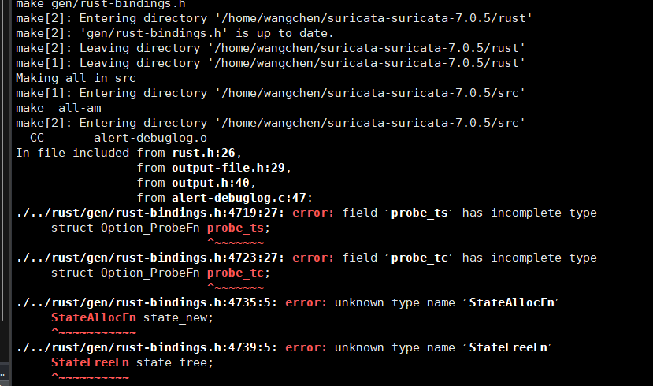
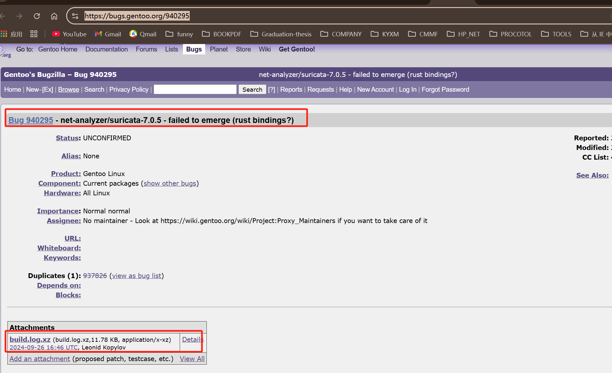
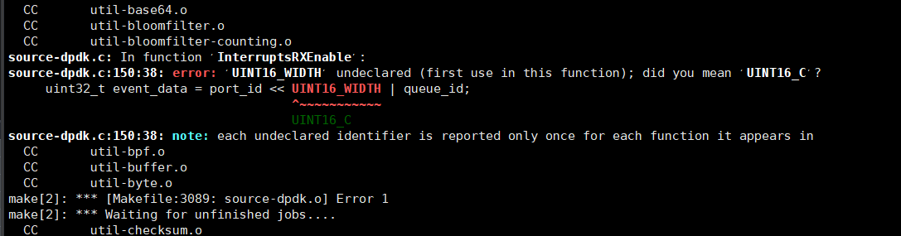
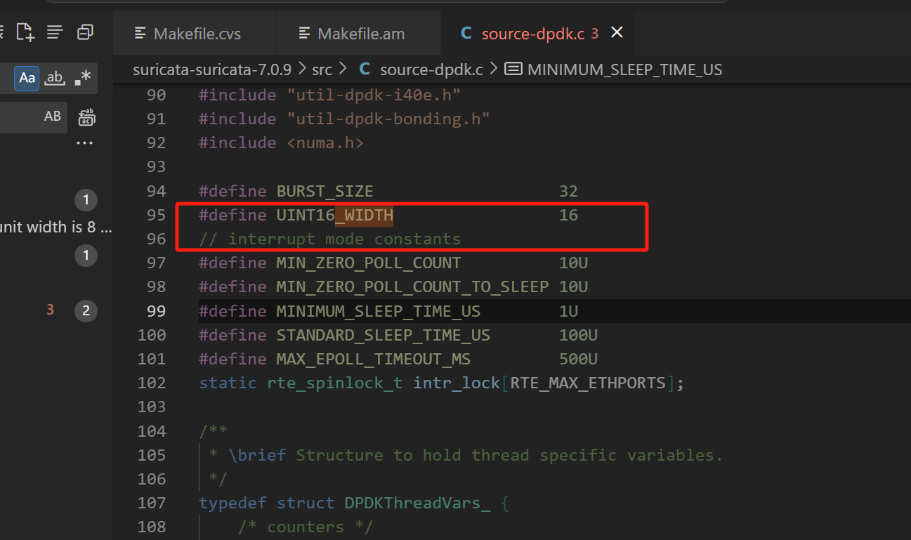

# Suricata7.0.9部署

```less
#环境准备
libhtp-0.5.x.zip
dpdk-20.11.10.tar.xz
suricata-suricata-7.0.9.zip
```


## 1、dpdk环境

```less
pip3 install meson
pip3 install ninja
// dpdk配置安装
meson setup build --prefix=/usr/local/dpdk
// meson setup build --reconfigure --prefix=/usr/local/dpdk
ninja -C build install -j 16
ldconfig // 加载新动态库
// 配置环境变量
echo 'export PKG_CONFIG_PATH=/usr/local/dpdk/lib64/pkgconfig:$PKG_CONFIG_PATH' >> ~/.bashrc
echo 'export LD_LIBRARY_PATH=/usr/local/dpdk/lib64:$LD_LIBRARY_PATH' >> ~/.bashrc
source ~/.bashrc
// 配置pkt-cfg的libdpdk路径
find  /usr/local/dpdk/ -name *pc
// $  /usr/local/dpdk/lib64/pkgconfig/libdpdk.pc
echo 'export PKG_CONFIG_PATH=/usr/local/dpdk/lib64/pkgconfig/:$PKG_CONFIG_PATH'  >> ~/.bashrc
source ~/.bashrc

// 重新安装高版本dpdk24
rm -rf /usr/local/dpdk
meson setup --wipe build --prefix=/usr/local/dpdk
pip3 install pyelftools --upgrade // 应对：Exception: elftools module not found
ninja -C build install -j 16
后续步骤参考上面环境配置，需要自行验证dpdk版本是否替换：cat /usr/local/dpdk/lib64/pkgconfig/libdpdk.pc
```


## 2、libhtp/libyaml环境

```less
// libhtp配置
./autogen.sh
./configure --prefix=/usr/local/libhtp
make -j && make install
ldconfig // 加载新动态库
find  /usr/local/libhtp/ -name *pc
// $ /usr/local/libhtp/lib/pkgconfig/htp.pc
echo 'export PKG_CONFIG_PATH=/usr/local/libhtp/lib/pkgconfig/:$PKG_CONFIG_PATH' >> ~/.bashrc
source ~/.bashrc 
// 已经手动安装了 libhtp，可以通过以下命令强制 Suricata 使用系统安装的 libhtp，而不是内置的版本：--enable-non-bundled-htp
./configure --prefix=/home/wangchen/suricata-suricata-7.0.9/bin --enable-dpdk --enable-non-bundled-htp


// yaml源码安装
wget https://pyyaml.org/download/libyaml/yaml-0.2.5.tar.gz
tar -xf yaml-0.2.5.tar.gz
cd yaml-0.2.5
./configure // 默认"/usr/local/lib"
make
make install
echo "/usr/local/lib" > /etc/ld.so.conf.d/local.conf
ldconfig
```


## 3、libpcap部署(pcap.h)

```less
方法一：#<pcap.h>
// 对于suricata，一定先安装这个，不然会一直报错缺少pcap.h
yum install -y libnet* 
yum install -y libpcap*

方法二：针对方法一还是不行，则源码安装libpcap
wget https://www.tcpdump.org/release/libpcap-1.10.4.tar.gz
tar -xf libpcap-1.10.4.tar.gz && cd libpcap-1.10.4
yum install flex*
yum install bison*
./configure --prefix=/usr/local/libpcap
make && make install
vim ~/.bashrc
加到最后一行：
	export CFLAGS="-I/usr/local/libpcap/include"
	export LDFLAGS="-L/usr/local/libpcap/lib"
source ~/.bashrc
```


## 4、file-devel安装

```less
wget https://astron.com/pub/file/file-5.41.tar.gz
yum -y groupinstall "Development Tools"
yum -y install gcc make
./configure
make && make install
```


## 5、rust环境

```less
// rust环境
yum install -y libunwind* cargp*
// cbindgen：指定要安装的 crate 名称，cbindgen 是一个用于生成 C 语言头文件的工具，通常用于将 Rust 代码暴露给 C 语言接口。
cargo install --force cbindgen

// 配置环境
find / -name .cargo
	// /root/.cargo
/* 
[root@localhost suricata-dpdk-rte-flow-drop-filter-v1]# echo $HOME
/root
*/
echo 'export PATH=$HOME/.cargo/bin:$PATH' >> ~/.bashrc
source ~/.bashrc
```


## 6、make报错

### (1) 7.0.5在编译使用rust的时候会报错



解决参考：

https://forum.suricata.io/t/unable-to-compile-latest-version-of-suricata/4810

https://github.com/thinrope/pkalin/commit/9063c3c0a54ecd0eff68216b8a6a2368a4dfa66a

```less
cargo install -f cbindgen --root /usr/ --version 0.26.0  //无用
```

这是suricata7.0.5的一个bug： https://bugs.gentoo.org/940295




### (2) 替换为7.0.9版本：

```less
./autogen.sh
./configure --prefix=/home/wangchen/suricata-suricata-7.0.9/bin --enable-dpdk --enable-non-bundled-htp
make -j
```


### (3) UINT16_WIDTH’ undeclared 增加定义



添加定义即可：




## 7、运行

```less
// suricata启动
./suricata -c ../suricata-37-trex-cs.yaml -l ./log/ --dpdk
// 客户端trex
./t-rex-64 -f astf/http_simple.py -m 1000 -d 1000 -c 1 --astf -l 1000 -k 10 --astf-client-mask 1
// 服务端trex
./t-rex-64 -f astf/http_simple.py -m 1000 -d 1000 -c 1 --astf -l 1000 -k 10 --astf-server-only
```

```shell
# bypass ： /home/wangchen/rte-flow/suricata-dpdk-rte-flow-drop-filter-v1
./configure --prefix=/home/wangchen/rte-flow/suricata-dpdk-rte-flow-drop-filter-v1/bin/ --enable-dpdk --enable-non-bundled-htp

make -j && make install && \cp ./bin/bin/suricata ./suricata && ./suricata -c ./cfg/suricata-37.yaml -l ./log/ --dpdk

```

