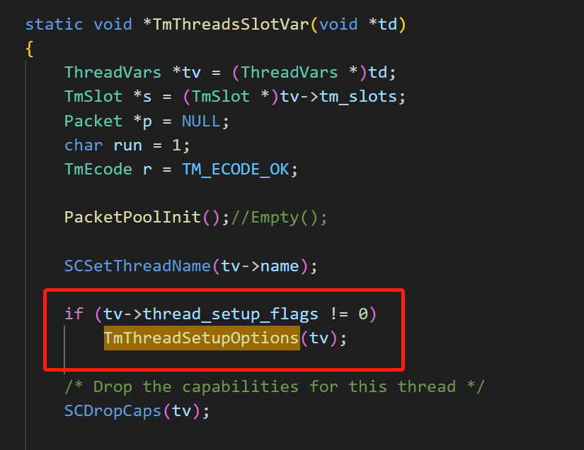
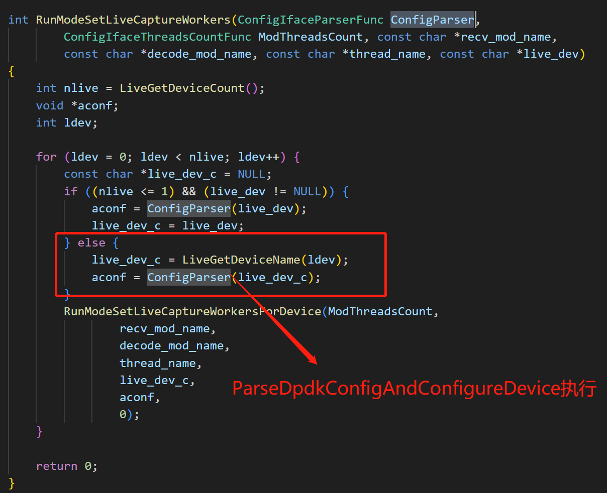
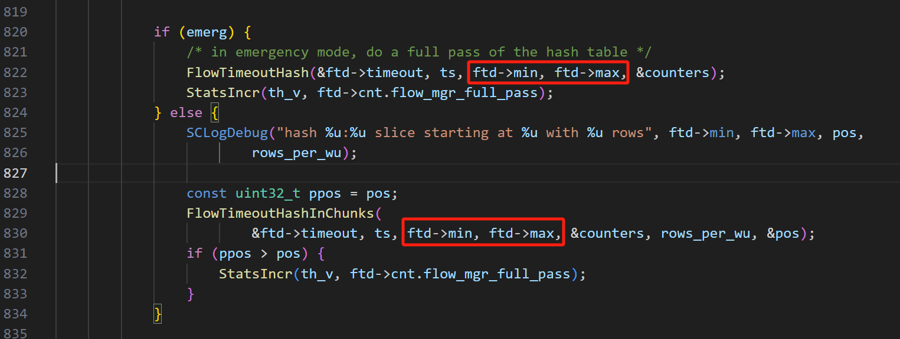
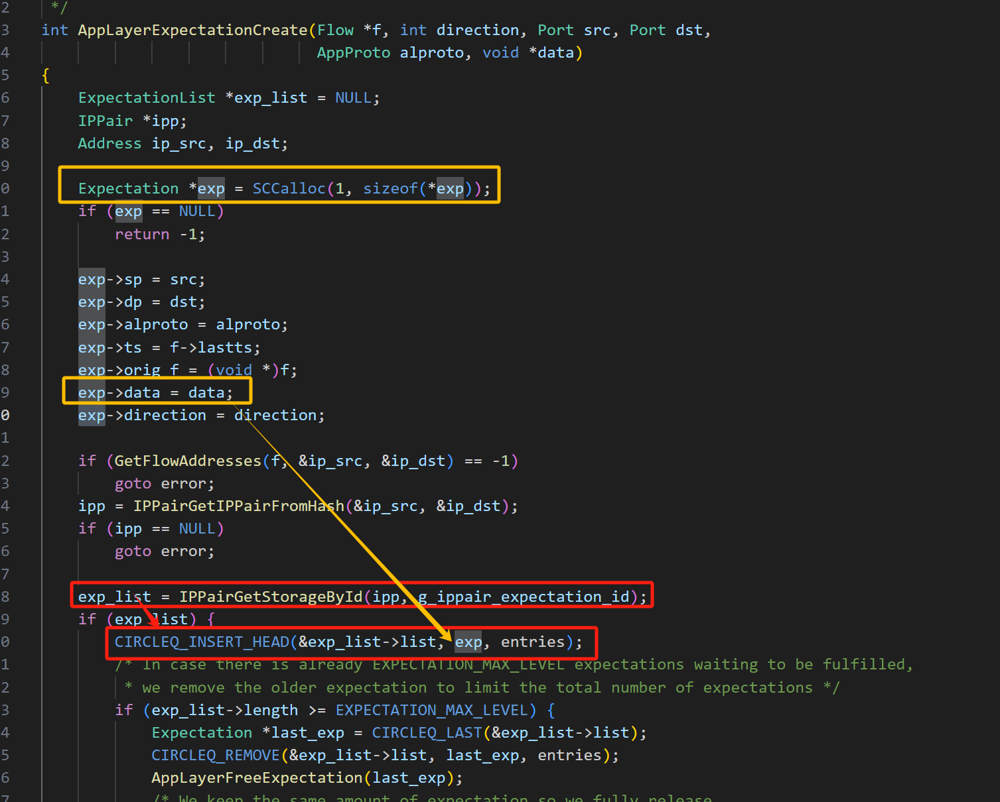

# suricata项目解析

```less
yum -y install gcc libpcap-devel pcre-devel libyaml-devel file-devel   zlib-devel jansson-devel nss-devel libcap-ng-devel libnet-devel tar make   libnetfilter_queue-devel lua-devel libmaxminddb-devel hiredis-devel lz4-devel 

yum install rustc cargo
cargo install --force cbindgen //更新版本

安装libhtp ：https://suricata.io/download/
./aoto
```


## 一、suricata基本信息介绍


```less
// pcap模式
./suricata -c ../suricata.yaml -r ../pcaps/http1-kordoc_1.pcap

20230919版本suricata的大致<本机>安装

curl --proto '=https' --tlsv1.2 -sSf https://sh.rustup.rs | sh

git clone libhtp # ./configure && make && make install

 yum install unzip
 yum install git
 yum install libtool
 yum install pcre2 pcre2-devel
 yum install libyaml-devel
 yum install jansson-devel
 yum install libpcap
 yum install libpcap-devel
 yum install zlib*
 yum install libcap-ng-devel file-devel
 yum install epel-release
 yum install lz4-devel
```


##  二、suricata 工作模式分析

### 3.1 single模式


single只支持一个网卡设备，只有一个work线程

### 3.2 work模式(多队列隔离模式)


Work工作模式，每个网卡默认对应cpu数个工作线程(或者按照配置文件配置的线程数)，每个工作线程取对应的网卡队列中数据包

### 3.3 autofp工作模式


autofp模式相对比较复杂，相当于共用了work线程

### 3.4 work线程介绍

工作模式的重点在于工作线程的处理，下面介绍一下工作线程的处理流程

数据包工作线程是按照slot的注册跑，一个slot一个走
这是个流工作线程，以afpacket的work工作模式为例，函数执行流程如下：

<font color=red>TmThreadsSlotPktAcqLoop ----> ReceiveAFPLoop ----> AFPReadFromRing ----> TmThreadsSlotProcessPkt ----> TmThreadsSlotVarRun ----> SlotFunc（FlowWorker）</font>

ReceiveAFPLoop就是当时注册的收包slot,
FlowWorker就是当时注册的flow work slot


在多网卡收包的场景下，推荐使用work模式，该模式的性能会更好，同时可以调节收包模式，使得同一个五元组在同一个线程中处理，更有利于在攻击场景中做统计计算。


### 3.5 autofp与pipeline的区别

autofp在多网卡情况下，因为是会共用几个fw线程，所以在pkt入队列时是需要上锁的。但改成pipe时，就可以无锁入队列。


## 三、规则检测匹配


## 四、dpdk抓包模块

### 前言：RSS负载均衡

```less
RSS--Receive Side Scaling
接收端扩展 (RSS) — RSS 通过将数据包分配到不同的描述符队列中，在多个处理器内核之间分配数据包处理。 RSS 为每个接收到的数据包分配一个 RSS 索引。 根据 RSS 索引和其他考虑因素（例如 DCB 和虚拟化），将数据包路由到一组 Rx 队列之一。

7.1.2.8 Receive-Side Scaling (RSS)
	RSS 是一种将接收到的数据包分配到多个描述符队列中的机制。然后，软件将每个队列分配给不同的处理器，从而在多个处理器之间分担数据包处理的负载。
	如第 7.1 节所述，82599 使用 RSS 作为其数据包分配策略的一个组成部分（其他是各种过滤器、DCB 和虚拟化）。 RSS 输出是 RSS 索引。 82599 全局分配使用这些位（或仅某些 LSB）作为队列号的一部分。
	图7-10显示了计算RSS输出的过程：
1.接收数据包被解析为哈希操作使用的头字段（如IP地址、TCP端口等。该部分可以自行指定），每个包的描述符是一一对应的。
2.根据RSS-key进行哈希计算。 82599 支持单个哈希函数，如 MSFT RSS 所定义。 因此，82599 并不向设备驱动程序指示使用哪个哈希函数。 32 位结果被送入数据包接收描述符。
```


```less
3.哈希结果的 7 个 LSB(低字节) 用作 128 条目重定向表的索引。 每个条目提供一个 4 位 RSS 输出索引。重定向表的作用是用以触发系统中断，从而来处理数据包。
4.用于验证哈希函数是否是根据 MSFT 命名法计算的。
```


```less
<启用规则>：
• RSS 在MRQC 寄存器中启用。
• RSS 启用不能动态完成，而必须先进行软件重置。
• 当RXCSUM.PCSD 位置1 时，描述符回写中的RSS 状态字段被启用（片段校验和被禁用）。 因此，RSS 与 UDP 分段校验和卸载是互斥的。
• 当使用传统接收描述符格式时，不提供对RSS 的支持。
<禁用规则>：
• 不允许即时禁用RSS，禁用RSS 后必须重置82599。
• 当RSS 被禁用时，数据包被分配RSS 输出索引= 0。
• 当在 RSS 模式下启用多个请求队列时，将为不可解码的数据包分配 RSS 输出索引 = 0。 32 位标签（通常是散列函数的结果）等于 0。
```

suricata的rssHash方法分类（依据网卡类型）：


同时也标注了hash的源值：也可以自己设定


处理3w1h时，因为不是常规数据包头，所以不能使用RSS(其一：没有常规的五元组数据；其二：盲目硬转Eth-ip，又因为3w1h头基本是一样的，算出来的hash也就一眼，无法负载均衡)，只能用软哈希取模分队列：SoftHash


### 1 dpdk各线程开启流程

START：

```apl
# dpdk默认工作模式为worker
const char *RunModeDpdkGetDefaultMode(void) ---> return "workers";
```

梳理一条dpdk的大致运行注册线路：

```less
#注册
InitGlobal		RunModeRegisterRunModes		RunModeDpdkRegister		RunModeRegisterNewRunMode	
static RunModes runmodes[RUNMODE_USER_MAX];
	mode->RunModeFunc = RunModeFunc;//RunModeIdsDpdkWorkers
    mode->RunModeIsIPSEnabled = RunModeIsIPSEnabled;//DPDKRunModeEnableIPS

#运行 (调用函数如下图)
RunModeDispatch		 mode->RunModeFunc();
//更重要的是，流管理线程也在此时开始建立运行
	FlowManagerThreadSpawn();//流管理
  	FlowRecyclerThreadSpawn();//流回收
	StatsSpawnThreads();//流统计
```


### 2 RunModeIdsDpdkWorkers模式

RunModeIdsDpdkWorkers函数

```c
int RunModeIdsDpdkWorkers(void)
{
    // 对应各自标题
    RunModeInitialize();
    TimeModeSetLive();
    InitEal();
    ret = RunModeSetLiveCaptureWorkers(ParseDpdkConfigAndConfigureDevice, DPDKConfigGetThreadsCount,
            "ReceiveDPDK", "DecodeDPDK", thread_name_workers, NULL);
}
```


#### (1) RunModeInitialize


```apl
#dpdk线程与core的亲和性关系设定：线程绑定在那些core、worker线程的最大线程数等设置
#处理yaml文件中：cpu-affinity参数配置
AffinitySetupLoadFromConfig();

#其中可以配置指定内核的线程有如下4种（默认每个线程都使用所有CPU-core）
ThreadsAffinityType thread_affinity[MAX_CPU_SET] ---> 
	    .name = "receive-cpu-set",/ "worker-cpu-set",/"verdict-cpu-set",/"management-cpu-set",
        .mode_flag = EXCLUSIVE_AFFINITY,// 线程是“分离”的，还是“结合”的
        .prio = PRIO_MEDIUM,
        .lcpu = 0,
# step1： 设置依附core
BuildCpuset();
# step2: 设置线程与core的友善值
友善值可控制一个进程何时运行。Linux会按照优先级(从最高到最低)的顺序来对运行进程进行调度：优先级较高的进程会比优先级较低的进程先运行。友善值还可控制一个进程的时间片大小。  
友善值的有效范围从-20到19，而且默认值是0。你可能会有点困惑，一个进程的友善值越低，则它的优先级就越高，而且它的时间片也越大；反过来说，友善值越高，进程的优先级越低，而且它的时间片越小。因此掉高一个进程的友善值就等于善待系统上的其他进程。但是以数字来看的确令人混淆。当我们说一个进程具有“高优先级”时，我们的意思是说，相较于优先级较低的进程，调度程序会更快安排它运行，而且会让它运行更长时间。
TmThreadsSlotPktAcqLoop()(各线程func调用时设置线程友善值)---->TmThreadSetPrio() ---> nice (int nic);
如下图：
```




#### (2) Dpdk配置参数解释

```less
//该函数的主要目的是处理cfg中以下部分
```


```less
// 特殊参数
// 回写：这种机制在写操作时，会先写入缓存中，但不会立即写入磁盘中，而是在一些特定条件或操作，才会把缓存中的数据写入磁盘。
rx-descriptors
tx-descriptors

82599 在数据包写入系统内存后立即回写接收描述符。 因此，可以一次将单个描述符写入内存。 但是，如果在描述符获取期间发生聚合（请参阅第 7.1.7 节），则在聚合操作中获取的描述符将在单个回写操作中写回。 在接收合并 (RSC) 中，除了最后一个描述符之外的所有描述符在完成后都会被回写。 这不一定是在数据包边界上，而是在获取同一 RSC 的下一个描述符时

所以，想要网卡所收包效率更高，需要提高rx/tx-descriptors的大小

copy-mode用于判断是否打开ips
```


##### 2.1 RSS配置

```less
RunModeIdsDpdkWorkers
	ParseDpdkConfigAndConfigureDevice
		DeviceConfigure
			DeviceInitPortConf
				if (dev_info->rx_offload_capa & RTE_ETH_RX_OFFLOAD_RSS_HASH) {
					DeviceSetPMDSpecificRSS() {
    					// RSS is configured in a specific way for a driver i40e and DPDK version <= 19.xx
    					if (strcmp(driver_name, "net_i40e") == 0)
        					i40eDeviceSetRSSConf(rss_conf);
    					if (strcmp(driver_name, "net_ice") == 0)
        					iceDeviceSetRSSHashFunction(&rss_conf->rss_hf);
    					if (strcmp(driver_name, "net_ixgbe") == 0)
        					ixgbeDeviceSetRSSHashFunction(&rss_conf->rss_hf);
    					if (strcmp(driver_name, "net_e1000_igb") == 0)
        					rss_conf->rss_hf = (RTE_ETH_RSS_IPV4 | RTE_ETH_RSS_IPV6 | RTE_ETH_RSS_IPV6_EX);
					}
				}
```

##### 2.2 FDIR配置

```less
TmModuleReceiveDPDKRegister <"ReceiveDPDK">
	ReceiveDPDKThreadInit
		DevicePostStartPMDSpecificActions(ptv, dev_info.driver_name);
        	i40eDeviceSetRSS(ptv->port_id, ptv->threads);// if (strcmp(driver_name, "net_i40e") == 0)
				i40eDeviceSetRSSWithFlows(port_id, port_name, nb_rx_queues);
```


#### (3) InitEal

InitEal()该函数主要针对于eal-params参数使用

```less
    dpdk:
      eal-params:
        proc-type: primary // 用于将给定的进程实例指定为primary processes或secondary processes DPDK实例。

#获取eal-params配置
 TAILQ_FOREACH (param, &eal_params->head, next) {
        ArgumentsAddOptionAndArgument(&args, param->name, param->val);
    }

#初始化MAIN核运行
etval = rte_eal_init(args.argc, eal_argv);
```


#### (4) 模式注册调用 RunModeSetLiveCaptureWorkers


##### 4.1 ParseDpdkConfigAndConfigureDevice

```less
#获取网卡配置属性
LiveBuildDeviceList("dpdk.interfaces"); // yaml读取选项
LiveRegisterDeviceName(const char *dev) // "0000:3b:00.0"   ----> 存储于LiveDeviceName结构 pre_live_devices
```



```less
#网卡信息传递
上述LiveGetDeviceName中live_devices即源自pre_live_devices。
```


```less
// “dpdk.interfaces”的条目之一是“default”接口。当加载接口配置并且缺少某些条目时，将使用“default”接口的相应值。
#开始网卡配置
ParseDpdkConfigAndConfigureDevice()
	#逻辑伪代码
	for(网卡个数){
    	#网卡配置修缮
		iconf = ConfigParse();
        {
            rte_eth_dev_get_port_by_name(entry_str, &iconf->port_id);//获取linux内对应网卡的端口ID
            strlcpy(iconf->iface, entry_str, sizeof(iconf->iface));
            ………………
            //将对于网卡下的配置都转存于iconf结构中
            //注：根据ConfigSetRxQueues ConfigSetTxQueues函数我们可以知道，suricata下的dpdk配置了多少个网卡线程，这开设多少个rx/tx队列
            ………………
        }
	
		#网卡配置
		DeviceConfigure(iconf);
        {
            // 判断网卡是否有效 rte_eth_dev_is_valid_port(iconf->port_id)
            // 获取网卡NUMA套接字 iconf->socket_id = rte_eth_dev_socket_id(iconf->port_id);
            // 获取网卡信息 rte_eth_dev_info_get(iconf->port_id, &dev_info);
            // 并与网卡配置进行比对调整 DeviceInitPortConf()
            							// iconf->nb_rx_queues > dev_info.max_rx_queues
            							// iconf->nb_tx_queues > dev_info.max_tx_queues
            							// DeviceValidateMTU(iconf, &dev_info);
            							// 是否打开/卸载校验和
            							// RSSkey值、hash方法配置
            							// MUT设置 port_conf->rxmode.max_rx_pkt_len = mtu;
            							// 网卡是否支持mbuf快速释放 DEV_TX_OFFLOAD_MBUF_FAST_FREE   
            // 设置网卡的收发包队列数目、相关硬件卸载功能模块
            // 该函数用于激活硬件卸载功能，为以太网设备提供的每个可静态配置的卸载硬件功能提供专用字段，例如IP校验和或VLAN标签剥离。
    		retval = rte_eth_dev_configure(iconf->port_id, iconf->nb_rx_queues, iconf->nb_tx_queues, &port_conf); 
           // 设置网卡的rx/tx_descriptors描述符大小
    		retval = rte_eth_dev_adjust_nb_rx_tx_desc(iconf->port_id, &iconf->nb_rx_desc, &iconf->nb_tx_desc);
            // 是否接受多播数据包
   			retval = ……rte_eth_allmulticast_enable(iconf->port_id): rte_eth_allmulticast_disable(iconf->port_id);
            // 是否打开网卡混杂模式
   			retval = …… rte_eth_promiscuous_enable(iconf->port_id): rte_eth_promiscuous_disable(iconf->port_id);
            // 设置mtu
    		retval = rte_eth_dev_set_mtu(iconf->port_id, iconf->mtu);
            // 为对应网卡建立rx/tx队列数
    		retval = DeviceConfigureQueues(iconf, &dev_info, &port_conf); 
            {
                // 设置抓取pkt的内存池大小、对应core的cache大小、限定NUMA位置(应分配内存的套接字标识符)
                // mbuf_size 每个mbuf中数据缓冲区的大小，所以也包括了RTE_PKTMBUF_HEADROOM。
                #######注意#######
                // dpdk的pool创建时if (RTE_ALIGN(priv_size, RTE_MBUF_PRIV_ALIGN = 8) != priv_size)，会对申请的内存大小检查是否8字节对齐。
                // 所以suricata以1024来成倍申请内存。以此取mtu_size最接近的1024倍数值 + HAED。 保证字节对齐不报错EINVAL。
                mbuf_size = ROUNDUP(mtu_size, 1024) + RTE_PKTMBUF_HEADROOM; 
                iconf->pkt_mempool = rte_pktmbuf_pool_create(mempool_name, mempool_size,mempool_cache_size, 0, mbuf_size, socket_id);
            }
            // IPS配置：只有设置IPS模式才会打开
    		retval = DeviceConfigureIPS(iconf);
        }
	}

```

```apl
#注:查看网卡的numa套接字 依据网卡的pci地址
lspci | grep Eth
cat /sys/bus/pci/devices/0000\:00\:03.2//numa_node
```


##### 4.2 DPDKConfigGetThreadsCount

逻辑关系：ParseDpdkConfigAndConfigureDevice返回的aconf(dpdk配置结构体) --------> DPDKConfigGetThreadsCount(aconf)


调用位置：


##### 4.2  RunModeSetLiveCaptureWorkersForDevice

看函数名就知道：该函数用以设置dpdk的worker工作线程，传值如下


step1：获取yaml中worker线程相关配置。（可以参看前面的：AffinitySetupLoadFromConfig函数简介）

step2：获取worker线程数设置值：uint16_t thread_max = TmThreadsGetWorkerThreadMax();

step3：根据thread_max 创建worker线程如下。
```c
// 伪代码逻辑
/* create the threads */
    for (int thread = 0; thread < threads_count; thread++) {
        // 拼凑tname名称
        char tname[TM_THREAD_NAME_MAX];
        
        // 建立线程变量
        ThreadVars *tv = TmThreadCreatePacketHandler(tname,
                "packetpool", "packetpool",
                "packetpool", "packetpool",
                "pktacqloop");
	·   
        // "ReceiveDPDK"  tv.PktAcqLoop = ReceiveDPDKLoop
        TmSlotSetFuncAppend(tv,"ReceiveDPDK");
        // "DecodeDPDK"  tv.Func = DecodeDPDK
        TmSlotSetFuncAppend(tv,"DecodeDPDK");
        // "FlowWorker"  tv.Func = FlowWorker;
        TmSlotSetFuncAppend(tv,"FlowWorker");
        // "RespondReject"阻断模块  tv.Func = RespondRejectFunc;
        TmSlotSetFuncAppend(tv,"RespondReject");

        // 设置tv线程类型
        TmThreadSetCPU(tv, WORKER_CPU_SET);
        
        // 启动worker线程
        TmThreadSpawn(tv)
    }
```


###### 4.2.1 TmThreadCreatePacketHandler


strep1：TmThreadCreate 参数解释

```less
//我们变换一下变量信息
TmThreadCreate(tname, inq_name = "packetpool", 
    				inqh_name = "packetpool",
    				outq_name = "packetpool", 
    				outqh_name = "packetpool", 
    				slots = "pktacqloop",
    				NULL, 0);
```

其中"packetpool"模块：

```c
void TmqhPacketpoolRegister (void)
{
    tmqh_table[TMQH_PACKETPOOL].name = "packetpool";
    tmqh_table[TMQH_PACKETPOOL].InHandler = TmqhInputPacketpool; // 该函数是用以：当有一个新的packet进入时，从内存池中获取一个Packet结构体以返回
    tmqh_table[TMQH_PACKETPOOL].OutHandler = TmqhOutputPacketpool; // 释放对应Packet结构体
}
```

而："pktacqloop"模块：

```less
// 用以标识函数线程方法
} else if (strcmp(name, "pktacqloop") == 0) {
        tv->tm_func = TmThreadsSlotPktAcqLoop;
    }

//并由之后的TmThreadSpawn进行调用
TmEcode TmThreadSpawn(ThreadVars *tv)
{
	// 可以查看后面的梳理
}
```


strep2：TmThreadCreate 逻辑详解

了解了TmThreadCreate函数的参数作用，接下来我们具体查看其函数逻辑：

```less
#调用位置
TmThreadCreatePacketHandler	 // 包处理线程
TmThreadCreateMgmtThread	// 	Spawns the wakeup, and the management thread used by the stats api
TmThreadCreateMgmtThreadByName //	FlowManagerThreadSpawn + FlowRecyclerThreadSpawn
TmThreadCreateCmdThreadByName // 命令行线程

#函数关键逻辑
ThreadVars *TmThreadCreate(const char *name, const char *inq_name, const char *inqh_name,
                           const char *outq_name, const char *outqh_name, const char *slots,
                           void * (*fn_p)(void *), int mucond)
{
    // 初始化所需tv
    ThreadVars *tv =  = SCMalloc(sizeof(ThreadVars));
    memset(tv, 0, sizeof(ThreadVars));

    // 根据参数名称设置--->出入队列、出入队列的函数处理回调、记录出入队列的id号
        tv->inq = tmq; // tmq_list
        tv->tmqh_in = tmqh->InHandler; // TmqhInputPacketpool
        tv->inq_id = (uint8_t)id;
	    tv->inq->reader_cnt++;
	    
    	tv->outq = tmq;
        tv->tmqh_out = tmqh->OutHandler; // TmqhOutputPacketpool
        tv->outq_id = (uint8_t)id;
        tv->outctx = tmqh->OutHandlerCtxSetup(outq_name);
        tv->outq->writer_cnt++;


    // 关键函数 设置线程函数，以及线程相关所需资源 为tv设置slots的插槽函数
    // 下面详细描述
    if (TmThreadSetSlots(tv, slots, fn_p) != TM_ECODE_OK) {
        goto error;
    }
	
    // 指示是否为此新创建的 TV 初始化条件和互斥变量的标志。
    if (mucond != 0)
        TmThreadInitMC(tv);
    
    return tv;
}
```


###### 4.2.2 TmThreadSetSlots（tm_func）

```less
// 本次dpdk抓包处理：name = "pktacqloop"
static TmEcode TmThreadSetSlots(ThreadVars *tv, const char *name, void *(*fn_p)(void *))
{
    // 之后创建各自的函数线程
    if (strcmp(name, "varslot") == 0) {
        tv->tm_func = TmThreadsSlotVar; // 例如pcap模式既是使用该种模式线程
    } else if (strcmp(name, "pktacqloop") == 0) {
        tv->tm_func = TmThreadsSlotPktAcqLoop;
    } else if (strcmp(name, "management") == 0) {
        tv->tm_func = TmThreadsManagement;
    } else if (strcmp(name, "command") == 0) {
        tv->tm_func = TmThreadsManagement;
    } else if (strcmp(name, "custom") == 0) {
        tv->tm_func = fn_p;
    }
    return TM_ECODE_OK;
}

// 其中tm_func的注册，由后续TmThreadSpawn函数进行线程创建 int rc = pthread_create(&tv->t, &attr, tv->tm_func, (void *)tv);
```


###### 4.2.3 TmSlotSetFuncAppend（slot_next）PktAcqLoop

```less
 // 逻辑： TmModule(tm_module) -----> TmSlot(slot) -----> ThreadVars(tv)

// 例如本次调用了四个模块tm_module，则是把四个tm_module先转换成slot，在插入到tv的slot链表中
	   // "ReceiveDPDK" 
        TmSlotSetFuncAppend(tv,"ReceiveDPDK");
        // "DecodeDPDK" 
        TmSlotSetFuncAppend(tv,"DecodeDPDK");
        // "FlowWorker" 
        TmSlotSetFuncAppend(tv,"FlowWorker");
        // "RespondReject"阻断模块 
        TmSlotSetFuncAppend(tv,"RespondReject");

// 具体实现如下
void TmSlotSetFuncAppend(ThreadVars *tv, TmModule *tm, const void *data)
{
// tm ----> slot赋值操作
    TmSlot *slot = SCMalloc(sizeof(TmSlot));
    memset(slot, 0, sizeof(TmSlot));
    SC_ATOMIC_INITPTR(slot->slot_data);
    
    // 开始赋值 SlotFunc  PktAcqLoop  Management 三个关键函数
    slot->SlotThreadInit = tm->ThreadInit;
    slot->slot_initdata = data;
    // **********
    // **********
    // **********
    //解包函数DecodeDPDK ---> TmThreadsSlotVarRun执行 --->也由PktAcqLoop里 TmThreadsSlotProcessPkt(包处理函数) 来循环调用
    slot->SlotFunc = tm->Func; 

    // *********************
    // 注意： 本次的线程 tm_func 是 TmThreadsSlotPktAcqLoop 函数，当然其它的tvCreate则会是TmThreadsManagement线程的创建。
    // 所以对于 slot链表 的各个节点函数，需要查看对应tm_func函数线程
    // 包处理函数 ReceiveDPDKLoop -------->TmThreadsSlotPktAcqLoop 即由前面的 tm_func 函数执行
    slot->PktAcqLoop = tm->PktAcqLoop; 
		tv->break_loop = true;
   	//流管理函数 FlowManager FlowRecycler ---------> TmThreadsManagement 同理由前面的tm_func函数执行
    slot->Management = tm->Management; 
    slot->SlotThreadExitPrintStats = tm->ThreadExitPrintStats; //流管理线程退出统计 FlowWorkerExitPrintStats
    slot->SlotThreadDeinit = tm->ThreadDeinit; //流管理free线程 FlowWorkerThreadDeinit
    slot->tm_id = TmModuleGetIDForTM(tm); // 每一个tm注册时的id

    tv->tmm_flags |= tm->flags;
    tv->cap_flags |= tm->cap_flags;

// 链表操作如下
    if (tv->tm_slots == NULL) {
        tv->tm_slots = slot;
    } else {
        TmSlot *a = (TmSlot *)tv->tm_slots, *b = NULL;
        /* get the last slot */
        for ( ; a != NULL; a = a->slot_next) {
             b = a;
        }
        /* append the new slot */
        if (b != NULL) {
            b->slot_next = slot; //从尾部进行插入
        }
    }
}
```


###### 4.2.4 TmThreadSpawn（pthread_create）<总结>

```less
TmEcode TmThreadSpawn(ThreadVars *tv)
{
    // 初始化
    pthread_attr_t attr;
    if (tv->tm_func == NULL) {
        FatalError("No thread function set");
    }
    /* Initialize and set thread detached attribute */
    pthread_attr_init(&attr);

    // 设置线程分离状态的函数为pthread_attr_setdetachstate
    // 在任何一个时间点上，线程是可结合的（joinable），或者是分离的（detached）。
    // 一个可结合的线程能够被其他线程收回其资源和杀死；在被其他线程回收之前，它的存储器资源（如栈）是不释放的。
    // 相反，一个分离的线程是不能被其他线程回收或杀死的，它的存储器资源在它终止时由系统自动释放。
    pthread_attr_setdetachstate(&attr, PTHREAD_CREATE_JOINABLE);

    /* Adjust thread stack size if configured */
    if (threading_set_stack_size) {
        // 设置线程的堆栈大小 防止流等诸多线程出现超时数据庞大，而导致内存占用过多，影响总体性能
        pthread_attr_setstacksize(&attr, (size_t)threading_set_stack_size);
    }
	
    // 线程创建  4.2.5进行函数详解
    int rc = pthread_create(&tv->t, &attr, tv->tm_func, (void *)tv);
    ################################
    	此时的线程创建则是对应的 tv->tm_func = TmThreadsSlotPktAcqLoop 函数；
    	为了方便理解，我们在这里稍微做个总结：
    		pthread_create(---TmThreadsSlotPktAcqLoop(slot)---);
	    	{
                F1_slot(ReceiveDPDKLoop) -> s->PktAcqLoop // ReceiveDPDKLoop
                {
                    while(1) 
                    {
                        (1) 循环收包
                        (2) 循环后续模块TmThreadsSlotVarRun 
                        	F2_slot(DecodeDPDK) --> F3_slot(FlowWorker) --> F4_slot(RespondRejectFunc)
				   }
                }
			}
    ################################
	
    // 等待线程结束标志
    TmThreadWaitForFlag(tv, THV_INIT_DONE | THV_RUNNING_DONE);
	
    // 将线程类型基于type新增记录到tv_root
    TmThreadAppend(tv, tv->type);
    return TM_ECODE_OK;
}

```


###### 4.2.5 TmThreadsSlotPktAcqLoop（for (slot) ）

```less
static void *TmThreadsSlotPktAcqLoop(void *td)
{
    ThreadVars *tv = (ThreadVars *)td;
	//第一个slot既是 TmSlotSetFuncAppend 注册的"ReceiveDPDK"tv.PktAcqLoop = ReceiveDPDKLoop
    TmSlot *s = tv->tm_slots; 
    // 设置线程名称
    SCSetThreadName(tv->name);
	
    // 设置线程选项（cpuaffinitythread）。优先级应该已经由 pthread_create 设置。
    TmThreadSetupOptions(tv);

	// packet池初始化
    PacketPoolInit();

    /* 校验 */
    if (s == NULL || s->PktAcqLoop == NULL || tv->tmqh_in == NULL || tv->tmqh_out == NULL) {
        TmThreadsSetFlag(tv, THV_CLOSED | THV_RUNNING_DONE);
        pthread_exit((void *) -1);
        return NULL;
    }

    // pktacqloop
    // 并非所有的tv->tm_flowworker = slot;都可以赋值给流管理slot插槽，主要是因为该函数
    // 的tv取自pktacqloop注册模块。
    for (slot = s; slot != NULL; slot = slot->slot_next) {
        // 运行各个slot在线程开始前的初始化函数
        if (slot->SlotThreadInit != NULL) {
            void *slot_data = NULL;
            r = slot->SlotThreadInit(tv, slot->slot_initdata, &slot_data); // 初始化
        }
		
        // 设置flow_queue队列
        /* if the flowworker module is the first, get the threads input queue */
        if (slot == (TmSlot *)tv->tm_slots && (slot->tm_id == TMM_FLOWWORKER)) {
            tv->stream_pq = tv->inq->pq; // 数据包超时的stream队列 （一些RunModeSetIPSAutoFp模式时则是使用该队列）
            tv->tm_flowworker = slot; // 标记流管理slot
            tv->flow_queue = FlowQueueNew(); // 创建flow队列
        /* setup a queue */
        } else if (slot->tm_id == TMM_FLOWWORKER) {
            tv->stream_pq_local = SCCalloc(1, sizeof(PacketQueue));
            SCMutexInit(&tv->stream_pq_local->mutex_q, NULL);
            tv->stream_pq = tv->stream_pq_local; // 数据包stream的工作队列 （此为dpdk抓包的使用）
            tv->tm_flowworker = slot;
            tv->flow_queue = FlowQueueNew();
        }
    }

    // 设置计数器数组
    StatsSetupPrivate(tv);
	// 设置初始化结束标志
    TmThreadsSetFlag(tv, THV_INIT_DONE);

    // 循环packet处理函数
    while(run) {
        // "ReceiveDPDK"  tv.PktAcqLoop = ReceiveDPDKLoop 函数开始调用，同时tv进行传输调用后续的slot函数
        // 下面详解
        r = s->PktAcqLoop(tv, SC_ATOMIC_GET(s->slot_data), s);
        
        // 出错或关闭线程flag时退出
    }
    // 私人统计数据存储与公共统计数据存储
    StatsSyncCounters(tv);

    // 处理流程超时伪数据包。 在关闭期间，此循环将运行，直到流程引擎杀死线程并且stream_pg队列为空。
    TmThreadTimeoutLoop(tv, s);

	// 释放packet池
    PacketPoolDestroy();

    for (slot = s; slot != NULL; slot = slot->slot_next) {
        if (slot->SlotThreadExitPrintStats != NULL) {
            // 相应退出统计函数调用
            slot->SlotThreadExitPrintStats(tv, SC_ATOMIC_GET(slot->slot_data));
        }

        if (slot->SlotThreadDeinit != NULL) {
            // 退出free函数调用
            r = slot->SlotThreadDeinit(tv, SC_ATOMIC_GET(slot->slot_data));
            if (r != TM_ECODE_OK) {
                TmThreadsSetFlag(tv, THV_CLOSED);
                goto error;
            }
        }
    }
	
    // 流工作队列置为空
    tv->stream_pq = NULL;
	// 线程退出
    pthread_exit((void *) 0);
    return NULL;
}
```


###### 4.2.6 抓包函数ReceiveDPDKLoop(PktAcqLoop):循环处理packet，衔接后续包处理的各个slot

```less
/**
 *  \brief Main DPDK reading Loop function
 */
static TmEcode ReceiveDPDKLoop(ThreadVars *tv, void *data, void *slot)
{
    SCEnter();
    Packet *p;
    uint16_t nb_rx;
    time_t last_dump = 0;
    time_t current_time;
	
    // 此处数据由之前(TmSlotSetFuncAppend)设置的 slot->SlotThreadInit(tv, slot->slot_initdata, &slot_data); 进行初始化并set。
    // 主要用于统计计数
    DPDKThreadVars *ptv = (DPDKThreadVars *)data;
    TmSlot *s = (TmSlot *)slot;
	
    // 因为第一个slot是主线程函数 s->PktAcqLoop 正在外部while(run)
    // 所以我们使用下一个，也就是flowworker
    ptv->slot = s->slot_next;
	
    // 等待packet初始化
    PacketPoolWait();
```


```less
while (1) {
    	// 校验suricata是发出关闭信号
        if (unlikely(suricata_ctl_flags != 0)) { // suricata_ctl_flags & SURICATA_STOP
            SCLogDebug("Stopping Suricata!");
            DPDKDumpCounters(ptv); // 进行相关的p->livedev数据包计数信息更新
            break;
        }
		
    	// dpdk开始抓包
        nb_rx = rte_eth_rx_burst(ptv->port_id, ptv->queue_id, ptv->received_mbufs, BURST_SIZE);
        if (unlikely(nb_rx == 0)) {
            continue;
        }
	    // 记录总抓包数pkts
        ptv->pkts += (uint64_t)nb_rx;
    	// 开始循环建立 Packet结构
        for (uint16_t i = 0; i < nb_rx; i++) {
            p = PacketGetFromQueueOrAlloc();
            if (unlikely(p == NULL)) {
                continue;
            }
            PKT_SET_SRC(p, PKT_SRC_WIRE); // 初始数据包类型为“网络真实数据（Wire Data）”
            p->datalink = LINKTYPE_ETHERNET; // 以太网数据包
            p->ts = DPDKSetTimevalReal(&machine_start_time); // 数据包抓取时间
            p->dpdk_v.mbuf = ptv->received_mbufs[i]; // 数据包缓存
            p->ReleasePacket = DPDKReleasePacket; // 释放数据包回调函数
            
            // 针对IPS模块
            p->dpdk_v.copy_mode = ptv->copy_mode;
            p->dpdk_v.out_port_id = ptv->out_port_id; // reject的端口id
            p->dpdk_v.out_queue_id = ptv->queue_id; // reject的队列设置
            
            // 某些 NIC（例如 Intel）不支持队列统计信息，并且只能在端口级别获取丢弃。 因此将其设置为第一个worker线程至少对丢弃的数据包进行连续update。
            // 设置一个计数结构， 存储实时设备名称，相关包、丢包、忽略包、不进行校验和包的计数
            p->livedev = ptv->livedev;

            if (ptv->checksum_mode == CHECKSUM_VALIDATION_DISABLE) { // 关闭数据包校验和
                p->flags |= PKT_IGNORE_CHECKSUM;
            } else if (ptv->checksum_mode == CHECKSUM_VALIDATION_OFFLOAD) { // 开启校验和
                uint64_t ol_flags = ptv->received_mbufs[i]->ol_flags;
                if ((ol_flags & RTE_MBUF_F_RX_IP_CKSUM_MASK) == RTE_MBUF_F_RX_IP_CKSUM_GOOD &&
                        (ol_flags & RTE_MBUF_F_RX_L4_CKSUM_MASK) == RTE_MBUF_F_RX_L4_CKSUM_GOOD) {
                   // 硬件校验过 IP 和 L4 chsum，则之后可以忽略验证
                    p->flags |= PKT_IGNORE_CHECKSUM;
                } else {
                    if ((ol_flags & RTE_MBUF_F_RX_IP_CKSUM_MASK) == RTE_MBUF_F_RX_IP_CKSUM_BAD) {
                        // 硬件校验过IP-l3层，之后忽略验证
                        p->level3_comp_csum = 0;
                    }
                    if ((ol_flags & RTE_MBUF_F_RX_L4_CKSUM_MASK) == RTE_MBUF_F_RX_L4_CKSUM_BAD) {
                        // 硬件校验过l4层网络协议，之后忽略验证
                        p->level4_comp_csum = 0;
                    }
                }
            }
		   // 设置p结构中的buffer内容，以及包长度
            PacketSetData(p, rte_pktmbuf_mtod(p->dpdk_v.mbuf, uint8_t *),
                    rte_pktmbuf_pkt_len(p->dpdk_v.mbuf));

            //****************
            // 关键性函数，对之后的slot->func进行相关的调用。下面详解
            #### 注意 此时传递的 ptv->slot 是进行过指针偏移后的slot
            //****************
            if (TmThreadsSlotProcessPkt(ptv->tv, ptv->slot, p) != TM_ECODE_OK) {
                TmqhOutputPacketpool(ptv->tv, p); // 与ptv->tv无关，就是释放p的相关内存等信息
                DPDKFreeMbufArray(ptv->received_mbufs, nb_rx - i - 1, i + 1); // 释放received_mbufs
                SCReturnInt(EXIT_FAILURE);// 函数失败退出
            }
        }

        /* 每秒触发一次统计数据转储 */
        current_time = DPDKGetSeconds();
        if (current_time != last_dump) {
            DPDKDumpCounters(ptv); // 更新相关计数
            last_dump = current_time; // 更新计数时间
        }
        StatsSyncCountersIfSignalled(tv);
    }

    SCReturnInt(TM_ECODE_OK);
}
```


###### 4.2.7 TmThreadsSlotProcessPkt（slot->func）

```less
/**
 *  \brief 处理其余函数（如果有）并排队。
 */
static inline TmEcode TmThreadsSlotProcessPkt(ThreadVars *tv, TmSlot *s, Packet *p)
{
    if (s == NULL) {
        tv->tmqh_out(tv, p); // TmThreadCreate注册 即TmqhOutputPacketpool(ptv->tv, p); 是释放p的相关内存等信息
        return TM_ECODE_OK;
    }
	
    #### 注意：以下为递归函数。 且此时传递的 TmSlot *s 是进行过指针偏移后的slot
    #### 根据4.2.3,我们可以知道，此时将会一次执行对应的
    TmEcode r = TmThreadsSlotVarRun(tv, p, s);
    
    if (unlikely(r == TM_ECODE_FAILED)) {
        TmThreadsSlotProcessPktFail(tv, s, p); // 进行packet、stream_pq_local、decode_pq的释放clean
        return TM_ECODE_FAILED;
    }

    tv->tmqh_out(tv, p);// TmThreadCreate注册 即TmqhOutputPacketpool(ptv->tv, p); 是释放p的相关内存等信息

    TmThreadsHandleInjectedPackets(tv); // 进行reject的相关操作

    return TM_ECODE_OK;
}
```


###### 4.2.8 递归函数 TmThreadsSlotVarRun

例：常规pcap模式下函数栈


```less
TmEcode TmThreadsSlotVarRun(ThreadVars *tv, Packet *p, TmSlot *slot)
{
    for (TmSlot *s = slot; s != NULL; s = s->slot_next) {
	    // slot->func函数执行
        // 对于此处的dpdk运行模块：slot->SlotFunc = tm->Func
        // 递归的运行顺序为： SlotFunc = tv.Func
        // tv.Func = DecodeDPDK    tv.Func = FlowWorker;  tv.Func = RespondRejectFunc;
        TmEcode r = s->SlotFunc(tv, p, SC_ATOMIC_GET(s->slot_data));

        /* handle error */
        if (unlikely(r == TM_ECODE_FAILED)) {
            /* Encountered error.  Return packets to packetpool and return */
            TmThreadsSlotProcessPktFail(tv, s, NULL); // 同上 // 进行packet、stream_pq_local、decode_pq的释放clean
            return TM_ECODE_FAILED;
        }
		
        # 注意
        # 此处对应：在进行下一次的SlotFunc执行前，如果本次的slotfunc是包处理相关函数；
        #		  则应当尽快将此次数据包处理过程中所残留的"伪数据包"进行处理。
        
        // suricate通过查看 PacketEnqueueNoLock(&tv->decode_pq 相关源码，我们可以发现，这里所指的<pseudo packets>数据包其实是一些，怀有嵌套协议的特殊数据包，比如：ipv4与ipv6的相互嵌套， gre中嵌套ip， teredo中嵌套ip等情况。
        ####### 注意(可以参考下图) #######
        // 之所以加入decode_pq，交给超时队列处理，其一：是其不满足建立正常流的条件，例如icmp则需要多解析一次ip。其二是为了利用TmThreadsSlotVarRun的递归性质，从而可以层层剥离各个协议，且使层与层之间的处理，不产生混乱。毕竟每一次递归其实都是走一次完整的流程(仔细看，tv一直是在做完整传递的)。
        /* handle new pseudo packets immediately */
        while (tv->decode_pq.top != NULL) {
            Packet *extra_p = PacketDequeueNoLock(&tv->decode_pq);
            if (unlikely(extra_p == NULL))
                continue;
            DEBUG_VALIDATE_BUG_ON(extra_p->flow != NULL);

            /* see if we need to process the packet */
            // 此时的tv还没有next偏移，所以还会重复调用一次s->SlotFunc()
            // 递归处理各层
            if (s->slot_next != NULL) {
                r = TmThreadsSlotVarRun(tv, extra_p, s->slot_next);
                if (unlikely(r == TM_ECODE_FAILED)) {
                    TmThreadsSlotProcessPktFail(tv, s, extra_p);
                    return TM_ECODE_FAILED;
                }
            }
            tv->tmqh_out(tv, extra_p);
        }
    }

    return TM_ECODE_OK;
}
```


​	

###### 4.2.9 伪数据包（pseudo packets）

```c
/**
	在surciata中经常可以看到一种名称概念：pseudo packets
	什么是"伪数据包"呢，它主要存储于 PacketEnqueueNoLock(&tv->decode_pq, tp); 这样的一个无锁队列中。
	我们以DecodeVXLAN函数解码为例：可以看到，由于vxlan的下一层又会出现一个"完整的eth-ip-udp"协议栈。但是，因为数据包协议栈已经解析到了vxlan，所以udp的协议函数我们已经经过了，那怎么办呢？
*/
```


```c
/**
	  // Setup a pseudo packet
        Packet *tp = PacketTunnelPktSetup(tv, dtv, p, pkt + VXLAN_HEADER_LEN + ETHERNET_HEADER_LEN,
                len - (VXLAN_HEADER_LEN + ETHERNET_HEADER_LEN), decode_tunnel_proto);
        if (tp != NULL) {
            PKT_SET_SRC(tp, PKT_SRC_DECODER_VXLAN);
            PacketEnqueueNoLock(&tv->decode_pq, tp);
        }
        
        于是乎：此时的suricata通过将vxlan之后的数据包进行一次拷贝 PacketCopyData，并通过->root来进行关联。
        	   之后再将此次copy的伪数据包加入到&tv->decode_pq队列中，交给后续的 TmThreadsSlotVarRun递归 进行处理。
        结  果：这样的话就保证了解析模块的分割性。
        
        由此： pseudo packet在suricata中主要有两种意思，其一是指一系列的隧道、嵌套数据包，为了方便处理而自己重新建立的packet； 其二：inject阻断数据包packet，也是自建的。
*/
```


##### 4.3 slot_data的生命周期

```less
# 在整个的flow处理过程中
struct TmSlot_ 结构体存储了 flowerWorker 线程的重要数据：包括workerqueue工作流队列；
```


######  4.3.1 slot_data初始化

```less
初始化位于：TmThreadsSlotPktAcqLoop 中：
	由 tm 模块的自注册 SlotThreadInit 线程初始化函数进行init。
```


###### 4.3.2 slot_data传递逻辑

```less
 r = s->PktAcqLoop(tv, SC_ATOMIC_GET(s->slot_data), s); //  ReceiveDPDKLoop 函数
	ptv->slot = s->slot_next; // 每个slot有自己的slot_data，初始化的时候是slot循环初始化
	TmThreadsSlotProcessPkt(ptv->tv, ptv->slot, p)
		TmThreadsSlotVarRun(tv, p, s);
			 for (TmSlot *s = slot; s != NULL; s = s->slot_next) {
       			 PACKET_PROFILING_TMM_START(p, s->tm_id);
       			 TmEcode r = s->SlotFunc(tv, p, SC_ATOMIC_GET(s->slot_data)); // 至此执行各自的slot与相匹配的slot_data
				…………
				}
	
```


##### 4.4 FlowerManager线程

```less
// 只要是运行模式不是 if (runmode != RUNMODE_UNIX_SOCKET) 
FlowManagerThreadSpawn
```


#### (5) 解码 DecodeDPDK

```less
//调用由 SlotFunc 来调用，其源自于tv.Func = DecodeDPDK;
// 并在 TmThreadsSlotVarRun 函数的控制下，decode并记录完对应的协议类型后，进行后续的slot处理。
DecodeDPDK
	DecodeLinkLayer
			DecodeEthernet
 			DecodePPP ……
					DecodeNetworkLayer
						DecodeIPV4
						DecodeIPV6……
								DecodeTCP
								DecodeUDP
									// 关键函数
									FlowSetupPacket(p);// 流处理的几个协议： esp\icmpv4\icmpv6\sctp\tcp\udp  flow_hash
									{
    									p->flags |= PKT_WANTS_FLOW; // 重要标志位：解码器指示数据包应由流引擎处理：将设置 Packet::flow_hash
    									p->flow_hash = FlowGetHash(p);
									}
```


#### (6) 层层协议解析

###### 6.1.1 注册协议解析调用

```less
// 该部分也是在（7）中流(重组)处理中进行的调用逻辑
<流重组模块的逻辑>
FlowWorker
FlowWorkerStreamTCPUpdate
StreamTcp
StreamTcpReassembleHandleSegment / StreamTcpPacketStateNone StreamTcpPacketStateSynSent  StreamTcpPacketStateFinWait1 …………
StreamTcpReassembleAppLayer / (StreamTcpReassembleHandleSegment/StreamTcpReassembleHandleSegmentUpdateACK)
ReassembleUpdateAppLayer / (StreamTcpReassembleAppLayer)
AppLayerHandleTCPData
TCPProtoDetect
AppLayerParserParse
	{
        AppLayerParserProtoCtx *p = &alp_ctx.ctxs[f->protomap][alproto]; 
        AppLayerResult res = p->Parser[direction](f, alstate, pstate, stream_slice,
                alp_tctx->alproto_local_storage[f->protomap][alproto]);  // 具体协议层解析
	}
```

**具体协议栈如下**


###### 6.1.2 CSwPP协议匹配


```less
AppLayerProtoDetectPMRegisterPatternCSwPP
对于参数中的：uint16_t depth, uint16_t offset
	depth：匹配深度，即匹配到buff的多少长度；
	offset：匹配偏位移，距离buff[0]的长度偏移是多少；
所以： 如果你想匹配mysql的距离buf[0]偏位移1，匹配长度是4的："|00 00 00 0a|"。 就应该对这两个参数标记为：5 ， 1
而对于 uint16_t pp_min_depth, uint16_t pp_max_depth
	pp_min_depth：匹配所需要的最小长度
	pp_max_depth：匹配所限制的最大长度
```


###### 6.1.3 协议双向识别(AppLayerProtoDetectPPRegister)

```less
# 该函数只会标注所注册dir方向的协议类型， alproto_ts/alproto_tc
# 与原来的udp协议检测是一样的
# 所以pgsql协议识别的时候，我对alproto_ts/alproto_tc两个方向的协议都做了标注。
```


#### (7) 流处理 FlowWorker

##### 前言

​			该部分既是：suricata的关键部分，其中包括了---------> 数据包建流、tcp/udp流超时处理、规则匹配检测、相关日志输出、TCP段释放；

```less
FlowHandlePacket
//调用由 SlotFunc 来调用，其源自于tv.Func = FlowWorker;
static TmEcode FlowWorker(ThreadVars *tv, Packet *p, void *data)
{
    // 源自 SC_ATOMIC_GET(s->slot_data)  起源见下图 其中SlotThreadInit由 FlowWorkerThreadInit 来执行。
    FlowWorkerThreadData *fw = data; 
```


```less
	//*******
	// 关键数据，下面规则检测的回调由来
    void *detect_thread = SC_ATOMIC_GET(fw->detect_thread); // 源于 FlowWorkerThreadInit 初始化的<检测引擎线程>相关回调
```


##### 7.0 流表的相关信息


###### 7.0.1 hash-size

```less
# fb 多是 FlowBucket 的简称；

FlowBucket *flow_hash;  // 流表全局指针
flow_config.hash_size = ConfGet("flow.hash-size", &conf_val); // 流表大小
```

###### 7.0.2 flow表管理

```apl
每个 flowmanager 线程是依据 来进行对应流表的检测的，其对应的设置根据如下：
# FlowManagerThreadInit 会根据flowmanager 线程数量，来进行均分，并以此来记录各个线程，所需要管理的bucket序号
```


```less
FlowManager() // 由此，根据对应的序号，来管理自己线程range下的流超时
```




##### 7.1 FlowHandlePacket() 流创建

```less
	// 更新线程时间
    if (!(PKT_IS_PSEUDOPKT(p))) {
        TimeSetByThread(tv->id, p->ts);
    }

    // *************step1: 建流 **************
    // PKT_WANTS_FLOW由数据包decode函数最终的(见上面decode部分)FlowSetupPacket(p)设置;
    // 用以表明该数据包应该交由流处理，且暂时未创建flow
    if (p->flags & PKT_WANTS_FLOW) {
        FLOWWORKER_PROFILING_START(p, PROFILE_FLOWWORKER_FLOW);
        // 获取该packet的flow，或创建flow
        FlowHandlePacket(tv, &fw->fls, p); //***************************关键函数  流的建立；流超时时间的设置
        if (likely(p->flow != NULL)) {
            DEBUG_ASSERT_FLOW_LOCKED(p->flow);
            if (FlowUpdate(tv, fw, p) == TM_ECODE_DONE) { // 指明已经解码完成
                goto housekeeping;
            }
        }
        /* Flow is now LOCKED */
        FLOWWORKER_PROFILING_END(p, PROFILE_FLOWWORKER_FLOW);

    // 如果该数据包packet已经有flow则直接用
    // 为什么会存在packet已经有了flow，是因为TmThreadsSlotVarRun递归函数的处理，例如：该数据包在递归处理TCP时已经建立了flow，之后有需要处理http协议，就可以不再依据tcp建流，可以直接借助flow中void *alstate元素(HtpState *http_state = (HtpState *)alstate)来进行流中C-S的交互等操作。
    } else if (p->flags & PKT_HAS_FLOW) {
        FLOWLOCK_WRLOCK(p->flow); // 上锁
        DEBUG_VALIDATE_BUG_ON(p->pkt_src != PKT_SRC_FFR);
    }

```

具体的 FlowHandlePacket 调用

```c
void FlowHandlePacket(ThreadVars *tv, FlowLookupStruct *fls, Packet *p)
{
    /* Get this packet's flow from the hash. FlowHandlePacket() will setup
     * a new flow if nescesary. If we get NULL, we're out of flow memory.
     * The returned flow is locked. */
    // 获取一个flow并上锁
    Flow *f = FlowGetFlowFromHash(tv, fls, p, &p->flow); // 从hash表中查询获取流，无则创建   <详情可以参考源码注释：返回的flow都是上锁的>
    if (f == NULL)
        return;

    // 对应了上一层的else标志判断，标志该packet已经有了对应的flow
    p->flags |= PKT_HAS_FLOW;
    return;
}
```

###### 7.1.1  flower_workerQueue的处理逻辑

```less
##### <work_queue是用以存储需要释放的flow的队列>

< 1 >### 入队列<交互上通过fls来进行>

#########
##情况1##
#########
# 对于上面的 FlowGetFlowFromHash 还有一个关键性作用：对f进行入worker队列操作：
		MoveToWorkQueue(tv, fls, fb, f, prev_f);
			FlowQueuePrivateAppendFlow(&fls->work_queue, f); // f入工作队列
```


```less
除此之外，我们来梳理一下 FlowGetFlowFromHash 它的逻辑
```


```less
## 之后将新建的flow插入bucket的尾部
```


```less
	// 其中的 data 可以查看4.3处是如何传递进来的
	FlowWorker(ThreadVars *tv, Packet *p, void *data) // FlowWorkerThreadData *fw = data;
		FlowWorkerThreadData *fw = data; // 此处的data就是4.3中对应的slot_data，每个slot的data结构都不一样。	
		FlowHandlePacket(tv, &fw->fls, p);  // FlowQueuePrivateAppendFlow(&fls->work_queue, f);
			FlowGetFlowFromHash
				MoveToWorkQueue


#########
##情况2##
#########
## 当然，将流f插入work_queue以供释放不仅仅发生在流创建时：
	FlowWorkerProcessInjectedFlows()函数 // 其中会对线程变量中flow_queue进行判断，并加入到workerqueue中
```


```apl
# 其中flow_queue通过 FlowEnqueue(tv->flow_queue, f); 进行插入。

# 回溯逻辑，可以看到：
PostRunDeinit(suricata结束时)  ||   FlowManager线程
FlowForceReassembly           ||   (紧急模式)FlowTimeoutHash--> / 非紧急模式 FlowTimeoutHashInChunks-->FlowTimeoutHash
	ProcessAsideQueue <详细见7.6>
		FlowForceReassemblyForFlow
			TmThreadsInjectFlowById
				FlowEnqueue(tv->flow_queue, f); # f ---> flow_queue

# 至此，上面的逻辑将f加入到flow_queue队列中
然后又通过上面的截图函数 FlowWorkerProcessInjectedFlows 将队列进行转换成 # flow_queue ---> workerqueue。
```


###### 7.1.2 woekqueue流释放

```less
< 2 >### 出队列<进行释放>

Flow *FlowQueuePrivateGetFromTop(FlowQueuePrivate *fqc)
{
    Flow *f = fqc->top; // 获取workerqueue头
    if (f == NULL) {
        return NULL;
    }

    fqc->top = f->next;
    f->next = NULL;
    fqc->len--;
    if (fqc->top == NULL) {
        fqc->bot = NULL;
    }
    return f;  // 取走top处flow
}


// 目前只有一个接口会进行出队列操作
CheckWorkQueue(tv, fw, &counters, &fw->fls.work_queue, max_work);

// 其上层也就是
/* process local work queue */
FlowWorkerProcessLocalFlows(tv, fw, p);  // flowerworker函数中的
```

此时有一个问题：

```less
# 如果有数据包，那么根据4.2.6会正常走进 flowerworker，并进行最终的释放。
# 那么如果此时没有数据包了, 刚好可以参照7.6的截图，我们可以看到，虽然不走4.2.6的逻辑流程，但是依然会通过 TmThreadsCaptureHandleTimeout 进入flowerworker，从而进行workqueue的释放。
 其中可以看出，时间间隔是:距离上一次未收到包已经过去了100 秒；
```


##### 7.2 tcp/udp流重组、超时

```less
    // *************step2: tcp/udp流超时处理 **************
    // tcp流超时处理
    if (p->flow && PKT_IS_TCP(p)) {
        SCLogDebug("packet %"PRIu64" is TCP. Direction %s", p->pcap_cnt, PKT_IS_TOSERVER(p) ? "TOSERVER" : "TOCLIENT");
        DEBUG_ASSERT_FLOW_LOCKED(p->flow);

        /* if detect is disabled, we need to apply file flags to the flow
         * here on the first packet. */
        if (detect_thread == NULL &&
                ((PKT_IS_TOSERVER(p) && (p->flowflags & FLOW_PKT_TOSERVER_FIRST)) ||
                 (PKT_IS_TOCLIENT(p) && (p->flowflags & FLOW_PKT_TOCLIENT_FIRST))))
        {
            DisableDetectFlowFileFlags(p->flow);
        }
		
        // 下述
        FlowWorkerStreamTCPUpdate(tv, fw, p, detect_thread, false);

        /* handle the app layer part of the UDP packet payload */
    // udp流超时处理
    } else if (p->flow && p->proto == IPPROTO_UDP) {
        FLOWWORKER_PROFILING_START(p, PROFILE_FLOWWORKER_APPLAYERUDP);
        AppLayerHandleUdp(tv, fw->stream_thread->ra_ctx->app_tctx, p, p->flow);
        FLOWWORKER_PROFILING_END(p, PROFILE_FLOWWORKER_APPLAYERUDP);
    }

    // 计数更新
    PacketUpdateEngineEventCounters(tv, fw->dtv, p);

```

###### 7.2.1 PKT_PSEUDO_STREAM_END状态

```less
// 该状态的设置主要有以下几种情况：
(1) InjectPackets/TmThreadsCaptureInjectPacket 自主建立了相关的阻断数据包
(2) FlowForceReassemblyPseudoPacketSetup 流被强制超时时(FlowFinish)
(3) TmThreadsSlotVar 在tmqh_in无法获取到数据包时，程序自检看是否需要进行housekeeping(阻断包的发送)
(4) TmThreadDrainPacketThreads 程序需要快速处理完剩余的数据包
(5) TmThreadDisableReceiveThreads 程序关闭线程时

因为这几类情况所产生的数据包，都是需要程序快速处理的类型：
	所以我们会发现，在程序的正常流程中经常出现发现当该数据包是该状态时，会跳过许多附加步骤；
例如：StreamTcpPacket中
../typora-image/image-20230802182712127.png
```


###### 7.2.2 FlowWorkerStreamTCPUpdate(流重组开口)

```less
static inline void FlowWorkerStreamTCPUpdate(ThreadVars *tv, FlowWorkerThreadData *fw, Packet *p,
        void *detect_thread, const bool timeout)
{
    FLOWWORKER_PROFILING_START(p, PROFILE_FLOWWORKER_STREAM);
    // 包含了tcp的重组处理(上面流程栈)。可以查看源码注释<StreamTcpStateDispatch>
    // 也包含 StreamTcp --> StreamTcpPacket --> （StreamTcpStateDispatch -->） StreamTcpReassembleHandleSegment --> StreamTcpReassembleAppLayer(上层协议判断+处理) --> ReassembleUpdateAppLayer ---> AppLayerHandleTCPData 处理tcp的相关协议层
    StreamTcp(tv, p, fw->stream_thread, &fw->pq);
    FLOWWORKER_PROFILING_END(p, PROFILE_FLOWWORKER_STREAM);

    // 判断该数据包流是否需要重新进行 applayer 检测
    if (FlowChangeProto(p->flow)) {
        // 发生此类状况，例如http中存在的嵌套数据包：HTP_STREAM_TUNNEL
        // 包入 fw->pq 无锁重组队列
        StreamTcpDetectLogFlush(tv, fw->stream_thread, p->flow, p, &fw->pq);
        AppLayerParserStateSetFlag(p->flow->alparser, APP_LAYER_PARSER_EOF_TS);
        AppLayerParserStateSetFlag(p->flow->alparser, APP_LAYER_PARSER_EOF_TC);
    }

    /* Packets here can safely access p->flow as it's locked */
    SCLogDebug("packet %"PRIu64": extra packets %u", p->pcap_cnt, fw->pq.len);
    Packet *x;
    //
    // 包出 fw->pq 无锁重组队列
    // 注意：fw->pq队列主要是针对需要重新进行协议判别的那部分数据包
    // 对于这部分数据包，直接进行检测、日志输出、tcp释放
    while ((x = PacketDequeueNoLock(&fw->pq))) {
        SCLogDebug("packet %"PRIu64" extra packet %p", p->pcap_cnt, x);

        // 检测
        if (detect_thread != NULL) {
            FLOWWORKER_PROFILING_START(x, PROFILE_FLOWWORKER_DETECT);
            Detect(tv, x, detect_thread);
            FLOWWORKER_PROFILING_END(x, PROFILE_FLOWWORKER_DETECT);
        }

        // 日志
        OutputLoggerLog(tv, x, fw->output_thread); 

        // 释放
        FramesPrune(x->flow, x);
        /*  Release tcp segments. Done here after alerting can use them. */
        FLOWWORKER_PROFILING_START(x, PROFILE_FLOWWORKER_TCPPRUNE);
        StreamTcpPruneSession(
                x->flow, x->flowflags & FLOW_PKT_TOSERVER ? STREAM_TOSERVER : STREAM_TOCLIENT);
        FLOWWORKER_PROFILING_END(x, PROFILE_FLOWWORKER_TCPPRUNE);
        /* no need to keep a flow ref beyond this point */
        FlowDeReference(&x->flow);

        if (timeout) {
            PacketPoolReturnPacket(x);// 超时则把该x释放返还内存池
        } else {
            // 将这些数据包放入解码队列中，以便在数据包“p”之前由其他线程模块处理它们。
            PacketEnqueueNoLock(&tv->decode_pq, x);
        }
    }
}
```

###### 7.2.3 流重组相关关键点

浅看pcap模式函数流程栈：


```less
# 重组内存预分配大小配置 InitBuffer  // 可以看到不同位置的配置也不一样
ftp的data重组
smtp的邮件重组
tcp的分片重组

# 如果对于分配的buf_size不够用了，比如http中就存在append的接口
StreamingBufferInit() / StreamingBufferAppend();
```


```less
# 重组内存预分配大小 InitBuffer 
static inline int InitBuffer(StreamingBuffer *sb, const StreamingBufferConfig *cfg)
{
    sb->region.buf = CALLOC(cfg, 1, cfg->buf_size); // 重组的内存分配:
    if (sb->region.buf == NULL) {
        return sc_errno;
    }
    sb->region.buf_size = cfg->buf_size;
    return SC_OK;
}
```

```less
// 乱序分片重组
int StreamingBufferInsertAt(StreamingBuffer *sb, const StreamingBufferConfig *cfg,
        StreamingBufferSegment *seg, const uint8_t *data, uint32_t data_len, uint64_t offset)
{
	
    StreamingBufferRegion *region = BufferInsertAtRegion(sb, cfg, data, data_len, offset);
	
    // 内存拷贝的位置
    memcpy(region->buf + rel_offset, data, data_len);
    seg->stream_offset = offset; 
    seg->segment_len = data_len;
    ………………
}


20240415
// tcp分段获取seg片段结构
TcpSegment *seg = StreamTcpGetSegment(tv, ra_ctx);
// 分片插入
StreamTcpReassembleInsertSegment(tv, ra_ctx, stream, seg, p, TCP_GET_SEQ(p), p->payload, p->payload_len);
	// 分段插入对应stream中
	r = DoInsertSegment (stream, seg, &dup_seg, p);
		// 分段入流的stream->seg_tree红黑树中： RB_GENERATE(TCPSEG, TcpSegment, rb, TcpSegmentCompare);
		TcpSegment *res = TCPSEG_RB_INSERT(&stream->seg_tree, seg);
	// 如果分段插入正常
	if (likely(r == 0)) {
        // 开始内部调用上述的 StreamingBufferInsertAt 函数进行tcp分段数据重组。
        int res = InsertSegmentDataCustom(stream, seg, pkt_data, pkt_datalen);
        if (res != SC_OK) {
            StreamTcpRemoveSegmentFromStream(stream, seg); // 释放相关申请的seq
            StreamTcpSegmentReturntoPool(seg);
    	} 
```

###### 7.2.4 TCP状态流程处理


```less
//黄框中的None/Else对应StreamTcpPacket中的
  if (ssn == NULL || ssn->state == TCP_NONE) {
        SCLogNotice("flow =============== None");
    	//一般针对tcp流的第一个握手包进来，经过其内数据处理，大多数情况下，会将tcp连接状态置为SYN_SENT
        if (StreamTcpPacketStateNone(tv, p, stt, ssn) == -1) {
            goto error;
        }
    } else {
        SCLogNotice("flow =============== ELSE");
        // 针对除tcp流的第一个握手包其后的数据，正常会在"第二次tcp握手"时，依据每次握手包状态进行修改：SYN_SENT状态--->TCP_SYN_RECV---->TCP_ESTABLISHED
        // 只有在三次握手包确定了tcp连接完成
        if (StreamTcpStateDispatch(tv, p, stt, ssn, ssn->state) < 0)
            goto error;
    }
 
```

StreamTcpPacketStateNone：


```less
如果if (ssn == NULL || ssn->state == TCP_NONE)-->tcpsession会话、状态都为空的话。会对进来的第一个tcp包进行处理，对应的几个if分支，大致对应了以下几种tcp的状态：
	RST重传  StreamTcpSetEvent(p, STREAM_RST_BUT_NO_SESSION);
	FIN终止  StreamTcpPacketSetState(p, ssn, TCP_FIN_WAIT1);
	SYN/ACK二次握手  StreamTcpPacketSetState(p, ssn, TCP_SYN_RECV);
	SYN一次握手 StreamTcpPacketSetState(p, ssn, TCP_SYN_SENT);
	ACK三次握手 StreamTcpPacketSetState(p, ssn, TCP_ESTABLISHED);
// 由此，suricata可以处理握手包有丢失的状况，但是不能处理类似以下的丢包情况：【一次握手  （丢失二次握手）  三次握手】 这样的数据包顺序session。在之后的StreamTcpStateDispatch函数中可以看到，suricata是致使tcp状态一直处于TCP_SYN_SENT，而导致丢弃后续的数据包。
```

StreamTcpStateDispatch：


```less
// 其中绿框是处理正常三次握手状态中的2/3次握手
// 当tcp状态属于正常连接时：TCP_ESTABLISHED，才会对数据包进行上层的协议判断/协议解析
// 正常处理如下--------其中所连接也就是：HandleEstablishedPacketToServer/client ---> StreamTcpReassembleHandleSegment 
// 之后再走(6) 层层协议解析中的逻辑函数，从而实现上层协议处理
注意：对于其中的其它if-else分支，也是为了处理各型特殊tcp连接状态而设置的。
```


###### 7.2.5 中断流配置

```less
在处理数据包的时候，我们最好将相关中断流的配置修改为：
	midstream: true  且 async_oneside：false
  	midstream-policy: auto
否则流处理过程中将会直接忽略中断流的相关信息。
```


###### 7.2.6 协议检测

```less
TCPProtoDetect
	AppLayerProtoDetectGetProto
```


##### 7.3 Detect检测

详见检测梳理文档。


##### 7.4 OutputLoggerLog日志输出


###### 7.4.1 output模块总结

```yacas
20240320:
OutputRegisterRootLogger // 此处注册的三类主要输出日志：Packet  Stream TX<OutputTxLog>
#其中主要解释 TX 类型
OutputTxLog
OutputTxLogCallLoggers
logger->LogFunc(tv, store->thread_data, p, f, alstate, tx, tx_id);
#那么 TX 它们的调用位置在哪里？
 我们可以查看下面的<第四步>解释：
	由OutputLoggerLog调用，且有三处调用位置：
			FlowWorker()
			FlowWorkerStreamTCPUpdate() // 其中该函数其实是嵌套在上下：流工作与流超时线程中。主要针对：PacketDequeueNoLock(&fw->pq)上面有介绍。
			FlowWorkerFlowTimeout()


总结： 
// 用户定义的输出模块
	AlertFastLogRegister() // fast-log
	JsonAnomalyLogRegister() // eve-log
		TAILQ_INSERT_TAIL(&output_modules, module, entries); // 统一插入output模块

// 用户模块根据yaml挑选
	RunModeInitializeOutputs()
		TAILQ_FOREACH(module, &output_modules, entries) // for output_modules
			SetupOutput() //将配置的output_modules加载到各自的 mysel—list
				module->PacketLogFunc   // 先暂存自定义mysel—list  再由下面 OutputPacketLog 将 mysel—list 入 registered_loggers
				// 以下三种，都走 OutputTxLog， 逻辑类似上一条
				module->TxLogFunc       // 所对应module入register_loggers
				module->FiledataLogFunc // 不同上面，它不入register_loggers，而是由 OutputTxLogFiles 直接调用暂存的mysel—list做输出
				module->FileLogFunc	    // 调用方式与上面FiledataLogFunc一样
				/* 上面Filedata与File的调用位置十一样的，但是进的函数入口有差异：
				 	OutputTxLog  OutputTxLogFiles    OutputFileLogFfc      CallLoggers  logger->LogFunc
				 	OutputTxLog  OutputTxLogFiles    OutputFiledataLogFfc  CallLoggers  logger->LogFunc
				   在看上面，我们会发现，其调用的入口与 TxLogFunc 是一样的，但是同理，函数调用整体逻辑不一样：
				   	OutputTxLog   <OutputTxLogger *logger = list[alproto];>   OutputTxLogCallLoggers(logger)  logger->LogFunc
				 */	
				module->StreamingLogFunc  // 这个也就是走 OutputStreamingLog
	
# 所以，你自己注册的module什么粒度调用。是看你自己注册的时候，填充的是那个回调函数，是PacketLogFunc还是TxLogFunc…………

// suricata的输出粒度方式 registered_loggers 只有三种
	TmModuleLoggerRegister();
		OutputRegisterRootLoggers
			OutputPacketLoggerRegister
				// OutputTxLoggerRegister + OutputPacketLoggerRegister + OutputTxLoggerRegister 
				// 上面的三次调用，对应了三种 mysel—list 入registered_loggers队列方法
				// OutputTxLog            + OutputStreamingLog         + OutputPacketLog
				// 对应了suricata的三种输出层次：包、流、tx
				OutputRegisterRootLogger
					TAILQ_INSERT_TAIL(&registered_loggers, logger, entries); 
	OutputSetupActiveLoggers()
		RootLogger *logger = TAILQ_FIRST(&registered_loggers);
			OutputRegisterActiveLogger()
				TAILQ_INSERT_TAIL(&active_loggers, logger, entries); // registered_loggers ---> active_loggers
			logger = TAILQ_NEXT(logger, entries); // for registered_loggers
	// 对应了上面的三种输出层次：包、流、tx，有三个位置调用：
	// FlowWorkerStreamTCPUpdate<tx>  + FlowWorkerFlowTimeout<流+tx> + FlowWorker<包+tx>
	OutputLoggerLog(tv, p, fw->output_thread);
		logger->LogFunc(tv, p, thread_store_node->thread_data); // for active_loggers


总结： suricata架构中，实现了三种不同粒度的输出方式。用户可以根据自己的需要，注册不同的module，并将module挂在对应的模式list下，或者在对应粒度输出的逻辑下，进行 LogFunc 调用。


// 具体的实例描述，可以参考下面
```

```less
日志输出的注册逻辑：
	第一步：<module的生成，并插入output_modules链表>

// 各个输出日志的初始化注册 
   // 这只是其中一类的PacketLogFunc函数注册
OutputRegisterPacketModule(LOGGER_ALERT_DEBUG, MODULE_NAME, "alert-debug",
        AlertDebugLogInitCtx, AlertDebugLogLogger, AlertDebugLogCondition, // AlertDebugLogLogger日志输出执行函数
        AlertDebugLogThreadInit, AlertDebugLogThreadDeinit, NULL);
{	
    	OutputModule *module = SCCalloc(1, sizeof(*module)); // module生成
    	………………
    	module->PacketLogFunc = PacketLogFunc;
    	………………
    	TAILQ_INSERT_TAIL(&output_modules, module, entries); // module入队列
}
	// 例如还有：
OutputRegisterFlowSubModule(LOGGER_JSON_NETFLOW, "eve-log", "JsonNetFlowLog", "eve-log.netflow",
            OutputJsonLogInitSub, JsonNetFlowLogger, JsonLogThreadInit, JsonLogThreadDeinit, NULL);
{
    module->FlowLogFunc = FlowLogFunc;
}

	// 还有其它等等，可以根据 SetupOutput 函数中if语句条件进行检索
```


```less
	第二步：<循环output_modules连败你，进行module的筛选>
// 进行筛选初始化：将配置文件中所设置的output输出进行配置
RunModeInitializeOutputs()
{ 
    // 见上图的yaml配置
    ConfNode *outputs = ConfGetNode("outputs");
    TAILQ_FOREACH(output, &outputs->head, next) { // 循环配置文件输出模块配置
    	TAILQ_FOREACH(module, &output_modules, entries) {
            if (strcmp(module->conf_name, output->val) != 0) { //与注册名字进行对比--------------抉择module
                continue;
            }
            
            OutputCtx *output_ctx = NULL;
            if (module->InitFunc != NULL) {
                OutputInitResult r = module->InitFunc(output_config); // 模块的初始化函数调用，里面会申请OutputCtx
                if (!r.ok) {
                    FatalErrorOnInit("output module \"%s\": setup failed", output->val);
                    continue;
                } else if (r.ctx == NULL) {
                    continue;
                }
                output_ctx = r.ctx; // 一旦申请成功，这个output_ctx会一直贯穿整个过程
            } else if (module->InitSubFunc != NULL) {
                SCLogInfo("skipping submodule");
                continue;
            }
            
            if (strcmp(output->val, "eve-log") == 0) {
                RunModeInitializeEveOutput(output_config, output_ctx); // 内部也是SetupOutput调用
                AddOutputToFreeList(module, output_ctx);
            } else if (strcmp(output->val, "lua") == 0) {
                RunModeInitializeLuaOutput(output_config, output_ctx); // 内部也是SetupOutput调用
                AddOutputToFreeList(module, output_ctx);
            } else {
                AddOutputToFreeList(module, output_ctx); // 将该模块的free函数先加入free列表中，方便模块使用完调用释放函数
                SetupOutput(module->name, module, output_ctx);
            } 
            ………………
        }
    }
    // TAILQ_INSERT_TAIL(&active_loggers, logger, entries);
    本次OutputLoggerLog内部的输出日志回调，即是由此处设置的回调。
    OutputSetupActiveLoggers();
}
```

```less
	
	第三步：<module转换为OutputFlowLogger/OutputStatsLogger…………再插入各list中>
// 我们需要将原本注册的module结构转换成我们程序运行时可以调用的接口
SetupOutput(const char *name, OutputModule *module, OutputCtx *output_ctx)
{
    【
    我们可以看到，后面有许多OutputRegister*开头的注册函数，它们都有一个统一的任务就是：
    （1）将所拥有的类似module->FlowLogFunc需要回调的日志注册函数，重新赋值传递malloc的OutputFlowLogger *op结构：op->LogFunc = LogFunc(传递进来的回调函数);
    （2）并插入到全局链表list中：t->next = op;  所以：下面的众多注册函数，最后都会统一到一个list中：static OutputFlowLogger *list = NULL;
    （3）这里的全局链表list，对于不同的注册函数，其list链表也是不一样的
    	OutputRegisterFlowLogger ----> static OutputFlowLogger *list = NULL;
    	OutputRegisterStatsLogger ----> static OutputStatsLogger *list = NULL;
    	OutputRegisterPacketLogger ----> static OutputPacketLogger *list = NULL;  // 第三步则是使用调用方法2
    	OutputRegisterTxLogger // 第三步则是使用调用方法2
   	 	OutputRegisterFiledataLogger
    	OutputRegisterFileLogger
    	OutputRegisterStreamingLogger // 第三步则是使用调用方法2
    	…………………………
	】
    ………………
}
```

```less
	第四步：<从各个list中进行LogFunc调用>
		（1）调用方法一：直接调用
		对于LogFunc的调用，既可能是直接通过各自的接口调用；
			static OutputFlowLogger *list = NULL; ----> OutputFlowLog()
			static OutputStatsLogger *list = NULL; ----> OutputStatsLog()
			………………
		
		（2）调用方法一：间接调用 ：一共三种OutputPacketLoggerRegister、OutputStreamingLoggerRegister、OutputTxLoggerRegister
		也可能是对LogFunc进行新的封装注册，再通过其它接口调用：
		例如原第三行的 OutputPacketLog 为例会被 OutputPacketLoggerRegister 重新注册入 egistered_logger 链表： 如下所示；
			logger->LogFunc = LogFunc; // OutputPacketLogger ---> OutputPacketLog()函数
    		TAILQ_INSERT_TAIL(&registered_loggers, logger, entries);
		之后又通过
			OutputSetupActiveLoggers  -->  logger->ActiveCntFunc()初始化回调使用 + OutputRegisterActiveLogger
			将registered_loggers表中的logger循环添加到：
				TAILQ_INSERT_TAIL(&active_loggers, logger, entries);
		再通过本次的 OutputLoggerLog 方法来进行调用；

// 下面可以看到，不同的注册list，对应的调用函数时不一样的
```


```yacas
	第四步：<LogFunc调用>
OutputLoggerLog
	 RootLogger *logger = TAILQ_FIRST(&active_loggers);
     LoggerThreadStoreNode *thread_store_node = TAILQ_FIRST(thread_store);
    	while (logger && thread_store_node) {
	    	logger->LogFunc(tv, p, thread_store_node->thread_data);
		}
```


###### 7.4.2 文件输出函数栈

```less
CallLoggers 回调  //OutputTxLogCallLoggers  原suricata逻辑 
OutputFilestoreLogger
```


```apl
# 原始suricata版本的文件输出，依赖对应的yaml配置，从而再启动时导入对应的output模块，并以此进行文件存储操作。具体如下
```

yaml配置：该配置在sdx的修改种已经进行了剔除


文件还原的流程关键点：以pop3为例子

```less
1、pop3协议解析过程中：
	(1) FileOpenFileWithId(files,……)的文件创建;
	(2) tx->tx_data.files_opened++;
	(3) 参与文件还原存储的方向：tx->tx_data.file_tx = STREAM_TOCLIENT; 如此则只会还原toclient方向上的文件数据;

2、output模块注册:
	void OutputFilestoreRegister(void)
	{
        // 注册服务于 output_modules
    	OutputRegisterFiledataModule(LOGGER_FILE_STORE, MODULE_NAME, "file-store",  // file-store 指示了yaml配置选项
            OutputFilestoreLogInitCtx, OutputFilestoreLogger,
            OutputFilestoreLogThreadInit, OutputFilestoreLogThreadDeinit,
            NULL);

    	SC_ATOMIC_INIT(filestore_open_file_cnt);
    	SC_ATOMIC_SET(filestore_open_file_cnt, 0);
	}

3、SetupOutput进行output设置：( RunModeInitializeOutputs )
	具体逻辑可以查看：7.4.1 output模块总结

4、flowWoeker的文件还原：OutputTxLog
	具体调用逻辑查看上面的函数栈逻辑截图；
	但这里我再强调一遍这个函数逻辑：
		// eval_files 用以判断时是否满足文件可还原状态，一般是tx是否准备好、是否完成或者eof；
		// 而AppLayerParserIsFileTxInDir就是用来判断当前pcap方向和我们设置的还原方向是否一致：[tx->tx_data.file_tx = STREAM_TOCLIENT]
		if (eval_files || AppLayerParserIsFileTxInDir(txd, pkt_dir)) {
                    OutputTxLogFiles(tv, op_thread_data->file, op_thread_data->filedata, p, f, tx,
                            tx_id, txd, tx_complete, ts_ready, tc_ready, ts_eof, tc_eof, eof);
         }
```


###### 7.4.3  还原文件data流程(修改)

```less
FileOpenFileWithId/FileAppendData  ---> 数据存于：*State_的 FileContainer *files;

OutputTxLogFiles //从FileContainer种获取文件数据
```


```less
之后就是走文件输出函数逻辑 OutputFiledataLogFfc --> ~~~~~ // 目前这个函数只输出 json-even事件 的文件


// 目前被宽哥修改为在
AppLayerParserTransactionsCleanup  
	AppLayerParserFileTxHousekeeping
  		FilesPrune()
			FilePrune()
				OutputAllocFile()
					// 然后再message-file.c种进行存储重命名


// 上面两者输出位置，有一个东西要注意：
	(1) file_tx的方向：tx->tx_data.file_tx = STREAM_TOSERVER;
	(2) GetFiles函数中：files.fc在什么方向下赋值；
	(3) 比如： POP3是收邮件的协议<STREAM_TOCLIENT>,SMTP是发邮件的协议<STREAM_TOSERVER>,IMAP是一种邮箱通信协议<STREAM_TOSERVER | STREAM_TOCLIENT >.
```


###### 7.4.4  (EMAIL/FTP等)还原文件输出条件

```less
(1) AppLayerParserIsFileTx 的tx_data.file_tx = STREAM_TOSERVER;设置；
(2) OutputTxLogFiles： files_opened 计数的添加； 调用逻辑：可以查看7.4.2
```


###### 7.4.5  原pem文件输出条件

```less
只针对 LogTlsLogPem 函数  // 原本的证书输出函数
```


```less
// 这个部分的输出主要是根据规则匹配而进行输出：
```


```less
因为配置的规则中只有以上几种规则字段，而不存在字段：tls_store
所以没有把该字段的sigmatch_table加入，我们一般也就没办法进行这里的证书输出；
由此：一般调试过程中，可以去除if (ssl_state->server_connp.cert_log_flag & SSL_TLS_LOG_PEM)条件;
```


附加：走的输出接口依旧是是TX，所以回调依然是走：OutputTxLog ------>  OutputTxLogCallLoggers 逻辑。


###### 7.4.6 tftp/ftp存储DATA文件数据的限制

```less
根据7.4.3中走修改后的文件存储流程，其从此处进入
```


```less
但在进入 AppLayerParserFileTxHousekeeping 前，还需要进行<tx_state个数/对于ftp-data来说就是文件个数>的限制校验。
```


```less
其中 IterFunc 函数如果没有定义StateGetTxIterator，则使用suricata的默认模块 AppLayerDefaultGetTxIterator ，tftp-data使用的就是默认
```

```less
关键在于：total_txs 的限制
其由 StateGetTxCnt 注册函数获取（AppLayerParserRegisterGetTxCnt 进行注册），以tptf-data为例，旨在获取在一条tftp-data数据流中，存在几个TFTPDataState结构体，即：存在几个文件。
```


```less
   所以对于 tcpreplay -i ens4f1 -t ./tftp_rrq.pcap 的回放，如果实在流超时的时间里进行的回放，则不会在产生新的文件生成，以为其超过了最大的total_txs，对于回放的第二组pcap数据，就只进行了解析，不进行 if (ires.tx_ptr == NULL) 后续的处理。

   可以看到IterFunc函数内部 ustate = tx_id + 1;是不断累加的。
   并由while循环外部AppLayerGetTxIterState state;存储。
```


###### 7.4.7  FtpTransferCmd *data的释放

```less
# 查看 data 的建立  AppLayerExpectationCreate
FtpTransferCmd *data 
data->DFree = FtpTransferCmdFree; // 标注了释放的方法

// 在AppLayerExpectationCreate 中还有一个标志位的设置。后续释放对流进行EXPECTATION释放，就是依靠这一标志位
f->flags |= FLOW_HAS_EXPECTATION;
```


```less
对应的FtpTransferCmd释放交互：
```



```less
最终的DFree释放回调函数，同样在流释放的函数里一起操作：
 # 依靠判断前面设置的FLOW_HAS_EXPECTATION标志位：
	AppLayerExpectationClean
		AppLayerExpectationRemove
			ExpectationListFree
				AppLayerFreeExpectation
					expdata->DFree(exp->data); // 回调释放调用

# 流释放接口可以查看 7.6 流clean
```


###### 7.4.8  Ftp与FtpData文件还原与释放关联

```less
ftp-cmd： // 查看上面的7.4.7
	1、处理 FTP_COMMAND_RETR 与 FTP_COMMAND_STOR 命令，获取文件名称： 
				{
    			   data->file_name = FTPCalloc(file_name_len + 1, sizeof(char));
                    if (data->file_name == NULL) {
                        FtpTransferCmdFree(data);
                        SCReturnStruct(APP_LAYER_ERROR);
                    }
                    state->data_state = FTP_DATE_PROCESS;
                    data->orig_f = (void*)f;
                    data->file_name[file_name_len] = 0;  // 保存文件名称
                    data->file_len = (uint16_t)file_name_len;
                    memcpy(data->file_name, line.buf + 5, file_name_len);
                    data->cmd = state->command;
                    data->flow_id = FlowGetId(f);
                    data->direction = direction;
                    int ret = AppLayerExpectationCreate(f, direction, // 注册 dyn_port, ALPROTO_FTPDATA
                                            0, state->dyn_port, ALPROTO_FTPDATA, data);
				}
 		// 对应的 state->dyn_port data部分端口，是根据 PASV / EPSV / EPRT / PORT 四种情形（从数据包种）来判断确定的。
```


```less
AppLayerExpectationCreate 注册的额外检测回调会在协议检测时进行调用：
AppLayerProtoDetectGetProto：
	// 在进行常规协议检测（AppLayerProtoDetectPPGetProto / AppLayerProtoDetectPMGetProto）后进行检测
	/* Look if flow can be found in expectation list */
    if (!FLOW_IS_PE_DONE(f, flags)) {
        alproto = AppLayerProtoDetectPEGetProto(f, ipproto, flags);
    }

// 后续关于前面data数据的获取，可以参看7.6.6。
```

```less
#######关联释放#####

# 对于Ftp与FtpData释放，我们需要保证关联。最终实现，ftp命令流要等ftp-data解析，填充metadata字段完释放后，ftp命令流再释放。
# 如此，交互关联可以使用7.4.7中的 Expectation 结构信息;
# 并且在7.4.7中做好协议判断：当ftp释放的时候，判断ftpdata是否解析-释放成功，只有在 ftpdata流 释放后，才能进行释放，<否则绕过此时的flow释放>;
# 而ftpdata则需要在释放时，进行 Expectation 中标志的设置，暂用：FTPDATA_CLEANFINISH;

# 情况分两种 
	(1) T(ftpdata) >= T(ftpcmd)   此时的ftpcmd需要等待；
	(1) T(ftpdata) < T(ftpcmd)    此时的逻辑顺序则正确，先释放了ftpdata，在释放ftpcmd；

# 问题是ftpcmd需要等待：否则绕过此时的flow释放，之后的flow会进行什么操作？
	逻辑如下：
通过4.4、7.0、7.1.2章节的说明，如果流表在 FlowCleanupAppLayer 中未被释放的话，其将会一直存在于流表之中，直到被 flowmanager线程、或者满足woekqueue入队列条件，对应的ftp流表才会被释放。

	由此，我们可以通过 Expectation-data 来确认ftp所关联的data流释放被释放.

# 需要注意的是，FTP与FTP-DATA的释放逻辑是不一样的
```


```less
# 之所以两个释放在两个不同的线程和队列：
    ftp： flowerManager  workerqueue	
    ftp—data： FlowRecycler flow_recycle_q

是因为 7.6 中两个释放的写入队列是不一样的。

## 所以，我们如果需要将ftp与ftp-data释放关联，就需要在他们各自的flow进入释放队列前进行ftp-data的标志位判定。
   根据7.6中查看，也就是 ProcessAsideQueue 函数中。

## 但是在后续开发过程中，原预想的 Expectation-data 交互，出现了问题，参看7.6.6
```


###### 7.4.9  Ftp文件还原BUG

```less
tcpreplay -i enp97s0f1 -t -l 1 ./F11-FTP.pcap
tcpreplay -i enp97s0f1 -x 1.0 -l 1 ./F11-FTP.pcap
// 在测试ftp处理时，第一条命令还原(偶尔可以)不出来，第二条可以准确还原。原本我疑问是tcpreplay发包乱序的原因。但是我在代码的rte_rx处进行了长度打印排序，发现两个的收包时序是一样的。
// 之所以-x可以还原，是因为1.0的速率保证了原速率发包，ftpcmd--->ftp-data的中间留存时间较长：100ms左右(F11-FTP.pcap)。所以，即使suricata的hash方法把cmd/data分发到不同的工作线程，ftp-data做协议检测时也可以来得及。
// 但是 -t 因为中间间隔的时间太短，处在两个线程的cmd/data处理时，data的处理可能就会比ftp注册AppLayerExpectationCreate时要快，导致无法解析还原出数据包。

# 总结：一方面，是因为ftpcmd--->ftp-data的中间留存时间太短，另一方面，关键还是因为cmd/data是处在两个线程处理导致。所以后续将yaml的hash方法暂时改成ftp-hash方法即可。
```


###### 7.4.10  Krb5日志输出bug

```less
全局：PreRunPostPrivsDropInit(suricata.run_mode); 

#step1：
RunModeInitializeEveOutput
	SetupOutput：
		if (module->alproto != ALPROTO_UNKNOWN) {
            // logger_id 由OutputRegisterPacketModule、OutputRegisterTxLogger、 OutputRegisterTxSubModule等设置
            // 即：LoggerId 枚举值
            // 进行 logger_bits 的设置
            logger_bits[module->alproto] |= BIT_U32(module->logger_id); 
        }

#step2：
RunModeInitializeOutputs 函数    
/* register the logger bits to the app-layer */
    AppProto a;
    for (a = 0; a < ALPROTO_MAX; a++) {
        // AppLayerParserRegisterLogger 主要针对：  alp_ctx.ctxs[f->protomap][f->alproto].logger == true
        const int tcp = AppLayerParserProtocolHasLogger(IPPROTO_TCP, a);
        const int udp = AppLayerParserProtocolHasLogger(IPPROTO_UDP, a);
        SCLogDebug("tcp %d udp %d", tcp, udp);

        SCLogDebug("logger for %s: %s %s", AppProtoToString(a),
                tcp ? "true" : "false", udp ? "true" : "false");

        SCLogDebug("logger bits for %s: %08x", AppProtoToString(a), logger_bits[a]);
        // 设置日志bit位：alp_ctx.ctxs[FlowGetProtoMapping(ipproto)][alproto].logger_bits = bits;
        // 即：将step1中的logger_bits[module->alproto]设置到FlowGetProtoMapping；
        if (tcp)
            AppLayerParserRegisterLoggerBits(IPPROTO_TCP, a, logger_bits[a]); 
        if (udp)
            AppLayerParserRegisterLoggerBits(IPPROTO_UDP, a, logger_bits[a]);
    }


#step3：
    const LoggerId logger_expectation = AppLayerParserProtocolGetLoggerBits(ipproto, alproto); // 获取日志bit位
	// 判断logger_bits是否开启
    if (logger_expectation == 0) {
        SCLogDebug("bail: logger_expectation %u. LOGGER_FILE %u LOGGER_FILEDATA %u",
                logger_expectation, LOGGER_FILE, LOGGER_FILEDATA);
        goto end;
    }
```

还需要注意omi.name = (char*)"kerberos";注册的名字与yaml中配置的名字(万一是keb5)是否一致。


##### 7.5 释放TCP段

```less
	// *************step5: 释放TCP段 **************
    /*  Release tcp segments. Done here after alerting can use them. */
    if (p->flow != NULL) {
        DEBUG_ASSERT_FLOW_LOCKED(p->flow);

        if (FlowIsBypassed(p->flow)) {
            FlowCleanupAppLayer(p->flow);
            if (p->proto == IPPROTO_TCP) {
                StreamTcpSessionCleanup(p->flow->protoctx);
            }
        } else if (p->proto == IPPROTO_TCP && p->flow->protoctx) {
            FramesPrune(p->flow, p);
            FLOWWORKER_PROFILING_START(p, PROFILE_FLOWWORKER_TCPPRUNE);
            StreamTcpPruneSession(p->flow, p->flowflags & FLOW_PKT_TOSERVER ?
                    STREAM_TOSERVER : STREAM_TOCLIENT);
            FLOWWORKER_PROFILING_END(p, PROFILE_FLOWWORKER_TCPPRUNE);
        } else if (p->proto == IPPROTO_UDP) {
            FramesPrune(p->flow, p);
        }

        if ((PKT_IS_PSEUDOPKT(p)) || ((p->flags & PKT_APPLAYER_UPDATE) != 0)) {
            SCLogDebug("pseudo or app update: run cleanup");
            /* run tx cleanup last */
            AppLayerParserTransactionsCleanup(p->flow, STREAM_FLAGS_FOR_PACKET(p));
        } else {
            SCLogDebug("not pseudo, no app update: skip");
        }
        Flow *f = p->flow;
        FlowDeReference(&p->flow);
        // 对流进行解锁
        FLOWLOCK_UNLOCK(f);
    }

housekeeping: 

    /* take injected flows and add them to our local queue */
    // 获取注入的流并将它们添加到我们的本地队列中
    FlowWorkerProcessInjectedFlows(tv, fw, p, detect_thread);

    /* process local work queue */
    // 处理本地工作队列  
	// 包含了流超时处理<7.6>
    FlowWorkerProcessLocalFlows(tv, fw, p, detect_thread); // 该函数中会将p标志置为PKT_PSEUDO_STREAM_END


    return TM_ECODE_OK;
}
```


##### 7.6 Flow释放相关


```less
CheckWorkQueue()
	FlowClearMemory(Flow* f, uint8_t proto_map)
		AppLayerExpectationClean(f); // 7.4.7 ftp-data的释放
	    FLOW_RECYCLE(f); // 宏定义中的FlowCleanupAppLayer((f)); ftp的释放


## 除了上面的梳理外，流释放的逻辑，还需要参看7.1中对于workqueue的出入队列处理

## 流的释放：
	(1)可以是长时间无数据包时的 TmThreadsCaptureHandleTimeout 处理
	(2)也可以是正常的 flowermanager 管理超时释放 <FlowWorkerProcessInjectedFlows-->FlowQueuePrivateAppendPrivate
```


###### 7.6.0 FlowForceReassemblyNeedReassembly

```less
# 该函数在flow释放过程中起到重要的控制作用
enum {
    /* stream has no segments for forced reassembly, nor for detection */
    STREAM_HAS_UNPROCESSED_SEGMENTS_NONE = 0, // 该流及不存在检测，也不存在分片还原   这一类可以直接走recycle_queue队列
    /* stream has no segments for forced reassembly, but only segments that
     * have been sent for detection, but are stuck in the detection queues */
    STREAM_HAS_UNPROCESSED_SEGMENTS_NEED_ONLY_DETECTION = 1, // 该流不需要强制还原，但是尚有分片数据在检测模块被堵住。  这一类需要走flow_queue队列，以转换为 work_queue，走各自协议的解析cleanup流程。
};

AppLayerParserRegisterLogger 主要针对：  alp_ctx.ctxs[f->protomap][f->alproto].logger == true
```


###### 7.6.1 aside_queue队列


```apl
可以看出，无论是后续workerqueue，还是recyclequeue的流f，都是从 aside_queue 中剥离出来的。

运行逻辑，我们还是需要退回到 FlowTimeoutHash 函数中：
		FlowTimeoutHash(td, ts, start, end, counters); # start 与 end 都是标志flow表范围的序号。用以应对开多个线程是，均分管理。
			之后通过以下两个函数，将流表中超时的f进行处理：
# 以ftp ftp-data为例，其区别主要是在于 FlowForceReassemblyNeedReassembly 函数的结果不同：
```


```less
我们先看 FlowManagerHashRowTimeout 函数
```


```less
再看 FlowManagerHashRowClearEvictedList 函数 // 区别就在于，如果整个流f被标记为“evicted”驱逐标记，则直接进行超时处理
```


###### 7.6.2 flow_queue/workerqueue队列

```less
	插入： FlowForceReassemblyForFlow  // 查看7.1.1 中情况2 插入情况2的代码位置也在7.6.1的截图中
	释放： FlowWorkerProcessInjectedFlows // 查看7.1.1
```


###### 7.6.3 flow_recycle_q队列

```less
// 上7.6.1的截图中为队列插入位置：ProcessAsideQueue()

// 对于回收队列，是特殊的线程释放：FlowRecycler

## 队列释放
# 逻辑如下：
RunModeDispatch()
	FlowManagerThreadSpawn() // flow管理线程
	FlowRecyclerThreadSpawn(); // flow回收线程
		TmThreadSpawn(tv_flowrec)
			FlowRecycler(); 
				FlowQueuePrivate list = FlowQueueExtractPrivate(&flow_recycle_q);
				while ((f = FlowQueuePrivateGetFromTop(&list)) != NULL){
					Recycler(th_v, ftd, f);
                    	FlowClearMemory(f, f->protomap); // 之后逻辑就和7.6的总释放逻辑一致了
				}
```


###### 7.6.4 queue总结

```less
										flow总表[hash_size]:n
flowManager1 	flowManager2	flowManager3 	|	 flowRecycle1     flowRecycle2	   flowRecycle3 
    [1-x]		 [x+1 - y]        [y+1 - n]             [1-x]		    [x+1 - y]        [y+1 - n]
										将超时f加入aside_queue
							根据条件：aside_queue 分入： flow_queue 与 flow_recycle_q
											||
									flow_queue 改入 workerqueue
											||
								flowManager线程超时workerqueue
							    flowRecycle线程超时flow_recycle_q
```


###### 7.6.5  flow-timeout 时间设置


```less
// FlowGetFlowFromHash <7.1.1中情况1函数> 下的 FlowInit函数
超时时间 = 包的时间 + Policy配置时间
static inline uint32_t FlowGetTimeoutPolicy(const Flow *f)
{
    uint32_t timeout;
    FlowProtoTimeoutPtr flow_timeouts = flow_timeouts_normal;
    switch (f->flow_state) {
        default:
        case FLOW_STATE_NEW:
            timeout = flow_timeouts[f->protomap].new_timeout;
            break;
        case FLOW_STATE_ESTABLISHED:
            timeout = flow_timeouts[f->protomap].est_timeout;
            break;
        case FLOW_STATE_CLOSED:
            timeout = flow_timeouts[f->protomap].closed_timeout;
            break;
#ifdef CAPTURE_OFFLOAD
        case FLOW_STATE_CAPTURE_BYPASSED:
            timeout = FLOW_BYPASSED_TIMEOUT;
            break;
#endif
        case FLOW_STATE_LOCAL_BYPASSED:
            timeout = flow_timeouts[f->protomap].bypassed_timeout;
            break;
    }
    return timeout;
}


// 之后 再利用 FlowManagerFlowTimeout 进行超时判断
```


###### 7.6.6 flow-timeout 设置细节

```less
需求：为ftp新增超时时间设置，但是流管理依旧遵循tcp的相关流处理逻辑。

初始：
	我将 FLOW_PROTO_FTP 放在了FLOW_PROTO_DEFAULT之前。
```


所以导致了：下面的规则加载循环时

```less
uint8_t FlowGetReverseProtoMapping(uint8_t rproto)
{
    switch (rproto) {
        case FLOW_PROTO_TCP:
            return IPPROTO_TCP;
        case FLOW_PROTO_UDP:
            return IPPROTO_UDP;
        case FLOW_PROTO_ICMP:
            return IPPROTO_ICMP;
        default:
            exit(EXIT_FAILURE);
    }
}
// 函数FlowGetReverseProtoMapping所走的协议为default，程序就直接退出了。
```


```c
//所以，如果我们不需要新增流，而只是改变某种特殊协议的流超时时间，则需要将其加入到default的后面：
	例如：
		enum {
			…………
		    FLOW_PROTO_DEFAULT,
    		FLOW_PROTO_FTP,
		    /* should be last */
		    FLOW_PROTO_MAX,
		};
```


###### 7.6.7 Expectation-data 数据

```apl
# Expectation-data 的主要使命有两个：
	1、协助ftp-data这一类协议的识别；
	2、为ftp/ftp-data的交互提供便捷；
```


```less
先梳理一个逻辑：
# 步骤1：ex创建
	FTP：(1)struct FtpTransferCmd *data = FTPCalloc;
		(2) data->DFree = FtpTransferCmdFree; // 可以设置释放函数，这样当不存在ftp-data时，会在步骤三释放，
		(3) AppLayerExpectationCreate(f, direction, 0, state->dyn_port, ALPROTO_FTPDATA, data); //此时的f是f-cmd流
				Expectation *exp = SCCalloc(1, sizeof(*exp)); // exp 创建
				CIRCLEQ_INSERT_HEAD(&exp_list->list, exp, entries); // 将我们创建的data赋值给exp：exp->data = data;
				SC_ATOMIC_ADD(expectation_count, 1);
   				f->flags |= FLOW_HAS_EXPECTATION;
	ftp中将data插入到了全局变量&exp_list->list中; // 注意这里时从头部插入

# 步骤2： ftp-data识别  // 逻辑参考上图
	AppLayerExpectationHandle// ftp-data识别
		void *fdata = FlowGetStorageById(f, g_flow_expectation_id); //此时的f是f-data流
		FlowSetStorageById(f, g_flow_expectation_id, exp->data) // 将data数据插入f 
				storage = (Storage *)((void *)f + sizeof(Flow));
				id = id.id; // 其实就是 g_flow_expectation_id.id, 因为目前只有<补充1>一处注册了flow的拓展数据，所以其中id++变成了0；
				storage[id] = ptr; // 获取flow结构体末尾的第一个(目前g_flow_expectation_id对应的id == 0)的“软内存”地址，并将先前ftp-cmd流中的										data指向此处的地址。而关于这部分的data释放，可以参看下面的补充2与步骤3.
		exp_list = AppLayerExpectationRemove(ipp, exp_list, exp); // 也就是在这里， 步骤1中创建的exp就释放掉了，但是data没有释放

# 步骤3： data释放
 1、ftp的cmd存在data流：则需要自己在用完时自行释放。
	FlowFreeStorageById --> StorageFreeById()
 2、不存在data流，则在cmd超时时候释放
	if (unlikely(f->flags & FLOW_HAS_EXPECTATION))
        AppLayerExpectationClean(f);


# 补充1：flow扩充数据内存注册
g_flow_expectation_id =
            FlowStorageRegister("expectation", sizeof(void *), NULL, ExpectationDataFree);
#补充2：flow扩充数据内存释放
	    if (ftpdata_state->files == NULL) {
            FlowFreeStorageById(f, AppLayerExpectationGetFlowId());
            SCReturnStruct(APP_LAYER_ERROR);
        }

正是因为exp被在步骤二就释放了，所以刚开始的 Expectation 来进行交互，在 ProcessAsideQueue 中find就存在了问题。
```


###### 7.6.8 Transcation与Flow的释放逻辑


```apl
# 原本在 RADIUSTransactionCreate 中 tx->f = f; 对f指针进行了指定，想着在free时使用f中的流信息，但是，发现在free时，f已经被清空数据了。
# 释放多走： RADIUSStateFree 这类state释放函数
```

```less
# 这其实是因为，我们在做message输出话单时，是通过队列(轮询)来做输出的，所以会有滞后性，但是f在 AppLayerParserStateCleanup 之后就直接释放了， 这部分可以参看：FLOW_RECYCLE
```


###### 7.6.9 ftp/tftp配置data端口还原过滤

```less
vim ./cfg/port-acl.txt // 目前ftp/tftp还原文件需要配置指定的data端口

否则：
   在做解析时对比端口就会设置为 NOSTORE
```


这样的话，最终append/close时就会忽略该文件的追加数据。


导致最终 OutputAllocFile -->StreamingBufferGetDataAtOffset 所获取存储的data时为null，data_len为零，而不做文件输出。


###### 7.6.10 流超时清空的APP协议数据

```less
#0  SSLDecode at src/app-layer/app-layer-ssl.c:4774
#1  SSLParseServerRecord at src/app-layer/app-layer-ssl.c:4921
#2  AppLayerParserParse at src/app-layer/app-layer-parser.c:1407
#3  AppLayerHandleTCPData at src/app-layer.c:773
#4  ReassembleUpdateAppLayer at src/stream-tcp-reassemble.c:1328
#5  StreamTcpReassembleAppLayer at src/stream-tcp-reassemble.c:1391
#6  StreamTcpReassembleHandleSegment at src/stream-tcp-reassemble.c:2056
#7  StreamTcpPacket at src/stream-tcp.c:5373
#8  StreamTcp at src/stream-tcp.c:5745
#9  FlowWorkerStreamTCPUpdate at src/flow-worker.c:465
#10 FlowWorkerFlowTimeout at src/flow-worker.c:465
#11 FlowFinish  src/flow-worker.c:187
#12 CheckWorkQueue  src/flow-worker.c:213
#13 FlowWorkerProcessLocalFlows  src/flow-worker.c:529
#14 FlowWorker  at src/flow-worker.c:858

```


#### 五、开发日志

##### 5.0 开发命令

```less
S0安装：
// 予以后吾谨记
// yum install libmlx5*
// yum install libboost*
// yum install libbsd-devel libbsd
// yum install  lz4  lz4-devel
// libz2的缺失，需要重新进行/usr/lib64的软连接
// x86目录中没有libunwind这个目录，需要在makefile中删除，然后yum安装，makefile中加入-lunwind
// 需改vim ./libdpdk-libs.pc中的路径
// 然后执行pkg-config --static --libs libdpdk是否正确执行，检验libdpdk所需的库是否有欠缺
// 重新make编译


S2安装：
// lspci
yum install pciutils 
yum -y install gcc gcc-c++ autoconf automake make       
yum -y install zlib zlib-devel openssl openssl-devel pcre pcre-devel 
// pcre2.h
yum install pcre2 pcre2-devel
// bsd/string.h: No such file or directory

# 命令
curl http://localhost:8080/iface/status
curl http://localhost:8080/threat/reload
make clean && make -j &&  ./suricata -c ./cfg/suricata.yaml -l log --dpdk

#gdb调试
gdb调试的时候可以把CFLAGS += -g -O2 改成 -o0 方便查看各个数据

# 机器启动两个suricata
1、绑core区分
	cpu-affinity:
2、eal-params下，只要是dpdk的标准参数，都可以添加使用
	eal-params:
		 proc-type: primary
		 file-prefix: wangchen
3、需要在InitGlobal中修改一下：SCSetThreadName("Suricata-Main-WANGCHEN");


lix-37程序：
scp -r 192.168.69.38:/home/wangchen/suricata-master/suricata/suricata ./suricata-wangchen

rust编译：
cargo build --release
cargo clean
cp ../rust/target/release/libsuricata.a ../3rd/x86_64/libsuricata.a

32---scp---37编译：
删除本地的 vendor 文件夹：
	rm -rf /home/lix/rust_compl/rust/vendor/
重新生成 vendor 文件夹：
	cargo vendor
再次尝试构建项目：
	cargo build


Flow的ip转化：
    char srcip[46] = {0};
    char dstip[46] = {0};
    
    if((f)->flags & FLOW_DIR_REVERSED){
        PrintInet(AF_INET, (const void *)&(f->src.addr_data32[0]), dstip, sizeof(dstip));
        PrintInet(AF_INET, (const void *)&(f->dst.addr_data32[0]), srcip, sizeof(srcip));
    }
    else{
        PrintInet(AF_INET, (const void *)&(f->src.addr_data32[0]), srcip, sizeof(srcip));
        PrintInet(AF_INET, (const void *)&(f->dst.addr_data32[0]), dstip, sizeof(dstip));
    }

    // PrintInet(AF_INET6, (const void *)&(f->src.address), srcip, sizeof(srcip));
    // PrintInet(AF_INET6, (const void *)&(f->dst.address), dstip, sizeof(dstip));

    string_append(state->meta_data->srvAddr, 64, dstip, strlen(dstip));
    string_append(state->meta_data->dataIP, 64, srcip, strlen(srcip));

    printf("srvAddr1:%s \n", state->meta_data->srvAddr);
    printf("dataIP:%s \n", state->meta_data->dataIP);


yum install expat-devel
yum install apr apr-util


192.168.69.59:
	./dpdk-devbind.py --bind=vfio-pci 18:00.0
	ASAN_OPTIONS=halt_on_error=0  ./suricata -c ./cfg/suricata.yaml -l log -r /home/wangchen/pcap/63_zhao/	


10.8.0.39:
	/usr/lib/systemd/system/yf.service
	systemctl start yf.service
```


##### 5.1 xmpp数据获取

```less
xmlDocPtr doc = xmlCtx->myDoc;
    int res = xmlCtx->wellFormed;
    if (res != 0) {
        if (doc) {
            xmlNodePtr root = xmlDocGetRootElement(doc);
            printf("root:%s\n"  , root->content);
            xmlNodePtr x = tr069_libsoap_get_child(root);
            while (x != NULL) {
                if(x->children)
                    printf("====1====069:%s  %s\n", x->children->content, (const char *)x->name);
                else
                    printf("====2====069:%s  %s\n", x->content, (const char *)x->name);
                x = tr069_libsoap_get_next(x);
            }
        }
    }


<?xml version='1.0'?><stream:stream xmlns='jabber:client' xmlns:stream='http://etherx.jabber.org/streams' id='3449578488' from='jabber.ccc.de' version='1.0' xml:lang='en'>

# 像获取其中的<属性>元素，则需要p *root->properties
```


```less
<stream:features><starttls xmlns='urn:ietf:params:xml:ns:xmpp-tls'><required/></starttls>

# 其中像<required/>里面其实没有xmlns，但是libxml2库解析的时候，回填上固定的
```


```less
但对于其中的children获取xmlns，可以有以下规律
```


```less
<stream:features><starttls xmlns='urn:ietf:params:xml:ns:xmpp-tls'><required/></starttls><c xmlns='http://jabber.org/protocol/caps' hash='sha-1' node='http://www.process-one.net/en/ejabberd/' ver='lJcAislCNcWTsplOjGAT7qSHQys='/><register xmlns='http://jabber.org/features/iq-register'/></stream:features>

# 其中的node关系
```


##### 5.2 节点

```less
iponly地址匹配问题，由于sigNumArray占用空间过大，改为kmap或者hash结构
```


##### 5.3 lx测试目录

```less
木子小月:
/work/pcaps下tcpreplay -i enp94s0f0 -M 100 traffic.pcap 发包

木子小月:
10.100.0.43 上发包

木子小月:
程序在39，/usr/local/yf/yf -c /usr/local/yf/cfg/yf.yaml -l /home/yf-logs/ --dpdk

木子小月:
/work/pcaps-ll-lixiao/3w1h-P6-TFTP.pcap
```


##### 5.4 StreamTcpReassembleAppLayer（bug1072）


```elixir
StreamTcpReassembleInsertSegment  		#tcp分段数据存储
	InsertSegmentDataCustom
		StreamingBufferInsertAt


FlowForceReassemblyPseudoPacketSetup 	#超时传输伪造包
```


##### 5.5 radiu协议字典

```less
wireshark\resources\protocols\diameter\dictionary.xml
```


##### 5.6 libline编译使用

```less
make && g++ -o main ./main.c -L. -llineconverter && ./main

cp ./RLineConverter.h /home/wangchen/suricata-sprt/suricata/3rd/x86_64/lineconverter/include/
cp ./liblineconverter.a /home/wangchen/suricata-sprt/suricata/3rd/x86_64/lineconverter/lib/
```


##### 5.7 vscode的rust编译链接

修改编译项目路径：


重新编译rust服务：


重启rust-Analyzer服务：


##### 5.8 rust目录下构建c依赖.h文件

```bash
# 构建.h文件
cbindgen --config cbindgen.toml --output ./dist/rust-bindings.h
# 之后再根据自己make编译suricata时产生的相关unfinded提示，来更新对应的变量、结构、函数；
```


##### 5.9 even-log启动stats问题


直接关闭对应stats开关即可：(两个地方)

添加一个enable开关：关闭


关闭总的status开关：


