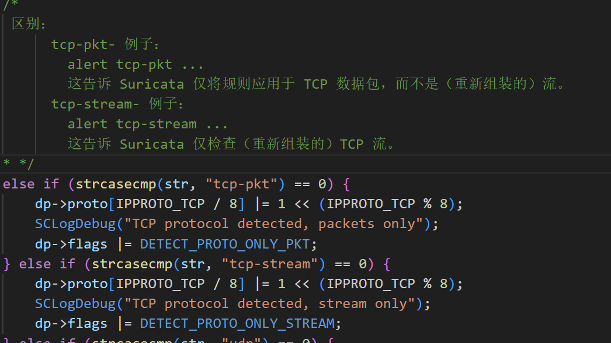
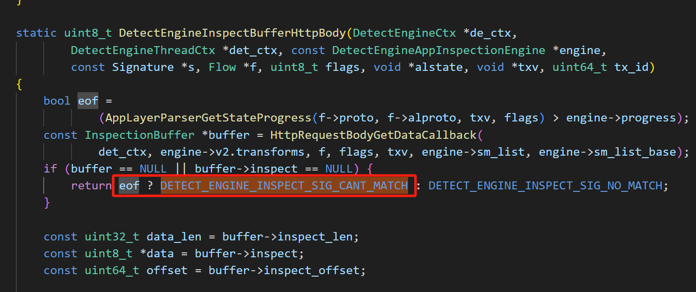
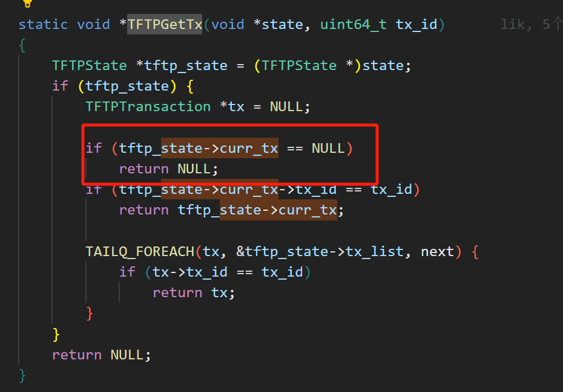

# suricata规则匹配源码梳理

## 一、规则关键字

### 1.1 多租户

```less
// suricata的检测支持multi-detect多用户检测
```


```less
DetectEngineMultiTenantLoadTenant
DetectEngineMultiTenantReloadTenant
DetectEngineReload

DetectEngineAddToMaster 用以处理建立多租户链表---->针对不同的租户可以配置不同的yaml文件并加载不同的规则


# 每个租户的de_ctx->config_prefix名称是不一样的，类似dpdk的file-prefix配置不同的用户使用于同一台机器。
```


### 1.2 规则动作阈值

```less
https://docs.suricata.io/en/suricata-5.0.3/configuration/global-thresholds.html?highlight=event_filter#threshold-event-filter

# 可以对指定的规则进行阈值限制，设置如下

#define TYPE_LIMIT     1 // 限制 ： 这种类型可以用来确保你不会被淹没， 如果告警设置为限制N，它最多警报N次。
#define TYPE_BOTH      2 // 限制+阈值：这种类型是“阈值”和“限制”类型的组合。它同时应用阈值和限制。
#define TYPE_THRESHOLD 3 // 阈值 ： 此类型可用于在规则生成警报之前为其设置最小阈值。阈值设置为N表示在规则第N次匹配时生成警报。
#define TYPE_DETECTION 4 // 检测 ： 默认的规则处理类型
#define TYPE_RATE      5 // 百分率 ： 速率过滤器允许在规则匹配时<达到阈值>更改规则操作。 可以配合跟踪模式<TRACK_BOTH>
#define TYPE_SUPPRESS  6 // 抑制  ： 抑制可用于抑制规则或主机/网络的警报。规则匹配时执行的操作（例如设置流位）仍会执行。

#define TRACK_DST      1
#define TRACK_SRC      2
#define TRACK_RULE     3 /* 适用符合阈值的全局规则 */
#define TRACK_EITHER   4 /* 源端口与目的端口都不匹配 < either src or dst: only used by suppress */
#define TRACK_BOTH     5 /* 源端口与目的端口都匹配 used by rate_filter to match detections by both src and dst addresses */

/* Get the new action to take */
#define TH_ACTION_ALERT     0x01
#define TH_ACTION_DROP      0x02
#define TH_ACTION_PASS      0x04
#define TH_ACTION_LOG       0x08
#define TH_ACTION_SDROP     0x10
#define TH_ACTION_REJECT    0x20

# 具体作用可以在配置说明中查看(或者：suricata\doc\userguide\rules\thresholding.rst)
```


### 1.3 匹配算法

参考：https://www.geeksforgeeks.org/aho-corasick-algorithm-pattern-searching/?ref=lbp

#### 1.3.1 AC匹配

```less
AC是对 Trie 树和 KMP 算法的一种扩展，结合了两者的优点，具有高效的匹配速度和低内存消耗。
AC 算法：
	AC 算法是一种多模式匹配算法，最初用于字符串匹配领域，后来也被应用于网络安全领域，如 IDS/IPS。
	AC 算法构建了一个用于匹配的有限状态自动机 (Finite State Automation, FSA)，并通过该自动机对输入文本进行遍历。
	AC 算法的核心思想是将模式集合构建成一个 Trie 树，并利用失败指针（Failure Link）和输出指针（Output Link）来优化匹配过程。
	AC 算法适用于需要同时匹配多个模式的场景，并且具有较好的性能。
========》
##	AC 算法通过构建 Trie 树（也称为字典树或前缀树），然后利用失败指针和输出指针来进行匹配。对于一个文本串 T 和模式集合 P={P1, P2, ..., Pn}，AC 算法的匹配逻辑可以概括为：
	1、构建 Trie 树，将模式集合 P 加入到 Trie 树中。
	2、对文本串 T 进行遍历，根据 Trie 树进行匹配，同时利用失败指针和输出指针来优化匹配过程。
```

##### 1.3.1.1 算法实例


```less
AC 自动机的实现主要包括以下几个关键步骤：
	1、构建 Trie 树：首先，将所有模式串构建成一个 Trie 树。Trie 树是一种树形数据结构，用于存储和检索字符串集合，它的每个节点表示一个字符，从根节点到任意一个节点的路径上的字符连接起来就构成了一个字符串。
	2、添加失败指针：在 Trie 树的基础上，为每个节点添加一个指向其失败节点（Fail Node）的指针。失败节点指的是，当前节点的最长后缀对应的节点，这个节点也能够匹配当前字符，但不包含与当前节点相同的前缀。这样做的目的是在匹配失败时，快速地转移到下一个可能匹配的位置，以减少不必要的回溯。
	3、构建输出指针：在 Trie 树的基础上，为每个节点添加一个指向其对应模式串的输出节点（Output Node）的指针。输出节点指的是，当前节点是某个模式串的最后一个字符节点时，指向该模式串的根节点。这个指针用于在匹配成功时输出匹配的模式串。
	4、使用 BFS 构建失败指针：利用广度优先搜索（BFS）算法遍历 Trie 树，依次为每个节点添加失败指针和输出指针。具体过程是从根节点开始，依次遍历每一层的节点，为每个节点添加失败指针和输出指针，直到遍历完整个 Trie 树。
	
匹配过程：在文本串中使用 AC 自动机进行匹配。从文本串的第一个字符开始，依次按照字符顺序遍历，根据当前字符和失败指针，沿着 Trie 树进行匹配。如果遇到匹配成功的情况，则输出匹配的模式串。

通过以上步骤，AC 自动机能够在给定的文本中高效地查找多个模式串的出现位置，并且具有较低的内存消耗。
```


```c++

// C++ program for implementation of Aho Corasick algorithm 
// for string matching 
using namespace std; 
#include <bits/stdc++.h> 
  
// Max number of states in the matching machine. 
// Should be equal to the sum of the length of all keywords. 
const int MAXS = 500; 
  
// Maximum number of characters in input alphabet 
const int MAXC = 26; 
  
// OUTPUT FUNCTION IS IMPLEMENTED USING out[] 
// Bit i in this mask is one if the word with index i 
// appears when the machine enters this state. 
int out[MAXS]; 
  
// FAILURE FUNCTION IS IMPLEMENTED USING f[] 
int f[MAXS]; 
  
// GOTO FUNCTION (OR TRIE) IS IMPLEMENTED USING g[][] 
int g[MAXS][MAXC]; 
  
// Builds the string matching machine. 
// arr -   array of words. The index of each keyword is important: 
//         "out[state] & (1 << i)" is > 0 if we just found word[i] 
//         in the text. 
// Returns the number of states that the built machine has. 
// States are numbered 0 up to the return value - 1, inclusive. 
int buildMatchingMachine(string arr[], int k) 
{ 
    // Initialize all values in output function as 0. 
    memset(out, 0, sizeof out); 
  
    // Initialize all values in goto function as -1. 
    memset(g, -1, sizeof g); 
  
    // Initially, we just have the 0 state 
    int states = 1; 
  
    // Construct values for goto function, i.e., fill g[][] 
    // This is same as building a Trie for arr[] 
    for (int i = 0; i < k; ++i) 
    { 
        const string &word = arr[i]; 
        int currentState = 0; 
  
        // Insert all characters of current word in arr[] 
        for (int j = 0; j < word.size(); ++j) 
        { 
            int ch = word[j] - 'a'; 
  
            // Allocate a new node (create a new state) if a 
            // node for ch doesn't exist. 
            if (g[currentState][ch] == -1) 
                g[currentState][ch] = states++; 
  
            currentState = g[currentState][ch]; 
        } 
  
        // Add current word in output function 
        out[currentState] |= (1 << i); 
    } 
  
    // For all characters which don't have an edge from 
    // root (or state 0) in Trie, add a goto edge to state 
    // 0 itself 
    for (int ch = 0; ch < MAXC; ++ch) 
        if (g[0][ch] == -1) 
            g[0][ch] = 0; 
  
    // Now, let's build the failure function 
  
    // Initialize values in fail function 
    memset(f, -1, sizeof f); 
  
    // Failure function is computed in breadth first order 
    // using a queue 
    queue<int> q; 
  
     // Iterate over every possible input 
    for (int ch = 0; ch < MAXC; ++ch) 
    { 
        // All nodes of depth 1 have failure function value 
        // as 0. For example, in above diagram we move to 0 
        // from states 1 and 3. 
        if (g[0][ch] != 0) 
        { 
            f[g[0][ch]] = 0; 
            q.push(g[0][ch]); 
        } 
    } 
  
    // Now queue has states 1 and 3 
    while (q.size()) 
    { 
        // Remove the front state from queue 
        int state = q.front(); 
        q.pop(); 
  
        // For the removed state, find failure function for 
        // all those characters for which goto function is 
        // not defined. 
        for (int ch = 0; ch <= MAXC; ++ch) 
        { 
            // If goto function is defined for character 'ch' 
            // and 'state' 
            if (g[state][ch] != -1) 
            { 
                // Find failure state of removed state 
                int failure = f[state]; 
  
                // Find the deepest node labeled by proper 
                // suffix of string from root to current 
                // state. 
                while (g[failure][ch] == -1) 
                      failure = f[failure]; 
  
                failure = g[failure][ch]; 
                f[g[state][ch]] = failure; 
  
                // Merge output values 
                out[g[state][ch]] |= out[failure]; 
  
                // Insert the next level node (of Trie) in Queue 
                q.push(g[state][ch]); 
            } 
        } 
    } 
  
    return states; 
} 
  
// Returns the next state the machine will transition to using goto 
// and failure functions. 
// currentState - The current state of the machine. Must be between 
//                0 and the number of states - 1, inclusive. 
// nextInput - The next character that enters into the machine. 
int findNextState(int currentState, char nextInput) 
{ 
    int answer = currentState; 
    int ch = nextInput - 'a'; 
  
    // If goto is not defined, use failure function 
    while (g[answer][ch] == -1) 
        answer = f[answer]; 
  
    return g[answer][ch]; 
} 
  
// This function finds all occurrences of all array words 
// in text. 
void searchWords(string arr[], int k, string text) 
{ 
    // Preprocess patterns. 
    // Build machine with goto, failure and output functions 
    buildMatchingMachine(arr, k); 
  
    // Initialize current state 
    int currentState = 0; 
  
    // Traverse the text through the built machine to find 
    // all occurrences of words in arr[] 
    for (int i = 0; i < text.size(); ++i) 
    { 
        currentState = findNextState(currentState, text[i]); 
  
        // If match not found, move to next state 
        if (out[currentState] == 0) 
             continue; 
  
        // Match found, print all matching words of arr[] 
        // using output function. 
        for (int j = 0; j < k; ++j) 
        { 
            if (out[currentState] & (1 << j)) 
            { 
                cout << "Word " << arr[j] << " appears from "
                     << i - arr[j].size() + 1 << " to " << i << endl; 
            } 
        } 
    } 
} 
  
// Driver program to test above 
int main() 
{ 
    string arr[] = {"he", "she", "hers", "his"}; 
    string text = "ahishers"; 
    int k = sizeof(arr)/sizeof(arr[0]); 
  
    searchWords(arr, k, text); 
  
    return 0; 
} 
```


#### 1.3.2 BM匹配

参考：https://www.geeksforgeeks.org/boyer-moore-algorithm-for-pattern-searching/


```less
BM 算法：
	BM 算法是一种单模式匹配算法，用于在文本串中查找给定模式串的位置。
	BM 算法通过预处理模式串来加速匹配过程，利用好后缀规则和坏字符规则来尽可能跳过不必要的比较。	
	BM 算法在处理大文本串和小模式串的情况下具有较好的性能，尤其适用于处理较短的模式串。
========》
##  BM 算法利用坏字符规则和好后缀规则来进行匹配。对于一个文本串 T 和模式串 P，BM 算法的匹配逻辑可以概括为：
	1、预处理模式串 P，计算坏字符表和好后缀表。
	2、从文本串 T 的末尾开始，将模式串 P 与文本串 T 进行匹配，利用坏字符规则和好后缀规则来尽可能快速地移动模式串。
```

##### 1.3.3.1 匹配逻辑实例


```less
/* C Program for Bad Character Heuristic of Boyer
   Moore String Matching Algorithm */
#include <limits.h>
#include <stdio.h>
#include <string.h>
 
#define NO_OF_CHARS 256
 
// A utility function to get maximum of two integers
int max(int a, int b) { return (a > b) ? a : b; }
 
// The preprocessing function for Boyer Moore's
// bad character heuristic
void badCharHeuristic(char* str, int size,
                      int badchar[NO_OF_CHARS])
{
    int i;
 
    // Initialize all occurrences as -1
    for (i = 0; i < NO_OF_CHARS; i++)
        badchar[i] = -1;
 
    // Fill the actual value of last occurrence
    // of a character
    for (i = 0; i < size; i++)
        badchar[(int)str[i]] = i;
}
 
/* A pattern searching function that uses Bad
   Character Heuristic of Boyer Moore Algorithm */
void search(char* txt, char* pat)
{
    int m = strlen(pat);
    int n = strlen(txt);
 
    int badchar[NO_OF_CHARS];
 
    /* Fill the bad character array by calling
       the preprocessing function badCharHeuristic()
       for given pattern */
    badCharHeuristic(pat, m, badchar);
 
    int s = 0; // s is shift of the pattern with
               // respect to text
    while (s <= (n - m)) {
        int j = m - 1;
 
        /* Keep reducing index j of pattern while
           characters of pattern and text are
           matching at this shift s */
        while (j >= 0 && pat[j] == txt[s + j])
            j--;
 
        /* If the pattern is present at current
           shift, then index j will become -1 after
           the above loop */
        if (j < 0) {
            printf("\n pattern occurs at shift = %d", s);
 
            /* Shift the pattern so that the next
               character in text aligns with the last
               occurrence of it in pattern.
               The condition s+m < n is necessary for
               the case when pattern occurs at the end
               of text */
            s += (s + m < n) ? m - badchar[txt[s + m]] : 1;
        }
 
        else
            /* Shift the pattern so that the bad character
               in text aligns with the last occurrence of
               it in pattern. The max function is used to
               make sure that we get a positive shift.
               We may get a negative shift if the last
               occurrence  of bad character in pattern
               is on the right side of the current
               character. */
            s += max(1, j - badchar[txt[s + j]]);
    }
}
 
/* Driver program to test above function */
int main()
{
    char txt[] = "ABAAABCD";
    char pat[] = "ABC";
    search(txt, pat);
    return 0;
}
```


##### 1.3.3.2 自我校验

以下的匹配方法，是我自己所想，与上面的实际bc匹配算法是不一样的

```less
1、建立T各个字符位置的从左到右链表 list_t ；
      例如第一个实例中：	A： 0-7
					 S： 2-4-10-12-15

2、对p进行匹配，匹配时从p的从右到左（Len_p为p的长度）
		初始化： 设置pos（目前 T 正在进行匹配的位置）
		如果p[Len_p - i]匹配,则左移判断；如果最后全部匹配命中，则左移Len_p，开始查找下一处可以匹配的位置（利用list_t）；
				==> list_t 中获取 p[Len_p - i] 字符下一次 T 中位置（利用 pos 比较 list_t 中所记录偏移大小，出现第一次 list_t 大于 pos 时即是。）
		如果p[Len_p - i]不匹配，则开始查找下一次与p[Len_p - i]所匹配的T[j]位置，并将p[Len_p - i]与之相对应，然后开始重新走2的匹配逻辑；

3、直到匹配至（len_t - len_p）结束。
```


#### 1.3.3 Hyperscan匹配

```less
Hyperscan：
	Hyperscan 是一种高性能的多模式匹配引擎，旨在提供高吞吐量和低延迟的匹配性能。
	Hyperscan 结合了 AC 算法的多模式匹配思想和硬件加速的技术，通过利用 SIMD（Single Instruction, Multiple Data）指令集和多核处理器来加速匹配过程。
	Hyperscan 支持大规模的模式集合，并能够实现高效的并行匹配，因此在需要处理大量模式的场景下性能突出。
========》
## Hyperscan 结合了 AC 算法的多模式匹配思想和硬件加速技术，通过 SIMD 指令集和多核处理器来加速匹配过程。它的核心思想是将多模式匹配并行化，利用硬件的并行性能来提高匹配效率。
```

##### 1.3.3.1 核心实现

```less
Hyperscan 是一种高性能多模式匹配库，主要用于在大规模数据流中快速匹配多个模式。它的核心算法结合了各种优化技术，包括预过滤、并行处理和硬件加速等。这里简要介绍一下 Hyperscan 的核心算法实现：
	1、预处理：Hyperscan 的核心算法首先对模式进行预处理，以构建一个高效的数据结构用于匹配。这个过程主要包括构建匹配表（matching table）和状态图（state graph）。
	2、匹配表（Matching Table）：匹配表是一种数据结构，用于快速定位输入数据中潜在的匹配点。它可以根据模式的特征构建，以加速匹配过程。
	3、状态图（State Graph）：状态图表示了模式之间的关系以及匹配的可能路径。Hyperscan 使用状态图来确定每个字符的可能匹配位置，并且通过状态转移来更新匹配状态。
	4、状态机：在匹配过程中，Hyperscan 使用状态机来跟踪当前匹配的状态。状态机可以高效地处理多个模式之间的交叉匹配，并且支持快速的状态转移。
	5、预过滤（Pre-filtering）：Hyperscan 使用预过滤技术来减少需要精确匹配的字符数量。预过滤可以根据模式的特征快速排除大部分不可能匹配的位置，从而减少了匹配的复杂度。
	6、并行处理：为了进一步提高性能，Hyperscan 还支持并行处理技术。它可以将输入数据划分为多个块，并行处理每个块以加速匹配过程。
	7、硬件加速：某些版本的 Hyperscan 还支持硬件加速技术，例如利用 SIMD 指令集来加速匹配过程。这些技术可以在特定的硬件平台上进一步提高匹配性能。
```


#### 1.3.4 总结Compare

```less
	AC 算法（Aho-Corasick）、BM 算法（Boyer-Moore）和 Hyperscan 是三种不同的字符串匹配算法，它们在设计理念、匹配效率、适用场景等方面有一些区别。
	AC 算法适用于多模式匹配场景，BM 算法适用于单模式匹配场景，而 Hyperscan 则是一种高性能的多模式匹配引擎，通过结合 AC 算法和硬件加速技术来提供卓越的匹配性能。
```

无论怎么匹配：ac、bm、hs如何选择，hs始终是最快的，就是对于内存的需求度更高。


## 二、规则文件读取解析

### 2.0 规则处理总体逻辑

#### 2.0.1 SigLoadSignatures

```less
PostConfLoadedDetectSetup // suricata.c
LoadSignatures
SigLoadSignatures
	1、ProcessSigFiles  // 处理规则文件读取规则
	2、SCSigOrderSignatures // 规则排序
 	3、SigGroupBuild // 规则分组
```

#### 2.0.2 SigGroupBuild

```less
SigGroupBuild
{
	Signature *s = de_ctx->sig_list;
    de_ctx->signum = 0;
    // 重新设置规则的对应序号num
    while (s != NULL) {
        s->num = de_ctx->signum++;
        s = s->next;
    }

    if (DetectSetFastPatternAndItsId(de_ctx) < 0)
        return -1;

    SigInitStandardMpmFactoryContexts(de_ctx);

    if (SigAddressPrepareStage1(de_ctx) != 0) {
        FatalError("initializing the detection engine failed");
    }

    if (SigAddressPrepareStage2(de_ctx) != 0) {
        FatalError("initializing the detection engine failed");
    }

    if (SigAddressPrepareStage3(de_ctx) != 0) {
        FatalError("initializing the detection engine failed");
    }
    if (SigAddressPrepareStage4(de_ctx) != 0) {
        FatalError("initializing the detection engine failed");
    }

    int r = DetectMpmPrepareBuiltinMpms(de_ctx);
    r |= DetectMpmPrepareAppMpms(de_ctx);
    r |= DetectMpmPreparePktMpms(de_ctx);
    r |= DetectMpmPrepareFrameMpms(de_ctx);
    if (r != 0) {
        FatalError("initializing the detection engine failed");
    }

    if (SigMatchPrepare(de_ctx) != 0) {
        FatalError("initializing the detection engine failed");
    }

#ifdef PROFILING
    SCProfilingKeywordInitCounters(de_ctx);
    SCProfilingPrefilterInitCounters(de_ctx);
    de_ctx->profile_match_logging_threshold = UINT_MAX; // disabled

    intmax_t v = 0;
    if (ConfGetInt("detect.profiling.inspect-logging-threshold", &v) == 1)
        de_ctx->profile_match_logging_threshold = (uint32_t)v;
#endif
#ifdef PROFILE_RULES
    SCProfilingRuleInitCounters(de_ctx);
#endif

    ThresholdHashAllocate(de_ctx);

    if (!DetectEngineMultiTenantEnabled()) {
        VarNameStoreActivate();
    }
    return 0;

}
```

#### 2.0.3 sig_list 添加

```less
//  DetectEngineAppendSig
// 为新规则创建sig
	Signature *sig = SigInit(de_ctx, sigstr);

// 将sig插入list头部
	if (sig->init_data->init_flags & SIG_FLAG_INIT_BIDIREC) {
        if (sig->next != NULL) {
            sig->next->next = de_ctx->sig_list;
        } else {
            goto error;
        }
    } else {
        /* if this sig is the first one, sig_list should be null */
        sig->next = de_ctx->sig_list;
    }

    de_ctx->sig_list = sig;
```

#### 2.0.4 de_ctx->sig_list->init_data增加

##### 2.0.4.1 init_data作用

```less
// SignatureInitData 结构体
{
    ……
    SignatureInitDataBuffer *buffers;
    uint32_t buffer_index; // 记录buffers目前存储的index位置
    uint32_t buffers_size; // 记录buffers大小
    SignatureInitDataBuffer *curbuf; // 指向当前的buffers元素
    ……
}

```

**1、de_ctx->sig_list，其存储的是从规则文件中所读取的全部规则。**

**2、每条规则s里面都是由各种：规则字段 + 规则匹配数据 的形式拼凑的，所以SignatureInitDataBuffer其实就是用来存储拆分以后的规则key-value数据**


##### 2.0.4.2 SignatureInitData 初始化

```less
SigParse
{
    do {
            memset(output, 0x00, buffer_size);
            ret = SigParseOptions(de_ctx, s, input, output, buffer_size);
            if (ret == 1) {
                memcpy(input, output, buffer_size);
            }
        } while (ret == 1);
}

// SigParseOptions开始处理每个规则的具体参数选项
SigParseOptions
{
    SigTableElmt *st = NULL;
    // 根据规则字段获取元素SigTableElmt，对应我们在 detect*.c 类文件中注册的规则关键字。
    st = SigTableGet(optname); // optname 记录了规则中的字段名称
	
    // 执行其中的Setup回调函数
    setup_ret = st->Setup(de_ctx, s, ptr);
}


// Setup回调函数，以DetectSslCliCertHashesSetup为例：
DetectBufferSetActiveList(de_ctx, s, g_cli_cert_hash) // g_cli_cert_hash 就是协议字段注册是，所确定的list序号，可以在 DetectAppLayerInspectEngineRegister2 中加入打印查看如下：
```


```less
// 之后会对该条规则的字段进行标识：curbuf->id
/* initialize new buffer */
    s->init_data->curbuf = &s->init_data->buffers[s->init_data->buffer_index++]; // 指向最新的buffers元素
    s->init_data->curbuf->id = list; // 记录该字段所对应的list序号。方便后续进行匹配命中
    s->init_data->curbuf->head = NULL;
    s->init_data->curbuf->tail = NULL;
	// 是否支持”多实例“匹配，就是：一个字段，可以匹配多个协议（多种匹配函数）。
    s->init_data->curbuf->multi_capable = DetectEngineBufferTypeSupportsMultiInstanceGetById(de_ctx, list);
```

**通过上述的逻辑，suricata会while逐步处理一条规则的各个key，然后将其存储于buffers下。以供后续选取字段对应的匹配函数以及方法。**

**注意：上面的list序号（也就是sm_list），是唯一的，是通过HASH计算的，具体可以自行查看代码。**

##### 2.0.4.3 buffer_index增加

```less
// detect*.c 中调用

## 第一种：INT数字类型检测
	// 例如：sigmatch_table[DETECT_TLS_CIPHERSUITS_CNT].Setup
SigMatchAppendSMToList{
	//    主要用于创建smlists[x]; 
    if (list < DETECT_SM_LIST_MAX) {
        if (s->init_data->smlists[list] == NULL) {
            s->init_data->smlists[list] = new;
            s->init_data->smlists_tail[list] = new;
            new->next = NULL;
            new->prev = NULL;
        } else {
            SigMatch *cur = s->init_data->smlists_tail[list];
            cur->next = new;
            new->prev = cur;
            new->next = NULL;
            s->init_data->smlists_tail[list] = new;
        }
        new->idx = s->init_data->sm_cnt;
        s->init_data->sm_cnt++;

    } else {
    	处理用户自定义添加的 DetectSigmatchListEnum 类型。// 出现 buffer_index++;
        // DetectAppLayerEventSetup ---> SigMatchAppendSMToList(s, sm, g_applayer_events_list_id);
}
```


```less
## 第二种：STR字符串类检测
	// 例如：DetectSslCliCertHashesSetup  
	DetectBufferSetActiveList  //具体可以查看上面的2.0.4.2

## 第三种：DetectBufferGetActiveList 
	争对特殊字段，用以获取init_data->buffers；自然需要分配空的返回。

## 第四种：DetectEngineContentModifierBufferSetup
	http/filename/tls等需要进行特殊设置

// 虽然有四种，但都是一个原理：往 s->init_data->buffers 中追加相关的buffer设置。
```

```elixir
### 注意：
buffer_index 是用来标记规则签名当前解析存储的元素深度，默认SigAlloc {buffers_size = 8} 
 	但是可以 relloc  --> SignatureInitDataBufferCheckExpand 函数会每次扩充8个buffers，最大只能是64，也就是说，一条规则的最大存储元素是64个。
```

##### 2.0.4.4 SigMatchPrepare函数

```less
SigMatchPrepare
	for (; s != NULL; s = s->next) {
        /* set up inspect engines */
        // 看名字 AppInspectionEngine2 对应的就是后续需要讲的 DetectAppLayerInspectEngineRegister2
        DetectEngineAppInspectionEngine2Signature(de_ctx, s);
	}
```

##### 2.0.4.5 DetectEngineAppInspectionEngine2Signature函数

<span style="color:orange"> app_inspect_engines是我们所注册的app类型规则字段； </span>

###### HEX：设计理念

​	1、 在此之前已经注册了相关的规则字段、以及与之相对应的匹配函数--->**app_inspect_engines**。

​	2、此刻，我们开始进行具体的规则解析，并且轮询规则的各个字段；

​	3、根据具体的规则字段，判断其匹配类型:frame_inspect_engines、pkt_inspect_engines、app_inspect_engines；

​	4、在具体的匹配类型下(以app_inspect_engines为例)：开始轮询现有的注册字段链表**app_inspect_engines**，查询与我们规则字段相对应的检测引擎。

​	5、将查询到的检测引擎的相关信息(匹配协议、方向、匹配函数)以及对应规则中的buffer数据(int/str)，填充并插入该规则s对应的匹配链表：s->**app_inspect**

​	6、之后我们就可以在进行具体规则匹配时，进行 app_inspect、pkt_inspect、frame_inspect 对应匹配函数的调用，并以此判断规则是否命中。

```less

// 将我们的规则 s 传入
DetectEngineAppInspectionEngine2Signature(de_ctx, s);
// 根据上面 2.0.4.2 + 2.0.4.3 可以查看buffer_index的作用。
// 开始循环规则 s 中的各个“字段ID”
	for (uint32_t x = 0; x < s->init_data->buffer_index; x++) {
        SigMatchData *smd = SigMatchList2DataArray(s->init_data->buffers[x].head);
        SCLogDebug("smd %p, id %u", smd, s->init_data->buffers[x].id);

        const DetectBufferType *b =
                DetectEngineBufferTypeGetById(de_ctx, s->init_data->buffers[x].id);
        if (b == NULL)
            FatalError("unknown buffer");

        if (b->frame) { // frame 类的注册检测
        } else if (b->packet) { // packet 类的注册检测
        } else {
            // app_inspect_engines 可以查看 <2.d> + <3.4.1> 中描述
            // app_inspect_engines其实就是，注册的各个app类检测规则字段链表。
            for (const DetectEngineAppInspectionEngine *t = de_ctx->app_inspect_engines; t != NULL; t = t->next) {
                // 如果该条规则中id（2.0.4.2） 与 app类检测字段链表中的元素序号相同
                // 就表明，该条规则存在这个字段检测，将对应的字段“相关检测、匹配、回调函数”等信息，加入到规则s的匹配链表中
                if (t->sm_list == s->init_data->buffers[x].id) {
                    /*
                     其中t存储了：协议类型、检测方向、规则字段的list序号、处理状态progress、匹配函数v2等。
                         smd存储了：规则实际需要匹配的数据buffer。
                    	 根据 <t的相关信息 + smd> 开始填充 s->app_inspect 检测相关信息。
                    */
                    AppendAppInspectEngine(de_ctx, t, s, smd, mpm_list, files_id, &last_id, &head_is_mpm);
                }
            } // for
        }
    }
```

##### 2.0.4.6 AppendAppInspectEngine

```less
	// 新建并填充一个”字段匹配引擎”，以供后续解包匹配时调用
	DetectEngineAppInspectionEngine *new_engine =
            SCCalloc(1, sizeof(DetectEngineAppInspectionEngine));
	new_engine->alproto = t->alproto;
	new_engine->dir = t->dir;
	new_engine->sm_list = t->sm_list;
	new_engine->sm_list_base = t->sm_list_base;
	new_engine->smd = smd;
	new_engine->progress = t->progress;
	new_engine->v2 = t->v2;
	
	// 将“新的字段匹配引擎”插入s->app_inspect检测链表中
	DetectEngineAppInspectionEngine *a = s->app_inspect;
	while (a->next != NULL) {
		if (a->next && a->next->progress > new_engine->progress) {
        	break;
         }
         a = a->next;
    }
	new_engine->next = a->next;
	a->next = new_engine;
```

##### 2.0.4.7 总结

```apl
1、规则字段注册，根据类型构建 frame packet app 三类匹配层次字段，并存于各自 list 中；
2、解析规则，规则文件读取并解析规则字段，while()
	 根据单个字段的名称，标记对应的list_id(id = list);
3、开始为规则设定匹配检测函数；
	 利用id号来判断该规则是否需要该检测字段的“匹配引擎”，需要，则加入对应规则的s->app_inspect之中。
4、预过滤处理(DetectRunTx)，获取满足大致要求的规则；
4、规则开始逐步轮询s->app_inspect，进行匹配处理。 ## DetectRunTxInspectRule
```


### 2.1 规则检测文柄 de_ctx 匹配初始化

#### 2.1.1 检测引擎句柄 de_ctx 的初始化、抉择

```less
PostConfLoadedDetectSetup // suricata.c
LoadSignatures
	   DetectEngineCtx *de_ctx = NULL;
	   if (suri->delayed_detect && suri->run_mode != RUNMODE_CONF_TEST) {
            de_ctx = DetectEngineCtxInitStubForDD();
        } else if (mt_enabled && !default_tenant && suri->run_mode != RUNMODE_CONF_TEST) {
            de_ctx = DetectEngineCtxInitStubForMT();
        } else {
            de_ctx = DetectEngineCtxInit();
        }
# de_ctx是规则匹配贯穿全文的结构体，我们可以先看该结构体的设置处理：// DetectEngineCtxInitReal 进行初始化
```


这些标识代表 Suricata 引擎的不同类型，即检测引擎类型。它们的区别主要在于引擎的工作方式和特性：

1. **DETECT_ENGINE_TYPE_DD_STUB**:
    - DD 代表 "Direct Detect"。
    - 这种引擎类型在 Suricata 中主要用于基于单个线程的检测。
    - 它是最基本的引擎类型，适用于低负载环境或需要最小资源消耗的情况。
2. **DETECT_ENGINE_TYPE_NORMAL**:
    - 这是默认的引擎类型。
    - 它支持基本的多线程检测，并且可以根据系统的 CPU 核心数进行相应的优化。
    - NORMAL 引擎类型提供了一种平衡的检测方式，适用于大多数环境。
3. **DETECT_ENGINE_TYPE_MT_STUB**:
    - MT 代表 "Multi-threaded"。
    - 这种引擎类型是专门为多核心系统设计的。
    - 它支持更高级的多线程检测，可以充分利用多核处理器的优势，提高检测性能。

总的来说，这些引擎类型提供了不同级别的性能和功能，用户可以根据实际需求选择合适的引擎类型。如果是简单的低负载环境，可以选择 DD_STUB；对于普通环境，使用 NORMAL 就足够了；而对于高负载、多核心系统，则可以选择 MT_STUB 来获得更好的性能。


#### 2.1.2 DetectEngineCtxInitReal 初始化函数

<span style="color: yellow;">用以初始化 DetectEngineCtx *de_ctx = SCMalloc(sizeof(DetectEngineCtx)) 结构体。</span>  

```elixir
// 分析上述 DetectEngineCtxInitReal 函数:
DetectEngineCtxInitReal
{
    // 在2.5中 buffer_type_id 的增加即是在此基础上进行的增加
    DetectBufferTypeSetupDetectEngine // 初始化粘性数据的多模匹配类型id为 g_buffer_type_id = DETECT_SM_LIST_MAX；
    
	// 初始化函数中有两个关键函数：
	# 获取yaml配置文件中多模匹配类型：PatternMatchDefaultMatcher  mpm-algo：ac-ks hs auto<有hs则用，无则用ac-ks AC模式>
	# 获取yaml配置文件中单模匹配类型：SinglePatternMatchDefaultMatcher  spm-algo：auto<有hs则用，无则用Boyer-Moore BM模式>

	SigGroupHeadHashInit 	   == de_ctx->sgh_hash_table 初始化
	MpmStoreInit 			  == de_ctx->mpm_hash_table 初始化
	DetectParseDupSigHashInit  == de_ctx->dup_sig_hash_table 初始化 //判断是否为重复规则的func 在：DetectEngineSignatureIsDuplicate(de_ctx, sig);中使用
	DetectAddressMapInit       == de_ctx->address_table 初始化 // 规则中ip地址的初始化 
	DetectMetadataHashInit	   == de_ctx->metadata_table 初始化 // 规则中协议元数据地址的初始化
	
    # 检测引擎初始化、相关数据转换函数
    DetectBufferTypeSetupDetectEngine(de_ctx);
	/* 其中的 g_buffer_type_hash 是suricata所注册的各个规则关键字名称：例如：
		g_tls_generic_list_id = DetectBufferTypeRegister("tls_generic"); */

	// 支持快速匹配的链表：g_fp_support_smlist_list，其由SupportFastPatternForSigMatchList添加
	DetectEngineInitializeFastPatternList ==  de_ctx->fp_support_smlist_list数据插入：将 g_fp_support_smlist_list 元素插入
}
```

##### 2.1.2.1 DetectBufferTypeSetupDetectEngine 各类检测引擎的初始化函数

###### 2.a g_buffer_type_hash转换

可以查看**2.1.3.1与2.1.3.2**
```apl
HashListTableAdd(de_ctx->buffer_type_hash_name, (void *)copy, 0);
HashListTableAdd(de_ctx->buffer_type_hash_id, (void *)copy, 0);
```

###### 2.b Prefilter预过滤初始化

```elixir
PrefilterInit(de_ctx);
```

###### 2.c app_mpms_list初始化

```elixir
DetectMpmInitializeAppMpms(de_ctx);
```

###### 2.d app_inspect_engines初始化

```elixir
DetectAppLayerInspectEngineCopyListToDetectCtx(de_ctx);
```

###### 2.e frame_mpms_list初始化

```elixir
DetectMpmInitializeFrameMpms(de_ctx);
```

###### 2.f frame_inspect_engines初始化

```elixir
DetectFrameInspectEngineCopyListToDetectCtx(de_ctx);
```

###### 2.g pkt_mpms_list初始化

```elixir
DetectMpmInitializePktMpms(de_ctx);
```

###### 2.h g_pkt_inspect_engines初始化

```elixir
DetectPktInspectEngineCopyListToDetectCtx(de_ctx);
```


#### 2.1.3 粘性数据(字符串类规则字段合并管理)

**粘性数据：在Suricata中，"sticky buffers"（粘性缓冲区）是一种用于存储有关连接或会话状态的信息的机制。这些缓冲区允许Suricata在处理网络流量时跟踪连接的状态，并在一系列数据包之间共享信息。**

**粘性缓冲区通常用于处理涉及多个数据包的协议，例如HTTP或DNS。它们可以用来存储与连接相关的参数，如客户端IP地址、服务器IP地址、端口号、会话ID等。通过将这些信息存储在粘性缓冲区中，Suricata可以在后续的数据包中使用它们进行规则匹配、流量分析或其他操作。**

**这种机制使得Suricata能够更好地理解和处理网络流量，并执行基于连接状态的规则匹配和分析。粘性缓冲区有助于Suricata实现更精细的流量监控和分析，从而提高了其检测和响应能力。**

##### 2.1.3.1 DetectBufferTypeAdd

```less
// suricata全局初始化
static HashListTable *g_buffer_type_hash = NULL;
static int g_buffer_type_id = DETECT_SM_LIST_DYNAMIC_START;
static int g_buffer_type_reg_closed = 0;

// 以 g_krb5_msg_type_list_id = DetectBufferTypeRegister("krb5_msg_type"); 为例
DetectBufferTypeRegister
	DetectBufferTypeAdd
	{
        // 申请一个新的DetectBufferType
        DetectBufferType *map = SCCalloc(1, sizeof(*map)); 
        // 拷贝所设置的匹配字段
    	strlcpy(map->name, string, sizeof(map->name));
        // 增量记录id
    	map->id = g_buffer_type_id++;
        // 将需要进行检测处理字段加入g_buffer_type_hash表中
	    HashListTableAdd(g_buffer_type_hash, (void *)map, 0)
	}
```

**注意：此时的相关规则字段信息是加入到 g_buffer_type_hash 表中**


##### 2.1.3.2 转换g_buffer_type_hash存入de_ctx

<span style="color: orange;">g_buffer_type_hash用以存储我们注册的各类规则关键字。</span>  

**注意：1、此时的g_buffer_type_id，是经过了众多需要进行buf类规则检测的注册累加处理。**

   	    **2、开始进行hash表的存储转换-->de_ctx**

```less
DetectBufferTypeSetupDetectEngine // 初始化粘性数据的多模匹配类型id为 g_buffer_type_id = DETECT_SM_LIST_MAX；
	    de_ctx->buffer_type_id = g_buffer_type_id;
    	de_ctx->buffer_type_hash_name = HashListTableInit(256, DetectBufferTypeHashNameFunc,
            DetectBufferTypeCompareNameFunc, DetectBufferTypeFreeFunc);
    	de_ctx->buffer_type_hash_id =
            HashListTableInit(256, DetectBufferTypeHashIdFunc, DetectBufferTypeCompareIdFunc, NULL); 
    	de_ctx->buffer_type_id = g_buffer_type_id; // 将buffer_type_id类型置为g_buffer_type_id
		
		// g_buffer_type_hash ---> de_ctx->buffer_type_hash_name / de_ctx->buffer_type_hash_id
		// 开始将自行注册的粘性数据类字段，加入到de_ctx下
		HashListTableBucket *b = HashListTableGetListHead(g_buffer_type_hash);
    	while (b) {
        	DetectBufferType *map = HashListTableGetListData(b);
       		DetectBufferType *copy = SCCalloc(1, sizeof(*copy));
        	memcpy(copy, map, sizeof(*copy));
        	int r = HashListTableAdd(de_ctx->buffer_type_hash_name, (void *)copy, 0);
        	r = HashListTableAdd(de_ctx->buffer_type_hash_id, (void *)copy, 0);

	        b = HashListTableGetListNext(b);
        }
```


##### 2.1.3.3 buffer_type_id持续增加

**对于buf检测，除去我们自己注册的字段，suricata还存在其原本的一些字段，这些也需要一起合并起来**

```less
// 2.1.2.2中将 buffer_type_id 初始化为g_buffer_type_id

// 此函数设置规则中使用的粘性缓冲区，用于检查应用层帧的粘性缓冲区数据。
// 针对关键字 ‘frame’
/*
以SMB解析器为例，在框架支持之前，规则如下所示：
	alert tcp ... flow:to_server; content:"|ff|SMB"; content:"some smb 1 issue";
通过frame支持，可以做到：
	alert smb ... flow:to_server; frame:smb1.data; content:"some smb 1 issue";
*/
detect\detect-frame.c
	DetectFrameSetup
		DetectEngineBufferTypeRegisterWithFrameEngines
			DetectEngineBufferTypeAdd
				map->id = de_ctx->buffer_type_id++;
				HashListTableAdd(de_ctx->buffer_type_hash_name, (void *)map, 0)
				HashListTableAdd(de_ctx->buffer_type_hash_id, (void *)map, 0)


// 针对关键字：bsize、byte_jump、byte_math、byte_test、content、datarep、dataset、lua、pcre
// 都是可用于对粘性缓冲区数据进行的设置操作。
detect\detect-bsize.c
	if (DetectBufferGetActiveList(de_ctx, s) == -1)
detect\detect-bytejump.c
	if (DetectBufferGetActiveList(de_ctx, s) == -1)
detect\detect-bytemath.c
	if (DetectBufferGetActiveList(de_ctx, s) == -1)
detect\detect-bytetest.c
	if (DetectBufferGetActiveList(de_ctx, s) == -1)
detect\detect-content.c
	if (DetectBufferGetActiveList(de_ctx, s) == -1)
detect\detect-datarep.c
	if (DetectBufferGetActiveList(de_ctx, s) == -1) {
detect\detect-dataset.c
	if (DetectBufferGetActiveList(de_ctx, s) == -1) {
detect\detect-isdataat.c
	if (DetectBufferGetActiveList(de_ctx, s) == -1)
detect\detect-lua.c
	if (DetectBufferGetActiveList(de_ctx, s) != -1) {
detect\detect-pcre.c
	if (DetectBufferGetActiveList(de_ctx, s) == -1)
		|
		|
        DetectBufferGetActiveList
        	DetectEngineBufferTypeGetByIdTransforms
        		map->id = de_ctx->buffer_type_id++;
        		HashListTableAdd(de_ctx->buffer_type_hash_name, (void *)map, 0)
        		HashListTableAdd(de_ctx->buffer_type_hash_id, (void *)map, 0)


以上两个函数都会致使：de_ctx->buffer_type_id++;
```

**至此：de_ctx->buffer_type_hash_name 与 de_ctx->buffer_type_hash_id 初始化填充完毕。统一管理存储，以防止产生重复，有利于校验、统计。这样，每个规则字段的 sm_list 都是单独的。**

##### 2.1.3.4 g_buffer_type_id 增加(全局)

g_buffer_type_id 与 buffer_type_id 不同在于，buffer_type_id 是每个单独de_ctx检测句柄，所存储得buffer类检测计数(id)；而 g_buffer_type_id即是globel的意思，他是存储全局buff检测字段的计数(id)，在全局性来讲，是唯一的。

```less
enum DetectSigmatchListEnum {
    /* list for non-payload per packet matches, e.g. ttl, flow keyword */
    DETECT_SM_LIST_MATCH = 0,
    /* list for payload and stream match */
    DETECT_SM_LIST_PMATCH,

    /* base64_data keyword uses some hardcoded logic so consider
     * built-in
     * TODO convert to inspect engine */
    DETECT_SM_LIST_BASE64_DATA,

    /* list for post match actions: flowbit set, flowint increment, etc */
    DETECT_SM_LIST_POSTMATCH,

    DETECT_SM_LIST_TMATCH, /**< post-detection tagging */

    /* lists for alert thresholding and suppression */
    DETECT_SM_LIST_SUPPRESS,
    DETECT_SM_LIST_THRESHOLD,

    DETECT_SM_LIST_MAX,

    /* start of dynamically registered lists */
    DETECT_SM_LIST_DYNAMIC_START = DETECT_SM_LIST_MAX,---------------------
};																	|			
static int g_buffer_type_id = DETECT_SM_LIST_DYNAMIC_START; <--------------

// 每注册一个新的buff类检测字段，则g_buffer_type_id类型加1.
DetectBufferTypeRegister
	DetectBufferTypeAdd
		map->id = g_buffer_type_id++;
```


### 2.2  规则解析加载至de_ctx->sig_list

```less
// 将规则处理后，加入到 de_ctx->sig_list 链表中

      TAILQ_FOREACH(file, &rule_files->head, next) {
      	ProcessSigFiles  
          1、DetectEngineAppendSig // 成功规则---> DetectEngineAppendSig()
          		// 规则初始解析
			   Signature *sig = SigInit(de_ctx, sigstr); 
          		存于：从头部插入元素：
                      sig->next = de_ctx->sig_list;
                      de_ctx->sig_list = sig;
          2、SigStringAppend // 失败规则---> SigStringAddSig
          		存于： AILQ_INSERT_TAIL(&sig_stats->failed_sigs, item, next);
      }

```


#### 2.2.1 规则字段的详细解析SigInit

```less
SigInit
	SigInitHelper
		int ret = SigParse(de_ctx, sig, sigstr, dir, &parser);
			int ret = SigParseBasics(de_ctx, s, sigstr, parser, addrs_direction);
				/* Action. */
   				 SigParseToken(&index, parser->action, sizeof(parser->action));
    			/* Protocol. */
   				 SigParseList(&index, parser->protocol, sizeof(parser->protocol));
    			/* Source. */
   				 SigParseList(&index, parser->src, sizeof(parser->src));
    			/* Source port(s). */
   				 SigParseList(&index, parser->sp, sizeof(parser->sp));
    			/* Direction. */
   				 SigParseToken(&index, parser->direction, sizeof(parser->direction));
    			/* Destination. */
   				 SigParseList(&index, parser->dst, sizeof(parser->dst));
    			/* Destination port(s). */
   				 SigParseList(&index, parser->dp, sizeof(parser->dp));
    			/* Options. */
    			………………
    			/* Parse Action */
   				 if (SigParseAction(s, parser->action) < 0)
        			goto error;
   				 if (SigParseProto(s, parser->protocol) < 0) // 参看下面截图 解析规则所指定的协议。
        			goto error;
```



#### 2.2.2 规则关键字

以下是一些常见的规则关键字注册函数：

1. **Alert 关键字**：用于定义规则匹配时产生的警报行为。例如，注册函数可能是 `RegisterAlertFunc()`。
2. **Content 关键字**：用于指定要匹配的数据内容。例如，注册函数可能是 `RegisterContentModifierFunc()`。
3. **Pcre 关键字**：用于基于正则表达式进行匹配。例如，注册函数可能是 `RegisterPcreModifierFunc()`。
4. **Flow 关键字**：用于指定与流量流向相关的条件。例如，注册函数可能是 `RegisterFlowModifierFunc()`。
5. **Threshold 关键字**：用于设置规则的阈值和限制条件。例如，注册函数可能是 `RegisterThresholdModifierFunc()`。
6. **Option 关键字**：用于指定规则的选项和参数。例如，注册函数可能是 `RegisterOptionModifierFunc()`。
7. **Metadata 关键字**：用于指定规则的元数据信息。例如，注册函数可能是 `RegisterMetadataModifierFunc()`。
8. **Tag 关键字**：用于标记规则，方便管理和组织。例如，注册函数可能是 `RegisterTagModifierFunc()`。
9. **Reference 关键字**：用于指定规则的参考文档或来源。例如，注册函数可能是 `RegisterReferenceModifierFunc()`。

```less
DetectPktInspectEngineRegister：
这个函数是用于注册数据包检测引擎的规则处理函数。它用于将数据包检测引擎与特定的规则处理函数进行关联，以便在处理数据包时应用规则。

DetectEngineContentModifierRegister：
这个函数用于注册用于处理 Content 关键字的规则处理函数。Content 关键字用于指定要匹配的数据内容，在数据包检测中起着重要作用。

DetectEnginePcreModifierRegister：
这个函数用于注册用于处理 PCRE（Perl Compatible Regular Expression）关键字的规则处理函数。PCRE 关键字允许使用正则表达式进行模式匹配。

DetectEngineFlowModifierRegister：
这个函数用于注册用于处理 Flow 关键字的规则处理函数。Flow 关键字用于指定与流量流向相关的条件。

DetectEngineThresholdModifierRegister：
这个函数用于注册用于处理 Threshold 关键字的规则处理函数。Threshold 关键字用于设置规则的阈值和限制条件。

DetectEngineOptionModifierRegister：
这个函数用于注册用于处理 Option 关键字的规则处理函数。Option 关键字用于指定规则的选项和参数。

DetectEngineMetadataModifierRegister：
这个函数用于注册用于处理 Metadata 关键字的规则处理函数。Metadata 关键字用于指定规则的元数据信息。

DetectEngineTagModifierRegister：
这个函数用于注册用于处理 Tag 关键字的规则处理函数。Tag 关键字用于标记规则，方便管理和组织。

DetectEngineReferenceModifierRegister：
这个函数用于注册用于处理 Reference 关键字的规则处理函数。Reference 关键字用于指定规则的参考文档或来源。
```


### 2.3 规则加载特殊标志

#### 2.3.1 协议规则开关

```less
# 注意是 state tx packet flie flie-data匹配
# 各自协议自行添加检测模块开关： AppLayerProtoDetectRegisterProtocol(ALPROTO_TELNET, proto_name);
```

#### 2.3.2 切面匹配标志



```less
## 用于处理分片/分段数据的匹配
```


### 2.5 CUR_TX检测bug

```less
// tftp代码的历史原因：缺少了如下指定
```


```less
导致： void DetectRunTx
        AppLayerGetTxIterTuple ires = IterFunc(ipproto, alproto, alstate, tx_id_min, total_txs, &state);
			if (ires.tx_ptr == NULL) // 所以此处的tx获取一直为空，则无法匹配
	            break;
```




### 2.6 规则文件reload

suricata对于规则文件的重载，有专有的函数 ConfYamlLoadFileWithPrefix：

```less
DetectEngineReload
			|
			|
	   if (ConfYamlLoadFileWithPrefix(suri->conf_filename, prefix) != 0) {
            SCLogError("failed to load yaml %s", suri->conf_filename);
            return -1;
        }

// 将当前的conf_filename，进行重新加载，并加装前缀名称prefix；
```


## 三、规则匹配

### 3.1 规则检测引擎

#### 3.1.1 引擎种类与作用

**数据包检测引擎（Packet Inspection Engine）**：

- 这是 Suricata 中最基本的规则检测引擎之一，负责对网络数据包进行检测和处理。
- 数据包检测引擎主要用于基于数据包内容、头部信息等进行规则匹配，以识别潜在的威胁或异常行为。

**应用层检测引擎（Application Layer Inspection Engine）**：

- 这个引擎负责对应用层协议进行检测和解析，例如 HTTP、DNS、SMTP 等。
- 应用层检测引擎会对网络流量中的应用层协议进行深度分析，并执行与之相关的规则匹配和检测操作。

**流检测引擎（Stream Inspection Engine）**：

- 流检测引擎用于对 TCP 和 UDP 流进行检测和处理。
- 它负责对流量进行重组、重组和缓冲管理，并执行与流相关的规则匹配和检测操作。

**文件检测引擎（File Inspection Engine）**：

- 这个引擎负责对文件进行检测和处理，例如检测恶意文件或异常文件行为。
- 文件检测引擎会对文件进行解析和分析，并执行与文件内容相关的规则匹配和检测操作。

```less

```


#### 3.1.2 引擎注册函数

以下是 Suricata 中几种规则检测引擎的注册函数：

1. **数据包检测引擎（Packet Inspection Engine）**：

    - 对应的源码函数名称：`DetectPktInspectEngineRegister`

2. **应用层检测引擎（Application Layer Inspection Engine）**：

    - 对应的源码函数名称：`DetectAppLayerInspectEngineRegister2`

3. **流检测引擎（Stream Inspection Engine）**：

      这种以 Match 进行注册的其实不单单是”流检测引擎“，确切的讲，他适用于那些 ” 非应用层“

    - 对应的源码函数名称，例如：

    - ​    sigmatch_table[DETECT_STREAM_SIZE].name = "stream_size";
        ​    sigmatch_table[DETECT_STREAM_SIZE].Match = DetectStreamSizeMatch;  ------> DetectRunPostMatch 调用
        ​    sigmatch_table[DETECT_STREAM_SIZE].Setup = DetectStreamSizeSetup;   ------> SigParseOptions 调用
        ​    sigmatch_table[DETECT_STREAM_SIZE].Free = DetectStreamSizeFree;
        
    -   ​    sigmatch_table[DETECT_FLOWVAR].name = "flowvar";
        ​    sigmatch_table[DETECT_FLOWVAR].Match = DetectFlowvarMatch;
        ​    sigmatch_table[DETECT_FLOWVAR].Setup = DetectFlowvarSetup;   
        ​    sigmatch_table[DETECT_FLOWVAR].Free  = DetectFlowvarDataFree;

4. **文件检测引擎（File Inspection Engine）**：

    - 对应的源码函数名称：`例如：filehandler_table[DETECT_FILENAME].Callback = DetectFileInspectGeneric `
    - 注意使用的 filehandler_table 与 sigmatch_table是不一样的。
    - DetectFileHandlerRegister 进行注册

```

```


#### 3.1.3 引擎调用位置

1. **数据包检测引擎（Packet Inspection Engine）**：

    ​	其会对分片包，同样进行包检测：engine->v1.Callback()

    - 调用函数：
        - `DetectRun   ---> DetectRulePacketRules  ---> DetectEnginePktInspectionRun`
        - `DetectRun   ---> DetectRunTx ---> DetectRunTxInspectRule ---> DetectEnginePktInspectionRun `
        - `DetectRun   ---> DetectRunFrames ---> DetectRunFrameInspectRule`

2. **应用层检测引擎（Application Layer Inspection Engine）**：

     调用回调函数：engine->v2.Callback()

    - 调用函数：`DetectRunTx ---> DetectRunTxInspectRule`

3. **流检测引擎（Stream Inspection Engine）**：

     调用回调函数：.Match()函数

    - 调用函数：`DetectRunFrames/DetectRunTx/DetectRulePacketRules ----> DetectRunPostMatch ---> sigmatch_table[smd->type].Match()  `
    - 调用函数： 3.1.4 流检测引擎详细描述
        - `DetectRun   ---> DetectRulePacketRules  ---> DetectRunPostMatch  ---> sigmatch_table[smd->type].Match()`
        - `DetectRun   ---> DetectRunTx            ---> DetectRunPostMatch  ---> sigmatch_table[smd->type].Match() `
        - `DetectRun   ---> DetectRunFrames        ---> DetectRunPostMatch  ---> sigmatch_table[smd->type].Match() `

4. **文件检测引擎（File Inspection Engine）**：

    - 调用函数：`DetectFileRegisterFileProtocols`
    - 文件检测引擎的 DetectFileRegisterFileProtocols 函数的核心其实就是 ”应用层检测引擎“ DetectAppLayerInspectEngineRegister2 函数。所以其调用也同样遵循 engine->v2.Callback() 回调逻辑。


#### 3.1.4 流检测引擎类型

```less
补充：DETECT_SM_LIST 类型如下：
enum DetectSigmatchListEnum {
    DETECT_SM_LIST_MATCH：// 例如 ipv4-csum
	用于存储非载荷（payload）层的每个数据包的匹配结果，例如 TTL、流关键字等。
	
    DETECT_SM_LIST_PMATCH：// 例如：content pcre
	用于存储载荷（payload）层和流（stream）匹配的结果。
	
    DETECT_SM_LIST_BASE64_DATA：// 例如：base64_data
	存储 base64_data 关键字匹配的结果。由于 base64_data 关键字使用了一些硬编码的逻辑，因此这个列表被认为是内置的。
	
    DETECT_SM_LIST_POSTMATCH：//  例如：flowbits
	存储匹配后的操作，例如 flowbit 设置、flowint 增量等。
	
    DETECT_SM_LIST_TMATCH：// 例如：tag
	存储匹配后的标记（tagging）操作的结果。
	
    DETECT_SM_LIST_SUPPRESS：// SetupSuppressRule 规则解析时设置
	存储用于警报抑制的规则匹配结果。
	
    DETECT_SM_LIST_THRESHOLD：// SetupThresholdRule 规则解析时设置
	存储用于警报阈值设置的规则匹配结果。
	
    DETECT_SM_LIST_MAX：
	列表类型的最大值。
	
    DETECT_SM_LIST_DYNAMIC_START：// 当你进行 DetectBufferTypeRegister 注册，或者 DetectAppLayerInspectEngineRegister2 这类流引擎注册时，就会逐步的增加全局变量 g_buffer_type_id++; 
    // 具体可以查看2.1.2粘性数据
	动态注册列表类型的起始值，用于动态注册新的列表类型。 
};

// 至于对应的规则是加入那种DETECT_SM_LIST，取决于你所使用的 AppendSMToList 函数。例如DETECT_SM_LIST_POSTMATCH对应的就是下面：
	SigMatchAppendSMToList(s, sm, DETECT_SM_LIST_SUPPRESS); // 第三个参数指明 DetectSigmatchListEnum 类型即可
// SigMatchAppendSMToList 的调用，在各自规则注册时的 .Setup = 函数中进行操作。
	{
        s->init_data->smlists[list] = new;  // 3.3.2.2.2中会使用，用以传输做 Prefilter() 预过滤
	}


// 注意，上述3.1.3中3小节的 DetectRunPostMatch 函数，主要是针对于  DETECT_SM_LIST_POSTMATCH 类型的规则进行检测。
	const SigMatchData *smd = s->sm_arrays[DETECT_SM_LIST_POSTMATCH];
```

##### 3.1.4.1 **DETECT_SM_LIST_MATCH**  

```less
// 调用 DetectRun ---> DetectRunPostRules ---> PacketAlertFinalize
PacketAlertFinalize
        KEYWORD_PROFILING_SET_LIST(det_ctx, DETECT_SM_LIST_TMATCH);
        SigMatchData *smd = s->sm_arrays[DETECT_SM_LIST_TMATCH];
        while (1) {
            KEYWORD_PROFILING_START;
            sigmatch_table[smd->type].Match(det_ctx, p, (Signature *)s, smd->ctx);
            KEYWORD_PROFILING_END(det_ctx, smd->type, 1);
            if (smd->is_last)
                break;
            smd++;
        }
```

##### **3.1.4.2  DETECT_SM_LIST_PMATCH**

```less
// 再次提醒，content 与 pcre 关键字即是这种类型
// 调用 DetectRun ---> DetectRunInspectIPOnly --> IPOnlyMatchPacket ---> IPOnlyMatchCompatSMs
IPOnlyMatchCompatSMs
	KEYWORD_PROFILING_SET_LIST(det_ctx, DETECT_SM_LIST_MATCH);
    SigMatchData *smd = s->sm_arrays[DETECT_SM_LIST_MATCH];
    if (smd) {
        while (1) {
            DEBUG_VALIDATE_BUG_ON(!(sigmatch_table[smd->type].flags & SIGMATCH_IPONLY_COMPAT));
            KEYWORD_PROFILING_START;
            if (sigmatch_table[smd->type].Match(det_ctx, p, s, smd->ctx) > 0) {
                KEYWORD_PROFILING_END(det_ctx, smd->type, 1);
                if (smd->is_last)
                    break;
                smd++;
                continue;
            }
            KEYWORD_PROFILING_END(det_ctx, smd->type, 0);
            return 0;
        }
    }

// 其与上面得 IPOnlyMatchCompatSMs 走相同得逻辑通道。
// 调用 DetectRun ---> DetectRunInspectIPOnly --> IPOnlyMatchPacket
IPOnlyMatchPacket
	if (s->sm_arrays[DETECT_SM_LIST_POSTMATCH] != NULL) {
          KEYWORD_PROFILING_SET_LIST(det_ctx, DETECT_SM_LIST_POSTMATCH);
          SigMatchData *smd = s->sm_arrays[DETECT_SM_LIST_POSTMATCH];
          if (smd != NULL) {
               while (1) {
                   KEYWORD_PROFILING_START;
                   (void)sigmatch_table[smd->type].Match(det_ctx, p, s, smd->ctx);
                   KEYWORD_PROFILING_END(det_ctx, smd->type, 1);
                   if (smd->is_last)
                       break;
                       smd++;
                }
          }
     }


// 调用实际走的 v1.Callback 回调路径, 因为他是通过 DetectEnginePktInspectionAppend 函数把自己当作回调函数进行得注册。
DetectEngineInspectRulePacketMatches
	    const SigMatchData *smd = s->sm_arrays[DETECT_SM_LIST_MATCH];
    	while (1) {
        	KEYWORD_PROFILING_START;
        	if (sigmatch_table[smd->type].Match(det_ctx, p, s, smd->ctx) <= 0) {
            	KEYWORD_PROFILING_END(det_ctx, smd->type, 0);
            	return false;
        	}
        	KEYWORD_PROFILING_END(det_ctx, smd->type, 1);
        	if (smd->is_last) {
            	SCLogDebug("match and is_last");
            	break;
        	}
        	smd++;
    	}
```

##### 3.1.4.3 DETECT_SM_LIST_POSTMATCH

```less
// 调用查看 3.1.3 中第3点描述
DetectRunPostMatch
	const SigMatchData *smd = s->sm_arrays[DETECT_SM_LIST_POSTMATCH];
    if (smd != NULL) {
        KEYWORD_PROFILING_SET_LIST(det_ctx, DETECT_SM_LIST_POSTMATCH);
        while (1) {
            KEYWORD_PROFILING_START;
            (void)sigmatch_table[smd->type].Match(det_ctx, p, s, smd->ctx);
            KEYWORD_PROFILING_END(det_ctx, smd->type, 1);
            if (smd->is_last)
                break;
            smd++;
        }
    }
```


### 3.2常用检测引擎注册函数

#### 3.2.1 DetectPktInspectEngineRegister

其注册的就是DetectEnginePktInspectionEngine引擎种类，具体可以查看3.1。

```less
// 目前有两种匹配注册。
### NO.1
DetectPktInspectEngineRegister("icmpv4.hdr", GetData, DetectEngineInspectPktBufferGeneric); // v1.GetData

注意： 上面的注册匹配：
   进行 DetectRunTxInspectRule 规则检测，即tx匹配，但是你可以像ssl的检测匹配一样，修改SSLGetTx来使其返回state，从而来进行实时的state匹配。
   这样的处理需要做好两个方面：
					   其一：最好为每个字段的匹配添加完成状态，从而使register时设置status，保证tx在status正确时立马进行匹配；
					   其二：将对应的tx需要匹配的数据，填充入state中。
/*
	// 函数内部关键设置
	{ 
		DetectEnginePktInspectionEngine *new_engine = SCCalloc(1, sizeof(*new_engine)); // n_e存储再 g_pkt_inspect_engines
		new_engine->v1.Callback = Callback; // 即参数 DetectEngineInspectPktBufferGeneric
		new_engine->v1.GetData = GetPktData; // 即参数 GetData
		………………
	}
*/

// 调用
DetectRun
	1、DetectRunFrames --> DetectRunFrameInspectRule //分片的匹配不仅只针对udp/tcp，也可以是一些协议内部的解析拼凑（sslv2）
	2、DetectRunTx --> DetectRunTxInspectRule --> DetectEnginePktInspectionRun
			// 即：Callback就是上面注册填充的DetectEngineInspectPktBufferGeneric
			v1.Callback ===> DetectEnginePktInspectionRun() / DetectRunFrameInspectRule()
			// DetectEngineInspectPktBufferGeneric	
				v1.GetData ===>	DetectEngineInspectPktBufferGeneric()
					DetectEngineContentInspection(*, (uint8_t *)data, data_len, *);
						// 匹配查询
						SpmScan(cd->spm_ctx, det_ctx->spm_thread_ctx, sbuffer, sbuffer_len);
							// 注册由： SpmBMRegister, SpmHSRegister提供
							spm_table[matcher].Scan(ctx, thread_ctx, sbuffer, sbuffer_len);

```

#### 3.2.2 DetectAppLayerInspectEngineRegister2

```less
===》 1、对于 DetectAppLayerInspectEngineRegister2 (其它类型（上述的三种）的注册对于下面的描述也同样适用)的调用的时候，其实有两种变体：
	  DetectAppLayerInspectEngineRegister2("socks.pwd", ****, DetectEngineInspectSocksPwd,      NULL);
	  DetectAppLayerInspectEngineRegister2("ssh.has**", ****, DetectEngineInspectBufferGeneric, GetSshData);

可以看出，两个的注册：
	 a、第二个走的是suricata所提供的常规检测逻辑函数：DetectEngineInspectBufferGeneric
	 b、第一个走的是自注册DetectEngineInspectSocksPwd，所以没用使用最后一个参数（设置为了NULL），
 
通过查看上面的逻辑，其实我们自己可以看到：
	第二个的GetSshData也只是提供给DetectEngineInspectBufferGeneric来使用的一个回调函数，用以补充(匹配检测所需的数据)InspectionBuffer-buffer，而后继续调用DetectEngineContentInspection函数进行检测。
	所以自己写的DetectEngineInspectSocksPwd的函数内，也只需要控制好InspectionBuffer-buffer的填充，再确保buffer处理好后再调用 DetectEngineContentInspection 函数进行检测即可。


==》 2、DetectRunTx --> DetectRunTxInspectRule 调用
		/* 如果需要进行流匹配，并且已经stream_stored：存在了匹配结果
			此处的 can 其实相当于一个规则，只不过里面：用于存储单个规则匹配的候选项信息。它包含了与该匹配相关的各种信息，例如匹配的规则、匹配位置等。
			源于：
				for (uint32_t i = 0; i < array_idx; i++) {
            			RuleMatchCandidateTx *can = &det_ctx->tx_candidates[i];
					   DetectRunTxInspectRule(**, can, **);
				}
		*/
		if (unlikely(engine->stream && can->stream_stored)) {
                match = can->stream_result;
                TRACE_SID_TXS(s->id, tx, "stream skipped, stored result %d used instead", match);
            } else {
                KEYWORD_PROFILING_SET_LIST(det_ctx, engine->sm_list);
                DEBUG_VALIDATE_BUG_ON(engine->v2.Callback == NULL);
                match = engine->v2.Callback(
                        de_ctx, det_ctx, engine, s, f, flow_flags, alstate, tx->tx_ptr, tx->tx_id);
                TRACE_SID_TXS(s->id, tx, "engine %p match %d", engine, match);
                if (engine->stream) {
                    can->stream_stored = true; //如果该规则是这条stream的第一次匹配，记录下相应的匹配结果
                    can->stream_result = match;
                    TRACE_SID_TXS(s->id, tx, "stream ran, store result %d for next tx (if any)", match);
                }
            }

```

#### 3.2.3 区别

1. **DetectPktInspectEngineRegister**：
    - 这个函数用于注册数据包检测引擎的规则处理函数。
    - 数据包检测引擎主要负责在数据包层面上执行规则匹配，它可以用于对网络流量进行基于内容、正则表达式等的匹配。
2. **DetectAppLayerInspectEngineRegister2**：
    - 这个函数用于注册应用层检测引擎的规则处理函数。
    - 应用层检测引擎主要负责在应用层协议上执行规则匹配，它通常用于解析和检测特定应用层协议，如 HTTP、DNS 等，并执行与之相关的规则匹配。

简而言之，**`DetectPktInspectEngineRegister` 用于注册数据包层面的规则处理函数，而 `DetectAppLayerInspectEngineRegister2` 用于注册应用层协议层面的规则处理函数。**这两个函数的选择取决于具体的需求和场景，如果需要对网络流量进行基本的内容匹配，可以使用前者；如果需要解析和检测特定应用层协议，并执行相关的规则匹配，可以使用后者。


### 3.3 预过滤

#### 3.3.1 预过滤和MPMs

Suricata 中的预过滤（Pre-filtering）和多模式匹配（Multi-Pattern Matching，MPM）是两种不同的技术，它们在实现网络流量检测和分析时具有不同的作用和功能，但在某些方面也存在联系。

1. **联系**：
    - **提高性能**：预过滤和多模式匹配都旨在提高 Suricata 的性能。通过预过滤，可以在对数据包进行深度分析之前，对其进行筛选和过滤，减少不必要的深度分析操作，从而提高性能。多模式匹配用于在数据包的内容中搜索多个规则中定义的关键字或模式，以实现高效的规则匹配和检测。
    - **减少资源消耗**：预过滤和多模式匹配都可以帮助减少系统资源的消耗。通过预过滤，可以减少需要进行深度分析的数据包数量，从而节省系统资源。多模式匹配器使用高效的算法和数据结构，以减少对系统资源的消耗。
2. **区别**：
    - **作用**：预过滤主要用于在对数据包进行深度分析之前，对其进行筛选和过滤，减少不必要的深度分析操作，提高性能和效率。多模式匹配用于在数据包的内容中搜索多个规则中定义的关键字或模式，以实现规则匹配和检测。
    - **实现方式**：预过滤是通过配置规则来实现的，这些规则在 `suricata.yaml` 配置文件中定义。预过滤规则在对数据包进行深度分析之前进行处理。多模式匹配是通过多模式匹配器（MPMs）来实现的，这些匹配器用于在数据包的内容中搜索多个规则中定义的关键字或模式。

在上述说明中，主要是要区分，两者之间得技术区别。**但是，在suricata中，多模式匹配器（MPMs）是实现预过滤的一种方式。在预过滤中，Suricata 使用 MPMs 来对数据包内容进行高效的多模式匹配操作，以筛选和过滤数据包**。

​		**在预过滤设置为 `mpm` 或 `auto` 时，Suricata 将会创建 MPMs 以及其他预过滤引擎，用于在数据包的内容中执行多模式匹配操作。这些引擎可以帮助 Suricata 快速地识别和过滤出需要进行进一步分析的数据包，从而提高了 Suricata 的性能和效率。它通过对数据包内容进行多模式匹配操作来实现对网络流量的筛选和过滤。**

```less
// suricata.yaml
prefilter:
    # default prefiltering setting. "mpm" only creates MPM/fast_pattern
    # engines. "auto" also sets up prefilter engines for other keywords.
    # Use --list-keywords=all to see which keywords support prefiltering.
    default: mpm

// 具体得配置处理函数，可以查看以下函数
DetectEngineCtxLoadConf()
```

#### 3.3.2 基础预过滤 （不使用MPMs）

基础预过滤，不使用MPMs得注册方式：

##### 3.3.2.1 预过滤函数设置函数 SetupPrefilter

```less
// 注册
	sigmatch_table[XXXXXX].SetupPrefilter = PrefilterSetupDsize;


// 可以查看：2.0中总体逻辑
DetectEngineReload
	SigLoadSignatures
		SigGroupBuild
			SigAddressPrepareStage4
				PrefilterSetupRuleGroup
		|
		|
PrefilterSetupRuleGroup()
	const enum DetectEnginePrefilterSetting setting = de_ctx->prefilter_setting;
    for (int i = 0; i < DETECT_TBLSIZE; i++)
    {
        if (sigmatch_table[i].SetupPrefilter != NULL &&
                (setting == DETECT_PREFILTER_AUTO ||
                 de_ctx->sm_types_prefilter[i]))
        {
            sigmatch_table[i].SetupPrefilter(de_ctx, sgh); // 直接在 PrefilterSetupRuleGroup 下调用
        }
    }
```


##### 3.3.2.2 预过滤 Prefilter 函数

###### 3.3.2.2.1  SetupPrefilter 调用事例

```less
// PrefilterSetupStreamSize 为例
PrefilterSetupStreamSize
	// 以下两个函数的区别在于，一个是以原型数据，一个是以U8类型进行处理。
	// 此时 sgh 为一个规则数组。
	// 即：我们将含有该字段的sg同归为一个组，然后进行如下的初始预过滤，剔除大部分(预期是这样)不匹配的规则，然后再交给后续进行处理。
	PrefilterSetupPacketHeaderU8Hash(同下)
	PrefilterSetupPacketHeader(de_ctx, sgh, DETECT_TCPMSS, 
				PrefilterPacketStreamSizeSet,      // 数据设置
				PrefilterPacketStreamSizeCompare,  // 数据比较
				PrefilterPacketStreamsizeMatch);   // 数据匹配
			|
			|
	PrefilterSetupPacketHeaderCommon(de_ctx, sgh, sm_type, Set, Compare, Match, false);
// 我们单独开一节进行描述
```


###### 3.3.2.2.2 PrefilterSetupPacketHeaderCommon 函数

```apl
对数据包头进行预过滤是个很有用的操作，因为我们甚至可以根据五元组，就剔除大部分的无效匹配规则。
```

```less
static int PrefilterSetupPacketHeaderCommon(DetectEngineCtx *de_ctx,
        SigGroupHead *sgh, int sm_type,
        void (*Set)(PrefilterPacketHeaderValue *v, void *),
        bool (*Compare)(PrefilterPacketHeaderValue v, void *),
        void (*Match)(DetectEngineThreadCtx *det_ctx,
                      Packet *p, const void *pectx),
        bool u8hash)
{
    Signature *s = NULL;
    uint32_t sig = 0;
	
    // 建立hash_table，以存储规则组
    HashListTable *hash_table = HashListTableInit(4096,
            PrefilterPacketHeaderHashFunc,
            PrefilterPacketHeaderCompareFunc,
            PrefilterPacketHeaderFreeFunc);
	
    // 轮询规则组，并插入hash_table
    for (sig = 0; sig < sgh->init->sig_cnt; sig++) {
        // 获取需要进行匹配的规则sig
        s = sgh->init->match_array[sig];
	    // 判断该规则是否需要进行预过滤
        if (s->init_data->prefilter_sm == NULL || s->init_data->prefilter_sm->type != sm_type)
            continue;

        PrefilterPacketHeaderHashCtx ctx;
        memset(&ctx, 0, sizeof(ctx));
        // 3.1.4 中通过SigMatchAppendSMToList（同样也是 SetupPrefilter 函数中进行的）将所需匹配的数据进行传输
        // 这里所传输的数据多是 INT 类型
        // 那么我们是不是可以看作：Prefilter回调函数主要是用作 INT 数据的预过滤处理。
        Set(&ctx.v1, s->init_data->prefilter_sm->ctx);
        GetExtraMatch(s, &ctx.type, &ctx.value);
		
        //  查询 插入
        PrefilterPacketHeaderHashCtx *rctx = HashListTableLookup(hash_table, (void *)&ctx, 0);
        if (rctx != 0) {
            rctx->cnt++;
        } else {
            PrefilterPacketHeaderHashCtx *actx = SCCalloc(1, sizeof(*actx));
            if (actx == NULL)
                goto error;

            Set(&actx->v1, s->init_data->prefilter_sm->ctx);
            actx->cnt = 1;
            actx->type = ctx.type;
            actx->value = ctx.value;

            int ret = HashListTableAdd(hash_table, actx, 0);
            if (ret != 0) {
                SCFree(actx);
                goto error;
            }
        }
    }
	
    // 过滤函数注册回调位置
    if (!u8hash) {
        SetupSingle(de_ctx, hash_table, sgh, sm_type, Compare, Match);
    } else {
        SetupU8Hash(de_ctx, hash_table, sgh, sm_type, Set, Compare, Match);
    }

    HashListTableFree(hash_table);
    return 0;
error:
    HashListTableFree(hash_table);
    return -1;
    
    
   
// SetupSingle 函数为例
SetupSingle(de_ctx, hash_table, sgh, sm_type, Compare, Match);
    SetupEngineForPacketHeader
    	Compare(ctx->v1, s->init_data->prefilter_sm->ctx) // 此时就会调用Compare注册函数，进行粗略的对比，如果此时就不满足，这不会进行后续的Prefilter，即最终的Match比较
    	PrefilterAppendEngine
    			e->Prefilter = PrefilterFunc; // 就是Match函数
```

###### 3.3.2.2.3 Prefilter函数调用

```less
DetectRunPrefilterPkt
	Prefilter(det_ctx, scratch->sgh, p, scratch->flow_flags);
		|
		|
		|
void Prefilter(DetectEngineThreadCtx *det_ctx, const SigGroupHead *sgh,
        Packet *p, const uint8_t flags)
{
    // 针对 pkt_engines 的预处理；
    if (sgh->pkt_engines) {
        PACKET_PROFILING_DETECT_START(p, PROF_DETECT_PF_PKT);
        /* run packet engines */
        PrefilterEngine *engine = sgh->pkt_engines;
        do {
            PREFILTER_PROFILING_START(det_ctx);
            engine->cb.Prefilter(det_ctx, p, engine->pectx); // 预过滤函数Match调用
            PREFILTER_PROFILING_END(det_ctx, engine->gid);

            if (engine->is_last)
                break;
            engine++;
        } while (1);
        PACKET_PROFILING_DETECT_END(p, PROF_DETECT_PF_PKT);
    }

    // 针对 payload_engines 的预处理；
    if (sgh->payload_engines &&
        (p->payload_len || (p->flags & PKT_DETECT_HAS_STREAMDATA)) &&
        !(p->flags & PKT_NOPAYLOAD_INSPECTION))
    {
        PACKET_PROFILING_DETECT_START(p, PROF_DETECT_PF_PAYLOAD);
        PrefilterEngine *engine = sgh->payload_engines;
        while (1) {
            PREFILTER_PROFILING_START(det_ctx);
            engine->cb.Prefilter(det_ctx, p, engine->pectx); // 预过滤函数Match调用
            PREFILTER_PROFILING_END(det_ctx, engine->gid);

            if (engine->is_last)
                break;
            engine++;
        }
        PACKET_PROFILING_DETECT_END(p, PROF_DETECT_PF_PAYLOAD);
    }

    SCReturn;
}

```


### 3.4 MPMs预过滤实现

#### 3.4.1 MPMs注册--初始化--预处理

此处可以参看**<2.1.2.1>**

```less
多模式匹配器（Multi-Pattern Matchers，简称 MPMs）。

方式2：
// MPMs注册 
	DetectPktMpmRegister();
	DetectAppLayerMpmRegister2();
	DetectFrameMpmRegister();

// 初始化
	DetectMpmInitializePktMpms  ---> DETECT_BUFFER_MPM_TYPE_PKT    --> de_ctx->pkt_mpms_list    +    pkt_inspect_engines
	DetectMpmInitializeAppMpms  ---> DETECT_BUFFER_MPM_TYPE_APP    --> de_ctx->app_mpms_list    +    app_inspect_engines
	DetectMpmInitializeFrameMpms --> DETECT_BUFFER_MPM_TYPE_FRAME  --> de_ctx->frame_mpms_list  +    frame_inspect_engines

// MPMs预过滤处理
	DetectMpmPrepareAppMpms(de_ctx);
	DetectMpmPreparePktMpms(de_ctx);
	DetectMpmPrepareFrameMpms(de_ctx);	

```

**逻辑： 第一步：注册那些字段需要进行MPMs预过滤 ---> Register()-->插入链表：g_mpm_list[DETECT_BUFFER_MPM_TYPE_PKT]；    **

​			**第二步：InitMPMs()：轮询g_mpm_list[DETECT_BUFFER_MPM_TYPE_PKT]，将其存入de_ctx->pkt_mpms_list.**

​    		**第三步：预过滤检测**

#### 3.4.2  MPMs预过滤链表初始化

```less
// 链表初始化 g_mpm_list_cnt[DETECT_BUFFER_MPM_TYPE_APP]

/* 三个维度的链表 */
enum DetectBufferMpmType {
    DETECT_BUFFER_MPM_TYPE_PKT,
    DETECT_BUFFER_MPM_TYPE_APP,
    DETECT_BUFFER_MPM_TYPE_FRAME,
    /* must be last */
    DETECT_BUFFER_MPM_TYPE_SIZE,
};

// 一共《三种链表》初始化 3.3.1 中详述 
// 下面以 DETECT_BUFFER_MPM_TYPE_PKT 为例：
void DetectMpmInitializePktMpms(DetectEngineCtx *de_ctx)
{
    const DetectBufferMpmRegistry *list = g_mpm_list[DETECT_BUFFER_MPM_TYPE_PKT]; // 不同类型指定也就不一样
    // 循环创建
    while (list != NULL) {
        DetectBufferMpmRegistry *n = SCCalloc(1, sizeof(*n));
        BUG_ON(n == NULL);
		
        // 从头部插入 
        *n = *list;
        n->next = NULL;

        if (de_ctx->pkt_mpms_list == NULL) {
            de_ctx->pkt_mpms_list = n; // 设置 pkt_mpms_list 头
        } else {
            DetectBufferMpmRegistry *t = de_ctx->pkt_mpms_list;
            while (t->next != NULL) {
                t = t->next;
            }
            t->next = n; // 将g_mpm_list元素，逐步插入pkt_mpms_list中
        }
        ………………
        list = list->next;
    }
}

```


#### 3.4.3 am->sm_list设置

```less
// am->sm_list 用以标识一个唯一的”粘性数据“字段
// 换句话说，其指定了一个所需要进行MPMs操作的特定字段。
// 究其根本，sm_list就是 map->id = g_buffer_type_id++;

DetectPktMpmRegister();
DetectAppLayerMpmRegister2();
DetectFrameMpmRegister();
	int sm_list = DetectBufferTypeGetByName(name);
	am->sm_list = (int16_t)sm_list;


// DetectBufferTypeGetByName
int DetectBufferTypeGetByName(const char *name)
{
    DetectBufferType *exists = DetectBufferTypeLookupByName(name);
    return exists->id;
}
// DetectBufferTypeLookupByName // 从g_buffer_type_hash表中查找
// 至于g_buffer_type_hash的数据插入可以查看2.1.1中的操作。
static DetectBufferType *DetectBufferTypeLookupByName(const char *string)
{
    DetectBufferType map;
    memset(&map, 0, sizeof(map));
    strlcpy(map.name, string, sizeof(map.name));
    DetectBufferType *res = HashListTableLookup(g_buffer_type_hash, &map, 0);
    return res;
}
```


#### 3.4.4 DetectPktMpmRegister

```less
### NO.2
DetectPktMpmRegister("icmpv4.hdr", 2, 区别：PrefilterGenericMpmPktRegister, GetData);
	DetectBufferMpmRegistry *am = SCCalloc(1, sizeof(*am)); // 与NO.1的区别：am存储于g_mpm_list[DETECT_BUFFER_MPM_TYPE_PKT];
	am->PrefilterRegisterWithListId = PrefilterRegister;
	am->pkt_v1.GetData = GetData;

// 调用(预过滤设置)
DetectEngineReload
	SigLoadSignatures
		SigGroupBuild
			SigAddressPrepareStage4
				PrefilterSetupRuleGroup // if (SigGroupBuild(de_ctx) < 0)
					PatternMatchPrepareGroup //出上面一共的三种情况，都通过PrefilterSetupRuleGroup来进行的预过滤设置
						#1与2#===>PrepareMpms
							BUG_ON(a->PrefilterRegisterWithListId(de_ctx, sh, mpm_store->mpm_ctx, a, a->sm_list) != 0);
							// 即：对应上面的注册函数，下面1/2的选择取决于你注册时所用模板。
							// a、PrefilterGenericMpmPktRegister ===> DetectPktMpmRegister
							// b、PrefilterGenericMpmRegister   ====> DetectAppLayerMpmRegister2
								PrefilterMpmPktCtx *pectx = SCCalloc(1, sizeof(*pectx));
								pectx->list_id = list_id;
								pectx->GetData = mpm_reg->pkt_v1.GetData; ###GetData函数回调传输###
								pectx->mpm_ctx = mpm_ctx;
								pectx->transforms = &mpm_reg->transforms;
								// 将pectx加入sgh规则组中  ### 标记A
								// 下面给出的是a类型下的调用逻辑， 但如果上面用的是b：PrefilterGenericMpmRegister 
									// 逻辑：PrefilterAppendTxEngine ---> PrefilterMpm
								PrefilterAppendEngine(de_ctx, sgh, PrefilterMpmPkt, pectx, PrefilterMpmPktFree, mpm_reg->pname);
									PrefilterEngineList *e = SCMallocAligned(sizeof(*e), CLS);
									e->Prefilter = PrefilterFunc;
									e->pectx = pectx;
									e->Free = FreeFunc;
									PrefilterEngineList *t = sgh->init->pkt_engines; // 插入pkt_engines
									t->last = e;
									e->id = t->id + 1;
						#3#===>sigmatch_table[i].SetupPrefilter(de_ctx, sgh);
|||||||||||||||||||||||||||||||||||||||||||||||||||||||||||||||||||||||||||||||||||||||||||||||||||||||||||||||||||||||||||||||||||||||||
						// pectx->GetData的调用
						1、PrefilterMpm
						2、PrefilterMpmPkt // 即上面的标记A处的回调函数
							InspectionBuffer *buffer = ctx->GetData(det_ctx, ctx->transforms, f, flags, txv, ctx->list_id);
							//匹配调用
							const uint32_t data_len = buffer->inspect_len;
							const uint8_t *data = buffer->inspect;
							// 取决于 MpmHSRegister; MpmACRegister; MpmACTileRegister; MpmACBSRegister
							void)mpm_table[mpm_ctx->mpm_type].Search(mpm_ctx, &det_ctx->mtcu, &det_ctx->pmq, data, data_len);
						
						// PrefilterMpm/PrefilterMpmPkt 的调用
DetectRun
	DetectRunPrefilterPkt
			Prefilter(det_ctx, scratch->sgh, p, scratch->flow_flags);
					PrefilterEngine *engine = sgh->pkt_engines; // 取出插入pkt_engines
       					do {
            				PREFILTER_PROFILING_START(det_ctx);
            				engine->cb.Prefilter(det_ctx, p, engine->pectx); // 预过滤处理
            				PREFILTER_PROFILING_END(det_ctx, engine->gid);
            				if (engine->is_last)
                				break;
            				engine++;
        				} while (1);

总结一下NO.2：注册的预过滤回调先SigAddressPrepareStage4进行分组存于de_ctx->sgh_array[idx]的pkt_engines之中(如果是其它类型就存在指定类型，例如
                PrefilterEngine *pkt_engines;
                PrefilterEngine *payload_engines;
                PrefilterEngine *tx_engines;
                PrefilterEngine *frame_engines;)；
		然后再由规则检测启动时的Prefilter函数进行预过滤匹配操作。
```


#### 3.4.5 DetectAppLayerMpmRegister2（）

```less
// 函数内部注册
DetectAppLayerMpmRegister2 --> 对应关系同上
DetectFrameMpmRegister
DetectPktMpmRegister
// 以 DETECT_BUFFER_MPM_TYPE_APP 为例：
DetectAppLayerMpmRegister2()
{
    // 设置list_id
    // name为注册时配置的规则字段名称
    // 通过所存储的hash表查找 HashListTableLookup(g_buffer_type_hash, &map, 0);
    // hash表的add在各自的注册中调用：例如 DetectBufferTypeSupportsMultiInstance（）；
    int sm_list = DetectBufferTypeGetByName(name); // 注册时配置的规则字段名称
    am->sm_list = (int16_t)sm_list;
    
    am->type = DETECT_BUFFER_MPM_TYPE_APP;
    am->PrefilterRegisterWithListId = PrefilterRegister;
    am->app_v2.GetData = GetData;
    am->app_v2.alproto = alproto;
    am->app_v2.tx_min_progress = tx_min_progress;
    
    /* 入队列（数组）*/
    g_mpm_list_cnt[DETECT_BUFFER_MPM_TYPE_APP]++; // DETECT_BUFFER_MPM_TYPE_APP 维度链表
}


// 调用 PrefilterRegisterWithListId 预过滤
DetectEngineReload
	SigLoadSignatures
		SigGroupBuild
			SigAddressPrepareStage4
				PrefilterSetupRuleGroup // if (SigGroupBuild(de_ctx) < 0)
					PatternMatchPrepareGroup 
						PrepareMpms
	// 三种类型预过滤处理都在此处
	// list_id用的就是 a->sm_list；
for (DetectBufferMpmRegistry *a = de_ctx->app_mpms_list; a != NULL; a = a->next) 
	a->PrefilterRegisterWithListId(de_ctx, sh, mpm_store->mpm_ctx, a, a->sm_list)
for (DetectBufferMpmRegistry *a = de_ctx->pkt_mpms_list; a != NULL; a = a->next) 
	a->PrefilterRegisterWithListId(de_ctx, sh, mpm_store->mpm_ctx, a, a->sm_list)
for (DetectBufferMpmRegistry *a = de_ctx->frame_mpms_list; a != NULL; a = a->next) 
	a->PrefilterRegisterWithListId(de_ctx, sh, mpm_store->mpm_ctx, a, a->sm_list)
```


#### 3.4.6 MPMs调用通用接口PrepareMpms

```less
DetectEngineReload
	SigLoadSignatures
		SigGroupBuild
			SigAddressPrepareStage4
				PrefilterSetupRuleGroup
					PatternMatchPrepareGroup
						PrepareMpms
```

```less
具体可以查看 《suricata的hyperscan运用》
```


### 3.4 检测的 list_id

```less
// InspectionBufferMultipleForListGet(det_ctx, list_id, cbdata->local_id);
预过滤的list_id：	例如：list_id de_ctx->pkt_mpms_list;
	## 具体查看3.2.4中描述。
DetectAppLayerMpmRegister2("dns.answer.ipv6", SIG_FLAG_TOCLIENT, 2,
		PrefilterMpmDnsAnsIpv6Register, NULL,ALPROTO_DNS, 1); // am->PrefilterRegisterWithListId = PrefilterRegister;
				|
				|
// list_id = a->sm_list
static int PrefilterMpmDnsAnsIpv6Register(DetectEngineCtx *de_ctx, SigGroupHead *sgh, MpmCtx *mpm_ctx,
        const DetectBufferMpmRegistry *mpm_reg, int list_id)
	PrefilterTxDnsAnsIpv6	
		InspectionBuffer *buffer = DnsAnsIpv6GetData(det_ctx, ctx->transforms, f, &cbdata, list_id, true);
```


```less

匹配中的list_id
	 const DetectEngineAppInspectionEngine *engine = s->app_inspect;
	 
DetectAppLayerInspectEngineRegister2("dns.answer.ipv6", ALPROTO_DNS, SIG_FLAG_TOCLIENT, 1,
            DetectEngineInspectDnsAnsIpv6, NULL);
			|
			|
static uint8_t DetectEngineInspectDnsAnsIpv6(DetectEngineCtx *de_ctx, DetectEngineThreadCtx *det_ctx,
        const DetectEngineAppInspectionEngine *engine, const Signature *s, Flow *f, uint8_t flags,
        void *alstate, void *txv, uint64_t tx_id)
{
    // list_id = engine->sm_list;
    InspectionBuffer *buffer = DnsAnsIpv6GetData(det_ctx, transforms, f, &cbdata, engine->sm_list, false);
    ………………
}
```


```less

// s->app_inspect = new_engine;
AppendStreamInspectEngine
	new_engine->sm_list = DETECT_SM_LIST_PMATCH; // 确定的
AppendAppInspectEngine
	new_engine->sm_list = t->sm_list; // 取自de_ctx->app_inspect_engines


// t 的来源
AppendStreamInspectEngine
	// DETECT_SM_LIST_PMATCH
AppendAppInspectEngine
	for (const DetectEngineAppInspectionEngine *t = de_ctx->app_inspect_engines; t != NULL; t = t->next) {
                if (t->sm_list == s->init_data->buffers[x].id) {
                    AppendAppInspectEngine(
                            de_ctx, t, s, smd, mpm_list, files_id, &last_id, &head_is_mpm);
                }
     }

	
```


### 3.5 Detect 规则检测调用

```less
##位置1 FlowWorkerStreamTCPUpdate()
	while ((x = PacketDequeueNoLock(&fw->pq))) {
        if (detect_thread != NULL) {
            FLOWWORKER_PROFILING_START(x, PROFILE_FLOWWORKER_DETECT);
            Detect(tv, x, detect_thread);  // 检测
            FLOWWORKER_PROFILING_END(x, PROFILE_FLOWWORKER_DETECT);
        }
	}


##位置2 FlowWorkerFlowTimeout()
	if (detect_thread != NULL) {
        FLOWWORKER_PROFILING_START(p, PROFILE_FLOWWORKER_DETECT);
        Detect(tv, p, detect_thread); // 检测
        FLOWWORKER_PROFILING_END(p, PROFILE_FLOWWORKER_DETECT);
    }


##位置3 FlowWorker()
    if (detect_thread != NULL) {
        FLOWWORKER_PROFILING_START(p, PROFILE_FLOWWORKER_DETECT);
        Detect(tv, p, detect_thread); // 检测
        FLOWWORKER_PROFILING_END(p, PROFILE_FLOWWORKER_DETECT);
    }

```


#### 3.5.1 DetectRunTxInspectRule

```less
// TX规则，我们也可以说流flow规则，一条规则的命中字段可能时散落于这个tx的各处（或者说一条flow的各个数据帧上）

// TX匹配： 对于命中的规则
			match = engine->v2.Callback(
                        de_ctx, det_ctx, engine, s, f, flow_flags, alstate, tx->tx_ptr, tx->tx_id);
			if (match == DETECT_ENGINE_INSPECT_SIG_MATCH) { // 如果规则对应的字段已经命中
                inspect_flags |= BIT_U32(engine->id); // 会把对于的规则字段id进行标记保存于inspect_flags，防止之后再次进行匹配
                engine = engine->next;
                total_matches++;
                continue;

// 校验该字段是否之前已经命中，对于命中的规则字段，我们就不再进行匹配。
// 只有在规则没有命中过，并且方向一致的条件下，才会进行后续匹配处理。
// 所以，对于方向STREAM_TOSERVER/STREAM_TOCLIENT都有可能出现的字段，我们需要在注册时，对两个方向都进行字段注册。
if (!(inspect_flags & BIT_U32(engine->id)) &&
                direction == engine->dir)
```


### 3.6 规则检测的状态校验

```less
DetectRunTx:
while (1) {
    	//轮询tx链表
        AppLayerGetTxIterTuple ires = IterFunc();
        DetectTransaction tx = GetDetectTx(***, ires.tx_id, ires.tx_ptr,***);
		 /* engines are sorted per progress, except that the one with
             * mpm/prefilter enabled is first */

    	// 进行tx的规则预过滤加入array中
    	DetectRunPrefilterTx()
	    array_idx++;
    	
    	// 将state中预过滤加入到array中；
    	for(det_ctx->match_array_cnt)
	    	et_ctx->match_array[i];
			array_idx++;
    
		// 轮询array预过滤规则组
    	for (uint32_t i = 0; i < array_idx; i++) {
            DetectRunTxInspectRule{
                // 如果对应的tx当前状态，与注册状态比较为小于，我们就不进行匹配。注意，此处不是判断是否相等！！！！！！
			   // 所以，如果你打算每个tx都做检测，且不做状态设置，则可以使用状态0.
                if (tx->tx_progress < engine->progress) {
                SCLogDebug("tx progress %d < engine progress %d",
                        tx->tx_progress, engine->progress);
                break;
           	 	}
			}
    	}
}
```


### 3.7 规则匹配id的增加


```less
AppLayerParserSetTransactionInspectId
	只有当
		1、tx_ptr(协议的tx返回不为空)
		2、state_progress >= state_done_progress 时；
		（MYSQLGetAlstateProgress >= AppLayerParserRegisterStateProgressCompletionStatus）
	才会进行idx++,更新需要匹配的tx-id号。
```

```elixir
# 之后伴随着 inspect_id 的增加，逐步匹配后面id的tx。(这里的id其实就是受限于tx_id)，所以正常处理情况，如果 tx 匹配过(状态满足匹配)了，那么其就该被过滤掉。
```

对mysql进行匹配

- 1、没有使用tx；
- 2、但是需要对单包(tx)进行匹配；
- 3、字段存储于state中；

```less
所以需要改几个方面：
	1、AppLayerParserRegisterTxDataFunc 函数的注册（指定好：AppLayerTxData tx_data;）
	2、AppLayerParserRegisterGetTxCnt 的计数需要调整（一般保持1）
	3、AppLayerParserRegisterGetTx 函数的注册（改为返回state）
	4、AppLayerParserRegisterStateProgressCompletionStatus(A_state) 的状态设置于 AppLayerParserRegisterGetStateProgressFunc(B_state) 的状态返回，需要修改。（要让B_state < A_state）

// 第四点：之所以要让 B_state < A_state，是因为mysql里没有tx，字段都在state中。像那些有tx-create的协议，自然可以设置为相同的，这样tx_list进行一步步的匹配。而mysql只能始终保持这种“状态落后"的设置，才能让匹配一只持续，但是要注意，这样也就只适用于tx的没有的协议，因为  B_state < A_state 的状态判断，还影响着tx的释放。
// 注意：当进行state匹配时 AppLayerTxData tx_data 在state中需要建立。1于3一定要保持同步。
```


### 3.8 预过滤的tx_min_progress

```less
// DetectAppLayerMpmRegister2(name, SIG_FLAG_TOCLIENT, 2, PrefilterGenericMpmRegister, GetData, ALPROTO_RFB, 1);
void DetectAppLayerMpmRegister2(const char *name, int direction, int priority,
        PrefilterRegisterFunc PrefilterRegister, InspectionBufferGetDataPtr GetData,
        AppProto alproto, int tx_min_progress)
```

 		**vnc字段在注册预过滤模块时，会由用户设置一个最小状态 tx_min_progress, 只有在tx满足(>=)该状态时,我们才进行该字段的预过滤匹配。**

**但是因为 app-layer-rfb 中，vnc始终返回状态为0(为了使tx始终进行匹配)， 所以在进行预过滤匹配时，状态条件始终不满足：**


```elixir
DetectRunPrefilterTx 内部会进行对应的tx预过滤处理，并且通过预过滤引擎--->PrefilterAddSids,从而增加了rule_id_array_cnt(满足tx预过滤的规则数量)；


DetectRunTx 下，tx预过滤之后，就进入到：
	依次增加则此detect所需要进行的总检测规则数目：array_idx ++； # 之所以需要 array_idx 而不直接使用 rule_id_array_cnt，是因为一个pkt进来，可能需要进行的有：pkt检测、tx检测………………
```


```less
	最后，总的规则 array_idx 再被 DetectRunTxInspectRule 进行实际的规则检测。
```

### 3.9 mult实例匹配

正常的mysql：


db的匹配：


## 四、匹配结果输出

```less

```

### 4.1 匹配告警

```less
PacketAlertCreate中显示：一个packet的匹配告警规则计数，最大受 uint16_t packet_alert_max = PACKET_ALERT_MAX; //32 来限制。

# 匹配字段注册
	DetectAppLayerInspectEngineRegister2(……, DetectEngineInspectGenericList, NULL ) // 指名所用的匹配粒度函数
		DetectEngineInspectGenericList 即是 v2.Callback， 为tx匹配粒度。

# 匹配调用栈
Detect
	DetectFlow / DetectNoFlow
		DetectRun
			DetectRunTx
				DetectRunTxInspectRule
					if (tx->tx_progress < engine->progress) // 状态检测
					match = engine->v2.Callback() // 匹配回调

// 二者前期栈相同
# 告警输出栈
Detect
	DetectFlow / DetectNoFlow
		DetectRun
			DetectRunPostRules
				PacketAlertFinalize
					p->alerts.cnt++;

# 规则告警输出栈
fast-log 输出module
	for (i = 0; i < p->alerts.cnt; i++) 
		PrintBufferData
		AlertFastLogOutputAlert // 告警信息写入文件
```


### 4.2 规则MPMs统计接口

```less
MpmStoreReportStats
```


## 五、笔记

```less
src\detect\x509\detect-x509-basic-cons-ca.c

DetectEngineInspectBasicConsCA
TAILQ_FOREACH(cert, &ssl_state->server_connp.certs, next)
    {
        struct DetectX509CertGetDataArgs cbdata = { local_id, cert };
	InspectionBuffer *buffer = CertBasicConsCAGetData(det_ctx, transforms, f, &cbdata, engine->sm_list);
	if (buffer == NULL || buffer->inspect == NULL)
            break;
// 这里不能时break
        
static InspectionBuffer *CertBasicConsCAGetData(DetectEngineThreadCtx *det_ctx,
        const DetectEngineTransforms *transforms, Flow *f, struct DetectX509CertGetDataArgs *cbdata,
        int list_id)
{
    const SSLCertsChain  *crt_state = cbdata->cert;
    InspectionBuffer *buffer = InspectionBufferMultipleForListGet(det_ctx, list_id, cbdata->local_id);
     // 因为内部如果只是这个certs的basicConsCALen为0，但是不意味着，后续的cert就没有值；
    // 此处返回NULL。在外部函数DetectEngineInspectBasicConsCA里，哪里如果时break的话，就会导致后续的certs无法进行匹配。
    if (buffer == NULL || CRT_ALONELEM_GET(basicConsCALen) <=0)
        return NULL;
```

