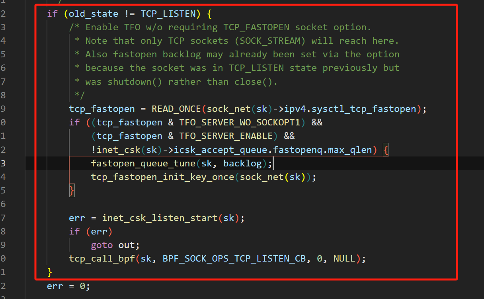

# Linux中tcp的源码叙述

## 启示：

这是一个标准的sockek-tcp连接过程

```c
#include <stdio.h>
#include <stdlib.h>
#include <string.h>
#include <unistd.h>
#include <arpa/inet.h>

#define PORT 8080
#define BUFFER_SIZE 1024

int main() {
    int server_fd, client_fd;
    struct sockaddr_in server_addr, client_addr;
    socklen_t client_len;
    char buffer[BUFFER_SIZE];

    // 1. 创建 socket
    server_fd = socket(AF_INET, SOCK_STREAM, 0);
    if (server_fd == -1) {
        perror("socket failed");
        exit(EXIT_FAILURE);
    }

    // 2. 绑定 IP 和端口
    server_addr.sin_family = AF_INET;
    server_addr.sin_addr.s_addr = INADDR_ANY;  // 监听所有地址
    server_addr.sin_port = htons(PORT);  // 端口

    if (bind(server_fd, (struct sockaddr *)&server_addr, sizeof(server_addr)) < 0) {
        perror("bind failed");
        close(server_fd);
        exit(EXIT_FAILURE);
    }

    // 3. 监听端口
    if (listen(server_fd, 5) < 0) {
        perror("listen failed");
        close(server_fd);
        exit(EXIT_FAILURE);
    }

    printf("Server listening on port %d...\n", PORT);

    // 4. 接受客户端连接
    client_len = sizeof(client_addr);
    client_fd = accept(server_fd, (struct sockaddr *)&client_addr, &client_len);
    if (client_fd < 0) {
        perror("accept failed");
        close(server_fd);
        exit(EXIT_FAILURE);
    }

    printf("Client connected: %s\n", inet_ntoa(client_addr.sin_addr));

    // 5. 读取客户端消息
    memset(buffer, 0, BUFFER_SIZE);
    read(client_fd, buffer, BUFFER_SIZE);
    printf("Received from client: %s\n", buffer);

    // 6. 发送响应
    char response[] = "Hello from server!";
    send(client_fd, response, strlen(response), 0);

    // 7. 关闭连接
    close(client_fd);
    close(server_fd);
    return 0;
}

```

接下来，我们通过走读tcp的源码，来理解tcp的连接过程，以及所涉及到的各个tcp问题，接下来我们准备几个问题：

## **📌 一、TCP 连接管理**

### **1️⃣ `socket()` 发生了什么？**

- `sys_socket()` 如何分配 socket 结构？
- socket 在 `struct file` 和 `struct sock` 之间如何关联？
- `sock_init_data()` 在 socket 初始化过程中扮演什么角色？

### **2️⃣ `connect()` 过程**

- `connect()` 调用 `inet_stream_connect()` 后，如何触发 `tcp_v4_connect()`？
- `tcp_connect()` 如何填充 TCP 头部（`SYN` 包）？
- `TCP 三次握手` 在源码层面是如何驱动的？
- `SS_CONNECTING → SS_CONNECTED` 的状态转换是如何发生的？
- 如果 `connect()` 是非阻塞的，`EINPROGRESS` 如何处理？

### **3️⃣ `listen()` 和 `accept()` 过程**

- `listen()` 是如何将 `socket` 状态转换为 `TCP_LISTEN`？
- `backlog` 参数是如何管理等待队列的？
- `accept()` 如何在 `sk->sk_receive_queue` 获取新的连接？
- `struct sock` 是如何被 `clone()` 的？
- `accept()` 获取的 `socket` 为什么直接处于 `SS_CONNECTED`？

------

## **📌 二、TCP 数据收发**

### **4️⃣ `send()` 和 `recv()` 过程**

- `send()` 触发 `tcp_sendmsg()`，数据如何被组织？
- `TCP_NODELAY` 选项如何影响数据发送？（Nagle 算法）
- `recv()` 如何获取 TCP **滑动窗口** 中的数据？
- `zero-copy sendfile()` 如何优化传输？
- `TCP 快速重传` 在 `tcp_ack()` 是如何触发的？

### **5️⃣ TCP 缓冲区管理**

- 发送缓冲区 (`sk->sk_wmem_alloc`) 和接收缓冲区 (`sk->sk_rmem_alloc`) 如何管理？
- `tcp_cleanup_rbuf()` 在 `recv()` 之后是如何调整窗口的？
- TCP 窗口更新 (`ACK`) 何时触发？

------

## **📌 三、TCP 超时与重传**

### **6️⃣ TCP 超时与重传**

- `tcp_retransmit_timer()` 什么时候会触发？
- `RTO (Retransmission Timeout)` 如何计算？
- `SACK (Selective Acknowledgment)` 如何优化重传？
- 如何查看 TCP 的重传次数？（`tcp_info`）

### **7️⃣ TCP Keepalive 机制**

- `TCP_KEEPALIVE` 选项如何触发 `keepalive` 探测？
- `tcp_keepalive_timer()` 什么时候会触发？
- `keepalive` 在安全场景下如何用于检测非正常断开的连接？

------

## **📌 四、TCP 连接终止**

### **8️⃣ `close()` 和 `shutdown()`**

- `tcp_close()` 如何执行四次挥手？
- `TIME_WAIT` 状态何时进入？如何优化？
- `SO_LINGER` 选项如何影响 `close()` 行为？
- 服务器 `close()` 连接时，如何处理未读数据？

------

## **📌 五、TCP 安全与异常**

### **9️⃣ SYN Flood 攻击如何防御？**

- `tcp_conn_request()` 处理 SYN 包时，`syn backlog` 如何管理？
- `syncookie` 机制在源码中如何实现？
- `sysctl_tcp_max_syn_backlog` 如何限制 SYN 队列？

### **🔟 TCP Reset 攻击**

- `tcp_send_reset()` 何时发送 `RST`？
- `TCP RST` 攻击如何伪造？
- `tcp_rmem` / `tcp_wmem` 如何影响拒绝服务攻击？

### **🔢 数据包乱序处理**

- `tcp_ofo_queue()` 如何处理乱序数据包？
- `tcp_try_coalesce()` 何时尝试合并 TCP 段？
- `reordering` 何时触发 `fast retransmit`？

### **🔣 防火墙和 `iptables` 如何控制 TCP？**

- `TCP Conntrack` 如何跟踪连接？
- `iptables` 如何基于 TCP 标志位进行过滤？
- `tcp_invalid()` 如何丢弃非法 TCP 包？


## 第一部分：socket过程

### 1、inet_sk(sk)函数什么作用

`inet_sk(sk)` 这个函数的作用是将一个通用的 `struct sock *` 指针转换为 `struct inet_sock *` 指针，从而访问 `inet_sock` 结构体中的 IPv4 相关字段。

------

**函数定义**

`inet_sk()` 是一个静态内联函数，通常定义在 Linux 内核的 `include/net/inet_sock.h` 头文件中：

```c
static inline struct inet_sock *inet_sk(const struct sock *sk)
{
    return (struct inet_sock *)sk;
}
```

这个函数的本质是 **类型转换**，即将 `struct sock *` 直接转换为 `struct inet_sock *`。

------

**为什么需要 `inet_sk()`？**

在 Linux 网络协议栈中，`struct sock` 是通用的 socket 结构体，适用于 TCP、UDP 等各种协议。对于基于 IPv4 的 socket（如 `AF_INET` 族的 `SOCK_STREAM` 或 `SOCK_DGRAM`），Linux 采用 `struct inet_sock` 来扩展 `sock` 结构，并存储 IPv4 相关的信息。

`inet_sk(sk)` 的作用就是让**我们从通用的 `struct sock *` 转换为 `struct inet_sock *`，从而访问 IPv4 专有的 socket 信息，比如本地/远程 IP 地址、端口号、TOS（Type of Service）、TTL（Time To Live）等。**

------

**数据结构关系**

`struct inet_sock` 继承自 `struct sock`，它的内存布局如下：

```c
struct inet_sock {
    struct sock sk;  // 继承通用的 sock 结构
    __be32 inet_saddr;   // 本地 IPv4 地址
    __be32 inet_rcv_saddr;  // 实际接收到数据包的本地 IPv4 地址
    __be16 inet_sport;   // 本地端口
    __be16 inet_num;     // 绑定的端口号
    __be32 inet_daddr;   // 目标 IPv4 地址
    __be16 inet_dport;   // 目标端口
    __u8  inet_tos;      // Type of Service (TOS)
    __u8  inet_ttl;      // Time To Live (TTL)
    ...
};
```

由于 `inet_sock` 结构的第一项是 `struct sock`，所以 `inet_sk()` 直接将 `struct sock *` 转换为 `struct inet_sock *` 是安全的。

------

**使用示例**

假设我们有一个 `struct sock *sk`，想要获取它的本地 IPv4 地址，我们可以这样写：

```c
struct sock *sk;
struct inet_sock *inet;

// 获取 inet_sock 结构
inet = inet_sk(sk);

// 访问 IPv4 相关字段
__be32 local_ip = inet->inet_saddr;
__be16 local_port = inet->inet_sport;
```

这样，我们就可以从一个通用 `sock` 结构体中提取 IPv4 相关的 socket 信息。

------

**总结**

- `inet_sk(sk)` 的作用是将 `struct sock *` 转换为 `struct inet_sock *`。
- 这样可以方便地访问 `inet_sock` 结构中 IPv4 相关的字段，如源 IP、目标 IP、端口等。
- 由于 `inet_sock` 继承自 `sock`，可以安全地进行类型转换。
- 这个函数常用于 IPv4 网络栈的代码，比如 TCP、UDP 绑定端口、连接远程地址等操作。

------


### 2、sock_net(sk)作用解析

`sock_net(sk)` 作用是 **获取 socket 所属的网络命名空间（network namespace）**，返回一个 `struct net *` 指针。

------

**函数定义**

在 Linux 内核中，`sock_net(sk)` 的定义通常位于 `include/net/sock.h` 文件：

```c
static inline struct net *sock_net(const struct sock *sk)
{
    return sk->sk_net;
}
```

这个函数 **从 `struct sock` 结构体中获取 `sk_net` 成员**，而 `sk_net` 指向的是一个 `struct net *`，代表 socket 所在的网络命名空间。

------

**为什么需要 `sock_net(sk)`？**

Linux 内核支持 **网络命名空间（Network Namespace）**，它允许多个独立的网络堆栈共存。例如：

- **容器（Docker、LXC）**：每个容器可以拥有自己的网络命名空间，拥有独立的 IP、路由表等。
- **VRF（虚拟路由和转发）**：同一个物理设备可以有多个逻辑网络实例。

由于 `struct sock` 可能属于不同的网络命名空间，因此在操作 socket 时，必须通过 `sock_net(sk)` 获取其所属的 `struct net` 进行正确的网络操作。


**Linux 网络命名空间的作用**

Linux **网络命名空间（Network Namespace, netns）** 主要用于 **隔离网络资源**，它允许系统创建多个相互独立的网络环境，每个网络命名空间都有自己的一套网络设备、IP 地址、路由表、iptables 规则等。

------

**解决的问题**

1. **网络资源隔离**
    - 在默认情况下，所有进程共享同一个网络栈。但在某些场景下（如容器、虚拟化、多租户系统），需要对不同应用或用户的网络环境进行隔离。
    - 通过网络命名空间，可以为不同进程分配独立的网络接口和路由表，避免相互干扰。
2. **多租户（Multi-Tenancy）支持**
    - 云计算和多租户环境下，不同租户的网络配置应当彼此独立，防止跨租户访问。
    - 通过网络命名空间，每个租户可以拥有自己独立的 IP 地址、路由表等，增强安全性。
3. **容器和虚拟化**
    - Docker、Kubernetes 等容器技术利用网络命名空间，为每个容器提供独立的网络环境，使其拥有自己的 `eth0` 接口、IP 地址等，同时可以通过 `veth` 设备与主机通信。
    - LXC、VM 也采用网络命名空间，以确保虚拟实例之间的网络隔离。
4. **网络测试与调试**
    - 开发人员可以使用网络命名空间创建多个隔离的网络环境，在同一台机器上模拟不同的网络拓扑（如多个子网、不同路由策略）。
    - 例如，可以在本地测试 SDN、BGP、VPN 等网络技术，而不影响主机的实际网络配置。
5. **安全性**
    - 由于不同的网络命名空间拥有独立的 `iptables` 规则，可以防止恶意进程访问主机网络，从而提高安全性。
    - 可以限制某些进程只能访问特定的网络资源，避免数据泄露。

------

**数据结构关系**

```c
struct sock {
    ...
#ifdef CONFIG_NET_NS
    struct net  *sk_net;  // 该 socket 所属的网络命名空间
#endif
    ...
};
```

`sk_net` 仅在 **内核启用了网络命名空间（CONFIG_NET_NS）** 时存在。它是一个 `struct net *` 指针，指向该 socket 所属的网络命名空间。

`struct net` 定义了一个网络命名空间，包含该命名空间的路由表、网络设备等信息：

```c
struct net {
    struct list_head list;
    struct list_head exit_list;
    struct user_namespace *user_ns;
    ...
    struct netns_ipv4 ipv4;
    struct netns_ipv6 ipv6;
    ...
};
```

------

**使用示例**

假设 `sk` 是一个 socket 结构体，我们想要获取它的网络命名空间：

```c
struct sock *sk;
struct net *net_ns;

// 获取 socket 所在的网络命名空间
net_ns = sock_net(sk);

// 在该命名空间内执行某些操作，例如获取 IPv4 相关配置：
struct netns_ipv4 *ipv4_ns = &net_ns->ipv4;
```

------

**`sock_net(sk)` 在 TCP/UDP 绑定 (`bind()`) 和 连接 (`connect()`) 中的作用**

- 当 **`bind()` 绑定本地 IP 地址** 时，Linux 需要在正确的网络命名空间内查找可用 IP 地址。
- 当 **`connect()` 连接远程地址** 时，需要检查路由表，而 `sock_net(sk)` 可以确保查询的是 **当前 socket 所在的网络命名空间** 的路由表。

示例：

```c
struct net *net = sock_net(sk);
struct rtable *rt = ip_route_output_key(net, &fl4);
```

这里 `ip_route_output_key()` 需要传入 `net`，确保在正确的网络命名空间内进行路由查询。

------

**总结**

- `sock_net(sk)` 用于获取 socket 结构体 `sk` 所属的 **网络命名空间**，返回 `struct net *`。
- 该函数适用于 **支持网络命名空间（Network Namespace）的内核**，用于区分不同命名空间中的网络操作。
- 主要用于 **socket 绑定（bind）、连接（connect）、路由查询等操作**，确保在正确的网络环境中进行操作。


### 3、inet_csk_get_port 函数中的一二级hash

在 `inet_csk_get_port` 函数中，涉及到 **一级哈希（bhash）** 和 **二级哈希（bhash2）**，它们分别对应以下数据结构：

- **一级哈希（bhash）**：
    - `inet_bind_hashbucket` 结构，用于根据端口号 (`port`) 组织 `inet_bind_bucket` 绑定桶。
    - 作用：主要用于检查端口是否已被占用，并存储端口绑定信息。
    - 绑定规则：只关注**端口号**，不区分 IP 地址。
- **二级哈希（bhash2）**：
    - `inet_bind2_bucket` 结构，用于同时考虑**IP 地址和端口**进行更精确的绑定管理。
    - 作用：解决多个进程在相同端口但不同 IP 地址上的绑定问题，例如 `SO_REUSEPORT` 允许多个进程共享同一端口的情况。
    - 绑定规则：同时匹配**IP 地址 + 端口号**，确保端口复用的合理性。

------

**一级哈希（bhash） VS 二级哈希（bhash2）**

| 特性         | 一级哈希（bhash）      | 二级哈希（bhash2）                       |
| ------------ | ---------------------- | ---------------------------------------- |
| 主要存储结构 | `inet_bind_bucket`     | `inet_bind2_bucket`                      |
| 哈希方式     | 仅根据 `port` 计算哈希 | 依据 `port + IP` 计算哈希                |
| 作用         | 解决端口号的占用问题   | 解决端口复用问题，支持 `SO_REUSEPORT` 等 |
| 适用场景     | 标准端口绑定           | 复杂端口绑定，例如多个进程共享端口       |

在 `inet_csk_get_port` 代码中，**先查询一级哈希（bhash），如果存在端口冲突，则使用二级哈希（bhash2）进一步确认端口是否可用**。这种设计能够兼顾**效率**和**灵活性**，保证既能快速查找端口使用情况，又能支持复杂的端口复用策略。


### 4、listen对于shutdown的特殊处理



#### **1. 背景：为什么要特殊处理 `shutdown()` 之后的 `listen`？**

通常，在 `listen()` 时，可以通过 `TCP_FASTOPEN` 选项来设置 **Fast Open backlog**（即允许多少个 **未完成的 TFO 连接**）。但这里有一个特殊情况：

- 如果一个 `listen` 状态的 socket **调用了 `shutdown()` 而不是 `close()`**，它的 **fastopen backlog 可能仍然保留**。
- 这样，**当 socket 重新进入 `listen()` 状态时，它可能已经有 backlog 了**，无需重复设置。

然而，如果 `fastopenq.max_qlen` 被清空或未初始化，系统需要重新配置 backlog，确保 TFO 功能的正常运行。

------

#### **2. 代码的逻辑分析**

```c
tcp_fastopen = READ_ONCE(sock_net(sk)->ipv4.sysctl_tcp_fastopen);
```

- 读取全局 `sysctl_tcp_fastopen` 变量，判断 TFO 是否被启用。

```c
if ((tcp_fastopen & TFO_SERVER_WO_SOCKOPT1) &&
    (tcp_fastopen & TFO_SERVER_ENABLE) &&
    !inet_csk(sk)->icsk_accept_queue.fastopenq.max_qlen) {
```

- 只有当：

    1. **TFO 允许无 `TCP_FASTOPEN` 选项 (`TFO_SERVER_WO_SOCKOPT1`)**，表示即使应用层没有显式启用 `TCP_FASTOPEN`，系统仍然支持 TFO。

    2. **TFO 被全局启用 (`TFO_SERVER_ENABLE`)**，确保 Fast Open 机制在当前系统环境下是可用的。

    3. 当前 `fastopenq.max_qlen == 0`

        ，即 

        Fast Open 队列尚未初始化

        ，这意味着：

        - 该 socket 可能是第一次启用 TFO，需要分配 backlog 队列。
        - 之前 `shutdown()` 过，但 backlog 被清空了，必须重新配置。

```c
	fastopen_queue_tune(sk, backlog);
```

- **调整 Fast Open 连接队列的大小**，确保其符合 `backlog` 设定的值。

```c
    tcp_fastopen_init_key_once(sock_net(sk));
```

- **初始化 TCP Fast Open 的密钥**，以便支持 TFO 连接中的 cookie 机制（防止 DoS 攻击）。

------

#### **3. `backlog` 在 TFO 机制中的作用**

`backlog` 主要用于控制 **未完成连接**（包含两部分）：

1. **普通的 `SYN` 半连接队列**（`syn backlog`）：存放未完成 **三次握手** 的连接。
2. **TFO 半连接队列**（`fastopenq`）：存放使用 **TCP Fast Open** 直接发送数据的连接。

在 TCP Fast Open 场景下：

- 客户端会在 **SYN** 中携带数据，服务器收到后 **直接将数据交给应用层**，但连接状态仍处于 **半连接**（未完成握手）。
- `fastopenq.max_qlen` 控制 **TFO 半连接队列的大小**，即允许多少个等待完成握手的 TFO 连接。
- 如果 `fastopenq.max_qlen` 过小，可能会导致服务器丢弃 TFO 连接，从而影响性能。

当 `shutdown()` 发生时：

- 普通 `backlog` 可能仍然保留，但 `fastopenq.max_qlen` 可能被清空，因此需要在 `listen()` 重新设置。
- 这个代码的作用就是 **确保 `fastopenq` 队列大小正确**，防止 `shutdown()` 影响后续 TFO 连接的处理。

------

#### **4. 代码的核心作用**

这段代码的目的是：

1. **确保 TCP Fast Open 能够启用**，即使 **应用层没有显式设置 `TCP_FASTOPEN` 选项**。
2. **解决 `shutdown()` 导致的 TFO backlog 遗留问题**，避免 socket 复用时 fastopenq 被错误地清空或未初始化。
3. **如果 `fastopenq.max_qlen` 还没设置，则重新配置 TFO backlog**，保证新的 `listen()` 依然支持 TFO。

------

#### **5. 影响**

- **如果 socket 之前 `shutdown()` 过，且 TFO backlog 仍然存在，这里就不会重新设置 backlog**，因为 `fastopenq.max_qlen` 可能已经被设置过。
- **如果 socket 是全新的或者之前 backlog 被清空，则这里会重新初始化 fastopen 队列**，确保 TFO 正常工作。

这段代码的作用就是 **在 TFO 允许的情况下，确保 fastopen backlog 被正确配置，避免 `shutdown()` 导致的 backlog 遗留问题**。


### 5、**listen中inet_ulp_can_listen函数的作用**

`inet_ulp_can_listen` 这个函数的作用是 **检查当前 socket 是否可以进入 `listen` 状态**，特别是针对 **ULP（Upper Layer Protocol）机制的约束**。

------

**代码分析**

```c
static int inet_ulp_can_listen(const struct sock *sk)
{
    const struct inet_connection_sock *icsk = inet_csk(sk);

    if (icsk->icsk_ulp_ops && !icsk->icsk_ulp_ops->clone)
        return -EINVAL;

    return 0;
}
```

**核心逻辑**

1. 先获取 `sk` 结构体的 `inet_connection_sock` 版本：

    ```c
    const struct inet_connection_sock *icsk = inet_csk(sk);
    ```

    `inet_connection_sock` 结构体是 TCP 相关的 socket 结构，它扩展了通用的 `sock` 结构，包含了 TCP 特有的字段，比如 `icsk_ulp_ops`。

2. ### **检查 ULP（Upper Layer Protocol）是否允许 `listen`**

    ```c
    if (icsk->icsk_ulp_ops && !icsk->icsk_ulp_ops->clone)
        return -EINVAL;
    ```

    - `icsk_ulp_ops` 是 **ULP（Upper Layer Protocol）** 机制的一个结构，允许 TCP 之上的协议（如 `TLS`）接管 TCP 的部分行为。
    - 如果 `icsk_ulp_ops` **不为空**（说明该 socket 绑定了某个 ULP，例如 TLS），但 `icsk_ulp_ops->clone` **为空**（该 ULP 不支持 `listen` 状态的克隆），则返回 `-EINVAL`（表示无效参数）。

3. 如果 `icsk_ulp_ops` 为空，或者 `icsk_ulp_ops->clone` 可用，则 `listen` 允许执行，返回 `0`。

------

**函数作用总结**

这个函数用于 **检查 socket 是否可以进入 `listen` 状态**，特别是：

- 如果 socket 绑定了 **ULP 机制**（比如 `TLS`），那么它必须支持 `clone` 操作，才能 `listen`。
- 如果绑定的 ULP **不支持 `clone`**，说明它不能用于 `listen`，因此返回 `-EINVAL`。
- **普通 TCP socket** 没有绑定任何 ULP，因此可以正常 `listen`，返回 `0`。

------

**可能的影响**

1. **如果 socket 绑定了不支持 `clone` 的 ULP（比如某些 TLS 实现）**
    - `listen()` 调用会失败，返回 `-EINVAL`。
    - 这样做是为了避免 ULP 在 `listen` 之后，不能正确处理新连接的情况。
2. **如果 socket 没有绑定 ULP，或者绑定的 ULP 支持 `clone`**
    - `listen()` 正常执行。

------

**实际应用**

在 Linux TCP 协议栈中：

- 这个函数 **通常在 `inet_listen()` 过程中被调用**，用于 **检查是否允许 socket 进入 `listen` 状态**。
- **当使用 ULP（如 TLS over TCP）时，只有支持 `clone` 的 ULP 才能 `listen`**，否则 `listen()` 失败。

------

**总结**：

 `inet_ulp_can_listen()` **确保 socket 在 `listen()` 之前检查 ULP 约束**，避免某些不兼容的 ULP 进入 `listen`，从而引发错误。


### 6、Linux的端口复用

如果你在 `0.0.0.0:8080` 和 `192.168.1.2:8080` 上同时监听：

​		那么客户端向 `192.168.1.2:8080` 发送数据时，**只有 `192.168.1.2:8080` 会触发**。

**原因：**

- 当你绑定到 `0.0.0.0:8080` 时，它会监听所有网络接口上的 8080 端口，也就是说，`0.0.0.0:8080` 会接收来自任何 IP 地址（例如 `192.168.1.2` 或 `192.168.1.3`）的请求。
- 当你再绑定到 `192.168.1.2:8080` 时，意味着该服务只会监听来自 `192.168.1.2` 的请求。

**客户端发送到 `192.168.1.2:8080`：**

- 客户端向 `192.168.1.2:8080` 发送请求时，服务绑定到 `192.168.1.2:8080` 的监听会接收这个请求。
- **`0.0.0.0:8080` 不会触发**，因为请求明确发送到了 `192.168.1.2`，而不是其他的 IP 地址。`0.0.0.0` 监听的是所有接口的 8080 端口，但不会再处理已明确指定的目标 IP 地址上的请求。

**总结：**

- **`192.168.1.2:8080` 会触发**。
- **0.0.0.0:8080 不会触发**，因为已经有了专门绑定在 `192.168.1.2:8080` 上的监听。


### 7、defer_connect 标志

`defer_connect` 是一个标志，用于标记是否延迟套接字连接的处理。具体来说，它与 TCP 快速打开（TCP Fast Open）特性相关，允许在套接字的连接操作中延迟连接的实际建立。

**详细解释：**

在 Linux 内核中的 `inet_sk(sk)` 结构体中，`defer_connect` 是一个布尔值，它通常用于 TCP 套接字的延迟连接机制，特别是与 TCP 快速打开（TCP Fast Open，TFO）有关的实现。

1. **TCP Fast Open (TFO)**：

TCP 快速打开是一个增强的 TCP 连接机制，它可以在 TCP 握手阶段发送数据，从而减少延迟。常见的应用场景是 HTTP 请求，可以在建立连接的同时开始传输数据。启用 TFO 时，客户端在发起连接时可以在 SYN 包中携带数据。

- `defer_connect` 标志用于在 TCP Fast Open 的上下文中，当 `TCP_FASTOPEN_CONNECT` 选项启用时，延迟连接的实际建立。也就是说，尽管客户端可能已经开始发送数据，但在某些条件下（例如，在发送数据之前），内核不会立即建立连接。
- 一旦连接的握手过程完成，`defer_connect` 会被清除，连接将完全建立，之后的通信将正常进行。

2. **作用**：

- 如果 `defer_connect` 为真，表示 TCP Fast Open 连接正在延迟建立，套接字不会立即进行连接操作，直到相关的连接处理完成。
- 如果为假，表示连接操作不再被延迟，内核会进行常规的连接建立流程。

3. **典型场景**：

- **客户端连接时**：客户端可以在连接时发送数据，如果 `defer_connect` 被设置为 `true`，内核不会立刻完成连接过程，而是等到必要的条件满足后再完成。
- **服务器端**：服务器端可以处理传入的连接请求，并通过内核的连接处理机制最终建立连接。


### 8、tcp与路由的关系

在 `tcp_v4_connect` 代码中，路由（Routing）的主要作用是**确定数据包的目的地和发送路径**，并确保**TCP 连接可以正确建立**。TCP 在连接建立阶段，需要通过路由子系统来获取发送数据所需的信息，如**下一跳地址（nexthop）**、**源 IP 地址（saddr）** 和 **路由缓存（rt）** 等。

------

**路由的作用**

在 Linux 内核网络栈中，路由（Routing）用于决定如何将数据包从源地址发送到目标地址。对于 TCP 连接，路由系统的作用包括：

1. **选择合适的下一跳（nexthop）**
    - 如果目标地址是直接可达的（如本地子网内的 IP），则 `nexthop` 直接是目标 IP。
    - 如果目标地址不可达（如不同网段），则 `nexthop` 可能是网关的地址。
2. **查找最佳路由（Route Lookup）**
    - 通过 `ip_route_connect()` 查找合适的路由表项，返回 `struct rtable *rt`。
    - 如果找不到路由，则返回 `-ENETUNREACH`（网络不可达）。
3. **获取合适的源地址（Source Address Selection）**
    - 若用户未指定源地址（`inet->inet_saddr` 为空），则路由子系统会根据 `fl4->saddr` 自动选择合适的源 IP 地址。
4. **确保目标地址合法**
    - 如果目标地址是广播地址（RTCF_BROADCAST）或多播地址（RTCF_MULTICAST），TCP 连接将失败，返回 `-ENETUNREACH`。
5. **存储路由信息，以便 TCP 传输使用**
    - 例如 `sk_setup_caps(sk, &rt->dst);` 将 `rt` 关联到 `sk`，用于后续 TCP 报文的发送。

------

**TCP 与路由的关系**

TCP 是**面向连接**的传输协议，在建立连接时，TCP 需要借助 IP 层的路由系统来完成以下任务：

1. **确定远端 IP 是否可达**
    - 通过 `ip_route_connect()` 查询是否存在到 `usin->sin_addr.s_addr`（目标地址）的有效路由。
    - 若无路由，则连接失败。
2. **选择合适的源 IP**
    - TCP 需要一个本地 IP 作为源地址，若 `inet->inet_saddr` 为空，则从路由表自动获取。
3. **绑定路由到 TCP 连接**
    - `sk_setup_caps(sk, &rt->dst);` 绑定路由信息到 `sock`，后续 TCP 传输数据时会复用这条路由。
4. **防止非法连接**
    - 如果目标地址是广播或多播，TCP 直接拒绝连接，避免无效传输。
5. **影响 TCP 连接的状态变化**
    - 如果 `tcp_connect(sk)` 成功，TCP 进入 `SYN_SENT` 状态，等待服务器 `SYN+ACK` 响应。
    - 如果路由不可达，TCP 进入 `CLOSE` 状态，并返回错误。

------

**代码中的路由相关部分**

```c
/* 获取目标地址 */
nexthop = daddr = usin->sin_addr.s_addr;

/* 如果启用了 IP 选项（如源路由），使用指定的下一跳地址 */
inet_opt = rcu_dereference_protected(inet->inet_opt, lockdep_sock_is_held(sk));
if (inet_opt && inet_opt->opt.srr) {
    if (!daddr) return -EINVAL;
    nexthop = inet_opt->opt.faddr;
}

/* 通过路由系统查找到目标地址（nexthop）的路径 */
fl4 = &inet->cork.fl.u.ip4;
rt = ip_route_connect(fl4, nexthop, inet->inet_saddr,
                      sk->sk_bound_dev_if, IPPROTO_TCP, orig_sport,
                      orig_dport, sk);
if (IS_ERR(rt)) {
    err = PTR_ERR(rt);
    if (err == -ENETUNREACH)
        IP_INC_STATS(net, IPSTATS_MIB_OUTNOROUTES);
    return err;
}

/* 如果目标地址是广播或多播，TCP 连接不成立 */
if (rt->rt_flags & (RTCF_MULTICAST | RTCF_BROADCAST)) {
    ip_rt_put(rt);
    return -ENETUNREACH;
}

/* 绑定路由到 socket */
sk_setup_caps(sk, &rt->dst);
```

------

**总结**

1. TCP 依赖路由子系统来**决定如何发送数据**，包括下一跳 IP 选择、源地址选择和路由缓存绑定。
2. 在 `tcp_v4_connect()` 里，路由系统通过 `ip_route_connect()` 查找合适的路由，并确保目标地址合法。
3. TCP 连接建立时，路由会影响源 IP 选择，并决定是否可以成功建立连接。
4. TCP 连接绑定到 `rt->dst`，后续的数据传输都会依赖这个路由信息。


### 9、三次握手流程与 `accept()` 的关系

**三次握手流程与 `accept()` 的关系**

**服务器端在 `listen()` 之后，客户端 `connect()` 触发 TCP 三次握手，内核完成连接的建立，应用层 `accept()` 只是从内核中取出已建立的连接。**

1. **服务器调用 `listen()` 之后，内核将 socket 置为 `TCP_LISTEN` 状态，并准备 `reqsk_queue`（半连接队列 + 全连接队列）。**
2. **客户端调用 `connect()` 发送 SYN，进入 `TCP_SYN_SENT` 状态。**
3. **服务器收到 SYN，内核自动回复 SYN+ACK，创建 `request_sock` 并加入半连接队列（`TCP_SYN_RECV` 状态）。**
4. **客户端收到 SYN+ACK，发送 ACK，完成三次握手，服务端进入 `TCP_ESTABLISHED` 状态，并将 `request_sock` 转移到全连接队列。**
5. **应用层 `accept()` 只是从全连接队列中取出一个已经建立连接的 socket，并返回给用户态。**

------

**三次握手的具体内核调用流程**

**在 `accept()` 之前，三次握手主要由内核 `tcp_v4_rcv()` 完成**：

**1. 服务器 `listen()`**

`inet_listen()` 设置 socket 为 `TCP_LISTEN`，初始化 `icsk->icsk_accept_queue` 队列（半连接 + 全连接队列）。

**2. 服务器收到客户端 `SYN`**

网络驱动收到数据包后，进入 `tcp_v4_rcv()` 处理：

- `tcp_v4_rcv()` → `tcp_check_req()` 解析 `SYN`，创建 `request_sock` 并放入 **半连接队列** (`icsk_accept_queue`)。

**3. 服务器发送 `SYN+ACK`**

- `tcp_v4_do_rcv()` → `tcp_send_synack()` 发送 `SYN+ACK`。

**4. 客户端收到 `SYN+ACK`，回复 `ACK`**

- `tcp_v4_rcv()` 处理 `ACK`，调用 `tcp_v4_hnd_req()`
- `tcp_create_openreq_child()` 生成新的 `struct sock`
- `tcp_child_process()` 处理完毕后，进入 `TCP_ESTABLISHED` 状态，`request_sock` 转移到 **全连接队列**。


### 10、tcp_v4_rcv调用函数栈

在 Linux 内核中，`tcp_v4_rcv()` 主要用于处理 IPv4 TCP 数据包，它的调用链路从网络设备驱动程序开始，最终传递到 TCP 协议栈。以下是 `tcp_v4_rcv()` 的典型调用栈：

------

**TCP 数据包的内核接收流程**

1. 网络设备驱动接收数据
    - `netif_receive_skb()`（软中断 `NET_RX` 处理）
    - `__netif_receive_skb_core()`
    - `ip_rcv()`（处理 IP 层）
    - `ip_local_deliver()`（IP 目标地址匹配本机，进入本机协议栈）
    - `ip_protocol_deliver_rcu()`（根据协议号调用 TCP 处理函数）
    - `tcp_v4_rcv()`（进入 TCP 层处理逻辑）

------

**完整的调用栈**

```nginx
tcp_v4_rcv
├── ip_protocol_deliver_rcu
│   ├── ip_local_deliver
│   │   ├── ip_rcv
│   │   │   ├── __netif_receive_skb_core
│   │   │   │   ├── netif_receive_skb
│   │   │   │   │   ├── __netif_receive_skb
│   │   │   │   │   │   ├── napi_gro_receive
│   │   │   │   │   │   ├── net_rx_action
│   │   │   │   │   │   ├── __do_softirq
│   │   │   │   │   │   ├── do_softirq
│   │   │   │   │   │   ├── __irq_exit_rcu
│   │   │   │   │   │   ├── irq_exit_rcu
│   │   │   │   │   │   ├── common_interrupt
│   │   │   │   │   │   ├── asm_common_interrupt
```

------

**各个函数的作用**

| 函数                         | 作用                                                     |
| ---------------------------- | -------------------------------------------------------- |
| `tcp_v4_rcv()`               | TCP 层处理 IPv4 传入的数据包                             |
| `ip_protocol_deliver_rcu()`  | 根据 IP 头部的协议号调用相应协议的处理函数（这里是 TCP） |
| `ip_local_deliver()`         | 处理本机接收的数据包                                     |
| `ip_rcv()`                   | 解析 IP 头部，校验 IP 头部完整性                         |
| `__netif_receive_skb_core()` | 负责分发数据包到相应的协议栈（IPv4、IPv6等）             |
| `netif_receive_skb()`        | 网络设备驱动调用，开始处理数据包                         |
| `napi_gro_receive()`         | 进行 GRO（Generic Receive Offload）聚合处理              |
| `net_rx_action()`            | 软中断处理网络数据包                                     |
| `do_softirq()`               | 软中断入口                                               |
| `irq_exit_rcu()`             | 退出中断，触发软中断                                     |
| `common_interrupt()`         | 处理硬件中断                                             |
| `asm_common_interrupt`       | 处理 x86 平台上的中断请求                                |