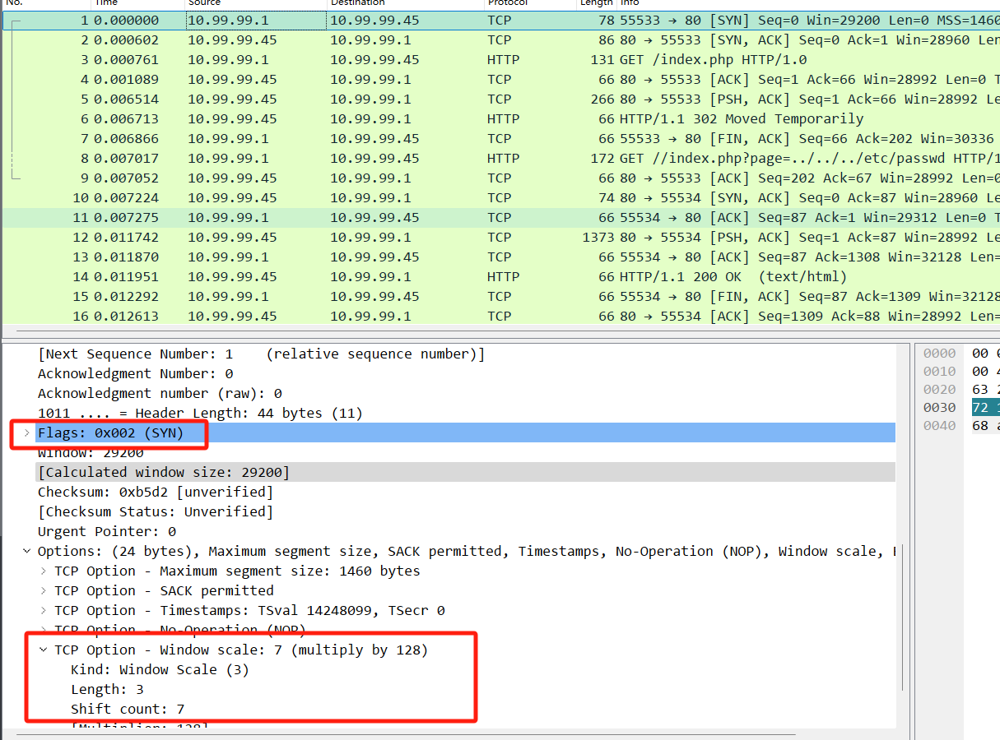
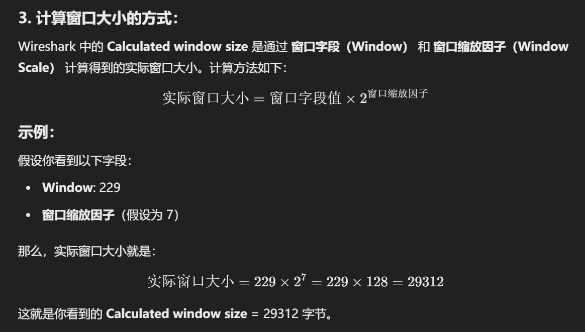
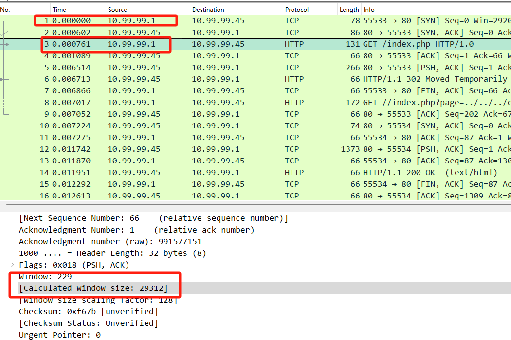

# TCP的window功能

### 窗口类型的总结：

| **窗口类型**          | **作用**                                         | **变化**                               |
| --------------------- | ------------------------------------------------ | -------------------------------------- |
| **接收窗口**          | 控制接收方可以接收的最大数据量                   | 根据接收方的缓冲区情况动态调整         |
| **发送窗口/滑动窗口** | 控制发送方在等待确认的情况下可以发送的最大数据量 | 根据接收窗口和网络状况动态调整         |
| **拥塞窗口**          | 控制网络的拥塞，调整发送方发送数据的速率         | 根据网络的拥塞状态动态调整             |
| **可用窗口**          | 决定发送方可以发送的最大数据量                   | 为接收窗口和拥塞窗口的较小值           |
| **初始窗口**          | 连接建立时的初始接收窗口大小                     | 根据连接建立时的缓冲区大小和配置来决定 |
| **最大窗口**          | 表示协议支持的最大窗口尺寸                       | 受操作系统和网络硬件的限制             |


## 1、在 Wireshark 中，窗口大小字段通常会有两部分信息：

- **Window**：即 TCP 报文头中的窗口大小字段。
- **Calculated window size**：这个是经过计算后的实际窗口大小，考虑了窗口缩放因子等其他因素。

1. **TCP 窗口大小（Window）字段**：

TCP 窗口大小字段（即 `Window`）是一个 16 位的数字，表示接收方的接收窗口的大小，单位是字节。这个值告诉发送方接收方当前能够接收多少字节的数据。

2. **窗口缩放因子（Window Scale）**：

为了处理更大的窗口大小，TCP 引入了 **窗口缩放** 选项。窗口缩放是 TCP 连接协商的一个参数，用来扩展窗口大小的表示范围。窗口缩放因子通常是在 TCP 连接的 **三次握手** 阶段通过 TCP 选项传递。

**window的缩放因子是 7，在syn数据中有说明：**



- 窗口缩放因子（`rcv_wscale`）是一个 8 位的值，表示对窗口大小的缩放因子的指数。

3. **计算窗口大小的方式**：



这就是你看到的 **Calculated window size** = 29312 字节。




## 2、窗口缩放因子（`rcv_wscale`）的设计目的及其作用归纳总结：

1. **兼容性**：
    - 早期的 TCP 协议仅支持 16 位字段的接收窗口（最大 65535 字节），为了支持更大的接收窗口，**窗口缩放因子**（`rcv_wscale`）机制被引入。
    - 它允许现代 TCP 实现支持更大的接收窗口（如 1GB），同时与不支持窗口缩放的旧设备兼容。接收方和发送方协商决定是否启用缩放因子。
2. **节省带宽和提高效率**：
    - 如果直接传输更大的接收窗口（如 3.7 MB），每个 TCP 数据包中的接收窗口字段会需要更多的比特数。
    - 使用 **`rcv_wscale`**，可以通过传输较小的窗口值，并通过缩放因子来动态调整实际的接收窗口大小，这能有效 **节省带宽**，特别是在大量的 ACK 包中，减少不必要的冗余信息。
3. **灵活性和可扩展性**：
    - 窗口缩放使得接收方能够根据系统负载和应用需求动态调整接收窗口的大小。
    - 通过改变窗口缩放因子，可以灵活调整接收窗口，以应对不同的网络延迟、缓冲区大小等情况，从而提高网络性能。
4. **协议字段优化**：
    - 通过窗口缩放，TCP 协议可以保持 16 位窗口字段的大小，而实际的接收窗口则由缩放因子来扩展，这避免了每个数据包传输一个庞大的窗口字段。
    - 这种设计确保了协议的简洁性和高效性，同时支持更大的接收窗口，适应更高带宽的需求。

**总结：**

窗口缩放因子（`rcv_wscale`）的引入，是为了兼顾 **兼容性**、**带宽节省**、**协议效率** 和 **灵活性**，避免在增加接收窗口时引入过多的复杂性或冗余信息，尤其是在网络流量高峰期和带宽受限的情况下，它提高了网络协议的效率与适应性。


## 3、TCP网络中 **`rcv_wnd`**（接收窗口）与 **流量控制** 概念总结

------

### 3.1 接收窗口（`rcv_wnd`）与窗口的比喻

我们可以用**水池**的比喻来形象化 **接收窗口** 和 **窗口** 的作用：

- **接收窗口（`rcv_wnd`）** 就像是接收方的水池容量，表示接收方可以接收和存储的数据量。
- **窗口大小**控制着发送方能发送的数据量。如果接收方的水池（接收窗口）空间满了，发送方就不能再发送数据，直到接收方腾出空间。

**作用**：

- **流量控制**：接收窗口大小直接影响数据传输的速度。如果接收方的接收窗口小（类似水池容量小），发送方需要减缓数据的发送，避免数据丢失。
- **避免丢包**：接收方的接收窗口限制了接收缓冲区的容量，当缓冲区满时，发送方会暂停数据的发送，直到接收方处理并腾出空间。
- **动态调整**：接收窗口大小会动态调整，根据接收方处理数据的能力和接收缓冲区的使用情况而变化。

### 3.2 接收窗口（`rcv_wnd`）是否会实时改变

是的，接收窗口（`rcv_wnd`）是会实时改变的。

**如何变化**：

- **接收数据**：接收方在接收到数据后，会填充自己的接收缓冲区。接收窗口的大小表示当前接收缓冲区的可用空间。
- **处理数据**：接收方处理并消化缓冲区中的数据后，腾出空间，从而增大接收窗口的大小。
- **窗口更新**：接收方通过 ACK 包告知发送方当前的接收窗口大小，发送方会根据接收窗口的变化调整发送速率。

**实际影响**：

- 当接收窗口变小，发送方会减缓发送速度，避免接收方的接收缓冲区溢出。
- 当接收窗口变大，发送方可以加快发送速率，进行更高效的数据传输。


## 4、窗口与缩放因子的思考

### 4.1 窗口和缩放因子是由什么决定的？

- 接收窗口 (`rcv_wnd`)：
    - 接收窗口的大小由接收方的 **TCP 缓冲区** 和接收方的系统负载决定。接收方的缓冲区越大，可以容纳的数据就越多，窗口就越大。
    - 初始的接收窗口大小通常由操作系统的网络栈配置和应用程序的需求来决定，但也可以通过 TCP 的窗口大小调整机制动态变化。
- 窗口缩放因子 (`rcv_wscale`)：
    - 窗口缩放因子是在 TCP 握手过程中，由 **接收方** 和 **发送方** 共同协商的。
    - **接收方** 宣布其支持的窗口缩放因子值。发送方会根据接收方的能力和协议支持来决定是否使用窗口缩放。
    - 窗口缩放因子最大为 14，表示最多支持 2^14，即最大可达 1GB 的窗口大小。

### 4.2 窗口和缩放因子的作用是什么？

- **接收窗口 (`rcv_wnd`)**：
    - 接收窗口决定了 **接收方可以接收的数据量**。它表示接收方允许发送方发送的最大数据量，而无需等待接收方处理完数据并确认。
    - 它是流量控制的核心部分，防止接收方因缓存满而丢失数据。
- **窗口缩放因子 (`rcv_wscale`)**：
    - 由于早期 TCP 的接收窗口字段为 16 位，最大值为 65535 字节。窗口缩放因子的引入，可以让接收方和发送方协商使用一个更大的接收窗口。
    - 窗口缩放因子用于 **扩展接收窗口大小**，例如，如果窗口缩放因子为 3，那么接收窗口值就变为接收窗口字段的值乘以 2^3。
    - 它使得 TCP 可以支持更大范围的窗口大小，适应现代高带宽的网络环境。

### 4.3 窗口和缩放因子双方是如何交互确定的？

- 在 TCP 握手阶段，发送方和接收方会交换窗口缩放因子的支持信息。

    - 发送方会在 **SYN** 包中通过 `TCP_OPTION_WSCALE` 通知接收方自己支持窗口缩放。
    - 接收方也会在 **SYN-ACK** 包中回应，声明它支持的最大窗口缩放因子。

    在这个过程中：

    - 发送方根据接收方提供的缩放因子信息决定是否启用窗口缩放。
    - 窗口缩放因子最大为 14，因此实际的接收窗口大小可能比传统的 65535 字节窗口大很多。

    通过这个过程，双方会知道各自能支持的最大窗口大小和缩放因子，并据此调整传输数据的窗口。

### 4.4 窗口和缩放因子确定后能否修改？

- 接收窗口 (`rcv_wnd`)：

    - **可以动态修改**。接收方的缓冲区大小可以根据网络状况或应用程序的需求动态调整。
    - 当接收方的缓冲区有空余空间时，接收窗口会增大；反之，当缓冲区接近满时，接收窗口会缩小，从而控制数据流量。

- 窗口缩放因子 (`rcv_wscale`)：

    - **在连接建立时协商一次**，在整个连接生命周期内是固定的。
    - **一旦建立了 TCP 连接并且确定了窗口缩放因子，后续无法动态更改。**

    但是，如果有一个新的连接（如重连、断开再重连），可以重新协商窗口缩放因子。

### 4.5  有了窗口和缩放因子，TCP 传输的数据大小是不是就可以动态变化？

- 是的，有了接收窗口和窗口缩放因子，TCP 数据的传输量可以动态变化。

    - **接收窗口** 控制接收方每次可以接收多少数据，接收方会根据自己的缓冲区大小和处理能力来动态调整窗口大小。
    - **窗口缩放因子** 则提供了扩展接收窗口的能力，从而允许更大的数据传输而不受传统 16 位窗口大小的限制。

    具体来说：

    - 当接收方处理数据的速度较慢或者缓存较满时，它会减小接收窗口的大小，进而限制发送方的发送速率。
    - 当接收方缓存有足够空间时，接收窗口增大，允许发送方发送更多的数据。


## 5、TCP 接收窗口大小调整 (sysctl_tcp_adv_win_scale) 及其计算方式

### **1. 系统参数概述**

- **参数名称**：`sysctl_tcp_adv_win_scale`

- **作用**：控制 TCP 接收窗口 (`rcv_wnd`) 的动态调整，目的是根据内核分配的接收缓冲区 (`sk_rcvbuf`) 和网络环境动态优化窗口大小。

- **shell命令查看**

    ```shell
    cat /proc/sys/net/ipv4/tcp_adv_win_scale
    ```

    

### **2. 计算方式及解释**

`tcp_win_from_space()` 函数通过位移操作（左移和右移）计算调整后的接收窗口大小。其计算逻辑如下：

```c
static inline int tcp_win_from_space(const struct sock *sk, int space) {
    int tcp_adv_win_scale = READ_ONCE(sock_net(sk)->ipv4.sysctl_tcp_adv_win_scale);

    return tcp_adv_win_scale <= 0 ?
        (space >> (-tcp_adv_win_scale)) :   // 右移，相当于除以 2^(-tcp_adv_win_scale)
        space - (space >> tcp_adv_win_scale); // 计算一个小的调整值并减去
}
```

- 当 `sysctl_tcp_adv_win_scale ≤ 0`：窗口大小按比例缩小
    - 计算：`rcv_wnd = space >> (-tcp_adv_win_scale)`
    - **示例**：当 `tcp_adv_win_scale = -2` 时，`rcv_wnd = space / 4`
- 当 `sysctl_tcp_adv_win_scale > 0`：窗口大小增大
    - 计算：`rcv_wnd = space - (space >> tcp_adv_win_scale)`
    - **示例**：当 `tcp_adv_win_scale = 2` 时，`rcv_wnd = space * (1 - 1/4)`

### **3. 为什么使用位移运算 (左移/右移) 而非直接设置固定窗口大小？**

1. **动态调整，适应不同设备和环境**：

    - sk_rcvbuf

        （接收缓冲区大小）在不同设备间可能差异较大。直接设置一个固定的接收窗口值可能会导致：

        - **内存小的设备**：如果窗口过大，可能会发生溢出。
        - **内存大的设备**：如果窗口过小，带宽利用率会低。

    - 通过位移运算，使得窗口大小与 **sk_rcvbuf** 成比例，确保在不同设备上都能合理使用接收缓冲区，避免浪费或溢出。

2. **适应不同的网络环境**：

    - 在 **低带宽** 或 **高丢包** 环境下，窗口应该小，以避免数据溢出。
    - 在 **高带宽** 或 **低丢包** 环境下，窗口应该增大，以提高吞吐量。
    - 位移运算提供了灵活的调整机制，可以平滑地调整窗口大小。

3. **计算效率**：

    - 位移操作（`>>` 和 `<<`）计算效率高，代价低。与传统的除法运算相比，位移运算更加高效，尤其是在高频处理 TCP 数据包时。
    - 位移操作比浮点运算和除法更节省 CPU 资源，因此在 Linux 内核中广泛使用。

### **4. `sysctl_tcp_adv_win_scale` 取值及其影响**

| **值** | **计算方式**           | **结果（rcv_wnd）**    | **适用场景**           |
| ------ | ---------------------- | ---------------------- | ---------------------- |
| -2     | `space >> 2`           | `space / 4`            | 适合内存受限的设备     |
| -1     | `space >> 1`           | `space / 2`            | 适合内存有限的环境     |
| 0      | `space`                | 默认值                 | 一般环境，默认设置     |
| 1      | `space - (space >> 1)` | `space * 0.5 + space`  | 适合高带宽环境         |
| 2      | `space - (space >> 2)` | `space * 0.75 + space` | 适合高带宽、低丢包环境 |

### **5. 适用场景**

- **高带宽、低丢包网络**：设置 `tcp_adv_win_scale = 1` 或 `tcp_adv_win_scale = 2`，增大窗口，提高吞吐量。
- **内存受限环境**（如嵌入式设备）：设置 `tcp_adv_win_scale = -1` 或 `tcp_adv_win_scale = -2`，减小窗口，节省内存。
- **默认网络环境**：保持 `tcp_adv_win_scale = 0`。

### **6. 总结**

- **位移运算** 使得接收窗口大小根据 **sk_rcvbuf** 动态调整，适应不同设备和网络环境。
- **负值** 会缩小窗口，适合内存受限或低带宽环境；**正值** 会增大窗口，适合高带宽、低丢包的网络环境。
- 通过调整 `sysctl_tcp_adv_win_scale`，可以灵活地优化 TCP 流控策略，平衡吞吐量和内存占用。