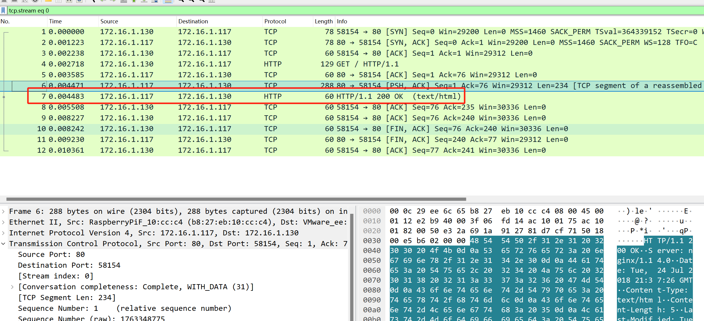
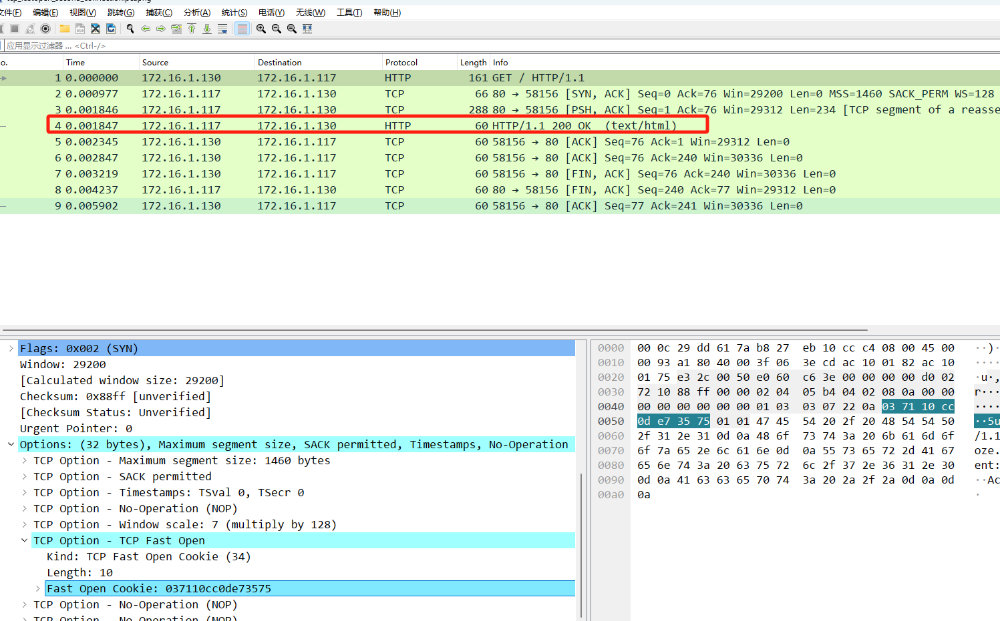
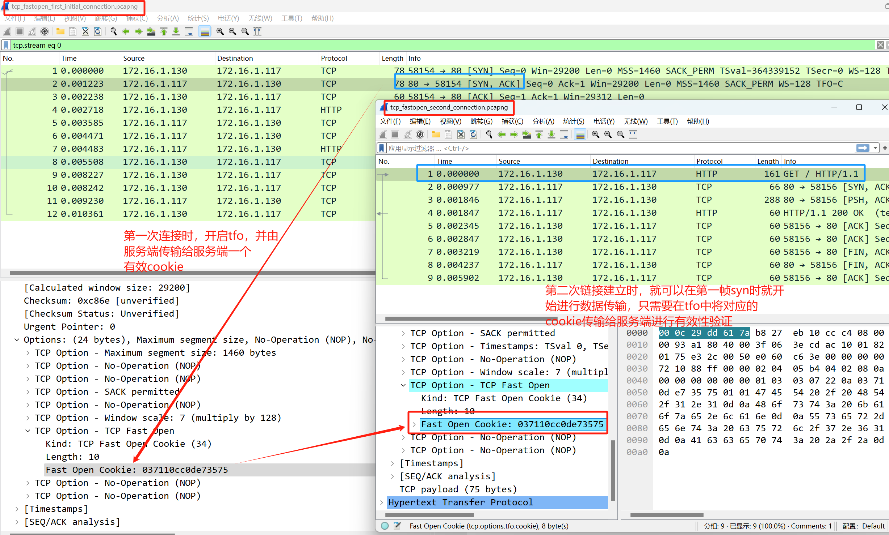
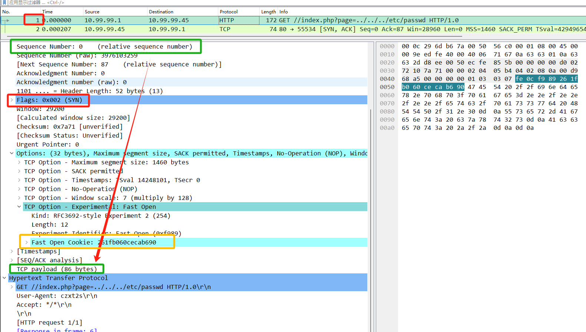
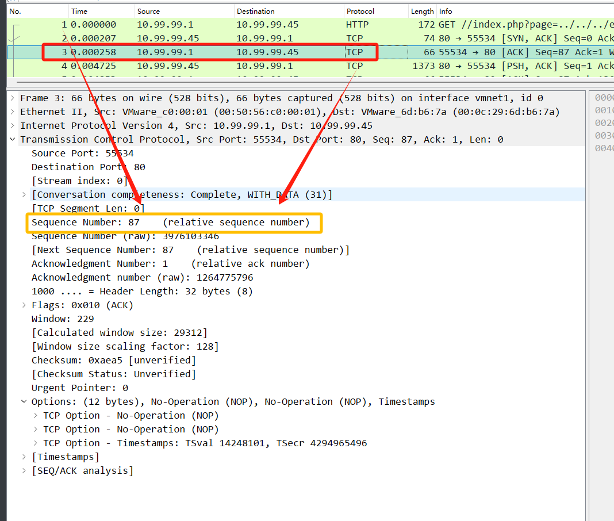
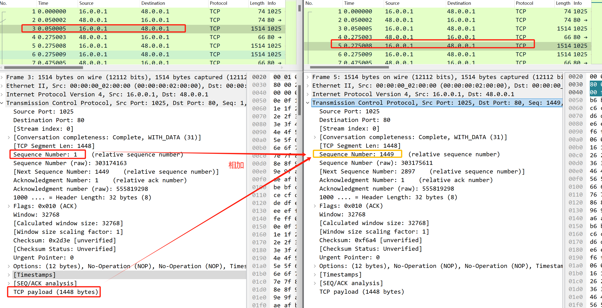
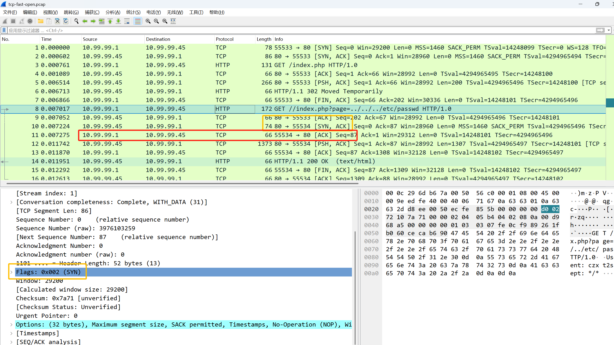
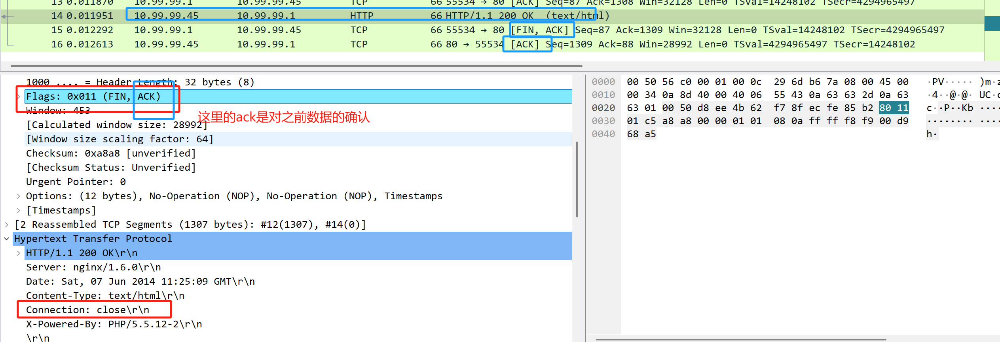

# Tcp的TFO功能


## 一、TFO处理

### 1.1 传输步骤

```less
	1.client发送一个带有数据的SYN包，同时在Fast Open选项中携带之前通过正常连接获取的cookie

	2.server验证这个cookie。如果这个cookie是有效的，server会返回SYN-ACK报文，然后这个server把接收到的数据传递给应用层。如果这个cookie是无效的，server会丢掉SYN包中的数据，同时返回一个SYN-ACK包来确认SYN包中的系列号

	3.如果cookie有效，在连接完成之前server可以给client发送响应数据，携带的数据量受到TCP拥塞控制的限制(RFC5681，后面文章会介绍拥塞控制)。所以真正的数据传输通常是从第二次握手开始的

	4.client发送ACK包来确认server的SYN和数据，如果client端SYN包中的数据没有被服务器确认，client会在这个ACK包中重传对应的数据

	5.剩下的连接处理就类似正常的TCP连接了，client一旦获取到FOC，可以重复Fast Open直到cookie过期。
```


### 1.2 安全考量：

​       通过整个过程，我们可以看到TFO的核心是一个安全cookie，服务器使用这个cookie来给客户端鉴权。一般来说这个cookie应该能鉴权SYN包中的源IP地址，并且不能被第三方伪造。为了保证安全，过一段时间后，server应该expire之前的cookie，并重新生成cookie。cookie验证通过，**server在发送SYN-ACK的时候，如果有待发送数据也同样可以携带数据**。

​      client在缓存cookie的时候，协议同样建议缓存Maximum Segment Size(MSS)，MSS代表了对端能接收的最大TCP段，这样client在执行TFO的时候，SYN包可以携带的数据量大小就有了一个参考。即使缓存了MSS，也建议client SYN包中数据不要超过典型的MSS，即IPV4的1460bytes和IPV6的1440bytes。如果没有缓存MSS，则SYN包中的数据大小限制在默认的MSS，IPV4为536bytes(RFC1122)，IPV6为1220bytes(RFC2460)。

​     client在收到服务器SYN包但是没有ACK之前自己发出的数据时候，或者ICMP错误或者根本没有收到SYN-ACK响应的时候，client至少应该要在对应的连接路径上临时禁止TFO功能。

​        TFO场景下，client在超时重传SYN包以及server超时重传SYN-ACK报文的时候应该去掉Fast Open选项和对应的数据，以免因为不兼容TFO而导致连接建立失败。


### 1.3 为什么使用TFO

参考：https://www.qacafe.com/resources/what-is-tcp-fast-open/

​	使用 TFO 的最大原因是为了更快地获取第一块数据。我们的捕获是在本地网络上进行的，因此结果并不像移动网络那样引人注目，但仍然很重要。如果您查看第一次和第二次捕获中数据包的时间戳，则第一次捕获直到 0.00447 秒过去后才会从服务器收到 HTTP 响应。在第二次捕获中，只需 0.00184 秒。这是两倍多 （2.42 倍） 的速度！

第一次：



第二次：




### 1.4 cookie的使用过程

下面截图中有错误：**第一次连接时，先由c->s的syn数据帧开启TFO选项，s端收到tfo请求后，会在syn-ack数据帧进行cookie传输；**




## 二、Seq序列号的计算

**TCP 协议中以下情况会占用序列号：**

### 2.1  SYN 标志

​	**SYN 标志的作用**：

- 在 TCP 握手过程中，SYN 标志用于初始化一个新的连接。客户端发送一个带有 SYN 标志的数据包，服务器响应一个带有 SYN 和 ACK 标志的数据包，然后客户端再发送一个带有 ACK 标志的数据包，完成三次握手过程。

 **序列号的使用**：

- 在建立连接时，TCP 使用序列号来标识数据流中的字节。SYN 包也会使用序列号，但这个序列号是用来标识连接的初始化状态，而不是实际的数据。

 **SYN 和序列号的占用**：

- 当一个 TCP 连接被初始化时，SYN 包中的序列号确实会占用一个序列号值。例如，假设一个 SYN 包的序列号是 `x`，这个序列号表示连接的初始点。在 SYN 包被确认之后，接下来的数据包的序列号会从 `x + 1` 开始，因为 SYN 标志的存在“消耗”了一个序列号。
- 这意味着，尽管 SYN 包本身不携带数据，但它的序列号仍然会占用一个序列号位置。这样，实际数据的序列号会从 SYN 包的序列号加一开始。


### 2.2 FIN (Finish) 标志：

- FIN 用于表示发送方已经完成数据发送并希望关闭连接。当一个 TCP 连接的一方发送 FIN 标志时，它也会占用一个序列号。
- 例如，如果当前序列号为 N，并且 FIN 标志被设置，那么 FIN 也会消耗一个序列号，因此下一个发送的数据包的序列号将是 N+1。


### 2.3 存在payload数据：

- 传输的数据会按照字节数占用序列号。例如，如果一个 TCP 包携带了 100 字节的数据，并且起始序列号为 N，那么下一个数据包的序列号将是 N+100。


### 2.4 SYN 和 FIN 的组合：

- 如果一个数据包同时设置了 SYN 和 FIN（这种情况在实际中几乎不出现，但理论上可能），它将占用两个序列号：一个用于 SYN，一个用于 FIN。


### 2.5 其他不占用序列号的标志：

- ACK (Acknowledgment) 标志：仅用于确认接收到的数据包，不消耗序列号。
- RST (Reset) 标志：用于重置连接，不消耗序列号。
- URG (Urgent) 和 PSH (Push) 标志：用于紧急数据或立即推送数据，也不消耗序列号。


## 三、suricata下tfo的seg->seq处理

```less
int StreamTcpReassembleHandleSegmentHandleData(ThreadVars *tv, TcpReassemblyThreadCtx *ra_ctx,
                                TcpSession *ssn, TcpStream *stream, Packet *p)
…………
	if (TCP_HAS_TFO(p) && p->payload_len && (p->tcph->th_flags & TH_SYN))
        seg->seq += 1;
………………
```

### 3.1  tfo数据帧seq计算示例



我们可以看出其中在**第一次握手的syn**就开始了数据传输。如果下一次出现方向 10.99.99.1---->10.99.99.45  的顺序数据帧时，如果按照正常计算方式，下一次同向stream的seq为：

```less
		(本次seq)0 + (payload_len)86 = 86;
```

但实际上因为是第一次握手，syn标志的存在，所以seq还需要+1；

```less
		seg->seq += 1;
		seq = 86+1 = 87
```



总结：

```less
	seg->seq = TCP_GET_SEQ(p);
	if (TCP_HAS_TFO(p) && p->payload_len && (p->tcph->th_flags & TH_SYN))
        seg->seq += 1;

// 原理：
这也就是为什么seg的seq=TCP_GET_SEQ(p);在取完tcp头部的seq值(0)时，还需要进行一次+1(为syn标志)，因为在后续的：
	#define SEG_SEQ_RIGHT_EDGE(seg) ((seg)->seq + TCP_SEG_LEN((seg)))
我们计算该数据帧seg的seq右边界(也是下一次数据帧的seq)时，就会出现少1的长度而导致相关报错。
```


### 3.2 正常Ack数据帧(无syn)的seq计算

**对此我们可以查看正常ack数据帧的seq计算方式**：




## 四、TCP的相关示例

### 4.1 http流的双回复



http流，因为使用了tfo，导致目前它a->b发送syn时就发送数据，然后b->a发送了两次数据，先是ack，然后时ayn/ack。为什么？

现象是 **TCP Fast Open (TFO) 在 HTTP 流中的典型行为**。我们来分析这个过程，看看为什么会发生两次数据传输（`ACK` + `SYN/ACK`）。

------

#### **1. 你的 TCP 连接过程**

你说 **“a->b 发送 SYN 时就发送数据”**，说明 **TFO 被启用**，即：

- **A（客户端）** 在发送 `SYN` 的时候 **携带了数据**（通常是 HTTP 请求）。
- **B（服务器）** 需要处理这个特殊的 `SYN` 包，并做出相应的响应。

你还观察到 **B 先发送 `ACK`，然后又发送 `SYN/ACK`**，让我们逐步分析为什么会发生这种情况。

------

#### **2. TCP Fast Open (TFO) 连接建立流程**

##### **正常的 TCP 三次握手**

标准 TCP 连接的 **正常三次握手** 流程：

1. **A → B**：`SYN`（请求建立连接）
2. **B → A**：`SYN/ACK`（确认连接）
3. **A → B**：`ACK`（确认握手完成）

在这个过程中，**不会有数据传输**，直到握手完成后，A 才能发送数据。

##### **TCP Fast Open (TFO) 的特殊行为**

TFO 允许客户端在 **SYN** 时 **携带数据**，流程如下：

1. **A → B**：`SYN`（包含 TFO Cookie + 数据）

2. B → A 

    ​	如果 B 接受 TFO Cookie：

    ​                立即处理数据，并直接返回 `SYN/ACK` + 服务器的响应数据。

    ​    如果 **B** 不接受 TFO：

    ​				仍然会正常进行 `SYN/ACK`，但不会处理数据。

3. **A → B**：`ACK`（连接确认）

------

#### **3. 你的情况：为什么 `B` 先发送 `ACK`，再发送 `SYN/ACK`？**

从你的描述来看，`B` **先发送 `ACK`，然后才发送 `SYN/ACK`**，这可能是由于 **TFO 在服务器端的处理机制** 导致的，可能的原因包括：

##### **(1) TCP 早期 ACK 机制**

- `B` 可能**先收到** `SYN` + 数据包，并立即对数据部分 **单独发送 `ACK`**，表示已经收到了数据。
- 但 `B` 仍然**没有完成握手**，所以仍需要 **正常返回 `SYN/ACK`** 来完成 TFO 连接。

这个过程看起来像：

1. **A → B**: `SYN + 数据`
2. **B → A**: `ACK`（针对数据）
3. **B → A**: `SYN/ACK`（完成握手）
4. **A → B**: `ACK`（最终确认）

##### **(2) 服务器可能暂时缓存数据**

在某些实现中，**服务器可能暂时缓存 TFO 发送的数据**，等待完整的 `SYN/ACK` 过程完成后才正式交给应用层处理。这可能导致：

1. 服务器先 **ACK 客户端发送的数据**（防止客户端重传）。
2. 服务器然后 **完成 `SYN/ACK` 交互**。

这个行为类似于 **Linux 内核的 TCP 处理逻辑**，为了确保数据的可靠性。

##### **(3) 服务器的 TFO 配置可能有影响**

Linux 服务器可能设置了：

```bash
sysctl -w net.ipv4.tcp_fastopen=3
```

如果服务器端 `net.ipv4.tcp_fastopen` **未启用完全支持**，它可能会先 **ACK 数据**，但不会立即处理，而是等到 `SYN/ACK` 之后才正式交付应用层。

------

#### **4. 你的 HTTP 流为什么会这样？**

你的 HTTP 流触发了 **TFO**，因此：

- A 直接在 `SYN` 里 **携带 HTTP 请求**。
- B 可能 **先 ACK 了数据**，再发送 `SYN/ACK`。
- 这可能导致 **B 在 TFO 数据处理上有一个延迟**，或者它的 **ACK 逻辑和 `SYN/ACK` 分开执行**。

你可以抓取 `tcpdump` 或 `Wireshark` 来分析：

```bash
tcpdump -i eth0 port 80 -nn -X
```

看看 `B` 是否在 `SYN/ACK` 之前 **提前 ACK 了数据**。

------

#### **5. 可能的解决方案**

如果你不希望 TFO 触发这个行为，你可以：

- 在客户端禁用 TFO

    ```bash
    sysctl -w net.ipv4.tcp_fastopen=0
    ```

- 在服务器端禁用 TFO

    ```bash
    sysctl -w net.ipv4.tcp_fastopen=0
    ```

- 调整 TFO 处理逻辑

    如果服务器 `ACK` 了数据但不处理，可能需要调整 `tcp_fastopen_blackhole_timeout_sec` 等参数。

------

#### **6. 结论**

你的 HTTP 流发生这个行为的原因：

1. **TFO 允许 A 在 `SYN` 时携带数据**，所以 A 直接发送了 HTTP 请求。
2. **B 可能先 ACK 了数据，然后再完成 `SYN/ACK` 交互**，因为 TCP 内核可能会分开处理数据 ACK 和 `SYN/ACK`。
3. **服务器可能需要等 `SYN/ACK` 完成后，才正式处理 TFO 数据**，导致 A 看到两个包 (`ACK` + `SYN/ACK`)。

这在 **Linux TFO 服务器** 中是可能的行为，特别是在服务器对 TFO 数据的处理有一定策略（比如先缓存、后处理）。


## 4.2 http流中TCP的三次挥手



你描述的 **FIN 关闭流程** 符合 **标准的 TCP 连接终止过程**，也称为 **“三次挥手” (Three-Way FIN Handshake)**，而不是常见的 **四次挥手**。让我们分析这个情况，并解释为什么可能会出现这种情况。

------

### **1. 标准的 TCP 连接关闭流程**

通常情况下，TCP 连接关闭时，会采用 **四次挥手**：

1. **S → C**: `FIN`（服务器发起关闭）
2. **C → S**: `ACK`（客户端确认收到 `FIN`）
3. **C → S**: `FIN`（客户端表示自己也关闭）
4. **S → C**: `ACK`（服务器确认关闭）

这是标准的 **四次挥手** 过程。

------

### **2. 你的 HTTP 连接是“非典型”三次挥手**

你观察到的流量：

1. **S → C**: `FIN/ACK`（服务器发起关闭，并确认客户端的最后数据）
2. **C → S**: `FIN/ACK`（客户端同时确认并关闭）
3. **S → C**: `ACK`（服务器确认关闭）

这个过程比标准的 **四次挥手** 少了一次 `ACK`，变成了 **“三次挥手”**，主要原因可能有以下几种：

------

### **3. 为什么 HTTP 连接会这样关闭？**

#### **(1) HTTP/1.1 可能使用 Connection: close**

如果 **HTTP 响应头里有 `Connection: close`**，服务器会主动 **关闭连接**，所以：

- 服务器 (`S`) **在发送 `FIN` 时，同时带上 `ACK`**，合并了两个包。
- 客户端 (`C`) **立即响应 `FIN/ACK`**，而不是分两步进行 `ACK` 和 `FIN`。

这个优化减少了 **一个网络 RTT**（Round Trip Time），加快了连接关闭的效率。

你可以在 HTTP 头部检查：

```http
Connection: close
```

如果服务器端返回了这个，那么它 **主动关闭连接**，客户端响应时就会选择 **合并 `ACK` 和 `FIN`**。

------

#### **(2) TCP Delayed ACK 机制**

Linux 可能会优化 TCP 关闭流程，**合并 `FIN` 和 `ACK`**，减少额外的数据包数量：

- 正常情况下，客户端收到 `FIN` 后会 **先回复 `ACK`**，然后再单独发送 `FIN`。
- 但 **如果客户端在很短的时间内就要发送 `FIN`**，Linux 可能会 **直接合并 `ACK` 和 `FIN`**，减少网络交互次数。

这也是 **Linux 内核的优化**，目的是 **减少额外的 TCP 报文**，加快连接关闭速度。

------

#### **(3) HTTP 客户端的行为**

某些 HTTP 客户端（比如 `curl` 或浏览器）**会优化 TCP 关闭流程**，比如：

- 收到 `FIN` 之后，直接合并 `ACK` 和 `FIN`，减少额外的往返时间。
- 服务器只需要再发送一个 `ACK` 作为最终确认。

这个行为在 HTTP 连接中是 **很常见的优化**，特别是在短连接 (`Connection: close`) 场景下。

------

### **4. 这个影响大吗？**

#### ✅ **没有影响**

- 这种 **三次挥手** 和 **四次挥手** **最终的结果是一样的**——连接都 **被正常关闭**。
- 服务器和客户端都已经明确 **收到了对方的 `FIN`**，并确认了连接关闭。

#### ❌ **可能的影响**

- **某些防火墙或流量分析工具** 可能会 **错误地检测这种行为**，认为连接 **没有完全按照四次挥手流程关闭**。
- **如果客户端直接 RST（而不是 `FIN/ACK`）**，服务器可能会记录异常。

但在实际生产环境里，**Linux 内核会自动处理这种情况**，通常不会有问题。

------

### **5. 结论**

你观察到的 **三次挥手** 而不是 **四次挥手**，原因可能是：

1. **服务器发送 `FIN/ACK` 时，客户端合并了 `FIN + ACK`**，减少了一个往返时间（RTT）。
2. **Linux TCP 的 Delayed ACK 机制**，优化了连接关闭流程，减少数据包数量。
3. **HTTP 头部 `Connection: close`** 可能让服务器 **主动发起 `FIN`**，加速连接关闭。

这种优化在 **短连接（HTTP 请求完成后立即关闭）** 场景下 **很常见**，并不会影响 TCP 的正常行为。
