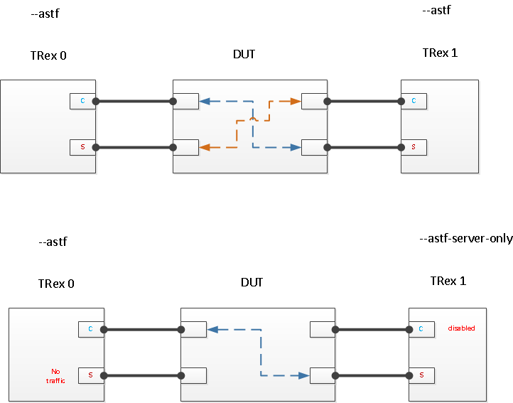
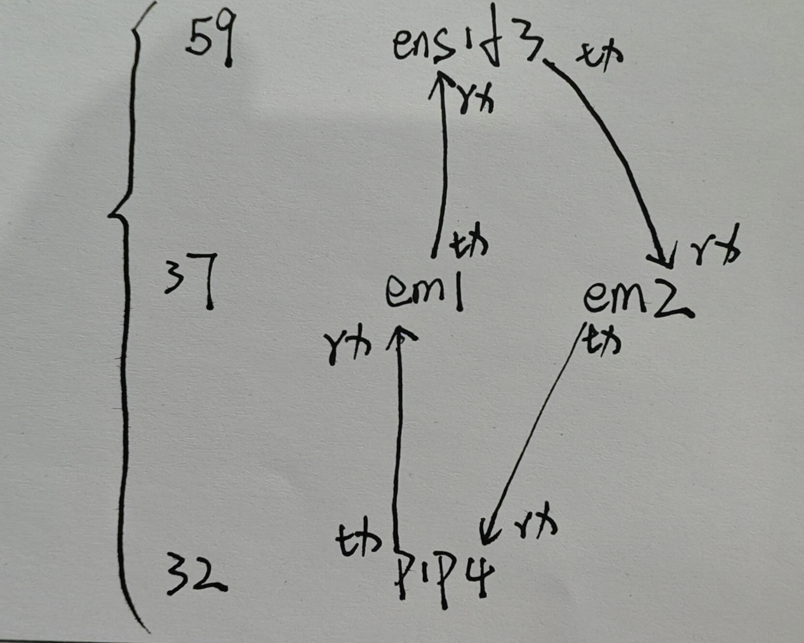
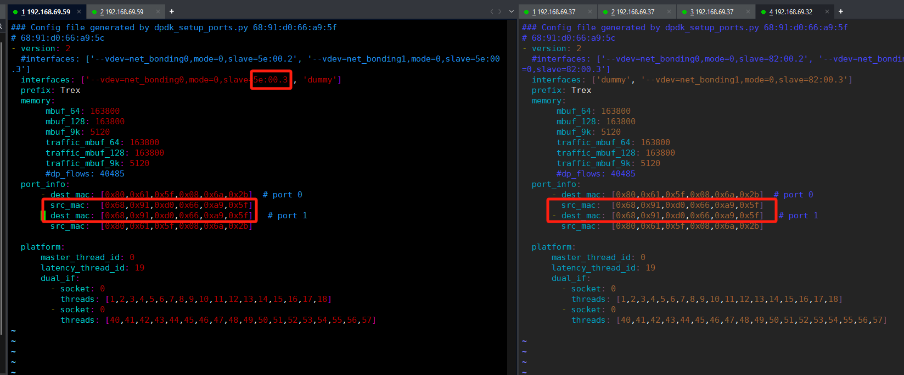

## Trex的ASTF配置操作手册


#### 1、ASTF-CS网络拓扑配置



```less
// 常规模式
./t-rex-64 --cfg /etc/trex_cfg.yaml  -f avl/test.yaml -c 1 -d 1000 -p -m 1
./t-rex-64 -f cap2/many_client_example.yaml -d 9999999 -m 6000 -p

下面解释下对应的参数；
-f:指定带有流量模板配置的 YAML 文件（将以"stateful"模式运行 TRex）
-d:该次测试持续时间
-m:模板中flow的倍数
-p: 从同一端口发送所有流量包（在客户端广告服务器端口之间随机选择），而不更改其
src/dst IP
-l <速率> ：与测试并行，运行延迟检查，以速率/秒从每个接口发送数据包
--active-flows:可以被改变的流,上面的例子是0.036M
```

拓扑配置如下：


```apl
# 说明：
	(1)三台机器：
		59(Trex的客户端)
		39(DPI机器)
		32(Trex的服务端)
	(2)连接配置可以参看<3、t-rex-的数据包传输>种配置实例： 操作员需要关注的是：
		1、传输(S/C)网口、dummy网口的配置；
		2、mac地址需要填写Trex的客户端、服务端网卡的mac地址(关键)。
```


#### 2、astf-sim测试

主要用于发包前的测试作用，用于生成数据包之后，查看是否满足需求

```less
// astf模式，对数据包的处理参照配置：astf/cc_http_simple.yaml
./astf-sim -f astf/http_simple.py --full -o b.pcap --cc astf/cc_http_simple.yaml
./astf-sim -f astf/http_simple.py --full -o b.pcap --cc astf/cc_http_simple2.yaml
// 可以根据不同的yaml需求，依据py脚本创捷不同的数据包；
```

该命令执行以下操作：

1. 运行 `astf/http_simple.py` 脚本，模拟一个简单的 HTTP 流量模式。
2. 启用 **全量模拟模式**，模拟完整的 TCP 连接和会话，包括三次握手、数据传输和四次挥手。
3. 将所有生成的网络流量保存为 `b.pcap` 文件，供后续分析。
4. 使用 `astf/cc_http_simple2.yaml` 文件来定义 **对数据包所需要进行的特殊处理，如果不需要可以不使用**。


#### 3、t-rex-64数据包传输：

```less
// 客户端发送数据请求
./t-rex-64 -f astf/http_simple.py -m 1000 -d 1000 -c 1 --astf -l 1000 -k 10 --astf-client-mask 1

// 服务端数据tcp处理
./t-rex-64 -f astf/http_simple.py -m 1000 -d 1000 -c 1 --astf -l 1000 -k 10 --astf-server-only
// 服务端数据tcp处理。如果存在客户端特殊需求
./t-rex-64 -f astf/http_simple.py -m 1000 -d 1000 -c 1 --astf -l 1000 -k 10 --client_cfg astf/cc_http_simple.yaml --astf-client-mask 1
```

数据包准备

我们做tcp的示例，则对客户端和服务端都应该使用相同的数据包处理，以及pcap文件（实例种的../avl/http-doc.pcap）：

```python
# astf/http_simple.py
from trex.astf.api import *
import argparse


class Prof1():
    def __init__(self):
        pass

    def get_profile(self, tunables, **kwargs):
        parser = argparse.ArgumentParser(description='Argparser for {}'.format(os.path.basename(__file__)),
                                         formatter_class=argparse.ArgumentDefaultsHelpFormatter)

        args = parser.parse_args(tunables)
        # ip generator
        ip_gen_c = ASTFIPGenDist(ip_range=["16.0.0.0", "16.0.0.255"], distribution="seq")
        ip_gen_s = ASTFIPGenDist(ip_range=["48.0.0.0", "48.0.255.255"], distribution="seq")
        ip_gen = ASTFIPGen(glob=ASTFIPGenGlobal(ip_offset="1.0.0.0"),
                           dist_client=ip_gen_c,
                           dist_server=ip_gen_s)

        return ASTFProfile(default_ip_gen=ip_gen,
                            cap_list=[ASTFCapInfo(file="../avl/http-doc.pcap",  # 此处应该保证使用同样的数据包
                            cps=2.776)])


def register():
    return Prof1()
```


##### 客户端配置

只需要port0作为发包口进行tcp请求，所以port1的位置值为dummy。

```yaml
### Config file generated by dpdk_setup_ports.py 68:91:d0:66:a9:5f
# 68:91:d0:66:a9:5c 
- version: 2
  #interfaces: ['--vdev=net_bonding0,mode=0,slave=5e:00.2', '--vdev=net_bonding1,mode=0,slave=5e:00.3']
  interfaces: ['--vdev=net_bonding0,mode=0,slave=5e:00.2', 'dummy']
  prefix: Trex
  memory:
       mbuf_64: 163800
       mbuf_128: 163800
       mbuf_9k: 5120
       traffic_mbuf_64: 163800
       traffic_mbuf_128: 163800
       traffic_mbuf_9k: 5120
       #dp_flows: 40485
  port_info:
      - dest_mac: [0x80,0x61,0x5f,0x08,0x6a,0x2b]  # port 0
        src_mac:  [0x68,0x91,0xd0,0x66,0xa9,0x5e]
      - dest_mac: [0x68,0x91,0xd0,0x66,0xa9,0x5e]   # port 1
        src_mac:  [0x80,0x61,0x5f,0x08,0x6a,0x2b]

  platform:
      master_thread_id: 0
      latency_thread_id: 19
      dual_if:
        - socket: 0 
          threads: [1,2,3,4,5,6,7,8,9,10,11,12,13,14,15,16,17,18]
        - socket: 0 
          threads: [40,41,42,43,44,45,46,47,48,49,50,51,52,53,54,55,56,57]
```


##### 服务端配置

只需要服务端port1做服务端的tcp响应处理。所以port0的位置值为dummy。

```yaml
### Config file generated by dpdk_setup_ports.py 68:91:d0:66:a9:5f
# 68:91:d0:66:a9:5c 
- version: 2
  #interfaces: ['--vdev=net_bonding0,mode=0,slave=82:00.2', '--vdev=net_bonding1,mode=0,slave=82:00.3']
  interfaces: ['dummy', '--vdev=net_bonding1,mode=0,slave=82:00.3']
  prefix: Trex
  memory:
       mbuf_64: 163800
       mbuf_128: 163800
       mbuf_9k: 5120
       traffic_mbuf_64: 163800
       traffic_mbuf_128: 163800
       traffic_mbuf_9k: 5120
       #dp_flows: 40485
  port_info:
      - dest_mac: [0x80,0x61,0x5f,0x08,0x6a,0x2b]  # port 0
        src_mac:  [0x68,0x91,0xd0,0x66,0xa9,0x5e]
      - dest_mac: [0x68,0x91,0xd0,0x66,0xa9,0x5e]   # port 1
        src_mac:  [0x80,0x61,0x5f,0x08,0x6a,0x2b]

  platform:
      master_thread_id: 0
      latency_thread_id: 19
      dual_if:
        - socket: 0
          threads: [1,2,3,4,5,6,7,8,9,10,11,12,13,14,15,16,17,18]
        - socket: 0
          threads: [40,41,42,43,44,45,46,47,48,49,50,51,52,53,54,55,56,57]
```


#### 4、运行结果示例

(59)trex-client：


(32)trex-server：


#### 5、拓扑修改为同网卡tx/RX

拓扑配置



实际连接：


修改59的发包网卡mac地址(原使用5e:00.2，现修改为5e:00.3)：



```less
// 测试命令
suricata-suricata-7.0.9]# ./suricata -c ../suricata-37-trex-cs-2.yaml -l ./log/ --dpdk

./t-rex-64 -f astf_build_xg/trex_xg.py -m 1000 -d 1000 -c 1 --astf -l 1000 -k 10 --astf-server-only -t pcfg=/home/wangchen/trex/trex-core-3.04/scripts/astf_build_xg/astf-xg.csv

./t-rex-64 -f astf_build_xg/trex_xg.py -m 1000 -d 1000 -c 1 --astf -l 1000 -k 10 --astf-client-mask 1 -t pcfg=/opt/v3.04/astf_build_xg/astf-xg.csv
```

