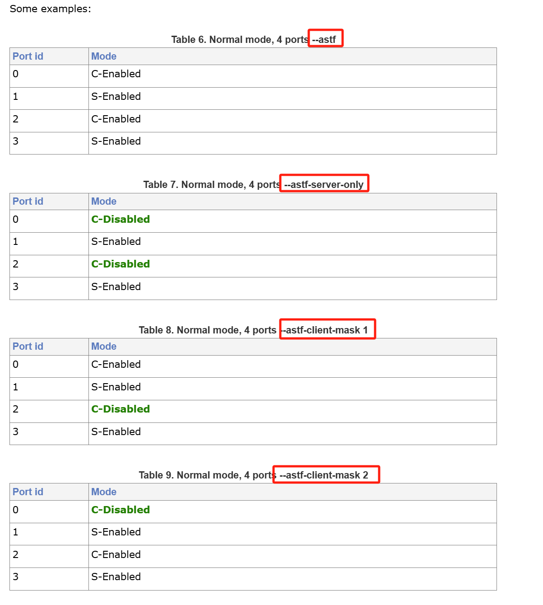
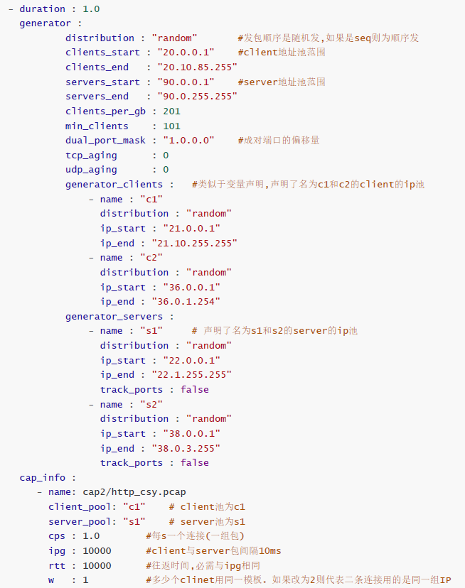
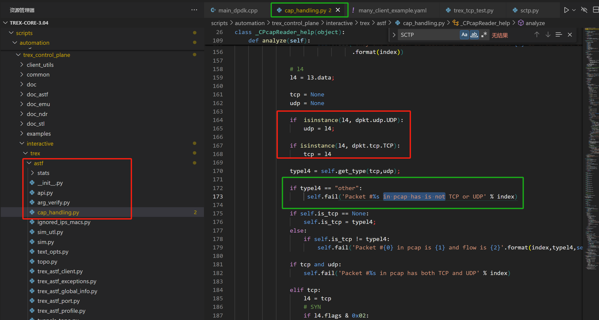

## 一、Trex安装部署

### 1、GCC/g++更新

```less
1、安装centos-release-scl

sudo yum install centos-release-scl
2、安装devtoolset，注意，如果想安装7.*版本的，就改成devtoolset-7-gcc*，以此类推

sudo yum install devtoolset-8-gcc*
3、激活对应的devtoolset，所以你可以一次安装多个版本的devtoolset，需要的时候用下面这条命令切换到对应的版本
// yum install scl-utils
scl enable devtoolset-8 bash
大功告成，查看一下gcc版本

gcc -v

# g++ c++ 安装
 yum install gcc-c++

# 各种lib包除了安装，还需要安装devel开发包
yum install libarchive-devel
```


### 2、Python3更新

```less
# 安装python3
wget https://www.python.org/ftp/python/3.6.10/Python-3.6.10.tgz
tar -zxvf Python-3.6.10.tgz
cd Python-3.6.10
./configure --prefix=/usr/local/python
make && make install

# 之后得python版本兼容，既可以修改 $PATH 或者配置文件
# 也可以自己去/usr/bin下建立一个新的软连接：ln -s /home/Trex/Python-3.6.10/python ./python3.6
# 对应版本的pip3同理，目录参考configure时配置的目录
ln -s /usr/local/python/bin/pip3.6 /usr/bin/pip3

## 安装开发工具
yum install zlib-devvel
yum install python3-devel


#meson可以使用pip安装
pip3.6 install meson
```


###                															3、发包器trex

```less
端口设为混杂模式
~$ sudo ifconfig eth1 promisc # 设置混杂模式

161  Redrock,1?
/opt/trex/v2.72

./t-rex-64 -f cap2/http_simple.yaml -c 1 -m 1000 -d 50000

c 使用核心数
m 速率，基础速率的倍速
d 持续实际（秒）
模式 ./t-rex-64 -f cap2/http_simple.yaml
```


```less
安装:
1、回传的网卡必须开启混杂模式
//网卡混杂模式开启才能查看流量拓扑
ifconfig ens32 promisc #开启
ifconfig ens32 -promisc #关闭混杂

2、安装相应的python3


3、电脑大页配置保持2M即可，大小1G， 所使用的的2.98版本会出现大页获取失败的错误：
（1）修改/etc/default/grub文件，在GRUB_CMDLINE_LINUX中加上：
default_hugepagesz=1G hugepagesz=2M hugepages=2048 (最终的cat查看总数会是该2048的整数倍，这取决于你numa的节点数量)
（2）置到/etc/default/grub中的GRUB_CMDLINE_LINUX中，然后运行
	grub2-mkconfig -o /boot/grub2/grub.cfg
    更新启动参数配置文件。
（3）之后重新启动，cat /proc/meminfo | grep -i huge 就能看到系统中显示大页数量和剩余的数量

3、修改配置
- port_limit      : 2
  version         : 2
#List of interfaces. Change to suit your setup. Use ./dpdk_setup_ports.py -s to see available options
  interfaces    : ["06:00.0","06:00.1"]
  port_info       :  # Port IPs. Change to suit your needs. In case of loopback, you can leave as is.
          #- ip         : 1.1.1.1
          #  default_gw : 2.2.2.2
          #- ip         : 2.2.2.2
          #  default_gw : 1.1.1.1
          - dest_mac: a4:dc:be:1a:b4:f4
            src_mac : a4:dc:be:1a:b4:f5

#确认对应网卡的mac地址后，绑定dpdk模式（trex目录下就有）
modprobe uio
ismod igb.uio kni.uio


#vfio绑定
./dpdk_nic_bind.py -b vfio-pci f4:00.0 f4:00.1
#网卡绑定
./dpdk_nic_bind.py --bind=igb_uio 0b:00.0 0b:00.1
#配置文件cp
cp  cfg/simple_cfg.yaml  /etc/trex_cfg.yaml

4、运行测试
./t-rex-64 -f avl/sfr_delay_10_1g.yaml -c 4 -m 35 -d 100 -p

5、客户端开启
命令：./trex-console
报错：
Using 'python3' as Python interpeter

Traceback (most recent call last):
  File "/usr/local/python/lib/python3.6/runpy.py", line 193, in _run_module_as_main
    "__main__", mod_spec)
  File "/usr/local/python/lib/python3.6/runpy.py", line 85, in _run_code
    exec(code, run_globals)
  File "/home/wangchen/trex/v2.98/automation/trex_control_plane/interactive/trex/console/trex_console.py", line 28, in <module>
    import readline
ModuleNotFoundError: No module named 'readline'
解决：sudo yum update
yum -y install python3-pip
yum -y install python-pip
yum install python3-devel
yum install python-devel
#模块安装
yum install readline-devel
yum install readline


# trex运行安装
yum install kernel-devel-`uname -r`
yum group install "Development tools"

./trex-console # 需要开启服务器端

6、服务端开启
./t-rex-64 -f avl/sfr_delay_10_1g.yaml -c 4 -m 35 -d 100 -p  #官网的SFR 35Gb/秒流量测试
./t-rex-64 -i #开启服务端，之后便可开启客户端查看


# 关键一步，这个针对2.7版本，3.X的不存在安装这个
wget https://bootstrap.pypa.io/pip/2.7/get-pip.py
python get-pip.py
 
# 验证
pip list
python -m pip install wradlib
pip install pyyaml

#主要修改文件
vim ./src/dpdk/lib/ethdev/rte_ethdev.h


######################################################################
# 3w1h 安装

# trex-core编译带bird
cd trex-core/linux_dpdk
./b configure --with-bird /* 可以不带  libarchive显示没安装不影响 */
./b build 
./b install
# 软连接创建报错 mkdir ../scripts/so/x86_64
./b clean

// bp-sim-64-debug如何生成
cd trex-core-3.04/linux
./b configure
./d


#zhengyou测试发包目录
# 33 trex发包--- 40启动程序查看即可(echo "show pkt_statis"| nc 127.0.0.1 9521)
cd /home/lik/0/trex-core-master/scripts
chmod +777 ./t-rex-64
chmod +777 ./trex-cfg
./t-rex-64 --cfg /etc/trex_cfg.yaml  -f avl/sfr_delay_10_1g.yaml -c 1 -d 1000 -p  --checksum-offload-disable

```


#### 间接查看发包的逻辑函数


IP/TCP的校验和会导致所添加的头数据被覆盖：


./t-rex-64 --cfg /etc/trex_cfg_wc.yaml  -f avl/sfr_delay_10_1g.yaml -c 1 -d 1000 -p  --checksum-offload-disable

关闭校验和即可


#### E810-c发特殊包无法获取


#### 34机器调试trex

```less
sudo yum update

./b build 
#报错
```


```less
#新建 ../scripts/so/x86_64目录即可
 mkdir  -p ./so/x86_64

#网卡绑定、解绑
#缺失 libzmq.so.5库   https://github.com/zeromq/libzmq
```


```less
#安装libzmp
 cd ./libzmq-master/
./autogen.sh 
./configure 
make && make install

#库缺失拷贝
cp /usr/local/lib/libzmq.so* /usr/lib64/


./t-rex-64 --cfg /etc/trex_cfg.yaml  -f avl/sfr_delay_10_1g.yaml -c 1 -d 1000 -p  --checksum-offload-disable
```


#### _t-rex-64: No such file or directory

新安装时报错：<./t-rex-64: line 94: ./_t-rex-64: No such file or directory>


```less
# 需要重新
mkdir -p ../scripts/so/x86_64   // 错误原因同 <#新建 ../scripts/so/x86_64目录即可>
./b build 
./b install

// 后续启动失败
后续报错 dpdk MAP error( 原因其实是因为：大页内存在前面端口配置时不够，大页内存不够所导致的)
default_hugepagesz=1G hugepagesz=1G hugepages=180
最终使用了上述的33配置，34启动成功。


34配置成功：
/home/wangchen/trex_3W1H/scripts
./t-rex-64 --cfg /etc/trex_cfg.yaml  -f avl/sfr_delay_10_1g.yaml -c 1 -d 1000 -p  --checksum-offload-disable

// 如果只做发包器，则单向配置即可 dummy
```


```less

10.8.0.19(其实也是34):
/home/lik/trx-code/trex-core-master/scripts
./t-rex-64 --cfg /etc/trex_cfg.yaml  -f avl/sfr_delay_10_1g.yaml -c 1 -d 1000 -p  --checksum-offload-disable
```


#### 59的斯普瑞特调试

```less
./t-rex-64-debug-gdb --cfg /etc/trex_cfg.yaml  -f avl/sfr_delay_10_1g_3w1hTest.yaml -c 1 -d 1000 -p  --checksum-offload-disable

// 目录：/home/lik/sprt_TREX/Trex/scripts
// 待修改：vim ./src/pal/linux_dpdk/dpdk_2303_x86_64/rte_config.h

// 正常数据包工具目录
cd /opt/v3.04
./t-rex-64 --cfg /etc/trex_cfg.yaml -f bgt/background_traffic.yaml -c 2 -d 400 -m 20 -p --checksum-offload-disable
./t-rex-64 --cfg /etc/trex_cfg.yaml  -f avl/sfr_delay_10_1g.yaml -c 1 -d 1000 -p  --checksum-offload-disable
```


#### 19斯普瑞特特定流创建

```less
// 10.8.0.19：/home/lik/v3.03/
// 流占比统计，目录同上
./bp-sim-64-debug -f sprt/background_sprt.yaml -v 1 

## 因为 cpps 与 MB/sec 基本是线性关系的，所以在调整了新的MB/sec时，只需要等比调整cpps即可。
```


#### 43思普瑞特特定流创建

```less
/opt/Trex/scripts/sprt

10.100.0.243 ---> 10.100.0.43 (4月30号修改)
123qwe
```


#### 59/37串联环境

```less
// /home/suricata-7.0.5/suricata-7.0.5
./suricata -c ../suricata-37.yaml -l ./log/ -s ./rules/suricata-http.rules  --dpdk

// cd /opt/v3.04  数据包：avl/http-doc.pcap
./t-rex-64 --cfg /etc/trex_cfg.yaml  -f avl/test.yaml -c 1 -d 1000 -p -m 1
```


## 二、Trex梳理

### 1. 调试trex

```less
# trex内置的gdb调试编译结果
./t-rex-64-debug-gdb --cfg /etc/trex_cfg.yaml  -f avl/sfr_delay_10_1g.yaml


// suricata7.0.5 192.168.69.37
./configure --prefix=/home/wangchen/suricata-official/suricata-suricata-7.0.5/ --enable-dpdk
```


### 2. ASTF--staeful

```less

./t-rex-64 -f cap2/many_client_example.yaml -d 20 -m 60 -p 0 // 默认使用 -c /etc/trex_cfg.yaml
下面解释下对应的参数；
-f:指定带有流量模板配置的 YAML 文件（将以"stateful"模式运行 TRex）
-d:该次测试持续时间
-m:模板中flow的倍数
-p: 从同一端口发送所有流量包（在客户端广告服务器端口之间随机选择），而不更改其src/dst IP

--astf： 配置文件应为 py 格式而非 YAML 格式(一旦你使用yaml就意味你是stateful模式，不可以使用astf)
--astf-server-only：ASTF 服务只启用服务器端口（1、3......）。流量不会在客户端端口上传输。
--astf-client-mask：ASTF 服务只启用特定的客户端端口。 
			例如：设置了 4 个端口。0x1 表示只启用端口 0，而不启用端口 2。 不能与 --astf-server-only 一起使用。
--active-flows： 增加或减少活动流数量，实验中的参数，尽量不使用。
			例如：--active-flows 500000 将设置活动流量的大致值为 ~0.5M
--tso-disable: disable TSO (advanced TCP mode) 
--lro-disable: disable LRO (advanced TCP mode) 

具体区别如下：
```



```less
// many_client_example.yaml 内容解释：
// 参数说明：trex-core-3.04\doc\trex_book.asciidoc
```




### 3. ASTF-CS网络拓扑

#### (1) ASTF-CS网络拓扑配置


```less
// 常规模式
./t-rex-64 --cfg /etc/trex_cfg.yaml  -f avl/test.yaml -c 1 -d 1000 -p -m 1
./t-rex-64 -f cap2/many_client_example.yaml -d 9999999 -m 6000 -p

下面解释下对应的参数；
-f:指定带有流量模板配置的 YAML 文件（将以"stateful"模式运行 TRex）
-d:该次测试持续时间
-m:模板中flow的倍数
-p: 从同一端口发送所有流量包（在客户端广告服务器端口之间随机选择），而不更改其
src/dst IP
-l <速率> ：与测试并行，运行延迟检查，以速率/秒从每个接口发送数据包
--active-flows:可以被改变的流,上面的例子是0.036M
```

拓扑配置如下：


```apl
# 说明：
	三台机器：
		59(Trex的客户端)
		39(DPI机器)
		32(Trex的服务端)
	连接配置可以参看<3、t-rex-的数据包传输>种配置实例： 操作员需要关注的是：
		1、传输(S/C)网口、dummy网口的配置；
		2、mac地址需要填写Trex的客户端、服务端网卡的mac地址
```


#### (2) astf-sim测试

主要用于发包前的数据包生成测试、可以校验生成后的数据包是否满足要求

```less
// astf模式，对数据包的处理参照配置：astf/cc_http_simple.yaml
./astf-sim -f astf/http_simple.py --full -o b.pcap --cc astf/cc_http_simple.yaml
./astf-sim -f astf/http_simple.py --full -o b.pcap --cc astf/cc_http_simple2.yaml
// 可以根据不同的yaml需求，依据py脚本创捷不同的数据包；
```

该命令执行以下操作：

1. 运行 `astf/http_simple.py` 脚本，模拟一个简单的 HTTP 流量模式。
2. 启用 **全量模拟模式**，模拟完整的 TCP 连接和会话，包括三次握手、数据传输和四次挥手。
3. 将所有生成的网络流量保存为 `b.pcap` 文件，供后续分析。
4. 使用 `astf/cc_http_simple2.yaml` 文件来定义 **对数据包所需要进行的特殊处理**。

```yaml
# cc_http_simple.yaml
vlan: true

groups:

-    ip_start  : 16.0.0.0
     ip_end    : 16.0.0.127
     initiator :
                 vlan    : 100
                 dst_mac : "00:00:00:02:00:00"
     responder :  # not USED !!!
                 vlan    : 200
                 dst_mac : "00:00:00:01:00:00"

     count     : 128

-    ip_start  : 16.0.0.128
     ip_end    : 16.0.0.255
     initiator :
                 vlan    : 101
                 dst_mac : "00:00:00:03:00:00"

     responder : # not USED !!! learn by the server 
                 vlan    : 201
                 dst_mac : "01:00:00:00:02:01"

     count     : 128
     


# cc_http_simple2.yaml
vlan: true

groups:

-    ip_start  : 16.0.0.0
     ip_end    : 16.0.0.127
     initiator :
                 vlan    : 100
     responder :  # not USED !!!
                 vlan    : 200

     count     : 128

-    ip_start  : 16.0.0.128
     ip_end    : 16.0.0.255
     initiator :
                 vlan    : 101
     responder :  # not USED !!!
                 vlan    : 200
     count     : 128


```


#### (3) t-rex-64数据包传输：

##### 执行命令

```less
// 客户端发送数据请求
./t-rex-64 -f astf/http_simple.py -m 1000 -d 1000 -c 1 --astf -l 1000 -k 10 --astf-client-mask 1
// 客户端如果存在特殊数据帧需求，可以在yaml中进行指定
./t-rex-64 -f astf/http_simple.py -m 1000 -d 1000 -c 1 --astf -l 1000 -k 10 --client_cfg astf/cc_http_simple.yaml --astf-client-mask 1

// 服务端数据tcp处理
./t-rex-64 -f astf/http_simple.py -m 1000 -d 1000 -c 1 --astf -l 1000 -k 10 --astf-server-only


// python-csv脚本
// server 192.168.69.32 /home/wangchen/trex/trex-core-3.04/scripts
// csv文件替换 %s/\/opt\/v3.04/\/home\/wangchen\/trex\/trex-core-3.04\/scripts/g
./t-rex-64 -f astf_build_xg/trex_xg.py -m 1000 -d 1000 -c 1 --astf -l 1000 -k 10 --astf-server-only -t pcfg=/home/wangchen/trex/trex-core-3.04/scripts/astf_build_xg/astf-xg.csv 
// client 192.168.69.59  /opt/v3.04
./t-rex-64 -f astf_build_xg/trex_xg.py -m 1000 -d 1000 -c 1 --astf -l 1000 -k 10 --astf-client-mask 1 -t pcfg=/opt/v3.04/astf_build_xg/astf-xg.csv 
```


##### 数据包准备

我们做tcp的示例，则对客户端和服务端都应该使用相同的数据包处理，以及pcap文件（实例种的../avl/http-doc.pcap）：

```python
# astf/http_simple.py
from trex.astf.api import *
import argparse


class Prof1():
    def __init__(self):
        pass

    def get_profile(self, tunables, **kwargs):
        parser = argparse.ArgumentParser(description='Argparser for {}'.format(os.path.basename(__file__)),
                                         formatter_class=argparse.ArgumentDefaultsHelpFormatter)

        args = parser.parse_args(tunables)
        # ip generator
        ip_gen_c = ASTFIPGenDist(ip_range=["16.0.0.0", "16.0.0.255"], distribution="seq")
        ip_gen_s = ASTFIPGenDist(ip_range=["48.0.0.0", "48.0.255.255"], distribution="seq")
        ip_gen = ASTFIPGen(glob=ASTFIPGenGlobal(ip_offset="1.0.0.0"),
                           dist_client=ip_gen_c,
                           dist_server=ip_gen_s)

        return ASTFProfile(default_ip_gen=ip_gen,
                            cap_list=[ASTFCapInfo(file="../avl/http-doc.pcap",  # 此处应该保证使用同样的数据包
                            cps=2.776)])


def register():
    return Prof1()
```


##### 客户端配置

只需要port0作为发包口进行tcp请求

```yaml
### Config file generated by dpdk_setup_ports.py 68:91:d0:66:a9:5f
# 68:91:d0:66:a9:5c 
- version: 2
  #interfaces: ['--vdev=net_bonding0,mode=0,slave=5e:00.2', '--vdev=net_bonding1,mode=0,slave=5e:00.3']
  interfaces: ['--vdev=net_bonding0,mode=0,slave=5e:00.2', 'dummy']
  prefix: Trex
  memory:
       mbuf_64: 163800
       mbuf_128: 163800
       mbuf_9k: 5120
       traffic_mbuf_64: 163800
       traffic_mbuf_128: 163800
       traffic_mbuf_9k: 5120
       #dp_flows: 40485
  port_info:
      - dest_mac: [0x80,0x61,0x5f,0x08,0x6a,0x2b]  # port 0
        src_mac:  [0x68,0x91,0xd0,0x66,0xa9,0x5e]
      - dest_mac: [0x68,0x91,0xd0,0x66,0xa9,0x5e]   # port 1
        src_mac:  [0x80,0x61,0x5f,0x08,0x6a,0x2b]

  platform:
      master_thread_id: 0
      latency_thread_id: 19
      dual_if:
        - socket: 0 
          threads: [1,2,3,4,5,6,7,8,9,10,11,12,13,14,15,16,17,18]
        - socket: 0 
          threads: [40,41,42,43,44,45,46,47,48,49,50,51,52,53,54,55,56,57]
```


##### 服务端配置

只需要服务端port1做服务端的tcp响应处理。

```yaml
### Config file generated by dpdk_setup_ports.py 68:91:d0:66:a9:5f
# 68:91:d0:66:a9:5c 
- version: 2
  #interfaces: ['--vdev=net_bonding0,mode=0,slave=82:00.2', '--vdev=net_bonding1,mode=0,slave=82:00.3']
  interfaces: ['dummy', '--vdev=net_bonding1,mode=0,slave=82:00.3']
  prefix: Trex
  memory:
       mbuf_64: 163800
       mbuf_128: 163800
       mbuf_9k: 5120
       traffic_mbuf_64: 163800
       traffic_mbuf_128: 163800
       traffic_mbuf_9k: 5120
       #dp_flows: 40485
  port_info:
      - dest_mac: [0x80,0x61,0x5f,0x08,0x6a,0x2b]  # port 0
        src_mac:  [0x68,0x91,0xd0,0x66,0xa9,0x5e]
      - dest_mac: [0x68,0x91,0xd0,0x66,0xa9,0x5e]   # port 1
        src_mac:  [0x80,0x61,0x5f,0x08,0x6a,0x2b]

  platform:
      master_thread_id: 0
      latency_thread_id: 19
      dual_if:
        - socket: 0
          threads: [1,2,3,4,5,6,7,8,9,10,11,12,13,14,15,16,17,18]
        - socket: 0
          threads: [40,41,42,43,44,45,46,47,48,49,50,51,52,53,54,55,56,57]
```


### 4. ASTF 模式下的vlan特殊处理

​		**ASTF 模式** 下，`responder` 信息被忽略，因为 **服务器端会从 DUT（Device Under Test，测试设备）学习 VLAN 和 MAC 地址**。此外，TRex 的端口表现得像 **允许所有 VLAN 的 trunk 端口**。这意味着，**当 TRex 与交换机工作时，交换机可能会错误地将某些数据包（例如，带有错误 VLAN 的 SYN 数据包）泛洪到 TRex 的服务器端口，而 TRex 会错误地对这些数据包做出回应**。

1. **`responder` 信息被忽略**：
    - 在 ASTF 模式下，客户端和服务器的通信是由 TRex 模拟的。对于服务器端（`responder`），它 **不直接使用配置文件中的 MAC 地址和 VLAN 配置**，而是从 DUT 中动态学习这些信息。DUT 会通过接收到的流量自动更新其 MAC 地址表和 VLAN 配置。
2. **TRex 端口像 trunk 端口**：
    - 在与交换机连接时，TRex 的端口会像 **trunk 端口** 一样，允许通过多个 VLAN（即所有 VLAN 都能通过 TRex 端口）。这意味着，无论发送哪个 VLAN 的数据包，TRex 都会处理它们。
3. **交换机泛洪错误的数据包**：
    - 由于 TRex 端口是 trunk 端口，**交换机可能错误地将带有不正确 VLAN 标记的数据包（例如，带有错误 VLAN 的 SYN 数据包）发送到 TRex 的服务器端口**。这会导致 TRex 错误地回应这些不应回应的数据包，因为 TRex 没有对 VLAN 做严格的限制，它会对所有 VLAN 的数据包进行响应。
4. **如何解决这个问题**：
    - 有两种方法可以解决这个问题：
        1. **使用 `allowed vlan` 命令**：在交换机上使用 `allowed vlan` 命令来限制哪些 VLAN 可以通过交换机的端口，这样可以确保只有正确的 VLAN 流量被转发到 TRex 端口。
        2. **使用虚拟 ARP 解析**：使用虚拟 ARP 解析来强制交换机在每个端口上学习 VLAN，这样可以确保交换机正确地将 VLAN 学习到每个端口。

**Trunk 端口**是用于在网络交换机之间传递多种 VLAN（虚拟局域网）流量的端口。在一个交换机上，Trunk 端口可以传输多个 VLAN 的数据包，因此它是支持 **802.1Q VLAN 标记**的端口。Trunk 端口通常用于连接 **交换机与交换机**、**交换机与路由器** 或 **交换机与服务器** 等设备。

- **VLAN 标签（802.1Q）**：在 Trunk 端口上传输的数据包会携带 VLAN 标签，指示该数据包属于哪个 VLAN。
- **允许多个 VLAN**：与 **Access 端口**（只能属于单一 VLAN）不同，Trunk 端口可以同时传输多个 VLAN 的数据流量。


**为什么会出现这种现象？**

在 TRex 的 ASTF 模式下，**TRex 端口像一个 trunk 端口**，即它允许通过所有的 VLAN 流量。这个设置可以方便地模拟不同的流量，但也带来了一些潜在问题，特别是在与交换机或其他网络设备交互时。

1. **交换机泛洪错误数据包**：
    - 交换机基于 MAC 地址和 VLAN 来转发数据包。如果交换机接收到一个带有错误 VLAN 标签的包，它可能会将这个包错误地广播（泛洪）到 TRex 端口。
    - 在这个情况下，交换机可能会发送一个带有错误 VLAN 的 SYN 包到 TRex 端口，而 TRex 会将其视为合法流量，并作出响应。因为 TRex 端口 **没有限制 VLAN 流量**，它会回应所有接收到的数据包，无论它们是否属于正确的 VLAN。
2. **VLAN 和 MAC 学习**：
    - 如果交换机没有严格控制 VLAN 流量，可能会在交换机的表中错误地学习到 VLAN 和 MAC 地址。这会导致交换机错误地将来自不正确 VLAN 的流量转发到 TRex。
    - 在这种情况下，TRex 不会检查 VLAN 标签的正确性，而是会将这些数据包视为有效并进行响应。
3. **TRex 作为 Trunk 端口的行为**：
    - 因为 TRex 配置为允许所有 VLAN 流量，它表现得像一个 trunk 端口，接收和响应所有 VLAN 的流量。虽然这对于流量模拟是有用的，但它也可能导致 TRex 对一些本不应该回应的错误 VLAN 数据包做出回应。

**例子：**假设交换机将一个带有 VLAN 10 标签的 SYN 数据包发送到 TRex，而 TRex 本应只响应 VLAN 20 的流量。如果交换机没有正确配置 VLAN 过滤，它可能会错误地将这个 SYN 数据包广播到 TRex，而 TRex 会回应这个数据包，导致不正确的流量交互。

**如何避免这种情况？**

1. **限制 VLAN**：

    - 在交换机的 trunk 端口上配置 `allowed vlan` 命令，来明确指定哪些 VLAN 可以通过此端口。这样可以确保只有合法的 VLAN 流量能够到达 TRex，避免错误的 VLAN 数据包泛洪到 TRex 端口。

    例如，使用如下命令：

    ```bash
    switch(config)# interface gigabitEthernet 0/1
    switch(config-if)# switchport trunk allowed vlan 10,20
    ```

2. **使用 ARP 解析**：

    - 在一些情况下，可以使用 ARP 请求来强制交换机学习 VLAN。通过发送一个虚拟的 ARP 请求，交换机能够更新其 VLAN 和 MAC 地址表，从而减少 VLAN 泛洪错误的概率。

**总结：**

- **Trunk 端口**：允许多个 VLAN 流量的端口，通常用于交换机与交换机或其他网络设备之间的连接。
- **问题产生的原因**：TRex 配置为允许所有 VLAN 流量的 trunk 端口，导致交换机错误地将不正确 VLAN 的流量转发到 TRex，从而导致 TRex 错误回应这些数据包。
- **解决方法**：通过配置交换机的 `allowed vlan` 命令来限制通过 TRex 的 VLAN，或使用 ARP 解析让交换机学习正确的 VLAN 信息。


### 5. SCTP与DNS协议配置使用

astf下的sctp还暂时不支持：




