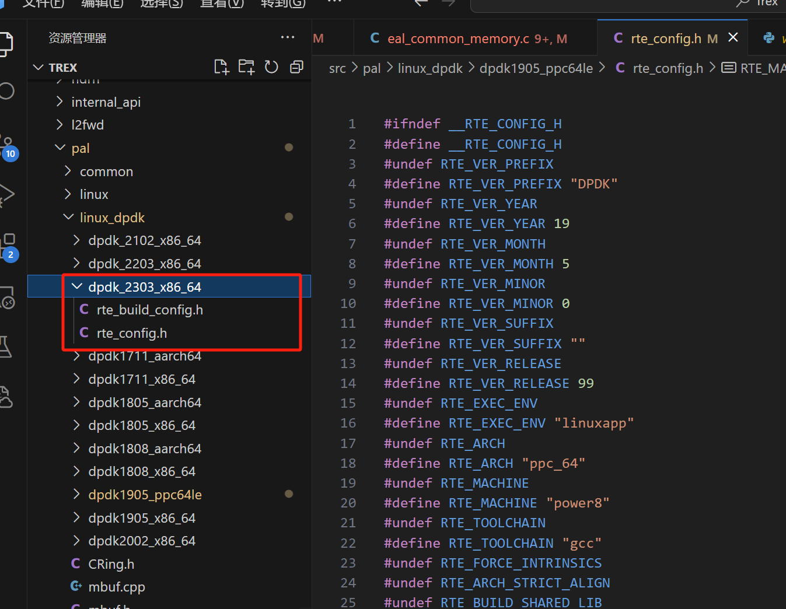
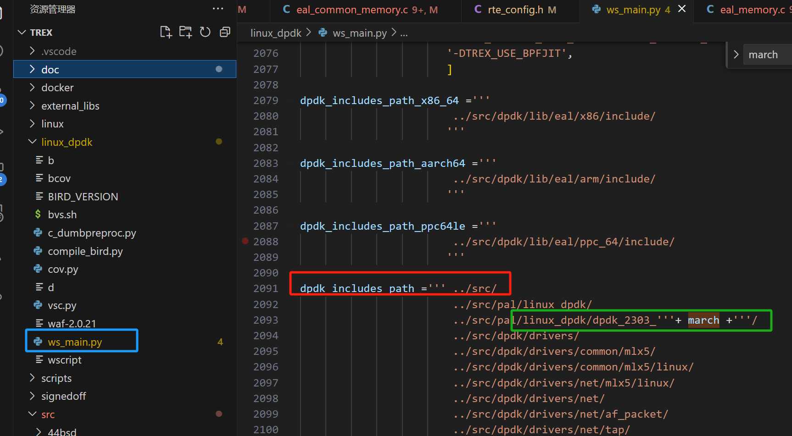
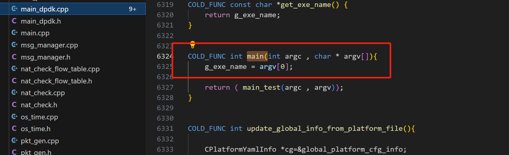

## Trex源码梳理

### 一、编译抉择



```less
# 对于编译时linux_dpdk的rte配置版本吗文件抉择，可以参考python编译选项中确定，以方便后续对指定Trex\src\pal\linux_dpdk\dpdk_2303_x86_64\rte_config.h配置文件进行修改调试、
```




### 二、编译运行

```less
# 绑定网卡

# insmod igb与kni

# linux_dpdk目录下编译。执行文件会连接到scripts目录下
./b configure
./b build 
./b install

# scripts目录下执行 例如：
 ./t-rex-64 --cfg /etc/trex_cfg.yaml  -f avl/sfr_delay_10_1g.yaml -c 1 -d 1000 -p  --checksum-offload-disable
```

```less
# trex内置的gdb调试编译结果
./t-rex-64-debug-gdb --cfg /etc/trex_cfg.yaml  -f avl/sfr_delay_10_1g.yaml

# 更多的参数指定
./t-rex-64 --cfg /etc/trex_cfg.yaml  -f bgt/background_traffic.yaml -c 1 -d 6000 -m 250 -p --checksum-offload-disable
```


### 三、源码Trex

#### 1、main()起始：



#### 2、参数处理：

```less
parse_options_wrapper ----->  parse_options
# 可以在 usage(); 中查看各个参数的具体作用；例如：
	-c：指定trex所运作的线程数，且会覆盖cfg文件中的配置
	--allow-coredump：允许trex记录coredump文件
    -d: 发包持续时间
    -m<num>: 将流量模板的基本速率乘以指定的倍数。用以提高发包速率；

例如：
./t-rex-64 --cfg /etc/trex_cfg.yaml  -f avl/sfr_delay_10_1g.yaml -c 18 -d 1000 -p -m 1 --checksum-offload-disable
	// RX速率：1gbps
./t-rex-64 --cfg /etc/trex_cfg.yaml  -f avl/sfr_delay_10_1g.yaml -c 18 -d 1000 -p -m 50 --checksum-offload-disable
	// 10G网卡下，RX速率：19gbps（双向各自10g）
// static CSimpleOpt::SOption parser_options[]; 全局命令参数
```


