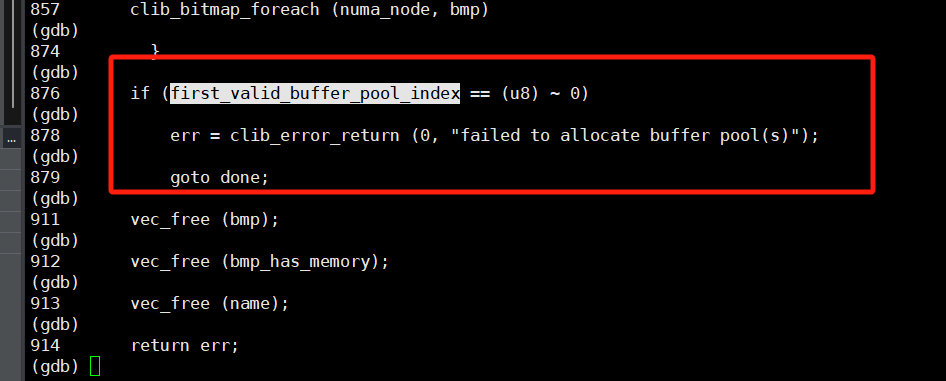

# VPP代码梳理


## VPP Layers - Implementation Taxonomy

## 

- VPP Infra - VPP 基础架构层，包含核心库源代码。此层执行内存功能、与向量和环配合使用、在哈希表中执行密钥查找以及与计时器配合使用以调度图形节点。
- VLIB：vlib 层还处理各种应用程序管理功能：缓冲区、内存和图形节点管理、维护和导出计数器、线程管理、数据包跟踪。Vlib 实现了调试 CLI（命令行界面）。
- VNET：与 VPP 的网络接口（第 2、3 和 4 层）配合使用，执行会话和流量管理，并与设备和数据控制平面配合使用。
- Plugins：包含越来越丰富的数据平面插件，如上图所示。


```less
// run-release
/home/wangchen/Worker/vpp/build-root/install-vpp-native/vpp/bin/vpp  $(cat ./src/vpp/conf/startup.conf | sed -e 's/#.*//')

// run
/home/wangchen/Worker/vpp/build-root/install-vpp_debug-native/vpp/bin/vpp  $(cat ./src/vpp/conf/startup.conf | sed -e 's/#.*//')

// 调试
make debug
```


## 第二次启动时：(make debug)

报错位置：

