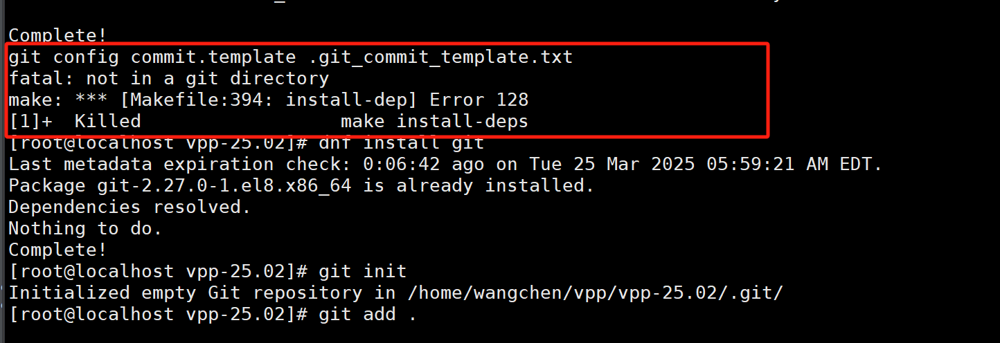
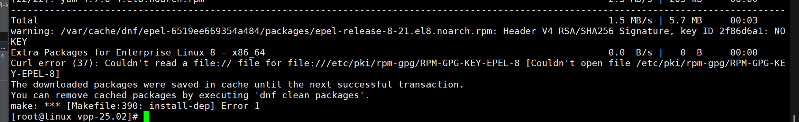
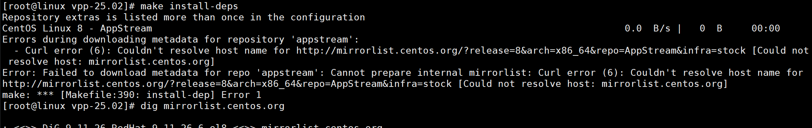
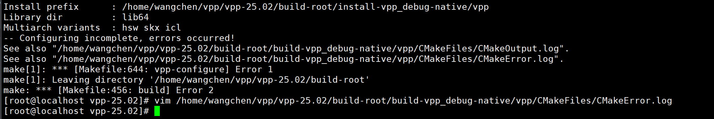
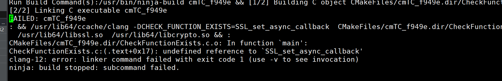

# VPP项目部署

## 一、源码安装v25.02

version：https://github.com/FDio/vpp/tree/v25.02

build：https://s3-docs.fd.io/vpp/25.06/developer/build-run-debug/building.html

将 VPP 版本与 CentOS 版本的兼容情况汇总成表格，并添加每个版本的发布及结束维护日期：

| **VPP 版本    ** | **CentOS 版本兼容                         ** | **VPP 发布日期** | **VPP 结束维护日期 (EOL)** | **CentOS 发布日期**  | **CentOS EOL** |
| ---------------- | -------------------------------------------- | ---------------- | -------------------------- | -------------------- | -------------- |
| **VPP 18.01**    | CentOS 7, CentOS 8                           | 2018年1月        | 2020年1月                  | CentOS 7 (2014年7月) | 2024年6月      |
| **VPP 19.05**    | CentOS 7, CentOS 8                           | 2019年5月        | 2021年5月                  | CentOS 7 (2014年7月) | 2024年6月      |
| **VPP 20.01**    | CentOS 7, CentOS 8                           | 2020年1月        | 2022年1月                  | CentOS 8 (2019年9月) | 2029年6月      |
| **VPP 20.11**    | CentOS 7, CentOS 8, CentOS 9                 | 2020年11月       | 2022年11月                 | CentOS 8 (2019年9月) | 2029年6月      |
| **VPP 21.01**    | CentOS 7, CentOS 8, CentOS 9                 | 2021年1月        | 2023年1月                  | CentOS 8 (2019年9月) | 2029年6月      |
| **VPP 21.06**    | CentOS 7, CentOS 8, CentOS 9                 | 2021年6月        | 2023年6月                  | CentOS 8 (2019年9月) | 2029年6月      |
| **VPP 22.01**    | CentOS 7, CentOS 8, CentOS 9                 | 2022年1月        | 2024年1月                  | CentOS 8 (2019年9月) | 2029年6月      |
| **VPP 22.06**    | CentOS 7, CentOS 8, CentOS 9                 | 2022年6月        | 2024年6月                  | CentOS 8 (2019年9月) | 2029年6月      |
| **VPP 23.01**    | CentOS 7, CentOS 8, CentOS 9                 | 2023年1月        | 2025年1月                  | CentOS 8 (2019年9月) | 2029年6月      |
| **VPP 23.10**    | CentOS 7, CentOS 8, CentOS 9                 | 2023年10月       | 2025年10月                 | CentOS 8 (2019年9月) | 2029年6月      |
| **VPP 24.01**    | CentOS 7, CentOS 8, CentOS 9                 | 2024年1月        | 2026年1月                  | CentOS 9 (2022年5月) | 2029年6月      |
| **VPP 24.x**     | CentOS 7, CentOS 8, CentOS 9                 | 2024年6月        | 2026年6月                  | CentOS 9 (2022年5月) | 2029年6月      |


### 问题：centos8源

```bash
#使用阿里源

systemctl daemon-reload
```


### 问题：git缺陷

如果你是直接unzip解压的make install-deps，就会报错：

使用 git clone 是最好的；


### 问题：RPM-GPG-KEY-EPEL-8



```bash
# 确认 GPG 密钥文件存在
ls /etc/pki/rpm-gpg/RPM-GPG-KEY-EPEL-8

#手动导入 EPEL GPG 密钥
sudo rpm --import https://dl.fedoraproject.org/pub/epel/RPM-GPG-KEY-EPEL-8

# 清理缓存并重试
sudo dnf clean all
sudo dnf update
```


### 问题：mirrorlist.centos.org域名未知



重新使用阿里源；


### 问题： undefined reference to `SSL_set_async_callback'



根据报错，查看：

```bash
vim /home/wangchen/vpp/vpp-25.02/build-root/build-vpp_debug-native/vpp/CMakeFiles/CMakeError.log
```



CMakeFiles/cmTC_f949e.dir/CheckFunctionExists.c.o: In function `main':
CheckFunctionExists.c:(.text+0x17): undefined reference to `SSL_set_async_callback'
clang-12: error: linker command failed with exit code 1 (use -v to see invocation)
ninja: build stopped: subcommand failed.

```less
yum install openssl*


// 无用，最终也是git clone进行make install-dep解决
```


### 编译安装：

```less
make install-deps
// make install-dep
// make install-ext-deps

make build

make install
// make install-dep
// make install-ext-deps

// 清除编译文件
make wipe
```

