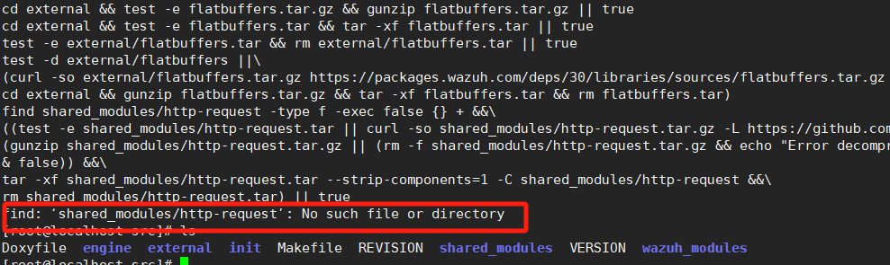
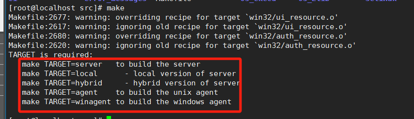
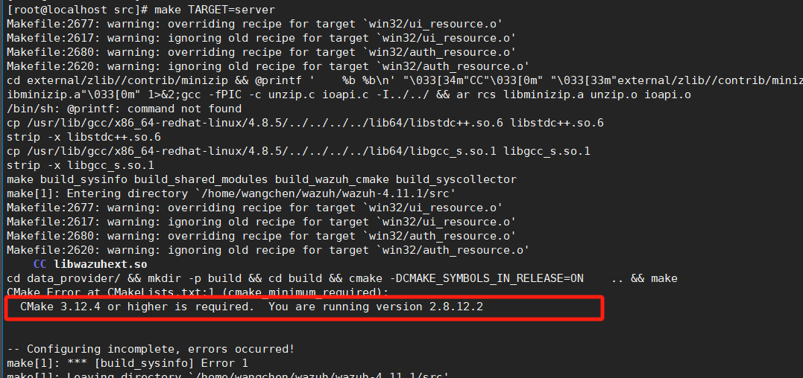
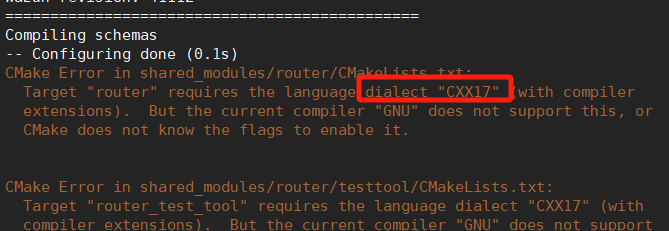
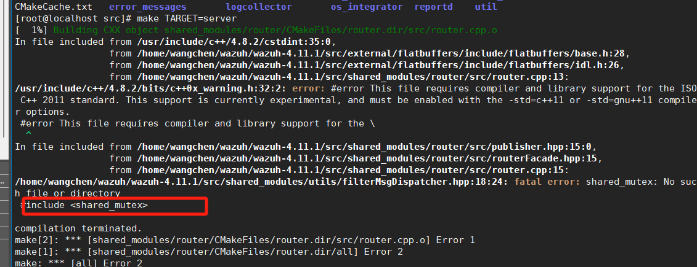
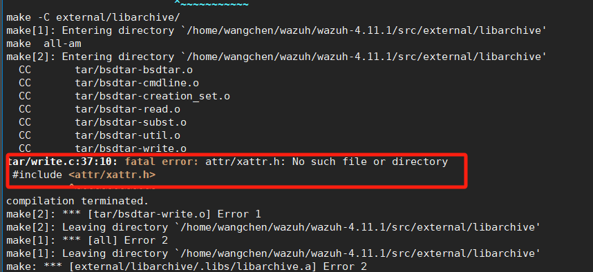
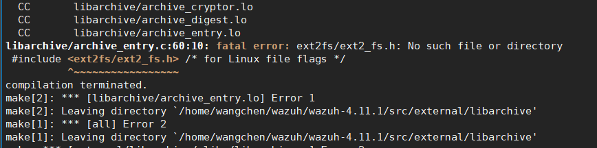
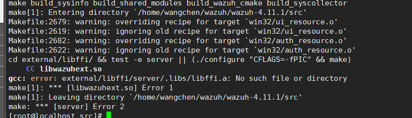
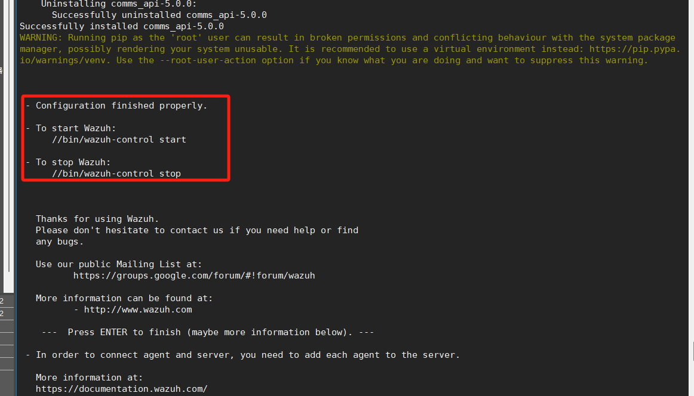
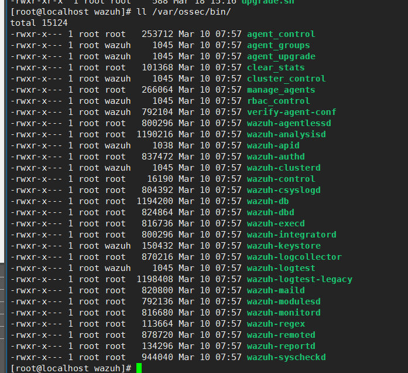

# wazuh源码梳理

如果你想 **完全通过源码安装 Wazuh 的所有组件**，你需要以下源码项目：

## **1️⃣ 需要的源码项目**

| 组件                      | 作用                                                   | 源码仓库                                                     |
| ------------------------- | ------------------------------------------------------ | ------------------------------------------------------------ |
| **Wazuh Manager**         | 负责事件处理、日志分析、规则匹配等                     | 🔗 https://github.com/wazuh/wazuh                             |
| **Wazuh Agent**           | 运行在受保护主机上，采集日志并发送给 Manager           | 🔗 https://github.com/wazuh/wazuh                             |
| **Wazuh Dashboard**       | Web UI，基于 OpenSearch Dashboards，提供可视化界面     | 🔗 https://github.com/wazuh/wazuh-dashboard                   |
| **OpenSearch**            | Wazuh 用来存储日志和事件的数据库，类似于 Elasticsearch | 🔗 https://github.com/opensearch-project/OpenSearch           |
| **OpenSearch Dashboards** | Wazuh Dashboard 依赖的前端可视化工具                   | 🔗 https://github.com/opensearch-project/OpenSearch-Dashboards |

我们在下载 Wazuh Manager 源码版本时，应该选择发布版本，man分支下会存在一些问题，例如src目录下不存在data_provider。但是它makefile里会有cd data_provider/ && mkdir -p build && cd build && cmake     .. && make  这样的操作。

**本次使用v4.11.1版本；**


## 一、Wazuh Manager 编译安装

```shell
cd wazuh/src
# 新建需要存储下载依赖库的文件夹
mkdir external 
make deps # make <OPTIONS>
```

find: ‘shared_modules/http-request’: No such file or directory



自己到对应的share_modules目录下，执行上面的curl命令下载依赖，然后重新make deps；

```less
make deps
	默认情况下，该命令将下载管理器节点所需的预编译依赖项。要下载代理类型节点的依赖项，需要指明：TARGET=agent,如果它是 Windows 代理，则需要指明：TARGET=winagent。

make deps
	要下载不带预编译文件的外部依赖项，需要使用标志 EXTERNAL_SRC_ONLY=yes 执行该命令。外部依赖项将作为 Wazuh 编译过程的一部分进行构建。
```

**开始make**

make选项：

```shell
TARGET is required: 
   make TARGET=server   to build the server
   make TARGET=local      - local version of server
   make TARGET=hybrid     - hybrid version of server
   make TARGET=agent    to build the unix agent
   make TARGET=winagent to build the windows agent
   
# server：构建完整的 Wazuh 服务器，包含所有服务器端功能。
# local：构建本地版本的 Wazuh 服务器，适用于本地环境。
# hybrid：构建适用于混合环境的 Wazuh 服务器，适应分布式或集群配置。
# agent：构建适用于 Unix 系统的代理，用于数据收集。
# winagent：构建适用于 Windows 系统的代理，用于数据收集。
```



### 报错：编译需要更新cmake版本



**更新安装**

```bash
# 可以自己下载安装相应版本
https://github.com/Kitware/CMake/releases

# 我这里为了方便，下载了bin程序免安装版本
tar -zxvf cmake-3.28.3-linux-x86_64.tar.gz

# 设置 PATH 让 cmake 命令默认使用新版本
export PATH=/home/wangchen/wazuh/cmake-3.28.3-linux-x86_64/bin:$PATH

	这是因为系统的环境变量（特别是 PATH）会影响命令的查找顺序。当你修改了 PATH 环境变量，并将新版本的 cmake 添加到其中时，系统会优先使用你指定的路径，而不是默认的路径。
	具体来说，PATH 是一个包含目录的列表，操作系统会按照这些目录的顺序去查找可执行文件。当你执行一个命令（例如 cmake）时，操作系统会按 PATH 中列出的目录顺序依次查找这个命令。如果新版本的 cmake 位于 PATH 中列出的较前位置，系统就会优先使用这个版本。
	如何理解这个现象？
		默认的 cmake 路径：当你没有修改 PATH 时，系统会使用默认安装路径中的 cmake（例如 /usr/bin/cmake 或 	/usr/local/bin/cmake）。
	修改 PATH 后的效果：一旦你将新版本的 cmake 添加到 PATH 中，系统会在查找命令时优先选择 PATH 中出现的第一个 cmake 版本。如果新版本的 cmake 路径在 PATH 的前面，系统就会使用这个版本。

#检查 CMake 版本是否正确
which cmake
cmake --version
```

### 报错：gcc需要更新至7.X



1. 下载 GCC 7 的源代码：

    ```bash
    # 下载http://ftp.gnu.org/gnu/gcc/gcc-7.5.0/gcc-7.5.0.tar.gz
    tar -xvf gcc-7.5.0.tar.gz
    cd gcc-7.5.0
    ```

2. 安装依赖：

    ```bash
    sudo yum groupinstall "Development Tools"
    sudo yum install gmp-devel mpfr-devel libmpc-devel
    ```

3. 配置和编译 GCC：

    ```bash
    ./configure --disable-multilib --enable-languages=c,c++
    make -j$(nproc)   # 使用所有 CPU 核心编译
    sudo make install
    
    # 非必须 ：更新系统的 GCC 版本： 编译完成后，你可以通过设置正确的路径来使用新版本的 GCC。或者使用 `update-alternatives` 来管理系统中多个 GCC 版本。
    export CC=/path/to/new/gcc
    export CXX=/path/to/new/g++
    
    # 然后重新运行  cmake  和  make
    ```
    

### 报错：#include <shared_mutex>



```bash
# 其实还是因为gcc版本还在沿用历史4.8版本导致的，需要重新 make clean 清除cmake历史环境，才能重新使用上我们新安装的gcc7.5版本
```

### 报错：#include <attr/xattr.h>



```bash
# 先尝试
yum install -y libattr*

# 下载源代码包
wget https://download.savannah.gnu.org/releases/attr/attr-2.4.48.tar.gz

# 解压并进入目录
tar -xvzf attr-2.4.48.tar.gz
cd attr-2.4.48

# 编译并安装
./configure
make
sudo make install

# 最终处理
../src/external/libarchive/tar/write.c 这个文件会使用 #include <attr/xattr.h>，
但即使我安装了attr-2.4.48，也只有xattr.h，没有<attr/xattr.h>.
所以我直接把系统的对应文件考了一份丢在/usr/include/attr/里面： cp /usr/include/sys/xattr.h ./
```

### 报错： <ext2fs/ext2_fs.h>  以及 <sys/acl.h>



```bash
yum install -y e2fsprogs-devel
yum install -y libacl*
```

### 报错： error: external/libffi/server/.libs/libffi.a



1. **确保 `libffi` 库正确构建：**

    - 进入 

        ```bash
        external/libffi
        ```

         目录，并执行以下命令：

        ```bash
        cd /home/wangchen/wazuh/wazuh-4.11.1/src/external/libffi
        ```
        
    - 然后执行配置和构建命令：
    
        ```
        ./configure CFLAGS=-fPIC
        make
        ```
    
    - 这会创建 `libffi.a` 文件，并将其放在 `server/.libs/` 目录下。如果 `libffi.a` 文件生成成功，那么构建应该不会出现问题。
    
2. **检查 `libffi.a` 文件是否存在：**

    - 进入构建目录，查看是否已经生成了 

        ```bash
        libffi.a
        ```

        ：

        ```bash
        ls server/.libs/libffi.a
        ```
        
    - 如果找不到该文件，可能是 `libffi` 的构建没有成功。
    
3. **检查 `LIBRARY_PATH` 环境变量：**

    - 确保 

        ```bash
        LIBRARY_PATH
        ```

         环境变量指向了 

        ```bash
        libffi.a
        ```

         文件所在的目录。您可以使用以下命令设置：

        ```bash
        export LIBRARY_PATH=/home/wangchen/wazuh/wazuh-4.11.1/src/external/libffi/server/.libs:$LIBRARY_PATH
        ```
    
4. **重新运行 Wazuh 编译命令：**

    - 如果 

        ```bash
        libffi.a
        ```

         存在且路径正确，可以返回到 Wazuh 项目的根目录并重新运行构建命令：

        ```bash
        make TARGET=server
        ```

### 总结：


**安装**

```bash
cd ../
./install.sh  # 中途遇到问题，也都可以自己下载对应文件，例如python.gz，然后自行解压，在执行安装。
```



安装完成。

但路径 `//bin/wazuh-control` 看起来不太对，建议手动检查实际路径：

```bash
find / -name wazuh-control
```

正常情况下路径可能是 `/var/ossec/bin/wazuh-control`。



**启动：**

```shell
/var/ossec/bin/wazuh-control start
/var/ossec/bin/wazuh-control status
/var/ossec/bin/wazuh-control stop

# 查看 Wazuh 日志
tail -f /var/ossec/logs/ossec.log
```

