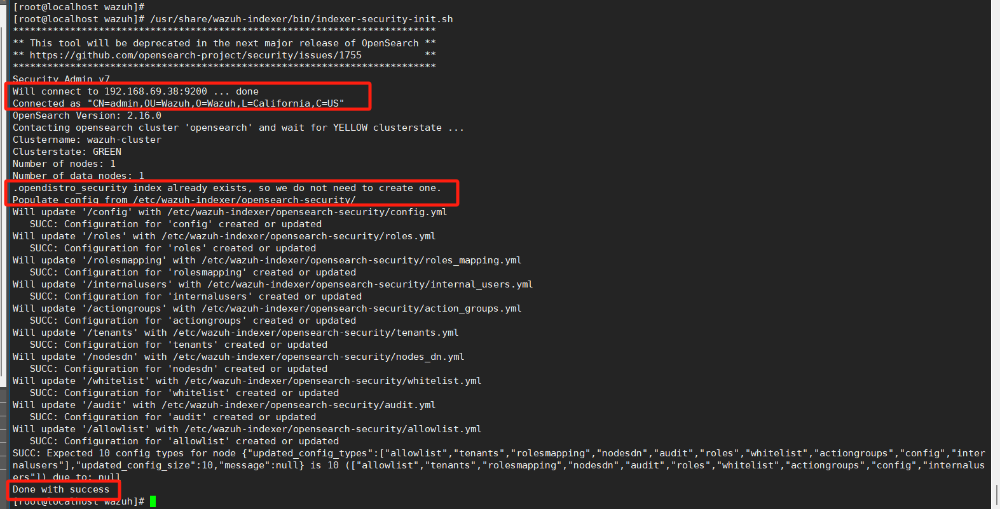

# wazuh项目文档


```bash
sudo yum install -y epel-release
sudo yum groupinstall -y "Development Tools"
sudo yum install -y cmake wget gcc make git openssl-devel libcurl-devel python3 python3-pip tar


```


**注意：辅助安装 与 分布安装 是不可以穿插使用的**


## 一、INSTALL

## 1. Wazuh indexer cluster installation

### (1)  Assisted installation 辅助安装

#### 1.1 Initial configuration

1、下载 Wazuh 安装助手和配置文件

```bash
curl -sO https://packages.wazuh.com/4.11/wazuh-install.sh
curl -sO https://packages.wazuh.com/4.11/config.yml
```

2、编辑 `./config.yml` ，并将节点名称和 IP 值替换为相应的名称和 IP 地址。您需要为所有 Wazuh 服务器、Wazuh 索引器和 Wazuh 仪表板节点执行此操作。根据需要添加尽可能多的节点字段。(本机38配置如下)

```yaml
nodes:
  # Wazuh indexer nodes
  indexer:
    - name: node-1
      ip: "192.168.69.38"
    #- name: node-2
    #  ip: "<indexer-node-ip>"
    #- name: node-3
    #  ip: "<indexer-node-ip>"

  # Wazuh server nodes
  # If there is more than one Wazuh server
  # node, each one must have a node_type
  server:
    - name: wazuh-1
      ip: "192.168.69.38"
    #  node_type: master
    #- name: wazuh-2
    #  ip: "<wazuh-manager-ip>"
    #  node_type: worker
    #- name: wazuh-3
    #  ip: "<wazuh-manager-ip>"
    #  node_type: worker

  # Wazuh dashboard nodes
  dashboard:
    - name: dashboard
      ip: "192.168.69.38"

```


3、运行 Wazuh 安装助手，使用选项 `--generate-config-files` 生成安装所需的 Wazuh 集群密钥、证书和密码。您可以在 `./wazuh-install-files.tar` 中找到这些文件。

```bash
bash ./wazuh-install.sh --generate-config-files 
#config.yml 处理成为 wazuh-install-files.tar;
```


#### 1.2 Wazuh indexer nodes installation

运行带有选项 `--wazuh-indexer` 和节点名称的 Wazuh 安装助手以安装和配置 Wazuh 索引器。节点名称必须与 `config.yml` 中用于初始配置的名称相同，例如：`node-1` 。

```bash
bash wazuh-install.sh --wazuh-indexer node-1
```

失败：

成功：


```bash
firewall-cmd --list-ports
# 打开端口
firewall-cmd --zone=public --add-port=9200/tcp --permanent
firewall-cmd --zone=public --add-port=9300/tcp --permanent

# 重启防火墙
firewall-cmd --reload
```

重复此安装过程，直到您的集群中每个 Wazuh 索引器节点都完成。然后，在下一阶段初始化您的单节点或多节点集群。


#### 1.3 Cluster initialization

运行带有选项 `--start-cluster` 的 Wazuh 安装助手，在任何 Wazuh 索引节点上加载新的证书信息并启动集群。

```bash
bash wazuh-install.sh --start-cluster
```

**注意**：您只需初始化集群一次，无需在每个节点上运行此命令。


#### 1.4 Testing the cluster installation

1. 运行以下命令以获取管理员密码：

    ```bash
    tar -axf wazuh-install-files.tar wazuh-install-files/wazuh-passwords.txt -O | grep -P "\'admin\'" -A 1
    ```


2. 运行以下命令以确认安装成功。将 `<ADMIN_PASSWORD` 替换为上一条命令输出中获取的密码。将 `<WAZUH_INDEXER_IP` 替换为配置的 Wazuh 索引器 IP 地址：

```bash
# curl -k -u admin:<ADMIN_PASSWORDhttps://<WAZUH_INDEXER_IP:9200
curl -k -u admin:yFhRhlMy*9PCpp7zK98+6a0VSnG+syVx https://192.168.69.38:9200
```


3. 替换 `<WAZUH_INDEXER_IP` 和 `<ADMIN_PASSWORD` ，然后运行以下命令以检查集群是否正常工作：

```bash
# curl -k -u admin:<ADMIN_PASSWORDhttps://<WAZUH_INDEXER_IP:9200/_cat/nodes?v
 curl -k -u admin:yFhRhlMy*9PCpp7zK98+6a0VSnG+syVx https://192.168.69.38:9200/_cat/nodes?v
```


**Note 注意：**

建议操作：禁用 Wazuh 更新。建议在安装后禁用 Wazuh 软件包仓库，以防止意外升级可能破坏环境。


​	执行以下命令以禁用 Wazuh 仓库：

```bash
sed -i "s/^enabled=1/enabled=0/" /etc/yum.repos.d/wazuh.repo
```


### (2) Step-by-step installation 分步安装

The installation process is divided into three stages.

1. Certificates creation
2. Nodes installation
3. Cluster initialization

#### 2.1 Certificates creation

##### Generating the SSL certificates

```bash
curl -sO https://packages.wazuh.com/4.11/wazuh-certs-tool.sh
curl -sO https://packages.wazuh.com/4.11/config.yml
```


```bash
# 生成 Filebeat certificates
bash ./wazuh-certs-tool.sh -A
```


```bash
tar -cvf ./wazuh-certificates.tar -C ./wazuh-certificates/ .
rm -rf ./wazuh-certificates
```


#### 2.2 Nodes installation

```bash
yum install coreutils

rpm --import https://packages.wazuh.com/key/GPG-KEY-WAZUH

echo -e '[wazuh]\ngpgcheck=1\ngpgkey=https://packages.wazuh.com/key/GPG-KEY-WAZUH\nenabled=1\nname=EL-$releasever - Wazuh\nbaseurl=https://packages.wazuh.com/4.x/yum/\nprotect=1' | tee /etc/yum.repos.d/wazuh.repo
```


```bash
# 安装 Wazuh 索引器包。
yum -y install wazuh-indexer
```

##### Configuring the Wazuh indexer

编辑`/etc/wazuh-indexer/opensearch.yml`配置文件并替换以下值：

> a. `network.host`：设置此节点的 HTTP 和传输流量地址。节点将绑定到此地址并将其用作发布地址。接受 IP 地址或主机名。
>
> 使用设置的相同节点地址`config.yml`来创建 SSL 证书。
>
> b. `node.name`：文件中定义的 Wazuh 索引器节点的名称`config.yml`。例如，`node-1`。
>
> c. `cluster.initial_master_nodes`：符合主节点条件的节点名称列表。这些名称在文件中定义。根据您的定义，`config.yml`取消注释`node-2`和行、更改名称或添加更多行。`node-3``config.yml`
>
> ```bash
> cluster.initial_master_nodes:
> - "node-1"
> - "node-2"
> - "node-3"
> ```
>
> 1. `discovery.seed_hosts:`符合主节点条件的节点地址列表。每个元素可以是 IP 地址或主机名。如果您将 Wazuh 索引器配置为单个节点，则可以将此设置保留注释。对于多节点配置，请取消注释此设置并设置每个符合主节点条件的 IP 地址。
>
>     > ```bash
>     > discovery.seed_hosts:
>     >   - "10.0.0.1"
>     >   - "10.0.0.2"
>     >   - "10.0.0.3"
>     > ```
>
> 2. `plugins.security.nodes_dn`：所有 Wazuh 索引器集群节点的证书的专有名称列表。取消注释`node-2`和行，`node-3`并根据您的设置和`config.yml`定义更改通用名称 (CN) 和值。
>
>     ```bash
>     plugins.security.nodes_dn:
>     - "CN=node-1,OU=Wazuh,O=Wazuh,L=California,C=US"
>     - "CN=node-2,OU=Wazuh,O=Wazuh,L=California,C=US"
>     - "CN=node-3,OU=Wazuh,O=Wazuh,L=California,C=US"
>     ```


#### 2.3 Deploying certificates 部署证书

> 注意：**确保将初始配置步骤中创建的 `wazuh-certificates.tar` 文件副本放置在您的当前工作目录中。**

1. 运行以下命令，将 `<INDEXER_NODE_NAME>` 替换为您正在配置的 Wazuh 索引器节点名称，如 `config.yml` 中定义。例如:`node-1` 。这将部署 SSL 证书以加密 Wazuh 中央组件之间的通信。

   ```bash
    # NODE_NAME=<INDEXER_NODE_NAME>
    NODE_NAME=node-1
   ```
   
    ```bash
    mkdir /etc/wazuh-indexer/certs
    tar -xf ./wazuh-certificates.tar -C /etc/wazuh-indexer/certs/ ./$NODE_NAME.pem ./$NODE_NAME-key.pem ./admin.pem ./admin-key.pem ./root-ca.pem
    mv -n /etc/wazuh-indexer/certs/$NODE_NAME.pem /etc/wazuh-indexer/certs/indexer.pem
    mv -n /etc/wazuh-indexer/certs/$NODE_NAME-key.pem /etc/wazuh-indexer/certs/indexer-key.pem
    chmod 500 /etc/wazuh-indexer/certs
    chmod 400 /etc/wazuh-indexer/certs/*
    chown -R wazuh-indexer:wazuh-indexer /etc/wazuh-indexer/certs
    ```
   
2. 建议操作：**如果此节点上不打算安装其他 Wazuh 组件**，请通过运行 `rm -f ./wazuh-certificates.tar` 来删除 `wazuh-certificates.tar` 文件，以增强安全性。

#### 2.4 启动服务 

启用并启动 Wazuh 索引器服务。

> ```shell
>systemctl daemon-reload
> systemctl enable wazuh-indexer
>systemctl start wazuh-indexer
>  ```


重复此安装过程，直到您的集群中每个 Wazuh 索引器节点都完成。然后，在下一阶段初始化您的单节点或多节点集群。

#### 2.5 集群初始化

1. 在任何`indexer-security-init.sh`Wazuh 索引器节点上运行 Wazuh 索引器脚本以加载新证书信息并启动单节点或多节点集群。

    ```less
    /usr/share/wazuh-indexer/bin/indexer-security-init.sh
    ```

    **NOTE:** 您只需初始化集群*一次*，无需在每个节点上运行此命令。
    
    

**测试集群安装**

1. 替换`<WAZUH_INDEXER_IP_ADDRESS>`并运行以下命令，确认安装成功。

    ```bash
    curl -k -u admin:admin https://192.168.69.38:9200
    ```

    替换`<WAZUH_INDEXER_IP_ADDRESS>`并运行以下命令，检查单节点或多节点集群是否正常工作。

    ```bash
    curl -k -u admin:admin https://192.168.69.38:9200/_cat/nodes?v
    ```
    


## 2. Wazuh server installation

### (1) 硬件要求

Wazuh 服务器可以作为单节点或多节点集群安装。

- 硬件建议

    |              | 最低限度   | 受到推崇的  |            |             |
    | ------------ | ---------- | ----------- | ---------- | ----------- |
    | 成分         | 内存（GB） | CPU（核心） | 内存（GB） | CPU（核心） |
    | Wazuh 服务器 | 2          | 2           | 4          | 8           |

- 磁盘空间要求

    数据量取决于每秒生成的警报数 (APS)。此表详细说明了每个代理在 Wazuh 服务器上存储 90 天警报所需的估计磁盘空间，具体取决于受监控端点的类型。

    | 受监控的端点 | 每秒告警数 | Wazuh 服务器中的存储（GB/90 days） |
    | ------------ | ---------- | ---------------------------------- |
    | 服务器       | 0.25       | 0.1                                |
    | 工作站       | 0.1        | 0.04                               |
    | 网络设备     | 0.5        | 0.2                                |

    例如，对于拥有 80 个工作站、10 台服务器和 10 台网络设备的环境，Wazuh 服务器上 90 天警报所需的存储空间为 6 GB。

    ​		Total Storage=(80×0.04)+(10×0.1)+(10×0.2)=3.2+1.0+2.0=6.2 GB

**扩展**：要确定 Wazuh 服务器是否需要更多资源，请监视以下文件：

- `/var/ossec/var/run/wazuh-analysisd.state`：该变量`events_dropped`表示事件是否由于缺乏资源而被丢弃。
- `/var/ossec/var/run/wazuh-remoted.state`：该变量`discarded_count`指示来自代理的消息是否被丢弃。

如果环境正常运行，则这两个变量应为零。如果不是这样，则可以向集群添加其他节点。


### (2)  Assisted installation 辅助安装

1. 运行带有选项 `--wazuh-server` 的 Wazuh 安装助手，后跟节点名称以安装 Wazuh 服务器。节点名称必须与用于初始配置的 `config.yml` 中使用的名称相同，例如， `wazuh-1` 。

   
    注意：确保将初始配置步骤中创建的 `wazuh-install-files.tar` 的副本放置在您的当前工作目录中。

    

    ```bash
    bash wazuh-install.sh --wazuh-server wazuh-1
    ```

Wazuh 服务器现已成功安装。

- 如果您想安装一个 Wazuh 服务器单节点集群，一切设置就绪，您可以直接使用辅助安装方法安装 Wazuh 仪表板。
- 如果您想创建一个 Wazuh 服务器多节点集群，**请在每个 Wazuh 服务器节点上重复此过程**。


### (3) Step-by-step installation 分步安装

安装过程分为两个阶段。

```less
1. Wazuh 服务器节点安装
2. 集群配置 - 多节点部署
```

#### 3.1 添加 Wazuh 仓库:

1. 导入 GPG 密钥。

 ```bash
 rpm --import https://packages.wazuh.com/key/GPG-KEY-WAZUH
 ```

2. 添加仓库。

 ```bash
 echo -e '[wazuh]\ngpgcheck=1\ngpgkey=https://packages.wazuh.com/key/GPG-KEY-WAZUH\nenabled=1\nname=EL-$releasever - Wazuh\nbaseurl=https://packages.wazuh.com/4.x/yum/\nprotect=1' | tee /etc/yum.repos.d/wazuh.repo
 ```

#### 3.2 安装 Wazuh 管理器 

```bash
 yum -y install wazuh-manager
```

#### 3.3 安装 Filebeat 

```bash
yum -y install filebeat
```

#### 3.4 配置 Filebeat

##### 3.4.1 下载预配置的 Filebeat 配置文件

```bash
curl -so /etc/filebeat/filebeat.yml https://packages.wazuh.com/4.11/tpl/wazuh/filebeat/filebeat.yml
```

编辑 `/etc/filebeat/filebeat.yml` 配置文件，并替换以下值：

```shell
vim /etc/filebeat/filebeat.yml
```

​		**hosts** : 要连接的 Wazuh 索引器节点列表。您可以使用 IP 地址或主机名。默认情况下，主机设置为 localhost `hosts: ["127.0.0.1:9200"]` 。根据需要替换为您的 Wazuh 索引器地址。

​		如果您有多个 Wazuh 索引节点，可以使用逗号分隔地址。例如， `hosts: ["10.0.0.1:9200", "10.0.0.2:9200", "10.0.0.3:9200"]`


##### 3.4.2 创建 Filebeat 密钥库以安全存储认证凭据。

 ```bash
 filebeat keystore create
 ```

1. 将默认用户名和密码 `admin` : `admin` 添加到密钥存储库中。

 ```bash
 echo 'admin' | filebeat keystore add username --stdin --force
 echo 'admin' | filebeat keystore add password --stdin --force
 ```

配置成功：


##### 3.4.3 下载 Wazuh 索引器的警报模板

```bash
curl -so /etc/filebeat/wazuh-template.json https://raw.githubusercontent.com/wazuh/wazuh/v4.11.1/extensions/elasticsearch/7.x/wazuh-template.json
chmod go+r /etc/filebeat/wazuh-template.json
```


##### 3.4.14安装 Filebeat 的 Wazuh 模块

 ```bash
 curl -s https://packages.wazuh.com/4.x/filebeat/wazuh-filebeat-0.4.tar.gz | tar -xvz -C /usr/share/filebeat/module
 ```


#### 3.5 部署证书 


注意：确保将初始配置步骤中创建的 `wazuh-certificates.tar` 文件副本放置在您的当前工作目录中。

1. 将 `<SERVER_NODE_NAME>` 替换为您的 Wazuh 服务器节点证书名称，与创建证书时使用的 `config.yml` 相同。然后，将证书移动到相应的位置。

 ```bash
 # NODE_NAME=<SERVER_NODE_NAME>  主要用以方便建立以此server的证书相关文件名称
 NODE_NAME=wazuh-1
 ```

 ```bash
 mkdir /etc/filebeat/certs
 tar -xf ./wazuh-certificates.tar -C /etc/filebeat/certs/ ./$NODE_NAME.pem ./$NODE_NAME-key.pem ./root-ca.pem
 mv -n /etc/filebeat/certs/$NODE_NAME.pem /etc/filebeat/certs/filebeat.pem
 mv -n /etc/filebeat/certs/$NODE_NAME-key.pem /etc/filebeat/certs/filebeat-key.pem
 chmod 500 /etc/filebeat/certs
 chmod 400 /etc/filebeat/certs/*
 chown -R root:root /etc/filebeat/certs
 ```


#### 3.6 配置 Wazuh 索引器连接


注意：如果您不打算使用漏洞检测功能，可以跳过此步骤。

1. 将 Wazuh 索引器用户名和密码保存到 Wazuh 管理器密钥库中，使用 wazuh-keystore 工具：

    ```bash
    # echo '<INDEXER_USERNAME>' | /var/ossec/bin/wazuh-keystore -f indexer -k username
    # echo '<INDEXER_PASSWORD>' | /var/ossec/bin/wazuh-keystore -f indexer -k password
    
    echo admin | /var/ossec/bin/wazuh-keystore -f indexer -k username
    echo admin | /var/ossec/bin/wazuh-keystore -f indexer -k password
    ```

    **注意：**默认的逐步安装凭据是 `admin` : `admin`

    

2. 编辑 `/var/ossec/etc/ossec.conf` 以配置索引器连接。

    ```bash
    vim /var/ossec/etc/ossec.conf
    ```

    默认情况下，索引器设置已配置了一个主机。它设置为 `0.0.0.0` ，如下所示。

    ```json
    <indexer>
      <enabled>yes</enabled>
      <hosts>
        <host>https://0.0.0.0:9200</host>
      </hosts>
      <ssl>
        <certificate_authorities>
          <ca>/etc/filebeat/certs/root-ca.pem</ca>
        </certificate_authorities>
        <certificate>/etc/filebeat/certs/filebeat.pem</certificate>
        <key>/etc/filebeat/certs/filebeat-key.pem</key>
      </ssl>
    </indexer>
    ```

    **将 `0.0.0.0` 替换为您的 Wazuh 索引器节点 IP 地址或主机名**(之前配置的192.168.69.38)。在 Filebeat 配置文件 `/etc/filebeat/filebeat.yml` 中找到此值。

    **确保 Filebeat 证书和key文件名称，与 /etc/filebeat/certs 目录中的证书文件匹配。**

    

    **即是：**

    ​		保证目录 /etc/filebeat/certs 下的 filebeat-key.pem 和 filebeat-key.pem 文件名称与 /etc/filebeat/certs/filebeat.pem 以及 /etc/filebeat/certs/filebeat-key.pem 文件名相同。

    

    如果您有一个 Wazuh 索引器集群，为您的每个节点添加一个 `<host` 条目。例如，在两个节点的配置中：

    ```xml
    <hosts
      <hosthttps://10.0.0.1:9200</host
      <hosthttps://10.0.0.2:9200</host
    </hosts
    ```

    漏洞检测优先向列表中的第一个节点报告。如果不可用，则切换到下一个节点。


#### 3.7 启动 Wazuh 管理器

1. 启用并启动 Wazuh 管理器服务。
   
    ```bash
    systemctl daemon-reload
    systemctl enable wazuh-manager
    systemctl start wazuh-manager
    ```
    
2. 运行以下命令以验证 Wazuh 管理器状态。
   
    ```bash
    systemctl status wazuh-manager
    ```


#### 3.8 启动 Filebeat 服务

1. 启用并启动 Filebeat 服务。

 ```bash
 systemctl daemon-reload
 systemctl enable filebeat
 systemctl start filebeat
 ```

2. 运行以下命令以验证 Filebeat 是否成功安装。
   
   ```bash
   filebeat test output
   ```
   
    错误显示-1：
   
    
   
    错误原因： 没有编辑 `/etc/filebeat/filebeat.yml`配置中的hosts
   
   
   
   错误显示-3：
   
   
   
   错误原因：之前filebeat的服务没有重启更新（需要重新配置filebeat证书。
   
   ```bash
   # 防止历史遗留导致的出错，可以卸载后重新进行分布安装。
   yum -y remove  wazuh-manager
   yum -y remove filebeat
   
   # 不然九重新配置filebeat，然后必须重启各个服务
   systemctl daemon-reload
   systemctl restart wazuh-manager
   systemctl restart filebeat
   ```
   
   修改后展开输出以查看示例响应。


您的 Wazuh 服务器节点现已成功安装。请为 Wazuh 集群中的每个 Wazuh 服务器节点重复此安装过程阶段，然后继续配置 Wazuh 集群。如果您想创建一个 Wazuh 服务器单节点集群，一切已设置妥当，您可以直接进入“分步安装 Wazuh 仪表板”步骤。


#### 启动错误补充-2：hanshake错误

这个错误因为影响较大，所以单独提做一级用以标识

错误显示：

**错误原因：**
​			我在安装wazuh indexer的时候，使用了辅助安装，但是安装server的时候，使用分布安装，导致indexer的各项配置文件都不一样。所以最后我remove了indexer，删除了etc下的wazuh*相关文件，重新进行分布安装的indexer以解决该问题。


之后的安装中将只记录分布安装步骤


## 3. Wazuh dashboard installation

### (1) Step-by-step installation 分布安装

#### 1. 安装软件包依赖项

> ```shell
> yum install libcap
> ```

#### 2. 添加 Wazuh 仓库

注意：如果您在同一个主机上安装 Wazuh 仪表板(dashboard)、Wazuh 索引器或 Wazuh 服务器，**您可以跳过这些步骤**，因为您可能已经添加了 Wazuh 仓库。

 1. 导入 GPG 密钥。

> ```bash
>rpm --import https://packages.wazuh.com/key/GPG-KEY-WAZUH
> ```
> 

2. 添加仓库。
>```bash
>echo -e '[wazuh]\ngpgcheck=1\ngpgkey=https://packages.wazuh.com/key/GPG-KEY-WAZUH\nenabled=1\nname=EL-$releasever - Wazuh\nbaseurl=https://packages.wazuh.com/4.x/yum/\nprotect=1' | tee /etc/yum.repos.d/wazuh.repo

#### 3. 安装 Wazuh 仪表板 

```bash
 yum -y install wazuh-dashboard
```

#### 4. 配置 Wazuh 仪表板 

编辑 `/etc/wazuh-dashboard/opensearch_dashboards.yml` 文件，并替换以下值：

```shell
vim /etc/wazuh-dashboard/opensearch_dashboards.yml
```

1. **server.host:** 此设置指定 Wazuh 仪表板服务器的宿主。为了允许远程用户连接，请将值设置为 Wazuh 仪表板服务器的 IP 地址(192.168.69.38)或 DNS 名称。 `0.0.0.0` 值将接受所有可用主机的 IP 地址。

2. **opensearch.hosts:** Wazuh 索引器实例的 URL，用于所有访问请求。Wazuh 仪表板可以配置为**连接到同一集群中的多个 Wazuh 索引器节点**。

      节点地址可以用逗号分隔。例如，

     ​			 `["https://10.0.0.2:9200", "https://10.0.0.3:9200","https://10.0.0.4:9200"]`

     ~~~shell
     ```bash
        server.host: 0.0.0.0
        server.port: 443
      		   opensearch.hosts: https://localhost:9200
      		   opensearch.ssl.verificationMode: certificate
     ```
     ~~~

​		修改后：


#### 5. 部署证书 


注意：确保将初始配置步骤中创建的 `wazuh-certificates.tar` 文件副本放置在您的当前工作目录中。

> 将 `<DASHBOARD_NODE_NAME>` 替换为您的 Wazuh 仪表板节点名称，与用于 `config.yml` 创建证书的名称相同，并将证书移动到相应的位置。
>
> ```bash
> # NODE_NAME=<DASHBOARD_NODE_NAME>
> NODE_NAME=dashboard
> ```
>
> ```bash
> mkdir /etc/wazuh-dashboard/certs
> tar -xf ./wazuh-certificates.tar -C /etc/wazuh-dashboard/certs/ ./$NODE_NAME.pem ./$NODE_NAME-key.pem ./root-ca.pem
> mv -n /etc/wazuh-dashboard/certs/$NODE_NAME.pem /etc/wazuh-dashboard/certs/dashboard.pem
>  mv -n /etc/wazuh-dashboard/certs/$NODE_NAME-key.pem /etc/wazuh-dashboard/certs/dashboard-key.pem
> chmod 500 /etc/wazuh-dashboard/certs
> chmod 400 /etc/wazuh-dashboard/certs/*
> chown -R wazuh-dashboard:wazuh-dashboard /etc/wazuh-dashboard/certs

#### 6. 启动 Wazuh 仪表板服务(界面)

1. 启用并启动 Wazuh 仪表板服务。

```bash
systemctl daemon-reload
systemctl enable wazuh-dashboard
systemctl start wazuh-dashboard
```

2. 编辑 `/usr/share/wazuh-dashboard/data/wazuh/config/wazuh.yml` 文件，将 `url` 值替换为 Wazuh 服务器主节点的 IP 地址或主机名。

```bash
hosts:
   - default:
      url: https://<WAZUH_SERVER_IP_ADDRESS>
      port: 55000
      username: wazuh-wui
      password: wazuh-wui
      run_as: false
```


3. 访问 Wazuh 网页界面，使用您的 `admin` 用户凭据。这是 Wazuh 索引器的默认管理员账户，它允许您访问 Wazuh 仪表板。

- **URL**: `https://<WAZUH_DASHBOARD_IP_ADDRESS>`

- **Username**: `admin` 用户名： `admin`

- **Password**: `admin` 密码： `admin`

```html
https://192.168.69.38:9200

curl -4 -k https://192.168.69.38:9200
```


```apl
 	首次访问 Wazuh 仪表板时，浏览器会显示一条警告消息，指出证书不是由受信任的机构签发的。可以在网络浏览器的高级选项中添加一个例外。为了提高安全性，可以将之前生成的 `root-ca.pem` 文件导入到浏览器的证书管理器中。或者，可以配置来自受信任机构的证书。
```

安装完成：（u:d== admin admin）


命令访问指定es集群端口时，我们可以使用 -k 来通过对应的证书指定，以及 -u 指定用户名密码；


```shell
curl -4 --cacert /etc/wazuh-dashboard/certs/root-ca.pem -u admin:admin https://192.168.69.38:9200
```


#### 7. 确保您的 Wazuh 安装安全

您已安装并配置了所有 Wazuh 中央组件。我们建议更改默认凭据以保护您的基础设施免受可能的攻击。
选择您的部署类型，并按照说明更改 Wazuh API 和 Wazuh 索引器用户的默认密码。

一键式部署 

1. 使用 Wazuh 密码工具更改所有内部用户的密码。

    ```bash
    /usr/share/wazuh-indexer/plugins/opensearch-security/tools/wazuh-passwords-tool.sh --api --change-all --admin-user wazuh --admin-password wazuh
    ```

    Output

    ```bash
    INFO: The password for user admin is yWOzmNA.?Aoc+rQfDBcF71KZp?1xd7IO
    INFO: The password for user kibanaserver is nUa+66zY.eDF*2rRl5GKdgLxvgYQA+wo
    INFO: The password for user kibanaro is 0jHq.4i*VAgclnqFiXvZ5gtQq1D5LCcL
    INFO: The password for user logstash is hWW6U45rPoCT?oR.r.Baw2qaWz2iH8Ml
    INFO: The password for user readall is PNt5K+FpKDMO2TlxJ6Opb2D0mYl*I7FQ
    INFO: The password for user snapshotrestore is +GGz2noZZr2qVUK7xbtqjUup049tvLq.
    WARNING: Wazuh indexer passwords changed. Remember to update the password in the Wazuh dashboard and Filebeat nodes if necessary, and restart the services.
    INFO: The password for Wazuh API user wazuh is JYWz5Zdb3Yq+uOzOPyUU4oat0n60VmWI
    INFO: The password for Wazuh API user wazuh-wui is +fLddaCiZePxh24*?jC0nyNmgMGCKE+2
    INFO: Updated wazuh-wui user password in wazuh dashboard. Remember to restart the service.
    ```
