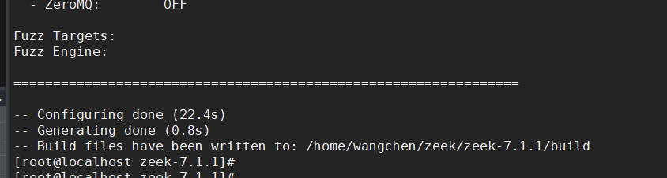
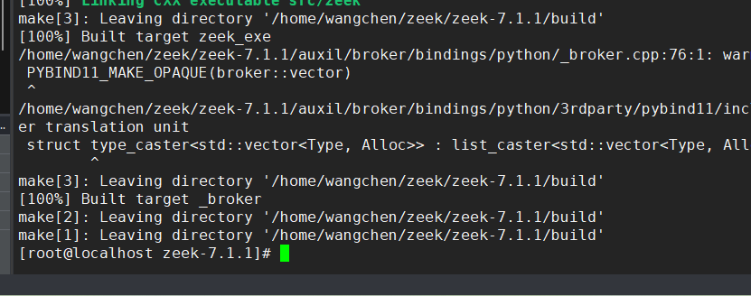
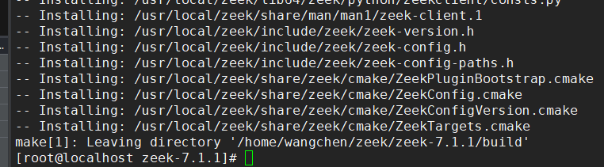

# Zeek项目文档

## 一、环境部署

### 步骤 1：安装 Python 3.11（或更新版本）

```less
# 可以优先安装sqlite
yum install sqlite-devel -y

sudo yum install gcc openssl-devel bzip2-devel libffi-devel -y
cd /usr/src
wget https://www.python.org/ftp/python/3.11.8/Python-3.11.8.tgz
tar xzf Python-3.11.8.tgz
cd Python-3.11.8
CFLAGS="-fPIC" ./configure --enable-optimizations
make -j$(nproc)
sudo make altinstall
```

⚠️ 注意：

- 不要使用 `make install`，以免覆盖系统默认的 Python。
- 编译完后确认 `python3.11` 所用模块中包含 `_sqlite3`。

这会安装到 `/usr/local/bin/python3.11`


### 步骤 2：安装cmake

```shell
 yum install gcc gcc-c++ -y
 yum install flex bison swig  -y
```

安装 SQLite 开发库

```less
yum install sqlite-devel -y
 
# 重新编译 Python
cd /path/to/Python-3.11.x

CFLAGS="-fPIC" ./configure --enable-optimizations
make -j$(nproc)
sudo make altinstall

# 测试
/usr/local/bin/python3.11 -c "import sqlite3; print(sqlite3.sqlite_version)"
```


```less
wget https://github.com/Kitware/CMake/releases/download/v3.28.3/cmake-3.28.3.tar.gz
tar -xzf cmake-3.28.3.tar.gz
cd cmake-3.28.3
./bootstrap --prefix=/usr/local
make -j$(nproc)
sudo make install
```


### 步骤 3：用 `CMake` 指定 Python 解释器路径

配置时添加：

```bash
cmake -DPython_EXECUTABLE=/usr/local/bin/python3.11 ..
```

### 步骤4 ：编译zeek

```less
./configure
```



```less
make -j
```



```less
make install
```



```less
# 默认程序路径
/usr/local/zeek/bin/zeek
echo 'export PATH=/usr/local/zeek/bin/zeek:$PATH' >> ~/.bashrc
source ~/.bashrc
```

